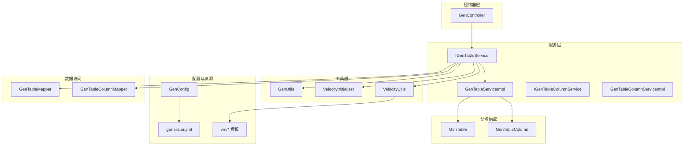
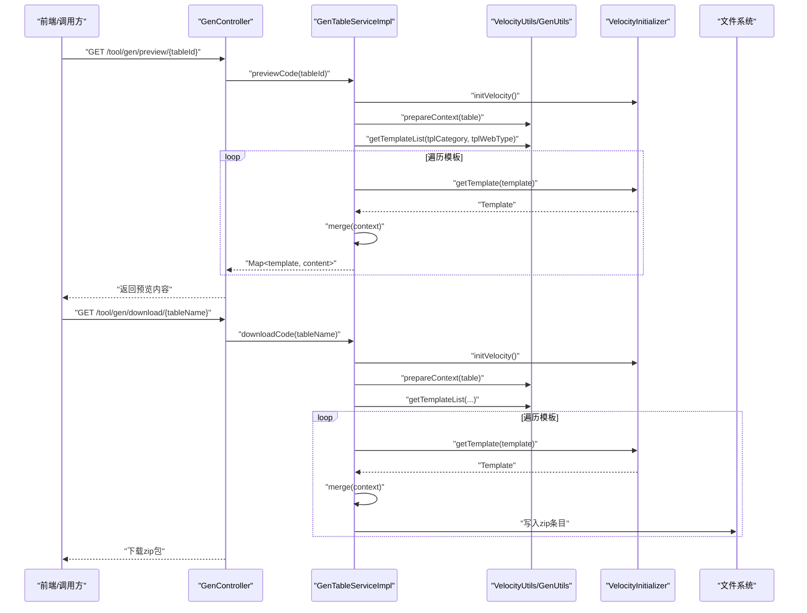
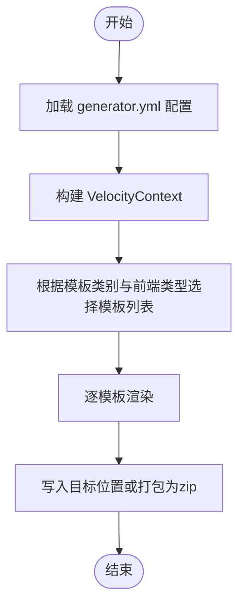
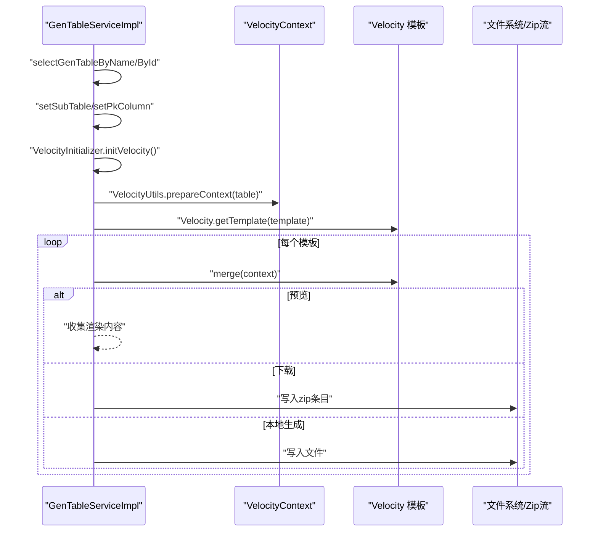
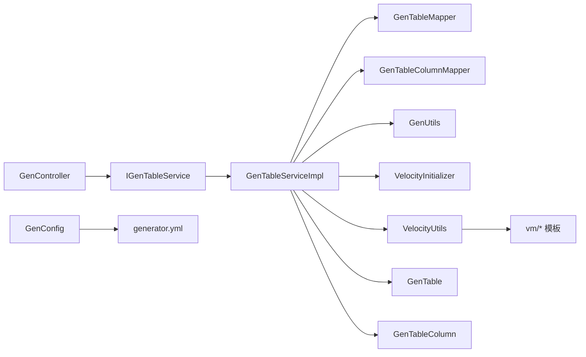

# 代码生成模块设计

<cite>
**本文档引用的文件**
- [GenConfig.java](file://blog-generator/src/main/java/blog/generator/config/GenConfig.java)
- [GenController.java](file://blog-generator/src/main/java/blog/generator/controller/GenController.java)
- [GenTable.java](file://blog-generator/src/main/java/blog/generator/domain/GenTable.java)
- [GenTableColumn.java](file://blog-generator/src/main/java/blog/generator/domain/GenTableColumn.java)
- [IGenTableService.java](file://blog-generator/src/main/java/blog/generator/service/IGenTableService.java)
- [IGenTableColumnService.java](file://blog-generator/src/main/java/blog/generator/service/IGenTableColumnService.java)
- [GenTableServiceImpl.java](file://blog-generator/src/main/java/blog/generator/service/GenTableServiceImpl.java)
- [GenTableColumnServiceImpl.java](file://blog-generator/src/main/java/blog/generator/service/GenTableColumnServiceImpl.java)
- [GenUtils.java](file://blog-generator/src/main/java/blog/generator/util/GenUtils.java)
- [VelocityInitializer.java](file://blog-generator/src/main/java/blog/generator/util/VelocityInitializer.java)
- [VelocityUtils.java](file://blog-generator/src/main/java/blog/generator/util/VelocityUtils.java)
- [generator.yml](file://blog-generator/src/main/resources/generator.yml)
- [GenTableMapper.java](file://blog-generator/src/main/java/blog/generator/mapper/GenTableMapper.java)
- [GenTableColumnMapper.java](file://blog-generator/src/main/java/blog/generator/mapper/GenTableColumnMapper.java)
</cite>

## 目录
1. [简介](#简介)
2. [项目结构](#项目结构)
3. [核心组件](#核心组件)
4. [架构总览](#架构总览)
5. [详细组件分析](#详细组件分析)
6. [依赖关系分析](#依赖关系分析)
7. [性能考虑](#性能考虑)
8. [故障排除指南](#故障排除指南)
9. [结论](#结论)
10. [附录](#附录)

## 简介
本设计文档面向 Leejie 博客系统的代码生成模块（blog-generator），系统性阐述其代码生成器的模板引擎、生成规则配置、代码模板系统与扩展机制。文档从架构设计、模板渲染流程、生成文件类型与定制化选项出发，提供模板配置示例、生成规则说明与扩展开发指南，帮助开发者快速理解并高效使用该模块。

## 项目结构
blog-generator 模块采用典型的分层架构：控制器层负责对外接口与权限控制；服务层承载业务逻辑与模板渲染；工具层封装生成规则与 Velocity 引擎初始化；资源层存放模板与配置文件。整体结构清晰、职责分离明确，便于维护与扩展。

图表来源
- [GenController.java:45-242](file://blog-generator/src/main/java/blog/generator/controller/GenController.java#L45-L242)
- [GenTableServiceImpl.java:47-470](file://blog-generator/src/main/java/blog/generator/service/GenTableServiceImpl.java#L47-L470)
- [GenUtils.java:17-223](file://blog-generator/src/main/java/blog/generator/util/GenUtils.java#L17-L223)
- [VelocityInitializer.java:13-31](file://blog-generator/src/main/java/blog/generator/util/VelocityInitializer.java#L13-L31)
- [VelocityUtils.java:22-364](file://blog-generator/src/main/java/blog/generator/util/VelocityUtils.java#L22-L364)
- [GenConfig.java:14-86](file://blog-generator/src/main/java/blog/generator/config/GenConfig.java#L14-L86)
- [generator.yml:1-12](file://blog-generator/src/main/resources/generator.yml#L1-L12)

章节来源
- [GenController.java:45-242](file://blog-generator/src/main/java/blog/generator/controller/GenController.java#L45-L242)
- [GenTableServiceImpl.java:47-470](file://blog-generator/src/main/java/blog/generator/service/GenTableServiceImpl.java#L47-L470)
- [GenUtils.java:17-223](file://blog-generator/src/main/java/blog/generator/util/GenUtils.java#L17-L223)
- [VelocityInitializer.java:13-31](file://blog-generator/src/main/java/blog/generator/util/VelocityInitializer.java#L13-L31)
- [VelocityUtils.java:22-364](file://blog-generator/src/main/java/blog/generator/util/VelocityUtils.java#L22-L364)
- [GenConfig.java:14-86](file://blog-generator/src/main/java/blog/generator/config/GenConfig.java#L14-L86)
- [generator.yml:1-12](file://blog-generator/src/main/resources/generator.yml#L1-L12)

## 核心组件
- 配置中心 GenConfig：集中管理作者、包路径、表前缀、覆盖策略等全局配置项，并通过注解读取 generator.yml。
- 控制器 GenController：提供代码生成的完整 HTTP 接口，包括列表查询、数据库表查询、导入表结构、创建表、预览、下载、生成到本地、同步数据库、批量生成等。
- 服务层 IGenTableService/GenTableServiceImpl：实现业务逻辑，包括表与列的查询、导入、更新、删除、预览、下载打包、生成到本地、同步数据库、校验参数等。
- 工具层 GenUtils：负责表名/业务名转换、列类型推断、HTML 控件类型选择、权限前缀生成等。
- 模板引擎 VelocityInitializer/VelocityUtils：初始化 Velocity 引擎、准备 VelocityContext、构建模板列表、计算生成文件路径与名称、生成导入包列表与字典组等。
- 领域模型 GenTable/GenTableColumn：承载业务表与列的元数据，支持 CRUD、树形、主子表三种模板类别。
- Mapper 层 GenTableMapper/GenTableColumnMapper：提供数据库访问能力，支撑导入、查询、创建表等操作。

章节来源
- [GenConfig.java:14-86](file://blog-generator/src/main/java/blog/generator/config/GenConfig.java#L14-L86)
- [GenController.java:45-242](file://blog-generator/src/main/java/blog/generator/controller/GenController.java#L45-L242)
- [IGenTableService.java:13-131](file://blog-generator/src/main/java/blog/generator/service/IGenTableService.java#L13-L131)
- [GenTableServiceImpl.java:47-470](file://blog-generator/src/main/java/blog/generator/service/GenTableServiceImpl.java#L47-L470)
- [GenUtils.java:17-223](file://blog-generator/src/main/java/blog/generator/util/GenUtils.java#L17-L223)
- [VelocityInitializer.java:13-31](file://blog-generator/src/main/java/blog/generator/util/VelocityInitializer.java#L13-L31)
- [VelocityUtils.java:22-364](file://blog-generator/src/main/java/blog/generator/util/VelocityUtils.java#L22-L364)
- [GenTable.java:20-177](file://blog-generator/src/main/java/blog/generator/domain/GenTable.java#L20-L177)
- [GenTableColumn.java:12-348](file://blog-generator/src/main/java/blog/generator/domain/GenTableColumn.java#L12-L348)
- [GenTableMapper.java:12-92](file://blog-generator/src/main/java/blog/generator/mapper/GenTableMapper.java#L12-L92)
- [GenTableColumnMapper.java:13-62](file://blog-generator/src/main/java/blog/generator/mapper/GenTableColumnMapper.java#L13-L62)

## 架构总览
代码生成模块遵循“控制器-服务-工具-模板”的分层设计，结合 Velocity 模板引擎完成从数据库表到前后端代码与 SQL 的一键生成。核心流程如下：

图表来源
- [GenController.java:174-241](file://blog-generator/src/main/java/blog/generator/controller/GenController.java#L174-L241)
- [GenTableServiceImpl.java:193-366](file://blog-generator/src/main/java/blog/generator/service/GenTableServiceImpl.java#L193-L366)
- [VelocityUtils.java:43-154](file://blog-generator/src/main/java/blog/generator/util/VelocityUtils.java#L43-L154)
- [VelocityInitializer.java:17-29](file://blog-generator/src/main/java/blog/generator/util/VelocityInitializer.java#L17-L29)

## 详细组件分析

### 配置中心与模板系统
- 配置加载：GenConfig 通过 @ConfigurationProperties 与 @PropertySource 读取 generator.yml 中的作者、包路径、自动去前缀、表前缀、覆盖策略等配置。
- 模板选择：VelocityUtils 根据模板类别（crud/tree/sub）与前端类型（element-ui/element-plus）动态拼装模板列表，确保生成文件类型与前端框架匹配。
- 文件命名：VelocityUtils.getFileName 计算 Java、XML、Vue、JS 等文件的输出路径与文件名，遵循标准目录结构。

图表来源
- [GenConfig.java:14-86](file://blog-generator/src/main/java/blog/generator/config/GenConfig.java#L14-L86)
- [generator.yml:1-12](file://blog-generator/src/main/resources/generator.yml#L1-L12)
- [VelocityUtils.java:129-207](file://blog-generator/src/main/java/blog/generator/util/VelocityUtils.java#L129-L207)

章节来源
- [GenConfig.java:14-86](file://blog-generator/src/main/java/blog/generator/config/GenConfig.java#L14-L86)
- [generator.yml:1-12](file://blog-generator/src/main/resources/generator.yml#L1-L12)
- [VelocityUtils.java:129-207](file://blog-generator/src/main/java/blog/generator/util/VelocityUtils.java#L129-L207)

### 生成规则与定制化选项
- 模板类别：
  - crud：单表增删改查，生成 VO/DTO/Domain/Mapper/Service/ServiceImpl/Controller、Mapper XML、SQL 菜单脚本、前端 index.vue。
  - tree：树形结构，额外生成树编码、父编码、名称字段与 expandColumn。
  - sub：主子表，生成主表与子表相关代码，以及子表关联字段。
- 前端类型：
  - element-ui：使用 vm/vue 下模板。
  - element-plus：使用 vm/vue/v3 下模板。
- 定制化选项：
  - 作者、包路径、模块名、业务名、功能名、生成路径、生成类型（zip/自定义路径）、树形字段、上级菜单等均来自 GenTable 及其 options 字段。
  - GenUtils 提供表名转类名、业务名、列类型推断、HTML 控件类型选择等规则。

章节来源
- [GenTable.java:54-177](file://blog-generator/src/main/java/blog/generator/domain/GenTable.java#L54-L177)
- [VelocityUtils.java:129-154](file://blog-generator/src/main/java/blog/generator/util/VelocityUtils.java#L129-L154)
- [GenUtils.java:17-223](file://blog-generator/src/main/java/blog/generator/util/GenUtils.java#L17-L223)

### 模板渲染与文件生成
- 预览模式：服务层查询表与列信息，设置主子表与主键列，初始化 Velocity，准备上下文，获取模板列表并逐个渲染，返回 Map<模板, 内容>。
- 下载模式：与预览类似，但将渲染结果写入 ZipOutputStream，最终以 zip 包形式下载。
- 本地生成模式：当允许覆盖时，按模板列表渲染并写入文件系统，生成路径由 getGenPath 计算。

图表来源
- [GenTableServiceImpl.java:193-366](file://blog-generator/src/main/java/blog/generator/service/GenTableServiceImpl.java#L193-L366)
- [VelocityUtils.java:43-77](file://blog-generator/src/main/java/blog/generator/util/VelocityUtils.java#L43-L77)
- [VelocityInitializer.java:17-29](file://blog-generator/src/main/java/blog/generator/util/VelocityInitializer.java#L17-L29)

章节来源
- [GenTableServiceImpl.java:193-366](file://blog-generator/src/main/java/blog/generator/service/GenTableServiceImpl.java#L193-L366)
- [VelocityUtils.java:43-77](file://blog-generator/src/main/java/blog/generator/util/VelocityUtils.java#L43-L77)
- [VelocityInitializer.java:17-29](file://blog-generator/src/main/java/blog/generator/util/VelocityInitializer.java#L17-L29)

### 扩展机制与开发指南
- 新增模板：在 resources/vm 下添加 .vm 文件，VelocityUtils.getTemplateList 中追加模板路径即可生效。
- 新增生成规则：可在 GenUtils 中扩展列类型推断、HTML 控件类型选择、导入包列表等规则。
- 新增模板类别：在 VelocityUtils.getTemplateList 中增加新类别分支，并在 GenTable 中扩展判断逻辑。
- 新增前端框架：在 VelocityUtils.getTemplateList 中根据 tplWebType 分支选择模板目录。
- 参数校验：在 GenTableServiceImpl.validateEdit 中扩展对新模板类别的参数校验。

章节来源
- [VelocityUtils.java:129-154](file://blog-generator/src/main/java/blog/generator/util/VelocityUtils.java#L129-L154)
- [GenUtils.java:17-223](file://blog-generator/src/main/java/blog/generator/util/GenUtils.java#L17-L223)
- [GenTableServiceImpl.java:373-392](file://blog-generator/src/main/java/blog/generator/service/GenTableServiceImpl.java#L373-L392)

## 依赖关系分析
- 控制器依赖服务接口，服务实现依赖 Mapper、工具类与 Velocity 工具。
- 领域模型 GenTable/GenTableColumn 作为数据载体，贯穿服务层与模板上下文。
- 配置中心与模板系统解耦，通过常量与工具类统一管理生成规则。

图表来源
- [GenController.java:45-242](file://blog-generator/src/main/java/blog/generator/controller/GenController.java#L45-L242)
- [GenTableServiceImpl.java:47-470](file://blog-generator/src/main/java/blog/generator/service/GenTableServiceImpl.java#L47-L470)
- [GenUtils.java:17-223](file://blog-generator/src/main/java/blog/generator/util/GenUtils.java#L17-L223)
- [VelocityUtils.java:22-364](file://blog-generator/src/main/java/blog/generator/util/VelocityUtils.java#L22-L364)
- [GenConfig.java:14-86](file://blog-generator/src/main/java/blog/generator/config/GenConfig.java#L14-L86)
- [generator.yml:1-12](file://blog-generator/src/main/resources/generator.yml#L1-L12)

章节来源
- [GenController.java:45-242](file://blog-generator/src/main/java/blog/generator/controller/GenController.java#L45-L242)
- [GenTableServiceImpl.java:47-470](file://blog-generator/src/main/java/blog/generator/service/GenTableServiceImpl.java#L47-L470)
- [GenUtils.java:17-223](file://blog-generator/src/main/java/blog/generator/util/GenUtils.java#L17-L223)
- [VelocityUtils.java:22-364](file://blog-generator/src/main/java/blog/generator/util/VelocityUtils.java#L22-L364)
- [GenConfig.java:14-86](file://blog-generator/src/main/java/blog/generator/config/GenConfig.java#L14-L86)
- [generator.yml:1-12](file://blog-generator/src/main/resources/generator.yml#L1-L12)

## 性能考虑
- 模板渲染：建议在服务层一次性初始化 Velocity 引擎，避免重复初始化带来的开销。
- 批量生成：使用 ZipOutputStream 一次性打包，减少磁盘 IO 次数。
- 列类型推断：GenUtils 中的类型判断逻辑已做缓存式处理，避免重复字符串解析。
- 数据库访问：Mapper 层使用 MyBatis Plus 基类，保证查询效率与可维护性。

## 故障排除指南
- 模板渲染失败：检查模板是否存在、编码是否正确、Velocity 初始化是否成功。
- 生成路径错误：确认 GenTable.genPath 与 getGenPath 返回路径是否符合预期。
- 权限不足：预览/下载/生成接口受权限控制，需确保用户具备相应权限。
- 覆盖策略：当 allowOverwrite=false 时，本地生成会被拒绝，需调整配置或使用下载模式。
- 同步数据库失败：当原表结构不存在或列不匹配时会抛出异常，需先导入表结构再同步。

章节来源
- [GenTableServiceImpl.java:238-267](file://blog-generator/src/main/java/blog/generator/service/GenTableServiceImpl.java#L238-L267)
- [GenController.java:196-205](file://blog-generator/src/main/java/blog/generator/controller/GenController.java#L196-L205)
- [GenTableServiceImpl.java:274-314](file://blog-generator/src/main/java/blog/generator/service/GenTableServiceImpl.java#L274-L314)

## 结论
blog-generator 模块通过清晰的分层设计与 Velocity 模板引擎，实现了从数据库表到多端代码与 SQL 的自动化生成。其配置中心、模板系统与扩展机制为二次开发提供了良好基础。遵循本文档的规则与最佳实践，可高效扩展新模板、新规则与新前端框架，满足多样化业务需求。

## 附录
- 模板配置示例（generator.yml）
  - 作者：leejie
  - 默认包路径：blog.biz
  - 自动去除表前缀：true
  - 表前缀：biz_
  - 允许覆盖到本地：true
- 生成规则说明
  - 模板类别：crud/tree/sub
  - 前端类型：element-ui/element-plus
  - 生成文件类型：Java、XML、Vue、JS、SQL
- 扩展开发指南
  - 在 resources/vm 下新增 .vm 模板并在 VelocityUtils.getTemplateList 中注册
  - 在 GenUtils 中扩展列类型与导入包规则
  - 在 GenTableServiceImpl.validateEdit 中完善参数校验

章节来源
- [generator.yml:1-12](file://blog-generator/src/main/resources/generator.yml#L1-L12)
- [VelocityUtils.java:129-154](file://blog-generator/src/main/java/blog/generator/util/VelocityUtils.java#L129-L154)
- [GenUtils.java:17-223](file://blog-generator/src/main/java/blog/generator/util/GenUtils.java#L17-L223)
- [GenTableServiceImpl.java:373-392](file://blog-generator/src/main/java/blog/generator/service/GenTableServiceImpl.java#L373-L392)