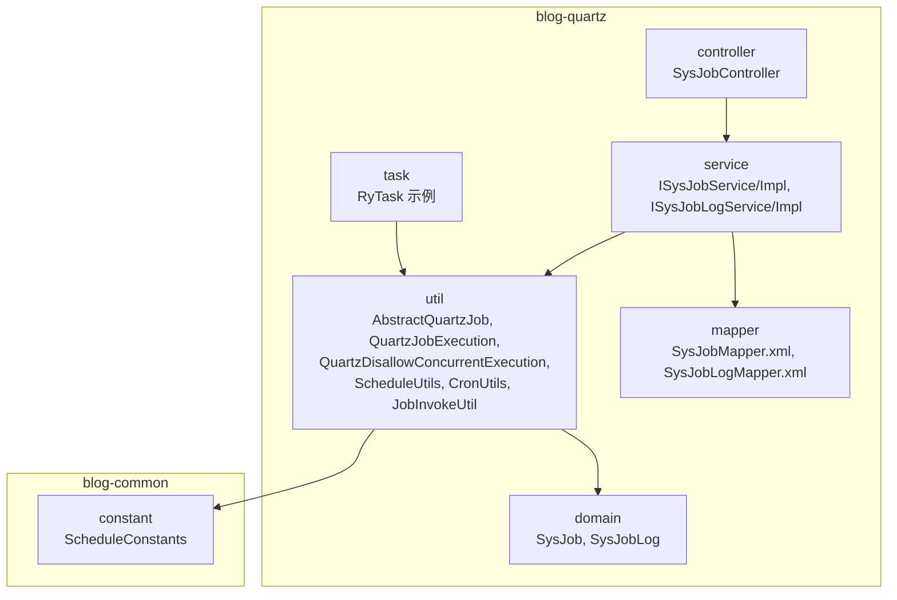
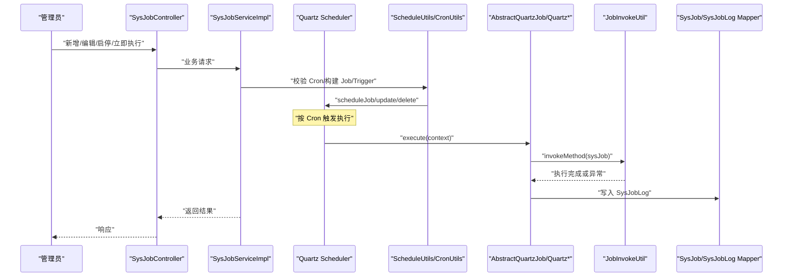
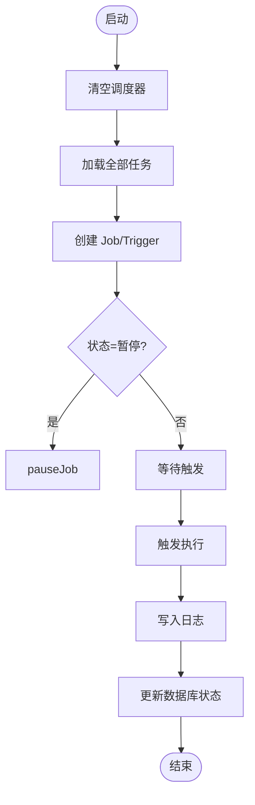
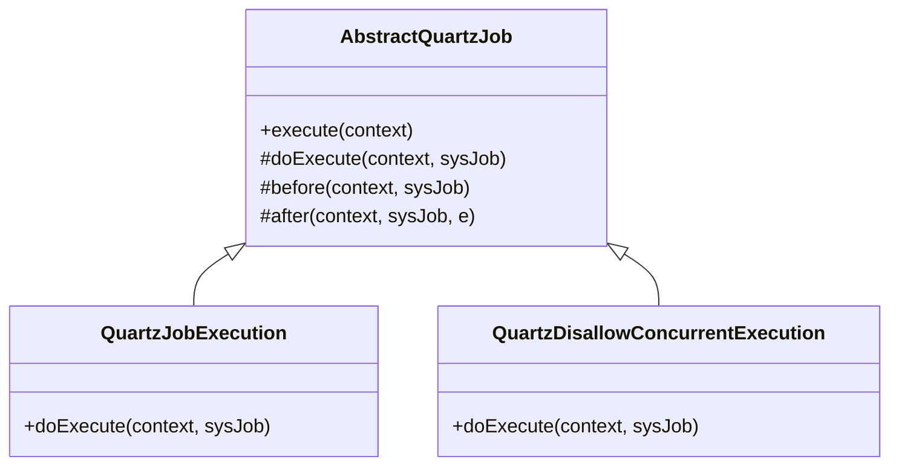
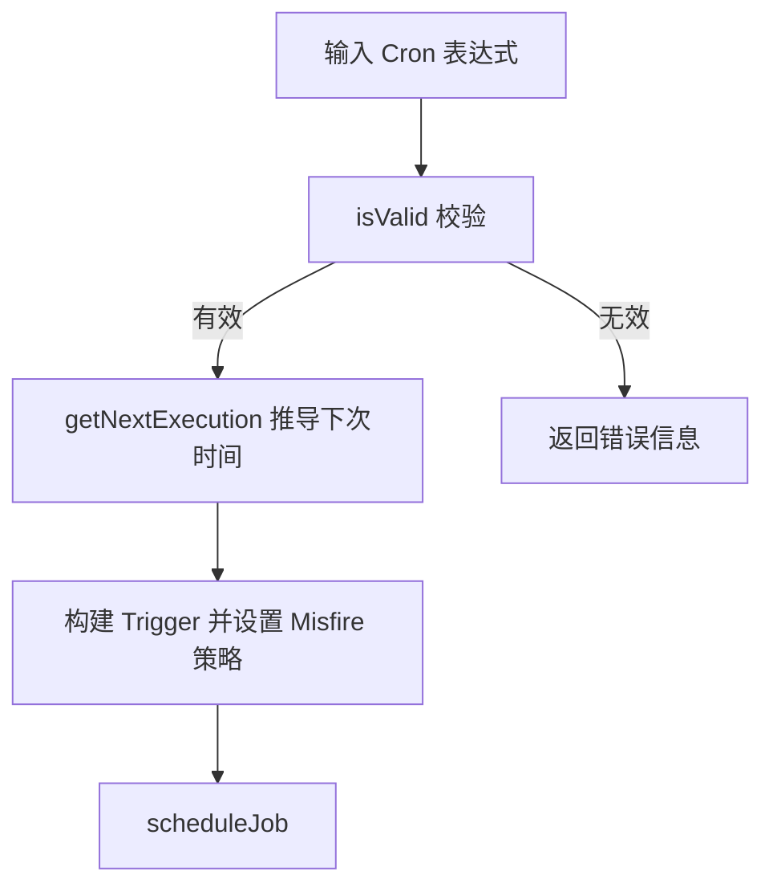
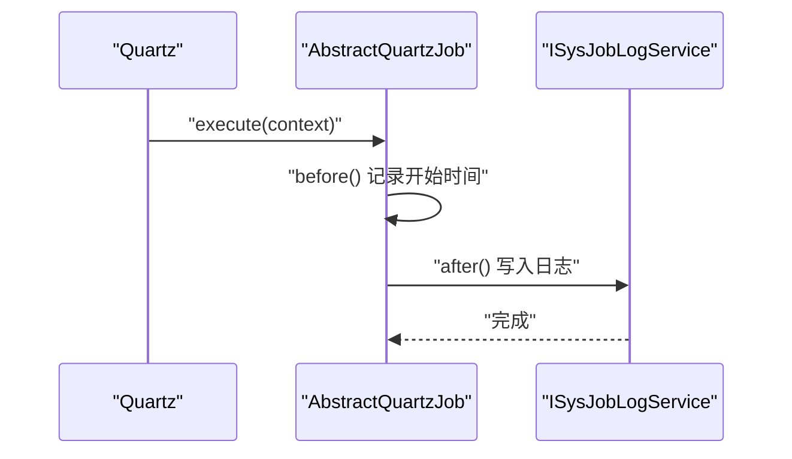
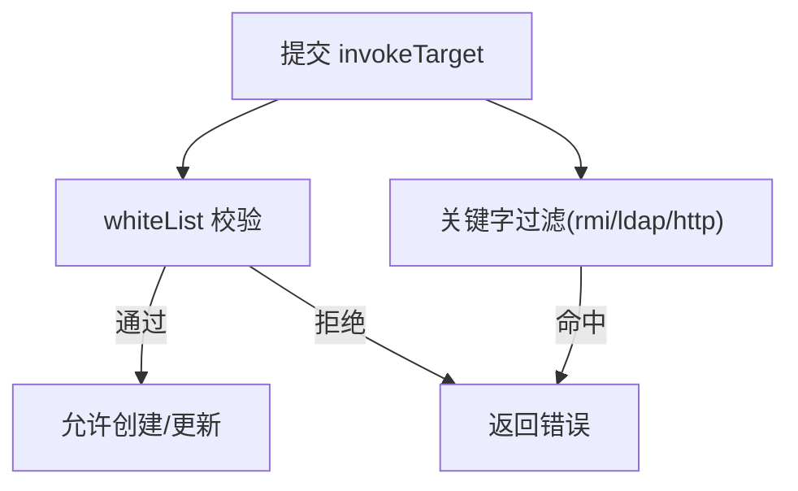
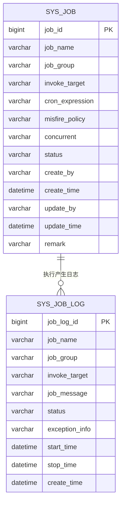
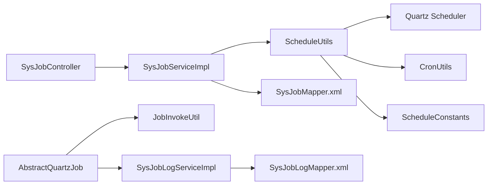

# 定时任务模块设计

<cite>
**本文引用的文件**
- [SysJob.java](file://blog-quartz/src/main/java/blog/quartz/domain/SysJob.java)
- [SysJobLog.java](file://blog-quartz/src/main/java/blog/quartz/domain/SysJobLog.java)
- [SysJobServiceImpl.java](file://blog-quartz/src/main/java/blog/quartz/service/impl/SysJobServiceImpl.java)
- [SysJobLogServiceImpl.java](file://blog-quartz/src/main/java/blog/quartz/service/impl/SysJobLogServiceImpl.java)
- [AbstractQuartzJob.java](file://blog-quartz/src/main/java/blog/quartz/util/AbstractQuartzJob.java)
- [QuartzJobExecution.java](file://blog-quartz/src/main/java/blog/quartz/util/QuartzJobExecution.java)
- [QuartzDisallowConcurrentExecution.java](file://blog-quartz/src/main/java/blog/quartz/util/QuartzDisallowConcurrentExecution.java)
- [ScheduleUtils.java](file://blog-quartz/src/main/java/blog/quartz/util/ScheduleUtils.java)
- [CronUtils.java](file://blog-quartz/src/main/java/blog/quartz/util/CronUtils.java)
- [JobInvokeUtil.java](file://blog-quartz/src/main/java/blog/quartz/util/JobInvokeUtil.java)
- [RyTask.java](file://blog-quartz/src/main/java/blog/quartz/task/RyTask.java)
- [SysJobController.java](file://blog-quartz/src/main/java/blog/quartz/controller/SysJobController.java)
- [SysJobMapper.xml](file://blog-quartz/src/main/resources/mapper/quartz/SysJobMapper.xml)
- [SysJobLogMapper.xml](file://blog-quartz/src/main/resources/mapper/quartz/SysJobLogMapper.xml)
- [ScheduleConstants.java](file://blog-common/src/main/java/blog/common/constant/ScheduleConstants.java)
</cite>

## 目录
1. [引言](#引言)
2. [项目结构](#项目结构)
3. [核心组件](#核心组件)
4. [架构总览](#架构总览)
5. [详细组件分析](#详细组件分析)
6. [依赖关系分析](#依赖关系分析)
7. [性能考虑](#性能考虑)
8. [故障排查指南](#故障排查指南)
9. [结论](#结论)
10. [附录](#附录)

## 引言
本设计文档围绕 Leejie 博客系统的定时任务模块（blog-quartz）展开，系统性阐述任务实体、调度实现、Cron 表达式解析与任务监控机制。重点说明任务调度架构、任务生命周期管理、并发控制策略与异常处理机制，并提供任务配置示例、调度策略说明与性能优化建议，帮助开发者快速理解并高效使用定时任务系统。

## 项目结构
blog-quartz 模块采用分层与职责分离的设计，包含领域模型、服务层、调度工具、控制器与持久化映射等层次，配合 blog-common 提供的常量与通用能力，形成完整的定时任务闭环。

图表来源
- [SysJobController.java:1-186](file://blog-quartz/src/main/java/blog/quartz/controller/SysJobController.java#L1-186)
- [SysJobServiceImpl.java:1-262](file://blog-quartz/src/main/java/blog/quartz/service/impl/SysJobServiceImpl.java#L1-262)
- [SysJobLogServiceImpl.java:1-88](file://blog-quartz/src/main/java/blog/quartz/service/impl/SysJobLogServiceImpl.java#L1-88)
- [AbstractQuartzJob.java:1-107](file://blog-quartz/src/main/java/blog/quartz/util/AbstractQuartzJob.java#L1-107)
- [ScheduleUtils.java:1-142](file://blog-quartz/src/main/java/blog/quartz/util/ScheduleUtils.java#L1-142)
- [CronUtils.java:1-64](file://blog-quartz/src/main/java/blog/quartz/util/CronUtils.java#L1-64)
- [JobInvokeUtil.java:1-183](file://blog-quartz/src/main/java/blog/quartz/util/JobInvokeUtil.java#L1-183)
- [RyTask.java:1-29](file://blog-quartz/src/main/java/blog/quartz/task/RyTask.java#L1-29)
- [SysJobMapper.xml:1-111](file://blog-quartz/src/main/resources/mapper/quartz/SysJobMapper.xml#L1-111)
- [SysJobLogMapper.xml:1-94](file://blog-quartz/src/main/resources/mapper/quartz/SysJobLogMapper.xml#L1-94)
- [ScheduleConstants.java:1-57](file://blog-common/src/main/java/blog/common/constant/ScheduleConstants.java#L1-57)

章节来源
- [SysJobController.java:1-186](file://blog-quartz/src/main/java/blog/quartz/controller/SysJobController.java#L1-186)
- [SysJobServiceImpl.java:1-262](file://blog-quartz/src/main/java/blog/quartz/service/impl/SysJobServiceImpl.java#L1-262)
- [SysJobLogServiceImpl.java:1-88](file://blog-quartz/src/main/java/blog/quartz/service/impl/SysJobLogServiceImpl.java#L1-88)
- [AbstractQuartzJob.java:1-107](file://blog-quartz/src/main/java/blog/quartz/util/AbstractQuartzJob.java#L1-107)
- [ScheduleUtils.java:1-142](file://blog-quartz/src/main/java/blog/quartz/util/ScheduleUtils.java#L1-142)
- [CronUtils.java:1-64](file://blog-quartz/src/main/java/blog/quartz/util/CronUtils.java#L1-64)
- [JobInvokeUtil.java:1-183](file://blog-quartz/src/main/java/blog/quartz/util/JobInvokeUtil.java#L1-183)
- [RyTask.java:1-29](file://blog-quartz/src/main/java/blog/quartz/task/RyTask.java#L1-29)
- [SysJobMapper.xml:1-111](file://blog-quartz/src/main/resources/mapper/quartz/SysJobMapper.xml#L1-111)
- [SysJobLogMapper.xml:1-94](file://blog-quartz/src/main/resources/mapper/quartz/SysJobLogMapper.xml#L1-94)
- [ScheduleConstants.java:1-57](file://blog-common/src/main/java/blog/common/constant/ScheduleConstants.java#L1-57)

## 核心组件
- 任务实体 SysJob：封装任务元数据（名称、组、Cron 表达式、并发策略、状态等），并提供下一次执行时间计算。
- 任务日志 SysJobLog：记录每次任务执行的开始/结束时间、状态、异常信息与耗时摘要。
- 服务层 SysJobServiceImpl：负责任务的增删改查、启停、立即执行、调度器初始化与更新。
- 调度工具 ScheduleUtils：封装 Quartz 的 JobDetail/Trigger 构建、Misfire 策略设置、白名单校验与调度创建。
- 抽象与具体执行器 AbstractQuartzJob、QuartzJobExecution、QuartzDisallowConcurrentExecution：统一执行入口与生命周期钩子，负责执行前后置处理与日志落库。
- Cron 解析 CronUtils：提供 Cron 表达式有效性校验与下一次执行时间推导。
- 反射调用 JobInvokeUtil：解析 invokeTarget 并反射调用目标方法，支持多种参数类型。
- 控制器 SysJobController：对外暴露 REST 接口，进行任务的查询、导入导出、新增/编辑、启停、立即执行与删除。
- Mapper XML：MyBatis 映射任务与日志表，提供 CRUD 与条件查询。

章节来源
- [SysJob.java:1-172](file://blog-quartz/src/main/java/blog/quartz/domain/SysJob.java#L1-172)
- [SysJobLog.java:1-156](file://blog-quartz/src/main/java/blog/quartz/domain/SysJobLog.java#L1-156)
- [SysJobServiceImpl.java:1-262](file://blog-quartz/src/main/java/blog/quartz/service/impl/SysJobServiceImpl.java#L1-262)
- [SysJobLogServiceImpl.java:1-88](file://blog-quartz/src/main/java/blog/quartz/service/impl/SysJobLogServiceImpl.java#L1-88)
- [AbstractQuartzJob.java:1-107](file://blog-quartz/src/main/java/blog/quartz/util/AbstractQuartzJob.java#L1-107)
- [QuartzJobExecution.java:1-20](file://blog-quartz/src/main/java/blog/quartz/util/QuartzJobExecution.java#L1-20)
- [QuartzDisallowConcurrentExecution.java:1-22](file://blog-quartz/src/main/java/blog/quartz/util/QuartzDisallowConcurrentExecution.java#L1-22)
- [ScheduleUtils.java:1-142](file://blog-quartz/src/main/java/blog/quartz/util/ScheduleUtils.java#L1-142)
- [CronUtils.java:1-64](file://blog-quartz/src/main/java/blog/quartz/util/CronUtils.java#L1-64)
- [JobInvokeUtil.java:1-183](file://blog-quartz/src/main/java/blog/quartz/util/JobInvokeUtil.java#L1-183)
- [SysJobController.java:1-186](file://blog-quartz/src/main/java/blog/quartz/controller/SysJobController.java#L1-186)
- [SysJobMapper.xml:1-111](file://blog-quartz/src/main/resources/mapper/quartz/SysJobMapper.xml#L1-111)
- [SysJobLogMapper.xml:1-94](file://blog-quartz/src/main/resources/mapper/quartz/SysJobLogMapper.xml#L1-94)

## 架构总览
定时任务系统围绕 Quartz 调度器构建，通过 ScheduleUtils 将 SysJob 映射为 Quartz 的 JobDetail/Trigger；AbstractQuartzJob 统一拦截执行流程，结合 JobInvokeUtil 完成目标方法反射调用；执行结果与异常写入 SysJobLog；SysJobServiceImpl 在数据库与调度器之间保持一致性。

图表来源
- [SysJobController.java:1-186](file://blog-quartz/src/main/java/blog/quartz/controller/SysJobController.java#L1-186)
- [SysJobServiceImpl.java:1-262](file://blog-quartz/src/main/java/blog/quartz/service/impl/SysJobServiceImpl.java#L1-262)
- [ScheduleUtils.java:1-142](file://blog-quartz/src/main/java/blog/quartz/util/ScheduleUtils.java#L1-142)
- [AbstractQuartzJob.java:1-107](file://blog-quartz/src/main/java/blog/quartz/util/AbstractQuartzJob.java#L1-107)
- [JobInvokeUtil.java:1-183](file://blog-quartz/src/main/java/blog/quartz/util/JobInvokeUtil.java#L1-183)
- [SysJobMapper.xml:1-111](file://blog-quartz/src/main/resources/mapper/quartz/SysJobMapper.xml#L1-111)
- [SysJobLogMapper.xml:1-94](file://blog-quartz/src/main/resources/mapper/quartz/SysJobLogMapper.xml#L1-94)

## 详细组件分析

### 任务实体与生命周期
- SysJob：承载任务元数据，提供下一次执行时间计算，便于前端展示与运维排障。
- 生命周期管理：
  - 初始化：应用启动时清空并重建所有任务，确保数据库与调度器一致。
  - 启停：通过状态字段与调度器 pause/resume 同步。
  - 删除：删除任务同时删除对应 Trigger。
  - 立即执行：构造 JobDataMap 并 triggerJob，用于调试与应急场景。
  - 更新：先删除旧 Job 再创建新 Job，保证调度器与数据库一致。

图表来源
- [SysJobServiceImpl.java:37-46](file://blog-quartz/src/main/java/blog/quartz/service/impl/SysJobServiceImpl.java#L37-46)
- [ScheduleUtils.java:60-98](file://blog-quartz/src/main/java/blog/quartz/util/ScheduleUtils.java#L60-98)
- [AbstractQuartzJob.java:32-51](file://blog-quartz/src/main/java/blog/quartz/util/AbstractQuartzJob.java#L32-51)

章节来源
- [SysJob.java:113-121](file://blog-quartz/src/main/java/blog/quartz/domain/SysJob.java#L113-121)
- [SysJobServiceImpl.java:37-46](file://blog-quartz/src/main/java/blog/quartz/service/impl/SysJobServiceImpl.java#L37-46)
- [SysJobServiceImpl.java:77-110](file://blog-quartz/src/main/java/blog/quartz/service/impl/SysJobServiceImpl.java#L77-110)
- [SysJobServiceImpl.java:117-146](file://blog-quartz/src/main/java/blog/quartz/service/impl/SysJobServiceImpl.java#L117-146)
- [SysJobServiceImpl.java:175-193](file://blog-quartz/src/main/java/blog/quartz/service/impl/SysJobServiceImpl.java#L175-193)
- [SysJobServiceImpl.java:200-229](file://blog-quartz/src/main/java/blog/quartz/service/impl/SysJobServiceImpl.java#L200-229)
- [ScheduleUtils.java:60-98](file://blog-quartz/src/main/java/blog/quartz/util/ScheduleUtils.java#L60-98)

### 并发控制策略
- 并发策略由 SysJob.concurrent 字段决定：
  - 允许并发：使用 QuartzJobExecution，多个实例可并行执行。
  - 禁止并发：使用 QuartzDisallowConcurrentExecution，Quartz 会阻塞新实例直到上一个释放。
- 两种策略均继承自 AbstractQuartzJob，确保统一的日志与异常处理。

图表来源
- [AbstractQuartzJob.java:1-107](file://blog-quartz/src/main/java/blog/quartz/util/AbstractQuartzJob.java#L1-107)
- [QuartzJobExecution.java:1-20](file://blog-quartz/src/main/java/blog/quartz/util/QuartzJobExecution.java#L1-20)
- [QuartzDisallowConcurrentExecution.java:1-22](file://blog-quartz/src/main/java/blog/quartz/util/QuartzDisallowConcurrentExecution.java#L1-22)

章节来源
- [ScheduleUtils.java:35-39](file://blog-quartz/src/main/java/blog/quartz/util/ScheduleUtils.java#L35-39)
- [SysJob.java:49-51](file://blog-quartz/src/main/java/blog/quartz/domain/SysJob.java#L49-51)
- [AbstractQuartzJob.java:32-51](file://blog-quartz/src/main/java/blog/quartz/util/AbstractQuartzJob.java#L32-51)

### Cron 表达式解析与调度策略
- Cron 校验：CronUtils 提供表达式合法性判断与错误信息提取。
- 下次执行时间：基于当前时间推导下一次有效执行时间，用于展示与排障。
- Misfire 策略：ScheduleUtils.handleCronScheduleMisfirePolicy 支持默认、忽略、仅触发一次、不做任何处理四种策略，异常时抛出配置错误。

图表来源
- [CronUtils.java:21-62](file://blog-quartz/src/main/java/blog/quartz/util/CronUtils.java#L21-62)
- [ScheduleUtils.java:103-120](file://blog-quartz/src/main/java/blog/quartz/util/ScheduleUtils.java#L103-120)
- [SysJob.java:113-121](file://blog-quartz/src/main/java/blog/quartz/domain/SysJob.java#L113-121)

章节来源
- [CronUtils.java:21-62](file://blog-quartz/src/main/java/blog/quartz/util/CronUtils.java#L21-62)
- [ScheduleUtils.java:103-120](file://blog-quartz/src/main/java/blog/quartz/util/ScheduleUtils.java#L103-120)
- [SysJob.java:101-111](file://blog-quartz/src/main/java/blog/quartz/domain/SysJob.java#L101-111)

### 任务监控与日志
- 执行前后置钩子：AbstractQuartzJob.before 记录开始时间，after 统计耗时、写入状态与异常信息。
- 日志落库：通过 SpringUtils 获取 ISysJobLogService 实例，异步写入数据库。
- 日志查询：SysJobLogServiceImpl 提供列表、详情、批量删除与清空接口。

图表来源
- [AbstractQuartzJob.java:32-96](file://blog-quartz/src/main/java/blog/quartz/util/AbstractQuartzJob.java#L32-96)
- [SysJobLogServiceImpl.java:50-54](file://blog-quartz/src/main/java/blog/quartz/service/impl/SysJobLogServiceImpl.java#L50-54)

章节来源
- [AbstractQuartzJob.java:59-96](file://blog-quartz/src/main/java/blog/quartz/util/AbstractQuartzJob.java#L59-96)
- [SysJobLogServiceImpl.java:27-86](file://blog-quartz/src/main/java/blog/quartz/service/impl/SysJobLogServiceImpl.java#L27-86)

### 任务配置与安全校验
- 白名单校验：ScheduleUtils.whiteList 限制仅允许受控包路径的目标方法，避免任意代码执行风险。
- 关键字过滤：对 rmi/ldap/http(s) 等高危关键字进行拦截。
- 控制器层：SysJobController 在新增/编辑时进行 Cron 校验与白名单检查，失败直接返回错误。

图表来源
- [SysJobController.java:85-108](file://blog-quartz/src/main/java/blog/quartz/controller/SysJobController.java#L85-108)
- [SysJobController.java:121-144](file://blog-quartz/src/main/java/blog/quartz/controller/SysJobController.java#L121-144)
- [ScheduleUtils.java:128-140](file://blog-quartz/src/main/java/blog/quartz/util/ScheduleUtils.java#L128-140)

章节来源
- [SysJobController.java:85-108](file://blog-quartz/src/main/java/blog/quartz/controller/SysJobController.java#L85-108)
- [SysJobController.java:121-144](file://blog-quartz/src/main/java/blog/quartz/controller/SysJobController.java#L121-144)
- [ScheduleUtils.java:128-140](file://blog-quartz/src/main/java/blog/quartz/util/ScheduleUtils.java#L128-140)

### 数据模型与持久化
- SysJob 表：存储任务元数据与状态。
- SysJobLog 表：存储每次执行的详细日志。
- MyBatis Mapper：提供条件查询、分页、批量删除与清空等能力。

图表来源
- [SysJobMapper.xml:7-21](file://blog-quartz/src/main/resources/mapper/quartz/SysJobMapper.xml#L7-21)
- [SysJobLogMapper.xml:7-16](file://blog-quartz/src/main/resources/mapper/quartz/SysJobLogMapper.xml#L7-16)

章节来源
- [SysJobMapper.xml:23-111](file://blog-quartz/src/main/resources/mapper/quartz/SysJobMapper.xml#L23-111)
- [SysJobLogMapper.xml:18-94](file://blog-quartz/src/main/resources/mapper/quartz/SysJobLogMapper.xml#L18-94)

## 依赖关系分析
- 控制器依赖服务层；服务层依赖调度工具与 Mapper；调度工具依赖 Quartz 与常量；执行器依赖反射工具；日志服务依赖 Mapper。
- 关键耦合点：
  - SysJobServiceImpl 与 ScheduleUtils：任务与调度器的绑定/解绑。
  - AbstractQuartzJob 与 JobInvokeUtil：执行链路统一入口与反射调用。
  - SysJobController 与 CronUtils/ScheduleUtils：配置阶段的安全与有效性校验。

图表来源
- [SysJobController.java:1-186](file://blog-quartz/src/main/java/blog/quartz/controller/SysJobController.java#L1-186)
- [SysJobServiceImpl.java:1-262](file://blog-quartz/src/main/java/blog/quartz/service/impl/SysJobServiceImpl.java#L1-262)
- [ScheduleUtils.java:1-142](file://blog-quartz/src/main/java/blog/quartz/util/ScheduleUtils.java#L1-142)
- [CronUtils.java:1-64](file://blog-quartz/src/main/java/blog/quartz/util/CronUtils.java#L1-64)
- [AbstractQuartzJob.java:1-107](file://blog-quartz/src/main/java/blog/quartz/util/AbstractQuartzJob.java#L1-107)
- [JobInvokeUtil.java:1-183](file://blog-quartz/src/main/java/blog/quartz/util/JobInvokeUtil.java#L1-183)
- [SysJobMapper.xml:1-111](file://blog-quartz/src/main/resources/mapper/quartz/SysJobMapper.xml#L1-111)
- [SysJobLogMapper.xml:1-94](file://blog-quartz/src/main/resources/mapper/quartz/SysJobLogMapper.xml#L1-94)
- [ScheduleConstants.java:1-57](file://blog-common/src/main/java/blog/common/constant/ScheduleConstants.java#L1-57)

章节来源
- [SysJobController.java:1-186](file://blog-quartz/src/main/java/blog/quartz/controller/SysJobController.java#L1-186)
- [SysJobServiceImpl.java:1-262](file://blog-quartz/src/main/java/blog/quartz/service/impl/SysJobServiceImpl.java#L1-262)
- [ScheduleUtils.java:1-142](file://blog-quartz/src/main/java/blog/quartz/util/ScheduleUtils.java#L1-142)
- [AbstractQuartzJob.java:1-107](file://blog-quartz/src/main/java/blog/quartz/util/AbstractQuartzJob.java#L1-107)
- [JobInvokeUtil.java:1-183](file://blog-quartz/src/main/java/blog/quartz/util/JobInvokeUtil.java#L1-183)
- [SysJobMapper.xml:1-111](file://blog-quartz/src/main/resources/mapper/quartz/SysJobMapper.xml#L1-111)
- [SysJobLogMapper.xml:1-94](file://blog-quartz/src/main/resources/mapper/quartz/SysJobLogMapper.xml#L1-94)
- [ScheduleConstants.java:1-57](file://blog-common/src/main/java/blog/common/constant/ScheduleConstants.java#L1-57)

## 性能考虑
- 并发策略选择：高频短任务建议禁止并发，避免资源争用；长耗时任务可允许并发，提升吞吐。
- Cron 设计：尽量均匀分布任务触发时间，避免在同一时刻大量任务同时执行。
- 日志落库：日志写入为同步步骤，建议控制日志字段大小与频率，必要时引入异步队列。
- 任务数量：合理拆分任务组，避免单调度器承载过多任务。
- 数据库压力：定期清理历史日志，设置合理的保留周期。

## 故障排查指南
- Cron 表达式无效：使用 CronUtils.getInvalidMessage 获取错误描述，修正后再创建。
- 任务未触发：检查任务状态、Misfire 策略与下一次执行时间；确认调度器未被意外清空。
- 并发冲突：若出现任务堆积，切换为禁止并发策略；或优化任务执行逻辑。
- 反射调用失败：核对 invokeTarget 格式与参数类型；确保目标 Bean 存在且方法签名匹配。
- 安全校验失败：检查白名单与关键字过滤规则，调整目标字符串。

章节来源
- [CronUtils.java:32-43](file://blog-quartz/src/main/java/blog/quartz/util/CronUtils.java#L32-43)
- [ScheduleUtils.java:103-120](file://blog-quartz/src/main/java/blog/quartz/util/ScheduleUtils.java#L103-120)
- [AbstractQuartzJob.java:46-50](file://blog-quartz/src/main/java/blog/quartz/util/AbstractQuartzJob.java#L46-50)
- [JobInvokeUtil.java:71-145](file://blog-quartz/src/main/java/blog/quartz/util/JobInvokeUtil.java#L71-145)
- [SysJobController.java:85-108](file://blog-quartz/src/main/java/blog/quartz/controller/SysJobController.java#L85-108)

## 结论
blog-quartz 模块以 Quartz 为核心，结合统一的抽象执行器、严格的配置校验与完善的日志监控，构建了稳定、可扩展的定时任务体系。通过清晰的并发控制、Misfire 策略与生命周期管理，开发者可以安全地配置与维护各类定时任务，满足博客系统多样化的后台作业需求。

## 附录

### 任务配置示例（说明性）
- 任务名称：用于标识与展示
- 任务组：用于分组管理与批量操作
- 调用目标字符串：支持 Bean 方法调用与带参调用，例如“ryTask.ryParams(参数)”或“ryTask.ryMultipleParams('a',true,1L,1.0,1)”
- Cron 表达式：如“0 0 2 * * ?”表示每日凌晨两点执行
- Misfire 策略：默认/忽略/仅触发一次/不做任何处理
- 并发策略：允许并发/禁止并发
- 任务状态：正常/暂停

章节来源
- [SysJob.java:29-55](file://blog-quartz/src/main/java/blog/quartz/domain/SysJob.java#L29-55)
- [RyTask.java:14-27](file://blog-quartz/src/main/java/blog/quartz/task/RyTask.java#L14-27)
- [ScheduleConstants.java:19-34](file://blog-common/src/main/java/blog/common/constant/ScheduleConstants.java#L19-34)