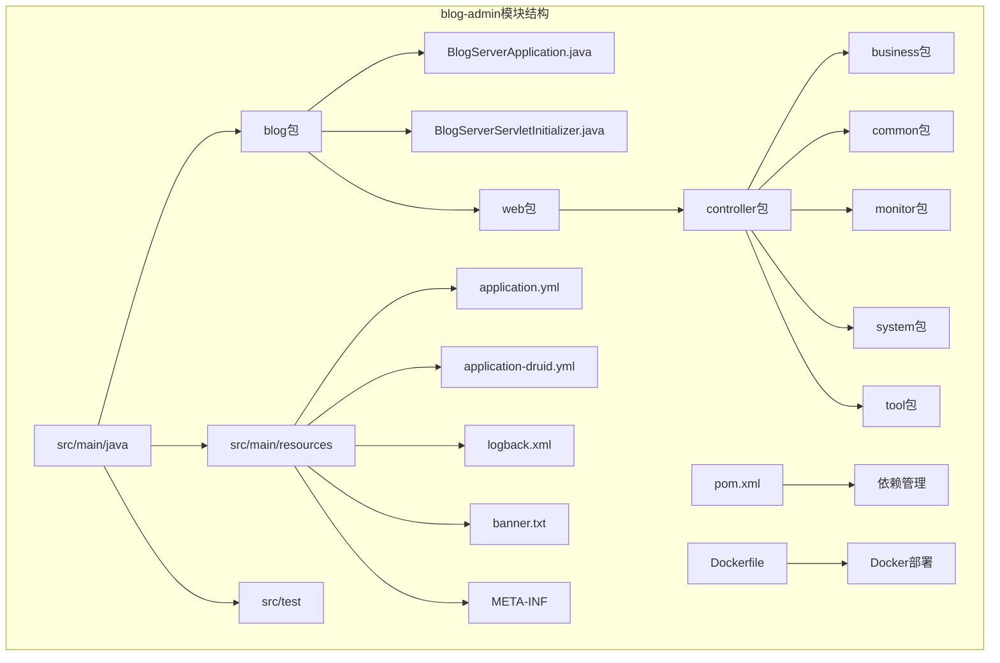
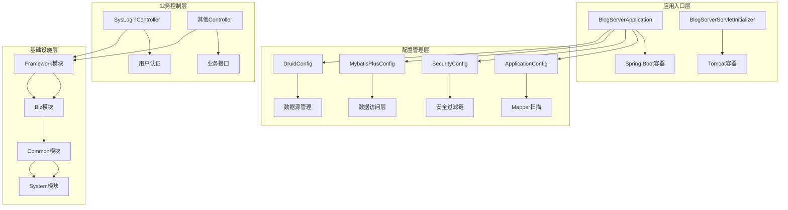
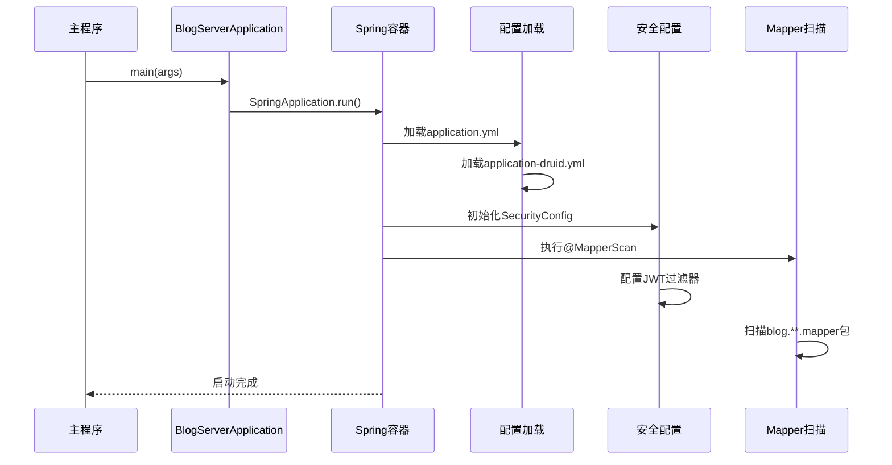
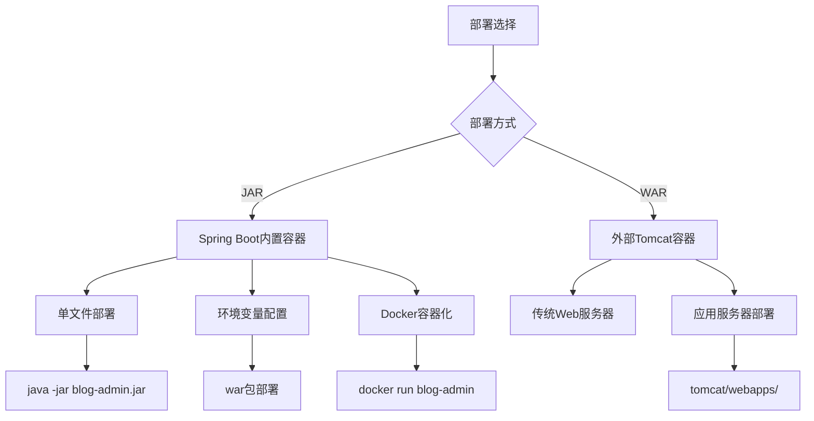
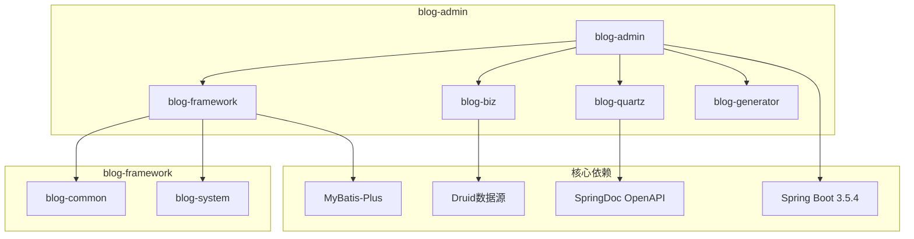

# 应用入口模块设计

<cite>
**本文档引用的文件**
- [BlogServerApplication.java](file://blog-admin/src/main/java/blog/BlogServerApplication.java)
- [BlogServerServletInitializer.java](file://blog-admin/src/main/java/blog/BlogServerServletInitializer.java)
- [pom.xml](file://blog-admin/pom.xml)
- [application.yml](file://blog-admin/src/main/resources/application.yml)
- [application-druid.yml](file://blog-admin/src/main/resources/application-druid.yml)
- [logback.xml](file://blog-admin/src/main/resources/logback.xml)
- [banner.txt](file://blog-admin/src/main/resources/banner.txt)
- [Dockerfile](file://blog-admin/Dockerfile)
- [ApplicationConfig.java](file://blog-framework/src/main/java/blog/framework/config/ApplicationConfig.java)
- [SecurityConfig.java](file://blog-framework/src/main/java/blog/framework/config/SecurityConfig.java)
- [MybatisPlusConfig.java](file://blog-framework/src/main/java/blog/framework/config/MybatisPlusConfig.java)
- [DruidConfig.java](file://blog-framework/src/main/java/blog/framework/config/DruidConfig.java)
- [SysLoginController.java](file://blog-admin/src/main/java/blog/web/controller/system/SysLoginController.java)
- [pom.xml](file://pom.xml)
</cite>

## 目录
1. [简介](#简介)
2. [项目结构](#项目结构)
3. [核心组件](#核心组件)
4. [架构概览](#架构概览)
5. [详细组件分析](#详细组件分析)
6. [依赖分析](#依赖分析)
7. [性能考虑](#性能考虑)
8. [故障排除指南](#故障排除指南)
9. [结论](#结论)
10. [附录](#附录)

## 简介

Leejie博客系统的应用入口模块（blog-admin）是整个博客系统的核心启动模块，采用Spring Boot 3.5.4构建，基于Java 17开发。该模块作为Web服务入口，负责系统启动、配置加载、安全控制和业务接口提供。

本模块采用Maven多模块架构设计，通过独立的启动类和Servlet初始化器实现灵活的部署方式，支持传统的JAR部署和WAR部署两种模式。模块集成了完整的安全体系、数据访问层、定时任务和代码生成功能。

## 项目结构

blog-admin模块采用标准的Spring Boot项目结构，主要包含以下关键目录：

**图表来源**
- [BlogServerApplication.java:1-22](file://blog-admin/src/main/java/blog/BlogServerApplication.java#L1-L22)
- [pom.xml:1-94](file://blog-admin/pom.xml#L1-L94)

**章节来源**
- [BlogServerApplication.java:1-22](file://blog-admin/src/main/java/blog/BlogServerApplication.java#L1-L22)
- [pom.xml:1-94](file://blog-admin/pom.xml#L1-L94)

## 核心组件

### 主启动类设计

BlogServerApplication是整个应用的启动入口，采用了精心设计的配置策略：

**启动类配置特点：**
- 使用`@SpringBootApplication(exclude = {DataSourceAutoConfiguration.class})`排除自动数据源配置
- 通过`@MapperScan("blog.**.mapper")`统一扫描所有模块的Mapper接口
- 设置devtools禁用以避免生产环境问题
- 采用静态属性设置确保devtools行为一致

**章节来源**
- [BlogServerApplication.java:8-22](file://blog-admin/src/main/java/blog/BlogServerApplication.java#L8-L22)

### Servlet初始化器

BlogServerServletInitializer实现了SpringBootServletInitializer接口，提供了WAR部署的支持：

**初始化器功能：**
- 继承SpringBootServletInitializer基类
- 重写configure方法返回SpringApplicationBuilder
- 指定主启动类作为应用源
- 支持外部Tomcat容器部署

**章节来源**
- [BlogServerServletInitializer.java:6-17](file://blog-admin/src/main/java/blog/BlogServerServletInitializer.java#L6-L17)

### 配置加载机制

应用采用多层次的配置加载策略：

**配置文件层次：**
1. `application.yml` - 主配置文件，包含基础应用配置
2. `application-druid.yml` - 数据源配置文件
3. `logback.xml` - 日志配置
4. `banner.txt` - 启动横幅配置

**配置特性：**
- 支持多环境配置切换
- 动态数据源配置
- 完整的日志分级管理
- 自定义Banner显示

**章节来源**
- [application.yml:1-161](file://blog-admin/src/main/resources/application.yml#L1-L161)
- [application-druid.yml:1-61](file://blog-admin/src/main/resources/application-druid.yml#L1-L61)
- [logback.xml:1-93](file://blog-admin/src/main/resources/logback.xml#L1-L93)

## 架构概览

应用入口模块采用分层架构设计，通过清晰的职责分离实现高内聚低耦合：

**图表来源**
- [BlogServerApplication.java:13-14](file://blog-admin/src/main/java/blog/BlogServerApplication.java#L13-L14)
- [ApplicationConfig.java:16-29](file://blog-framework/src/main/java/blog/framework/config/ApplicationConfig.java#L16-L29)
- [SecurityConfig.java:31-137](file://blog-framework/src/main/java/blog/framework/config/SecurityConfig.java#L31-L137)
- [SysLoginController.java:33-124](file://blog-admin/src/main/java/blog/web/controller/system/SysLoginController.java#L33-L124)

## 详细组件分析

### 启动流程分析

应用启动遵循标准的Spring Boot启动流程，但经过了特定的定制优化：

**图表来源**
- [BlogServerApplication.java:16-20](file://blog-admin/src/main/java/blog/BlogServerApplication.java#L16-L20)
- [application.yml:50-51](file://blog-admin/src/main/resources/application.yml#L50-L51)
- [SecurityConfig.java:94-127](file://blog-framework/src/main/java/blog/framework/config/SecurityConfig.java#L94-L127)

### 安全配置分析

系统采用基于JWT的无状态认证机制，通过多层过滤器实现全面的安全控制：

**安全过滤链设计：**
1. CORS过滤器 - 处理跨域请求
2. JWT认证过滤器 - 验证访问令牌
3. 用户名密码认证过滤器 - 处理登录请求
4. 退出过滤器 - 处理登出请求

**认证流程：**
- 禁用CSRF保护（无状态JWT）
- 基于Token的会话管理
- 方法级安全控制
- 匿名访问URL白名单

**章节来源**
- [SecurityConfig.java:94-127](file://blog-framework/src/main/java/blog/framework/config/SecurityConfig.java#L94-L127)
- [SysLoginController.java:56-64](file://blog-admin/src/main/java/blog/web/controller/system/SysLoginController.java#L56-L64)

### 数据访问层配置

采用MyBatis-Plus增强的数据访问层，提供完整的CRUD和分页功能：

**配置特性：**
- 自动分页插件
- 租户隔离支持
- 全局ID生成器
- 元对象字段填充

**章节来源**
- [MybatisPlusConfig.java:19-52](file://blog-framework/src/main/java/blog/framework/config/MybatisPlusConfig.java#L19-L52)

### 部署策略分析

模块支持多种部署方式，满足不同的生产环境需求：

**图表来源**
- [pom.xml:64-92](file://blog-admin/pom.xml#L64-L92)
- [Dockerfile:1-15](file://blog-admin/Dockerfile#L1-L15)

**章节来源**
- [pom.xml:11-12](file://blog-admin/pom.xml#L11-L12)
- [Dockerfile:1-15](file://blog-admin/Dockerfile#L1-L15)

## 依赖分析

### 模块依赖关系

blog-admin模块采用清晰的依赖层次结构，通过Maven实现模块间的松耦合：

**图表来源**
- [pom.xml:39-62](file://blog-admin/pom.xml#L39-L62)
- [pom.xml:225-233](file://pom.xml#L225-L233)

### 依赖管理策略

**版本统一管理：**
- 通过父POM统一管理依赖版本
- 使用dependencyManagement集中声明
- 支持子模块继承和覆盖

**模块化设计：**
- blog-admin仅依赖必要模块
- 业务逻辑与基础设施分离
- 可插拔的功能模块

**章节来源**
- [pom.xml:41-223](file://pom.xml#L41-L223)
- [pom.xml:39-62](file://blog-admin/pom.xml#L39-L62)

## 性能考虑

### 启动性能优化

应用启动经过多项优化以提升性能：

**启动优化措施：**
- 禁用devtools以避免生产环境开销
- 精确的包扫描范围
- 延迟初始化策略
- 缓存配置预热

### 运行时性能配置

**资源配置：**
- Tomcat线程池调优
- Redis连接池配置
- 文件上传大小限制
- 日志级别优化

**章节来源**
- [BlogServerApplication.java:17](file://blog-admin/src/main/java/blog/BlogServerApplication.java#L17)
- [application.yml:24-28](file://blog-admin/src/main/resources/application.yml#L24-L28)
- [application.yml:78-88](file://blog-admin/src/main/resources/application.yml#L78-L88)

## 故障排除指南

### 常见启动问题

**端口冲突：**
- 检查server.port配置
- 确认端口占用情况
- 修改为可用端口

**数据库连接问题：**
- 验证MySQL连接信息
- 检查Druid数据源配置
- 确认数据库服务状态

**配置文件加载失败：**
- 检查application.yml语法
- 验证文件编码格式
- 确认配置项正确性

### 日志分析

**日志配置：**
- 控制台输出级别
- 文件滚动策略
- 自定义日志分类

**章节来源**
- [logback.xml:74-93](file://blog-admin/src/main/resources/logback.xml#L74-L93)
- [application.yml:31-35](file://blog-admin/src/main/resources/application.yml#L31-L35)

## 结论

blog-admin应用入口模块展现了现代Spring Boot应用的最佳实践：

**设计优势：**
- 清晰的模块化架构
- 灵活的部署策略
- 完善的安全体系
- 高性能的配置管理

**技术特色：**
- 基于JWT的无状态认证
- 多数据源支持
- 完整的API文档
- 生产就绪的部署方案

该模块为整个Leejie博客系统提供了稳定可靠的应用入口，通过合理的架构设计和配置优化，确保了系统的可维护性和可扩展性。

## 附录

### 配置示例

**基础配置示例：**
- 服务器端口：9997
- 上下文路径：/
- 文件上传大小：10MB

**数据源配置示例：**
- MySQL驱动：com.mysql.cj.jdbc.Driver
- 连接池大小：20
- 连接超时：60000ms

### 最佳实践建议

**开发阶段：**
- 使用application-dev.yml进行本地开发
- 启用devtools提高开发效率
- 定期清理日志文件

**生产部署：**
- 使用Docker容器化部署
- 配置负载均衡和高可用
- 建立完善的监控告警机制

**安全加固：**
- 定期更新JWT密钥
- 配置防火墙规则
- 启用HTTPS协议