# 框架核心模块设计

<cite>
**本文引用的文件**
- [ApplicationConfig.java](file://blog-framework/src/main/java/blog/framework/config/ApplicationConfig.java)
- [SecurityConfig.java](file://blog-framework/src/main/java/blog/framework/config/SecurityConfig.java)
- [MybatisPlusConfig.java](file://blog-framework/src/main/java/blog/framework/config/MybatisPlusConfig.java)
- [DataScopeAspect.java](file://blog-framework/src/main/java/blog/framework/aspectj/DataScopeAspect.java)
- [DataSourceAspect.java](file://blog-framework/src/main/java/blog/framework/aspectj/DataSourceAspect.java)
- [LogAspect.java](file://blog-framework/src/main/java/blog/framework/aspectj/LogAspect.java)
- [RateLimiterAspect.java](file://blog-framework/src/main/java/blog/framework/aspectj/RateLimiterAspect.java)
- [DynamicDataSource.java](file://blog-framework/src/main/java/blog/framework/datasource/DynamicDataSource.java)
- [JwtAuthenticationTokenFilter.java](file://blog-framework/src/main/java/blog/framework/security/filter/JwtAuthenticationTokenFilter.java)
- [RepeatSubmitInterceptor.java](file://blog-framework/src/main/java/blog/framework/interceptor/RepeatSubmitInterceptor.java)
- [DruidConfig.java](file://blog-framework/src/main/java/blog/framework/config/DruidConfig.java)
- [RedisConfig.java](file://blog-framework/src/main/java/blog/framework/config/RedisConfig.java)
- [ThreadPoolConfig.java](file://blog-framework/src/main/java/blog/framework/config/ThreadPoolConfig.java)
- [FilterConfig.java](file://blog-framework/src/main/java/blog/framework/config/FilterConfig.java)
- [ResourcesConfig.java](file://blog-framework/src/main/java/blog/framework/config/ResourcesConfig.java)
- [TokenService.java](file://blog-framework/src/main/java/blog/framework/web/service/TokenService.java)
- [AsyncManager.java](file://blog-framework/src/main/java/blog/framework/manager/AsyncManager.java)
- [EntityMetaObjectHandler.java](file://blog-framework/src/main/java/blog/framework/handler/EntityMetaObjectHandler.java)
</cite>

## 目录
1. [简介](#简介)
2. [项目结构](#项目结构)
3. [核心组件](#核心组件)
4. [架构总览](#架构总览)
5. [详细组件分析](#详细组件分析)
6. [依赖分析](#依赖分析)
7. [性能考虑](#性能考虑)
8. [故障排查指南](#故障排查指南)
9. [结论](#结论)
10. [附录](#附录)

## 简介
本设计文档聚焦于 Leejie 博客系统的框架核心模块（blog-framework），系统性阐述其作为基础设施的设计理念与实现细节。重点覆盖以下方面：
- 应用配置(ApplicationConfig)：启用AOP代理、Mapper扫描与Jackson时区定制
- 安全配置(SecurityConfig)：基于Spring Security的无状态认证、跨域与过滤器链
- MyBatis-Plus配置(MybatisPlusConfig)：分页、雪花ID、元对象自动填充
- AOP切面：数据权限(DataScopeAspect)、多数据源(DataSourceAspect)、操作日志(LogAspect)、限流(RateLimiterAspect)
- 拦截器机制：重复提交拦截(RepeatSubmitInterceptor)
- 框架扩展点：动态数据源、Redis限流脚本、线程池与过滤器注册

目标是帮助开发者快速理解框架层的设计原则、配置管理策略与横切关注点的落地方式，并提供可操作的扩展指南。

## 项目结构
blog-framework 模块采用“按功能域分层”的组织方式，核心配置集中在 config 包，横切关注点分布在 aspectj、interceptor、security、datasource、manager、handler 等包中，形成清晰的职责边界与低耦合的模块化结构。

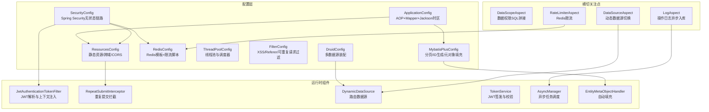

图表来源
- [ApplicationConfig.java:16-28](file://blog-framework/src/main/java/blog/framework/config/ApplicationConfig.java#L16-L28)
- [SecurityConfig.java:94-127](file://blog-framework/src/main/java/blog/framework/config/SecurityConfig.java#L94-L127)
- [MybatisPlusConfig.java:16-52](file://blog-framework/src/main/java/blog/framework/config/MybatisPlusConfig.java#L16-L52)
- [DruidConfig.java:33-57](file://blog-framework/src/main/java/blog/framework/config/DruidConfig.java#L33-L57)
- [RedisConfig.java:17-47](file://blog-framework/src/main/java/blog/framework/config/RedisConfig.java#L17-L47)
- [ThreadPoolConfig.java:18-58](file://blog-framework/src/main/java/blog/framework/config/ThreadPoolConfig.java#L18-L58)
- [FilterConfig.java:23-77](file://blog-framework/src/main/java/blog/framework/config/FilterConfig.java#L23-L77)
- [ResourcesConfig.java:24-68](file://blog-framework/src/main/java/blog/framework/config/ResourcesConfig.java#L24-L68)
- [DataScopeAspect.java:26-76](file://blog-framework/src/main/java/blog/framework/aspectj/DataScopeAspect.java#L26-L76)
- [DataSourceAspect.java:24-50](file://blog-framework/src/main/java/blog/framework/aspectj/DataSourceAspect.java#L24-L50)
- [LogAspect.java:42-134](file://blog-framework/src/main/java/blog/framework/aspectj/LogAspect.java#L42-L134)
- [RateLimiterAspect.java:28-65](file://blog-framework/src/main/java/blog/framework/aspectj/RateLimiterAspect.java#L28-L65)
- [JwtAuthenticationTokenFilter.java:26-49](file://blog-framework/src/main/java/blog/framework/security/filter/JwtAuthenticationTokenFilter.java#L26-L49)
- [RepeatSubmitInterceptor.java:20-48](file://blog-framework/src/main/java/blog/framework/interceptor/RepeatSubmitInterceptor.java#L20-L48)
- [DynamicDataSource.java:13-23](file://blog-framework/src/main/java/blog/framework/datasource/DynamicDataSource.java#L13-L23)
- [TokenService.java:32-142](file://blog-framework/src/main/java/blog/framework/web/service/TokenService.java#L32-L142)
- [AsyncManager.java:15-53](file://blog-framework/src/main/java/blog/framework/manager/AsyncManager.java#L15-L53)
- [EntityMetaObjectHandler.java:16-76](file://blog-framework/src/main/java/blog/framework/handler/EntityMetaObjectHandler.java#L16-L76)

章节来源
- [ApplicationConfig.java:16-28](file://blog-framework/src/main/java/blog/framework/config/ApplicationConfig.java#L16-L28)
- [SecurityConfig.java:94-127](file://blog-framework/src/main/java/blog/framework/config/SecurityConfig.java#L94-L127)
- [MybatisPlusConfig.java:16-52](file://blog-framework/src/main/java/blog/framework/config/MybatisPlusConfig.java#L16-L52)
- [DruidConfig.java:33-57](file://blog-framework/src/main/java/blog/framework/config/DruidConfig.java#L33-L57)
- [RedisConfig.java:17-47](file://blog-framework/src/main/java/blog/framework/config/RedisConfig.java#L17-L47)
- [ThreadPoolConfig.java:18-58](file://blog-framework/src/main/java/blog/framework/config/ThreadPoolConfig.java#L18-L58)
- [FilterConfig.java:23-77](file://blog-framework/src/main/java/blog/framework/config/FilterConfig.java#L23-L77)
- [ResourcesConfig.java:24-68](file://blog-framework/src/main/java/blog/framework/config/ResourcesConfig.java#L24-L68)

## 核心组件
- ApplicationConfig：启用AOP代理(exposeProxy=true)、Mapper扫描、Jackson时区定制，确保AOP上下文可访问与统一时区输出
- SecurityConfig：无状态JWT认证、CORS、CSRF禁用、异常处理、登出处理器、认证提供者与过滤器链组装
- MybatisPlusConfig：MyBatis-Plus拦截器(分页)、雪花ID生成器(结合网卡IP)、元对象自动填充(创建/更新时间与用户)
- DruidConfig：主从数据源装配、动态数据源包装、去广告过滤器注册
- RedisConfig：RedisTemplate序列化策略、限流Lua脚本注册
- ThreadPoolConfig：线程池与调度器配置，拒绝策略与异常打印
- FilterConfig：XSS过滤、Referer校验、可重复请求过滤器注册
- ResourcesConfig：静态资源映射、Swagger资源、CORS全局配置、重复提交拦截器注册

章节来源
- [ApplicationConfig.java:16-28](file://blog-framework/src/main/java/blog/framework/config/ApplicationConfig.java#L16-L28)
- [SecurityConfig.java:94-127](file://blog-framework/src/main/java/blog/framework/config/SecurityConfig.java#L94-L127)
- [MybatisPlusConfig.java:16-52](file://blog-framework/src/main/java/blog/framework/config/MybatisPlusConfig.java#L16-L52)
- [DruidConfig.java:33-57](file://blog-framework/src/main/java/blog/framework/config/DruidConfig.java#L33-L57)
- [RedisConfig.java:17-47](file://blog-framework/src/main/java/blog/framework/config/RedisConfig.java#L17-L47)
- [ThreadPoolConfig.java:18-58](file://blog-framework/src/main/java/blog/framework/config/ThreadPoolConfig.java#L18-L58)
- [FilterConfig.java:23-77](file://blog-framework/src/main/java/blog/framework/config/FilterConfig.java#L23-L77)
- [ResourcesConfig.java:24-68](file://blog-framework/src/main/java/blog/framework/config/ResourcesConfig.java#L24-L68)

## 架构总览
框架采用“配置即基础设施”的思想，通过多个@Configuration类集中管理横切能力与运行时组件。安全层以Spring Security为核心，结合JWT过滤器实现无状态认证；持久层通过MyBatis-Plus增强与自动填充；动态数据源与AOP切面共同实现多数据源与横切关注点；异步任务与线程池保障后台作业稳定性。

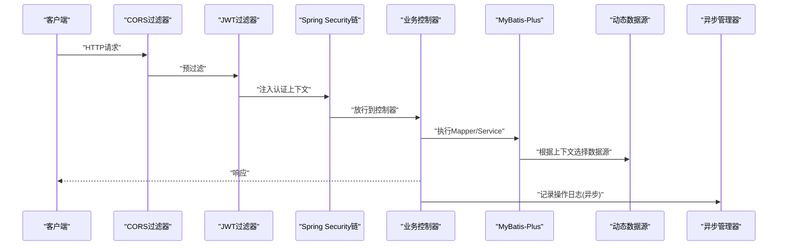

图表来源
- [SecurityConfig.java:94-127](file://blog-framework/src/main/java/blog/framework/config/SecurityConfig.java#L94-L127)
- [JwtAuthenticationTokenFilter.java:38-49](file://blog-framework/src/main/java/blog/framework/security/filter/JwtAuthenticationTokenFilter.java#L38-L49)
- [MybatisPlusConfig.java:19-35](file://blog-framework/src/main/java/blog/framework/config/MybatisPlusConfig.java#L19-L35)
- [DynamicDataSource.java:20-23](file://blog-framework/src/main/java/blog/framework/datasource/DynamicDataSource.java#L20-L23)
- [AsyncManager.java:43-45](file://blog-framework/src/main/java/blog/framework/manager/AsyncManager.java#L43-L45)

## 详细组件分析

### 应用配置(ApplicationConfig)
- 职责：启用AOP代理(exposeProxy=true)以便在同进程内通过AopContext调用；扫描Mapper包；统一Jackson时区
- 关键点：MapperScan("blog.**.mapper")确保所有模块的Mapper被纳入容器；Jackson时区定制避免序列化时区偏差

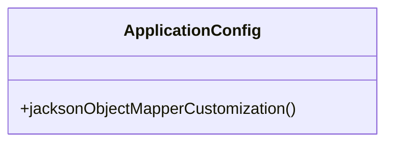

图表来源
- [ApplicationConfig.java:16-28](file://blog-framework/src/main/java/blog/framework/config/ApplicationConfig.java#L16-L28)

章节来源
- [ApplicationConfig.java:16-28](file://blog-framework/src/main/java/blog/framework/config/ApplicationConfig.java#L16-L28)

### 安全配置(SecurityConfig)
- 职责：构建无状态认证链路，禁用CSRF与缓存头，配置匿名访问白名单，注册JWT过滤器与CORS过滤器，提供BCrypt密码编码器
- 过滤器链顺序：CorsFilter → JwtAuthenticationTokenFilter → UsernamePasswordAuthenticationFilter → LogoutFilter
- 认证提供者：CustomAuthenticationProvider，支持自定义认证逻辑

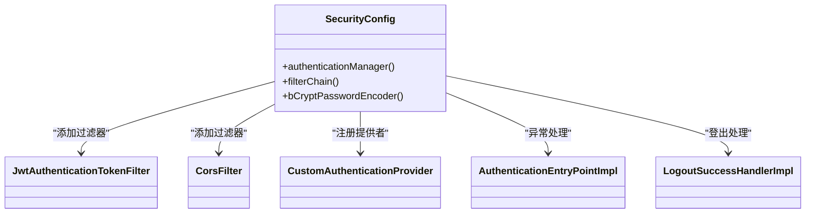

图表来源
- [SecurityConfig.java:31-136](file://blog-framework/src/main/java/blog/framework/config/SecurityConfig.java#L31-L136)
- [JwtAuthenticationTokenFilter.java:26-49](file://blog-framework/src/main/java/blog/framework/security/filter/JwtAuthenticationTokenFilter.java#L26-L49)

章节来源
- [SecurityConfig.java:94-127](file://blog-framework/src/main/java/blog/framework/config/SecurityConfig.java#L94-L127)
- [JwtAuthenticationTokenFilter.java:38-49](file://blog-framework/src/main/java/blog/framework/security/filter/JwtAuthenticationTokenFilter.java#L38-L49)

### MyBatis-Plus配置(MybatisPlusConfig)
- 职责：注册MyBatis-Plus拦截器(分页)，启用分页溢出保护；使用基于网卡IP的雪花ID生成器；注册元对象自动填充器
- 性能与一致性：分页溢出保护避免越界；雪花ID结合本地IP减少集群冲突

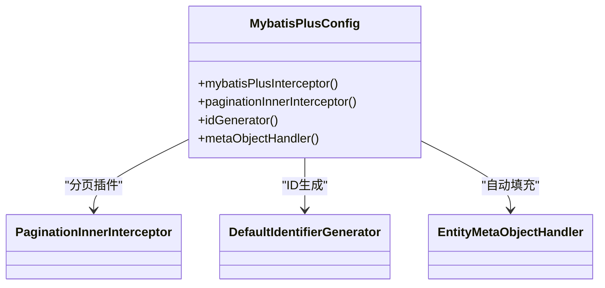

图表来源
- [MybatisPlusConfig.java:16-52](file://blog-framework/src/main/java/blog/framework/config/MybatisPlusConfig.java#L16-L52)
- [EntityMetaObjectHandler.java:16-76](file://blog-framework/src/main/java/blog/framework/handler/EntityMetaObjectHandler.java#L16-L76)

章节来源
- [MybatisPlusConfig.java:19-52](file://blog-framework/src/main/java/blog/framework/config/MybatisPlusConfig.java#L19-L52)
- [EntityMetaObjectHandler.java:24-76](file://blog-framework/src/main/java/blog/framework/handler/EntityMetaObjectHandler.java#L24-L76)

### 数据权限切面(DataScopeAspect)
- 职责：在控制器方法执行前，根据用户角色与权限字符动态拼接SQL条件，注入BaseEntity.params中的dataScope键，实现数据范围控制
- 关键流程：清理旧条件 → 解析权限 → 构建SQL片段 → 写回BaseEntity.params

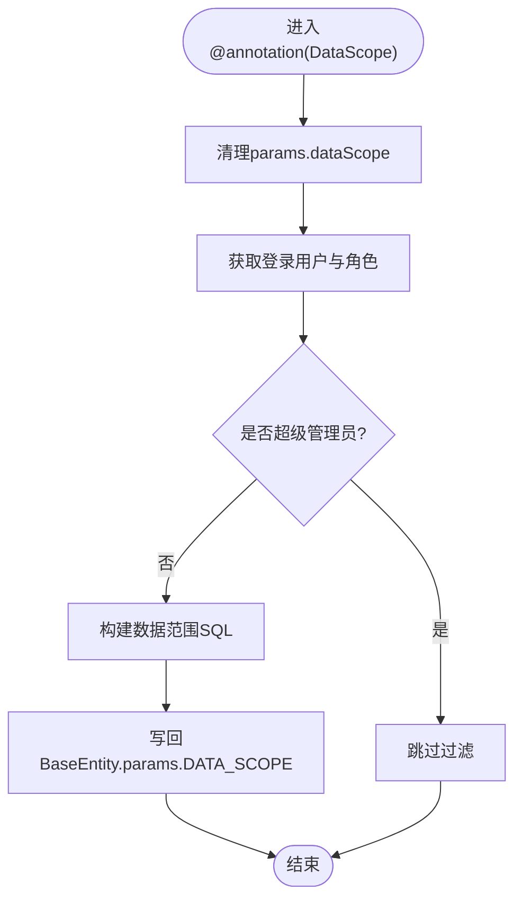

图表来源
- [DataScopeAspect.java:59-152](file://blog-framework/src/main/java/blog/framework/aspectj/DataScopeAspect.java#L59-L152)

章节来源
- [DataScopeAspect.java:65-152](file://blog-framework/src/main/java/blog/framework/aspectj/DataScopeAspect.java#L65-L152)

### 多数据源切面(DataSourceAspect)
- 职责：基于@DataSource注解在方法或类级别切换数据源；环绕通知中设置与清理上下文，保证线程安全
- 关键点：优先方法注解，其次类注解；finally中清理，避免内存泄漏

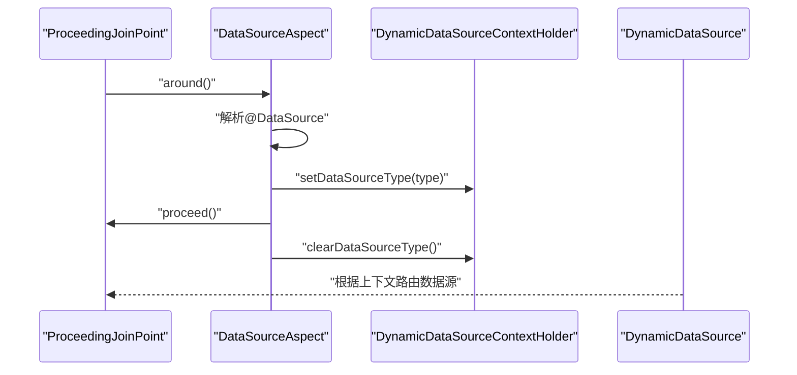

图表来源
- [DataSourceAspect.java:36-50](file://blog-framework/src/main/java/blog/framework/aspectj/DataSourceAspect.java#L36-L50)
- [DynamicDataSource.java:20-23](file://blog-framework/src/main/java/blog/framework/datasource/DynamicDataSource.java#L20-L23)

章节来源
- [DataSourceAspect.java:30-63](file://blog-framework/src/main/java/blog/framework/aspectj/DataSourceAspect.java#L30-L63)
- [DynamicDataSource.java:13-23](file://blog-framework/src/main/java/blog/framework/datasource/DynamicDataSource.java#L13-L23)

### 操作日志切面(LogAspect)
- 职责：前置记录开始时间，返回或异常时异步记录操作日志，屏蔽敏感字段，支持请求/响应数据保存
- 异步化：通过AsyncManager与ScheduledExecutorService异步入库，降低接口延迟

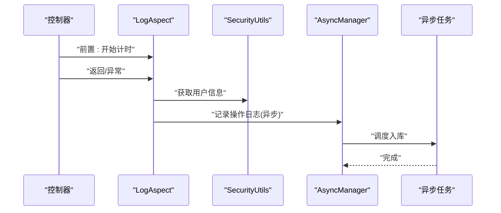

图表来源
- [LogAspect.java:60-134](file://blog-framework/src/main/java/blog/framework/aspectj/LogAspect.java#L60-L134)
- [AsyncManager.java:43-45](file://blog-framework/src/main/java/blog/framework/manager/AsyncManager.java#L43-L45)

章节来源
- [LogAspect.java:86-159](file://blog-framework/src/main/java/blog/framework/aspectj/LogAspect.java#L86-L159)
- [AsyncManager.java:15-53](file://blog-framework/src/main/java/blog/framework/manager/AsyncManager.java#L15-L53)

### 限流切面(RateLimiterAspect)
- 职责：基于Redis Lua脚本实现限流，支持按IP/全局维度与不同时间窗口；异常时抛出业务异常
- 关键点：组合Key包含自定义key、IP、类名+方法名；脚本原子性保证并发安全

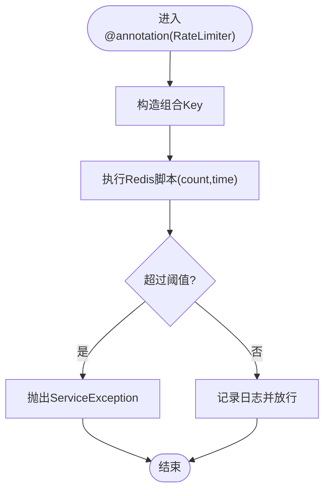

图表来源
- [RateLimiterAspect.java:47-77](file://blog-framework/src/main/java/blog/framework/aspectj/RateLimiterAspect.java#L47-L77)
- [RedisConfig.java:42-65](file://blog-framework/src/main/java/blog/framework/config/RedisConfig.java#L42-L65)

章节来源
- [RateLimiterAspect.java:47-77](file://blog-framework/src/main/java/blog/framework/aspectj/RateLimiterAspect.java#L47-L77)
- [RedisConfig.java:42-65](file://blog-framework/src/main/java/blog/framework/config/RedisConfig.java#L42-L65)

### 重复提交拦截器(RepeatSubmitInterceptor)
- 职责：基于注解的重复提交检测，抽象方法交由子类实现具体规则；命中则直接返回错误响应
- 使用场景：防止表单重复提交、幂等性控制

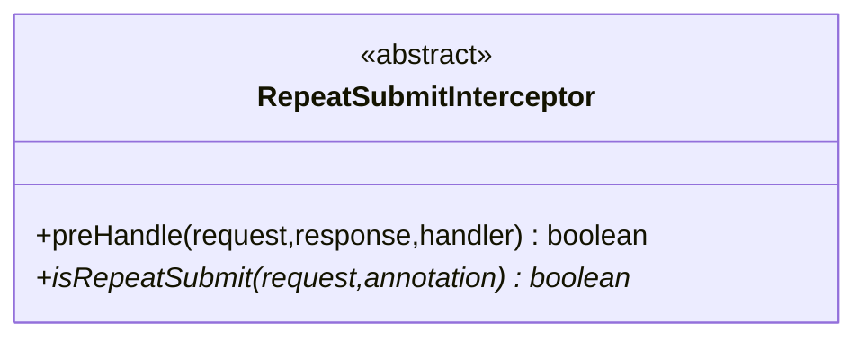

图表来源
- [RepeatSubmitInterceptor.java:20-48](file://blog-framework/src/main/java/blog/framework/interceptor/RepeatSubmitInterceptor.java#L20-L48)

章节来源
- [RepeatSubmitInterceptor.java:20-48](file://blog-framework/src/main/java/blog/framework/interceptor/RepeatSubmitInterceptor.java#L20-L48)

### 动态数据源(DynamicDataSource)
- 职责：继承AbstractRoutingDataSource，依据上下文决定当前数据源
- 与切面配合：通过@DataSourceAspect设置/清理上下文，实现方法级数据源切换

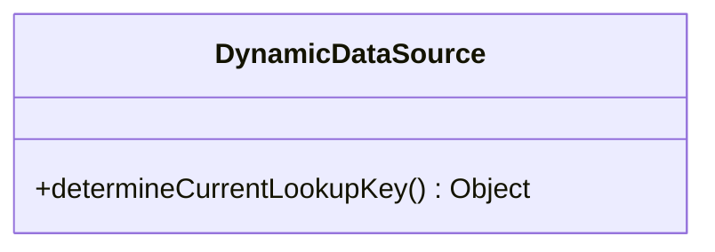

图表来源
- [DynamicDataSource.java:13-23](file://blog-framework/src/main/java/blog/framework/datasource/DynamicDataSource.java#L13-L23)

章节来源
- [DynamicDataSource.java:13-23](file://blog-framework/src/main/java/blog/framework/datasource/DynamicDataSource.java#L13-L23)

### JWT过滤器(JwtAuthenticationTokenFilter)
- 职责：从请求头提取Token，解析用户信息，校验有效性，注入SecurityContext
- 与TokenService协作：获取用户、校验Token、刷新过期时间

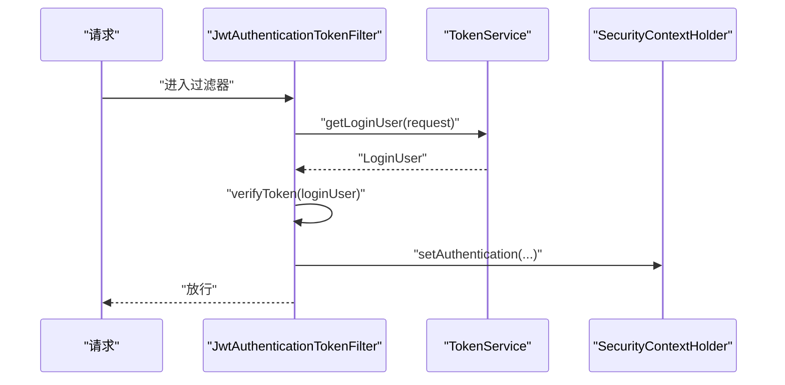

图表来源
- [JwtAuthenticationTokenFilter.java:38-49](file://blog-framework/src/main/java/blog/framework/security/filter/JwtAuthenticationTokenFilter.java#L38-L49)
- [TokenService.java:62-142](file://blog-framework/src/main/java/blog/framework/web/service/TokenService.java#L62-L142)

章节来源
- [JwtAuthenticationTokenFilter.java:38-49](file://blog-framework/src/main/java/blog/framework/security/filter/JwtAuthenticationTokenFilter.java#L38-L49)
- [TokenService.java:62-142](file://blog-framework/src/main/java/blog/framework/web/service/TokenService.java#L62-L142)

### 线程池与异步管理
- ThreadPoolConfig：线程池与调度器配置，拒绝策略为调用方执行，便于降载保护
- AsyncManager：单例封装ScheduledExecutorService，延迟10ms执行异步任务，避免瞬时抖动

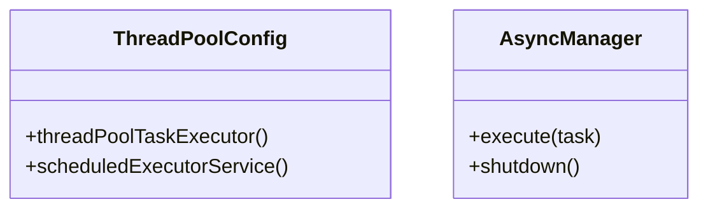

图表来源
- [ThreadPoolConfig.java:32-58](file://blog-framework/src/main/java/blog/framework/config/ThreadPoolConfig.java#L32-L58)
- [AsyncManager.java:15-53](file://blog-framework/src/main/java/blog/framework/manager/AsyncManager.java#L15-L53)

章节来源
- [ThreadPoolConfig.java:18-58](file://blog-framework/src/main/java/blog/framework/config/ThreadPoolConfig.java#L18-L58)
- [AsyncManager.java:15-53](file://blog-framework/src/main/java/blog/framework/manager/AsyncManager.java#L15-L53)

### 过滤器与资源配置
- FilterConfig：XSS过滤、Referer校验、可重复请求过滤器注册，支持按开关与配置启用
- ResourcesConfig：静态资源映射、Swagger资源、CORS全局配置、重复提交拦截器注册

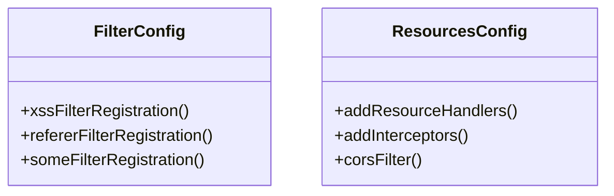

图表来源
- [FilterConfig.java:34-77](file://blog-framework/src/main/java/blog/framework/config/FilterConfig.java#L34-L77)
- [ResourcesConfig.java:29-68](file://blog-framework/src/main/java/blog/framework/config/ResourcesConfig.java#L29-L68)

章节来源
- [FilterConfig.java:23-77](file://blog-framework/src/main/java/blog/framework/config/FilterConfig.java#L23-L77)
- [ResourcesConfig.java:24-68](file://blog-framework/src/main/java/blog/framework/config/ResourcesConfig.java#L24-L68)

## 依赖分析
- 组件内聚：各配置类职责单一，围绕特定横切能力聚合
- 组件耦合：SecurityConfig与JwtAuthenticationTokenFilter强关联；LogAspect与AsyncManager存在异步耦合；RateLimiterAspect依赖RedisConfig提供的脚本
- 外部依赖：Spring Security、MyBatis-Plus、Redis、Druid、Spring MVC/WebFlux(未使用)

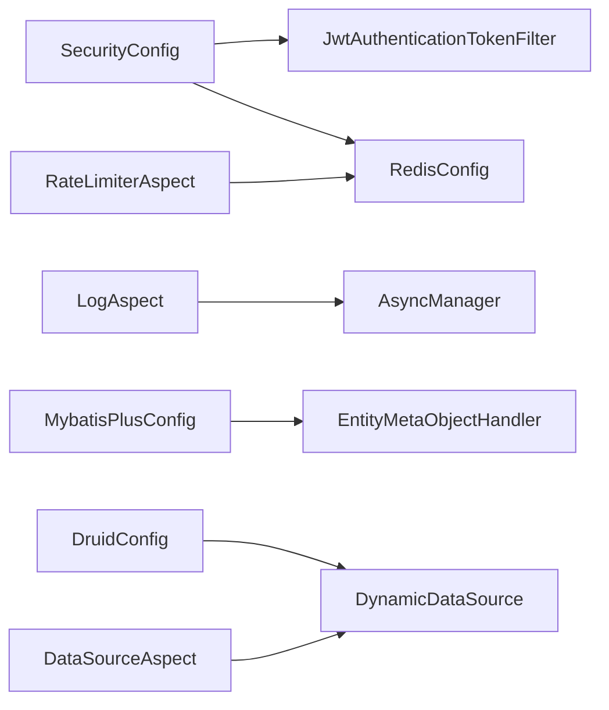

图表来源
- [SecurityConfig.java:94-127](file://blog-framework/src/main/java/blog/framework/config/SecurityConfig.java#L94-L127)
- [JwtAuthenticationTokenFilter.java:26-49](file://blog-framework/src/main/java/blog/framework/security/filter/JwtAuthenticationTokenFilter.java#L26-L49)
- [RedisConfig.java:17-47](file://blog-framework/src/main/java/blog/framework/config/RedisConfig.java#L17-L47)
- [LogAspect.java:125-126](file://blog-framework/src/main/java/blog/framework/aspectj/LogAspect.java#L125-L126)
- [AsyncManager.java:24-24](file://blog-framework/src/main/java/blog/framework/manager/AsyncManager.java#L24-L24)
- [RateLimiterAspect.java:33-45](file://blog-framework/src/main/java/blog/framework/aspectj/RateLimiterAspect.java#L33-L45)
- [MybatisPlusConfig.java:49-52](file://blog-framework/src/main/java/blog/framework/config/MybatisPlusConfig.java#L49-L52)
- [EntityMetaObjectHandler.java:16-16](file://blog-framework/src/main/java/blog/framework/handler/EntityMetaObjectHandler.java#L16-L16)
- [DruidConfig.java:50-57](file://blog-framework/src/main/java/blog/framework/config/DruidConfig.java#L50-L57)
- [DynamicDataSource.java:13-13](file://blog-framework/src/main/java/blog/framework/datasource/DynamicDataSource.java#L13-L13)
- [DataSourceAspect.java:36-50](file://blog-framework/src/main/java/blog/framework/aspectj/DataSourceAspect.java#L36-L50)

章节来源
- [SecurityConfig.java:94-127](file://blog-framework/src/main/java/blog/framework/config/SecurityConfig.java#L94-L127)
- [RedisConfig.java:17-47](file://blog-framework/src/main/java/blog/framework/config/RedisConfig.java#L17-L47)
- [LogAspect.java:125-126](file://blog-framework/src/main/java/blog/framework/aspectj/LogAspect.java#L125-L126)
- [AsyncManager.java:24-24](file://blog-framework/src/main/java/blog/framework/manager/AsyncManager.java#L24-L24)
- [RateLimiterAspect.java:33-45](file://blog-framework/src/main/java/blog/framework/aspectj/RateLimiterAspect.java#L33-L45)
- [MybatisPlusConfig.java:49-52](file://blog-framework/src/main/java/blog/framework/config/MybatisPlusConfig.java#L49-L52)
- [EntityMetaObjectHandler.java:16-16](file://blog-framework/src/main/java/blog/framework/handler/EntityMetaObjectHandler.java#L16-L16)
- [DruidConfig.java:50-57](file://blog-framework/src/main/java/blog/framework/config/DruidConfig.java#L50-L57)
- [DynamicDataSource.java:13-13](file://blog-framework/src/main/java/blog/framework/datasource/DynamicDataSource.java#L13-L13)
- [DataSourceAspect.java:36-50](file://blog-framework/src/main/java/blog/framework/aspectj/DataSourceAspect.java#L36-L50)

## 性能考虑
- 分页与ID生成：MyBatis-Plus分页溢出保护避免越界；雪花ID结合网卡IP减少冲突
- 异步化：操作日志异步入库，降低接口响应时间
- 线程池：CallerRunsPolicy在高负载时让调用线程执行，避免丢任务
- 缓存与限流：Redis限流脚本原子性保证并发安全，建议结合Nginx/网关做入口限流
- CORS与过滤器：CORS全局配置减少跨域复杂度；XSS/Referer过滤器按需开启，避免不必要的开销

## 故障排查指南
- 安全链路问题
  - 确认JWT过滤器是否正确注入与顺序
  - 检查匿名URL白名单配置与permitAllUrl属性
- 数据权限无效
  - 核对@annotation(DataScope)使用位置与BaseEntity.params写入
  - 检查角色数据权限与权限字符匹配
- 多数据源切换失败
  - 确认@DataSource注解使用正确，finally中上下文已清理
  - 检查DynamicDataSource路由键是否一致
- 操作日志未入库
  - 检查AsyncManager线程池与调度器是否正常
  - 确认异步任务是否抛出异常被吞掉
- 限流误伤
  - 校验组合Key生成逻辑与Redis脚本
  - 检查count/time参数与限流类型(IP/全局)
- XSS/Referer过滤器
  - 按开关与配置项逐项检查，确认URL Patterns与排除列表

章节来源
- [SecurityConfig.java:94-127](file://blog-framework/src/main/java/blog/framework/config/SecurityConfig.java#L94-L127)
- [DataScopeAspect.java:136-142](file://blog-framework/src/main/java/blog/framework/aspectj/DataScopeAspect.java#L136-L142)
- [DataSourceAspect.java:36-50](file://blog-framework/src/main/java/blog/framework/aspectj/DataSourceAspect.java#L36-L50)
- [AsyncManager.java:43-45](file://blog-framework/src/main/java/blog/framework/manager/AsyncManager.java#L43-L45)
- [RateLimiterAspect.java:54-65](file://blog-framework/src/main/java/blog/framework/aspectj/RateLimiterAspect.java#L54-L65)
- [FilterConfig.java:34-77](file://blog-framework/src/main/java/blog/framework/config/FilterConfig.java#L34-L77)

## 结论
blog-framework 通过“配置即基础设施”的方式，将AOP、安全、数据访问、异步与运维能力整合为统一的横切框架。其设计强调：
- 明确的职责边界与低耦合
- 可配置的横切能力与可扩展的注解体系
- 无状态认证与异步化提升性能与稳定性
- 丰富的扩展点(动态数据源、限流脚本、过滤器注册)满足生产环境需求

## 附录
- 配置示例与最佳实践
  - 安全：开启匿名访问白名单与CORS，禁用CSRF，使用JWT无状态认证
  - 数据访问：启用分页与ID生成，使用元对象自动填充
  - 多数据源：在Service/DAO层使用@DataSource注解标注读写分离
  - 日志与限流：对关键接口启用操作日志与限流，结合Redis脚本
  - 过滤器：按需开启XSS与Referer校验，避免影响性能
- 切面使用场景
  - 数据权限：对涉及数据范围的查询接口使用@annotation(DataScope)
  - 多数据源：对读多写少的报表接口使用只读数据源
  - 操作日志：对增删改接口使用@annotation(Log)记录操作详情
  - 限流：对验证码、登录、注册等高频接口使用@annotation(RateLimiter)
- 扩展指南
  - 新增AOP切面：遵循现有命名与注解约定，注意异常处理与性能
  - 新增过滤器：通过FilterConfig注册，设置合理order与条件开关
  - 新增拦截器：实现HandlerInterceptor，注册到ResourcesConfig
  - 新增动态数据源：在DruidConfig中新增数据源Bean并在DynamicDataSource中路由