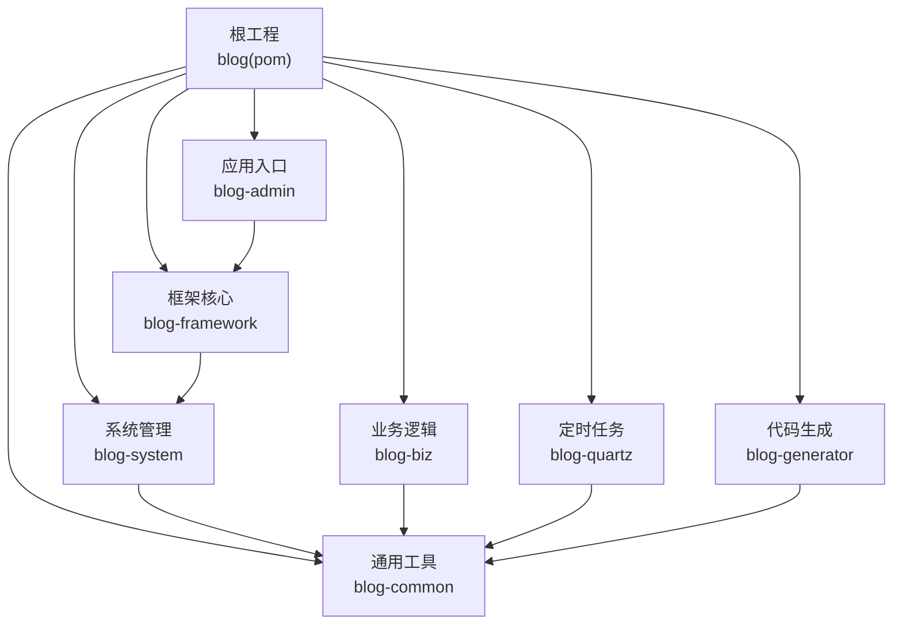
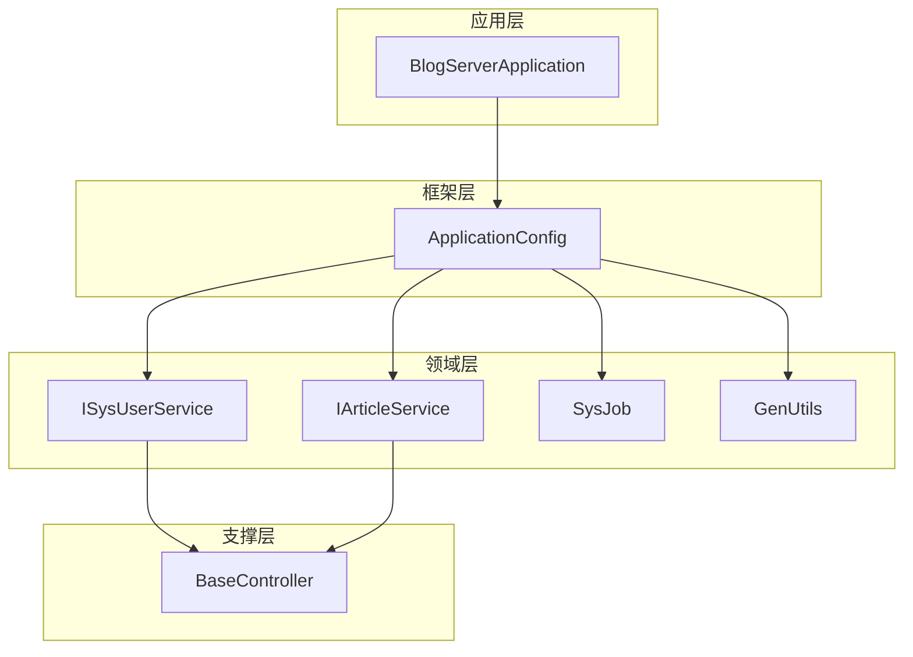
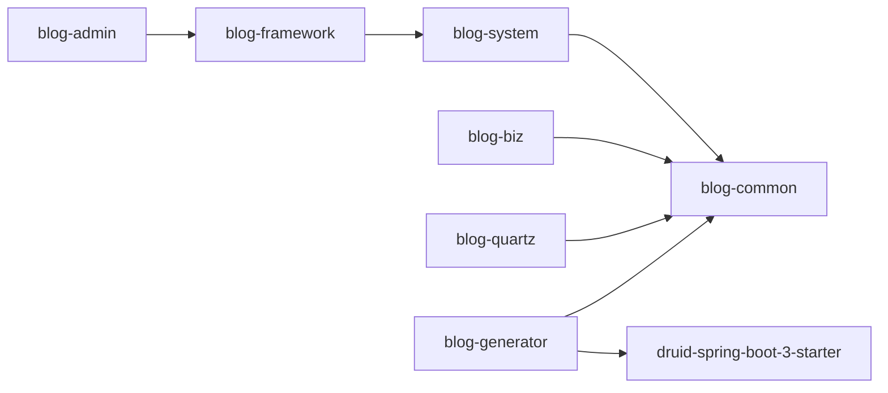

# 模块设计规范

<cite>
**本文引用的文件**
- [pom.xml](file://pom.xml)
- [BlogServerApplication.java](file://blog-admin/src/main/java/blog/BlogServerApplication.java)
- [ApplicationConfig.java](file://blog-framework/src/main/java/blog/framework/config/ApplicationConfig.java)
- [BaseController.java](file://blog-common/src/main/java/blog/common/base/controller/BaseController.java)
- [IArticleService.java](file://blog-biz/src/main/java/blog/biz/service/IArticleService.java)
- [ISysUserService.java](file://blog-system/src/main/java/blog/system/service/ISysUserService.java)
- [SysJob.java](file://blog-quartz/src/main/java/blog/quartz/domain/SysJob.java)
- [GenUtils.java](file://blog-generator/src/main/java/blog/generator/util/GenUtils.java)
- [blog-framework/pom.xml](file://blog-framework/pom.xml)
- [blog-system/pom.xml](file://blog-system/pom.xml)
- [blog-biz/pom.xml](file://blog-biz/pom.xml)
- [blog-common/pom.xml](file://blog-common/pom.xml)
- [blog-quartz/pom.xml](file://blog-quartz/pom.xml)
- [blog-generator/pom.xml](file://blog-generator/pom.xml)
</cite>

## 目录
1. [引言](#引言)
2. [项目结构](#项目结构)
3. [核心组件](#核心组件)
4. [架构总览](#架构总览)
5. [详细组件分析](#详细组件分析)
6. [依赖分析](#依赖分析)
7. [性能考虑](#性能考虑)
8. [故障排查指南](#故障排查指南)
9. [结论](#结论)
10. [附录](#附录)

## 引言
本规范面向Leejie博客系统的模块化设计，明确各模块的职责边界、接口设计规范、命名约定与代码组织方式，并给出模块间通信机制、依赖注入与配置管理策略。目标是帮助开发者快速理解并遵循统一的设计原则，提升可维护性与扩展性。

## 项目结构
系统采用多模块Maven聚合工程组织，顶层pom集中管理版本与模块清单；各子模块按功能域划分，形成清晰的层次化结构：
- 应用入口：blog-admin
- 框架核心：blog-framework
- 系统管理：blog-system
- 业务逻辑：blog-biz
- 通用工具：blog-common
- 定时任务：blog-quartz
- 代码生成：blog-generator

图表来源
- [pom.xml:225-233](file://pom.xml#L225-L233)
- [blog-framework/pom.xml:56-65](file://blog-framework/pom.xml#L56-L65)
- [blog-system/pom.xml:18-26](file://blog-system/pom.xml#L18-L26)
- [blog-biz/pom.xml:18-27](file://blog-biz/pom.xml#L18-L27)
- [blog-common/pom.xml:18-149](file://blog-common/pom.xml#L18-L149)
- [blog-quartz/pom.xml:18-37](file://blog-quartz/pom.xml#L18-L37)
- [blog-generator/pom.xml:18-37](file://blog-generator/pom.xml#L18-L37)

章节来源
- [pom.xml:225-233](file://pom.xml#L225-L233)

## 核心组件
- 应用入口模块（blog-admin）
  - 职责：提供Spring Boot应用入口，负责应用启动与初始化。
  - 典型实现：入口类排除数据源自动装配，避免在非数据库场景下加载数据源配置。
  - 参考路径：[BlogServerApplication.java:12-18](file://blog-admin/src/main/java/blog/BlogServerApplication.java#L12-L18)

- 框架核心模块（blog-framework）
  - 职责：提供横切能力（AOP、拦截器、安全上下文）、MyBatis Mapper扫描、Jackson时区配置等基础设施。
  - 典型实现：启用AOP代理、Mapper扫描、时区定制。
  - 参考路径：[ApplicationConfig.java:16-29](file://blog-framework/src/main/java/blog/framework/config/ApplicationConfig.java#L16-L29)

- 通用工具模块（blog-common）
  - 职责：提供基础控制器基类、分页封装、响应体封装、安全工具、校验注解、异常体系、文件工具、MinIO集成、Redis缓存等。
  - 典型实现：BaseController统一处理分页、排序、响应体、登录用户信息获取。
  - 参考路径：[BaseController.java:30-182](file://blog-common/src/main/java/blog/common/base/controller/BaseController.java#L30-L182)

- 系统管理模块（blog-system）
  - 职责：系统级领域模型与服务，如用户、角色、菜单、字典、配置、通知等。
  - 典型实现：ISysUserService定义用户相关业务契约。
  - 参考路径：[ISysUserService.java:14-219](file://blog-system/src/main/java/blog/system/service/ISysUserService.java#L14-L219)

- 业务逻辑模块（blog-biz）
  - 职责：博客业务实体与服务，如文章、分类、文件等。
  - 典型实现：IArticleService定义文章CRUD与分页查询等业务接口。
  - 参考路径：[IArticleService.java:14-64](file://blog-biz/src/main/java/blog/biz/service/IArticleService.java#L14-L64)

- 定时任务模块（blog-quartz）
  - 职责：基于Quartz的任务调度与日志管理。
  - 典型实现：SysJob描述任务元数据与执行策略。
  - 参考路径：[SysJob.java:21-172](file://blog-quartz/src/main/java/blog/quartz/domain/SysJob.java#L21-L172)

- 代码生成模块（blog-generator）
  - 职责：根据数据库表生成前后端代码与页面骨架。
  - 典型实现：GenUtils负责表与列信息初始化、Java类型映射、HTML控件类型推断。
  - 参考路径：[GenUtils.java:17-223](file://blog-generator/src/main/java/blog/generator/util/GenUtils.java#L17-L223)

章节来源
- [BlogServerApplication.java:12-18](file://blog-admin/src/main/java/blog/BlogServerApplication.java#L12-L18)
- [ApplicationConfig.java:16-29](file://blog-framework/src/main/java/blog/framework/config/ApplicationConfig.java#L16-L29)
- [BaseController.java:30-182](file://blog-common/src/main/java/blog/common/base/controller/BaseController.java#L30-L182)
- [ISysUserService.java:14-219](file://blog-system/src/main/java/blog/system/service/ISysUserService.java#L14-L219)
- [IArticleService.java:14-64](file://blog-biz/src/main/java/blog/biz/service/IArticleService.java#L14-L64)
- [SysJob.java:21-172](file://blog-quartz/src/main/java/blog/quartz/domain/SysJob.java#L21-L172)
- [GenUtils.java:17-223](file://blog-generator/src/main/java/blog/generator/util/GenUtils.java#L17-L223)

## 架构总览
系统采用“入口应用 + 框架核心 + 业务域”的分层架构：
- 入口应用负责启动与装配
- 框架核心提供横切与基础设施
- 业务域模块通过通用工具模块复用能力
- 系统管理模块作为系统级能力下沉至通用工具

图表来源
- [BlogServerApplication.java:12-18](file://blog-admin/src/main/java/blog/BlogServerApplication.java#L12-L18)
- [ApplicationConfig.java:16-29](file://blog-framework/src/main/java/blog/framework/config/ApplicationConfig.java#L16-L29)
- [ISysUserService.java:14-219](file://blog-system/src/main/java/blog/system/service/ISysUserService.java#L14-L219)
- [IArticleService.java:14-64](file://blog-biz/src/main/java/blog/biz/service/IArticleService.java#L14-L64)
- [SysJob.java:21-172](file://blog-quartz/src/main/java/blog/quartz/domain/SysJob.java#L21-L172)
- [GenUtils.java:17-223](file://blog-generator/src/main/java/blog/generator/util/GenUtils.java#L17-L223)
- [BaseController.java:30-182](file://blog-common/src/main/java/blog/common/base/controller/BaseController.java#L30-L182)

## 详细组件分析

### blog-admin 应用入口模块
- 设计原则
  - 单一职责：仅负责应用启动与上下文初始化
  - 最小依赖：排除数据源自动装配，避免非数据库场景的额外开销
- 接口与调用
  - 入口类通过静态main方法启动Spring Boot应用
- 命名约定
  - 应用类以“Application”结尾，包名为“blog”
- 代码组织
  - 入口类位于模块根包下，资源文件按Spring Boot约定放置

章节来源
- [BlogServerApplication.java:12-18](file://blog-admin/src/main/java/blog/BlogServerApplication.java#L12-L18)

### blog-framework 框架核心模块
- 设计原则
  - 横切关注点集中：AOP、拦截器、安全上下文
  - 数据访问统一：Mapper扫描与MyBatis Plus配置
  - 配置可定制：Jackson时区、过滤器链、线程池等
- 接口与调用
  - ApplicationConfig提供Bean级配置，供其他模块复用
- 命名约定
  - 配置类以“Config”结尾，包名为“blog.framework.config”
- 代码组织
  - 按功能域拆分包：aspectj、config、datasource、interceptor、manager、security、web

章节来源
- [ApplicationConfig.java:16-29](file://blog-framework/src/main/java/blog/framework/config/ApplicationConfig.java#L16-L29)

### blog-common 通用工具模块
- 设计原则
  - 低耦合高内聚：将横切与通用能力抽取到公共模块
  - 明确契约：BaseController、BaseService、Result等统一标准
  - 可测试性：提供工具类与常量，便于单元测试
- 接口与调用
  - BaseController提供分页、排序、响应体、登录用户信息等通用方法
- 命名约定
  - 基类以“Base”前缀，响应体以“Result”或“TableDataInfo”命名
- 代码组织
  - base、config、constant、core、enums、exception、filter、utils、validate、xss等

章节来源
- [BaseController.java:30-182](file://blog-common/src/main/java/blog/common/base/controller/BaseController.java#L30-L182)

### blog-system 系统管理模块
- 设计原则
  - 领域驱动：围绕用户、角色、菜单、字典等系统级实体建模
  - 可扩展：通过接口隔离具体实现，便于替换与扩展
- 接口与调用
  - ISysUserService定义用户相关业务契约，供上层控制器调用
- 命名约定
  - 服务接口以“I”开头，实体以“Sys”前缀
- 代码组织
  - domain、mapper、service三层结构，service按impl实现

章节来源
- [ISysUserService.java:14-219](file://blog-system/src/main/java/blog/system/service/ISysUserService.java#L14-L219)

### blog-biz 业务逻辑模块
- 设计原则
  - 业务边界清晰：文章、分类、文件等业务实体与服务分离
  - 复用通用能力：通过common模块提供的BaseService、Result等
- 接口与调用
  - IArticleService定义文章CRUD与分页查询等业务接口
- 命名约定
  - 服务接口以“IArticleService”命名，实体以“Article”命名
- 代码组织
  - domain、dto、mapper、service按职责划分

章节来源
- [IArticleService.java:14-64](file://blog-biz/src/main/java/blog/biz/service/IArticleService.java#L14-L64)

### blog-quartz 定时任务模块
- 设计原则
  - 任务元数据标准化：SysJob统一描述任务名称、表达式、策略等
  - 可观测性：提供任务日志与执行记录
- 接口与调用
  - SysJob用于持久化任务配置，配合调度器执行
- 命名约定
  - 实体以“SysJob”命名，工具类以“Util”后缀
- 代码组织
  - domain、mapper、service、task、util等

章节来源
- [SysJob.java:21-172](file://blog-quartz/src/main/java/blog/quartz/domain/SysJob.java#L21-L172)

### blog-generator 代码生成模块
- 设计原则
  - 高效开发：根据表结构自动生成前后端代码与页面骨架
  - 可配置：通过配置文件控制包名、作者、前缀等
- 接口与调用
  - GenUtils负责表与列信息初始化、Java类型映射、HTML控件类型推断
- 命名约定
  - 工具类以“GenUtils”命名，Velocity模板位于vm目录
- 代码组织
  - config、controller、domain、mapper、service、util、resources等

章节来源
- [GenUtils.java:17-223](file://blog-generator/src/main/java/blog/generator/util/GenUtils.java#L17-L223)

## 依赖分析
模块间依赖关系如下：
- blog-admin 依赖 blog-framework
- blog-framework 依赖 blog-system
- blog-system 依赖 blog-common
- blog-biz 依赖 blog-common
- blog-quartz 依赖 blog-common
- blog-generator 依赖 blog-common 与 druid

图表来源
- [blog-framework/pom.xml:56-65](file://blog-framework/pom.xml#L56-L65)
- [blog-system/pom.xml:18-26](file://blog-system/pom.xml#L18-L26)
- [blog-biz/pom.xml:18-27](file://blog-biz/pom.xml#L18-L27)
- [blog-common/pom.xml:18-149](file://blog-common/pom.xml#L18-L149)
- [blog-quartz/pom.xml:18-37](file://blog-quartz/pom.xml#L18-L37)
- [blog-generator/pom.xml:18-37](file://blog-generator/pom.xml#L18-L37)

章节来源
- [blog-framework/pom.xml:56-65](file://blog-framework/pom.xml#L56-L65)
- [blog-system/pom.xml:18-26](file://blog-system/pom.xml#L18-L26)
- [blog-biz/pom.xml:18-27](file://blog-biz/pom.xml#L18-L27)
- [blog-common/pom.xml:18-149](file://blog-common/pom.xml#L18-L149)
- [blog-quartz/pom.xml:18-37](file://blog-quartz/pom.xml#L18-L37)
- [blog-generator/pom.xml:18-37](file://blog-generator/pom.xml#L18-L37)

## 性能考虑
- 分页与排序
  - 使用通用分页封装与SQL防注入工具，避免全量查询与N+1问题
- 缓存与序列化
  - 通过Redis与Jackson配置优化序列化性能与时区一致性
- 数据库连接
  - 使用高性能连接池，结合动态数据源与SQL解析器，减少无效查询
- 任务调度
  - 合理配置并发策略与触发策略，避免任务堆积与资源争用

## 故障排查指南
- 启动失败
  - 检查入口类排除的数据源配置是否符合当前环境
- 分页异常
  - 确认分页参数与排序字段合法性，避免非法SQL
- 权限与安全
  - 校验安全上下文与权限持有者配置，确保鉴权链路正确
- 文件上传与存储
  - 校验文件类型、大小限制与MinIO配置，确保上传流程稳定

## 结论
通过明确的模块边界、统一的接口规范与共享的通用能力，系统实现了高内聚、低耦合的模块化设计。建议在后续迭代中持续完善接口契约、增强可观测性与自动化测试，以进一步提升系统的稳定性与可维护性。

## 附录
- 命名约定速查
  - 应用入口类：BlogServerApplication
  - 配置类：ApplicationConfig
  - 控制器基类：BaseController
  - 业务服务接口：IArticleService、ISysUserService
  - 领域实体：SysJob、Article等
  - 工具类：GenUtils
- 接口调用示例（路径参考）
  - 控制器调用服务：[IArticleService.java:14-64](file://blog-biz/src/main/java/blog/biz/service/IArticleService.java#L14-L64)
  - 通用分页封装：[BaseController.java:47-83](file://blog-common/src/main/java/blog/common/base/controller/BaseController.java#L47-L83)
  - 任务元数据：[SysJob.java:21-172](file://blog-quartz/src/main/java/blog/quartz/domain/SysJob.java#L21-L172)
  - 代码生成工具：[GenUtils.java:17-223](file://blog-generator/src/main/java/blog/generator/util/GenUtils.java#L17-L223)