# 系统管理模块设计

<cite>
**本文档引用的文件**
- [ISysUserService.java](file://blog-system/src/main/java/blog/system/service/ISysUserService.java)
- [ISysRoleService.java](file://blog-system/src/main/java/blog/system/service/ISysRoleService.java)
- [ISysMenuService.java](file://blog-system/src/main/java/blog/system/service/ISysMenuService.java)
- [ISysDeptService.java](file://blog-system/src/main/java/blog/system/service/ISysDeptService.java)
- [ISysDictDataService.java](file://blog-system/src/main/java/blog/system/service/ISysDictDataService.java)
- [SysUser.java](file://blog-common/src/main/java/blog/common/core/domain/entity/SysUser.java)
- [SysRole.java](file://blog-common/src/main/java/blog/common/core/domain/entity/SysRole.java)
- [SysMenu.java](file://blog-common/src/main/java/blog/common/core/domain/entity/SysMenu.java)
- [SysDept.java](file://blog-common/src/main/java/blog/common/core/domain/entity/SysDept.java)
- [SysDictData.java](file://blog-common/src/main/java/blog/common/core/domain/entity/SysDictData.java)
- [SysUserController.java](file://blog-admin/src/main/java/blog/web/controller/system/SysUserController.java)
- [SysRoleController.java](file://blog-admin/src/main/java/blog/web/controller/system/SysRoleController.java)
- [SysMenuController.java](file://blog-admin/src/main/java/blog/web/controller/system/SysMenuController.java)
- [SysDeptController.java](file://blog-admin/src/main/java/blog/web/controller/system/SysDeptController.java)
- [SysDictDataController.java](file://blog-admin/src/main/java/blog/web/controller/system/SysDictDataController.java)
</cite>

## 目录
1. [引言](#引言)
2. [项目结构](#项目结构)
3. [核心组件](#核心组件)
4. [架构总览](#架构总览)
5. [详细组件分析](#详细组件分析)
6. [依赖关系分析](#依赖关系分析)
7. [性能考虑](#性能考虑)
8. [故障排查指南](#故障排查指南)
9. [结论](#结论)
10. [附录](#附录)

## 引言
本设计文档面向 Leejie 博客系统的“系统管理”模块，聚焦 blog-system 模块中的用户管理、角色管理、菜单管理、部门管理和字典数据管理等核心能力。文档从领域模型、服务层接口规范、数据访问层实现与业务逻辑封装四个维度展开，辅以实体关系图、接口设计规范与关键业务流程示例，帮助开发者快速理解并高效实现系统管理层的设计模式与实现细节。

## 项目结构
系统管理模块位于 blog-system 子模块，采用典型的分层架构：
- 控制器层：位于 blog-admin 模块，负责接收请求、鉴权与调用服务层
- 服务层：位于 blog-system 模块，定义业务接口与实现
- 数据模型：位于 blog-common 模块，定义实体与通用基类
- 数据访问层：位于 blog-system 模块，MyBatis Plus Mapper 与 XML 映射

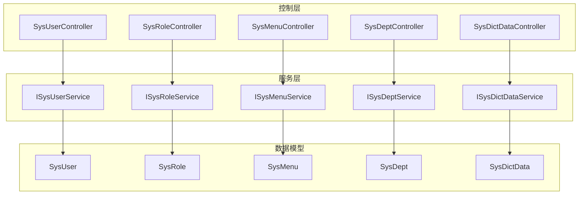

图表来源
- [SysUserController.java:44-233](file://blog-admin/src/main/java/blog/web/controller/system/SysUserController.java#L44-L233)
- [SysRoleController.java:42-240](file://blog-admin/src/main/java/blog/web/controller/system/SysRoleController.java#L42-L240)
- [SysMenuController.java:32-125](file://blog-admin/src/main/java/blog/web/controller/system/SysMenuController.java#L32-L125)
- [SysDeptController.java:33-119](file://blog-admin/src/main/java/blog/web/controller/system/SysDeptController.java#L33-L119)
- [SysDictDataController.java:35-114](file://blog-admin/src/main/java/blog/web/controller/system/SysDictDataController.java#L35-L114)
- [ISysUserService.java:14-219](file://blog-system/src/main/java/blog/system/service/ISysUserService.java#L14-L219)
- [ISysRoleService.java:15-175](file://blog-system/src/main/java/blog/system/service/ISysRoleService.java#L15-L175)
- [ISysMenuService.java:16-146](file://blog-system/src/main/java/blog/system/service/ISysMenuService.java#L16-L146)
- [ISysDeptService.java:14-126](file://blog-system/src/main/java/blog/system/service/ISysDeptService.java#L14-L126)
- [ISysDictDataService.java:13-62](file://blog-system/src/main/java/blog/system/service/ISysDictDataService.java#L13-L62)
- [SysUser.java:24-339](file://blog-common/src/main/java/blog/common/core/domain/entity/SysUser.java#L24-L339)
- [SysRole.java:21-240](file://blog-common/src/main/java/blog/common/core/domain/entity/SysRole.java#L21-L240)
- [SysMenu.java:20-277](file://blog-common/src/main/java/blog/common/core/domain/entity/SysMenu.java#L20-L277)
- [SysDept.java:24-95](file://blog-common/src/main/java/blog/common/core/domain/entity/SysDept.java#L24-L95)
- [SysDictData.java:22-93](file://blog-common/src/main/java/blog/common/core/domain/entity/SysDictData.java#L22-L93)

章节来源
- [SysUserController.java:44-233](file://blog-admin/src/main/java/blog/web/controller/system/SysUserController.java#L44-L233)
- [SysRoleController.java:42-240](file://blog-admin/src/main/java/blog/web/controller/system/SysRoleController.java#L42-L240)
- [SysMenuController.java:32-125](file://blog-admin/src/main/java/blog/web/controller/system/SysMenuController.java#L32-L125)
- [SysDeptController.java:33-119](file://blog-admin/src/main/java/blog/web/controller/system/SysDeptController.java#L33-L119)
- [SysDictDataController.java:35-114](file://blog-admin/src/main/java/blog/web/controller/system/SysDictDataController.java#L35-L114)

## 核心组件
本节概述系统管理五大核心领域的职责边界与关键接口能力：
- 用户管理：用户增删改查、导入导出、角色授权、状态变更、密码重置、登录信息更新等
- 角色管理：角色增删改查、数据权限配置、角色与用户的授权/取消授权、权限集合查询等
- 菜单管理：菜单树构建、权限字符串提取、菜单与角色授权、菜单校验与删除保护等
- 部门管理：部门树构建、父子关系校验、用户占用校验、数据权限校验等
- 字典数据管理：字典数据分页查询、按类型查询、导入导出、新增/修改/删除等

章节来源
- [ISysUserService.java:14-219](file://blog-system/src/main/java/blog/system/service/ISysUserService.java#L14-L219)
- [ISysRoleService.java:15-175](file://blog-system/src/main/java/blog/system/service/ISysRoleService.java#L15-L175)
- [ISysMenuService.java:16-146](file://blog-system/src/main/java/blog/system/service/ISysMenuService.java#L16-L146)
- [ISysDeptService.java:14-126](file://blog-system/src/main/java/blog/system/service/ISysDeptService.java#L14-L126)
- [ISysDictDataService.java:13-62](file://blog-system/src/main/java/blog/system/service/ISysDictDataService.java#L13-L62)

## 架构总览
系统管理模块遵循“控制器-服务-数据模型”的分层设计，控制器负责鉴权与参数封装，服务层负责业务编排与规则校验，数据模型承载实体与字段约束，数据访问层通过 MyBatis Plus 完成持久化。

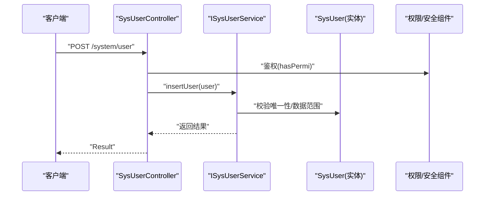

图表来源
- [SysUserController.java:117-133](file://blog-admin/src/main/java/blog/web/controller/system/SysUserController.java#L117-L133)
- [ISysUserService.java:115](file://blog-system/src/main/java/blog/system/service/ISysUserService.java#L115)
- [SysUser.java:24-339](file://blog-common/src/main/java/blog/common/core/domain/entity/SysUser.java#L24-L339)

## 详细组件分析

### 用户管理组件分析
- 领域模型：SysUser 承载用户基本信息、关联部门、角色组、岗位组、登录信息与状态等
- 服务接口：ISysUserService 提供用户列表查询、导入导出、唯一性校验、角色授权、状态变更、密码重置、登录信息更新、批量删除等
- 控制器：SysUserController 提供 REST 接口，统一鉴权注解与日志记录，调用服务层完成业务处理

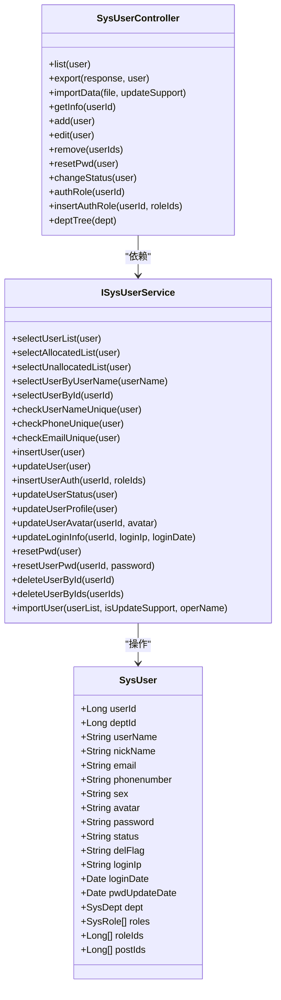

图表来源
- [SysUser.java:24-339](file://blog-common/src/main/java/blog/common/core/domain/entity/SysUser.java#L24-L339)
- [ISysUserService.java:14-219](file://blog-system/src/main/java/blog/system/service/ISysUserService.java#L14-L219)
- [SysUserController.java:44-233](file://blog-admin/src/main/java/blog/web/controller/system/SysUserController.java#L44-L233)

章节来源
- [SysUser.java:24-339](file://blog-common/src/main/java/blog/common/core/domain/entity/SysUser.java#L24-L339)
- [ISysUserService.java:14-219](file://blog-system/src/main/java/blog/system/service/ISysUserService.java#L14-L219)
- [SysUserController.java:44-233](file://blog-admin/src/main/java/blog/web/controller/system/SysUserController.java#L44-L233)

### 角色管理组件分析
- 领域模型：SysRole 承载角色名称、权限字符、排序、数据范围、菜单/部门勾选严格性、状态等
- 服务接口：ISysRoleService 提供角色列表查询、角色权限集合、角色与用户授权/取消授权、数据权限配置、状态变更、批量删除等
- 控制器：SysRoleController 提供角色 CRUD、数据权限配置、角色授权/取消授权、已分配/未分配用户列表等

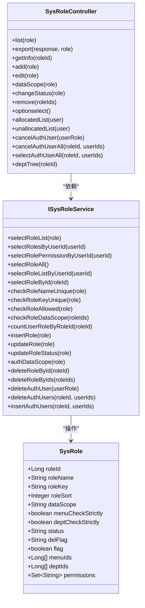

图表来源
- [SysRole.java:21-240](file://blog-common/src/main/java/blog/common/core/domain/entity/SysRole.java#L21-L240)
- [ISysRoleService.java:15-175](file://blog-system/src/main/java/blog/system/service/ISysRoleService.java#L15-L175)
- [SysRoleController.java:42-240](file://blog-admin/src/main/java/blog/web/controller/system/SysRoleController.java#L42-L240)

章节来源
- [SysRole.java:21-240](file://blog-common/src/main/java/blog/common/core/domain/entity/SysRole.java#L21-L240)
- [ISysRoleService.java:15-175](file://blog-system/src/main/java/blog/system/service/ISysRoleService.java#L15-L175)
- [SysRoleController.java:42-240](file://blog-admin/src/main/java/blog/web/controller/system/SysRoleController.java#L42-L240)

### 菜单管理组件分析
- 领域模型：SysMenu 承载菜单名称、父菜单、显示顺序、路由地址、组件路径、是否外链/缓存、类型、可见/状态、权限字符串、图标、子菜单等
- 服务接口：ISysMenuService 提供菜单列表查询、权限集合、菜单树构建、下拉树构建、菜单与角色授权、菜单校验与删除保护等
- 控制器：SysMenuController 提供菜单 CRUD、菜单树/角色树加载、菜单名称唯一性校验、外链地址校验等

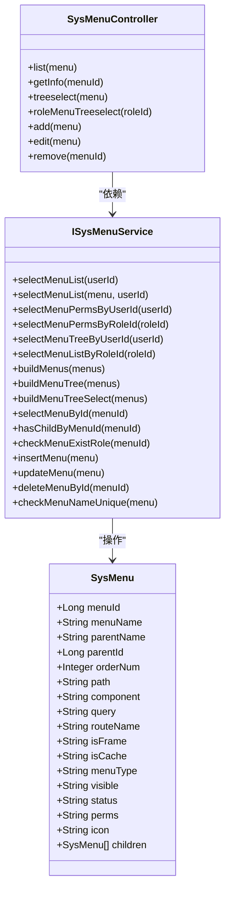

图表来源
- [SysMenu.java:20-277](file://blog-common/src/main/java/blog/common/core/domain/entity/SysMenu.java#L20-L277)
- [ISysMenuService.java:16-146](file://blog-system/src/main/java/blog/system/service/ISysMenuService.java#L16-L146)
- [SysMenuController.java:32-125](file://blog-admin/src/main/java/blog/web/controller/system/SysMenuController.java#L32-L125)

章节来源
- [SysMenu.java:20-277](file://blog-common/src/main/java/blog/common/core/domain/entity/SysMenu.java#L20-L277)
- [ISysMenuService.java:16-146](file://blog-system/src/main/java/blog/system/service/ISysMenuService.java#L16-L146)
- [SysMenuController.java:32-125](file://blog-admin/src/main/java/blog/web/controller/system/SysMenuController.java#L32-L125)

### 部门管理组件分析
- 领域模型：SysDept 承载部门名称、父部门、祖先列表、显示顺序、负责人、电话、邮箱、状态、删除标志、子部门等
- 服务接口：ISysDeptService 提供部门列表查询、部门树构建、下拉树构建、角色部门树、部门数据权限校验、父子关系与用户占用校验等
- 控制器：SysDeptController 提供部门 CRUD、排除节点查询、部门树构建、上级部门自引用校验、停用时子部门检查等

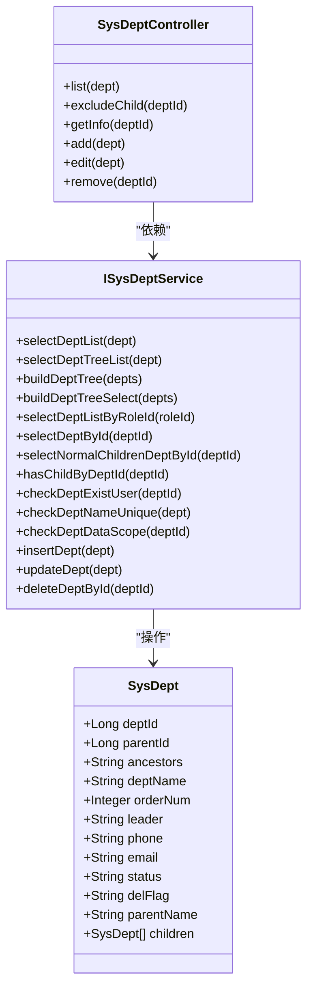

图表来源
- [SysDept.java:24-95](file://blog-common/src/main/java/blog/common/core/domain/entity/SysDept.java#L24-L95)
- [ISysDeptService.java:14-126](file://blog-system/src/main/java/blog/system/service/ISysDeptService.java#L14-L126)
- [SysDeptController.java:33-119](file://blog-admin/src/main/java/blog/web/controller/system/SysDeptController.java#L33-L119)

章节来源
- [SysDept.java:24-95](file://blog-common/src/main/java/blog/common/core/domain/entity/SysDept.java#L24-L95)
- [ISysDeptService.java:14-126](file://blog-system/src/main/java/blog/system/service/ISysDeptService.java#L14-L126)
- [SysDeptController.java:33-119](file://blog-admin/src/main/java/blog/web/controller/system/SysDeptController.java#L33-L119)

### 字典数据管理组件分析
- 领域模型：SysDictData 承载字典标签、键值、类型、排序、样式、是否默认、状态等
- 服务接口：ISysDictDataService 提供字典数据分页查询、按类型查询、唯一性校验、新增/修改/删除等
- 控制器：SysDictDataController 提供字典数据 CRUD、按类型查询、导入导出等

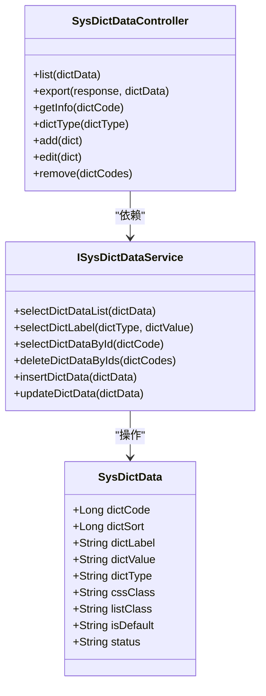

图表来源
- [SysDictData.java:22-93](file://blog-common/src/main/java/blog/common/core/domain/entity/SysDictData.java#L22-L93)
- [ISysDictDataService.java:13-62](file://blog-system/src/main/java/blog/system/service/ISysDictDataService.java#L13-L62)
- [SysDictDataController.java:35-114](file://blog-admin/src/main/java/blog/web/controller/system/SysDictDataController.java#L35-L114)

章节来源
- [SysDictData.java:22-93](file://blog-common/src/main/java/blog/common/core/domain/entity/SysDictData.java#L22-L93)
- [ISysDictDataService.java:13-62](file://blog-system/src/main/java/blog/system/service/ISysDictDataService.java#L13-L62)
- [SysDictDataController.java:35-114](file://blog-admin/src/main/java/blog/web/controller/system/SysDictDataController.java#L35-L114)

### 业务流程示例

#### 用户新增流程
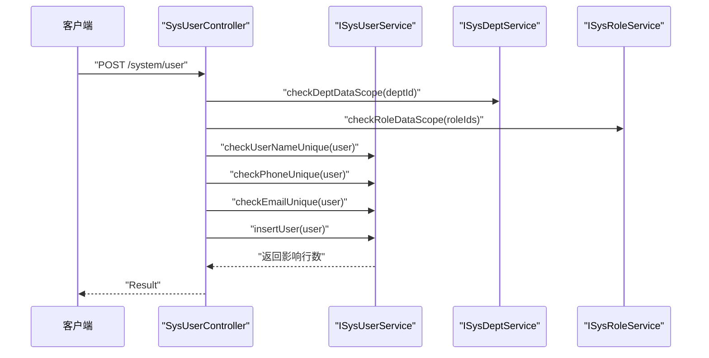

图表来源
- [SysUserController.java:117-133](file://blog-admin/src/main/java/blog/web/controller/system/SysUserController.java#L117-L133)
- [ISysUserService.java:77-93](file://blog-system/src/main/java/blog/system/service/ISysUserService.java#L77-L93)
- [ISysDeptService.java:100](file://blog-system/src/main/java/blog/system/service/ISysDeptService.java#L100)
- [ISysRoleService.java:91](file://blog-system/src/main/java/blog/system/service/ISysRoleService.java#L91)

#### 角色授权流程
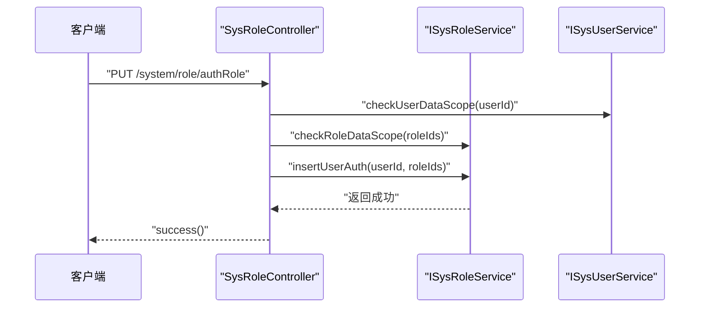

图表来源
- [SysRoleController.java:214-222](file://blog-admin/src/main/java/blog/web/controller/system/SysRoleController.java#L214-L222)
- [ISysUserService.java:139](file://blog-system/src/main/java/blog/system/service/ISysUserService.java#L139)
- [ISysRoleService.java:173](file://blog-system/src/main/java/blog/system/service/ISysRoleService.java#L173)

#### 菜单删除流程
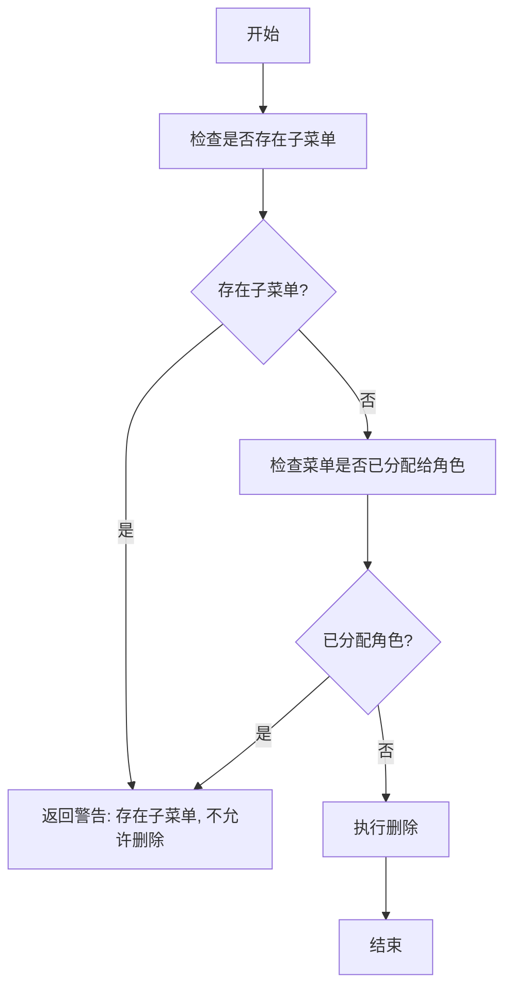

图表来源
- [SysMenuController.java:113-124](file://blog-admin/src/main/java/blog/web/controller/system/SysMenuController.java#L113-L124)
- [ISysMenuService.java:104](file://blog-system/src/main/java/blog/system/service/ISysMenuService.java#L104)
- [ISysMenuService.java:112](file://blog-system/src/main/java/blog/system/service/ISysMenuService.java#L112)

## 依赖关系分析
- 控制器到服务：各控制器均通过 @Autowired 注入对应服务接口，遵循依赖倒置原则
- 服务到实体：服务接口方法参数与返回值多为实体类或集合，体现清晰的领域驱动设计
- 数据权限与校验：控制器在调用服务前进行权限注解校验与数据范围校验，确保操作合规
- 事务与一致性：服务层承担业务一致性保障，控制器仅负责编排与响应

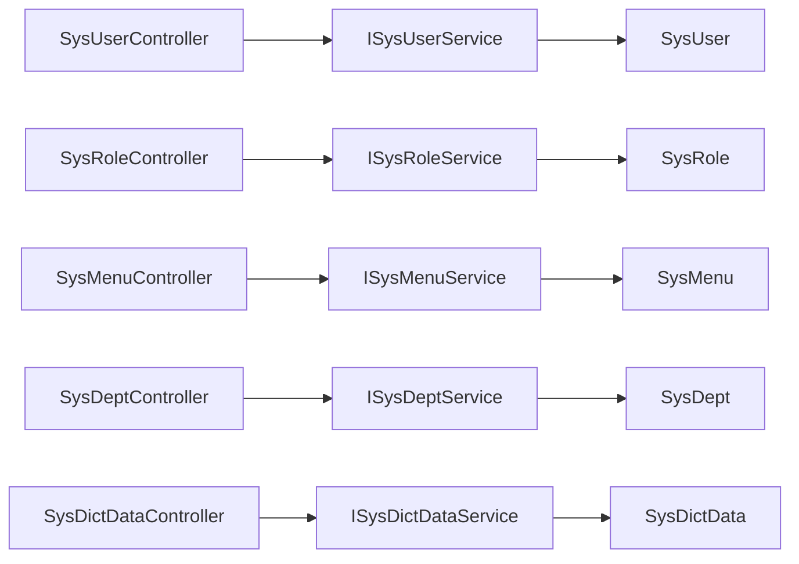

图表来源
- [SysUserController.java:45-55](file://blog-admin/src/main/java/blog/web/controller/system/SysUserController.java#L45-L55)
- [SysRoleController.java:44-56](file://blog-admin/src/main/java/blog/web/controller/system/SysRoleController.java#L44-L56)
- [SysMenuController.java:34](file://blog-admin/src/main/java/blog/web/controller/system/SysMenuController.java#L34)
- [SysDeptController.java:35](file://blog-admin/src/main/java/blog/web/controller/system/SysDeptController.java#L35)
- [SysDictDataController.java:38](file://blog-admin/src/main/java/blog/web/controller/system/SysDictDataController.java#L38)

章节来源
- [SysUserController.java:45-55](file://blog-admin/src/main/java/blog/web/controller/system/SysUserController.java#L45-L55)
- [SysRoleController.java:44-56](file://blog-admin/src/main/java/blog/web/controller/system/SysRoleController.java#L44-L56)
- [SysMenuController.java:34](file://blog-admin/src/main/java/blog/web/controller/system/SysMenuController.java#L34)
- [SysDeptController.java:35](file://blog-admin/src/main/java/blog/web/controller/system/SysDeptController.java#L35)
- [SysDictDataController.java:38](file://blog-admin/src/main/java/blog/web/controller/system/SysDictDataController.java#L38)

## 性能考虑
- 分页查询：控制器统一使用分页工具，服务层提供分页查询接口，避免一次性加载大量数据
- 批量操作：提供批量删除与批量授权接口，减少网络往返次数
- 缓存与权限刷新：角色更新后主动刷新用户权限与 Token，避免陈旧权限导致的重复校验开销
- 导入导出：基于 ExcelUtil 进行批量导入导出，建议对大文件进行异步处理与进度反馈

## 故障排查指南
- 权限不足：控制器使用 @PreAuthorize 注解进行权限拦截，若出现 403，需确认用户角色与权限字符串配置
- 唯一性冲突：新增/编辑时若提示唯一性冲突，需检查用户名、手机号、邮箱或角色名称/权限字符是否重复
- 数据范围限制：涉及数据范围校验的服务方法会在越权时抛出异常，需检查当前用户的数据范围策略
- 外链地址校验：菜单新增/编辑时若未以 http(s):// 开头且标记为外链，将被拒绝
- 子节点/占用保护：删除菜单/部门前需先清理子节点或解除占用，否则将返回警告

章节来源
- [SysUserController.java:60-66](file://blog-admin/src/main/java/blog/web/controller/system/SysUserController.java#L60-L66)
- [SysRoleController.java:92-96](file://blog-admin/src/main/java/blog/web/controller/system/SysRoleController.java#L92-L96)
- [SysMenuController.java:83-87](file://blog-admin/src/main/java/blog/web/controller/system/SysMenuController.java#L83-L87)
- [SysDeptController.java:75-77](file://blog-admin/src/main/java/blog/web/controller/system/SysDeptController.java#L75-L77)

## 结论
系统管理模块通过清晰的分层设计与严格的权限/数据范围校验，实现了用户、角色、菜单、部门与字典数据的全生命周期管理。控制器层专注鉴权与编排，服务层封装业务规则与一致性，实体层承载领域模型与约束，整体具备良好的可维护性与扩展性。建议在后续迭代中进一步完善异步导入导出与权限缓存刷新策略，持续提升用户体验与系统性能。

## 附录
- 接口设计规范
  - 统一使用 RestController 与@RequestMapping 定义资源路径
  - 使用 @PreAuthorize 进行权限控制，@Log 记录业务日志
  - 参数校验使用 @Validated 与 Jakarta Validation 注解
  - 返回值统一使用 Result 或 TableDataInfo 包装
- 实体字段规范
  - 使用 @Excel 与 @Size 等注解进行导入导出与长度校验
  - 字段命名遵循驼峰规范，避免数据库关键字冲突
- 业务流程最佳实践
  - 新增/编辑前进行唯一性与数据范围校验
  - 删除前进行子节点与占用检查
  - 角色变更后及时刷新用户权限与 Token