# 通用工具模块设计

<cite>
**本文档引用的文件**
- [BaseController.java](file://blog-common/src/main/java/blog/common/base/controller/BaseController.java)
- [BaseService.java](file://blog-common/src/main/java/blog/common/base/service/BaseService.java)
- [BaseServiceImpl.java](file://blog-common/src/main/java/blog/common/base/service/impl/BaseServiceImpl.java)
- [BaseEntity.java](file://blog-common/src/main/java/blog/common/base/entity/BaseEntity.java)
- [BaseMapperPlus.java](file://blog-common/src/main/java/blog/common/base/mapper/BaseMapperPlus.java)
- [R.java](file://blog-common/src/main/java/blog/common/base/resp/R.java)
- [PageQuery.java](file://blog-common/src/main/java/blog/common/base/req/PageQuery.java)
- [Constants.java](file://blog-common/src/main/java/blog/common/constant/Constants.java)
- [SecurityUtils.java](file://blog-common/src/main/java/blog/common/utils/SecurityUtils.java)
- [DateUtils.java](file://blog-common/src/main/java/blog/common/utils/DateUtils.java)
- [StringUtils.java](file://blog-common/src/main/java/blog/common/utils/StringUtils.java)
- [PageUtils.java](file://blog-common/src/main/java/blog/common/utils/PageUtils.java)
- [BlogServerConfig.java](file://blog-common/src/main/java/blog/common/config/BlogServerConfig.java)
- [GlobalException.java](file://blog-common/src/main/java/blog/common/exception/GlobalException.java)
- [pom.xml](file://blog-common/pom.xml)
</cite>

## 目录
1. [简介](#简介)
2. [项目结构](#项目结构)
3. [核心组件](#核心组件)
4. [架构总览](#架构总览)
5. [详细组件分析](#详细组件分析)
6. [依赖分析](#依赖分析)
7. [性能考虑](#性能考虑)
8. [故障排除指南](#故障排除指南)
9. [结论](#结论)
10. [附录](#附录)

## 简介
本设计文档面向 Leejie 博客系统的通用工具模块（blog-common），系统性阐述其通用工具与基础设施设计，重点覆盖以下方面：
- 基础控制器 BaseController：统一 Web 层数据处理、分页与排序、响应封装、登录用户信息获取等能力
- 基础服务 BaseService/BaseServiceImpl：统一 MyBatis-Plus 服务层抽象与当前登录用户信息获取
- 工具类库：字符串、日期、安全、分页、文件、Excel、MinIO、Bean 转换等高频工具
- 公共常量与配置：统一常量定义、项目配置读取
- 抽象设计与复用机制：通过基类与接口实现跨模块复用，提供扩展点与最佳实践

目标是帮助开发者快速理解通用层的设计理念与使用方法，提升开发效率与一致性。

## 项目结构
blog-common 模块采用按功能域划分的层次化组织方式，主要目录与职责如下：
- base：基础抽象层（控制器、服务、实体、Mapper、响应、请求）
- config：配置读取与序列化器
- constant：全局常量
- core：核心领域模型与分页支持
- enums：枚举类型
- exception：异常体系
- filter：请求过滤器
- utils：工具类库
- validate：校验分组
- xss：XSS 过滤

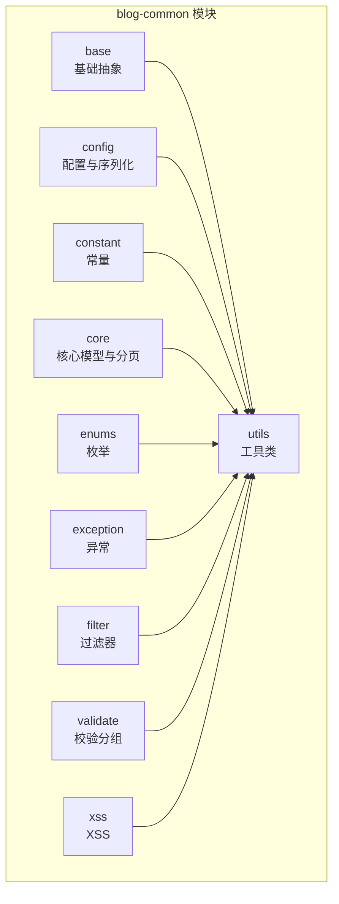

**图表来源**
- [pom.xml:18-149](file://blog-common/pom.xml#L18-L149)

**章节来源**
- [pom.xml:14-17](file://blog-common/pom.xml#L14-L17)

## 核心组件
本节聚焦于通用工具模块的核心抽象与基础设施，包括基础控制器、基础服务、基础实体、基础 Mapper、响应封装与分页请求模型。

- 基础控制器 BaseController：提供日期绑定、分页与排序设置、表格数据封装、统一响应、重定向、登录用户信息获取等能力
- 基础服务 BaseService/BaseServiceImpl：基于 MyBatis-Plus IService 的接口与实现，提供当前登录用户与用户ID获取
- 基础实体 BaseEntity：统一字段（搜索值、创建/更新信息、备注、请求参数）与 JSON 序列化控制
- 基础 Mapper BaseMapperPlus：在 MyBatis-Plus 基础上扩展批量操作、VO 查询与分页、对象投影等能力
- 响应封装 R：统一响应体结构与成功/失败工厂方法
- 分页请求 PageQuery：构建 MyBatis-Plus 分页对象与排序项，支持多字段排序与 SQL 注入防护

**章节来源**
- [BaseController.java:30-182](file://blog-common/src/main/java/blog/common/base/controller/BaseController.java#L30-L182)
- [BaseService.java:5-7](file://blog-common/src/main/java/blog/common/base/service/BaseService.java#L5-L7)
- [BaseServiceImpl.java:9-28](file://blog-common/src/main/java/blog/common/base/service/impl/BaseServiceImpl.java#L9-L28)
- [BaseEntity.java:21-85](file://blog-common/src/main/java/blog/common/base/entity/BaseEntity.java#L21-L85)
- [BaseMapperPlus.java:31-335](file://blog-common/src/main/java/blog/common/base/mapper/BaseMapperPlus.java#L31-L335)
- [R.java:12-107](file://blog-common/src/main/java/blog/common/base/resp/R.java#L12-L107)
- [PageQuery.java:23-128](file://blog-common/src/main/java/blog/common/base/req/PageQuery.java#L23-L128)

## 架构总览
通用工具模块通过“基础抽象 + 工具库 + 配置常量”的组合，向上支撑业务模块（blog-biz）与适配层（blog-admin），向下对接持久层（MyBatis-Plus）与第三方组件（MinIO、Redis、PageHelper、Jackson 等）。整体架构强调：
- 统一入口：BaseController 提供 Web 层统一处理
- 统一服务：BaseServiceImpl 提供服务层统一能力
- 统一响应：R 提供统一响应体
- 统一分页：PageQuery + PageUtils + TableSupport 组合
- 统一常量：Constants 提供跨模块共享常量
- 统一配置：BlogServerConfig 提供项目配置读取

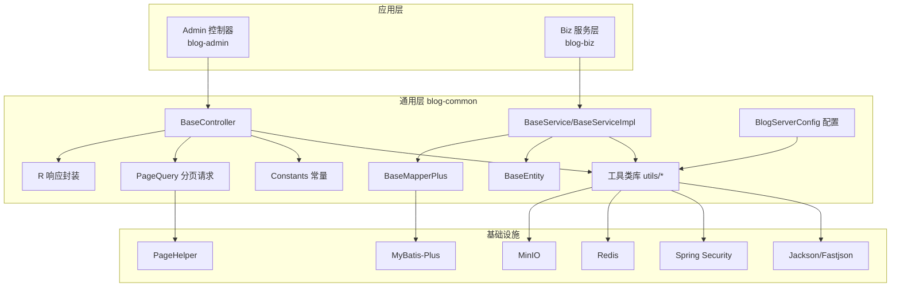

**图表来源**
- [BaseController.java:30-182](file://blog-common/src/main/java/blog/common/base/controller/BaseController.java#L30-L182)
- [BaseService.java:5-7](file://blog-common/src/main/java/blog/common/base/service/BaseService.java#L5-L7)
- [BaseServiceImpl.java:9-28](file://blog-common/src/main/java/blog/common/base/service/impl/BaseServiceImpl.java#L9-L28)
- [BaseEntity.java:21-85](file://blog-common/src/main/java/blog/common/base/entity/BaseEntity.java#L21-L85)
- [BaseMapperPlus.java:31-335](file://blog-common/src/main/java/blog/common/base/mapper/BaseMapperPlus.java#L31-L335)
- [R.java:12-107](file://blog-common/src/main/java/blog/common/base/resp/R.java#L12-L107)
- [PageQuery.java:23-128](file://blog-common/src/main/java/blog/common/base/req/PageQuery.java#L23-L128)
- [Constants.java:12-235](file://blog-common/src/main/java/blog/common/constant/Constants.java#L12-L235)
- [BlogServerConfig.java:13-120](file://blog-common/src/main/java/blog/common/config/BlogServerConfig.java#L13-L120)
- [pom.xml:18-149](file://blog-common/pom.xml#L18-L149)

## 详细组件分析

### 基础控制器 BaseController
BaseController 是 Web 层的统一入口，负责：
- 日期类型转换：通过 @InitBinder 将字符串自动解析为 Date
- 分页与排序：startPage()/startOrderBy()/clearPage() 统一分页与排序设置
- 表格数据封装：getDataTable() 将列表包装为 TableDataInfo
- 统一响应：success()/error()/warn()/toAjax() 等便捷方法
- 重定向：redirect() 统一页面跳转
- 登录用户信息：getLoginUser()/getUserId()/getDeptId()/getUsername()

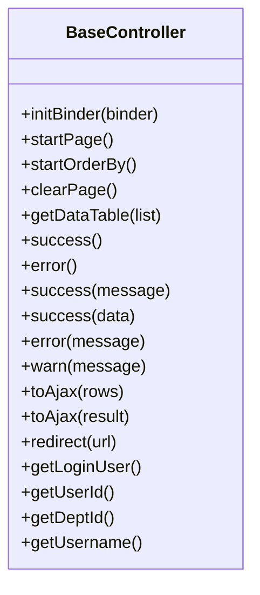

**图表来源**
- [BaseController.java:30-182](file://blog-common/src/main/java/blog/common/base/controller/BaseController.java#L30-L182)

**章节来源**
- [BaseController.java:36-182](file://blog-common/src/main/java/blog/common/base/controller/BaseController.java#L36-L182)

### 基础服务 BaseService/BaseServiceImpl
- BaseService：对 MyBatis-Plus IService 的轻量扩展接口，作为服务层契约
- BaseServiceImpl：在 ServiceImpl 基础上增加当前登录用户与用户ID获取能力，便于业务层直接使用

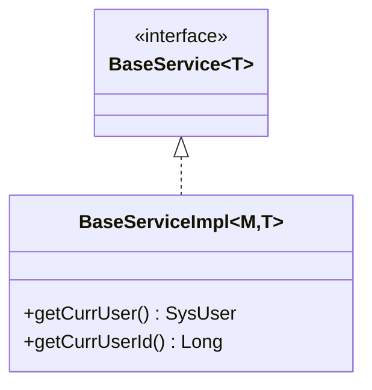

**图表来源**
- [BaseService.java:5-7](file://blog-common/src/main/java/blog/common/base/service/BaseService.java#L5-L7)
- [BaseServiceImpl.java:9-28](file://blog-common/src/main/java/blog/common/base/service/impl/BaseServiceImpl.java#L9-L28)

**章节来源**
- [BaseService.java:5-7](file://blog-common/src/main/java/blog/common/base/service/BaseService.java#L5-L7)
- [BaseServiceImpl.java:15-26](file://blog-common/src/main/java/blog/common/base/service/impl/BaseServiceImpl.java#L15-L26)

### 基础实体 BaseEntity
- 统一字段：searchValue、createBy/createById/createTime、updateBy/updateById/updateTime、remark、params
- 注解控制：字段填充策略、JSON 序列化格式与忽略
- 用途：所有持久化实体继承该基类，确保统一的数据生命周期管理与序列化行为

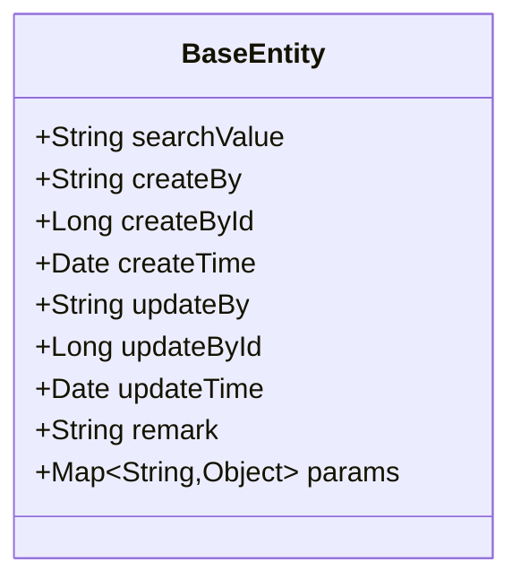

**图表来源**
- [BaseEntity.java:21-85](file://blog-common/src/main/java/blog/common/base/entity/BaseEntity.java#L21-L85)

**章节来源**
- [BaseEntity.java:27-83](file://blog-common/src/main/java/blog/common/base/entity/BaseEntity.java#L27-L83)

### 基础 Mapper BaseMapperPlus
- 泛型能力：通过泛型推断当前 T（实体）与 V（VO）类型
- 批量操作：insertBatch/updateBatchById/insertOrUpdateBatch 及带批次大小版本
- VO 查询：selectVoById/selectVoByIds/selectVoByMap/selectVoOne/selectVoList/selectVoPage
- 对象投影：selectObjs + Function 转换，结合 StreamUtils 实现流式转换
- 与 MyBatis-Plus 无缝集成：基于 BaseMapper 与 Page 插件

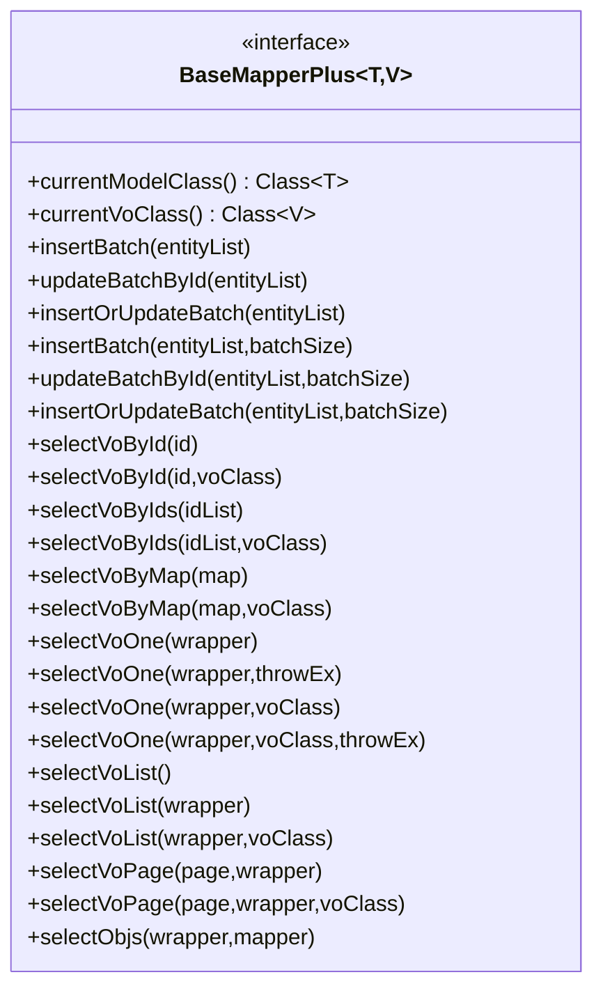

**图表来源**
- [BaseMapperPlus.java:31-335](file://blog-common/src/main/java/blog/common/base/mapper/BaseMapperPlus.java#L31-L335)

**章节来源**
- [BaseMapperPlus.java:41-335](file://blog-common/src/main/java/blog/common/base/mapper/BaseMapperPlus.java#L41-L335)

### 响应封装 R
- 统一响应体：code/msg/data
- 工厂方法：ok()/fail() 及带数据与自定义消息的变体
- 成功/失败判定：isSuccess/isError

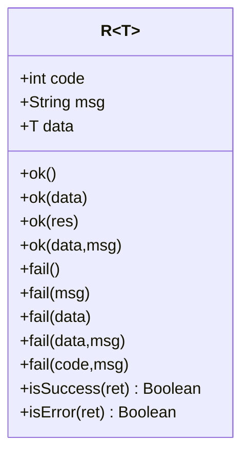

**图表来源**
- [R.java:12-107](file://blog-common/src/main/java/blog/common/base/resp/R.java#L12-L107)

**章节来源**
- [R.java:18-105](file://blog-common/src/main/java/blog/common/base/resp/R.java#L18-L105)

### 分页请求 PageQuery
- 构建分页对象：build() 返回 MyBatis-Plus Page<T>
- 排序构建：支持多字段、多方向，兼容前端传参风格，进行 SQL 注入防护
- 辅助属性：DEFAULT_PAGE_NUM/DEFAULT_PAGE_SIZE、firstNum

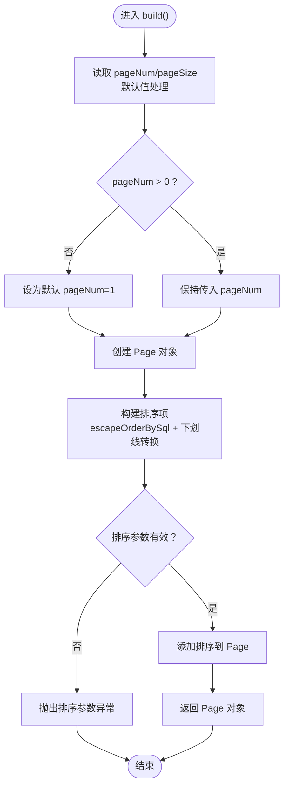

**图表来源**
- [PageQuery.java:62-115](file://blog-common/src/main/java/blog/common/base/req/PageQuery.java#L62-L115)

**章节来源**
- [PageQuery.java:62-120](file://blog-common/src/main/java/blog/common/base/req/PageQuery.java#L62-L120)

### 工具类库与公共常量

#### 安全工具 SecurityUtils
- 获取当前登录用户信息与用户ID/部门ID/用户名
- 密码加密与匹配（BCrypt）
- 权限与角色校验（支持通配符匹配）

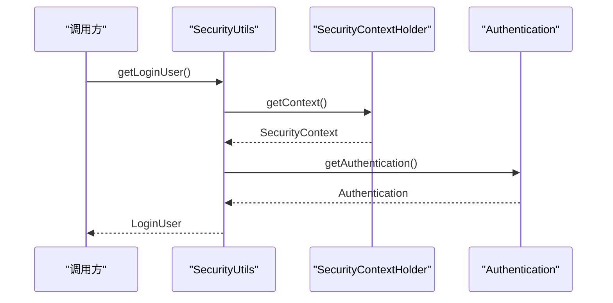

**图表来源**
- [SecurityUtils.java:60-73](file://blog-common/src/main/java/blog/common/utils/SecurityUtils.java#L60-L73)

**章节来源**
- [SecurityUtils.java:27-158](file://blog-common/src/main/java/blog/common/utils/SecurityUtils.java#L27-L158)

#### 字符串工具 StringUtils
- 空值判断、集合判空、数组判空、Map 判空
- 字符串截取、隐藏、匹配、Ant 路径匹配
- 驼峰与下划线互转、填充、格式化等

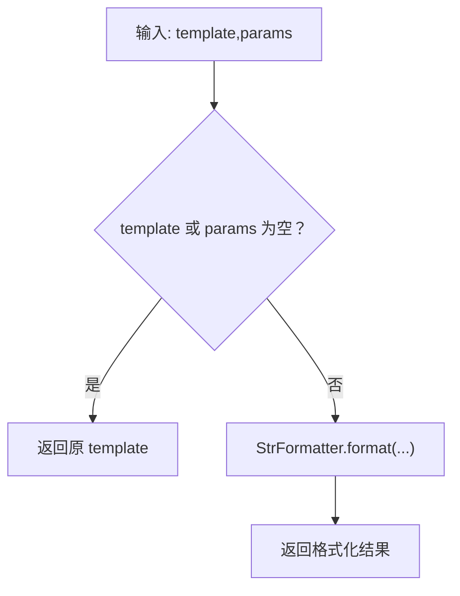

**图表来源**
- [StringUtils.java:316-321](file://blog-common/src/main/java/blog/common/utils/StringUtils.java#L316-L321)

**章节来源**
- [StringUtils.java:42-321](file://blog-common/src/main/java/blog/common/utils/StringUtils.java#L42-L321)

#### 日期工具 DateUtils
- 常用日期格式常量
- 日期解析与格式化
- 服务器启动时间、时间差计算、LocalDate/LocalDateTime 转 Date

**章节来源**
- [DateUtils.java:22-169](file://blog-common/src/main/java/blog/common/utils/DateUtils.java#L22-L169)

#### 分页工具 PageUtils
- startPage()：从 TableSupport 构建 PageDomain 并设置 PageHelper
- clearPage()：清理线程变量

**章节来源**
- [PageUtils.java:17-31](file://blog-common/src/main/java/blog/common/utils/PageUtils.java#L17-L31)

#### 配置读取 BlogServerConfig
- 项目名称、版本、版权年份
- 上传路径、头像路径、下载路径、导入路径
- 地址开关、验证码类型

**章节来源**
- [BlogServerConfig.java:17-118](file://blog-common/src/main/java/blog/common/config/BlogServerConfig.java#L17-L118)

#### 公共常量 Constants
- 字符集、协议、成功/失败标识、登录状态
- JWT 相关键名、资源路径前缀
- 分隔符、特殊字符、定时任务白名单与违规字符

**章节来源**
- [Constants.java:16-234](file://blog-common/src/main/java/blog/common/constant/Constants.java#L16-L234)

### 异常与全局异常
- GlobalException：全局运行时异常，支持 detailMessage 与 message 的链式设置
- 与工具类配合：SecurityUtils 在获取用户信息失败时抛出 ServiceException（HttpStatus.UNAUTHORIZED）

**章节来源**
- [GlobalException.java:8-51](file://blog-common/src/main/java/blog/common/exception/GlobalException.java#L8-L51)
- [SecurityUtils.java:31-65](file://blog-common/src/main/java/blog/common/utils/SecurityUtils.java#L31-L65)

## 依赖分析
blog-common 模块对外部组件的依赖集中在核心框架与常用工具上：
- Spring 生态：Spring Context、Web、Security、Validation、Redis
- 数据访问：MyBatis-Plus、PageHelper
- 工具库：Apache Commons Lang/IO、Fastjson、Hutool、POI、SnakeYAML、JWT、UserAgentUtils、Servlet API
- 对象池：Commons Pool2
- MinIO：对象存储

```mermaid
graph TB
BC["blog-common"]
S1["spring-context-support"]
S2["spring-web"]
S3["spring-boot-starter-security"]
S4["spring-boot-starter-validation"]
MP["mybatis-plus-spring-boot3-starter"]
PH["pagehelper-spring-boot-starter"]
CL["commons-lang3"]
CJ["jackson-databind"]
FJ["fastjson2"]
IO["commons-io"]
POI["poi-ooxml"]
YML["snakeyaml"]
JWT["jjwt"]
JAXB["jaxb-api"]
REDIS["spring-boot-starter-data-redis"]
POOL["commons-pool2"]
UA["UserAgentUtils"]
SERV["jakarta.servlet-api"]
HUT["hutool-all"]
MINIO["minio"]
BC --> S1
BC --> S2
BC --> S3
BC --> S4
BC --> MP
BC --> PH
BC --> CL
BC --> CJ
BC --> FJ
BC --> IO
BC --> POI
BC --> YML
BC --> JWT
BC --> JAXB
BC --> REDIS
BC --> POOL
BC --> UA
BC --> SERV
BC --> HUT
BC --> MINIO
```

**图表来源**
- [pom.xml:18-149](file://blog-common/pom.xml#L18-L149)

**章节来源**
- [pom.xml:18-149](file://blog-common/pom.xml#L18-L149)

## 性能考虑
- 分页与排序
  - 使用 PageHelper 与 escapeOrderBySql 防注入，避免全表扫描
  - 合理设置合理分页参数 reasonable，减少无效分页
- 批量操作
  - BaseMapperPlus 提供 insertBatch/updateBatchById/insertOrUpdateBatch，建议在大批量场景使用带 batchSize 的重载以控制内存占用
- 序列化与反序列化
  - R 与 BaseEntity 使用 JSON 注解控制序列化字段，避免传输冗余数据
- 工具类优化
  - StringUtils/DateUtils/SecurityUtils 等工具类尽量避免重复初始化与正则匹配
- 缓存与异步
  - BlogServerConfig 与 Redis Starter 为后续引入缓存与异步任务提供基础

[本节为通用指导，无需具体文件来源]

## 故障排除指南
- 分页排序异常
  - 现象：排序参数有误导致异常
  - 排查：确认 PageQuery 中 isAsc 与 orderByColumn 的格式与数量一致；检查 SqlUtil.escapeOrderBySql 是否生效
  - 参考
    - [PageQuery.java:85-115](file://blog-common/src/main/java/blog/common/base/req/PageQuery.java#L85-L115)
- 用户信息获取失败
  - 现象：获取用户ID/用户名抛出 UNAUTHORIZED
  - 排查：确认 SecurityContext 是否存在 Authentication；检查登录流程与 Token 有效性
  - 参考
    - [SecurityUtils.java:31-65](file://blog-common/src/main/java/blog/common/utils/SecurityUtils.java#L31-L65)
- 响应体结构不一致
  - 现象：前后端响应体不一致
  - 排查：统一使用 R 与 BaseController 的 success/error/warn/toAjax 方法
  - 参考
    - [R.java:31-73](file://blog-common/src/main/java/blog/common/base/resp/R.java#L31-L73)
    - [BaseController.java:88-145](file://blog-common/src/main/java/blog/common/base/controller/BaseController.java#L88-L145)
- 文件上传路径异常
  - 现象：上传路径拼接错误
  - 排查：确认 BlogServerConfig 的 profile 配置与实际路径一致
  - 参考
    - [BlogServerConfig.java:68-118](file://blog-common/src/main/java/blog/common/config/BlogServerConfig.java#L68-L118)

**章节来源**
- [PageQuery.java:85-115](file://blog-common/src/main/java/blog/common/base/req/PageQuery.java#L85-L115)
- [SecurityUtils.java:31-65](file://blog-common/src/main/java/blog/common/utils/SecurityUtils.java#L31-L65)
- [R.java:31-73](file://blog-common/src/main/java/blog/common/base/resp/R.java#L31-L73)
- [BaseController.java:88-145](file://blog-common/src/main/java/blog/common/base/controller/BaseController.java#L88-L145)
- [BlogServerConfig.java:68-118](file://blog-common/src/main/java/blog/common/config/BlogServerConfig.java#L68-L118)

## 结论
blog-common 模块通过“基础抽象 + 工具库 + 配置常量”的设计，实现了跨模块的高复用与强一致性：
- 基础控制器与服务层统一了 Web 与服务层的通用逻辑
- 基础实体与 Mapper 扩展保证了数据模型与查询能力的一致性
- 响应封装与分页请求提供了标准化的交互体验
- 工具类与常量为业务开发提供了稳定可靠的支撑
- 依赖清晰、扩展点明确，便于后续演进与维护

[本节为总结，无需具体文件来源]

## 附录

### 使用示例（路径指引）
- 控制器层
  - 分页查询：在控制器方法中调用 startPage()/startOrderBy()，随后 getDataTable(list)
    - [BaseController.java:50-83](file://blog-common/src/main/java/blog/common/base/controller/BaseController.java#L50-L83)
  - 统一响应：使用 success()/error()/toAjax()
    - [BaseController.java:88-145](file://blog-common/src/main/java/blog/common/base/controller/BaseController.java#L88-L145)
- 服务层
  - 获取当前用户：getCurrUser()/getCurrUserId()
    - [BaseServiceImpl.java:15-26](file://blog-common/src/main/java/blog/common/base/service/impl/BaseServiceImpl.java#L15-L26)
- 实体与 Mapper
  - 继承 BaseEntity，使用 BaseMapperPlus 的 VO 查询与批量操作
    - [BaseEntity.java:21-85](file://blog-common/src/main/java/blog/common/base/entity/BaseEntity.java#L21-L85)
    - [BaseMapperPlus.java:132-176](file://blog-common/src/main/java/blog/common/base/mapper/BaseMapperPlus.java#L132-L176)
- 工具类
  - 安全：encryptPassword()/matchesPassword()/hasPermi()/hasRole()
    - [SecurityUtils.java:81-156](file://blog-common/src/main/java/blog/common/utils/SecurityUtils.java#L81-L156)
  - 字符串：format()/toUnderScoreCase()/toCamelCase()/isMatch()
    - [StringUtils.java:316-575](file://blog-common/src/main/java/blog/common/utils/StringUtils.java#L316-L575)
  - 日期：parseDate()/timeDistance()/toDate()
    - [DateUtils.java:102-168](file://blog-common/src/main/java/blog/common/utils/DateUtils.java#L102-L168)
  - 分页：PageUtils.startPage()/clearPage()
    - [PageUtils.java:17-31](file://blog-common/src/main/java/blog/common/utils/PageUtils.java#L17-L31)
- 配置与常量
  - 读取配置：BlogServerConfig.getUploadPath()/getAvatarPath()
    - [BlogServerConfig.java:95-118](file://blog-common/src/main/java/blog/common/config/BlogServerConfig.java#L95-L118)
  - 常量使用：Constants.TOKEN/TOKEN_PREFIX/JWT_* 等
    - [Constants.java:101-137](file://blog-common/src/main/java/blog/common/constant/Constants.java#L101-L137)

**章节来源**
- [BaseController.java:50-145](file://blog-common/src/main/java/blog/common/base/controller/BaseController.java#L50-L145)
- [BaseServiceImpl.java:15-26](file://blog-common/src/main/java/blog/common/base/service/impl/BaseServiceImpl.java#L15-L26)
- [BaseEntity.java:21-85](file://blog-common/src/main/java/blog/common/base/entity/BaseEntity.java#L21-L85)
- [BaseMapperPlus.java:132-176](file://blog-common/src/main/java/blog/common/base/mapper/BaseMapperPlus.java#L132-L176)
- [SecurityUtils.java:81-156](file://blog-common/src/main/java/blog/common/utils/SecurityUtils.java#L81-L156)
- [StringUtils.java:316-575](file://blog-common/src/main/java/blog/common/utils/StringUtils.java#L316-L575)
- [DateUtils.java:102-168](file://blog-common/src/main/java/blog/common/utils/DateUtils.java#L102-L168)
- [PageUtils.java:17-31](file://blog-common/src/main/java/blog/common/utils/PageUtils.java#L17-L31)
- [BlogServerConfig.java:95-118](file://blog-common/src/main/java/blog/common/config/BlogServerConfig.java#L95-L118)
- [Constants.java:101-137](file://blog-common/src/main/java/blog/common/constant/Constants.java#L101-L137)