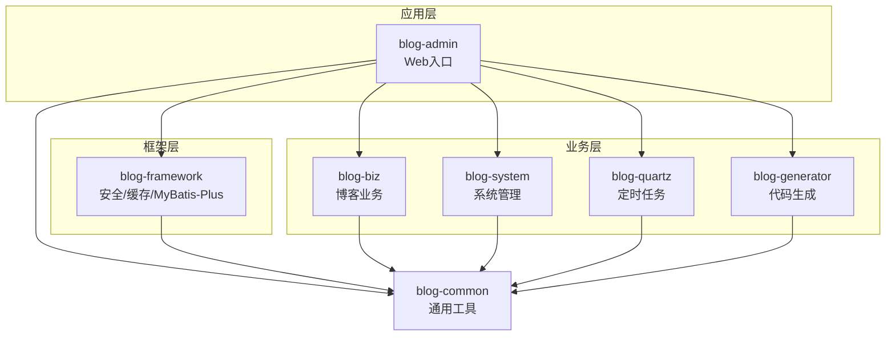
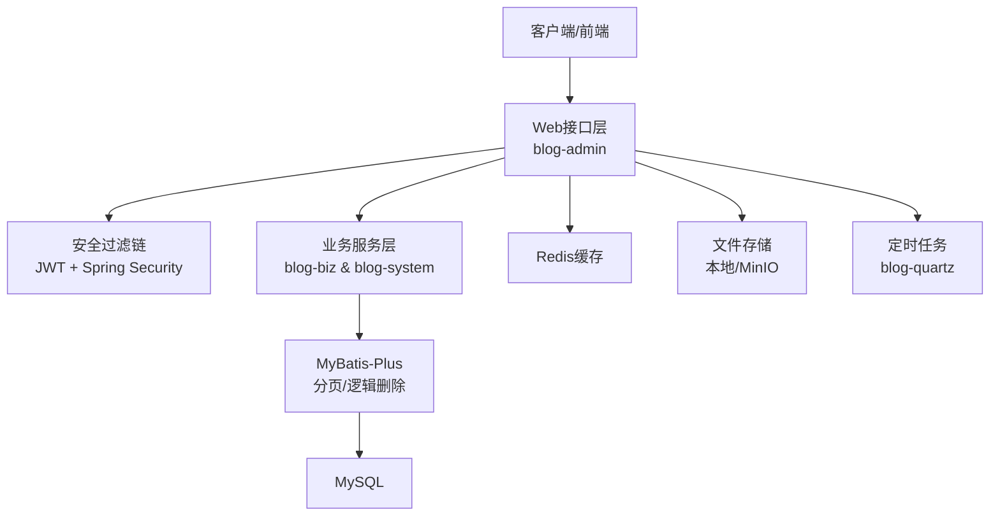
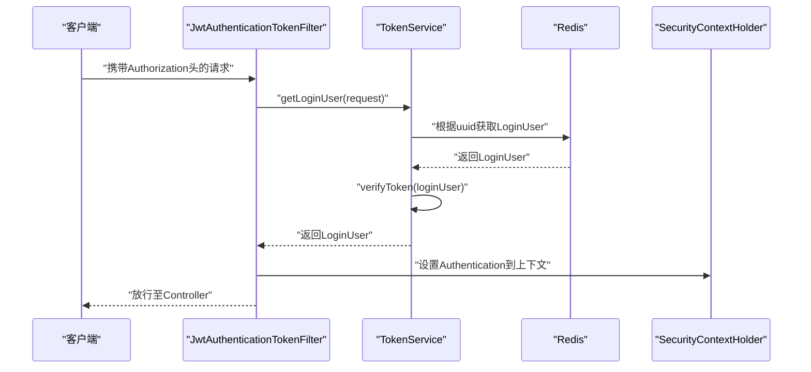
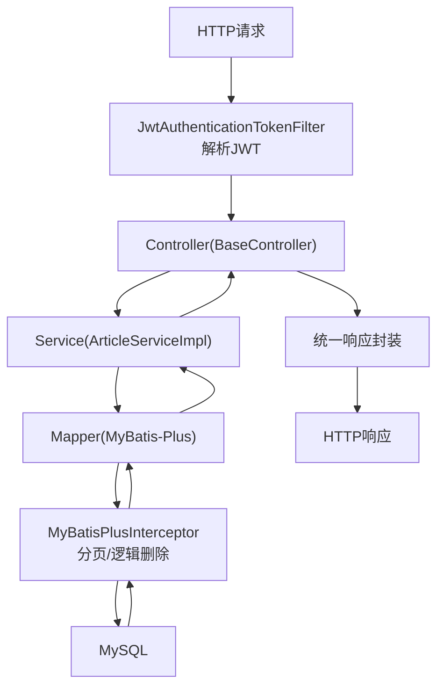
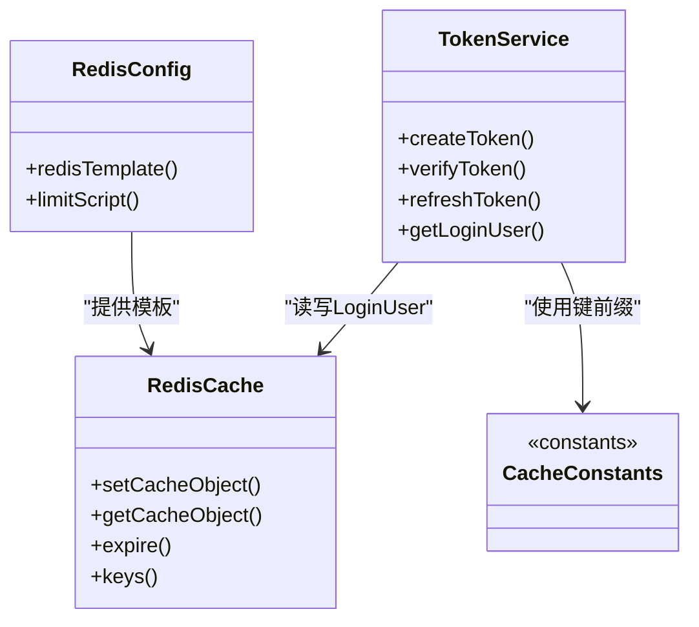
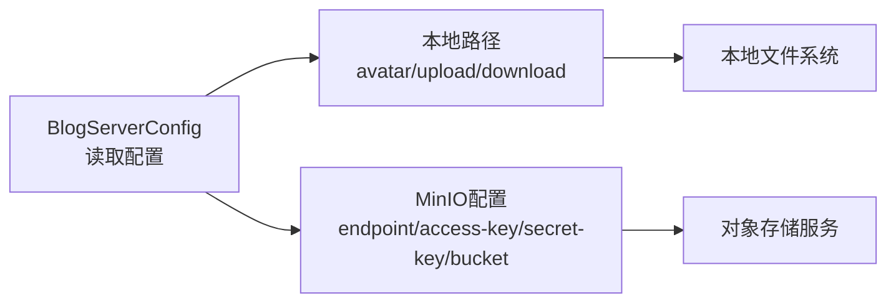
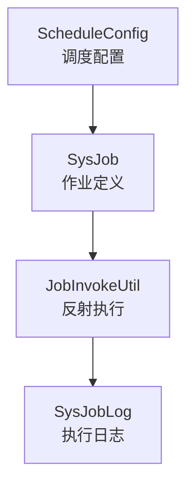
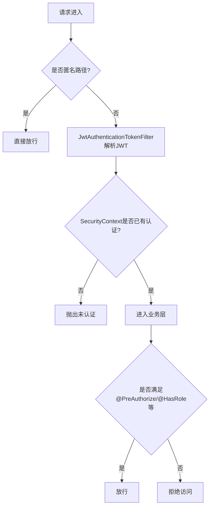
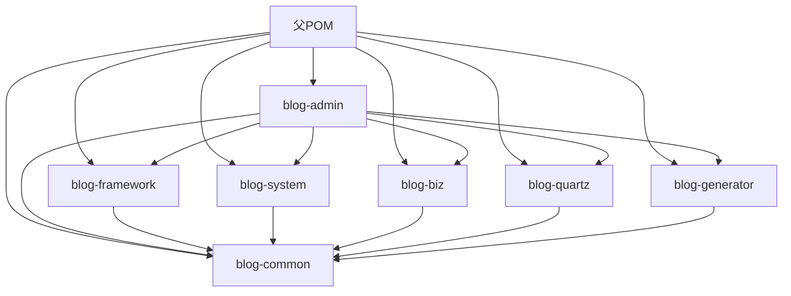

# 系统架构设计

<cite>
**本文引用的文件**
- [pom.xml](file://pom.xml)
- [BlogServerApplication.java](file://blog-admin/src/main/java/blog/BlogServerApplication.java)
- [application.yml](file://blog-admin/src/main/resources/application.yml)
- [SecurityConfig.java](file://blog-framework/src/main/java/blog/framework/config/SecurityConfig.java)
- [JwtAuthenticationTokenFilter.java](file://blog-framework/src/main/java/blog/framework/security/filter/JwtAuthenticationTokenFilter.java)
- [TokenService.java](file://blog-framework/src/main/java/blog/framework/web/service/TokenService.java)
- [RedisConfig.java](file://blog-framework/src/main/java/blog/framework/config/RedisConfig.java)
- [RedisCache.java](file://blog-common/src/main/java/blog/common/core/redis/RedisCache.java)
- [CacheConstants.java](file://blog-common/src/main/java/blog/common/constant/CacheConstants.java)
- [BlogServerConfig.java](file://blog-common/src/main/java/blog/common/config/BlogServerConfig.java)
- [BaseController.java](file://blog-common/src/main/java/blog/common/base/controller/BaseController.java)
- [MybatisPlusConfig.java](file://blog-framework/src/main/java/blog/framework/config/MybatisPlusConfig.java)
- [ArticleServiceImpl.java](file://blog-biz/src/main/java/blog/biz/service/impl/ArticleServiceImpl.java)
- [SysUserServiceImpl.java](file://blog-system/src/main/java/blog/system/service/impl/SysUserServiceImpl.java)
</cite>

## 目录
1. [简介](#简介)
2. [项目结构](#项目结构)
3. [核心组件](#核心组件)
4. [架构总览](#架构总览)
5. [详细组件分析](#详细组件分析)
6. [依赖分析](#依赖分析)
7. [性能考虑](#性能考虑)
8. [故障排查指南](#故障排查指南)
9. [结论](#结论)
10. [附录](#附录)

## 简介
本设计文档面向Leejie博客系统，围绕基于Spring Boot的多模块分层架构展开，系统采用Maven聚合工程组织，模块化设计清晰：表现层（blog-admin）、框架层（blog-framework）、业务层（blog-biz）、系统管理（blog-system）、定时任务（blog-quartz）、代码生成（blog-generator）、通用工具（blog-common）。文档重点阐述安全架构（JWT认证、Spring Security配置、权限控制）、数据流设计（从HTTP请求到数据库）、缓存策略、文件存储架构（本地与MinIO）、任务调度机制，并提供架构图与组件交互图，帮助开发者快速理解系统整体设计与技术选型。

## 项目结构
系统采用Maven多模块聚合工程，父POM统一管理版本与模块清单。各模块职责明确：
- blog-admin：Web应用入口，负责对外HTTP接口暴露与Swagger文档展示
- blog-framework：安全、缓存、MyBatis-Plus、拦截器、异步等基础设施
- blog-system：系统管理领域（用户、角色、菜单、配置等）
- blog-biz：博客业务领域（文章、分类、文件等）
- blog-quartz：定时任务调度
- blog-generator：代码生成
- blog-common：通用常量、工具、异常、配置、Redis封装等

**图表来源**
- [pom.xml:225-233](file://pom.xml#L225-L233)
- [BlogServerApplication.java:12-19](file://blog-admin/src/main/java/blog/BlogServerApplication.java#L12-L19)

**章节来源**
- [pom.xml:225-233](file://pom.xml#L225-L233)
- [BlogServerApplication.java:12-19](file://blog-admin/src/main/java/blog/BlogServerApplication.java#L12-L19)

## 核心组件
- 安全与认证：基于JWT的无状态认证，Spring Security配置与过滤器链
- 缓存：Redis集中式缓存，Token与验证码等键空间
- 数据访问：MyBatis-Plus分页与逻辑删除，雪花ID生成器
- 文件存储：本地文件路径配置与MinIO对象存储
- 业务服务：文章、用户等核心业务的Service实现
- 配置中心：统一配置读取与跨域、XSS、防重提交等策略

**章节来源**
- [SecurityConfig.java:94-127](file://blog-framework/src/main/java/blog/framework/config/SecurityConfig.java#L94-L127)
- [JwtAuthenticationTokenFilter.java:27-50](file://blog-framework/src/main/java/blog/framework/security/filter/JwtAuthenticationTokenFilter.java#L27-L50)
- [TokenService.java:32-213](file://blog-framework/src/main/java/blog/framework/web/service/TokenService.java#L32-L213)
- [RedisConfig.java:17-67](file://blog-framework/src/main/java/blog/framework/config/RedisConfig.java#L17-L67)
- [RedisCache.java:24-248](file://blog-common/src/main/java/blog/common/core/redis/RedisCache.java#L24-L248)
- [CacheConstants.java:8-44](file://blog-common/src/main/java/blog/common/constant/CacheConstants.java#L8-L44)
- [BlogServerConfig.java:13-120](file://blog-common/src/main/java/blog/common/config/BlogServerConfig.java#L13-L120)
- [MybatisPlusConfig.java:16-56](file://blog-framework/src/main/java/blog/framework/config/MybatisPlusConfig.java#L16-L56)
- [BaseController.java:30-182](file://blog-common/src/main/java/blog/common/base/controller/BaseController.java#L30-L182)
- [ArticleServiceImpl.java:21-95](file://blog-biz/src/main/java/blog/biz/service/impl/ArticleServiceImpl.java#L21-L95)
- [SysUserServiceImpl.java:42-513](file://blog-system/src/main/java/blog/system/service/impl/SysUserServiceImpl.java#L42-L513)

## 架构总览
系统采用前后端分离的三层架构：
- 表现层（Web）：接收HTTP请求，调用业务层，返回标准响应
- 业务层（Service）：编排领域模型与数据访问，处理业务规则
- 数据访问层（Mapper/DAO）：MyBatis-Plus映射SQL，完成持久化
- 基础设施层（Framework/Common）：安全、缓存、配置、工具

**图表来源**
- [SecurityConfig.java:94-127](file://blog-framework/src/main/java/blog/framework/config/SecurityConfig.java#L94-L127)
- [JwtAuthenticationTokenFilter.java:27-50](file://blog-framework/src/main/java/blog/framework/security/filter/JwtAuthenticationTokenFilter.java#L27-L50)
- [TokenService.java:32-213](file://blog-framework/src/main/java/blog/framework/web/service/TokenService.java#L32-L213)
- [MybatisPlusConfig.java:16-56](file://blog-framework/src/main/java/blog/framework/config/MybatisPlusConfig.java#L16-L56)
- [application.yml:65-89](file://blog-admin/src/main/resources/application.yml#L65-L89)
- [application.yml:155-161](file://blog-admin/src/main/resources/application.yml#L155-L161)

## 详细组件分析

### 安全架构与认证流程
系统采用JWT无状态认证，结合Spring Security过滤器链实现：
- 入口：SecurityConfig配置过滤器链，禁用CSRF，开启方法级权限注解
- 过滤器顺序：CorsFilter → JwtAuthenticationTokenFilter → UsernamePasswordAuthenticationFilter → LogoutFilter
- JWT解析：JwtAuthenticationTokenFilter从请求头提取令牌，交由TokenService解析与校验
- 会话策略：STATELESS，用户信息通过Redis缓存维护

**图表来源**
- [SecurityConfig.java:94-127](file://blog-framework/src/main/java/blog/framework/config/SecurityConfig.java#L94-L127)
- [JwtAuthenticationTokenFilter.java:27-50](file://blog-framework/src/main/java/blog/framework/security/filter/JwtAuthenticationTokenFilter.java#L27-L50)
- [TokenService.java:62-142](file://blog-framework/src/main/java/blog/framework/web/service/TokenService.java#L62-L142)
- [RedisCache.java:99-102](file://blog-common/src/main/java/blog/common/core/redis/RedisCache.java#L99-L102)

**章节来源**
- [SecurityConfig.java:31-137](file://blog-framework/src/main/java/blog/framework/config/SecurityConfig.java#L31-L137)
- [JwtAuthenticationTokenFilter.java:27-50](file://blog-framework/src/main/java/blog/framework/security/filter/JwtAuthenticationTokenFilter.java#L27-L50)
- [TokenService.java:32-213](file://blog-framework/src/main/java/blog/framework/web/service/TokenService.java#L32-L213)
- [CacheConstants.java:8-44](file://blog-common/src/main/java/blog/common/constant/CacheConstants.java#L8-L44)

### 数据流设计（从HTTP请求到数据库）
以“文章新增”为例，展示典型请求处理链路：
- Web层：BaseController统一参数绑定与分页、返回封装
- 业务层：ArticleServiceImpl调用Mapper与分页插件
- 数据访问层：MyBatis-Plus拦截器注入分页与租户/逻辑删除
- 持久化：MySQL

**图表来源**
- [BaseController.java:30-182](file://blog-common/src/main/java/blog/common/base/controller/BaseController.java#L30-L182)
- [ArticleServiceImpl.java:21-95](file://blog-biz/src/main/java/blog/biz/service/impl/ArticleServiceImpl.java#L21-L95)
- [MybatisPlusConfig.java:16-56](file://blog-framework/src/main/java/blog/framework/config/MybatisPlusConfig.java#L16-L56)

**章节来源**
- [BaseController.java:30-182](file://blog-common/src/main/java/blog/common/base/controller/BaseController.java#L30-L182)
- [ArticleServiceImpl.java:21-95](file://blog-biz/src/main/java/blog/biz/service/impl/ArticleServiceImpl.java#L21-L95)
- [MybatisPlusConfig.java:16-56](file://blog-framework/src/main/java/blog/framework/config/MybatisPlusConfig.java#L16-L56)

### 缓存策略
- 键空间：登录令牌、验证码、系统配置、字典、防重提交、限流、密码错误计数等
- 序列化：RedisTemplate采用StringRedisSerializer作为key，FastJson2序列化value
- 限流脚本：基于Lua脚本的滑动窗口限流
- Token缓存：TokenService将LoginUser按uuid写入Redis，过期时间与自动续期

**图表来源**
- [RedisConfig.java:17-67](file://blog-framework/src/main/java/blog/framework/config/RedisConfig.java#L17-L67)
- [RedisCache.java:24-248](file://blog-common/src/main/java/blog/common/core/redis/RedisCache.java#L24-L248)
- [TokenService.java:32-213](file://blog-framework/src/main/java/blog/framework/web/service/TokenService.java#L32-L213)
- [CacheConstants.java:8-44](file://blog-common/src/main/java/blog/common/constant/CacheConstants.java#L8-L44)

**章节来源**
- [RedisConfig.java:17-67](file://blog-framework/src/main/java/blog/framework/config/RedisConfig.java#L17-L67)
- [RedisCache.java:24-248](file://blog-common/src/main/java/blog/common/core/redis/RedisCache.java#L24-L248)
- [TokenService.java:32-213](file://blog-framework/src/main/java/blog/framework/web/service/TokenService.java#L32-L213)
- [CacheConstants.java:8-44](file://blog-common/src/main/java/blog/common/constant/CacheConstants.java#L8-L44)

### 文件存储架构
- 本地存储：通过BlogServerConfig读取上传根路径，提供头像、下载、上传等子路径
- 对象存储：MinIO配置项用于对象桶与凭证，便于扩展云存储
- 配置示例：application.yml中包含MinIO相关属性

**图表来源**
- [BlogServerConfig.java:13-120](file://blog-common/src/main/java/blog/common/config/BlogServerConfig.java#L13-L120)
- [application.yml:6-10](file://blog-admin/src/main/resources/application.yml#L6-L10)
- [application.yml:155-161](file://blog-admin/src/main/resources/application.yml#L155-L161)

**章节来源**
- [BlogServerConfig.java:13-120](file://blog-common/src/main/java/blog/common/config/BlogServerConfig.java#L13-L120)
- [application.yml:6-10](file://blog-admin/src/main/resources/application.yml#L6-L10)
- [application.yml:155-161](file://blog-admin/src/main/resources/application.yml#L155-L161)

### 任务调度机制
- 模块：blog-quartz提供作业与日志管理
- 配置：ScheduleConfig（位于该模块内）负责调度器与触发器配置
- 执行：抽象任务类与工具类封装，支持并发策略与日志记录

**图表来源**
- [application.yml:155-161](file://blog-admin/src/main/resources/application.yml#L155-L161)

**章节来源**
- [application.yml:155-161](file://blog-admin/src/main/resources/application.yml#L155-L161)

### 权限控制策略
- 方法级权限：SecurityConfig启用方法级注解，结合业务层注解实现细粒度控制
- 数据范围：SysUserServiceImpl使用@Datascope注解限定用户可见范围
- 登录与注册：SecurityConfig对匿名访问路径白名单放行

**图表来源**
- [SecurityConfig.java:94-127](file://blog-framework/src/main/java/blog/framework/config/SecurityConfig.java#L94-L127)
- [SysUserServiceImpl.java:77-80](file://blog-system/src/main/java/blog/system/service/impl/SysUserServiceImpl.java#L77-L80)

**章节来源**
- [SecurityConfig.java:94-127](file://blog-framework/src/main/java/blog/framework/config/SecurityConfig.java#L94-L127)
- [SysUserServiceImpl.java:77-80](file://blog-system/src/main/java/blog/system/service/impl/SysUserServiceImpl.java#L77-L80)

## 依赖分析
- 模块依赖：父POM统一声明各模块坐标与版本，模块间通过artifactId引用
- 外部依赖：Spring Boot、MyBatis-Plus、Druid、Redis、MinIO、JWT、OpenAPI等
- 关键耦合点：blog-admin依赖blog-framework、blog-system、blog-biz、blog-quartz、blog-generator、blog-common；blog-framework依赖blog-common

**图表来源**
- [pom.xml:168-193](file://pom.xml#L168-L193)
- [pom.xml:225-233](file://pom.xml#L225-L233)

**章节来源**
- [pom.xml:168-193](file://pom.xml#L168-L193)
- [pom.xml:225-233](file://pom.xml#L225-L233)

## 性能考虑
- 无状态认证：JWT避免服务端会话存储，降低横向扩展复杂度
- Redis缓存：热点数据与用户会话缓存，减少数据库压力
- 分页与逻辑删除：MyBatis-Plus内置分页与逻辑删除，提升查询效率与数据安全性
- 并发与限流：Redis Lua限流脚本，防止接口被恶意刷量
- 文件存储：本地与MinIO双栈，结合CDN可进一步优化静态资源访问

## 故障排查指南
- 认证失败
  - 检查SecurityConfig匿名路径与鉴权规则
  - 核对JwtAuthenticationTokenFilter是否正确解析Authorization头
  - 确认TokenService签名密钥与过期时间配置
- 缓存异常
  - 检查Redis连接配置与序列化器
  - 核对CacheConstants键前缀与业务键拼装
- 文件上传问题
  - 校验BlogServerConfig上传路径与MinIO配置
  - 检查application.yml中multipart大小限制
- 数据访问异常
  - 确认MyBatis-Plus配置与mapper路径
  - 检查逻辑删除字段与分页参数

**章节来源**
- [SecurityConfig.java:94-127](file://blog-framework/src/main/java/blog/framework/config/SecurityConfig.java#L94-L127)
- [JwtAuthenticationTokenFilter.java:27-50](file://blog-framework/src/main/java/blog/framework/security/filter/JwtAuthenticationTokenFilter.java#L27-L50)
- [TokenService.java:32-213](file://blog-framework/src/main/java/blog/framework/web/service/TokenService.java#L32-L213)
- [RedisConfig.java:17-67](file://blog-framework/src/main/java/blog/framework/config/RedisConfig.java#L17-L67)
- [CacheConstants.java:8-44](file://blog-common/src/main/java/blog/common/constant/CacheConstants.java#L8-L44)
- [BlogServerConfig.java:13-120](file://blog-common/src/main/java/blog/common/config/BlogServerConfig.java#L13-L120)
- [application.yml:52-59](file://blog-admin/src/main/resources/application.yml#L52-L59)
- [MybatisPlusConfig.java:16-56](file://blog-framework/src/main/java/blog/framework/config/MybatisPlusConfig.java#L16-L56)

## 结论
本系统以Spring Boot为核心，采用模块化与分层架构，结合JWT无状态认证、Redis缓存、MyBatis-Plus与MinIO对象存储，构建了高可用、易扩展的博客平台。通过清晰的职责划分与统一的基础设施，开发者可在保证安全与性能的前提下快速迭代业务功能。

## 附录
- 启动入口：BlogServerApplication排除数据源自动装配，配合多环境配置运行
- 配置要点：token.header、token.secret、token.expireTime、Redis连接、MinIO参数均在application.yml中集中管理

**章节来源**
- [BlogServerApplication.java:12-19](file://blog-admin/src/main/java/blog/BlogServerApplication.java#L12-L19)
- [application.yml:90-98](file://blog-admin/src/main/resources/application.yml#L90-L98)
- [application.yml:65-89](file://blog-admin/src/main/resources/application.yml#L65-L89)
- [application.yml:155-161](file://blog-admin/src/main/resources/application.yml#L155-L161)