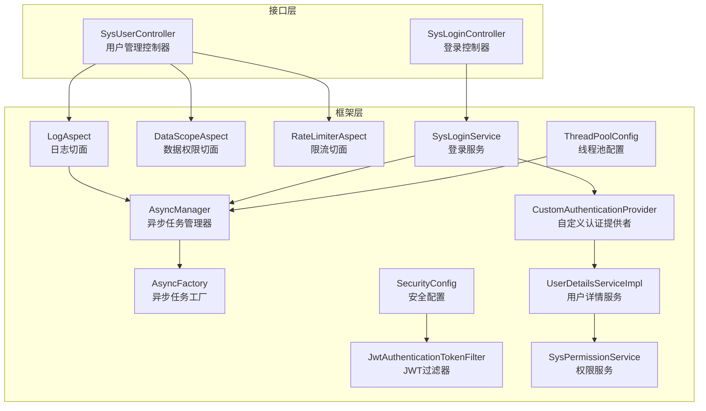
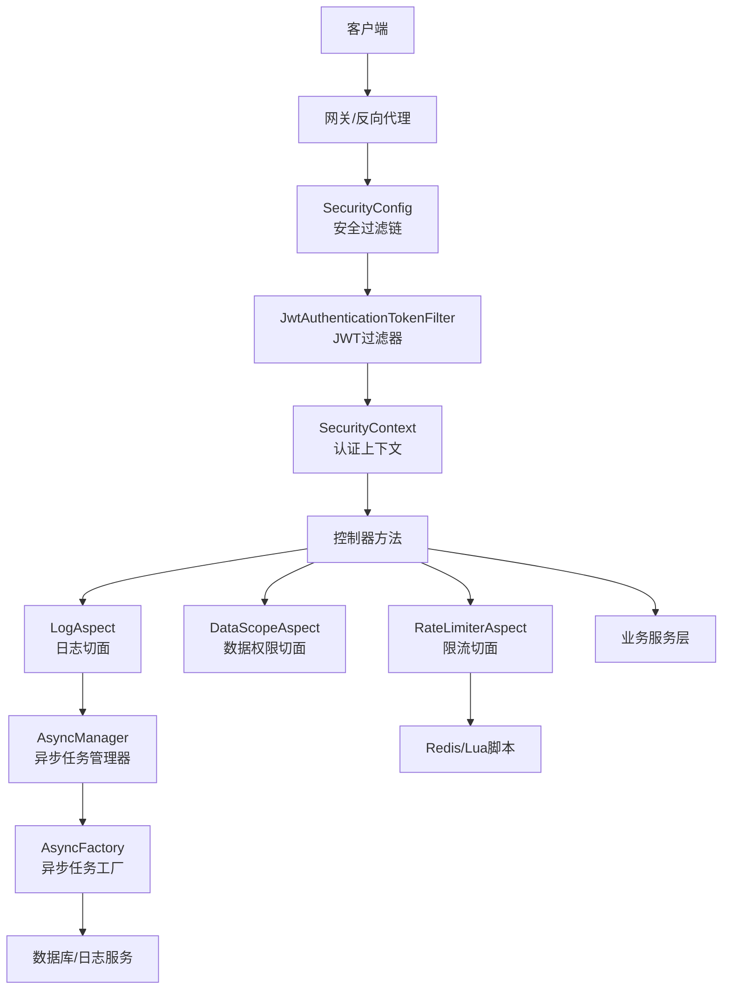
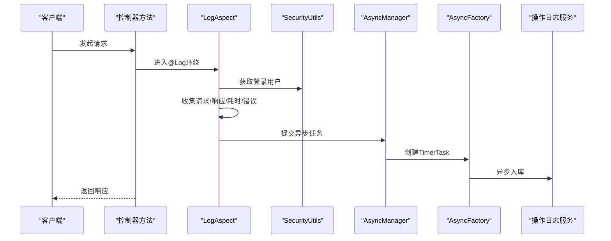
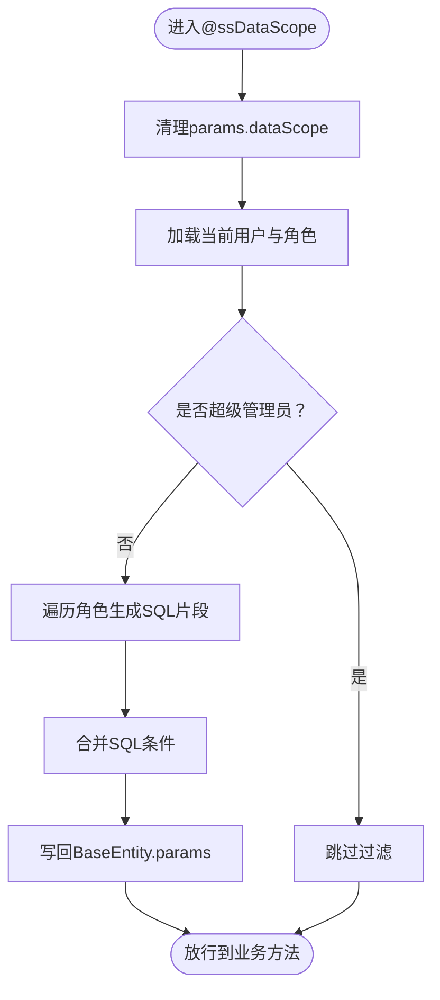
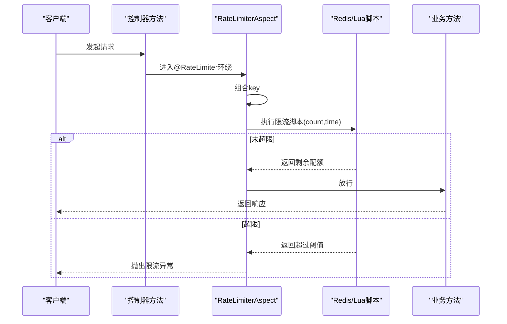
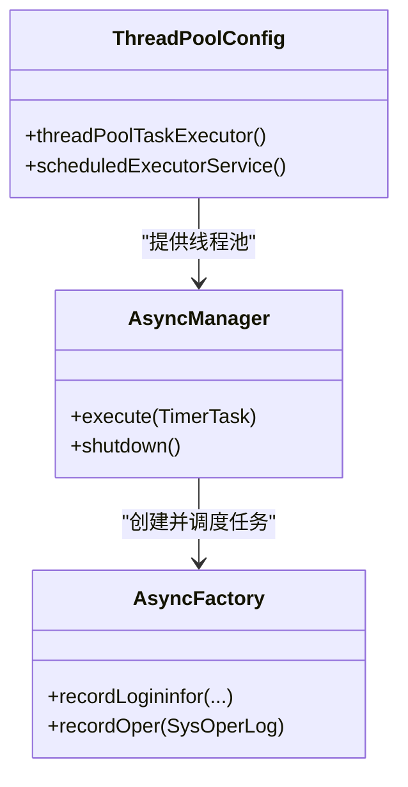
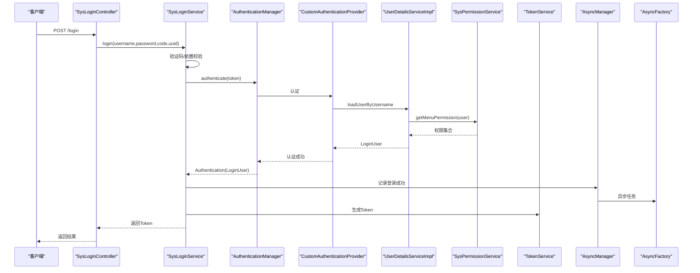
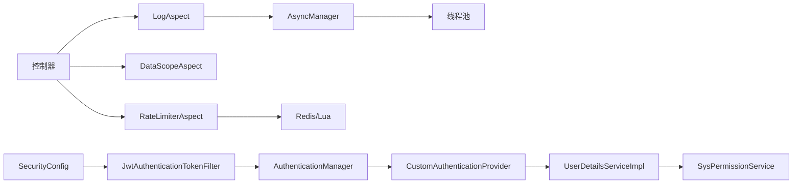

# 组件交互设计

<cite>
**本文引用的文件**
- [LogAspect.java](file://blog-framework/src/main/java/blog/framework/aspectj/LogAspect.java)
- [DataScopeAspect.java](file://blog-framework/src/main/java/blog/framework/aspectj/DataScopeAspect.java)
- [RateLimiterAspect.java](file://blog-framework/src/main/java/blog/framework/aspectj/RateLimiterAspect.java)
- [AsyncFactory.java](file://blog-framework/src/main/java/blog/framework/manager/factory/AsyncFactory.java)
- [AsyncManager.java](file://blog-framework/src/main/java/blog/framework/manager/AsyncManager.java)
- [UserDetailsServiceImpl.java](file://blog-framework/src/main/java/blog/framework/web/service/UserDetailsServiceImpl.java)
- [SysPermissionService.java](file://blog-framework/src/main/java/blog/framework/web/service/SysPermissionService.java)
- [CustomAuthenticationProvider.java](file://blog-framework/src/main/java/blog/framework/security/provider/CustomAuthenticationProvider.java)
- [JwtAuthenticationTokenFilter.java](file://blog-framework/src/main/java/blog/framework/security/filter/JwtAuthenticationTokenFilter.java)
- [SysLoginService.java](file://blog-framework/src/main/java/blog/framework/web/service/SysLoginService.java)
- [SecurityConfig.java](file://blog-framework/src/main/java/blog/framework/config/SecurityConfig.java)
- [ThreadPoolConfig.java](file://blog-framework/src/main/java/blog/framework/config/ThreadPoolConfig.java)
- [Log.java](file://blog-common/src/main/java/blog/common/annotation/Log.java)
- [DataScope.java](file://blog-common/src/main/java/blog/common/annotation/DataScope.java)
- [RateLimiter.java](file://blog-common/src/main/java/blog/common/annotation/RateLimiter.java)
- [LoginUser.java](file://blog-common/src/main/java/blog/common/core/domain/model/LoginUser.java)
- [SysUserController.java](file://blog-admin/src/main/java/blog/web/controller/system/SysUserController.java)
- [SysLoginController.java](file://blog-admin/src/main/java/blog/web/controller/system/SysLoginController.java)
</cite>

## 目录
1. [引言](#引言)
2. [项目结构](#项目结构)
3. [核心组件](#核心组件)
4. [架构总览](#架构总览)
5. [详细组件分析](#详细组件分析)
6. [依赖关系分析](#依赖关系分析)
7. [性能考量](#性能考量)
8. [故障排查指南](#故障排查指南)
9. [结论](#结论)
10. [附录](#附录)

## 引言
本设计文档聚焦于Leejie博客系统的组件交互与横切关注点实现，重点覆盖：
- AOP切面编程：日志切面、数据权限切面、限流切面
- 异步任务工厂与调度：后台任务的产生、调度与管理
- 用户详情服务与认证流程：用户认证信息加载、权限解析与刷新
- 组件间依赖注入与生命周期：Spring容器中的装配与作用域
- 关键业务场景的组件协作图与时序图
- 组件解耦与扩展最佳实践

## 项目结构
系统采用多模块分层组织，核心模块如下：
- blog-framework：框架层，包含AOP切面、安全过滤链、异步管理、线程池配置、Web服务等
- blog-common：通用能力，注解、常量、工具、领域模型等
- blog-admin：控制台接口层，提供REST控制器
- blog-system、blog-biz：系统与业务持久化与服务层（与本文主题相关部分在框架层体现）

图表来源
- [SysUserController.java:1-233](file://blog-admin/src/main/java/blog/web/controller/system/SysUserController.java#L1-233)
- [SysLoginController.java:1-124](file://blog-admin/src/main/java/blog/web/controller/system/SysLoginController.java#L1-124)
- [LogAspect.java:1-231](file://blog-framework/src/main/java/blog/framework/aspectj/LogAspect.java#L1-231)
- [DataScopeAspect.java:1-154](file://blog-framework/src/main/java/blog/framework/aspectj/DataScopeAspect.java#L1-154)
- [RateLimiterAspect.java:1-79](file://blog-framework/src/main/java/blog/framework/aspectj/RateLimiterAspect.java#L1-79)
- [AsyncManager.java:1-54](file://blog-framework/src/main/java/blog/framework/manager/AsyncManager.java#L1-54)
- [AsyncFactory.java:1-93](file://blog-framework/src/main/java/blog/framework/manager/factory/AsyncFactory.java#L1-93)
- [JwtAuthenticationTokenFilter.java:1-51](file://blog-framework/src/main/java/blog/framework/security/filter/JwtAuthenticationTokenFilter.java#L1-51)
- [UserDetailsServiceImpl.java:1-57](file://blog-framework/src/main/java/blog/framework/web/service/UserDetailsServiceImpl.java#L1-57)
- [SysPermissionService.java:1-76](file://blog-framework/src/main/java/blog/framework/web/service/SysPermissionService.java#L1-76)
- [CustomAuthenticationProvider.java:1-60](file://blog-framework/src/main/java/blog/framework/security/provider/CustomAuthenticationProvider.java#L1-60)
- [SysLoginService.java:1-166](file://blog-framework/src/main/java/blog/framework/web/service/SysLoginService.java#L1-166)
- [SecurityConfig.java:1-137](file://blog-framework/src/main/java/blog/framework/config/SecurityConfig.java#L1-137)
- [ThreadPoolConfig.java:1-60](file://blog-framework/src/main/java/blog/framework/config/ThreadPoolConfig.java#L1-60)

章节来源
- [SysUserController.java:1-233](file://blog-admin/src/main/java/blog/web/controller/system/SysUserController.java#L1-233)
- [SysLoginController.java:1-124](file://blog-admin/src/main/java/blog/web/controller/system/SysLoginController.java#L1-124)
- [SecurityConfig.java:1-137](file://blog-framework/src/main/java/blog/framework/config/SecurityConfig.java#L1-137)

## 核心组件
- AOP切面
  - 日志切面：围绕控制器方法，统一记录操作日志，含请求/响应参数、耗时、错误信息等
  - 数据权限切面：基于用户角色与权限，动态拼接SQL条件，实现数据范围过滤
  - 限流切面：基于Redis+Lua脚本，按IP/用户/全局维度进行限流
- 异步任务
  - 异步任务工厂：封装登录日志与操作日志的异步任务
  - 异步任务管理器：统一调度TimerTask，延迟10ms执行，避免阻塞主请求
  - 线程池配置：提供线程池与定时调度线程池，保障异步任务稳定运行
- 安全与认证
  - JWT过滤器：从请求中提取并验证Token，解析用户信息
  - 用户详情服务：加载用户、校验状态、构建LoginUser
  - 权限服务：计算角色与菜单权限
  - 自定义认证提供者：重写密码校验逻辑，结合密码服务
  - 登录服务：整合验证码、前置校验、认证流程、Token生成与登录信息记录
- 控制器注解
  - 日志注解：声明式记录操作日志
  - 数据权限注解：声明式数据范围过滤
  - 限流注解：声明式限流控制

章节来源
- [LogAspect.java:1-231](file://blog-framework/src/main/java/blog/framework/aspectj/LogAspect.java#L1-231)
- [DataScopeAspect.java:1-154](file://blog-framework/src/main/java/blog/framework/aspectj/DataScopeAspect.java#L1-154)
- [RateLimiterAspect.java:1-79](file://blog-framework/src/main/java/blog/framework/aspectj/RateLimiterAspect.java#L1-79)
- [AsyncFactory.java:1-93](file://blog-framework/src/main/java/blog/framework/manager/factory/AsyncFactory.java#L1-93)
- [AsyncManager.java:1-54](file://blog-framework/src/main/java/blog/framework/manager/AsyncManager.java#L1-54)
- [ThreadPoolConfig.java:1-60](file://blog-framework/src/main/java/blog/framework/config/ThreadPoolConfig.java#L1-60)
- [JwtAuthenticationTokenFilter.java:1-51](file://blog-framework/src/main/java/blog/framework/security/filter/JwtAuthenticationTokenFilter.java#L1-51)
- [UserDetailsServiceImpl.java:1-57](file://blog-framework/src/main/java/blog/framework/web/service/UserDetailsServiceImpl.java#L1-57)
- [SysPermissionService.java:1-76](file://blog-framework/src/main/java/blog/framework/web/service/SysPermissionService.java#L1-76)
- [CustomAuthenticationProvider.java:1-60](file://blog-framework/src/main/java/blog/framework/security/provider/CustomAuthenticationProvider.java#L1-60)
- [SysLoginService.java:1-166](file://blog-framework/src/main/java/blog/framework/web/service/SysLoginService.java#L1-166)
- [Log.java:1-51](file://blog-common/src/main/java/blog/common/annotation/Log.java#L1-51)
- [DataScope.java:1-33](file://blog-common/src/main/java/blog/common/annotation/DataScope.java#L1-33)
- [RateLimiter.java:1-41](file://blog-common/src/main/java/blog/common/annotation/RateLimiter.java#L1-41)

## 架构总览
系统采用“控制器-服务-切面-异步”的分层架构，配合Spring Security与JWT完成认证与授权。关键交互如下：
- 控制器方法被日志/数据权限/限流切面环绕
- 切面在执行前后收集上下文并触发异步任务
- 安全过滤链负责Token解析与认证上下文注入
- 登录服务串联验证码校验、认证、权限刷新与Token签发

图表来源
- [SecurityConfig.java:1-137](file://blog-framework/src/main/java/blog/framework/config/SecurityConfig.java#L1-137)
- [JwtAuthenticationTokenFilter.java:1-51](file://blog-framework/src/main/java/blog/framework/security/filter/JwtAuthenticationTokenFilter.java#L1-51)
- [LogAspect.java:1-231](file://blog-framework/src/main/java/blog/framework/aspectj/LogAspect.java#L1-231)
- [DataScopeAspect.java:1-154](file://blog-framework/src/main/java/blog/framework/aspectj/DataScopeAspect.java#L1-154)
- [RateLimiterAspect.java:1-79](file://blog-framework/src/main/java/blog/framework/aspectj/RateLimiterAspect.java#L1-79)
- [AsyncManager.java:1-54](file://blog-framework/src/main/java/blog/framework/manager/AsyncManager.java#L1-54)
- [AsyncFactory.java:1-93](file://blog-framework/src/main/java/blog/framework/manager/factory/AsyncFactory.java#L1-93)

## 详细组件分析

### 日志切面（LogAspect）
- 横切关注点：在控制器方法执行前/后与异常时统一采集请求上下文、用户信息、耗时、请求/响应参数，并异步落库
- 关键流程
  - 方法执行前记录开始时间
  - 返回后或异常时统一处理，构造SysOperLog并提交至异步队列
  - 敏感字段排除，支持文件上传、请求体等特殊参数序列化
- 异步落库：通过AsyncManager与AsyncFactory封装TimerTask，延迟10ms执行，避免阻塞主线程

图表来源
- [LogAspect.java:1-231](file://blog-framework/src/main/java/blog/framework/aspectj/LogAspect.java#L1-231)
- [AsyncManager.java:1-54](file://blog-framework/src/main/java/blog/framework/manager/AsyncManager.java#L1-54)
- [AsyncFactory.java:1-93](file://blog-framework/src/main/java/blog/framework/manager/factory/AsyncFactory.java#L1-93)

章节来源
- [LogAspect.java:1-231](file://blog-framework/src/main/java/blog/framework/aspectj/LogAspect.java#L1-231)
- [Log.java:1-51](file://blog-common/src/main/java/blog/common/annotation/Log.java#L1-51)

### 数据权限切面（DataScopeAspect）
- 横切关注点：在控制器方法执行前，依据用户角色与权限，动态拼接SQL条件，注入BaseEntity.params，实现数据范围过滤
- 关键流程
  - 清理旧的dataScope条件
  - 读取用户角色与权限，按ALL/CUSTOM/DEPT/DEPT_AND_CHILD/SELF规则生成SQL片段
  - 将最终条件合并并写回BaseEntity.params，供后续MyBatis使用
- 特殊处理：当用户无匹配权限或未配置别名时，确保不查询任何数据

图表来源
- [DataScopeAspect.java:1-154](file://blog-framework/src/main/java/blog/framework/aspectj/DataScopeAspect.java#L1-154)
- [DataScope.java:1-33](file://blog-common/src/main/java/blog/common/annotation/DataScope.java#L1-33)

章节来源
- [DataScopeAspect.java:1-154](file://blog-framework/src/main/java/blog/framework/aspectj/DataScopeAspect.java#L1-154)
- [DataScope.java:1-33](file://blog-common/src/main/java/blog/common/annotation/DataScope.java#L1-33)

### 限流切面（RateLimiterAspect）
- 横切关注点：基于Redis+Lua脚本实现分布式限流，支持按IP/用户/全局维度
- 关键流程
  - 组合key：注解key + IP/用户/类+方法名
  - 执行Lua脚本：原子计数与窗口控制
  - 超限时抛出业务异常，否则记录日志
- 适用场景：登录、验证码、热点接口等

图表来源
- [RateLimiterAspect.java:1-79](file://blog-framework/src/main/java/blog/framework/aspectj/RateLimiterAspect.java#L1-79)
- [RateLimiter.java:1-41](file://blog-common/src/main/java/blog/common/annotation/RateLimiter.java#L1-41)

章节来源
- [RateLimiterAspect.java:1-79](file://blog-framework/src/main/java/blog/framework/aspectj/RateLimiterAspect.java#L1-79)
- [RateLimiter.java:1-41](file://blog-common/src/main/java/blog/common/annotation/RateLimiter.java#L1-41)

### 异步任务工厂与管理器
- 设计模式：工厂模式（AsyncFactory）+ 单例管理器（AsyncManager）
- 职责分离
  - AsyncFactory：封装具体异步任务（登录日志、操作日志），屏蔽持久化细节
  - AsyncManager：统一调度TimerTask，延迟10ms执行，避免与主请求争抢CPU
  - ThreadPoolConfig：提供线程池与定时调度线程池，保证异步任务稳定执行
- 生命周期：随Spring容器启动初始化，优雅关闭时停止线程池

图表来源
- [AsyncFactory.java:1-93](file://blog-framework/src/main/java/blog/framework/manager/factory/AsyncFactory.java#L1-93)
- [AsyncManager.java:1-54](file://blog-framework/src/main/java/blog/framework/manager/AsyncManager.java#L1-54)
- [ThreadPoolConfig.java:1-60](file://blog-framework/src/main/java/blog/framework/config/ThreadPoolConfig.java#L1-60)

章节来源
- [AsyncFactory.java:1-93](file://blog-framework/src/main/java/blog/framework/manager/factory/AsyncFactory.java#L1-93)
- [AsyncManager.java:1-54](file://blog-framework/src/main/java/blog/framework/manager/AsyncManager.java#L1-54)
- [ThreadPoolConfig.java:1-60](file://blog-framework/src/main/java/blog/framework/config/ThreadPoolConfig.java#L1-60)

### 用户详情服务与认证流程
- 用户详情服务：加载用户、校验状态、构建LoginUser
- 权限服务：计算角色与菜单权限，支持管理员全权限与普通用户按角色/菜单聚合
- 自定义认证提供者：重写密码校验逻辑，结合密码服务进行校验
- JWT过滤器：从请求中解析Token，验证有效性并注入SecurityContext
- 登录服务：整合验证码、前置校验、认证流程、权限刷新与Token生成

图表来源
- [SysLoginController.java:1-124](file://blog-admin/src/main/java/blog/web/controller/system/SysLoginController.java#L1-124)
- [SysLoginService.java:1-166](file://blog-framework/src/main/java/blog/framework/web/service/SysLoginService.java#L1-166)
- [CustomAuthenticationProvider.java:1-60](file://blog-framework/src/main/java/blog/framework/security/provider/CustomAuthenticationProvider.java#L1-60)
- [UserDetailsServiceImpl.java:1-57](file://blog-framework/src/main/java/blog/framework/web/service/UserDetailsServiceImpl.java#L1-57)
- [SysPermissionService.java:1-76](file://blog-framework/src/main/java/blog/framework/web/service/SysPermissionService.java#L1-76)
- [JwtAuthenticationTokenFilter.java:1-51](file://blog-framework/src/main/java/blog/framework/security/filter/JwtAuthenticationTokenFilter.java#L1-51)
- [AsyncManager.java:1-54](file://blog-framework/src/main/java/blog/framework/manager/AsyncManager.java#L1-54)
- [AsyncFactory.java:1-93](file://blog-framework/src/main/java/blog/framework/manager/factory/AsyncFactory.java#L1-93)

章节来源
- [UserDetailsServiceImpl.java:1-57](file://blog-framework/src/main/java/blog/framework/web/service/UserDetailsServiceImpl.java#L1-57)
- [SysPermissionService.java:1-76](file://blog-framework/src/main/java/blog/framework/web/service/SysPermissionService.java#L1-76)
- [CustomAuthenticationProvider.java:1-60](file://blog-framework/src/main/java/blog/framework/security/provider/CustomAuthenticationProvider.java#L1-60)
- [JwtAuthenticationTokenFilter.java:1-51](file://blog-framework/src/main/java/blog/framework/security/filter/JwtAuthenticationTokenFilter.java#L1-51)
- [SysLoginService.java:1-166](file://blog-framework/src/main/java/blog/framework/web/service/SysLoginService.java#L1-166)
- [LoginUser.java:1-235](file://blog-common/src/main/java/blog/common/core/domain/model/LoginUser.java#L1-235)

### 控制器与注解协作
- 控制器方法通过注解声明横切行为
  - @Log：记录操作日志
  - @DataScope：声明数据权限过滤
  - @RateLimiter：声明限流策略
- 切面在编译期织入，运行期拦截目标方法，实现零侵入增强

章节来源
- [SysUserController.java:1-233](file://blog-admin/src/main/java/blog/web/controller/system/SysUserController.java#L1-233)
- [Log.java:1-51](file://blog-common/src/main/java/blog/common/annotation/Log.java#L1-51)
- [DataScope.java:1-33](file://blog-common/src/main/java/blog/common/annotation/DataScope.java#L1-33)
- [RateLimiter.java:1-41](file://blog-common/src/main/java/blog/common/annotation/RateLimiter.java#L1-41)

## 依赖关系分析
- 组件内聚与耦合
  - 切面与控制器：通过注解解耦，面向横切关注点编程
  - 异步任务：通过工厂与管理器解耦具体持久化实现
  - 安全链路：过滤器与认证提供者通过Spring SPI集成，低耦合
- 外部依赖
  - Redis：限流脚本与验证码缓存
  - 数据库：操作日志、登录日志、用户与权限数据
- 循环依赖规避
  - 通过构造函数注入与懒加载避免循环依赖
  - 切面与服务通过接口隔离，避免直接互相调用

图表来源
- [LogAspect.java:1-231](file://blog-framework/src/main/java/blog/framework/aspectj/LogAspect.java#L1-231)
- [DataScopeAspect.java:1-154](file://blog-framework/src/main/java/blog/framework/aspectj/DataScopeAspect.java#L1-154)
- [RateLimiterAspect.java:1-79](file://blog-framework/src/main/java/blog/framework/aspectj/RateLimiterAspect.java#L1-79)
- [AsyncManager.java:1-54](file://blog-framework/src/main/java/blog/framework/manager/AsyncManager.java#L1-54)
- [ThreadPoolConfig.java:1-60](file://blog-framework/src/main/java/blog/framework/config/ThreadPoolConfig.java#L1-60)
- [SecurityConfig.java:1-137](file://blog-framework/src/main/java/blog/framework/config/SecurityConfig.java#L1-137)
- [JwtAuthenticationTokenFilter.java:1-51](file://blog-framework/src/main/java/blog/framework/security/filter/JwtAuthenticationTokenFilter.java#L1-51)
- [CustomAuthenticationProvider.java:1-60](file://blog-framework/src/main/java/blog/framework/security/provider/CustomAuthenticationProvider.java#L1-60)
- [UserDetailsServiceImpl.java:1-57](file://blog-framework/src/main/java/blog/framework/web/service/UserDetailsServiceImpl.java#L1-57)
- [SysPermissionService.java:1-76](file://blog-framework/src/main/java/blog/framework/web/service/SysPermissionService.java#L1-76)

## 性能考量
- 异步化：日志与登录信息异步入库，降低请求延迟
- 线程池：合理配置核心/最大线程数与队列容量，避免过载
- 限流：在热点接口启用限流，保护下游系统
- 序列化：敏感字段排除，减少日志体积与序列化开销
- 缓存：验证码与Token等使用Redis，提升并发性能

## 故障排查指南
- 登录失败
  - 检查验证码开关与Redis缓存
  - 查看登录异常日志与异步登录记录
- 权限不足
  - 核对用户角色与菜单权限
  - 确认数据权限注解与SQL拼接是否正确
- 限流频繁
  - 调整限流阈值与时间窗口
  - 检查限流Key组合是否区分IP/用户
- 异步任务堆积
  - 检查线程池配置与拒绝策略
  - 关注异常打印与任务执行耗时

章节来源
- [SysLoginService.java:1-166](file://blog-framework/src/main/java/blog/framework/web/service/SysLoginService.java#L1-166)
- [AsyncManager.java:1-54](file://blog-framework/src/main/java/blog/framework/manager/AsyncManager.java#L1-54)
- [ThreadPoolConfig.java:1-60](file://blog-framework/src/main/java/blog/framework/config/ThreadPoolConfig.java#L1-60)

## 结论
本系统通过AOP切面实现日志、数据权限与限流等横切关注点，结合异步任务工厂与线程池，有效解耦了业务与非业务逻辑。安全链路以JWT为核心，配合自定义认证提供者与权限服务，实现了灵活的认证与授权。整体设计遵循高内聚、低耦合原则，具备良好的扩展性与可维护性。

## 附录
- 最佳实践
  - 使用注解声明横切关注点，避免硬编码
  - 异步任务尽量无状态，必要时通过工厂封装
  - 权限与数据范围在切面层集中处理，业务方法保持纯净
  - 合理配置线程池与限流策略，保障系统稳定性
  - 通过接口与抽象类隔离实现细节，便于替换与扩展