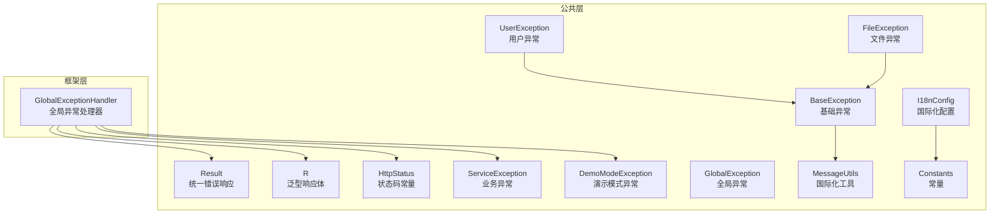
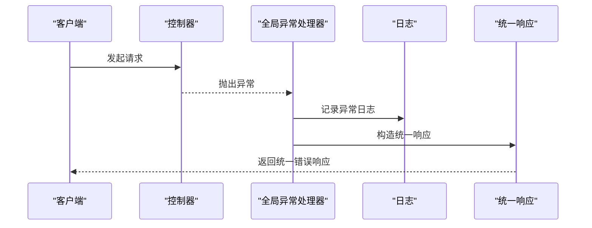
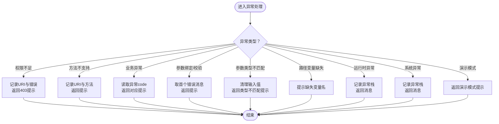
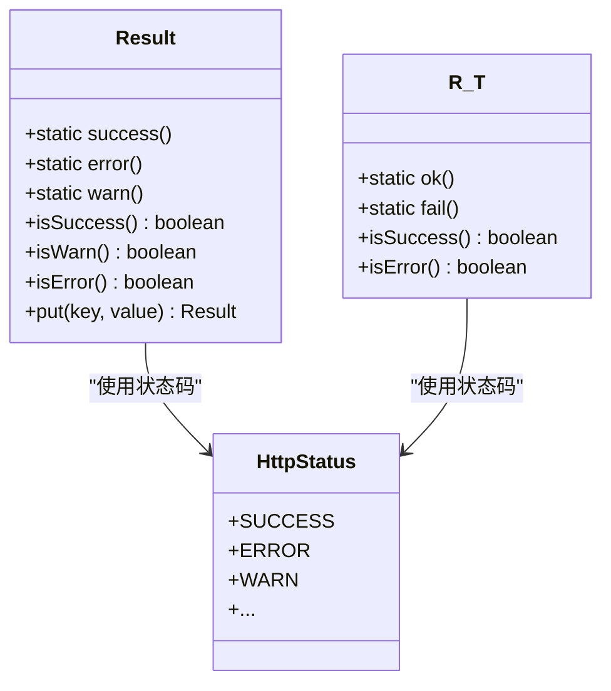
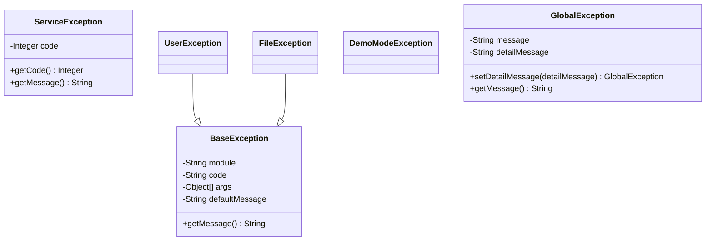
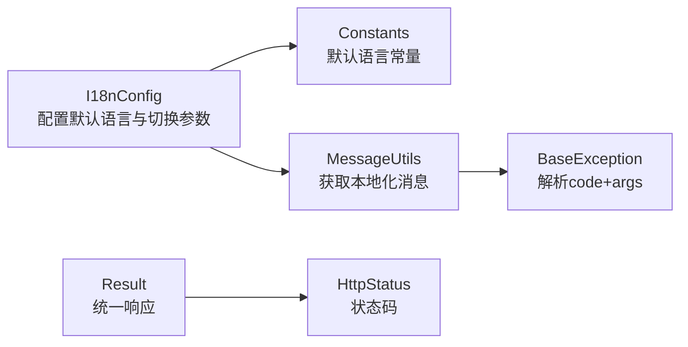
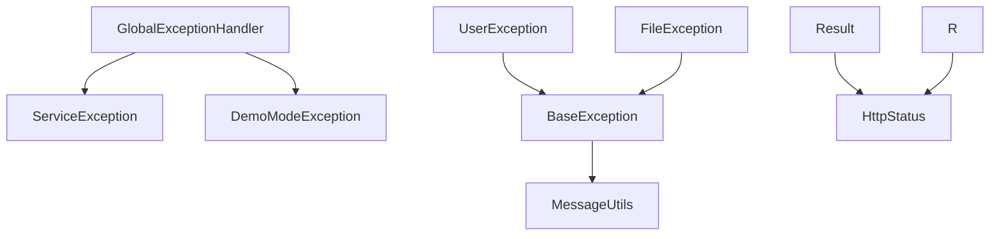

# 全局异常处理

<cite>
**本文引用的文件**
- [GlobalExceptionHandler.java](file://blog-framework/src/main/java/blog/framework/web/exception/GlobalExceptionHandler.java)
- [Result.java](file://blog-common/src/main/java/blog/common/base/resp/Result.java)
- [R.java](file://blog-common/src/main/java/blog/common/base/resp/R.java)
- [HttpStatus.java](file://blog-common/src/main/java/blog/common/constant/HttpStatus.java)
- [ServiceException.java](file://blog-common/src/main/java/blog/common/exception/ServiceException.java)
- [BaseException.java](file://blog-common/src/main/java/blog/common/exception/base/BaseException.java)
- [UserException.java](file://blog-common/src/main/java/blog/common/exception/user/UserException.java)
- [FileException.java](file://blog-common/src/main/java/blog/common/exception/file/FileException.java)
- [DemoModeException.java](file://blog-common/src/main/java/blog/common/exception/DemoModeException.java)
- [GlobalException.java](file://blog-common/src/main/java/blog/common/exception/GlobalException.java)
- [I18nConfig.java](file://blog-framework/src/main/java/blog/framework/config/I18nConfig.java)
- [MessageUtils.java](file://blog-common/src/main/java/blog/common/utils/MessageUtils.java)
- [Constants.java](file://blog-common/src/main/java/blog/common/constant/Constants.java)
</cite>

## 目录
1. [简介](#简介)
2. [项目结构](#项目结构)
3. [核心组件](#核心组件)
4. [架构总览](#架构总览)
5. [详细组件分析](#详细组件分析)
6. [依赖分析](#依赖分析)
7. [性能考量](#性能考量)
8. [故障排查指南](#故障排查指南)
9. [结论](#结论)
10. [附录](#附录)

## 简介
本文件系统性梳理了基于 Spring MVC 的全局异常处理机制，重点覆盖以下方面：
- 全局异常处理器的实现与职责边界
- 异常类型分类与处理策略（业务异常、系统异常、参数异常、权限异常、演示模式等）
- 统一错误响应格式设计（Result 与 R 的结构、错误码与国际化支持）
- 最佳实践（日志记录、用户提示、调试信息保护）

## 项目结构
全局异常处理相关代码主要分布在两个模块：
- framework 层：全局异常处理器 GlobalExceptionHandler，负责拦截各类异常并输出统一响应
- common 层：统一响应模型 Result/R、错误码常量 HttpStatus、各类异常类型（业务异常、基础异常、用户异常、文件异常、演示模式异常、全局异常）以及国际化配置与工具

图表来源
- [GlobalExceptionHandler.java:1-134](file://blog-framework/src/main/java/blog/framework/web/exception/GlobalExceptionHandler.java#L1-L134)
- [Result.java:1-205](file://blog-common/src/main/java/blog/common/base/resp/Result.java#L1-L205)
- [R.java:1-107](file://blog-common/src/main/java/blog/common/base/resp/R.java#L1-L107)
- [HttpStatus.java:1-94](file://blog-common/src/main/java/blog/common/constant/HttpStatus.java#L1-L94)
- [ServiceException.java:1-65](file://blog-common/src/main/java/blog/common/exception/ServiceException.java#L1-L65)
- [BaseException.java:1-85](file://blog-common/src/main/java/blog/common/exception/base/BaseException.java#L1-L85)
- [UserException.java:1-17](file://blog-common/src/main/java/blog/common/exception/user/UserException.java#L1-L17)
- [FileException.java:1-18](file://blog-common/src/main/java/blog/common/exception/file/FileException.java#L1-L18)
- [DemoModeException.java:1-14](file://blog-common/src/main/java/blog/common/exception/DemoModeException.java#L1-L14)
- [GlobalException.java:1-51](file://blog-common/src/main/java/blog/common/exception/GlobalException.java#L1-L51)
- [I18nConfig.java:1-40](file://blog-framework/src/main/java/blog/framework/config/I18nConfig.java#L1-L40)
- [MessageUtils.java:1-25](file://blog-common/src/main/java/blog/common/utils/MessageUtils.java#L1-L25)
- [Constants.java:1-235](file://blog-common/src/main/java/blog/common/constant/Constants.java#L1-L235)

章节来源
- [GlobalExceptionHandler.java:1-134](file://blog-framework/src/main/java/blog/framework/web/exception/GlobalExceptionHandler.java#L1-L134)
- [Result.java:1-205](file://blog-common/src/main/java/blog/common/base/resp/Result.java#L1-L205)
- [R.java:1-107](file://blog-common/src/main/java/blog/common/base/resp/R.java#L1-L107)
- [HttpStatus.java:1-94](file://blog-common/src/main/java/blog/common/constant/HttpStatus.java#L1-L94)
- [ServiceException.java:1-65](file://blog-common/src/main/java/blog/common/exception/ServiceException.java#L1-L65)
- [BaseException.java:1-85](file://blog-common/src/main/java/blog/common/exception/base/BaseException.java#L1-L85)
- [UserException.java:1-17](file://blog-common/src/main/java/blog/common/exception/user/UserException.java#L1-L17)
- [FileException.java:1-18](file://blog-common/src/main/java/blog/common/exception/file/FileException.java#L1-L18)
- [DemoModeException.java:1-14](file://blog-common/src/main/java/blog/common/exception/DemoModeException.java#L1-L14)
- [GlobalException.java:1-51](file://blog-common/src/main/java/blog/common/exception/GlobalException.java#L1-L51)
- [I18nConfig.java:1-40](file://blog-framework/src/main/java/blog/framework/config/I18nConfig.java#L1-L40)
- [MessageUtils.java:1-25](file://blog-common/src/main/java/blog/common/utils/MessageUtils.java#L1-L25)
- [Constants.java:1-235](file://blog-common/src/main/java/blog/common/constant/Constants.java#L1-L235)

## 核心组件
- 全局异常处理器 GlobalExceptionHandler：通过 @RestControllerAdvice 全局拦截异常，按异常类型进行分类处理，统一输出 Result 或 R 风格的响应体
- 统一响应模型 Result：以 Map 结构承载 code/msg/data，提供 success/error/warn 等静态工厂方法
- 泛型响应体 R<T>：提供强类型封装，便于前端统一消费
- 错误码常量 HttpStatus：集中管理 HTTP 语义相关的状态码
- 异常类型体系：ServiceException（业务异常）、BaseException（基础异常，支持国际化）、UserException/FileException（领域异常）、DemoModeException（演示模式限制）、GlobalException（全局兜底异常）
- 国际化配置与工具：I18nConfig 提供默认语言与参数切换；MessageUtils 委托 Spring MessageSource 获取本地化消息

章节来源
- [GlobalExceptionHandler.java:27-134](file://blog-framework/src/main/java/blog/framework/web/exception/GlobalExceptionHandler.java#L27-L134)
- [Result.java:14-204](file://blog-common/src/main/java/blog/common/base/resp/Result.java#L14-L204)
- [R.java:12-106](file://blog-common/src/main/java/blog/common/base/resp/R.java#L12-L106)
- [HttpStatus.java:8-93](file://blog-common/src/main/java/blog/common/constant/HttpStatus.java#L8-L93)
- [ServiceException.java:8-65](file://blog-common/src/main/java/blog/common/exception/ServiceException.java#L8-L65)
- [BaseException.java:11-84](file://blog-common/src/main/java/blog/common/exception/base/BaseException.java#L11-L84)
- [UserException.java:10-16](file://blog-common/src/main/java/blog/common/exception/user/UserException.java#L10-L16)
- [FileException.java:10-17](file://blog-common/src/main/java/blog/common/exception/file/FileException.java#L10-L17)
- [DemoModeException.java:8-13](file://blog-common/src/main/java/blog/common/exception/DemoModeException.java#L8-L13)
- [GlobalException.java:8-51](file://blog-common/src/main/java/blog/common/exception/GlobalException.java#L8-L51)
- [I18nConfig.java:17-39](file://blog-framework/src/main/java/blog/framework/config/I18nConfig.java#L17-L39)
- [MessageUtils.java:12-24](file://blog-common/src/main/java/blog/common/utils/MessageUtils.java#L12-L24)
- [Constants.java](file://blog-common/src/main/java/blog/common/constant/Constants.java#L26)

## 架构总览
全局异常处理在请求生命周期中的位置如下：

图表来源
- [GlobalExceptionHandler.java:34-132](file://blog-framework/src/main/java/blog/framework/web/exception/GlobalExceptionHandler.java#L34-L132)
- [Result.java:139-163](file://blog-common/src/main/java/blog/common/base/resp/Result.java#L139-L163)

## 详细组件分析

### 全局异常处理器 GlobalExceptionHandler
- 职责边界
  - 拦截权限校验失败、请求方法不支持、业务异常、参数绑定/校验异常、参数类型不匹配、路径变量缺失、运行时异常、系统异常、演示模式限制等
  - 将异常转换为统一的 Result 响应，包含 code/msg/data
- 关键处理点
  - 权限异常：记录请求 URI 与错误信息，返回固定提示与 403 状态
  - 请求方法不支持：记录请求 URI 与方法，返回异常消息
  - 业务异常 ServiceException：优先使用异常内带的 code，否则回退到默认错误码
  - 参数绑定/校验异常：取首个错误消息作为提示
  - 参数类型不匹配：对输入值进行清理后拼装提示
  - 路径变量缺失：提示缺失的变量名
  - 运行时异常与系统异常：记录异常栈并返回消息
  - 演示模式异常：直接返回“演示模式，不允许操作”
- HTTP 状态码策略
  - 使用 HttpStatus 常量中的状态码，Result.error(...) 默认使用 ERROR（500），部分场景由上层框架或调用方决定最终 HTTP 状态码

图表来源
- [GlobalExceptionHandler.java:34-132](file://blog-framework/src/main/java/blog/framework/web/exception/GlobalExceptionHandler.java#L34-L132)

章节来源
- [GlobalExceptionHandler.java:27-134](file://blog-framework/src/main/java/blog/framework/web/exception/GlobalExceptionHandler.java#L27-L134)

### 统一响应模型 Result 与 R
- Result
  - 结构：code、msg、data
  - 工厂方法：success()/error()/warn() 及带参数版本；支持链式 put(key, value)
  - 判定：isSuccess/isWarn/isError
- R<T>
  - 结构：code、msg、data（泛型）
  - 工厂方法：ok()/fail() 及带参数版本；提供 isSuccess/isError 辅助判断

图表来源
- [Result.java:14-204](file://blog-common/src/main/java/blog/common/base/resp/Result.java#L14-L204)
- [R.java:12-106](file://blog-common/src/main/java/blog/common/base/resp/R.java#L12-L106)
- [HttpStatus.java:8-93](file://blog-common/src/main/java/blog/common/constant/HttpStatus.java#L8-L93)

章节来源
- [Result.java:14-204](file://blog-common/src/main/java/blog/common/base/resp/Result.java#L14-L204)
- [R.java:12-106](file://blog-common/src/main/java/blog/common/base/resp/R.java#L12-L106)
- [HttpStatus.java:8-93](file://blog-common/src/main/java/blog/common/constant/HttpStatus.java#L8-L93)

### 异常类型分类与处理策略
- 业务异常 ServiceException
  - 场景：业务规则违反、参数非法、资源不存在等
  - 处理：从异常读取 code 与 message，若无 code 则回退默认错误码
- 基础异常 BaseException 与领域异常
  - BaseException 支持国际化消息：通过 code+args 解析本地化文本，支持模块化前缀
  - UserException/FileException 继承自 BaseException，分别用于用户与文件相关场景
- 演示模式异常 DemoModeException
  - 场景：演示环境禁止写操作
  - 处理：直接返回固定提示
- 全局异常 GlobalException
  - 场景：未预期的异常兜底
  - 处理：可携带 detailMessage 用于内部调试

图表来源
- [ServiceException.java:8-65](file://blog-common/src/main/java/blog/common/exception/ServiceException.java#L8-L65)
- [BaseException.java:11-84](file://blog-common/src/main/java/blog/common/exception/base/BaseException.java#L11-L84)
- [UserException.java:10-16](file://blog-common/src/main/java/blog/common/exception/user/UserException.java#L10-L16)
- [FileException.java:10-17](file://blog-common/src/main/java/blog/common/exception/file/FileException.java#L10-L17)
- [DemoModeException.java:8-13](file://blog-common/src/main/java/blog/common/exception/DemoModeException.java#L8-L13)
- [GlobalException.java:8-51](file://blog-common/src/main/java/blog/common/exception/GlobalException.java#L8-L51)

章节来源
- [ServiceException.java:8-65](file://blog-common/src/main/java/blog/common/exception/ServiceException.java#L8-L65)
- [BaseException.java:11-84](file://blog-common/src/main/java/blog/common/exception/base/BaseException.java#L11-L84)
- [UserException.java:10-16](file://blog-common/src/main/java/blog/common/exception/user/UserException.java#L10-L16)
- [FileException.java:10-17](file://blog-common/src/main/java/blog/common/exception/file/FileException.java#L10-L17)
- [DemoModeException.java:8-13](file://blog-common/src/main/java/blog/common/exception/DemoModeException.java#L8-L13)
- [GlobalException.java:8-51](file://blog-common/src/main/java/blog/common/exception/GlobalException.java#L8-L51)

### 国际化与错误码
- 国际化配置 I18nConfig
  - 设置默认语言为简体中文
  - 通过 SessionLocaleResolver 与 LocaleChangeInterceptor 支持动态切换语言
- 国际化工具 MessageUtils
  - 委托 Spring 的 MessageSource，根据 code 与参数获取本地化消息
- 错误码常量 HttpStatus
  - 集中定义 SUCCESS/ERROR/WARN 等状态码，Result.error(...) 默认使用 ERROR（500）

图表来源
- [I18nConfig.java:17-39](file://blog-framework/src/main/java/blog/framework/config/I18nConfig.java#L17-L39)
- [Constants.java](file://blog-common/src/main/java/blog/common/constant/Constants.java#L26)
- [MessageUtils.java:12-24](file://blog-common/src/main/java/blog/common/utils/MessageUtils.java#L12-L24)
- [BaseException.java:57-66](file://blog-common/src/main/java/blog/common/exception/base/BaseException.java#L57-L66)
- [Result.java:139-163](file://blog-common/src/main/java/blog/common/base/resp/Result.java#L139-L163)
- [HttpStatus.java:8-93](file://blog-common/src/main/java/blog/common/constant/HttpStatus.java#L8-L93)

章节来源
- [I18nConfig.java:17-39](file://blog-framework/src/main/java/blog/framework/config/I18nConfig.java#L17-L39)
- [Constants.java](file://blog-common/src/main/java/blog/common/constant/Constants.java#L26)
- [MessageUtils.java:12-24](file://blog-common/src/main/java/blog/common/utils/MessageUtils.java#L12-L24)
- [BaseException.java:57-66](file://blog-common/src/main/java/blog/common/exception/base/BaseException.java#L57-L66)
- [Result.java:139-163](file://blog-common/src/main/java/blog/common/base/resp/Result.java#L139-L163)
- [HttpStatus.java:8-93](file://blog-common/src/main/java/blog/common/constant/HttpStatus.java#L8-L93)

## 依赖分析
- GlobalExceptionHandler 对异常类型与响应模型存在直接依赖
- 异常类型之间存在继承关系，领域异常（UserException/FileException）复用国际化能力
- 国际化配置与工具为异常消息本地化提供支撑

图表来源
- [GlobalExceptionHandler.java:17-19](file://blog-framework/src/main/java/blog/framework/web/exception/GlobalExceptionHandler.java#L17-L19)
- [ServiceException.java:8-65](file://blog-common/src/main/java/blog/common/exception/ServiceException.java#L8-L65)
- [DemoModeException.java:8-13](file://blog-common/src/main/java/blog/common/exception/DemoModeException.java#L8-L13)
- [BaseException.java:11-84](file://blog-common/src/main/java/blog/common/exception/base/BaseException.java#L11-L84)
- [MessageUtils.java:12-24](file://blog-common/src/main/java/blog/common/utils/MessageUtils.java#L12-L24)
- [Result.java:139-163](file://blog-common/src/main/java/blog/common/base/resp/Result.java#L139-L163)
- [R.java:18-23](file://blog-common/src/main/java/blog/common/base/resp/R.java#L18-L23)
- [HttpStatus.java:8-93](file://blog-common/src/main/java/blog/common/constant/HttpStatus.java#L8-L93)

章节来源
- [GlobalExceptionHandler.java:17-19](file://blog-framework/src/main/java/blog/framework/web/exception/GlobalExceptionHandler.java#L17-L19)
- [ServiceException.java:8-65](file://blog-common/src/main/java/blog/common/exception/ServiceException.java#L8-L65)
- [DemoModeException.java:8-13](file://blog-common/src/main/java/blog/common/exception/DemoModeException.java#L8-L13)
- [BaseException.java:11-84](file://blog-common/src/main/java/blog/common/exception/base/BaseException.java#L11-L84)
- [MessageUtils.java:12-24](file://blog-common/src/main/java/blog/common/utils/MessageUtils.java#L12-L24)
- [Result.java:139-163](file://blog-common/src/main/java/blog/common/base/resp/Result.java#L139-L163)
- [R.java:18-23](file://blog-common/src/main/java/blog/common/base/resp/R.java#L18-L23)
- [HttpStatus.java:8-93](file://blog-common/src/main/java/blog/common/constant/HttpStatus.java#L8-L93)

## 性能考量
- 异常处理路径尽量避免昂贵操作（如复杂计算、IO），确保异常响应快速返回
- 日志记录建议采用异步或低开销策略，防止异常风暴放大延迟
- 统一响应构建为轻量级 Map/对象组装，注意避免大对象序列化带来的压力

## 故障排查指南
- 权限异常
  - 现象：返回 403 提示“没有权限，请联系管理员授权”
  - 排查：确认安全配置与权限注解是否正确生效
- 请求方法不支持
  - 现象：返回不支持的请求方法提示
  - 排查：核对控制器声明的方法与实际请求方法是否一致
- 业务异常
  - 现象：返回 ServiceException 内带的 code 与 message
  - 排查：检查异常抛出处是否正确设置 code/message
- 参数绑定/校验异常
  - 现象：返回首个字段的校验错误
  - 排查：查看控制器参数与校验注解配置
- 参数类型不匹配
  - 现象：返回参数名、期望类型与实际输入值
  - 排查：核对前端传参类型与后端接收类型
- 路径变量缺失
  - 现象：提示缺失的路径变量名
  - 排查：核对 URL 路径与 @PathVariable 映射
- 运行时异常/系统异常
  - 现象：返回异常消息，日志记录异常栈
  - 排查：定位具体异常来源，修复代码逻辑
- 演示模式异常
  - 现象：返回“演示模式，不允许操作”
  - 排查：确认当前环境为演示模式，避免执行写操作

章节来源
- [GlobalExceptionHandler.java:34-132](file://blog-framework/src/main/java/blog/framework/web/exception/GlobalExceptionHandler.java#L34-L132)

## 结论
该全局异常处理机制通过统一的异常拦截与响应模型，实现了对多种异常类型的清晰分类与一致化输出。结合国际化与错误码常量，既保证了用户体验的一致性，也为调试与运维提供了可靠依据。建议在实际落地中配合完善的日志与监控体系，持续优化异常处理的可观测性与性能。

## 附录
- 最佳实践清单
  - 日志记录：统一记录请求 URI、异常类型与堆栈，区分开发与生产环境日志级别
  - 用户提示：对敏感信息进行脱敏与清理，避免将内部细节暴露给用户
  - 调试信息保护：detailMessage 仅用于内部调试，不对外展示
  - 国际化：优先使用 code+args 的本地化消息，保持多语言一致性
  - 错误码：遵循 HttpStatus 常量约定，确保前后端约定一致