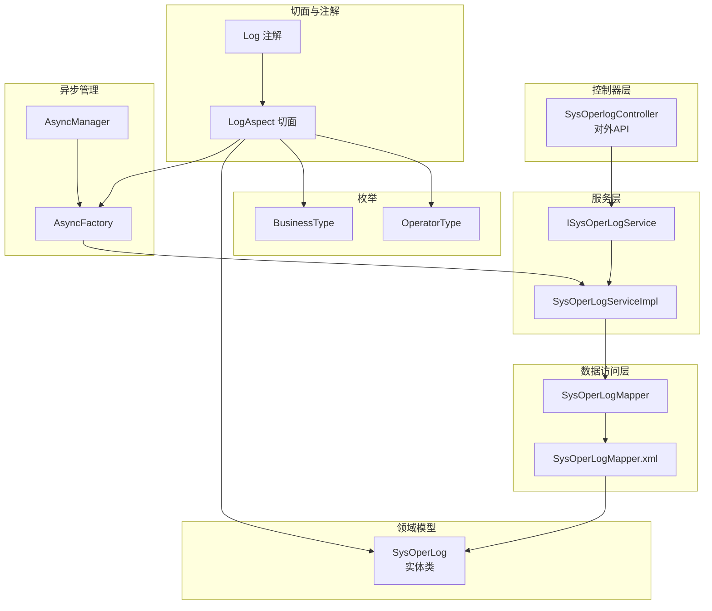
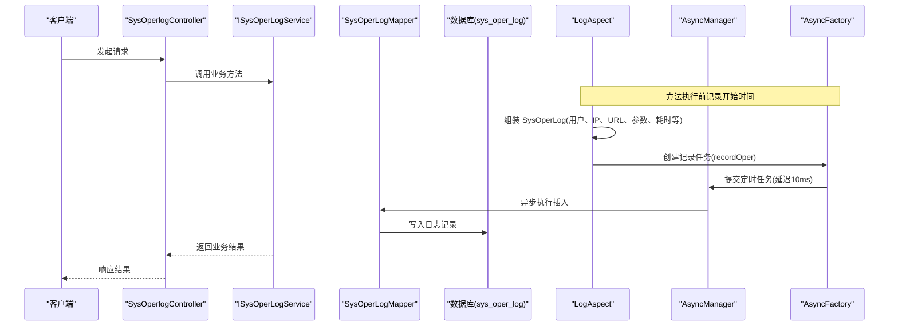
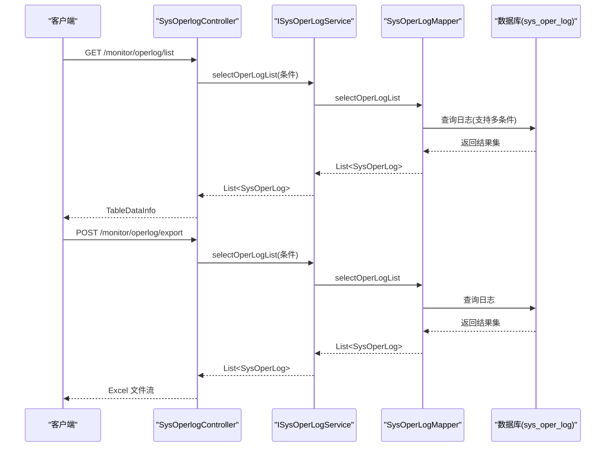
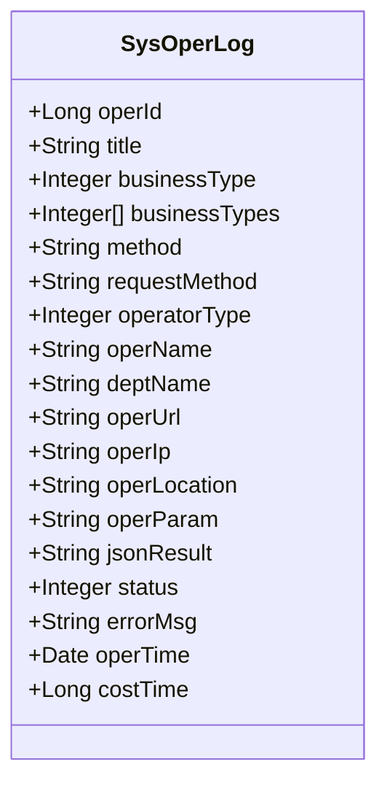
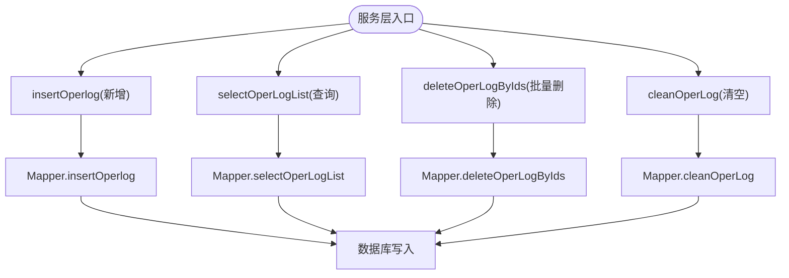
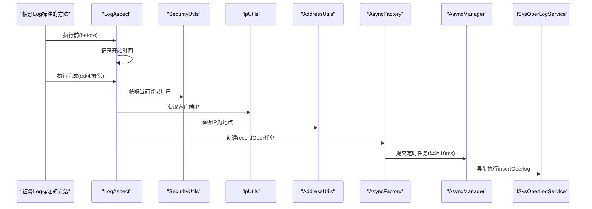
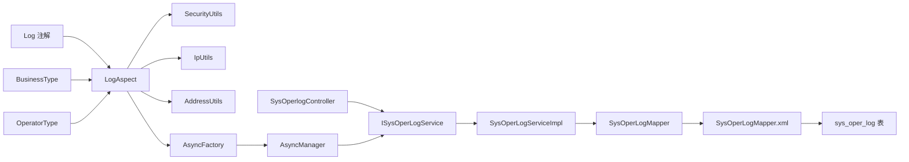

# 操作日志管理

<cite>
**本文档引用的文件**
- [SysOperLog.java](file://blog-system/src/main/java/blog/system/domain/SysOperLog.java)
- [SysOperLogMapper.java](file://blog-system/src/main/java/blog/system/mapper/SysOperLogMapper.java)
- [SysOperLogMapper.xml](file://blog-system/src/main/resources/mapper/system/SysOperLogMapper.xml)
- [ISysOperLogService.java](file://blog-system/src/main/java/blog/system/service/ISysOperLogService.java)
- [SysOperLogServiceImpl.java](file://blog-system/src/main/java/blog/system/service/impl/SysOperLogServiceImpl.java)
- [SysOperlogController.java](file://blog-admin/src/main/java/blog/web/controller/monitor/SysOperlogController.java)
- [Log.java](file://blog-common/src/main/java/blog/common/annotation/Log.java)
- [LogAspect.java](file://blog-framework/src/main/java/blog/framework/aspectj/LogAspect.java)
- [BusinessType.java](file://blog-common/src/main/java/blog/common/enums/BusinessType.java)
- [OperatorType.java](file://blog-common/src/main/java/blog/common/enums/OperatorType.java)
- [AsyncManager.java](file://blog-framework/src/main/java/blog/framework/manager/AsyncManager.java)
- [AsyncFactory.java](file://blog-framework/src/main/java/blog/framework/manager/factory/AsyncFactory.java)
- [ry-vue-owner.sql](file://ry-vue-owner.sql)
</cite>

## 目录
1. [简介](#简介)
2. [项目结构](#项目结构)
3. [核心组件](#核心组件)
4. [架构总览](#架构总览)
5. [详细组件分析](#详细组件分析)
6. [依赖关系分析](#依赖关系分析)
7. [性能考虑](#性能考虑)
8. [故障排查指南](#故障排查指南)
9. [结论](#结论)
10. [附录](#附录)

## 简介
本文件全面阐述操作日志管理功能，涵盖系统操作日志的自动捕获机制、日志数据的结构化存储、日志查询与统计能力，以及 SysOperlogController 控制器的 API 设计与实现细节。同时深入解析 SysOperLog 实体类的数据结构与字段含义，并介绍日志服务层的业务逻辑、日志清理策略与性能优化措施。最后提供操作日志的使用场景与分析方法，帮助管理员进行系统审计与问题追踪。

## 项目结构
操作日志相关代码分布在以下模块：
- 控制器层：监控模块下的 SysOperlogController，负责对外暴露日志查询、导出、删除、清空等 API
- 服务层：ISysOperLogService 及其实现类 SysOperLogServiceImpl，封装日志的新增、查询、批量删除、清空等业务逻辑
- 数据访问层：SysOperLogMapper 接口及对应的 MyBatis 映射文件 SysOperLogMapper.xml，提供 SQL 查询与写入
- 领域模型：SysOperLog 实体类，定义日志表结构与字段
- 切面与注解：Log 注解与 LogAspect 切面，负责在方法执行前后自动采集请求/响应参数、用户信息、IP 地址、耗时等信息并异步落库
- 异步管理：AsyncManager 与 AsyncFactory，负责异步执行日志持久化，避免阻塞主线程
- 枚举：BusinessType、OperatorType，用于标识业务类型与操作人类别

图表来源
- [SysOperlogController.java:28-66](file://blog-admin/src/main/java/blog/web/controller/monitor/SysOperlogController.java#L28-L66)
- [ISysOperLogService.java:13-49](file://blog-system/src/main/java/blog/system/service/ISysOperLogService.java#L13-L49)
- [SysOperLogServiceImpl.java:18-73](file://blog-system/src/main/java/blog/system/service/impl/SysOperLogServiceImpl.java#L18-L73)
- [SysOperLogMapper.java:13-49](file://blog-system/src/main/java/blog/system/mapper/SysOperLogMapper.java#L13-L49)
- [SysOperLogMapper.xml:5-87](file://blog-system/src/main/resources/mapper/system/SysOperLogMapper.xml#L5-L87)
- [SysOperLog.java:22-134](file://blog-system/src/main/java/blog/system/domain/SysOperLog.java#L22-L134)
- [Log.java:20-50](file://blog-common/src/main/java/blog/common/annotation/Log.java#L20-L50)
- [LogAspect.java:42-134](file://blog-framework/src/main/java/blog/framework/aspectj/LogAspect.java#L42-L134)
- [AsyncManager.java:15-54](file://blog-framework/src/main/java/blog/framework/manager/AsyncManager.java#L15-L54)
- [AsyncFactory.java:25-92](file://blog-framework/src/main/java/blog/framework/manager/factory/AsyncFactory.java#L25-L92)
- [BusinessType.java:8-58](file://blog-common/src/main/java/blog/common/enums/BusinessType.java#L8-L58)
- [OperatorType.java:8-23](file://blog-common/src/main/java/blog/common/enums/OperatorType.java#L8-L23)

章节来源
- [SysOperlogController.java:28-66](file://blog-admin/src/main/java/blog/web/controller/monitor/SysOperlogController.java#L28-L66)
- [SysOperLogServiceImpl.java:18-73](file://blog-system/src/main/java/blog/system/service/impl/SysOperLogServiceImpl.java#L18-L73)
- [SysOperLogMapper.xml:5-87](file://blog-system/src/main/resources/mapper/system/SysOperLogMapper.xml#L5-L87)

## 核心组件
- SysOperLog 实体类：定义操作日志表的字段，包括日志主键、操作模块、业务类型、请求方法、请求方式、操作类别、操作人员、部门名称、请求 URL、IP、地点、请求参数、返回参数、状态、错误消息、操作时间、耗时等
- SysOperLogMapper 接口与映射文件：提供新增、查询列表、按 ID 查询、批量删除、清空等 SQL 操作
- ISysOperLogService 与 SysOperLogServiceImpl：封装日志的业务逻辑，包括新增、查询、批量删除、清空
- SysOperlogController：对外提供日志列表查询、导出、删除、清空等 API
- Log 注解与 LogAspect 切面：在方法执行前后自动采集日志信息并异步持久化
- AsyncManager 与 AsyncFactory：异步执行日志持久化，降低对主线程的影响

章节来源
- [SysOperLog.java:22-134](file://blog-system/src/main/java/blog/system/domain/SysOperLog.java#L22-L134)
- [SysOperLogMapper.java:13-49](file://blog-system/src/main/java/blog/system/mapper/SysOperLogMapper.java#L13-L49)
- [SysOperLogMapper.xml:5-87](file://blog-system/src/main/resources/mapper/system/SysOperLogMapper.xml#L5-L87)
- [ISysOperLogService.java:13-49](file://blog-system/src/main/java/blog/system/service/ISysOperLogService.java#L13-L49)
- [SysOperLogServiceImpl.java:18-73](file://blog-system/src/main/java/blog/system/service/impl/SysOperLogServiceImpl.java#L18-L73)
- [SysOperlogController.java:28-66](file://blog-admin/src/main/java/blog/web/controller/monitor/SysOperlogController.java#L28-L66)
- [Log.java:20-50](file://blog-common/src/main/java/blog/common/annotation/Log.java#L20-L50)
- [LogAspect.java:42-134](file://blog-framework/src/main/java/blog/framework/aspectj/LogAspect.java#L42-L134)
- [AsyncManager.java:15-54](file://blog-framework/src/main/java/blog/framework/manager/AsyncManager.java#L15-L54)
- [AsyncFactory.java:25-92](file://blog-framework/src/main/java/blog/framework/manager/factory/AsyncFactory.java#L25-L92)

## 架构总览
操作日志的采集与存储采用“注解 + 切面 + 异步”的架构模式：
- 方法级注解：通过 @Log 注解标记需要记录操作日志的方法，配置标题、业务类型、操作人类别、是否保存请求/响应参数等
- 切面拦截：LogAspect 在方法执行前记录开始时间，在返回或异常时计算耗时并组装 SysOperLog 对象
- 异步持久化：AsyncFactory 将日志对象封装为 TimerTask，交由 AsyncManager 的 ScheduledExecutorService 延迟执行，避免阻塞请求线程
- 数据落库：SysOperLogServiceImpl 调用 SysOperLogMapper 完成插入，MyBatis 映射文件定义了具体的 SQL

图表来源
- [LogAspect.java:60-134](file://blog-framework/src/main/java/blog/framework/aspectj/LogAspect.java#L60-L134)
- [AsyncFactory.java:82-91](file://blog-framework/src/main/java/blog/framework/manager/factory/AsyncFactory.java#L82-L91)
- [AsyncManager.java:43-45](file://blog-framework/src/main/java/blog/framework/manager/AsyncManager.java#L43-L45)
- [SysOperLogMapper.xml:32-35](file://blog-system/src/main/resources/mapper/system/SysOperLogMapper.xml#L32-L35)
- [SysOperLogServiceImpl.java:28-30](file://blog-system/src/main/java/blog/system/service/impl/SysOperLogServiceImpl.java#L28-L30)

## 详细组件分析

### SysOperlogController 控制器
- 路径：/monitor/operlog
- 主要功能：
  - 列表查询：GET /list，分页查询操作日志，支持按 IP、模块标题、业务类型、状态、操作人、时间范围等条件过滤
  - 导出：POST /export，将查询结果导出为 Excel
  - 删除：DELETE /{operIds}，批量删除指定 ID 的日志
  - 清空：DELETE /clean，清空所有日志（使用 TRUNCATE）
- 权限控制：使用 @PreAuthorize 注解校验权限
- 日志记录：对导出、删除、清空等操作本身也通过 @Log 注解记录操作日志

图表来源
- [SysOperlogController.java:34-49](file://blog-admin/src/main/java/blog/web/controller/monitor/SysOperlogController.java#L34-L49)
- [SysOperLogMapper.xml:37-69](file://blog-system/src/main/resources/mapper/system/SysOperLogMapper.xml#L37-L69)
- [SysOperLogServiceImpl.java:38-41](file://blog-system/src/main/java/blog/system/service/impl/SysOperLogServiceImpl.java#L38-L41)

章节来源
- [SysOperlogController.java:28-66](file://blog-admin/src/main/java/blog/web/controller/monitor/SysOperlogController.java#L28-L66)
- [SysOperLogMapper.xml:37-69](file://blog-system/src/main/resources/mapper/system/SysOperLogMapper.xml#L37-L69)

### SysOperLog 实体类
- 字段说明（节选关键字段）：
  - operId：日志主键
  - title：操作模块/标题
  - businessType：业务类型（新增、修改、删除、授权、导出、导入、强退、生成代码、清空数据等）
  - method：请求方法（类名+方法名）
  - requestMethod：HTTP 请求方式（GET/POST/PUT/DELETE）
  - operatorType：操作类别（后台用户、手机端用户等）
  - operName：操作人员
  - deptName：部门名称
  - operUrl：请求 URL
  - operIp：客户端 IP
  - operLocation：操作地点（通过 IP 解析）
  - operParam：请求参数（JSON 或表单参数）
  - jsonResult：响应参数（JSON）
  - status：操作状态（成功/失败）
  - errorMsg：错误消息
  - operTime：操作时间
  - costTime：耗时（毫秒）

图表来源
- [SysOperLog.java:22-134](file://blog-system/src/main/java/blog/system/domain/SysOperLog.java#L22-L134)

章节来源
- [SysOperLog.java:22-134](file://blog-system/src/main/java/blog/system/domain/SysOperLog.java#L22-L134)

### 日志服务层实现
- ISysOperLogService：定义新增、查询列表、按 ID 查询、批量删除、清空等接口
- SysOperLogServiceImpl：继承通用基类，实现具体业务逻辑
  - insertOperlog：调用 Mapper 插入日志
  - selectOperLogList：委托 Mapper 执行带条件的查询
  - deleteOperLogByIds：批量删除
  - selectOperLogById：按 ID 查询
  - cleanOperLog：清空日志（TRUNCATE）

图表来源
- [ISysOperLogService.java:13-49](file://blog-system/src/main/java/blog/system/service/ISysOperLogService.java#L13-L49)
- [SysOperLogServiceImpl.java:18-73](file://blog-system/src/main/java/blog/system/service/impl/SysOperLogServiceImpl.java#L18-L73)
- [SysOperLogMapper.java:13-49](file://blog-system/src/main/java/blog/system/mapper/SysOperLogMapper.java#L13-L49)
- [SysOperLogMapper.xml:32-85](file://blog-system/src/main/resources/mapper/system/SysOperLogMapper.xml#L32-L85)

章节来源
- [ISysOperLogService.java:13-49](file://blog-system/src/main/java/blog/system/service/ISysOperLogService.java#L13-L49)
- [SysOperLogServiceImpl.java:18-73](file://blog-system/src/main/java/blog/system/service/impl/SysOperLogServiceImpl.java#L18-L73)
- [SysOperLogMapper.java:13-49](file://blog-system/src/main/java/blog/system/mapper/SysOperLogMapper.java#L13-L49)
- [SysOperLogMapper.xml:32-85](file://blog-system/src/main/resources/mapper/system/SysOperLogMapper.xml#L32-L85)

### 日志采集与异步持久化
- Log 注解：用于标记需要记录操作日志的方法，支持配置标题、业务类型、操作人类别、是否保存请求/响应参数、排除参数名等
- LogAspect 切面：
  - 方法执行前：记录开始时间
  - 正常返回：AfterReturning 拦截，计算耗时，组装 SysOperLog
  - 异常抛出：AfterThrowing 拦截，设置状态为失败并记录错误消息
  - 异步执行：通过 AsyncFactory.recordOper 包装为 TimerTask，交由 AsyncManager 延迟执行（10ms），避免阻塞请求线程
- AsyncFactory：远程解析 IP 地址为地点，然后调用服务层插入日志
- AsyncManager：使用 ScheduledExecutorService 执行任务

图表来源
- [Log.java:20-50](file://blog-common/src/main/java/blog/common/annotation/Log.java#L20-L50)
- [LogAspect.java:60-134](file://blog-framework/src/main/java/blog/framework/aspectj/LogAspect.java#L60-L134)
- [AsyncFactory.java:82-91](file://blog-framework/src/main/java/blog/framework/manager/factory/AsyncFactory.java#L82-L91)
- [AsyncManager.java:43-45](file://blog-framework/src/main/java/blog/framework/manager/AsyncManager.java#L43-L45)

章节来源
- [Log.java:20-50](file://blog-common/src/main/java/blog/common/annotation/Log.java#L20-L50)
- [LogAspect.java:60-134](file://blog-framework/src/main/java/blog/framework/aspectj/LogAspect.java#L60-L134)
- [AsyncFactory.java:82-91](file://blog-framework/src/main/java/blog/framework/manager/factory/AsyncFactory.java#L82-L91)
- [AsyncManager.java:43-45](file://blog-framework/src/main/java/blog/framework/manager/AsyncManager.java#L43-L45)

## 依赖关系分析
- 控制器依赖服务接口，服务实现依赖 Mapper 接口，Mapper 依赖 MyBatis 映射文件与数据库
- LogAspect 依赖注解、安全工具、IP 工具、异步管理器、业务状态枚举等
- AsyncFactory 依赖 IP 地址解析、Spring 上下文获取服务实例
- 数据库层面，sys_oper_log 表包含多个索引以支持按业务类型、状态、操作时间的查询

图表来源
- [SysOperlogController.java:30-32](file://blog-admin/src/main/java/blog/web/controller/monitor/SysOperlogController.java#L30-L32)
- [ISysOperLogService.java:13-49](file://blog-system/src/main/java/blog/system/service/ISysOperLogService.java#L13-L49)
- [SysOperLogServiceImpl.java:18-20](file://blog-system/src/main/java/blog/system/service/impl/SysOperLogServiceImpl.java#L18-L20)
- [SysOperLogMapper.java:13-19](file://blog-system/src/main/java/blog/system/mapper/SysOperLogMapper.java#L13-L19)
- [SysOperLogMapper.xml:5-25](file://blog-system/src/main/resources/mapper/system/SysOperLogMapper.xml#L5-L25)
- [Log.java:20-50](file://blog-common/src/main/java/blog/common/annotation/Log.java#L20-L50)
- [LogAspect.java:88-126](file://blog-framework/src/main/java/blog/framework/aspectj/LogAspect.java#L88-L126)
- [AsyncFactory.java:82-91](file://blog-framework/src/main/java/blog/framework/manager/factory/AsyncFactory.java#L82-L91)
- [AsyncManager.java:24-45](file://blog-framework/src/main/java/blog/framework/manager/AsyncManager.java#L24-L45)
- [BusinessType.java:8-58](file://blog-common/src/main/java/blog/common/enums/BusinessType.java#L8-L58)
- [OperatorType.java:8-23](file://blog-common/src/main/java/blog/common/enums/OperatorType.java#L8-L23)

章节来源
- [SysOperLogMapper.xml:27-85](file://blog-system/src/main/resources/mapper/system/SysOperLogMapper.xml#L27-L85)
- [ry-vue-owner.sql:914-932](file://ry-vue-owner.sql#L914-L932)

## 性能考虑
- 异步持久化：日志记录通过 AsyncManager 延迟执行，减少请求线程阻塞，提升接口吞吐
- 延迟时间：默认延迟 10ms，平衡实时性与性能
- 参数脱敏：@Log 注解支持排除敏感参数名，默认排除密码类字段，避免敏感信息入库
- 请求/响应大小限制：日志参数与响应内容均设置最大长度，防止超长数据影响性能
- 数据库索引：针对 business_type、status、oper_time 建立索引，优化查询性能
- TRUNCATE 清空：清空日志使用 TRUNCATE，比 DELETE 更高效

章节来源
- [AsyncManager.java:17-19](file://blog-framework/src/main/java/blog/framework/manager/AsyncManager.java#L17-L19)
- [AsyncManager.java:43-45](file://blog-framework/src/main/java/blog/framework/manager/AsyncManager.java#L43-L45)
- [Log.java:49-50](file://blog-common/src/main/java/blog/common/annotation/Log.java#L49-L50)
- [LogAspect.java:200-202](file://blog-framework/src/main/java/blog/framework/aspectj/LogAspect.java#L200-L202)
- [SysOperLogMapper.xml:83-85](file://blog-system/src/main/resources/mapper/system/SysOperLogMapper.xml#L83-L85)
- [ry-vue-owner.sql:929-931](file://ry-vue-owner.sql#L929-L931)

## 故障排查指南
- 日志未入库
  - 检查方法是否正确添加 @Log 注解并配置必要参数
  - 确认 LogAspect 切面生效，检查是否存在异常导致日志未记录
  - 查看 AsyncManager 与 AsyncFactory 是否正常执行
- 查询不到日志
  - 检查查询条件（IP、标题、业务类型、状态、时间范围）是否正确
  - 确认数据库索引是否有效
- 导出异常
  - 检查导出接口权限与参数传递
  - 确认 ExcelUtil 使用正确
- 清空失败
  - 检查数据库权限与 TRUNCATE 权限
  - 确认事务与锁情况

章节来源
- [LogAspect.java:127-133](file://blog-framework/src/main/java/blog/framework/aspectj/LogAspect.java#L127-L133)
- [SysOperLogMapper.xml:37-69](file://blog-system/src/main/resources/mapper/system/SysOperLogMapper.xml#L37-L69)
- [SysOperlogController.java:42-49](file://blog-admin/src/main/java/blog/web/controller/monitor/SysOperlogController.java#L42-L49)

## 结论
该操作日志管理功能通过注解驱动、切面拦截与异步持久化的组合，实现了对用户操作行为的自动捕获与高效存储。SysOperLog 实体类提供了完整的日志字段定义，配合 MyBatis 映射文件与服务层接口，满足了日志查询、导出、删除与清空等管理需求。通过合理的性能优化与索引设计，系统能够在高并发场景下稳定运行，为管理员提供可靠的审计与问题追踪能力。

## 附录
- 数据库表结构参考：sys_oper_log 包含 oper_id、title、business_type、method、request_method、operator_type、oper_name、dept_name、oper_url、oper_ip、oper_location、oper_param、json_result、status、error_msg、oper_time、cost_time 等字段，并建立业务类型、状态、操作时间索引
- 使用场景建议：
  - 审计合规：追踪管理员操作轨迹
  - 问题定位：结合耗时与错误消息快速定位异常
  - 性能分析：基于业务类型与时间维度统计分析
  - 安全监控：结合 IP 与操作模块识别异常行为

章节来源
- [ry-vue-owner.sql:914-932](file://ry-vue-owner.sql#L914-L932)