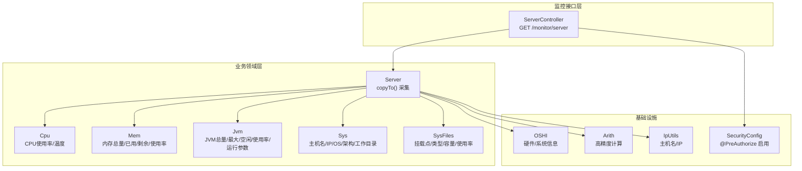
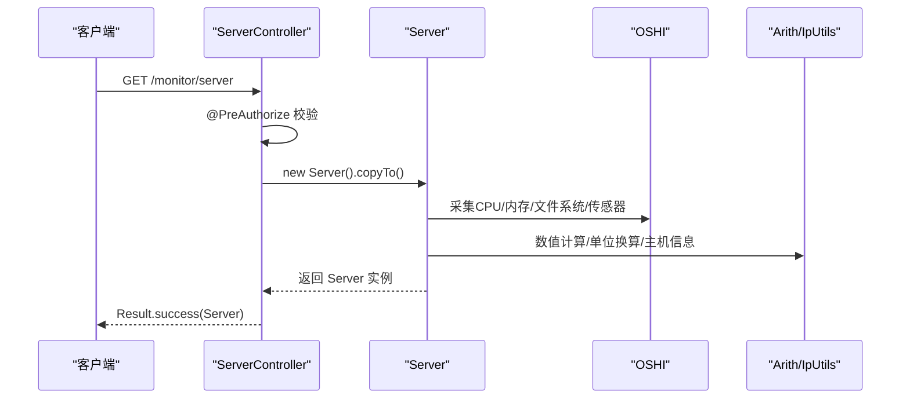
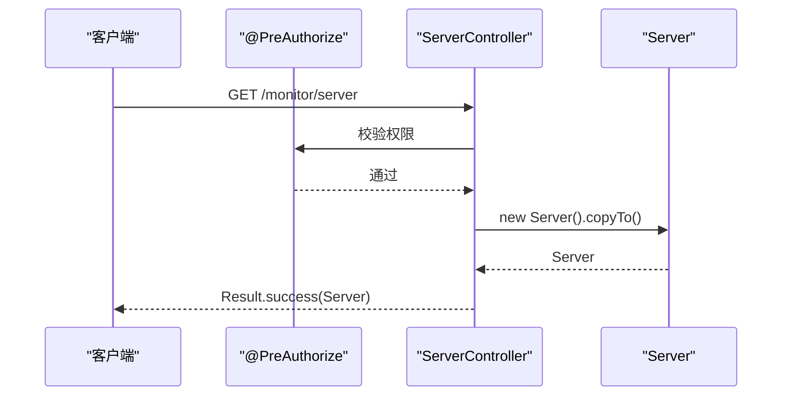
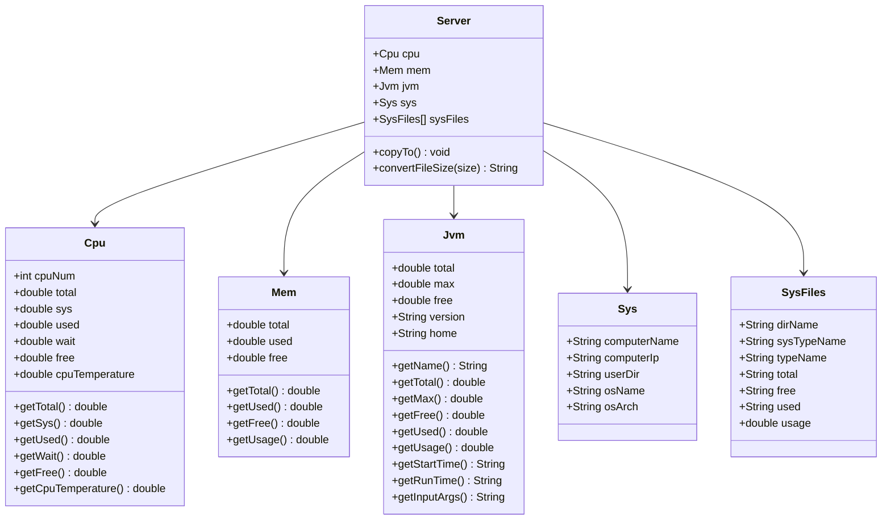
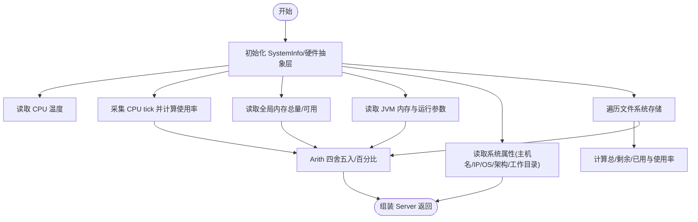
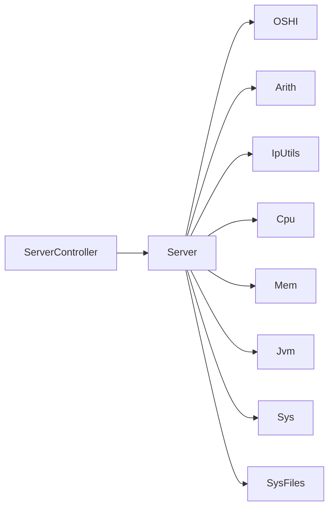

# 服务器监控

<cite>
**本文引用的文件**
- [ServerController.java](file://blog-admin/src/main/java/blog/web/controller/monitor/ServerController.java)
- [Server.java](file://blog-framework/src/main/java/blog/framework/web/domain/Server.java)
- [Cpu.java](file://blog-framework/src/main/java/blog/framework/web/domain/server/Cpu.java)
- [Jvm.java](file://blog-framework/src/main/java/blog/framework/web/domain/server/Jvm.java)
- [Mem.java](file://blog-framework/src/main/java/blog/framework/web/domain/server/Mem.java)
- [Sys.java](file://blog-framework/src/main/java/blog/framework/web/domain/server/Sys.java)
- [SysFiles.java](file://blog-framework/src/main/java/blog/framework/web/domain/server/SysFiles.java)
- [Arith.java](file://blog-common/src/main/java/blog/common/utils/Arith.java)
- [IpUtils.java](file://blog-common/src/main/java/blog/common/utils/ip/IpUtils.java)
- [SecurityConfig.java](file://blog-framework/src/main/java/blog/framework/config/SecurityConfig.java)
</cite>

## 目录
1. [简介](#简介)
2. [项目结构](#项目结构)
3. [核心组件](#核心组件)
4. [架构总览](#架构总览)
5. [详细组件分析](#详细组件分析)
6. [依赖分析](#依赖分析)
7. [性能考虑](#性能考虑)
8. [故障排查指南](#故障排查指南)
9. [结论](#结论)
10. [附录](#附录)

## 简介
本文件面向服务器监控功能，系统性阐述监控指标采集与展示的实现原理，覆盖 CPU 使用率、内存占用、磁盘空间、JVM 信息与系统基础信息等关键维度；同时详解 ServerController 控制器的权限控制、RESTful 接口设计与返回数据封装；剖析 Server 及其子类（Cpu、Jvm、Mem、Sys、SysFiles）的数据结构与计算逻辑；最后给出监控频率、阈值与历史存储等运维最佳实践。

## 项目结构
服务器监控能力由后端框架模块提供，前端通过统一的 REST 接口调用。核心代码分布如下：
- 控制器：ServerController 提供 /monitor/server GET 接口
- 数据模型：Server 组合各子域模型（Cpu、Jvm、Mem、Sys、SysFiles）
- 工具与集成：Arith 提供高精度数值计算；IpUtils 提供主机名与 IP 获取；OSHI 库采集硬件与系统信息
- 安全配置：基于 Spring Security 的方法级权限注解启用

图表来源
- [ServerController.java:15-25](file://blog-admin/src/main/java/blog/web/controller/monitor/ServerController.java#L15-L25)
- [Server.java:99-116](file://blog-framework/src/main/java/blog/framework/web/domain/Server.java#L99-L116)
- [Arith.java:1-113](file://blog-common/src/main/java/blog/common/utils/Arith.java#L1-L113)
- [IpUtils.java:191-210](file://blog-common/src/main/java/blog/common/utils/ip/IpUtils.java#L191-L210)
- [SecurityConfig.java:31](file://blog-framework/src/main/java/blog/framework/config/SecurityConfig.java#L31)

章节来源
- [ServerController.java:15-25](file://blog-admin/src/main/java/blog/web/controller/monitor/ServerController.java#L15-L25)
- [Server.java:31-97](file://blog-framework/src/main/java/blog/framework/web/domain/Server.java#L31-L97)

## 核心组件
- ServerController：REST 控制器，负责对外暴露监控接口，使用 @PreAuthorize 进行权限校验，返回统一响应包装。
- Server：聚合型领域对象，封装 CPU、内存、JVM、系统与磁盘信息，提供 copyTo() 统一采集入口。
- 子域模型：Cpu、Mem、Jvm、Sys、SysFiles，分别承载对应指标字段与计算逻辑。
- 工具类：Arith 提供高精度加减乘除与四舍五入；IpUtils 提供主机名与 IP 获取；OSHI 采集底层硬件与系统信息。

章节来源
- [ServerController.java:15-25](file://blog-admin/src/main/java/blog/web/controller/monitor/ServerController.java#L15-L25)
- [Server.java:31-97](file://blog-framework/src/main/java/blog/framework/web/domain/Server.java#L31-L97)
- [Cpu.java:10-101](file://blog-framework/src/main/java/blog/framework/web/domain/server/Cpu.java#L10-L101)
- [Mem.java:10-54](file://blog-framework/src/main/java/blog/framework/web/domain/server/Mem.java#L10-L54)
- [Jvm.java:13-115](file://blog-framework/src/main/java/blog/framework/web/domain/server/Jvm.java#L13-L115)
- [Sys.java:8-74](file://blog-framework/src/main/java/blog/framework/web/domain/server/Sys.java#L8-L74)
- [SysFiles.java:8-100](file://blog-framework/src/main/java/blog/framework/web/domain/server/SysFiles.java#L8-L100)
- [Arith.java:11-112](file://blog-common/src/main/java/blog/common/utils/Arith.java#L11-L112)
- [IpUtils.java:191-210](file://blog-common/src/main/java/blog/common/utils/ip/IpUtils.java#L191-L210)

## 架构总览
服务器监控采用“控制器-领域模型-外部库”分层：
- 控制器层：ServerController 仅做权限校验与调用，返回 Result 包装。
- 领域层：Server 负责采集与组装，子类负责各自指标的计算与格式化。
- 基础设施层：OSHI 抽象硬件与系统信息；Arith 保证数值精度；IpUtils 提供系统属性读取。

图表来源
- [ServerController.java:18-24](file://blog-admin/src/main/java/blog/web/controller/monitor/ServerController.java#L18-L24)
- [Server.java:99-116](file://blog-framework/src/main/java/blog/framework/web/domain/Server.java#L99-L116)
- [Arith.java:11-112](file://blog-common/src/main/java/blog/common/utils/Arith.java#L11-L112)
- [IpUtils.java:191-210](file://blog-common/src/main/java/blog/common/utils/ip/IpUtils.java#L191-L210)

## 详细组件分析

### ServerController 控制器
- 权限注解：@PreAuthorize("@ss.hasPermi('monitor:server:list')") 启用方法级权限校验。
- 接口设计：RESTful GET /monitor/server，返回 Result.success(server)。
- 数据封装：返回 Server 聚合对象，包含 CPU、内存、JVM、系统与磁盘信息。

图表来源
- [ServerController.java:18-24](file://blog-admin/src/main/java/blog/web/controller/monitor/ServerController.java#L18-L24)
- [SecurityConfig.java:31](file://blog-framework/src/main/java/blog/framework/config/SecurityConfig.java#L31)

章节来源
- [ServerController.java:15-25](file://blog-admin/src/main/java/blog/web/controller/monitor/ServerController.java#L15-L25)
- [SecurityConfig.java:31](file://blog-framework/src/main/java/blog/framework/config/SecurityConfig.java#L31)

### Server 与子类数据模型
- Server：聚合 CPU、内存、JVM、系统、磁盘信息；提供 copyTo() 统一采集入口；包含 convertFileSize() 单位换算。
- Cpu：CPU 核心数、总使用率、系统/用户/等待/空闲占比、温度；使用 Arith 进行百分比与四舍五入。
- Mem：内存总量、已用、剩余、使用率；使用 Arith 进行单位换算与百分比。
- Jvm：JVM 总量、最大、空闲、使用量、使用率、JDK 版本/路径、启动时间/运行时长、输入参数。
- Sys：主机名、IP、操作系统、架构、工作目录；使用 IpUtils 获取主机名与 IP。
- SysFiles：挂载点、文件系统类型、卷名、总/剩余/已用容量、使用率。

图表来源
- [Server.java:31-97](file://blog-framework/src/main/java/blog/framework/web/domain/Server.java#L31-L97)
- [Cpu.java:10-101](file://blog-framework/src/main/java/blog/framework/web/domain/server/Cpu.java#L10-L101)
- [Mem.java:10-54](file://blog-framework/src/main/java/blog/framework/web/domain/server/Mem.java#L10-L54)
- [Jvm.java:13-115](file://blog-framework/src/main/java/blog/framework/web/domain/server/Jvm.java#L13-L115)
- [Sys.java:8-74](file://blog-framework/src/main/java/blog/framework/web/domain/server/Sys.java#L8-L74)
- [SysFiles.java:8-100](file://blog-framework/src/main/java/blog/framework/web/domain/server/SysFiles.java#L8-L100)

章节来源
- [Server.java:99-221](file://blog-framework/src/main/java/blog/framework/web/domain/Server.java#L99-L221)
- [Cpu.java:10-101](file://blog-framework/src/main/java/blog/framework/web/domain/server/Cpu.java#L10-L101)
- [Mem.java:10-54](file://blog-framework/src/main/java/blog/framework/web/domain/server/Mem.java#L10-L54)
- [Jvm.java:13-115](file://blog-framework/src/main/java/blog/framework/web/domain/server/Jvm.java#L13-L115)
- [Sys.java:8-74](file://blog-framework/src/main/java/blog/framework/web/domain/server/Sys.java#L8-L74)
- [SysFiles.java:8-100](file://blog-framework/src/main/java/blog/framework/web/domain/server/SysFiles.java#L8-L100)

### 数据采集流程与算法
- CPU 采集：通过 OSHI CentralProcessor 两次采样（间隔固定毫秒级），计算总使用量与各类占比，再按总使用量归一化为百分比。
- 内存采集：直接读取全局内存总量与可用内存，计算已用与使用率。
- JVM 采集：读取运行时内存总量/最大/空闲，拼装 JDK 版本与路径，计算使用量与使用率，记录启动时间与运行时长。
- 系统信息：通过系统属性获取主机名、IP、OS 名称/架构、工作目录。
- 磁盘采集：遍历文件系统存储，计算总/剩余/已用容量与使用率，并进行人性化单位换算。
- 数值精度：统一使用 Arith 提供的高精度乘除与四舍五入，避免浮点误差。
- 主机信息：使用 IpUtils 获取本机 IP 与主机名，兼容未知情况。

图表来源
- [Server.java:99-196](file://blog-framework/src/main/java/blog/framework/web/domain/Server.java#L99-L196)
- [Arith.java:57-111](file://blog-common/src/main/java/blog/common/utils/Arith.java#L57-L111)
- [IpUtils.java:191-210](file://blog-common/src/main/java/blog/common/utils/ip/IpUtils.java#L191-L210)

章节来源
- [Server.java:118-196](file://blog-framework/src/main/java/blog/framework/web/domain/Server.java#L118-L196)
- [Arith.java:57-111](file://blog-common/src/main/java/blog/common/utils/Arith.java#L57-L111)
- [IpUtils.java:191-210](file://blog-common/src/main/java/blog/common/utils/ip/IpUtils.java#L191-L210)

## 依赖分析
- 控制器依赖：ServerController 依赖 Server 与权限上下文；权限注解由 Spring Security 方法级安全启用。
- Server 依赖：Server 依赖 OSHI（硬件/系统）、Arith（数值）、IpUtils（主机信息）。
- 子类依赖：Cpu/Mem/Jvm/Sys/SysFiles 依赖 Arith 进行数值计算与格式化。

图表来源
- [ServerController.java:18-24](file://blog-admin/src/main/java/blog/web/controller/monitor/ServerController.java#L18-L24)
- [Server.java:15-24](file://blog-framework/src/main/java/blog/framework/web/domain/Server.java#L15-L24)
- [Arith.java:11-112](file://blog-common/src/main/java/blog/common/utils/Arith.java#L11-L112)
- [IpUtils.java:191-210](file://blog-common/src/main/java/blog/common/utils/ip/IpUtils.java#L191-L210)

章节来源
- [ServerController.java:15-25](file://blog-admin/src/main/java/blog/web/controller/monitor/ServerController.java#L15-L25)
- [Server.java:15-24](file://blog-framework/src/main/java/blog/framework/web/domain/Server.java#L15-L24)

## 性能考虑
- 采样间隔：CPU 两次采样间存在固定等待时间，避免瞬时数据波动；建议根据监控频率调整该间隔以平衡精度与开销。
- I/O 与序列化：采集完成后一次性序列化返回，避免多次 I/O；若需高频轮询，建议前端缓存与去抖。
- 数值计算：Arith 使用 BigDecimal，确保高精度；在大量数据场景下注意避免重复构造。
- 磁盘扫描：文件系统遍历可能较重，建议限制扫描深度或按需刷新。
- 线程与会话：Spring Security 采用无状态 JWT，控制器无会话开销，适合高并发。

## 故障排查指南
- 权限不足：确认 @PreAuthorize 注解生效与用户权限配置；检查 SecurityConfig 中方法级安全开关。
- 采集异常：若 CPU/内存/磁盘采集失败，检查 OSHI 依赖与运行环境；关注空指针与除零风险。
- 数值异常：使用 Arith 时注意分母为零保护；确认单位换算与四舍五入策略。
- 主机信息：IpUtils 获取主机名/IP 失败时返回默认值，需检查网络与 DNS 配置。
- 接口返回：统一使用 Result.success 包装，若前端未收到数据，检查控制器与安全链路。

章节来源
- [SecurityConfig.java:31](file://blog-framework/src/main/java/blog/framework/config/SecurityConfig.java#L31)
- [ServerController.java:18-24](file://blog-admin/src/main/java/blog/web/controller/monitor/ServerController.java#L18-L24)
- [Arith.java:84-95](file://blog-common/src/main/java/blog/common/utils/Arith.java#L84-L95)
- [IpUtils.java:191-210](file://blog-common/src/main/java/blog/common/utils/ip/IpUtils.java#L191-L210)

## 结论
本监控体系以 Server 为核心聚合对象，结合 OSHI 与 Arith 实现高精度、跨平台的系统指标采集；通过 ServerController 提供受控的 REST 接口，满足运维与可观测性需求。建议在生产环境中合理设置采集频率、阈值与历史存储策略，持续优化性能与稳定性。

## 附录
- 接口定义
  - 方法：GET
  - 路径：/monitor/server
  - 权限：@PreAuthorize("@ss.hasPermi('monitor:server:list')")

- 返回结构（Server 聚合）
  - CPU：核心数、总使用率、系统/用户/等待/空闲占比、温度
  - 内存：总量、已用、剩余、使用率
  - JVM：总量、最大、空闲、使用量、使用率、JDK 版本/路径、启动时间/运行时长、输入参数
  - 系统：主机名、IP、操作系统、架构、工作目录
  - 磁盘：挂载点、文件系统类型、卷名、总/剩余/已用容量、使用率

- 最佳实践
  - 监控频率：建议每 1-5 秒一次，根据业务负载与资源瓶颈调整
  - 告警阈值：CPU/内存/磁盘使用率阈值建议 70%-85%，温度阈值依据硬件手册设定
  - 历史存储：建议落库或时序库，保留至少 30 天原始数据与 90 天聚合数据
  - 前端展示：结合折线图与仪表盘，支持多指标联动与趋势对比
  - 安全加固：严格控制 /monitor/server 访问权限，结合审计日志追踪访问行为