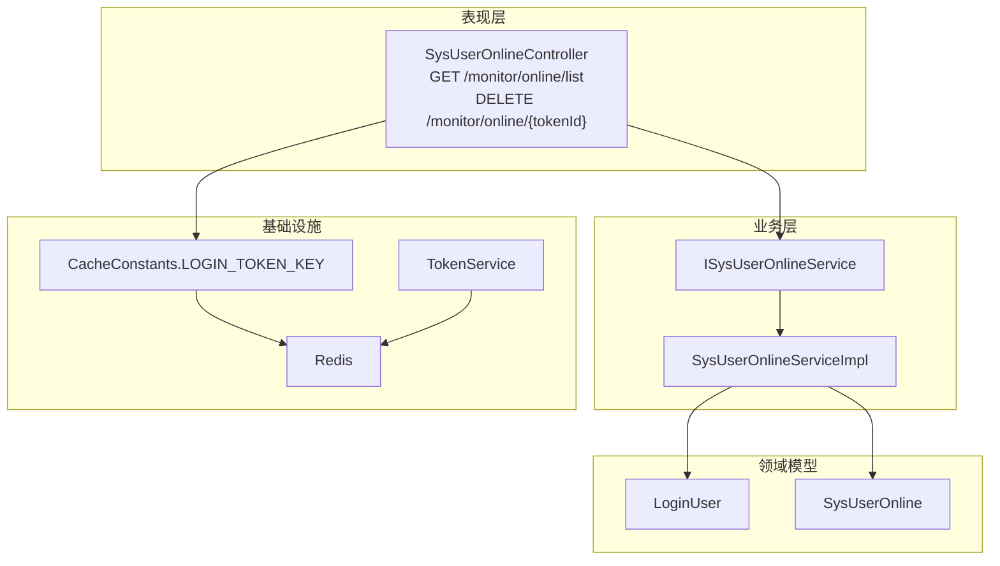
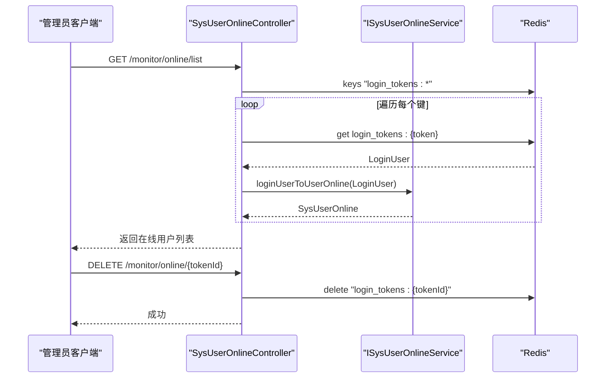
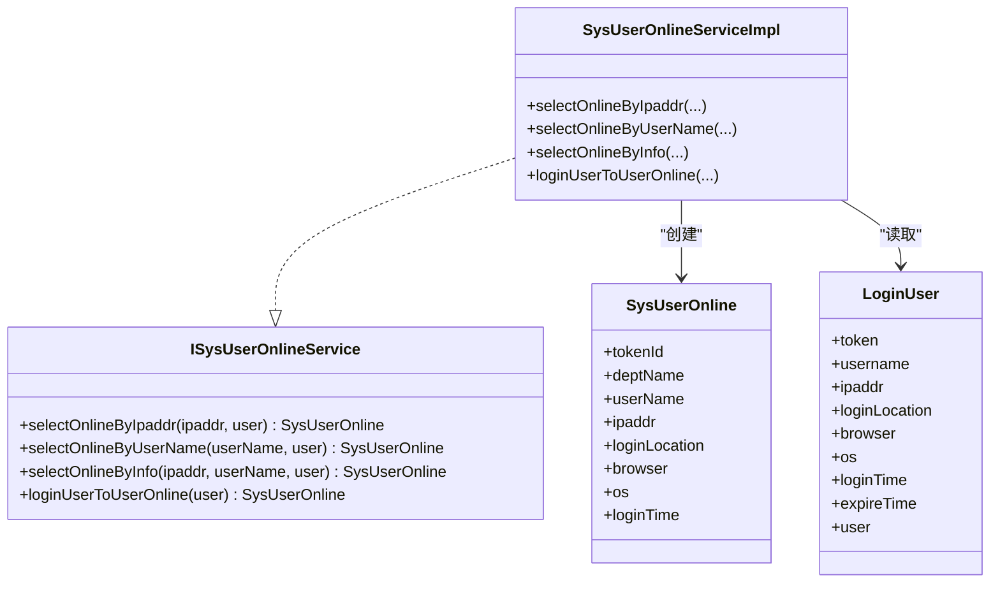
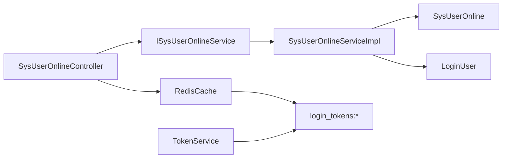

# 用户在线管理

<cite>
**本文引用的文件**
- [SysUserOnlineController.java](file://blog-admin/src/main/java/blog/web/controller/monitor/SysUserOnlineController.java)
- [ISysUserOnlineService.java](file://blog-system/src/main/java/blog/system/service/ISysUserOnlineService.java)
- [SysUserOnlineServiceImpl.java](file://blog-system/src/main/java/blog/system/service/impl/SysUserOnlineServiceImpl.java)
- [SysUserOnline.java](file://blog-system/src/main/java/blog/system/domain/SysUserOnline.java)
- [LoginUser.java](file://blog-common/src/main/java/blog/common/core/domain/model/LoginUser.java)
- [CacheConstants.java](file://blog-common/src/main/java/blog/common/constant/CacheConstants.java)
- [TokenService.java](file://blog-framework/src/main/java/blog/framework/web/service/TokenService.java)
- [SecurityConfig.java](file://blog-framework/src/main/java/blog/framework/config/SecurityConfig.java)
- [RedisConfig.java](file://blog-framework/src/main/java/blog/framework/config/RedisConfig.java)
- [application.yml](file://blog-admin/src/main/resources/application.yml)
- [session-ses_2bcc.md](file://session-ses_2bcc.md)
</cite>

## 目录
1. [简介](#简介)
2. [项目结构](#项目结构)
3. [核心组件](#核心组件)
4. [架构总览](#架构总览)
5. [详细组件分析](#详细组件分析)
6. [依赖分析](#依赖分析)
7. [性能考虑](#性能考虑)
8. [故障排查指南](#故障排查指南)
9. [结论](#结论)
10. [附录](#附录)

## 简介
本文件围绕“用户在线管理”功能，系统性阐述在线用户状态的实时监控与管理机制，覆盖以下方面：
- 在线用户状态来源与存储：基于 Redis 的登录令牌键空间统一管理
- 在线用户查询与筛选：支持按 IP、用户名、组合条件查询
- 在线用户列表统计：基于 Redis 键扫描与转换为展示模型
- 强制下线处理：通过删除 Redis 中的登录令牌键实现即时生效
- 控制器 API 设计与权限控制：REST 接口与方法级权限注解
- 实体模型设计：SysUserOnline 字段语义与用途
- 服务层逻辑：在线状态判断、用户信息映射、并发登录控制策略
- 最佳实践：会话管理策略、用户行为分析、在线资源监控与运维建议

## 项目结构
用户在线管理功能涉及三层：
- 表现层（Controller）：SysUserOnlineController 提供在线用户查询与强制下线接口
- 业务层（Service）：ISysUserOnlineService 及其实现负责在线用户信息的筛选与映射
- 数据与基础设施：LoginUser、SysUserOnline、CacheConstants、TokenService、Redis 配置

图表来源
- [SysUserOnlineController.java:32-72](file://blog-admin/src/main/java/blog/web/controller/monitor/SysUserOnlineController.java#L32-L72)
- [ISysUserOnlineService.java:11-47](file://blog-system/src/main/java/blog/system/service/ISysUserOnlineService.java#L11-L47)
- [SysUserOnlineServiceImpl.java:14-86](file://blog-system/src/main/java/blog/system/service/impl/SysUserOnlineServiceImpl.java#L14-L86)
- [SysUserOnline.java:8-112](file://blog-system/src/main/java/blog/system/domain/SysUserOnline.java#L8-L112)
- [LoginUser.java:16-234](file://blog-common/src/main/java/blog/common/core/domain/model/LoginUser.java#L16-L234)
- [CacheConstants.java:8-43](file://blog-common/src/main/java/blog/common/constant/CacheConstants.java#L8-L43)
- [TokenService.java:32-212](file://blog-framework/src/main/java/blog/framework/web/service/TokenService.java#L32-L212)

章节来源
- [SysUserOnlineController.java:32-72](file://blog-admin/src/main/java/blog/web/controller/monitor/SysUserOnlineController.java#L32-L72)
- [application.yml:65-97](file://blog-admin/src/main/resources/application.yml#L65-L97)

## 核心组件
- SysUserOnlineController：提供在线用户查询与强制下线接口，基于 Redis 键空间扫描与 LoginUser 对象转换为 SysUserOnline 展示模型
- ISysUserOnlineService/SysUserOnlineServiceImpl：封装在线用户筛选与映射逻辑，支持按 IP、用户名或组合条件查询
- SysUserOnline：在线用户展示模型，包含会话标识、用户与部门信息、登录信息与设备信息
- LoginUser：登录用户上下文，包含令牌、登录时间、过期时间、IP、登录地点、浏览器与操作系统等
- CacheConstants：定义 Redis 键前缀常量，用于登录令牌键空间
- TokenService：令牌创建、刷新与删除，负责将 LoginUser 写入 Redis 并设置过期时间
- Redis/RedisConfig：Redis 客户端与序列化配置，支撑在线用户状态的持久化与查询

章节来源
- [SysUserOnlineController.java:32-72](file://blog-admin/src/main/java/blog/web/controller/monitor/SysUserOnlineController.java#L32-L72)
- [ISysUserOnlineService.java:11-47](file://blog-system/src/main/java/blog/system/service/ISysUserOnlineService.java#L11-L47)
- [SysUserOnlineServiceImpl.java:14-86](file://blog-system/src/main/java/blog/system/service/impl/SysUserOnlineServiceImpl.java#L14-L86)
- [SysUserOnline.java:8-112](file://blog-system/src/main/java/blog/system/domain/SysUserOnline.java#L8-L112)
- [LoginUser.java:16-234](file://blog-common/src/main/java/blog/common/core/domain/model/LoginUser.java#L16-L234)
- [CacheConstants.java:8-43](file://blog-common/src/main/java/blog/common/constant/CacheConstants.java#L8-L43)
- [TokenService.java:32-212](file://blog-framework/src/main/java/blog/framework/web/service/TokenService.java#L32-L212)
- [RedisConfig.java:17-39](file://blog-framework/src/main/java/blog/framework/config/RedisConfig.java#L17-L39)

## 架构总览
用户在线管理的整体流程如下：
- 登录成功后，TokenService 将 LoginUser 写入 Redis，键为 login_tokens:{token}
- 在线用户查询：SysUserOnlineController 扫描 login_tokens:* 键，逐个读取 LoginUser 并映射为 SysUserOnline
- 强制下线：SysUserOnlineController 删除对应 login_tokens:{token} 键，使该会话立即失效
- 安全策略：Spring Security 配置为无状态（STATELESS），结合 JWT 过滤器完成认证

图表来源
- [SysUserOnlineController.java:42-72](file://blog-admin/src/main/java/blog/web/controller/monitor/SysUserOnlineController.java#L42-L72)
- [ISysUserOnlineService.java:46](file://blog-system/src/main/java/blog/system/service/ISysUserOnlineService.java#L46)
- [SysUserOnlineServiceImpl.java:68-85](file://blog-system/src/main/java/blog/system/service/impl/SysUserOnlineServiceImpl.java#L68-L85)
- [CacheConstants.java:12](file://blog-common/src/main/java/blog/common/constant/CacheConstants.java#L12)
- [TokenService.java:136-142](file://blog-framework/src/main/java/blog/framework/web/service/TokenService.java#L136-L142)

## 详细组件分析

### 控制器：SysUserOnlineController
- 在线用户查询
  - 路径：GET /monitor/online/list
  - 功能：扫描 Redis login_tokens:* 键空间，读取每个 LoginUser，按条件筛选并映射为 SysUserOnline 列表
  - 条件筛选：支持按 ipaddr、userName 或两者组合；若均为空则返回全部在线用户
  - 结果：反转列表并移除空项，封装为 TableDataInfo 返回
- 强制下线
  - 路径：DELETE /monitor/online/{tokenId}
  - 功能：删除 Redis 中 login_tokens:{tokenId} 键，使对应会话立即失效
  - 权限：需具备 monitor:online:forceLogout 权限
- 安全与日志
  - 方法级权限注解：@PreAuthorize
  - 操作日志：@Log 记录强制下线操作

章节来源
- [SysUserOnlineController.java:41-72](file://blog-admin/src/main/java/blog/web/controller/monitor/SysUserOnlineController.java#L41-L72)

### 服务层：ISysUserOnlineService 与 SysUserOnlineServiceImpl
- 接口职责
  - selectOnlineByIpaddr：按登录 IP 精确匹配
  - selectOnlineByUserName：按用户名精确匹配
  - selectOnlineByInfo：按 IP+用户名联合匹配
  - loginUserToUserOnline：将 LoginUser 映射为 SysUserOnline
- 实现要点
  - 使用 StringUtils 进行字符串比较与空值判断
  - 将 LoginUser 的用户部门信息映射到 SysUserOnline.deptName
  - 返回 null 表示不满足筛选条件，由上层过滤

图表来源
- [ISysUserOnlineService.java:11-47](file://blog-system/src/main/java/blog/system/service/ISysUserOnlineService.java#L11-L47)
- [SysUserOnlineServiceImpl.java:14-86](file://blog-system/src/main/java/blog/system/service/impl/SysUserOnlineServiceImpl.java#L14-L86)
- [SysUserOnline.java:8-112](file://blog-system/src/main/java/blog/system/domain/SysUserOnline.java#L8-L112)
- [LoginUser.java:16-234](file://blog-common/src/main/java/blog/common/core/domain/model/LoginUser.java#L16-L234)

章节来源
- [ISysUserOnlineService.java:11-47](file://blog-system/src/main/java/blog/system/service/ISysUserOnlineService.java#L11-L47)
- [SysUserOnlineServiceImpl.java:14-86](file://blog-system/src/main/java/blog/system/service/impl/SysUserOnlineServiceImpl.java#L14-L86)

### 实体模型：SysUserOnline
- 字段说明
  - tokenId：会话标识，与 Redis 键 login_tokens:{token} 对应
  - deptName：所属部门名称
  - userName：用户名
  - ipaddr：登录 IP
  - loginLocation：登录地理位置
  - browser：浏览器类型
  - os：操作系统
  - loginTime：登录时间（毫秒）
- 用途
  - 作为在线用户列表的展示模型，便于前端渲染与筛选

章节来源
- [SysUserOnline.java:8-112](file://blog-system/src/main/java/blog/system/domain/SysUserOnline.java#L8-L112)

### 登录上下文：LoginUser
- 关键字段
  - token：会话令牌
  - loginTime/expireTime：登录时间与过期时间
  - ipaddr/loginLocation/browser/os：设备与位置信息
  - user：用户实体，包含部门信息
- 作用
  - 作为 TokenService 刷新与写入 Redis 的载体
  - 作为 SysUserOnlineServiceImpl 映射的输入

章节来源
- [LoginUser.java:16-234](file://blog-common/src/main/java/blog/common/core/domain/model/LoginUser.java#L16-L234)

### 会话存储与键空间：CacheConstants 与 TokenService
- 键空间前缀
  - LOGIN_TOKEN_KEY：login_tokens:
- 写入与刷新
  - TokenService.refreshToken：设置 loginTime、expireTime，并以 login_tokens:{token} 写入 Redis，过期时间为 expireTime 分钟
- 删除与强制下线
  - SysUserOnlineController.delete：删除 login_tokens:{token} 键，使会话立即失效

章节来源
- [CacheConstants.java:12](file://blog-common/src/main/java/blog/common/constant/CacheConstants.java#L12)
- [TokenService.java:136-142](file://blog-framework/src/main/java/blog/framework/web/service/TokenService.java#L136-L142)
- [SysUserOnlineController.java:68-72](file://blog-admin/src/main/java/blog/web/controller/monitor/SysUserOnlineController.java#L68-L72)

### 安全与无状态会话：SecurityConfig
- SessionCreationPolicy：STATELESS，确保无会话状态
- 过滤器链：CorsFilter → JwtAuthenticationTokenFilter → UsernamePasswordAuthenticationFilter
- 认证入口：JWT 解析与 LoginUser 注入

章节来源
- [SecurityConfig.java:106](file://blog-framework/src/main/java/blog/framework/config/SecurityConfig.java#L106)
- [SecurityConfig.java:122](file://blog-framework/src/main/java/blog/framework/config/SecurityConfig.java#L122)

### 配置要点：application.yml
- Redis：host、port、database、password、timeout、连接池参数
- Token：header、secret、expireTime（分钟）

章节来源
- [application.yml:65-97](file://blog-admin/src/main/resources/application.yml#L65-L97)

## 依赖分析
- 控制器依赖
  - ISysUserOnlineService：用于在线用户信息的筛选与映射
  - RedisCache：用于键空间扫描与对象读取
- 服务层依赖
  - LoginUser：作为输入对象
  - StringUtils：字符串比较与空值判断
- 基础设施依赖
  - CacheConstants：键空间前缀
  - TokenService：会话创建与刷新
  - RedisConfig：Redis 客户端与序列化

图表来源
- [SysUserOnlineController.java:35-39](file://blog-admin/src/main/java/blog/web/controller/monitor/SysUserOnlineController.java#L35-L39)
- [ISysUserOnlineService.java:3](file://blog-system/src/main/java/blog/system/service/ISysUserOnlineService.java#L3)
- [SysUserOnlineServiceImpl.java:4](file://blog-system/src/main/java/blog/system/service/impl/SysUserOnlineServiceImpl.java#L4)
- [CacheConstants.java:12](file://blog-common/src/main/java/blog/common/constant/CacheConstants.java#L12)
- [TokenService.java:136-142](file://blog-framework/src/main/java/blog/framework/web/service/TokenService.java#L136-L142)

章节来源
- [SysUserOnlineController.java:35-39](file://blog-admin/src/main/java/blog/web/controller/monitor/SysUserOnlineController.java#L35-L39)
- [ISysUserOnlineService.java:3](file://blog-system/src/main/java/blog/system/service/ISysUserOnlineService.java#L3)
- [SysUserOnlineServiceImpl.java:4](file://blog-system/src/main/java/blog/system/service/impl/SysUserOnlineServiceImpl.java#L4)
- [CacheConstants.java:12](file://blog-common/src/main/java/blog/common/constant/CacheConstants.java#L12)
- [TokenService.java:136-142](file://blog-framework/src/main/java/blog/framework/web/service/TokenService.java#L136-L142)

## 性能考虑
- Redis 键扫描
  - keys "login_tokens:*" 会遍历所有在线会话键，适合中小规模在线用户场景
  - 若在线用户规模较大，建议引入索引或分页策略，避免一次性扫描过多键
- 序列化与网络
  - RedisConfig 使用 JSON 序列化，注意对象体积与序列化开销
- 令牌过期
  - TokenService.refreshToken 设置过期时间，到期后需重新认证
  - verifyToken 在剩余时间不足 20 分钟时自动续期，减少频繁刷新带来的压力

章节来源
- [RedisConfig.java:27-35](file://blog-framework/src/main/java/blog/framework/config/RedisConfig.java#L27-L35)
- [TokenService.java:123-129](file://blog-framework/src/main/java/blog/framework/web/service/TokenService.java#L123-L129)
- [TokenService.java:136-142](file://blog-framework/src/main/java/blog/framework/web/service/TokenService.java#L136-L142)

## 故障排查指南
- 在线列表为空
  - 检查 Redis 是否正常运行与连接参数
  - 确认是否存在 login_tokens:* 键
  - 核对 TokenService 是否正确写入 Redis
- 强制下线无效
  - 确认传入的 tokenId 与 login_tokens:{token} 一致
  - 检查 Redis 删除操作是否成功
- 权限不足
  - 确认调用方是否具备 monitor:online:list 与 monitor:online:forceLogout 权限
- 会话过期频繁
  - 检查 token.expireTime 配置与 verifyToken 续期逻辑

章节来源
- [SysUserOnlineController.java:42-72](file://blog-admin/src/main/java/blog/web/controller/monitor/SysUserOnlineController.java#L42-L72)
- [application.yml:96-97](file://blog-admin/src/main/resources/application.yml#L96-L97)
- [TokenService.java:123-129](file://blog-framework/src/main/java/blog/framework/web/service/TokenService.java#L123-L129)

## 结论
用户在线管理功能以 Redis 为会话存储核心，通过 login_tokens:* 键空间实现在线用户状态的统一管理。控制器提供查询与强制下线能力，服务层负责在线用户信息的筛选与映射，配合无状态安全策略与令牌续期机制，形成一套简洁高效的在线用户监控与治理方案。针对大规模场景，建议优化键扫描与引入索引策略，持续关注 Redis 性能与容量。

## 附录

### API 定义
- 在线用户查询
  - 方法：GET
  - 路径：/monitor/online/list
  - 查询参数：ipaddr（可选）、userName（可选）
  - 权限：monitor:online:list
  - 返回：TableDataInfo（包含在线用户列表）
- 强制下线
  - 方法：DELETE
  - 路径：/monitor/online/{tokenId}
  - 权限：monitor:online:forceLogout
  - 返回：Result（成功）

章节来源
- [SysUserOnlineController.java:42-72](file://blog-admin/src/main/java/blog/web/controller/monitor/SysUserOnlineController.java#L42-L72)

### 登录流程与时序参考
- 登录成功后，TokenService 将 LoginUser 写入 Redis，键为 login_tokens:{token}
- 后续请求通过 JWT 过滤器解析并续期
- 强制下线即删除对应键

章节来源
- [session-ses_2bcc.md:220-282](file://session-ses_2bcc.md#L220-L282)
- [TokenService.java:105-142](file://blog-framework/src/main/java/blog/framework/web/service/TokenService.java#L105-L142)