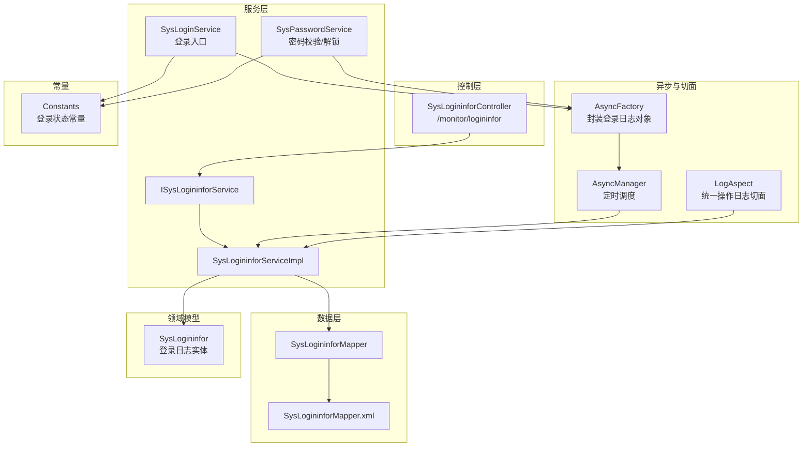
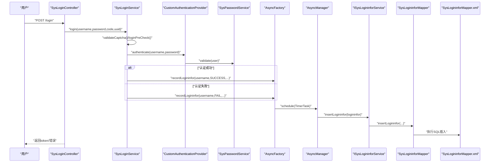
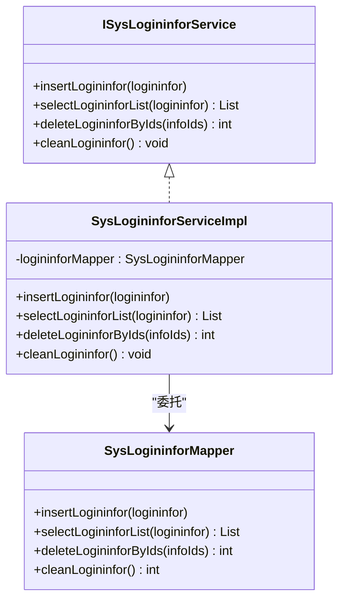
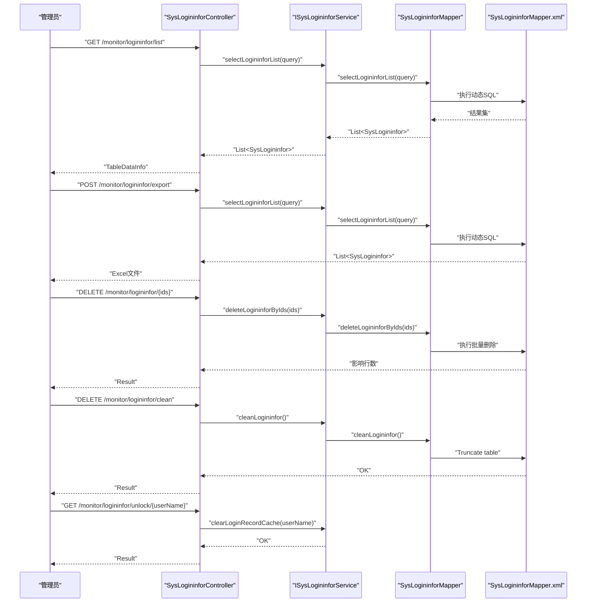
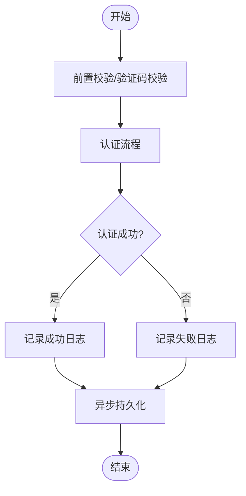
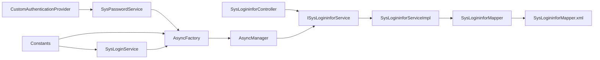

# 登录日志管理

<cite>
**本文引用的文件**   
- [SysLogininfor.java](file://blog-system/src/main/java/blog/system/domain/SysLogininfor.java)
- [ISysLogininforService.java](file://blog-system/src/main/java/blog/system/service/ISysLogininforService.java)
- [SysLogininforServiceImpl.java](file://blog-system/src/main/java/blog/system/service/impl/SysLogininforServiceImpl.java)
- [SysLogininforMapper.java](file://blog-system/src/main/java/blog/system/mapper/SysLogininforMapper.java)
- [SysLogininforMapper.xml](file://blog-system/src/main/resources/mapper/system/SysLogininforMapper.xml)
- [SysLogininforController.java](file://blog-admin/src/main/java/blog/web/controller/monitor/SysLogininforController.java)
- [SysLoginService.java](file://blog-framework/src/main/java/blog/framework/web/service/SysLoginService.java)
- [CustomAuthenticationProvider.java](file://blog-framework/src/main/java/blog/framework/security/provider/CustomAuthenticationProvider.java)
- [AsyncFactory.java](file://blog-framework/src/main/java/blog/framework/manager/factory/AsyncFactory.java)
- [AsyncManager.java](file://blog-framework/src/main/java/blog/framework/manager/AsyncManager.java)
- [LogAspect.java](file://blog-framework/src/main/java/blog/framework/aspectj/LogAspect.java)
- [Constants.java](file://blog-common/src/main/java/blog/common/constant/Constants.java)
- [SysLoginController.java](file://blog-admin/src/main/java/blog/web/controller/system/SysLoginController.java)
- [SysPasswordService.java](file://blog-framework/src/main/java/blog/framework/web/service/SysPasswordService.java)
</cite>

## 目录
1. [简介](#简介)
2. [项目结构](#项目结构)
3. [核心组件](#核心组件)
4. [架构总览](#架构总览)
5. [详细组件分析](#详细组件分析)
6. [依赖分析](#依赖分析)
7. [性能考量](#性能考量)
8. [故障排查指南](#故障排查指南)
9. [结论](#结论)
10. [附录](#附录)

## 简介
本文件围绕“登录日志管理”主题，系统性阐述用户登录行为的监控与记录机制，覆盖登录尝试、登录成功、登录失败、异常登录等状态的日志采集与存储；详细说明 SysLogininfor 控制器的功能实现（查询、导出、删除、清空、账户解锁）；剖析 SysLogininfor 实体类设计及其字段含义；梳理登录日志服务层的实现逻辑（事件捕获、异步持久化、状态判定）；最后给出安全分析方法与运维实践建议。

## 项目结构
登录日志相关能力由“控制层-服务层-数据层-异步工厂-切面与常量”协同完成，形成完整的“登录事件采集-异步落库-管理端操作”的闭环。

图表来源
- [SysLogininforController.java:30-77](file://blog-admin/src/main/java/blog/web/controller/monitor/SysLogininforController.java#L30-L77)
- [ISysLogininforService.java:13-41](file://blog-system/src/main/java/blog/system/service/ISysLogininforService.java#L13-L41)
- [SysLogininforServiceImpl.java:18-62](file://blog-system/src/main/java/blog/system/service/impl/SysLogininforServiceImpl.java#L18-L62)
- [SysLogininforMapper.java:13-43](file://blog-system/src/main/java/blog/system/mapper/SysLogininforMapper.java#L13-L43)
- [SysLogininforMapper.xml:5-57](file://blog-system/src/main/resources/mapper/system/SysLogininforMapper.xml#L5-L57)
- [SysLoginService.java:62-98](file://blog-framework/src/main/java/blog/framework/web/service/SysLoginService.java#L62-L98)
- [AsyncFactory.java:37-74](file://blog-framework/src/main/java/blog/framework/manager/factory/AsyncFactory.java#L37-L74)
- [AsyncManager.java:38-45](file://blog-framework/src/main/java/blog/framework/manager/AsyncManager.java#L38-L45)
- [LogAspect.java:86-134](file://blog-framework/src/main/java/blog/framework/aspectj/LogAspect.java#L86-L134)
- [Constants.java:46-71](file://blog-common/src/main/java/blog/common/constant/Constants.java#L46-L71)

章节来源
- [SysLogininforController.java:30-77](file://blog-admin/src/main/java/blog/web/controller/monitor/SysLogininforController.java#L30-L77)
- [SysLogininforServiceImpl.java:18-62](file://blog-system/src/main/java/blog/system/service/impl/SysLogininforServiceImpl.java#L18-L62)
- [SysLogininforMapper.xml:5-57](file://blog-system/src/main/resources/mapper/system/SysLogininforMapper.xml#L5-L57)

## 核心组件
- 实体类 SysLogininfor：承载登录日志的数据模型，包含用户账号、登录状态、IP 地址、登录地点、浏览器、操作系统、提示消息、登录时间等字段。
- 服务接口与实现 ISysLogininforService/SysLogininforServiceImpl：提供新增、查询、批量删除、清空等能力，并委托底层 Mapper 完成持久化。
- Mapper 与 XML：定义登录日志的插入、查询条件（按 IP、状态、用户名、时间区间）、批量删除、清空等 SQL。
- 控制器 SysLogininforController：提供登录日志的列表查询、导出、删除、清空、账户解锁等管理操作。
- 登录入口与事件捕获：SysLoginService 在登录过程中根据结果异步记录登录日志；自定义认证提供者 CustomAuthenticationProvider 在密码校验阶段也参与登录状态判定。
- 异步工厂与调度：AsyncFactory 封装登录日志对象并填充客户端 UA、IP、地理位置、浏览器与操作系统等信息；AsyncManager 以短延迟调度执行，避免阻塞主线程。
- 常量 Constants：统一登录状态（成功/失败/注册/注销/通用成功/通用失败）便于状态判定与展示。

章节来源
- [SysLogininfor.java:16-147](file://blog-system/src/main/java/blog/system/domain/SysLogininfor.java#L16-L147)
- [ISysLogininforService.java:13-41](file://blog-system/src/main/java/blog/system/service/ISysLogininforService.java#L13-L41)
- [SysLogininforServiceImpl.java:18-62](file://blog-system/src/main/java/blog/system/service/impl/SysLogininforServiceImpl.java#L18-L62)
- [SysLogininforMapper.java:13-43](file://blog-system/src/main/java/blog/system/mapper/SysLogininforMapper.java#L13-L43)
- [SysLogininforMapper.xml:19-55](file://blog-system/src/main/resources/mapper/system/SysLogininforMapper.xml#L19-L55)
- [SysLogininforController.java:38-76](file://blog-admin/src/main/java/blog/web/controller/monitor/SysLogininforController.java#L38-L76)
- [SysLoginService.java:62-98](file://blog-framework/src/main/java/blog/framework/web/service/SysLoginService.java#L62-L98)
- [CustomAuthenticationProvider.java:51-57](file://blog-framework/src/main/java/blog/framework/security/provider/CustomAuthenticationProvider.java#L51-L57)
- [AsyncFactory.java:37-74](file://blog-framework/src/main/java/blog/framework/manager/factory/AsyncFactory.java#L37-L74)
- [AsyncManager.java:38-45](file://blog-framework/src/main/java/blog/framework/manager/AsyncManager.java#L38-L45)
- [Constants.java:46-71](file://blog-common/src/main/java/blog/common/constant/Constants.java#L46-L71)

## 架构总览
登录日志管理贯穿“登录入口-认证扩展-异步记录-持久化-管理端操作”的全链路。

图表来源
- [SysLoginController.java:68-79](file://blog-admin/src/main/java/blog/web/controller/system/SysLoginController.java#L68-L79)
- [SysLoginService.java:62-98](file://blog-framework/src/main/java/blog/framework/web/service/SysLoginService.java#L62-L98)
- [CustomAuthenticationProvider.java:51-57](file://blog-framework/src/main/java/blog/framework/security/provider/CustomAuthenticationProvider.java#L51-L57)
- [SysPasswordService.java:174-200](file://blog-framework/src/main/java/blog/framework/web/service/SysPasswordService.java#L174-L200)
- [AsyncFactory.java:37-74](file://blog-framework/src/main/java/blog/framework/manager/factory/AsyncFactory.java#L37-L74)
- [AsyncManager.java:43-44](file://blog-framework/src/main/java/blog/framework/manager/AsyncManager.java#L43-L44)
- [ISysLogininforService.java:19-19](file://blog-system/src/main/java/blog/system/service/ISysLogininforService.java#L19-L19)
- [SysLogininforMapper.java:19-19](file://blog-system/src/main/java/blog/system/mapper/SysLogininforMapper.java#L19-L19)
- [SysLogininforMapper.xml:19-22](file://blog-system/src/main/resources/mapper/system/SysLogininforMapper.xml#L19-L22)

## 详细组件分析

### 实体类 SysLogininfor 设计
- 字段与职责
  - infoId：日志主键，用于唯一标识与删除。
  - userName：登录用户账号，支持模糊查询。
  - status：登录状态（0 成功/1 失败），用于区分登录结果。
  - ipaddr：登录来源 IP，支持模糊查询。
  - loginLocation：登录地点（基于 IP 解析），辅助定位异常来源。
  - browser/os：浏览器与操作系统信息，便于设备画像与异常识别。
  - msg：提示消息，记录登录结果或失败原因。
  - loginTime：登录时间，支持按时间区间查询与排序。
- 设计要点
  - 使用注解标注导出列与日期格式，便于管理端导出与展示。
  - 继承 BaseEntity，具备通用审计字段能力（如创建人、创建时间等，具体取决于基类定义）。

章节来源
- [SysLogininfor.java:16-147](file://blog-system/src/main/java/blog/system/domain/SysLogininfor.java#L16-L147)

### 服务层实现逻辑
- 新增登录日志：封装 SysLogininfor 对象并调用 Mapper 插入。
- 查询登录日志：支持按 IP、状态、用户名、起止时间进行动态条件查询，并按主键倒序。
- 批量删除与清空：支持按 ID 批量删除与整表清空（Truncate）。
- 状态判定：在异步工厂中依据 Constants 中的状态常量，将“登录成功/注销/注册”归为成功，“登录失败”归为失败。

图表来源
- [ISysLogininforService.java:13-41](file://blog-system/src/main/java/blog/system/service/ISysLogininforService.java#L13-L41)
- [SysLogininforServiceImpl.java:18-62](file://blog-system/src/main/java/blog/system/service/impl/SysLogininforServiceImpl.java#L18-L62)
- [SysLogininforMapper.java:13-43](file://blog-system/src/main/java/blog/system/mapper/SysLogininforMapper.java#L13-L43)

章节来源
- [SysLogininforServiceImpl.java:28-61](file://blog-system/src/main/java/blog/system/service/impl/SysLogininforServiceImpl.java#L28-L61)
- [SysLogininforMapper.xml:24-44](file://blog-system/src/main/resources/mapper/system/SysLogininforMapper.xml#L24-L44)

### 控制器 SysLogininforController 功能
- 列表查询：分页查询登录日志，支持按条件筛选与时间范围。
- 导出：将查询结果导出为 Excel。
- 删除：支持按 ID 批量删除。
- 清空：整表清空登录日志。
- 账户解锁：清除指定用户的登录失败缓存，便于被锁定的账户恢复。

图表来源
- [SysLogininforController.java:38-76](file://blog-admin/src/main/java/blog/web/controller/monitor/SysLogininforController.java#L38-L76)
- [ISysLogininforService.java:19-40](file://blog-system/src/main/java/blog/system/service/ISysLogininforService.java#L19-L40)
- [SysLogininforMapper.xml:24-55](file://blog-system/src/main/resources/mapper/system/SysLogininforMapper.xml#L24-L55)

章节来源
- [SysLogininforController.java:38-76](file://blog-admin/src/main/java/blog/web/controller/monitor/SysLogininforController.java#L38-L76)

### 登录事件捕获与异步持久化
- 登录入口：SysLoginService.login 在认证前后分别触发 AsyncFactory.recordLogininfor，记录登录尝试与最终结果。
- 认证扩展：CustomAuthenticationProvider.additionalAuthenticationChecks 在密码校验阶段参与状态判定，失败时同样触发记录。
- 异步工厂：AsyncFactory 从请求头解析 UA，获取 IP 与地理信息，组装 SysLogininfor 并填充浏览器、操作系统、消息与状态。
- 调度执行：AsyncManager 以极短延迟调度 TimerTask，确保主线程不阻塞。

图表来源
- [SysLoginService.java:62-98](file://blog-framework/src/main/java/blog/framework/web/service/SysLoginService.java#L62-L98)
- [CustomAuthenticationProvider.java:51-57](file://blog-framework/src/main/java/blog/framework/security/provider/CustomAuthenticationProvider.java#L51-L57)
- [AsyncFactory.java:37-74](file://blog-framework/src/main/java/blog/framework/manager/factory/AsyncFactory.java#L37-L74)
- [AsyncManager.java:43-44](file://blog-framework/src/main/java/blog/framework/manager/AsyncManager.java#L43-L44)

章节来源
- [SysLoginService.java:62-98](file://blog-framework/src/main/java/blog/framework/web/service/SysLoginService.java#L62-L98)
- [CustomAuthenticationProvider.java:51-57](file://blog-framework/src/main/java/blog/framework/security/provider/CustomAuthenticationProvider.java#L51-L57)
- [AsyncFactory.java:37-74](file://blog-framework/src/main/java/blog/framework/manager/factory/AsyncFactory.java#L37-L74)
- [AsyncManager.java:43-44](file://blog-framework/src/main/java/blog/framework/manager/AsyncManager.java#L43-L44)

### 查询条件与时间范围
- 支持按 IP、状态、用户名进行模糊匹配。
- 支持按 params.beginTime 与 params.endTime 进行时间范围查询。
- 查询结果按 info_id 倒序排列，保证最新记录在前。

章节来源
- [SysLogininforMapper.xml:24-44](file://blog-system/src/main/resources/mapper/system/SysLogininforMapper.xml#L24-L44)

## 依赖分析
- 控制器依赖服务接口，服务实现依赖 Mapper 接口与 XML 映射。
- 登录入口与认证扩展共同驱动登录日志的记录，异步工厂与调度器负责落库。
- 常量集中管理登录状态，确保各处一致。

图表来源
- [SysLogininforController.java:32-36](file://blog-admin/src/main/java/blog/web/controller/monitor/SysLogininforController.java#L32-L36)
- [ISysLogininforService.java:13-41](file://blog-system/src/main/java/blog/system/service/ISysLogininforService.java#L13-L41)
- [SysLogininforServiceImpl.java:20-21](file://blog-system/src/main/java/blog/system/service/impl/SysLogininforServiceImpl.java#L20-L21)
- [SysLogininforMapper.java:13-43](file://blog-system/src/main/java/blog/system/mapper/SysLogininforMapper.java#L13-L43)
- [SysLoginService.java:62-98](file://blog-framework/src/main/java/blog/framework/web/service/SysLoginService.java#L62-L98)
- [AsyncFactory.java:37-74](file://blog-framework/src/main/java/blog/framework/manager/factory/AsyncFactory.java#L37-L74)
- [AsyncManager.java:24-44](file://blog-framework/src/main/java/blog/framework/manager/AsyncManager.java#L24-L44)
- [CustomAuthenticationProvider.java:51-57](file://blog-framework/src/main/java/blog/framework/security/provider/CustomAuthenticationProvider.java#L51-L57)
- [Constants.java:46-71](file://blog-common/src/main/java/blog/common/constant/Constants.java#L46-L71)

章节来源
- [SysLogininforController.java:32-36](file://blog-admin/src/main/java/blog/web/controller/monitor/SysLogininforController.java#L32-L36)
- [SysLogininforServiceImpl.java:20-21](file://blog-system/src/main/java/blog/system/service/impl/SysLogininforServiceImpl.java#L20-L21)
- [SysLoginService.java:62-98](file://blog-framework/src/main/java/blog/framework/web/service/SysLoginService.java#L62-L98)
- [AsyncFactory.java:37-74](file://blog-framework/src/main/java/blog/framework/manager/factory/AsyncFactory.java#L37-L74)

## 性能考量
- 异步落库：通过 AsyncManager 的短延迟调度，避免阻塞登录主流程，提升响应速度。
- SQL 优化：查询条件采用动态 where 片段，结合索引可对高频字段（如 login_time、status、ipaddr）建立索引以提升查询效率。
- 批量删除与清空：批量删除使用 foreach in 子句，清空使用 Truncate 可快速清空表数据。
- 导出性能：导出前先在服务层分页查询，避免一次性加载全部数据。

## 故障排查指南
- 登录失败但未记录日志
  - 检查 SysLoginService.login 是否在异常分支触发了 AsyncFactory.recordLogininfor。
  - 确认异常类型是否被正确捕获并记录。
- 日志未入库
  - 检查 AsyncManager 的调度线程池是否正常运行。
  - 检查 ISysLogininforService.insertLogininfor 是否被调用。
  - 检查 SysLogininforMapper.xml 的 insert 节点是否正确映射字段。
- 查询无结果
  - 确认查询条件（IP/状态/用户名/时间范围）是否正确传递。
  - 检查 params.beginTime/params.endTime 是否为空导致条件未生效。
- 账户被锁无法登录
  - 使用“账户解锁”接口清除登录失败缓存后重试。

章节来源
- [SysLoginService.java:79-91](file://blog-framework/src/main/java/blog/framework/web/service/SysLoginService.java#L79-L91)
- [AsyncManager.java:43-44](file://blog-framework/src/main/java/blog/framework/manager/AsyncManager.java#L43-L44)
- [SysLogininforMapper.xml:19-22](file://blog-system/src/main/resources/mapper/system/SysLogininforMapper.xml#L19-L22)
- [SysLogininforController.java:70-76](file://blog-admin/src/main/java/blog/web/controller/monitor/SysLogininforController.java#L70-L76)

## 结论
登录日志管理通过“登录入口-认证扩展-异步工厂-服务层-数据层-管理端控制器”的协作，实现了对登录行为的全面监控与记录。实体设计清晰、服务层职责明确、查询条件灵活、管理端操作完备。配合异步落库与合理的 SQL 设计，可在保障性能的同时满足审计与安全分析需求。

## 附录

### 登录日志安全分析与运维实践
- 异常登录检测
  - 基于登录地点与 IP 的异常组合（如短时间内跨大区登录）进行告警。
  - 对同一账号在短时间内多次失败进行阈值告警。
- 暴力破解防护
  - 结合 SysPasswordService 的失败次数限制与缓存策略，防止密码爆破。
  - 登录失败时记录详细信息（IP、UA、浏览器、操作系统），便于后续封禁策略。
- 登录行为分析
  - 分析登录时间分布、设备特征（浏览器/操作系统）与来源地域，识别潜在风险。
  - 定期清理历史日志，保留必要周期内的数据以平衡存储与分析成本。