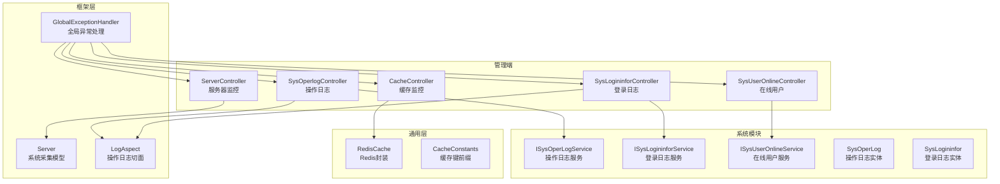
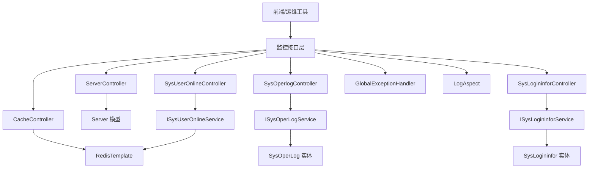
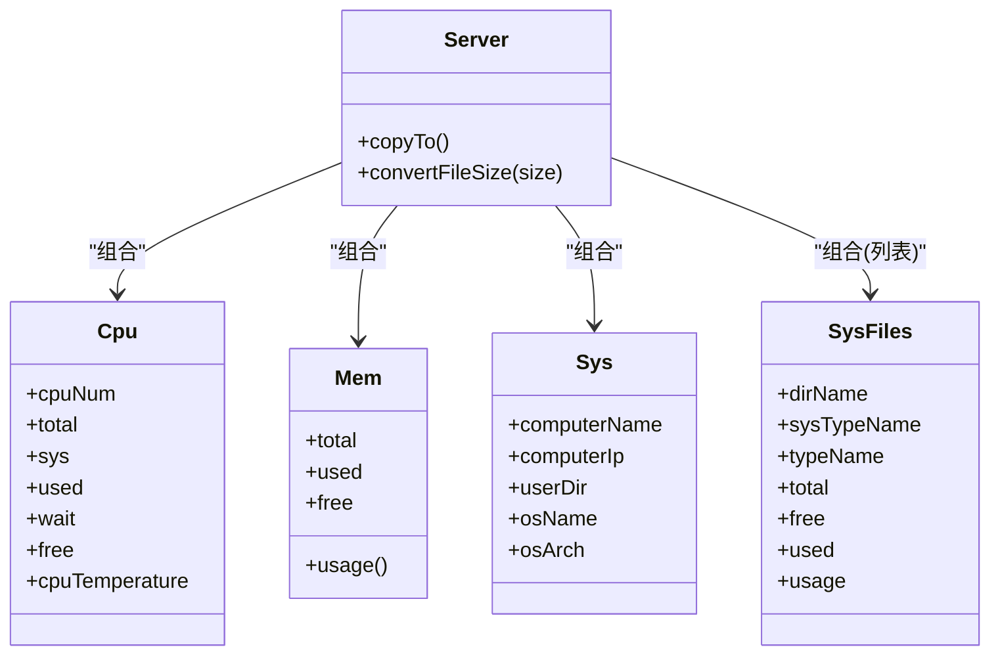
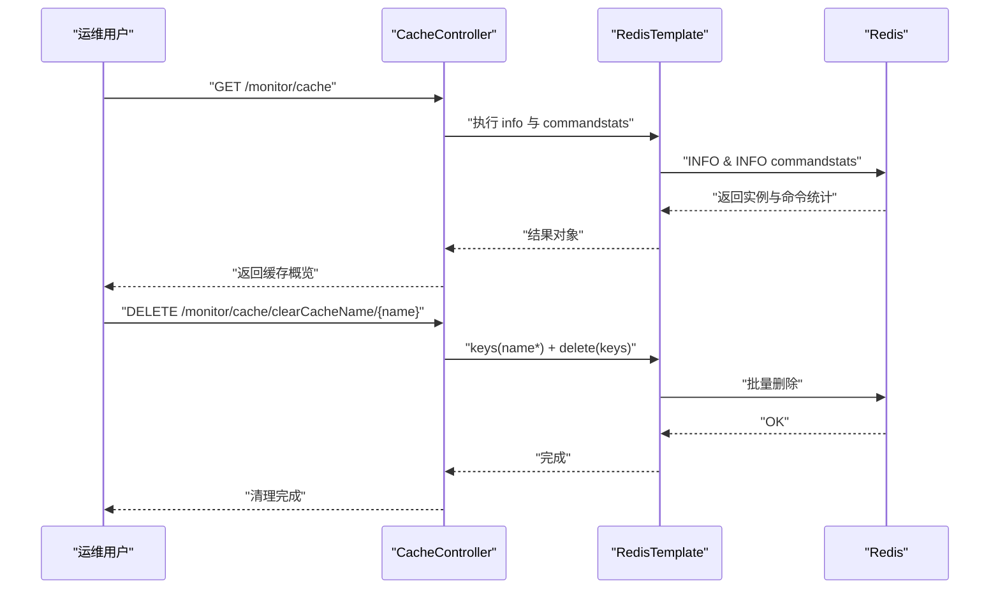
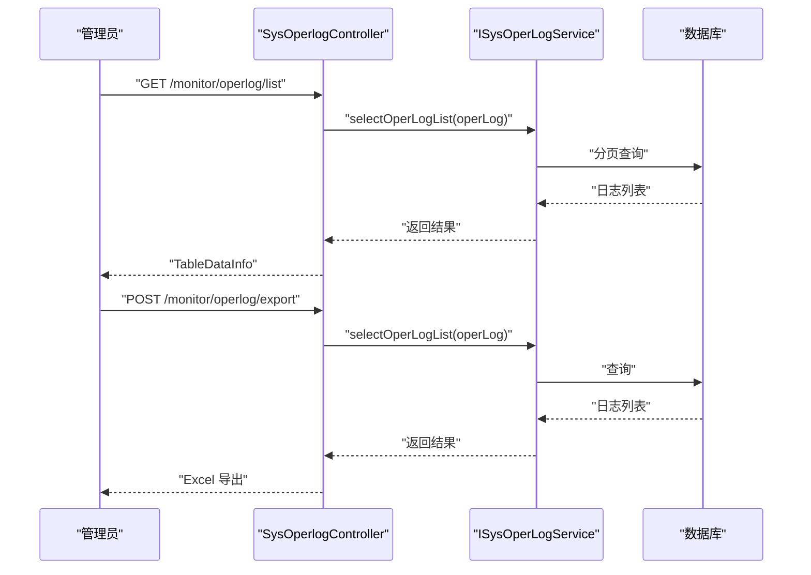
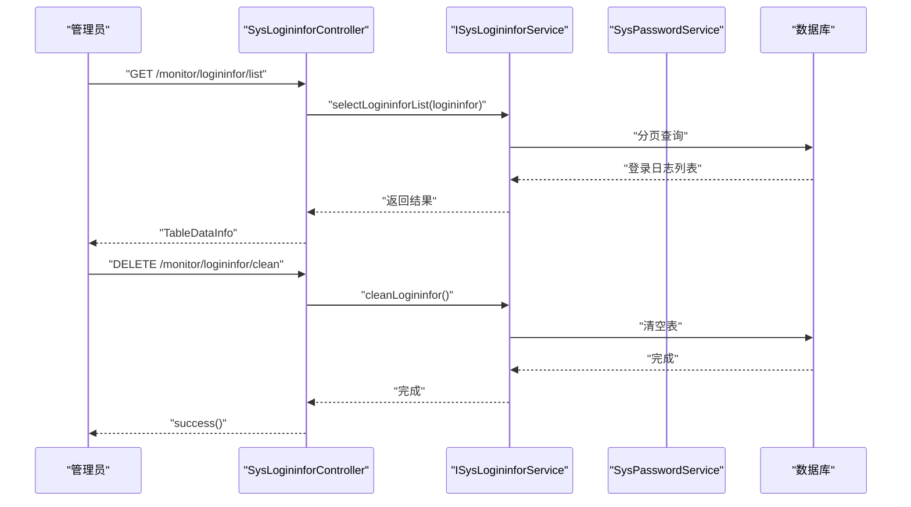
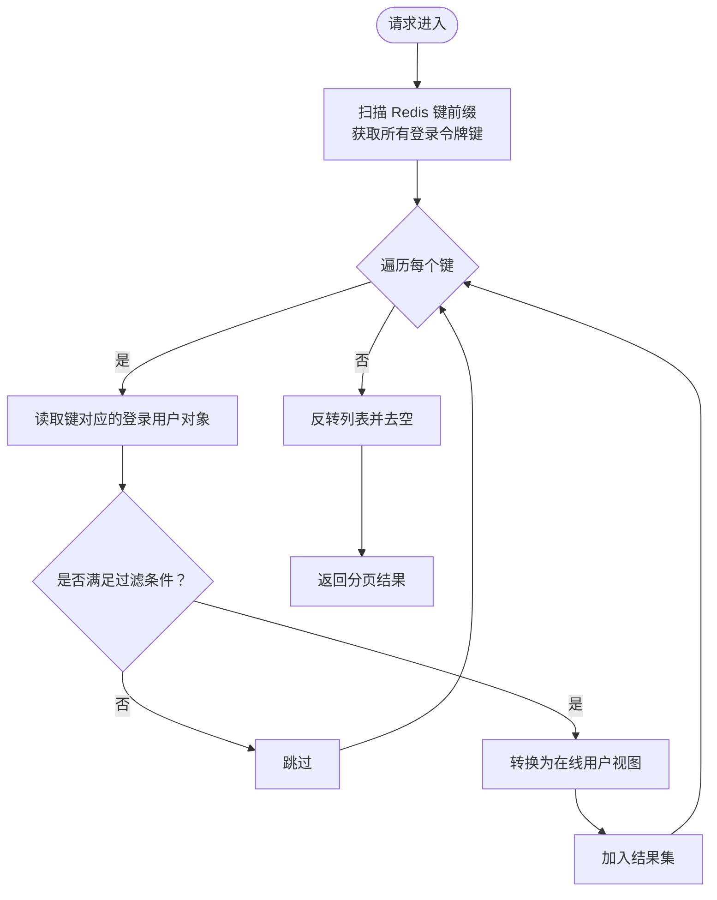
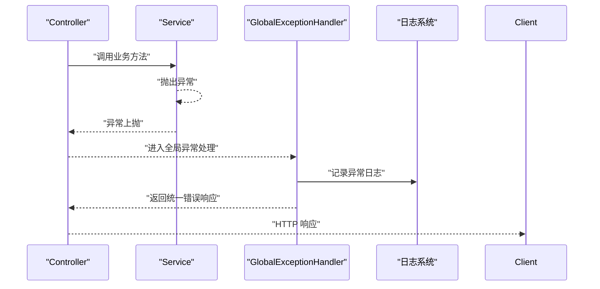
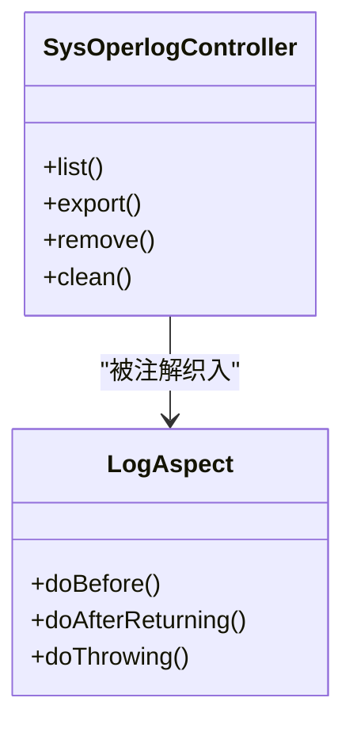
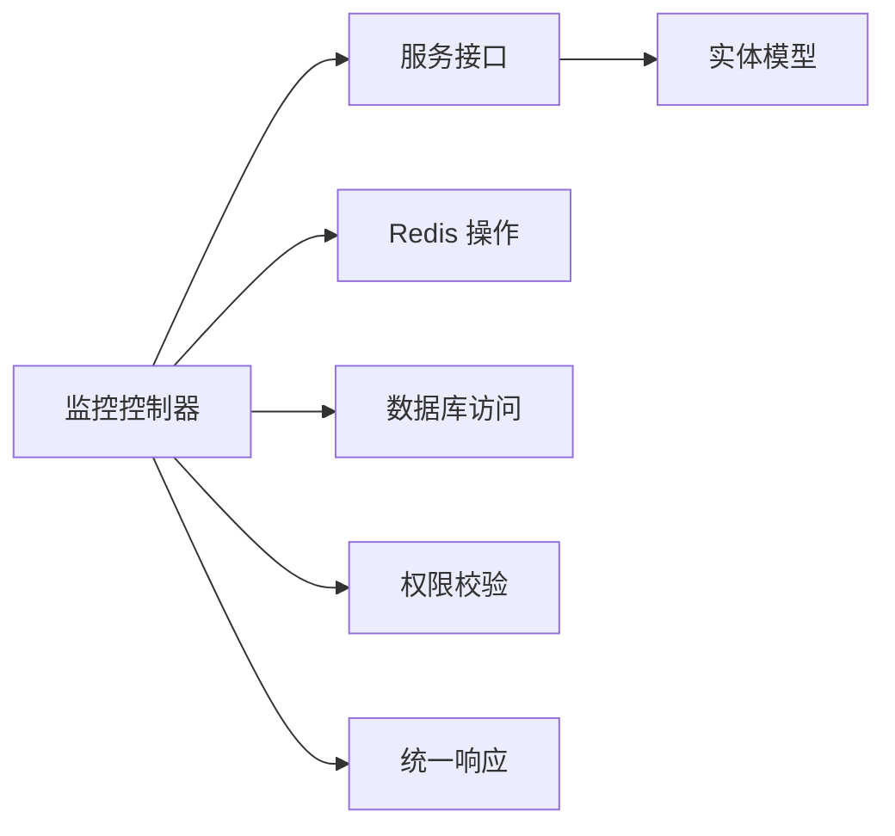

# 系统监控与运维

<cite>
**本文引用的文件**
- [Server.java](file://blog-framework/src/main/java/blog/framework/web/domain/Server.java)
- [Cpu.java](file://blog-framework/src/main/java/blog/framework/web/domain/server/Cpu.java)
- [Mem.java](file://blog-framework/src/main/java/blog/framework/web/domain/server/Mem.java)
- [Sys.java](file://blog-framework/src/main/java/blog/framework/web/domain/server/Sys.java)
- [SysFiles.java](file://blog-framework/src/main/java/blog/framework/web/domain/server/SysFiles.java)
- [ServerController.java](file://blog-admin/src/main/java/blog/web/controller/monitor/ServerController.java)
- [CacheController.java](file://blog-admin/src/main/java/blog/web/controller/monitor/CacheController.java)
- [SysOperlogController.java](file://blog-admin/src/main/java/blog/web/controller/monitor/SysOperlogController.java)
- [SysLogininforController.java](file://blog-admin/src/main/java/blog/web/controller/monitor/SysLogininforController.java)
- [SysUserOnlineController.java](file://blog-admin/src/main/java/blog/web/controller/monitor/SysUserOnlineController.java)
- [ISysOperLogService.java](file://blog-system/src/main/java/blog/system/service/ISysOperLogService.java)
- [ISysLogininforService.java](file://blog-system/src/main/java/blog/system/service/ISysLogininforService.java)
- [ISysUserOnlineService.java](file://blog-system/src/main/java/blog/system/service/ISysUserOnlineService.java)
- [SysOperLog.java](file://blog-system/src/main/java/blog/system/domain/SysOperLog.java)
- [SysLogininfor.java](file://blog-system/src/main/java/blog/system/domain/SysLogininfor.java)
- [GlobalExceptionHandler.java](file://blog-framework/src/main/java/blog/framework/web/exception/GlobalExceptionHandler.java)
- [LogAspect.java](file://blog-framework/src/main/java/blog/framework/aspectj/LogAspect.java)
- [RedisCache.java](file://blog-common/src/main/java/blog/common/core/redis/RedisCache.java)
- [CacheConstants.java](file://blog-common/src/main/java/blog/common/constant/CacheConstants.java)
- [application.yml](file://blog-admin/src/main/resources/application.yml)
- [logback.xml](file://blog-admin/src/main/resources/logback.xml)
</cite>

## 目录
1. [简介](#简介)
2. [项目结构](#项目结构)
3. [核心组件](#核心组件)
4. [架构总览](#架构总览)
5. [详细组件分析](#详细组件分析)
6. [依赖分析](#依赖分析)
7. [性能考虑](#性能考虑)
8. [故障排查指南](#故障排查指南)
9. [结论](#结论)
10. [附录](#附录)

## 简介
本文件面向系统监控与运维场景，围绕服务器状态监控、操作日志管理、登录日志监控、用户在线状态管理、全局异常处理、缓存与性能监控等方面进行系统化梳理。文档以代码为依据，结合架构图与流程图，帮助运维人员快速理解系统监控能力、定位问题并制定运维策略。

## 项目结构
该工程采用多模块分层设计：admin 管理端负责监控接口与页面交互；framework 框架层提供监控域模型、全局异常处理与切面日志；system 模块提供日志与在线用户的持久化与服务；common 提供通用工具与常量；quartz 提供定时任务调度；generator 提供代码生成；root pom 统一管理依赖与插件。

图表来源
- [ServerController.java:1-26](file://blog-admin/src/main/java/blog/web/controller/monitor/ServerController.java#L1-L26)
- [CacheController.java:1-117](file://blog-admin/src/main/java/blog/web/controller/monitor/CacheController.java#L1-L117)
- [SysOperlogController.java:1-66](file://blog-admin/src/main/java/blog/web/controller/monitor/SysOperlogController.java#L1-L66)
- [SysLogininforController.java:1-78](file://blog-admin/src/main/java/blog/web/controller/monitor/SysLogininforController.java#L1-L78)
- [SysUserOnlineController.java:1-74](file://blog-admin/src/main/java/blog/web/controller/monitor/SysUserOnlineController.java#L1-L74)
- [Server.java:1-221](file://blog-framework/src/main/java/blog/framework/web/domain/Server.java#L1-L221)
- [GlobalExceptionHandler.java](file://blog-framework/src/main/java/blog/framework/web/exception/GlobalExceptionHandler.java)
- [LogAspect.java](file://blog-framework/src/main/java/blog/framework/aspectj/LogAspect.java)
- [ISysOperLogService.java:1-50](file://blog-system/src/main/java/blog/system/service/ISysOperLogService.java#L1-L50)
- [ISysLogininforService.java:1-42](file://blog-system/src/main/java/blog/system/service/ISysLogininforService.java#L1-L42)
- [ISysUserOnlineService.java:1-48](file://blog-system/src/main/java/blog/system/service/ISysUserOnlineService.java#L1-L48)
- [SysOperLog.java:1-134](file://blog-system/src/main/java/blog/system/domain/SysOperLog.java#L1-L134)
- [SysLogininfor.java:1-147](file://blog-system/src/main/java/blog/system/domain/SysLogininfor.java#L1-L147)
- [RedisCache.java](file://blog-common/src/main/java/blog/common/core/redis/RedisCache.java)
- [CacheConstants.java](file://blog-common/src/main/java/blog/common/constant/CacheConstants.java)

章节来源
- [ServerController.java:1-26](file://blog-admin/src/main/java/blog/web/controller/monitor/ServerController.java#L1-L26)
- [CacheController.java:1-117](file://blog-admin/src/main/java/blog/web/controller/monitor/CacheController.java#L1-L117)
- [SysOperlogController.java:1-66](file://blog-admin/src/main/java/blog/web/controller/monitor/SysOperlogController.java#L1-L66)
- [SysLogininforController.java:1-78](file://blog-admin/src/main/java/blog/web/controller/monitor/SysLogininforController.java#L1-L78)
- [SysUserOnlineController.java:1-74](file://blog-admin/src/main/java/blog/web/controller/monitor/SysUserOnlineController.java#L1-L74)
- [Server.java:1-221](file://blog-framework/src/main/java/blog/framework/web/domain/Server.java#L1-L221)

## 核心组件
- 服务器监控模型与采集
  - 通过系统信息采集库获取 CPU、内存、磁盘、系统与 JVM 信息，并格式化输出。
- 缓存监控
  - 通过 RedisTemplate 获取 Redis 实例信息、命令统计与键空间，支持按命名空间清理。
- 操作日志与登录日志
  - 控制器提供查询、导出、删除、清空等能力；服务层定义标准接口；实体映射数据库表。
- 在线用户管理
  - 基于 Redis 的在线用户列表查询与强制下线。
- 全局异常处理
  - 统一捕获异常、构造响应、记录日志并返回用户可读提示。
- 切面日志
  - 基于注解的统一操作日志采集，自动记录业务行为与耗时。

章节来源
- [Server.java:1-221](file://blog-framework/src/main/java/blog/framework/web/domain/Server.java#L1-L221)
- [Cpu.java:1-102](file://blog-framework/src/main/java/blog/framework/web/domain/server/Cpu.java#L1-L102)
- [Mem.java:1-54](file://blog-framework/src/main/java/blog/framework/web/domain/server/Mem.java#L1-L54)
- [Sys.java:1-74](file://blog-framework/src/main/java/blog/framework/web/domain/server/Sys.java#L1-L74)
- [SysFiles.java:1-100](file://blog-framework/src/main/java/blog/framework/web/domain/server/SysFiles.java#L1-L100)
- [CacheController.java:1-117](file://blog-admin/src/main/java/blog/web/controller/monitor/CacheController.java#L1-L117)
- [SysOperlogController.java:1-66](file://blog-admin/src/main/java/blog/web/controller/monitor/SysOperlogController.java#L1-L66)
- [SysLogininforController.java:1-78](file://blog-admin/src/main/java/blog/web/controller/monitor/SysLogininforController.java#L1-L78)
- [SysUserOnlineController.java:1-74](file://blog-admin/src/main/java/blog/web/controller/monitor/SysUserOnlineController.java#L1-L74)
- [GlobalExceptionHandler.java](file://blog-framework/src/main/java/blog/framework/web/exception/GlobalExceptionHandler.java)
- [LogAspect.java](file://blog-framework/src/main/java/blog/framework/aspectj/LogAspect.java)

## 架构总览
系统监控由“接口层-服务层-数据层-基础设施”构成。接口层提供 REST API；服务层负责业务逻辑与数据聚合；数据层对接数据库与 Redis；基础设施包含系统采集与全局异常处理。

图表来源
- [ServerController.java:1-26](file://blog-admin/src/main/java/blog/web/controller/monitor/ServerController.java#L1-L26)
- [CacheController.java:1-117](file://blog-admin/src/main/java/blog/web/controller/monitor/CacheController.java#L1-L117)
- [SysOperlogController.java:1-66](file://blog-admin/src/main/java/blog/web/controller/monitor/SysOperlogController.java#L1-L66)
- [SysLogininforController.java:1-78](file://blog-admin/src/main/java/blog/web/controller/monitor/SysLogininforController.java#L1-L78)
- [SysUserOnlineController.java:1-74](file://blog-admin/src/main/java/blog/web/controller/monitor/SysUserOnlineController.java#L1-L74)
- [Server.java:1-221](file://blog-framework/src/main/java/blog/framework/web/domain/Server.java#L1-L221)
- [ISysOperLogService.java:1-50](file://blog-system/src/main/java/blog/system/service/ISysOperLogService.java#L1-L50)
- [ISysLogininforService.java:1-42](file://blog-system/src/main/java/blog/system/service/ISysLogininforService.java#L1-L42)
- [ISysUserOnlineService.java:1-48](file://blog-system/src/main/java/blog/system/service/ISysUserOnlineService.java#L1-L48)
- [SysOperLog.java:1-134](file://blog-system/src/main/java/blog/system/domain/SysOperLog.java#L1-L134)
- [SysLogininfor.java:1-147](file://blog-system/src/main/java/blog/system/domain/SysLogininfor.java#L1-L147)
- [GlobalExceptionHandler.java](file://blog-framework/src/main/java/blog/framework/web/exception/GlobalExceptionHandler.java)
- [LogAspect.java](file://blog-framework/src/main/java/blog/framework/aspectj/LogAspect.java)

## 详细组件分析

### 服务器状态监控
- 数据模型
  - CPU：核心数、总使用率、系统使用率、用户使用率、等待率、空闲率、温度。
  - 内存：总量、已用、剩余、使用率。
  - 系统：主机名、IP、操作系统、架构、项目路径。
  - 磁盘：挂载点、文件系统类型、总/可用/已用容量、使用率。
  - JVM：总内存、最大内存、空闲内存、版本、运行目录。
- 采集流程
  - 初始化系统信息采集器，分别读取 CPU、内存、文件系统与传感器信息。
  - 两次 tick 采样计算 CPU 使用率，内存直接读取可用/总量，磁盘遍历文件存储统计使用率。
- 接口能力
  - 提供统一 GET 接口返回完整服务器状态，权限控制与结果包装。

图表来源
- [Server.java:1-221](file://blog-framework/src/main/java/blog/framework/web/domain/Server.java#L1-L221)
- [Cpu.java:1-102](file://blog-framework/src/main/java/blog/framework/web/domain/server/Cpu.java#L1-L102)
- [Mem.java:1-54](file://blog-framework/src/main/java/blog/framework/web/domain/server/Mem.java#L1-L54)
- [Sys.java:1-74](file://blog-framework/src/main/java/blog/framework/web/domain/server/Sys.java#L1-L74)
- [SysFiles.java:1-100](file://blog-framework/src/main/java/blog/framework/web/domain/server/SysFiles.java#L1-L100)

章节来源
- [Server.java:99-220](file://blog-framework/src/main/java/blog/framework/web/domain/Server.java#L99-L220)
- [ServerController.java:18-24](file://blog-admin/src/main/java/blog/web/controller/monitor/ServerController.java#L18-L24)

### 缓存监控与性能监控
- Redis 实例信息与命令统计
  - 通过 RedisTemplate 获取 info 与 commandstats，解析命令调用次数用于可视化饼图。
- 缓存键空间管理
  - 支持按命名空间查询键、读取键值、清理指定命名空间或单个键、全量清理。
- 缓存键前缀
  - 定义了登录令牌、系统配置、字典、验证码、重复提交、限流、密码错误次数等常用键前缀，便于运维检索与清理。

图表来源
- [CacheController.java:50-115](file://blog-admin/src/main/java/blog/web/controller/monitor/CacheController.java#L50-L115)
- [RedisCache.java](file://blog-common/src/main/java/blog/common/core/redis/RedisCache.java)
- [CacheConstants.java](file://blog-common/src/main/java/blog/common/constant/CacheConstants.java)

章节来源
- [CacheController.java:1-117](file://blog-admin/src/main/java/blog/web/controller/monitor/CacheController.java#L1-L117)
- [CacheConstants.java](file://blog-common/src/main/java/blog/common/constant/CacheConstants.java)

### 操作日志管理
- 控制器能力
  - 分页查询、导出 Excel、批量删除、清空日志。
- 服务接口
  - 新增、查询列表、批量删除、按 ID 查询、清空。
- 实体字段
  - 模块、业务类型、请求方法、请求方式、操作类别、操作人员、部门、URL、IP、地点、请求参数、返回参数、状态、错误消息、时间、耗时。

图表来源
- [SysOperlogController.java:34-49](file://blog-admin/src/main/java/blog/web/controller/monitor/SysOperlogController.java#L34-L49)
- [ISysOperLogService.java:13-49](file://blog-system/src/main/java/blog/system/service/ISysOperLogService.java#L13-L49)
- [SysOperLog.java:1-134](file://blog-system/src/main/java/blog/system/domain/SysOperLog.java#L1-L134)

章节来源
- [SysOperlogController.java:1-66](file://blog-admin/src/main/java/blog/web/controller/monitor/SysOperlogController.java#L1-L66)
- [ISysOperLogService.java:1-50](file://blog-system/src/main/java/blog/system/service/ISysOperLogService.java#L1-L50)
- [SysOperLog.java:1-134](file://blog-system/src/main/java/blog/system/domain/SysOperLog.java#L1-L134)

### 登录日志监控
- 控制器能力
  - 分页查询、导出、删除、清空、账户解锁（清除登录错误缓存）。
- 服务接口
  - 新增、查询列表、批量删除、清空。
- 实体字段
  - ID、账号、状态（成功/失败）、IP、地点、浏览器、操作系统、消息、时间。

图表来源
- [SysLogininforController.java:38-68](file://blog-admin/src/main/java/blog/web/controller/monitor/SysLogininforController.java#L38-L68)
- [ISysLogininforService.java:13-41](file://blog-system/src/main/java/blog/system/service/ISysLogininforService.java#L13-L41)
- [SysLogininfor.java:1-147](file://blog-system/src/main/java/blog/system/domain/SysLogininfor.java#L1-L147)

章节来源
- [SysLogininforController.java:1-78](file://blog-admin/src/main/java/blog/web/controller/monitor/SysLogininforController.java#L1-L78)
- [ISysLogininforService.java:1-42](file://blog-system/src/main/java/blog/system/service/ISysLogininforService.java#L1-L42)
- [SysLogininfor.java:1-147](file://blog-system/src/main/java/blog/system/domain/SysLogininfor.java#L1-L147)

### 用户在线状态管理
- 在线用户查询
  - 支持按 IP、用户名或组合条件过滤，从 Redis 中读取登录用户信息并转换为在线用户视图。
- 强制下线
  - 通过删除 Redis 中的登录令牌键实现强制踢人。
- 在线用户服务
  - 将登录用户对象转换为在线用户视图，支持按 IP/用户名筛选。

图表来源
- [SysUserOnlineController.java:42-61](file://blog-admin/src/main/java/blog/web/controller/monitor/SysUserOnlineController.java#L42-L61)
- [ISysUserOnlineService.java:11-47](file://blog-system/src/main/java/blog/system/service/ISysUserOnlineService.java#L11-L47)
- [RedisCache.java](file://blog-common/src/main/java/blog/common/core/redis/RedisCache.java)
- [CacheConstants.java](file://blog-common/src/main/java/blog/common/constant/CacheConstants.java)

章节来源
- [SysUserOnlineController.java:1-74](file://blog-admin/src/main/java/blog/web/controller/monitor/SysUserOnlineController.java#L1-L74)
- [ISysUserOnlineService.java:1-48](file://blog-system/src/main/java/blog/system/service/ISysUserOnlineService.java#L1-L48)

### 全局异常处理机制
- 处理范围
  - 捕获控制器与服务层未处理异常，统一构造响应体，记录日志并返回用户友好提示。
- 集成位置
  - 作为全局异常处理器，拦截所有受管异常，避免异常穿透到客户端。
- 配置建议
  - 结合日志配置与告警规则，对高频异常进行预警。

图表来源
- [GlobalExceptionHandler.java](file://blog-framework/src/main/java/blog/framework/web/exception/GlobalExceptionHandler.java)
- [application.yml](file://blog-admin/src/main/resources/application.yml)
- [logback.xml](file://blog-admin/src/main/resources/logback.xml)

章节来源
- [GlobalExceptionHandler.java](file://blog-framework/src/main/java/blog/framework/web/exception/GlobalExceptionHandler.java)

### 切面日志与审计
- 切面能力
  - 基于注解记录操作日志，自动采集请求参数、返回结果、耗时、异常信息等。
- 与控制器配合
  - 控制器标注日志注解，切面在方法前后织入日志采集逻辑，减少重复代码。

图表来源
- [LogAspect.java](file://blog-framework/src/main/java/blog/framework/aspectj/LogAspect.java)
- [SysOperlogController.java:14-19](file://blog-admin/src/main/java/blog/web/controller/monitor/SysOperlogController.java#L14-L19)

章节来源
- [LogAspect.java](file://blog-framework/src/main/java/blog/framework/aspectj/LogAspect.java)
- [SysOperlogController.java:14-19](file://blog-admin/src/main/java/blog/web/controller/monitor/SysOperlogController.java#L14-L19)

## 依赖分析
- 组件耦合
  - 控制器依赖服务接口与通用工具；服务层依赖实体与数据访问层；模型依赖系统采集库；异常处理与切面横切各层。
- 外部依赖
  - Redis 用于在线用户与缓存监控；数据库用于日志持久化；系统采集库用于服务器状态采集。
- 权限控制
  - 控制器使用注解鉴权，确保监控接口仅对授权用户开放。

图表来源
- [ServerController.java:18-24](file://blog-admin/src/main/java/blog/web/controller/monitor/ServerController.java#L18-L24)
- [CacheController.java:50-71](file://blog-admin/src/main/java/blog/web/controller/monitor/CacheController.java#L50-L71)
- [SysOperlogController.java:34-49](file://blog-admin/src/main/java/blog/web/controller/monitor/SysOperlogController.java#L34-L49)
- [SysLogininforController.java:38-44](file://blog-admin/src/main/java/blog/web/controller/monitor/SysLogininforController.java#L38-L44)
- [SysUserOnlineController.java:42-61](file://blog-admin/src/main/java/blog/web/controller/monitor/SysUserOnlineController.java#L42-L61)

章节来源
- [ServerController.java:1-26](file://blog-admin/src/main/java/blog/web/controller/monitor/ServerController.java#L1-L26)
- [CacheController.java:1-117](file://blog-admin/src/main/java/blog/web/controller/monitor/CacheController.java#L1-L117)
- [SysOperlogController.java:1-66](file://blog-admin/src/main/java/blog/web/controller/monitor/SysOperlogController.java#L1-L66)
- [SysLogininforController.java:1-78](file://blog-admin/src/main/java/blog/web/controller/monitor/SysLogininforController.java#L1-L78)
- [SysUserOnlineController.java:1-74](file://blog-admin/src/main/java/blog/web/controller/monitor/SysUserOnlineController.java#L1-L74)

## 性能考虑
- 服务器采集
  - CPU 两次 tick 采样计算使用率，避免瞬时波动；磁盘遍历文件系统统计使用率，注意大数据量下的 IO 开销。
- 缓存监控
  - keys 匹配可能产生阻塞，建议在低峰期执行全量清理；对热点键空间进行分片与限流。
- 日志与在线用户
  - 分页查询与导出需限制条数；在线用户列表按条件过滤，避免全量扫描。
- 全局异常
  - 对频繁异常进行告警与熔断，避免雪崩效应。

## 故障排查指南
- 服务器状态为空
  - 检查系统采集库是否可用、JVM 参数与权限；确认接口权限与返回包装。
- 缓存监控异常
  - 核对 Redis 连接配置、命令统计解析逻辑；检查键前缀与命名空间。
- 操作/登录日志缺失
  - 确认切面日志是否生效、数据库连接与表结构；检查分页参数与过滤条件。
- 在线用户不更新
  - 检查登录令牌键前缀、Redis 过期策略与清理任务；确认强制下线是否正确删除键。
- 全局异常未捕获
  - 检查异常处理器注册、日志级别与响应包装；核对业务异常是否自定义。

章节来源
- [Server.java:99-220](file://blog-framework/src/main/java/blog/framework/web/domain/Server.java#L99-L220)
- [CacheController.java:50-115](file://blog-admin/src/main/java/blog/web/controller/monitor/CacheController.java#L50-L115)
- [SysOperlogController.java:34-64](file://blog-admin/src/main/java/blog/web/controller/monitor/SysOperlogController.java#L34-L64)
- [SysLogininforController.java:38-68](file://blog-admin/src/main/java/blog/web/controller/monitor/SysLogininforController.java#L38-L68)
- [SysUserOnlineController.java:42-72](file://blog-admin/src/main/java/blog/web/controller/monitor/SysUserOnlineController.java#L42-L72)
- [GlobalExceptionHandler.java](file://blog-framework/src/main/java/blog/framework/web/exception/GlobalExceptionHandler.java)

## 结论
该系统提供了完善的监控与运维能力：服务器状态采集、缓存与性能监控、操作与登录日志、在线用户管理以及全局异常处理。通过注解切面与统一响应，降低了重复开发成本；通过 Redis 与数据库分离，提升了查询与清理效率。建议结合日志与告警体系，持续优化监控指标与阈值，保障系统稳定运行。

## 附录
- 配置参考
  - 应用配置与日志配置位于管理端资源目录，可根据环境调整日志级别与输出格式。
- 最佳实践
  - 定期巡检服务器资源与缓存命中率；对异常日志建立分级告警；规范在线用户清理策略；严格控制日志导出范围与频率。

章节来源
- [application.yml](file://blog-admin/src/main/resources/application.yml)
- [logback.xml](file://blog-admin/src/main/resources/logback.xml)