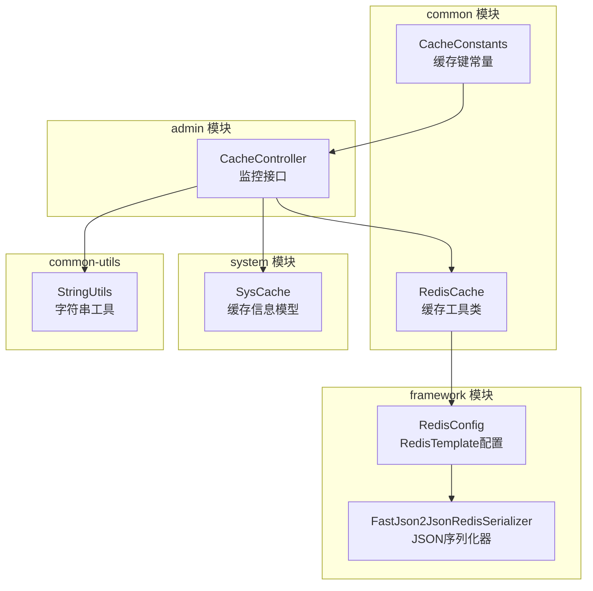
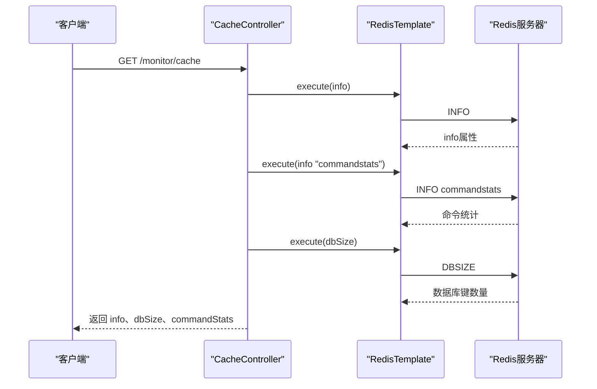
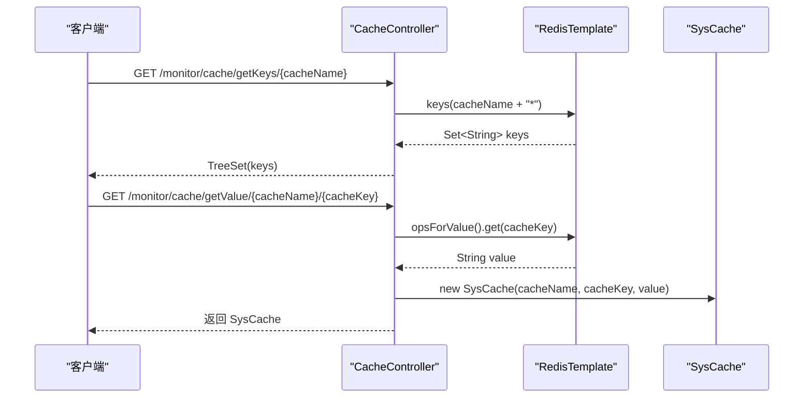
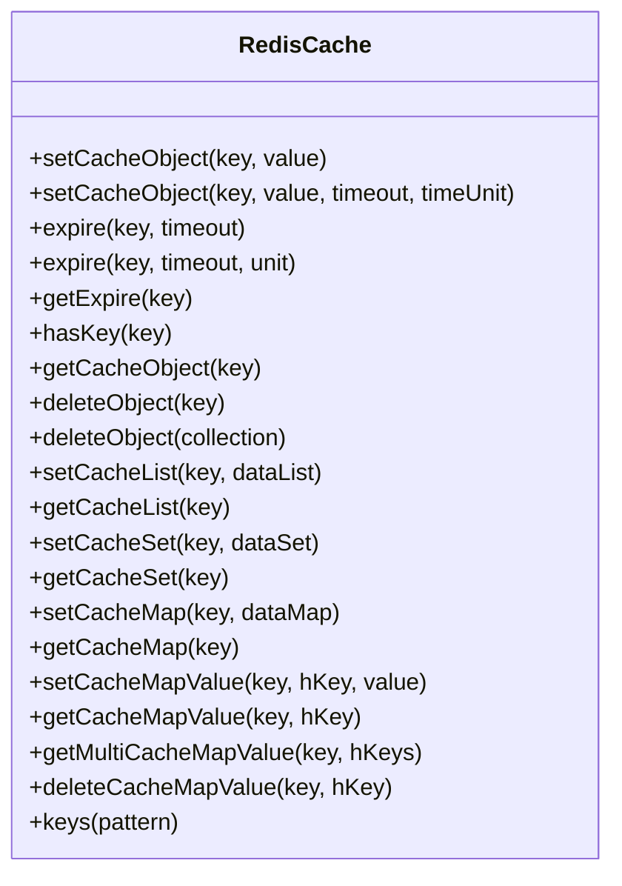
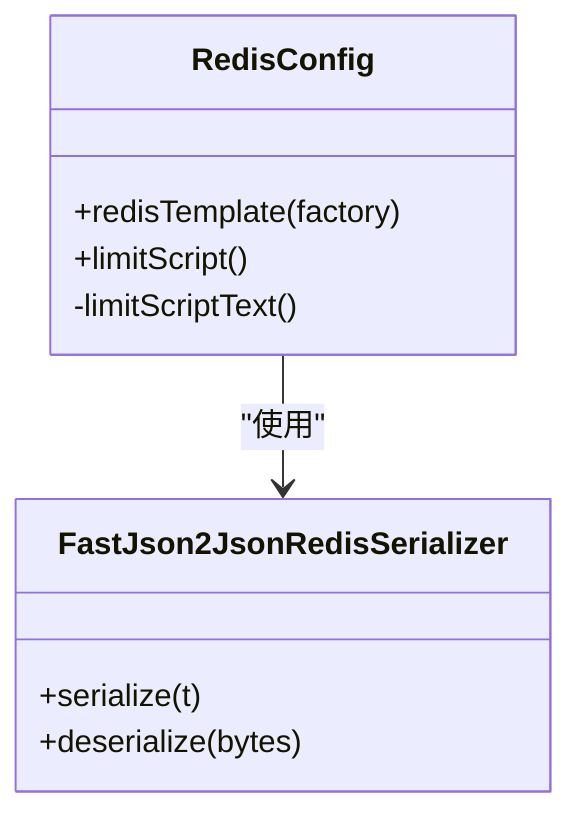
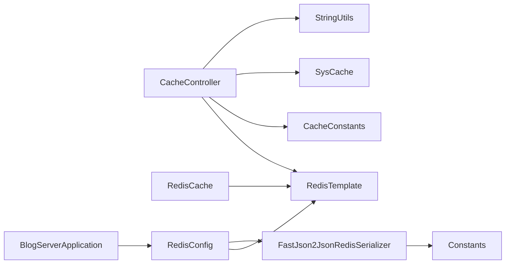

# 缓存监控

<cite>
**本文引用的文件**
- [RedisCache.java](file://blog-common/src/main/java/blog/common/core/redis/RedisCache.java)
- [CacheController.java](file://blog-admin/src/main/java/blog/web/controller/monitor/CacheController.java)
- [CacheConstants.java](file://blog-common/src/main/java/blog/common/constant/CacheConstants.java)
- [RedisConfig.java](file://blog-framework/src/main/java/blog/framework/config/RedisConfig.java)
- [SysCache.java](file://blog-system/src/main/java/blog/system/domain/SysCache.java)
- [FastJson2JsonRedisSerializer.java](file://blog-framework/src/main/java/blog/framework/config/FastJson2JsonRedisSerializer.java)
- [Constants.java](file://blog-common/src/main/java/blog/common/constant/Constants.java)
- [StringUtils.java](file://blog-common/src/main/java/blog/common/utils/StringUtils.java)
- [BlogServerApplication.java](file://blog-admin/src/main/java/blog/BlogServerApplication.java)
</cite>

## 目录
1. [简介](#简介)
2. [项目结构](#项目结构)
3. [核心组件](#核心组件)
4. [架构总览](#架构总览)
5. [详细组件分析](#详细组件分析)
6. [依赖分析](#依赖分析)
7. [性能考量](#性能考量)
8. [故障排查指南](#故障排查指南)
9. [结论](#结论)
10. [附录](#附录)

## 简介
本文件聚焦于基于 Spring Data Redis 的缓存监控与管理能力，涵盖 Redis 缓存系统的监控与管理机制，包括：
- 缓存命中率统计与计算方法
- 内存使用情况监控
- 键值过期管理
- CacheController 控制器的实现（缓存信息查询、缓存数据浏览、缓存清理）
- RedisCache 类的设计与实现（缓存操作封装、分布式锁与失效策略）
- 关键监控指标（命中率、内存使用率、连接数、命令执行统计）
- 最佳实践（配置优化、热点数据处理、缓存一致性）

## 项目结构
缓存监控功能主要分布在以下模块：
- admin 模块：对外提供监控接口（CacheController）
- common 模块：缓存工具类（RedisCache）、常量定义（CacheConstants）
- framework 模块：Redis 序列化配置（RedisConfig、FastJson2JsonRedisSerializer）
- system 模块：缓存信息模型（SysCache）
- common-utils：字符串工具（StringUtils）用于解析 Redis info 输出

图表来源
- [CacheController.java:31-116](file://blog-admin/src/main/java/blog/web/controller/monitor/CacheController.java#L31-L116)
- [RedisCache.java:24-247](file://blog-common/src/main/java/blog/common/core/redis/RedisCache.java#L24-L247)
- [CacheConstants.java:8-43](file://blog-common/src/main/java/blog/common/constant/CacheConstants.java#L8-L43)
- [RedisConfig.java:20-39](file://blog-framework/src/main/java/blog/framework/config/RedisConfig.java#L20-L39)
- [FastJson2JsonRedisSerializer.java:19-48](file://blog-framework/src/main/java/blog/framework/config/FastJson2JsonRedisSerializer.java#L19-L48)
- [SysCache.java:10-77](file://blog-system/src/main/java/blog/system/domain/SysCache.java#L10-L77)
- [StringUtils.java:20-200](file://blog-common/src/main/java/blog/common/utils/StringUtils.java#L20-L200)

章节来源
- [CacheController.java:31-116](file://blog-admin/src/main/java/blog/web/controller/monitor/CacheController.java#L31-L116)
- [RedisCache.java:24-247](file://blog-common/src/main/java/blog/common/core/redis/RedisCache.java#L24-L247)
- [CacheConstants.java:8-43](file://blog-common/src/main/java/blog/common/constant/CacheConstants.java#L8-L43)
- [RedisConfig.java:20-39](file://blog-framework/src/main/java/blog/framework/config/RedisConfig.java#L20-L39)
- [FastJson2JsonRedisSerializer.java:19-48](file://blog-framework/src/main/java/blog/framework/config/FastJson2JsonRedisSerializer.java#L19-L48)
- [SysCache.java:10-77](file://blog-system/src/main/java/blog/system/domain/SysCache.java#L10-L77)
- [StringUtils.java:20-200](file://blog-common/src/main/java/blog/common/utils/StringUtils.java#L20-L200)

## 核心组件
- RedisCache：封装 RedisTemplate 的常用操作，支持对象、List、Set、Hash、过期时间设置与键匹配等。
- CacheController：提供缓存监控接口，包括 Redis 实例信息、命令统计、数据库大小、缓存键浏览与清理。
- CacheConstants：集中定义各类业务缓存键前缀，便于统一管理与清理。
- RedisConfig：配置 RedisTemplate 的序列化策略（key/value、hash key/value），并提供限流 Lua 脚本。
- SysCache：缓存信息模型，承载缓存名称、键名、值与备注。
- FastJson2JsonRedisSerializer：基于 FastJSON2 的 Redis 序列化器，支持白名单过滤与写入类名。
- StringUtils：提供字符串处理方法，用于解析 Redis info 输出中的命令统计字段。

章节来源
- [RedisCache.java:24-247](file://blog-common/src/main/java/blog/common/core/redis/RedisCache.java#L24-L247)
- [CacheController.java:31-116](file://blog-admin/src/main/java/blog/web/controller/monitor/CacheController.java#L31-L116)
- [CacheConstants.java:8-43](file://blog-common/src/main/java/blog/common/constant/CacheConstants.java#L8-L43)
- [RedisConfig.java:20-39](file://blog-framework/src/main/java/blog/framework/config/RedisConfig.java#L20-L39)
- [SysCache.java:10-77](file://blog-system/src/main/java/blog/system/domain/SysCache.java#L10-L77)
- [FastJson2JsonRedisSerializer.java:19-48](file://blog-framework/src/main/java/blog/framework/config/FastJson2JsonRedisSerializer.java#L19-L48)
- [StringUtils.java:20-200](file://blog-common/src/main/java/blog/common/utils/StringUtils.java#L20-L200)

## 架构总览
缓存监控的整体流程如下：
- CacheController 通过 RedisTemplate 访问 Redis 实例，读取 info、dbSize、commandstats 等信息。
- 解析命令统计，提取各命令的调用次数，形成可视化数据。
- 提供缓存键浏览与值读取接口，支持按前缀批量清理。
- RedisCache 封装常用缓存操作，配合 CacheConstants 统一键命名规范。

图表来源
- [CacheController.java:50-71](file://blog-admin/src/main/java/blog/web/controller/monitor/CacheController.java#L50-L71)
- [RedisConfig.java:20-39](file://blog-framework/src/main/java/blog/framework/config/RedisConfig.java#L20-L39)

## 详细组件分析

### CacheController 分析
- 接口职责
  - 获取 Redis 实例信息与数据库大小：通过 RedisTemplate.execute 执行原生命令。
  - 解析命令统计：从 info("commandstats") 中提取命令调用次数，构造饼图数据。
  - 缓存键浏览：根据缓存名称前缀列出所有匹配键。
  - 缓存值读取：按键读取缓存值并封装为 SysCache。
  - 缓存清理：支持按前缀、单键、全库清理。
- 权限控制：使用 @PreAuthorize 限制访问权限。
- 缓存键清单：内置常见业务键前缀，便于快速定位与清理。

图表来源
- [CacheController.java:74-92](file://blog-admin/src/main/java/blog/web/controller/monitor/CacheController.java#L74-L92)
- [SysCache.java:35-44](file://blog-system/src/main/java/blog/system/domain/SysCache.java#L35-L44)

章节来源
- [CacheController.java:31-116](file://blog-admin/src/main/java/blog/web/controller/monitor/CacheController.java#L31-L116)
- [SysCache.java:10-77](file://blog-system/src/main/java/blog/system/domain/SysCache.java#L10-L77)

### RedisCache 分析
- 设计要点
  - 基于 RedisTemplate 的多种数据结构操作：Value、List、Set、Hash。
  - 支持设置过期时间与获取剩余时间，便于统一管理失效策略。
  - 提供 keys 模糊匹配，便于批量清理或统计。
- 典型用途
  - 业务层通过 RedisCache 统一封装缓存 CRUD，降低直接依赖 RedisTemplate 的复杂度。
  - 与 CacheConstants 协作，确保键命名规范一致。

图表来源
- [RedisCache.java:24-247](file://blog-common/src/main/java/blog/common/core/redis/RedisCache.java#L24-L247)

章节来源
- [RedisCache.java:24-247](file://blog-common/src/main/java/blog/common/core/redis/RedisCache.java#L24-L247)

### RedisConfig 与序列化器分析
- RedisTemplate 配置
  - key/value 序列化：StringRedisSerializer（key）+ FastJson2JsonRedisSerializer（value）。
  - hash key/value 序列化：同上，确保跨结构一致性。
- 限流脚本
  - 提供默认 Lua 脚本 Bean，支持基于 incr + expire 的限流策略。
- 安全性
  - FastJson2JsonRedisSerializer 使用白名单过滤，防止反序列化风险。

图表来源
- [RedisConfig.java:20-66](file://blog-framework/src/main/java/blog/framework/config/RedisConfig.java#L20-L66)
- [FastJson2JsonRedisSerializer.java:19-48](file://blog-framework/src/main/java/blog/framework/config/FastJson2JsonRedisSerializer.java#L19-L48)
- [Constants.java:160-161](file://blog-common/src/main/java/blog/common/constant/Constants.java#L160-L161)

章节来源
- [RedisConfig.java:20-66](file://blog-framework/src/main/java/blog/framework/config/RedisConfig.java#L20-L66)
- [FastJson2JsonRedisSerializer.java:19-48](file://blog-framework/src/main/java/blog/framework/config/FastJson2JsonRedisSerializer.java#L19-L48)
- [Constants.java:160-161](file://blog-common/src/main/java/blog/common/constant/Constants.java#L160-L161)

### SysCache 模型分析
- 字段设计
  - cacheName：缓存名称（通常来自 CacheConstants 前缀）
  - cacheKey：具体键名（去除前缀）
  - cacheValue：缓存值（字符串形式）
  - remark：备注（业务含义说明）
- 构造逻辑
  - 支持从完整键名与前缀构造，自动剥离前缀与名称。

章节来源
- [SysCache.java:10-77](file://blog-system/src/main/java/blog/system/domain/SysCache.java#L10-L77)

### 缓存键常量与内置监控项
- CacheConstants 定义了登录令牌、验证码、系统配置、字典、重复提交、限流、密码错误次数等键前缀。
- CacheController 内置缓存名称清单，便于前端展示与选择。

章节来源
- [CacheConstants.java:8-43](file://blog-common/src/main/java/blog/common/constant/CacheConstants.java#L8-L43)
- [CacheController.java:37-47](file://blog-admin/src/main/java/blog/web/controller/monitor/CacheController.java#L37-L47)

## 依赖分析
- CacheController 依赖 RedisTemplate、CacheConstants、SysCache、StringUtils。
- RedisCache 依赖 RedisTemplate。
- RedisConfig 依赖 RedisTemplate、FastJson2JsonRedisSerializer。
- FastJson2JsonRedisSerializer 依赖 Constants 白名单配置。
- BlogServerApplication 启动应用，启用缓存注解。

图表来源
- [CacheController.java:31-116](file://blog-admin/src/main/java/blog/web/controller/monitor/CacheController.java#L31-L116)
- [RedisCache.java:24-247](file://blog-common/src/main/java/blog/common/core/redis/RedisCache.java#L24-L247)
- [RedisConfig.java:20-39](file://blog-framework/src/main/java/blog/framework/config/RedisConfig.java#L20-L39)
- [FastJson2JsonRedisSerializer.java:19-48](file://blog-framework/src/main/java/blog/framework/config/FastJson2JsonRedisSerializer.java#L19-L48)
- [Constants.java:160-161](file://blog-common/src/main/java/blog/common/constant/Constants.java#L160-L161)
- [BlogServerApplication.java:13-21](file://blog-admin/src/main/java/blog/BlogServerApplication.java#L13-L21)

章节来源
- [CacheController.java:31-116](file://blog-admin/src/main/java/blog/web/controller/monitor/CacheController.java#L31-L116)
- [RedisCache.java:24-247](file://blog-common/src/main/java/blog/common/core/redis/RedisCache.java#L24-L247)
- [RedisConfig.java:20-39](file://blog-framework/src/main/java/blog/framework/config/RedisConfig.java#L20-L39)
- [FastJson2JsonRedisSerializer.java:19-48](file://blog-framework/src/main/java/blog/framework/config/FastJson2JsonRedisSerializer.java#L19-L48)
- [Constants.java:160-161](file://blog-common/src/main/java/blog/common/constant/Constants.java#L160-L161)
- [BlogServerApplication.java:13-21](file://blog-admin/src/main/java/blog/BlogServerApplication.java#L13-L21)

## 性能考量
- 命令统计解析
  - CacheController 通过 info("commandstats") 获取命令调用次数，结合 StringUtils.substringBetween 提取 calls 数值，形成饼图数据。该方法避免了额外的外部依赖，但需注意 Redis 版本差异导致的输出格式变化。
- 键匹配与清理
  - keys 模式匹配在大数据集下可能阻塞 Redis，建议仅在运维场景使用，生产环境优先使用前缀匹配与受控清理。
- 序列化开销
  - FastJSON2 序列化在保证安全性的同时带来一定 CPU 开销，建议对热数据采用更高效的序列化策略或压缩方案。
- 连接池与超时
  - RedisTemplate 默认连接池配置由底层连接工厂决定，建议结合业务 QPS 调整连接池大小与超时参数，避免阻塞与抖动。

[本节为通用性能建议，无需特定文件来源]

## 故障排查指南
- 命令统计为空
  - 确认 Redis 实例支持 INFO commandstats，且未被禁用或限制。
  - 检查 RedisTemplate 的 execute 回调是否正确执行。
- 键清理无效
  - 确认传入的键前缀与实际存储一致，避免误删或漏删。
  - 对于大量键，建议分批删除或使用 SCAN 替代 keys。
- 反序列化异常
  - 检查 FastJson2JsonRedisSerializer 的白名单配置是否包含目标类包路径。
  - 确保写入时启用了类名写入（WriteClassName）以便正确反序列化。
- 权限不足
  - 确认接口权限注解 @PreAuthorize 的权限字符串与系统配置一致。

章节来源
- [CacheController.java:50-71](file://blog-admin/src/main/java/blog/web/controller/monitor/CacheController.java#L50-L71)
- [FastJson2JsonRedisSerializer.java:32-47](file://blog-framework/src/main/java/blog/framework/config/FastJson2JsonRedisSerializer.java#L32-L47)
- [Constants.java:160-161](file://blog-common/src/main/java/blog/common/constant/Constants.java#L160-L161)

## 结论
该缓存监控体系以 CacheController 为核心，结合 RedisCache、CacheConstants、RedisConfig 与 SysCache，实现了对 Redis 实例的运行状态监控、命令统计、键值浏览与清理等运维能力。通过统一的键命名规范与序列化策略，提升了缓存使用的可维护性与安全性。建议在生产环境中谨慎使用 keys 模式匹配，优先采用前缀匹配与受控清理策略，并结合业务特性优化序列化与连接池配置。

[本节为总结性内容，无需特定文件来源]

## 附录

### 缓存监控关键指标与计算方法
- 缓存命中率
  - 计算公式：命中率 = 命中次数 / (命中次数 + 未命中次数)
  - 获取途径：通过 info 命令中的 key miss 和 key hit 相关字段进行计算（需结合业务埋点或第三方监控工具）
- 内存使用率
  - 获取途径：INFO memory 或 INFO stats 中的 used_memory、maxmemory 等字段
- 连接数统计
  - 获取途径：INFO clients 中的 connected_clients
- 命令执行统计
  - 获取途径：INFO commandstats 中的 cmdstat_* 字段，CacheController 已实现解析 calls 数值

章节来源
- [CacheController.java:50-71](file://blog-admin/src/main/java/blog/web/controller/monitor/CacheController.java#L50-L71)

### 最佳实践
- 缓存配置优化
  - 合理设置过期时间，避免长期不更新的键占用内存
  - 使用前缀命名法统一管理键空间，便于清理与统计
- 热点数据处理
  - 对热点键进行拆分或分片，避免单键压力过大
  - 引入本地缓存（如 Caffeine）作为二级缓存，降低 Redis 压力
- 缓存一致性保证
  - 写操作采用先写数据库再写缓存的策略，或使用消息队列异步更新
  - 对于强一致场景，考虑禁用缓存或引入分布式锁（见下文“分布式锁”）

### 分布式锁与失效策略
- 分布式锁
  - RedisCache 当前未提供分布式锁实现，可在业务层基于 SET key value NX EX seconds 构建简单分布式锁
- 失效策略
  - 基于 TTL 的过期策略：通过 expire 设置相对或绝对过期时间
  - LRU/AllKeys-LFU 等内存淘汰策略：结合 maxmemory-policy 配置
  - 主动清理：通过 keys + delete 或 scan + del 清理过期键（生产慎用 keys）

章节来源
- [RedisCache.java:50-81](file://blog-common/src/main/java/blog/common/core/redis/RedisCache.java#L50-L81)
- [RedisConfig.java:41-66](file://blog-framework/src/main/java/blog/framework/config/RedisConfig.java#L41-L66)