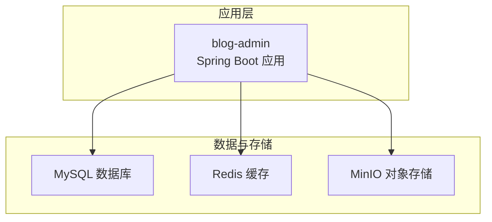
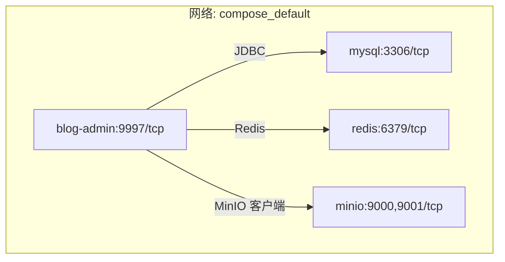
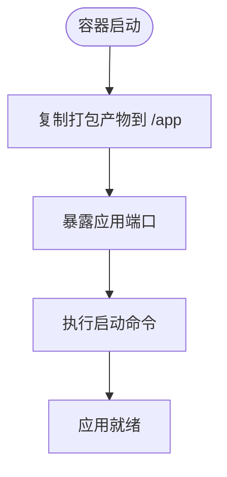
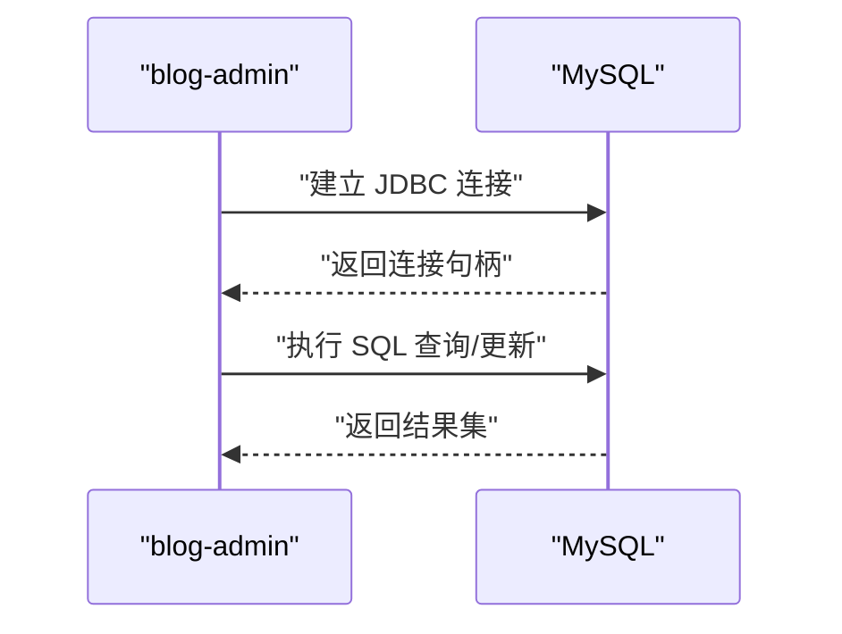
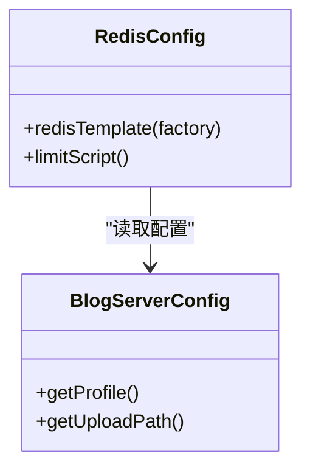
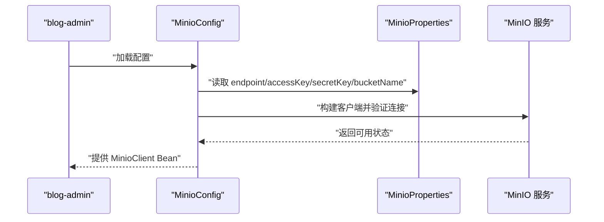
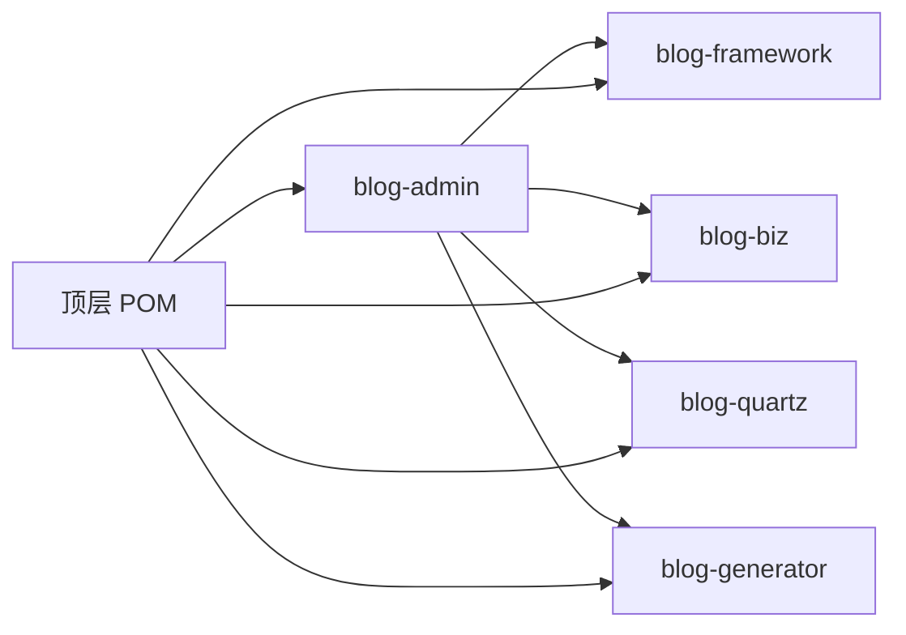

# Docker Compose编排

<cite>
**本文引用的文件**
- [blog-admin/Dockerfile](file://blog-admin/Dockerfile)
- [blog-admin/src/main/resources/application.yml](file://blog-admin/src/main/resources/application.yml)
- [blog-admin/src/main/resources/application-druid.yml](file://blog-admin/src/main/resources/application-druid.yml)
- [blog-common/src/main/java/blog/common/config/minio/MinioConfig.java](file://blog-common/src/main/java/blog/common/config/minio/MinioConfig.java)
- [blog-common/src/main/java/blog/common/config/minio/MinioProperties.java](file://blog-common/src/main/java/blog/common/config/minio/MinioProperties.java)
- [blog-framework/src/main/java/blog/framework/config/RedisConfig.java](file://blog-framework/src/main/java/blog/framework/config/RedisConfig.java)
- [blog-common/src/main/java/blog/common/config/BlogServerConfig.java](file://blog-common/src/main/java/blog/common/config/BlogServerConfig.java)
- [pom.xml](file://pom.xml)
- [blog-admin/pom.xml](file://blog-admin/pom.xml)
</cite>

## 目录
1. [简介](#简介)
2. [项目结构](#项目结构)
3. [核心组件](#核心组件)
4. [架构总览](#架构总览)
5. [详细组件分析](#详细组件分析)
6. [依赖分析](#依赖分析)
7. [性能考虑](#性能考虑)
8. [故障排查指南](#故障排查指南)
9. [结论](#结论)
10. [附录](#附录)

## 简介
本指南面向希望使用 Docker Compose 编排多容器应用的读者，围绕 blog-admin 应用容器、数据库容器、Redis 缓存容器、MinIO 存储容器之间的服务依赖与通信配置展开，系统讲解 Compose 文件的服务定义规范（服务名、镜像来源、端口映射、环境变量、卷挂载等），网络配置策略（自定义网络、容器间通信、DNS 解析），以及数据持久化方案（卷挂载、备份与恢复）。同时提供服务发现、负载均衡、故障转移等高级编排能力的实现思路与最佳实践。

## 项目结构
本仓库为多模块 Maven 工程，blog-admin 作为 Spring Boot Web 入口模块，负责对外提供 API 与静态资源服务；其运行依赖数据库（MySQL）、缓存（Redis）与对象存储（MinIO）。下图展示与 Compose 编排直接相关的模块与外部依赖关系：

图表来源
- [blog-admin/pom.xml:18-62](file://blog-admin/pom.xml#L18-L62)
- [pom.xml:225-233](file://pom.xml#L225-L233)

章节来源
- [pom.xml:225-233](file://pom.xml#L225-L233)
- [blog-admin/pom.xml:18-62](file://blog-admin/pom.xml#L18-L62)

## 核心组件
- blog-admin：对外提供 HTTP 服务，监听端口由配置决定；依赖 MySQL、Redis、MinIO。
- MySQL：持久化业务数据，通过 JDBC 连接池访问。
- Redis：缓存与会话存储，提供高性能读写。
- MinIO：对象存储，用于文件上传与访问。

章节来源
- [blog-admin/src/main/resources/application.yml:13-28](file://blog-admin/src/main/resources/application.yml#L13-L28)
- [blog-admin/src/main/resources/application.yml:65-88](file://blog-admin/src/main/resources/application.yml#L65-L88)
- [blog-admin/src/main/resources/application.yml:155-161](file://blog-admin/src/main/resources/application.yml#L155-L161)
- [blog-admin/src/main/resources/application-druid.yml:8-18](file://blog-admin/src/main/resources/application-druid.yml#L8-L18)

## 架构总览
下图给出基于 Compose 的典型编排架构：应用容器通过自定义网络与其他服务容器通信；应用容器暴露对外端口；数据持久化通过命名卷或主机挂载实现。

图表来源
- [blog-admin/src/main/resources/application.yml:13-28](file://blog-admin/src/main/resources/application.yml#L13-L28)
- [blog-admin/src/main/resources/application.yml:65-88](file://blog-admin/src/main/resources/application.yml#L65-L88)
- [blog-admin/src/main/resources/application.yml:155-161](file://blog-admin/src/main/resources/application.yml#L155-L161)
- [blog-admin/src/main/resources/application-druid.yml:8-18](file://blog-admin/src/main/resources/application-druid.yml#L8-L18)

## 详细组件分析

### 应用容器（blog-admin）
- 基础镜像与构建产物：基于官方 JDK 镜像，工作目录为 /app，暴露应用端口，启动命令为 java -jar 运行打包产物。
- 端口与访问：应用监听端口由配置文件指定；对外可通过宿主机端口映射访问。
- 依赖声明：依赖 MySQL、Redis、MinIO 三类外部服务。

图表来源
- [blog-admin/Dockerfile:1-15](file://blog-admin/Dockerfile#L1-L15)

章节来源
- [blog-admin/Dockerfile:1-15](file://blog-admin/Dockerfile#L1-L15)
- [blog-admin/src/main/resources/application.yml:13-28](file://blog-admin/src/main/resources/application.yml#L13-L28)

### 数据库容器（MySQL）
- 连接配置：应用通过 JDBC URL 指定主机、端口、数据库名、字符集与时区等参数。
- 连接池：使用 Druid 连接池，配置初始连接数、最大活跃数、超时等参数。
- 可视化与运维：Druid 控制台可开启并设置访问凭据。

图表来源
- [blog-admin/src/main/resources/application-druid.yml:8-18](file://blog-admin/src/main/resources/application-druid.yml#L8-L18)
- [blog-admin/src/main/resources/application-druid.yml:20-41](file://blog-admin/src/main/resources/application-druid.yml#L20-L41)

章节来源
- [blog-admin/src/main/resources/application-druid.yml:8-18](file://blog-admin/src/main/resources/application-druid.yml#L8-L18)
- [blog-admin/src/main/resources/application-druid.yml:20-41](file://blog-admin/src/main/resources/application-druid.yml#L20-L41)

### 缓存容器（Redis）
- 序列化配置：RedisTemplate 使用字符串序列化键，值采用 JSON 序列化以支持复杂对象。
- 脚本与限流：内置 Lua 脚本用于限流逻辑，便于在高并发场景下保护后端。
- 连接参数：由配置文件提供主机、端口、数据库索引、密码与超时等参数。

图表来源
- [blog-framework/src/main/java/blog/framework/config/RedisConfig.java:21-47](file://blog-framework/src/main/java/blog/framework/config/RedisConfig.java#L21-L47)
- [blog-common/src/main/java/blog/common/config/BlogServerConfig.java:68-118](file://blog-common/src/main/java/blog/common/config/BlogServerConfig.java#L68-L118)

章节来源
- [blog-framework/src/main/java/blog/framework/config/RedisConfig.java:21-47](file://blog-framework/src/main/java/blog/framework/config/RedisConfig.java#L21-L47)
- [blog-common/src/main/java/blog/common/config/BlogServerConfig.java:68-118](file://blog-common/src/main/java/blog/common/config/BlogServerConfig.java#L68-L118)

### 对象存储容器（MinIO）
- 客户端初始化：根据配置属性构建 MinioClient，并通过调用 API 验证连接与认证。
- 配置项：包含 endpoint、accessKey、secretKey、bucketName 等。
- 应用侧使用：通过 MinIO 客户端进行对象的上传、下载与管理。

图表来源
- [blog-common/src/main/java/blog/common/config/minio/MinioConfig.java:17-31](file://blog-common/src/main/java/blog/common/config/minio/MinioConfig.java#L17-L31)
- [blog-common/src/main/java/blog/common/config/minio/MinioProperties.java:11-22](file://blog-common/src/main/java/blog/common/config/minio/MinioProperties.java#L11-L22)

章节来源
- [blog-common/src/main/java/blog/common/config/minio/MinioConfig.java:17-31](file://blog-common/src/main/java/blog/common/config/minio/MinioConfig.java#L17-L31)
- [blog-common/src/main/java/blog/common/config/minio/MinioProperties.java:11-22](file://blog-common/src/main/java/blog/common/config/minio/MinioProperties.java#L11-L22)

## 依赖分析
- 模块依赖：blog-admin 依赖 framework、biz、quartz、generator 等模块；顶层 POM 统一管理版本与依赖范围。
- 外部依赖：MySQL 驱动、MyBatis/MyBatis-Plus、Redis 客户端、MinIO 客户端等。

图表来源
- [pom.xml:225-233](file://pom.xml#L225-L233)
- [blog-admin/pom.xml:39-62](file://blog-admin/pom.xml#L39-L62)

章节来源
- [pom.xml:225-233](file://pom.xml#L225-L233)
- [blog-admin/pom.xml:39-62](file://blog-admin/pom.xml#L39-L62)

## 性能考虑
- 连接池与线程模型：合理设置数据库连接池大小与超时，避免连接泄漏；Tomcat 线程池参数需结合并发量调优。
- 缓存命中率：通过合理的键设计与过期策略提升 Redis 命中率，降低数据库压力。
- 对象存储：批量上传与断点续传策略可减少网络抖动带来的影响；桶权限与跨域配置确保前端直传稳定。
- 资源隔离：为各服务容器设置 CPU/内存限制，避免资源争抢导致雪崩。

## 故障排查指南
- 数据库连接失败
  - 检查 JDBC URL 中主机、端口、数据库名、用户名与密码是否正确。
  - 确认容器网络连通性与防火墙策略。
  - 查看 Druid 控制台日志定位慢 SQL 与异常。
- Redis 连接异常
  - 核对主机、端口、数据库索引、密码与超时配置。
  - 关注连接池最大活跃数与阻塞等待时间。
- MinIO 认证失败
  - 核验 endpoint、accessKey、secretKey、bucketName 是否匹配。
  - 使用客户端 API 进行连通性测试，确认桶是否存在。
- 应用端口冲突
  - 检查宿主机端口占用情况，调整映射端口或停止冲突进程。
- 日志与监控
  - 启用应用与中间件日志输出，结合容器日志与指标监控快速定位问题。

章节来源
- [blog-admin/src/main/resources/application-druid.yml:8-18](file://blog-admin/src/main/resources/application-druid.yml#L8-L18)
- [blog-admin/src/main/resources/application.yml:65-88](file://blog-admin/src/main/resources/application.yml#L65-L88)
- [blog-common/src/main/java/blog/common/config/minio/MinioConfig.java:17-31](file://blog-common/src/main/java/blog/common/config/minio/MinioConfig.java#L17-L31)

## 结论
通过 Compose 对 blog-admin、MySQL、Redis、MinIO 进行统一编排，可以实现清晰的服务边界、稳定的依赖关系与可扩展的运维能力。建议在生产环境中进一步完善网络隔离、健康检查、自动重启策略、备份与恢复机制，并结合监控告警体系持续优化整体稳定性与性能。

## 附录

### Compose 服务定义规范（要点）
- 服务名称：建议使用语义化名称，如 blog-admin、db、cache、storage。
- 镜像来源：优先使用官方镜像或可信私有仓库镜像，明确标签版本。
- 端口映射：将容器内部端口映射到宿主机端口，注意避免冲突。
- 环境变量：通过 env 或 env_file 注入数据库连接串、Redis 地址、MinIO 凭证等。
- 卷挂载：使用命名卷或主机挂载实现数据持久化，区分日志、配置与数据目录。
- 健康检查：为数据库、缓存、存储添加健康检查，确保依赖可用后再启动应用。
- 网络策略：使用自定义网络隔离服务，启用 DNS 解析，避免硬编码 IP。

### 网络配置策略
- 自定义网络：创建独立网络，使服务容器通过服务名互相发现与通信。
- DNS 解析：容器间通过服务名访问，无需硬编码 IP；可在 Compose 中设置额外 hosts。
- 端口策略：仅暴露必要端口给外部，内部服务间通过网络互通。

### 数据持久化方案
- 卷挂载：为数据库与 MinIO 创建命名卷，避免容器删除导致数据丢失。
- 备份策略：定期导出数据库快照，归档 MinIO 对象；可结合定时任务自动化。
- 恢复流程：停止应用容器，恢复数据库与对象存储数据，再启动应用并验证。

### 高级编排功能
- 服务发现：利用容器网络与 DNS，服务通过服务名自动发现。
- 负载均衡：在网关或反向代理层实现请求分发；应用层可结合 Redis 实现会话共享。
- 故障转移：为关键服务配置副本与健康检查，结合自动重启策略提升可用性。