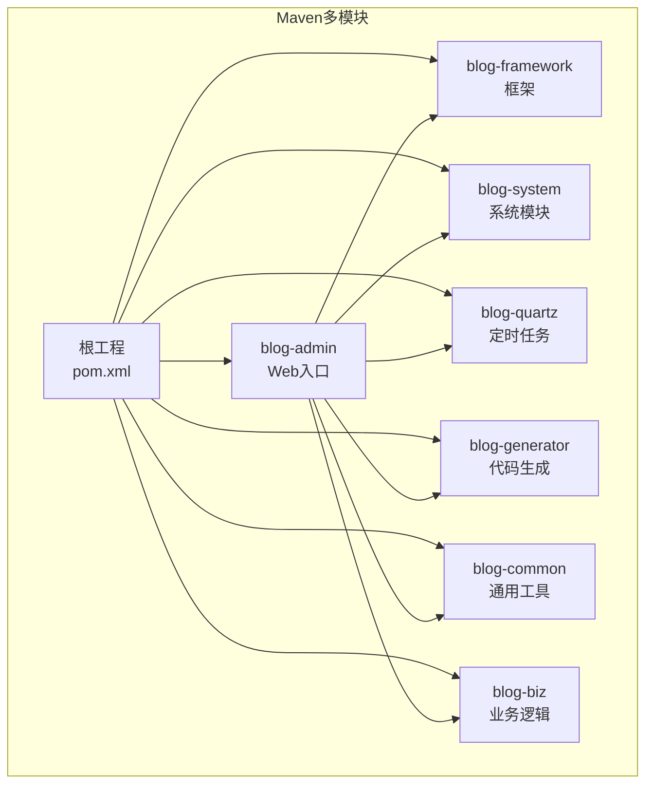
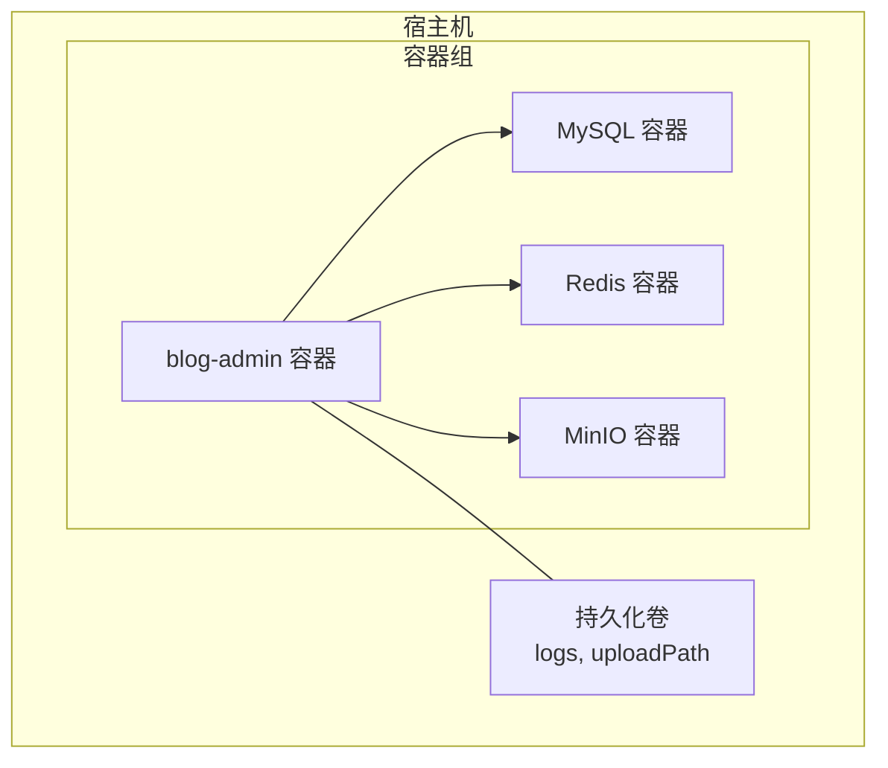
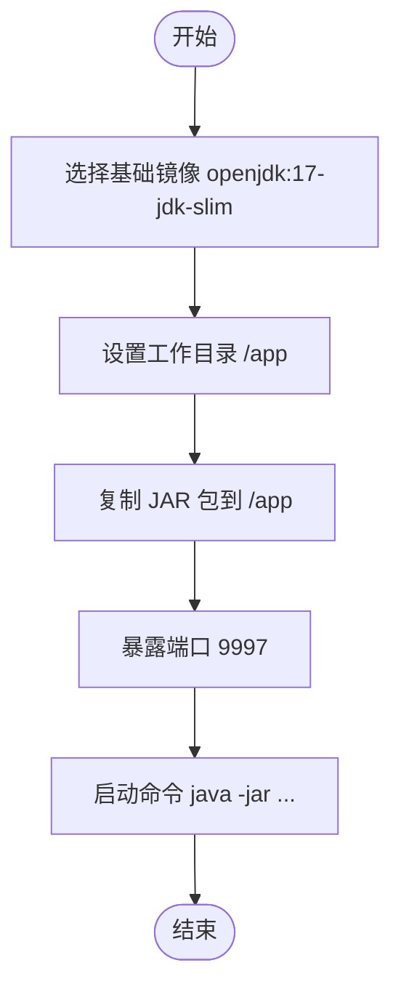
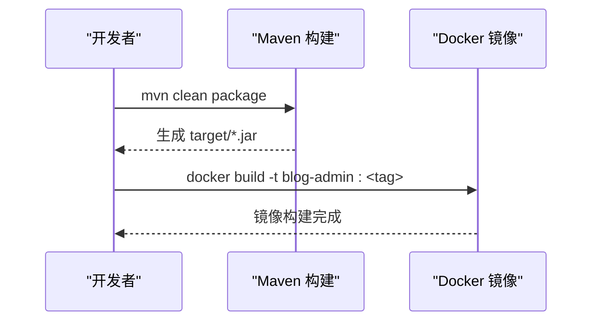
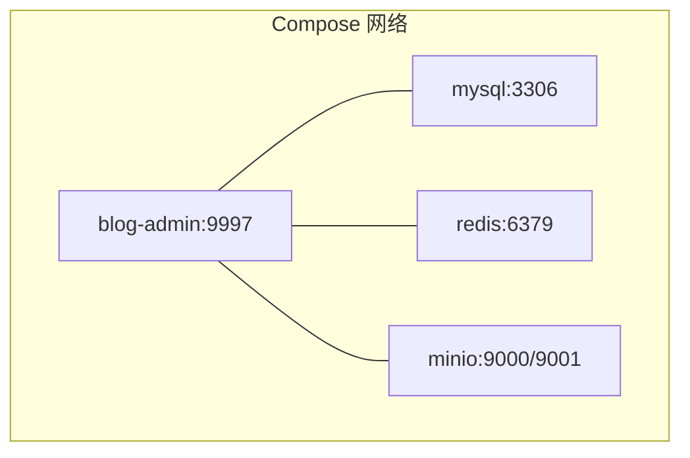
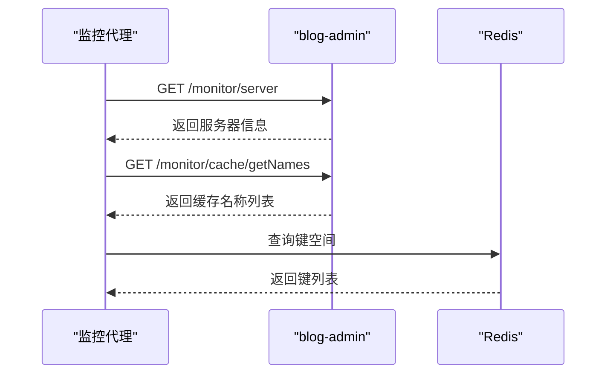
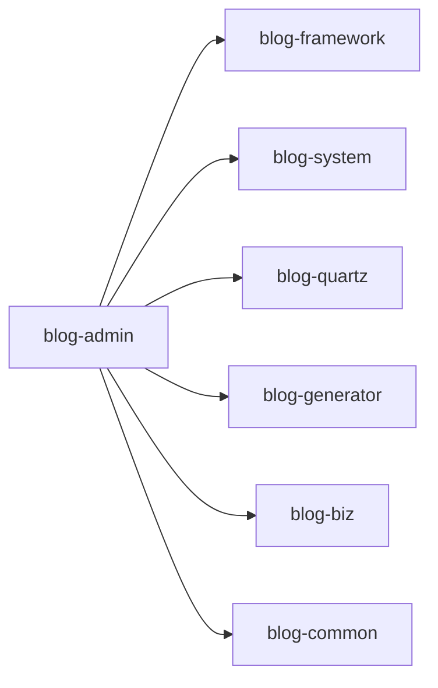
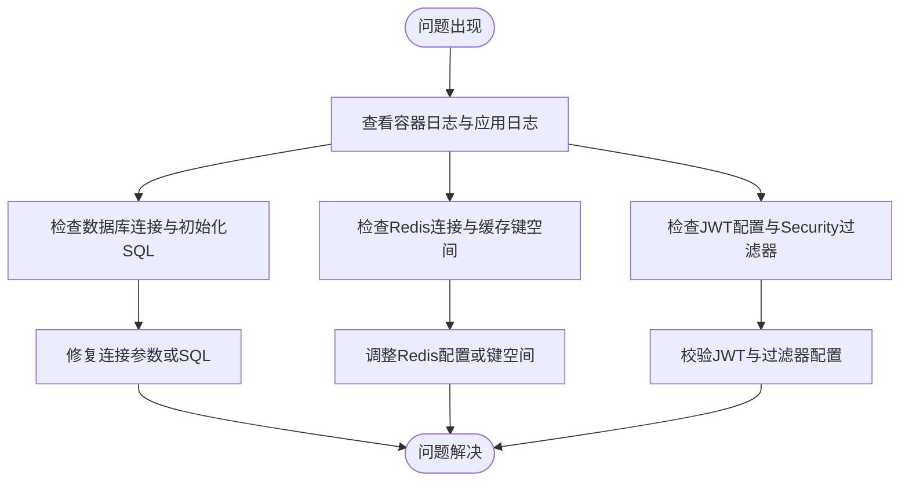

# Docker容器化部署

<cite>
**本文引用的文件**
- [Dockerfile](file://blog-admin/Dockerfile)
- [blog-admin/pom.xml](file://blog-admin/pom.xml)
- [根工程/pom.xml](file://pom.xml)
- [application.yml](file://blog-admin/src/main/resources/application.yml)
- [application-druid.yml](file://blog-admin/src/main/resources/application-druid.yml)
- [logback.xml](file://blog-admin/src/main/resources/logback.xml)
- [BlogServerConfig.java](file://blog-common/src/main/java/blog/common/config/BlogServerConfig.java)
- [SpringUtils.java](file://blog-common/src/main/java/blog/common/utils/spring/SpringUtils.java)
- [ServerController.java](file://blog-admin/src/main/java/blog/web/controller/monitor/ServerController.java)
- [CacheController.java](file://blog-admin/src/main/java/blog/web/controller/monitor/CacheController.java)
- [SecurityConfig.java](file://session-ses_2bcc.md)
- [ry-vue-owner.sql](file://ry-vue-owner.sql)
</cite>

## 目录
1. [简介](#简介)
2. [项目结构](#项目结构)
3. [核心组件](#核心组件)
4. [架构总览](#架构总览)
5. [详细组件分析](#详细组件分析)
6. [依赖分析](#依赖分析)
7. [性能考虑](#性能考虑)
8. [故障排查指南](#故障排查指南)
9. [结论](#结论)
10. [附录](#附录)

## 简介
本指南围绕基于Spring Boot的博客系统（blog-admin）提供完整的Docker容器化部署方案，涵盖Dockerfile编写规范与最佳实践、Maven构建与镜像构建流程、Docker Compose编排、容器运行参数配置、监控与日志管理、以及生产环境部署最佳实践。文档以仓库现有配置为基础，结合代码注释与配置文件，帮助读者快速落地安全、稳定、可观测的容器化部署。

## 项目结构
- 采用多模块Maven工程组织，blog-admin为Web服务入口模块，负责对外提供REST API与静态资源服务。
- blog-admin模块包含Dockerfile与Maven构建配置，用于生成可运行的可执行JAR包并打包进容器镜像。
- 应用通过application.yml与application-druid.yml进行运行时配置，日志由logback.xml集中管理。
- 项目提供数据库脚本ry-vue-owner.sql，便于初始化数据库。

**图表来源**
- [根工程/pom.xml:225-233](file://pom.xml#L225-L233)
- [blog-admin/pom.xml:18-62](file://blog-admin/pom.xml#L18-L62)

**章节来源**
- [根工程/pom.xml:225-233](file://pom.xml#L225-L233)
- [blog-admin/pom.xml:18-62](file://blog-admin/pom.xml#L18-L62)

## 核心组件
- Web服务入口：blog-admin模块，提供REST API、Swagger文档、文件上传、Redis缓存、MySQL连接等能力。
- 配置中心：application.yml集中管理端口、Tomcat线程池、日志级别、文件上传大小、Redis连接、MinIO对象存储等。
- 日志系统：logback.xml定义控制台输出与滚动文件输出，按级别分离info与error日志。
- 基础设施：application-druid.yml定义Druid数据源连接池参数；数据库脚本ry-vue-owner.sql提供初始化数据。
- 运行时配置读取：BlogServerConfig与SpringUtils提供配置读取与环境切换能力。

**章节来源**
- [application.yml:1-161](file://blog-admin/src/main/resources/application.yml#L1-L161)
- [application-druid.yml:1-34](file://blog-admin/src/main/resources/application-druid.yml#L1-L34)
- [logback.xml:1-93](file://blog-admin/src/main/resources/logback.xml#L1-L93)
- [BlogServerConfig.java:1-69](file://blog-common/src/main/java/blog/common/config/BlogServerConfig.java#L1-L69)
- [SpringUtils.java:113-146](file://blog-common/src/main/java/blog/common/utils/spring/SpringUtils.java#L113-L146)

## 架构总览
容器化部署将blog-admin服务封装为独立镜像，通过Docker Compose编排数据库（MySQL）、缓存（Redis）与对象存储（MinIO）等依赖服务，形成可一键拉起的完整运行环境。应用通过环境变量与挂载卷实现配置与持久化数据解耦。

[本图为概念性架构示意，不直接映射具体源文件，故无图表来源]

## 详细组件分析

### Dockerfile编写规范与最佳实践
- 基础镜像选择：使用openjdk:17-jdk-slim，兼顾体积与运行时稳定性。
- 工作目录：设置WORKDIR为/app，保证文件复制与运行的一致性。
- 文件复制策略：使用COPY将Maven构建产物target/blog-admin.jar复制到容器内。
- 端口暴露：EXPOSE 9997，与application.yml中server.port保持一致。
- 启动命令：CMD使用java -jar启动应用，注意与最终JAR文件名一致（当前Dockerfile与Maven最终名存在差异，建议统一）。
- 最佳实践建议：
  - 使用多阶段构建减少镜像体积（见“多阶段构建优化”）。
  - 明确非root用户运行，提升安全性。
  - 设置HEALTHCHECK，结合应用内部健康端点。
  - 使用只读根文件系统与最小权限挂载。

**图表来源**
- [Dockerfile:1-15](file://blog-admin/Dockerfile#L1-L15)

**章节来源**
- [Dockerfile:1-15](file://blog-admin/Dockerfile#L1-L15)

### Maven构建与镜像构建流程
- Maven插件：
  - spring-boot-maven-plugin：打包可执行JAR，支持repackage目标。
  - maven-war-plugin：配置warName与跳过缺失web.xml校验。
  - 根工程统一管理spring-boot版本与编译插件。
- 打包产物命名：根工程与子模块均通过<finalName>或${project.artifactId}控制最终JAR/WAR名，需与Dockerfile中的COPY与CMD保持一致。
- 镜像标签管理：
  - 建议采用语义化版本（v1.0.0、v1.0.1）与时间戳组合（v1.0.1-20251201）。
  - 使用CI/CD流水线自动打标签并推送至镜像仓库。
- 多阶段构建优化：
  - 第一阶段：使用full JDK构建，生成可执行JAR。
  - 第二阶段：使用slim JDK或distroless，仅拷贝运行时依赖，显著减小镜像体积。
  - 可结合maven-jar-plugin与spring-boot插件的classifier，实现多阶段产物管理。

**图表来源**
- [blog-admin/pom.xml:64-92](file://blog-admin/pom.xml#L64-L92)
- [根工程/pom.xml:236-255](file://pom.xml#L236-L255)

**章节来源**
- [blog-admin/pom.xml:64-92](file://blog-admin/pom.xml#L64-L92)
- [根工程/pom.xml:236-255](file://pom.xml#L236-L255)

### Docker Compose编排方案
- 服务定义：
  - blog-admin：基于本地Dockerfile构建或直接拉取镜像；映射端口9997；挂载日志与上传目录；设置环境变量覆盖数据库、Redis、MinIO等连接参数。
  - mysql：初始化数据库脚本ry-vue-owner.sql；设置root密码与字符集；持久化数据卷。
  - redis：无密码或设置密码；持久化RDB/AOF（可选）。
  - minio：初始化桶blog-bucket；暴露端口9000/9001；持久化数据卷。
- 网络配置：使用自定义bridge网络，服务间通过服务名互通。
- 卷挂载：logs、uploadPath、mysql-data、minio-data分别挂载到宿主机指定路径。
- 环境变量传递：通过.env文件或compose文件的environment字段传入敏感配置，避免硬编码。

[本图为概念性编排示意，不直接映射具体源文件，故无图表来源]

### 容器运行参数配置
- 内存限制：通过--memory限制JVM堆内存，结合-Dspring.profiles.active与-Dserver.port等JVM参数。
- CPU配额：使用--cpus或compose的deploy.resources.limits.cpus控制CPU占用。
- 健康检查：在Dockerfile中添加HEALTHCHECK，或在compose中配置healthcheck，探测应用健康端点。
- 日志输出：容器标准输出接入日志收集系统（如Fluentd/Logstash），同时保留本地滚动日志。

**章节来源**
- [application.yml:13-28](file://blog-admin/src/main/resources/application.yml#L13-L28)
- [logback.xml:1-93](file://blog-admin/src/main/resources/logback.xml#L1-L93)

### 容器监控与日志管理
- 应用内监控：
  - 服务器监控：ServerController提供系统信息采集接口，可用于容器内健康检查或外部监控。
  - 缓存监控：CacheController提供Redis键空间查询与值读取，便于排查缓存问题。
- 日志管理：
  - logback.xml定义info/error分离与按天滚动，建议将日志目录映射到宿主机卷，便于集中收集。
  - application.yml中logging.level控制日志级别，生产环境建议调整为warn/info。
- 外部监控：
  - 结合Prometheus/Grafana或APM工具采集应用指标与链路追踪。

**图表来源**
- [ServerController.java:15-25](file://blog-admin/src/main/java/blog/web/controller/monitor/ServerController.java#L15-L25)
- [CacheController.java:74-93](file://blog-admin/src/main/java/blog/web/controller/monitor/CacheController.java#L74-L93)

**章节来源**
- [ServerController.java:15-25](file://blog-admin/src/main/java/blog/web/controller/monitor/ServerController.java#L15-L25)
- [CacheController.java:74-93](file://blog-admin/src/main/java/blog/web/controller/monitor/CacheController.java#L74-L93)
- [logback.xml:1-93](file://blog-admin/src/main/resources/logback.xml#L1-L93)

### 生产环境部署最佳实践
- 安全加固：
  - 使用非root用户运行容器；启用只读根文件系统；最小权限挂载。
  - 敏感配置通过环境变量或Kubernetes Secret注入；避免写入Dockerfile或镜像层。
- 配置管理：
  - 通过spring.profiles.active切换环境；使用application-{env}.yml分环境配置。
  - BlogServerConfig与SpringUtils提供统一配置读取，便于动态切换。
- 性能优化：
  - 合理设置Tomcat线程池（accept-count、max、min-spare）与JVM参数。
  - 使用多阶段构建减小镜像体积，缩短拉取时间。
- 可观测性：
  - 配置HEALTHCHECK与应用内健康端点；集成日志、指标与追踪。
  - 使用Compose或Kubernetes进行滚动升级与回滚。

**章节来源**
- [application.yml:13-28](file://blog-admin/src/main/resources/application.yml#L13-L28)
- [BlogServerConfig.java:1-69](file://blog-common/src/main/java/blog/common/config/BlogServerConfig.java#L1-L69)
- [SpringUtils.java:113-146](file://blog-common/src/main/java/blog/common/utils/spring/SpringUtils.java#L113-L146)

## 依赖分析
- 模块依赖：blog-admin依赖framework、system、quartz、generator、biz、common等模块，最终打包为可执行JAR。
- 运行时依赖：MySQL驱动、Druid连接池、Redis客户端、MinIO SDK、MyBatis-Plus、SpringDoc OpenAPI等。
- Maven插件：spring-boot-maven-plugin负责repackage；maven-war-plugin用于WAR场景（当前以JAR为主）。

**图表来源**
- [blog-admin/pom.xml:39-61](file://blog-admin/pom.xml#L39-L61)

**章节来源**
- [blog-admin/pom.xml:39-61](file://blog-admin/pom.xml#L39-L61)
- [根工程/pom.xml:41-223](file://pom.xml#L41-L223)

## 性能考虑
- JVM与线程池：
  - application.yml中server.tomcat配置了accept-count、max、min-spare等参数，建议根据并发量与CPU核数调优。
  - 结合容器CPU配额与内存限制，避免资源争抢导致抖动。
- 数据库连接池：
  - application-druid.yml配置了initialSize、minIdle、maxActive、maxWait等参数，建议与容器规模与数据库承载能力匹配。
- 缓存与对象存储：
  - Redis连接池大小与超时参数需与应用并发相匹配；MinIO桶与对象生命周期策略影响成本与性能。
- 镜像体积：
  - 多阶段构建可显著降低镜像体积，缩短拉取与启动时间。

**章节来源**
- [application.yml:13-28](file://blog-admin/src/main/resources/application.yml#L13-L28)
- [application-druid.yml:19-34](file://blog-admin/src/main/resources/application-druid.yml#L19-L34)

## 故障排查指南
- 启动失败：
  - 检查Dockerfile与Maven最终产物名是否一致；确认端口未被占用；查看容器日志（/home/blog/logs）。
- 数据库连接：
  - 确认MySQL服务可达、账号密码正确；检查application.yml中spring.datasource.url与Druid参数。
- 缓存异常：
  - 通过CacheController列出缓存名称与键空间，定位缓存问题；检查Redis连接参数与密码。
- 登录鉴权：
  - 参考登录流程文档，确认JWT密钥、过期时间与Redis存储结构；检查SecurityConfig的过滤器链配置。
- 数据初始化：
  - 使用ry-vue-owner.sql初始化数据库，确保表结构与数据一致。

**图表来源**
- [logback.xml:1-93](file://blog-admin/src/main/resources/logback.xml#L1-L93)
- [application.yml:64-89](file://blog-admin/src/main/resources/application.yml#L64-L89)
- [application-druid.yml:1-34](file://blog-admin/src/main/resources/application-druid.yml#L1-L34)
- [ry-vue-owner.sql:1-1349](file://ry-vue-owner.sql#L1-L1349)

**章节来源**
- [logback.xml:1-93](file://blog-admin/src/main/resources/logback.xml#L1-L93)
- [application.yml:64-89](file://blog-admin/src/main/resources/application.yml#L64-L89)
- [application-druid.yml:1-34](file://blog-admin/src/main/resources/application-druid.yml#L1-L34)
- [ry-vue-owner.sql:1-1349](file://ry-vue-owner.sql#L1-L1349)

## 结论
通过遵循本文档的Dockerfile编写规范、Maven构建与镜像管理、Docker Compose编排、运行参数配置、监控与日志管理以及生产最佳实践，可以高效、安全地将博客系统容器化部署。建议在CI/CD流水线中自动化上述流程，并结合外部监控与日志平台，持续提升系统的稳定性与可维护性。

## 附录
- 关键配置参考：
  - 端口与Tomcat线程池：application.yml
  - 数据源与Druid参数：application-druid.yml
  - 日志输出与级别：logback.xml
  - 运行时配置读取：BlogServerConfig、SpringUtils
  - 登录与鉴权流程：SecurityConfig（参考文档）
  - 数据库初始化：ry-vue-owner.sql

**章节来源**
- [application.yml:1-161](file://blog-admin/src/main/resources/application.yml#L1-L161)
- [application-druid.yml:1-34](file://blog-admin/src/main/resources/application-druid.yml#L1-L34)
- [logback.xml:1-93](file://blog-admin/src/main/resources/logback.xml#L1-L93)
- [BlogServerConfig.java:1-69](file://blog-common/src/main/java/blog/common/config/BlogServerConfig.java#L1-L69)
- [SpringUtils.java:113-146](file://blog-common/src/main/java/blog/common/utils/spring/SpringUtils.java#L113-L146)
- [SecurityConfig.java:31-50](file://session-ses_2bcc.md#L31-L50)
- [ry-vue-owner.sql:1-1349](file://ry-vue-owner.sql#L1-L1349)