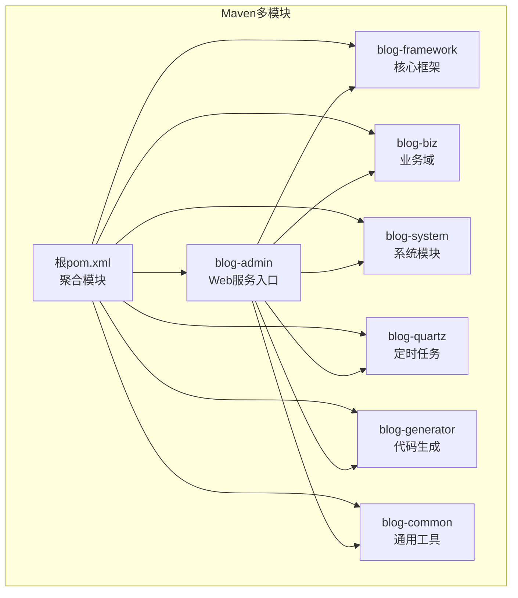
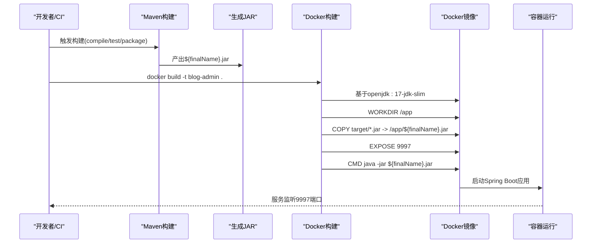
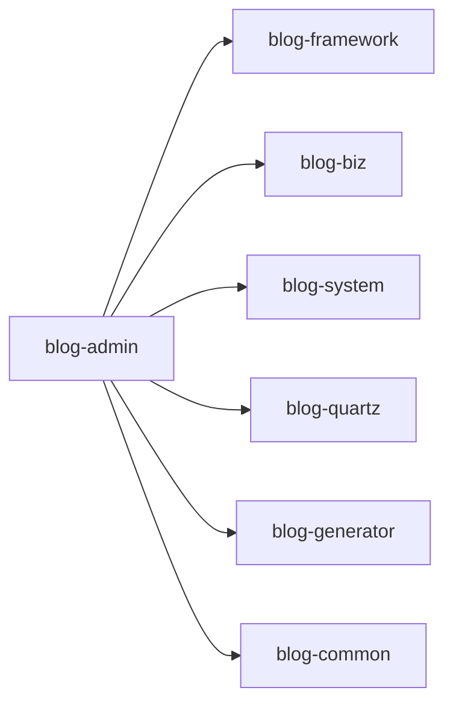

# Docker镜像构建

<cite>
**本文引用的文件**
- [Dockerfile](file://blog-admin/Dockerfile)
- [blog-admin/pom.xml](file://blog-admin/pom.xml)
- [根pom.xml](file://pom.xml)
- [application.yml](file://blog-admin/src/main/resources/application.yml)
- [BlogServerApplication.java](file://blog-admin/src/main/java/blog/BlogServerApplication.java)
- [ry-vue-owner.sql](file://ry-vue-owner.sql)
</cite>

## 目录
1. [简介](#简介)
2. [项目结构](#项目结构)
3. [核心组件](#核心组件)
4. [架构总览](#架构总览)
5. [详细组件分析](#详细组件分析)
6. [依赖关系分析](#依赖关系分析)
7. [性能考量](#性能考量)
8. [故障排查指南](#故障排查指南)
9. [结论](#结论)
10. [附录](#附录)

## 简介
本指南面向需要为该Spring Boot后端服务构建Docker镜像的开发者，系统性讲解Dockerfile编写规范、基础镜像选择(openjdk:17-jdk-slim)的原因与优势、WORKDIR设置、文件复制策略、端口暴露配置等关键指令，并结合Maven构建流程说明JAR打包细节（含pom.xml中的构建配置、打包目标、输出文件命名）。同时提供多阶段构建优化策略（构建阶段与运行阶段分离、镜像体积优化、安全考虑）以及镜像构建命令示例与常见问题解决方案，帮助你构建高质量的Docker镜像。

## 项目结构
该仓库采用多模块Maven工程组织，blog-admin为Web服务入口模块，负责对外提供REST API与管理功能；其他模块如blog-framework、blog-biz、blog-system等为业务与框架支撑模块。Docker镜像构建围绕blog-admin模块进行，最终产物是一个可直接运行的Spring Boot可执行JAR。

图表来源
- [根pom.xml:225-233](file://pom.xml#L225-L233)
- [blog-admin/pom.xml:39-61](file://blog-admin/pom.xml#L39-L61)

章节来源
- [根pom.xml:225-233](file://pom.xml#L225-L233)
- [blog-admin/pom.xml:1-94](file://blog-admin/pom.xml#L1-L94)

## 核心组件
- 基础镜像：openjdk:17-jdk-slim
  - 优点：体积小、包含JDK与运行时、适合生产环境；Java版本与项目一致（Java 17）。
- 工作目录：/app
  - 统一的容器内工作空间，便于复制与运行。
- 复制策略：将构建产物JAR复制到容器内
  - 目标路径固定，便于后续CMD启动。
- 端口暴露：9997
  - 对应Spring Boot配置的server.port。
- CMD启动：java -jar ${finalName}.jar
  - 与Maven构建输出文件名保持一致。

章节来源
- [Dockerfile:1-15](file://blog-admin/Dockerfile#L1-L15)
- [blog-admin/pom.xml:91-92](file://blog-admin/pom.xml#L91-L92)
- [application.yml:14-15](file://blog-admin/src/main/resources/application.yml#L14-L15)

## 架构总览
下图展示从源码到Docker镜像的完整流程：Maven在本地或CI中完成编译、测试与打包，生成JAR；随后Dockerfile将JAR复制进镜像并以Spring Boot方式运行。

图表来源
- [Dockerfile:1-15](file://blog-admin/Dockerfile#L1-L15)
- [blog-admin/pom.xml:64-92](file://blog-admin/pom.xml#L64-L92)
- [application.yml:14-15](file://blog-admin/src/main/resources/application.yml#L14-L15)

## 详细组件分析

### Dockerfile指令详解
- FROM openjdk:17-jdk-slim
  - 选择原因：与项目Java版本一致，镜像精简，适合生产部署。
- WORKDIR /app
  - 设定工作目录，后续COPY/CMD均基于此路径，提升可维护性。
- COPY target/blog-admin.jar /app/blog-admin.jar
  - 将Maven打包产物复制到容器内，路径需与最终文件名一致。
- EXPOSE 9997
  - 暴露Spring Boot服务端口，便于容器编排与网络配置。
- CMD ["java", "-jar", "${finalName}.jar"]
  - 启动命令与Maven最终文件名保持一致，避免运行时找不到JAR。

章节来源
- [Dockerfile:1-15](file://blog-admin/Dockerfile#L1-L15)
- [blog-admin/pom.xml:91-92](file://blog-admin/pom.xml#L91-L92)

### Maven构建与JAR打包
- 打包目标与插件
  - spring-boot-maven-plugin：用于repackage生成可执行JAR。
  - maven-war-plugin：虽然当前模块打包为jar，但保留war插件配置以兼容未来可能的war需求。
- 最终文件名
  - 由<finalName>控制，默认使用${project.artifactId}，即blog-admin。
- 依赖与模块
  - blog-admin依赖blog-framework、blog-biz、blog-system、blog-quartz、blog-generator等模块，构建时会打包进入最终JAR。

章节来源
- [blog-admin/pom.xml:64-92](file://blog-admin/pom.xml#L64-L92)
- [根pom.xml:225-233](file://pom.xml#L225-L233)

### Spring Boot应用启动
- 主类与启动配置
  - 主类位于blog-admin模块，排除DataSource自动装配，统一通过外部配置管理数据源。
  - 启动时禁用devtools热部署，保证生产环境稳定性。
- 端口与上下文
  - application.yml中配置server.port为9997，与Docker EXPOSE一致。

章节来源
- [BlogServerApplication.java:13-18](file://blog-admin/src/main/java/blog/BlogServerApplication.java#L13-L18)
- [application.yml:14-15](file://blog-admin/src/main/resources/application.yml#L14-L15)

### 多阶段构建优化策略
- 目标
  - 在构建阶段使用完整JDK与构建工具，运行阶段仅保留JRE与运行时依赖，显著减小镜像体积。
- 实施建议
  - 阶段1（Builder）：FROM openjdk:17-jdk-slim，安装必要工具，执行mvn package生成JAR。
  - 阶段2（Runner）：FROM openjdk:17-jre-slim 或 alpine+openjdk-jre，仅复制上一步的JAR至/run，设置非root用户运行，减少攻击面。
- 安全与合规
  - 使用只读根文件系统、最小权限用户、禁用不必要的网络访问。
  - 定期更新基础镜像，关注CVE修复。
- 可观测性
  - 在Runner阶段添加健康检查与日志重定向，便于容器编排与监控。

[本节为概念性指导，不直接分析具体文件，故无“章节来源”]

### 镜像构建命令示例
- 本地构建
  - 在blog-admin目录执行docker build -t blog-admin:latest .
- 指定标签与上下文
  - docker build -t blog-admin:v1.0 -f ./Dockerfile .
- 交叉构建（如需不同平台）
  - docker buildx build --platform linux/amd64,linux/arm64 -t blog-admin:multiarch --push .

[本节为操作性指导，不直接分析具体文件，故无“章节来源”]

### 常见问题与解决方案
- CMD启动找不到JAR
  - 确认Dockerfile中COPY的目标路径与Maven最终文件名一致；检查pom.xml的<finalName>。
- 端口冲突
  - 确认宿主机未占用9997端口；或在docker run时映射到其他端口。
- 启动慢或内存不足
  - 调整JVM参数（如-Xms/-Xmx），在容器启动时通过JAVA_OPTS传入。
- 权限问题
  - Runner阶段使用非root用户运行，避免容器内权限过高带来的风险。
- 依赖缺失
  - 确保构建产物包含所有模块依赖；检查Maven多模块打包是否正确。

[本节为经验性指导，不直接分析具体文件，故无“章节来源”]

## 依赖关系分析
下图展示blog-admin模块与其子模块之间的依赖关系，有助于理解打包产物的组成与镜像体积构成。

图表来源
- [blog-admin/pom.xml:39-61](file://blog-admin/pom.xml#L39-L61)
- [根pom.xml:225-233](file://pom.xml#L225-L233)

章节来源
- [blog-admin/pom.xml:39-61](file://blog-admin/pom.xml#L39-L61)
- [根pom.xml:225-233](file://pom.xml#L225-L233)

## 性能考量
- 镜像体积
  - 使用openjdk:17-jre-slim作为运行时基础镜像，可显著降低镜像大小。
- 启动速度
  - 减少JVM初始堆大小，避免过度预热；合理设置GC参数。
- 资源限制
  - 在容器编排中设置CPU/内存限制，防止资源争用。
- 缓存策略
  - Docker层缓存：将变化频率低的步骤放在前面，如安装依赖、复制源码；将高频变更的步骤放在后面，如复制构建产物。

[本节为通用指导，不直接分析具体文件，故无“章节来源”]

## 故障排查指南
- 构建失败
  - 检查Maven插件版本与Java版本匹配；确认网络可达性与镜像仓库配置。
- 运行异常
  - 查看容器日志；确认端口映射与防火墙规则；检查环境变量与配置文件挂载。
- 数据库连接
  - 若使用外部数据库，确保连接字符串、凭据与网络连通性正确；参考SQL脚本初始化数据库结构。
- 定时任务
  - Quartz相关表结构可参考提供的SQL脚本，确保数据库初始化完成。

章节来源
- [ry-vue-owner.sql:1-200](file://ry-vue-owner.sql#L1-L200)

## 结论
通过遵循本指南，你可以：
- 正确选择与配置基础镜像与Dockerfile关键指令；
- 明确Maven打包流程与最终产物命名；
- 实施多阶段构建以优化镜像体积与安全性；
- 快速定位并解决常见的构建与运行问题。

[本节为总结性内容，不直接分析具体文件，故无“章节来源”]

## 附录

### A. Dockerfile关键指令对照
- FROM：基础镜像选择
- WORKDIR：工作目录
- COPY：复制JAR到容器
- EXPOSE：暴露端口
- CMD：启动命令

章节来源
- [Dockerfile:1-15](file://blog-admin/Dockerfile#L1-L15)

### B. Maven构建配置要点
- 插件：spring-boot-maven-plugin、maven-war-plugin
- 属性：java.version=17
- 最终文件名：<finalName>${project.artifactId}</finalName>

章节来源
- [根pom.xml:14-38](file://pom.xml#L14-L38)
- [blog-admin/pom.xml:64-92](file://blog-admin/pom.xml#L64-L92)

### C. Spring Boot端口与配置
- 端口：server.port=9997
- 上下文：context-path=/（默认）

章节来源
- [application.yml:14-18](file://blog-admin/src/main/resources/application.yml#L14-L18)