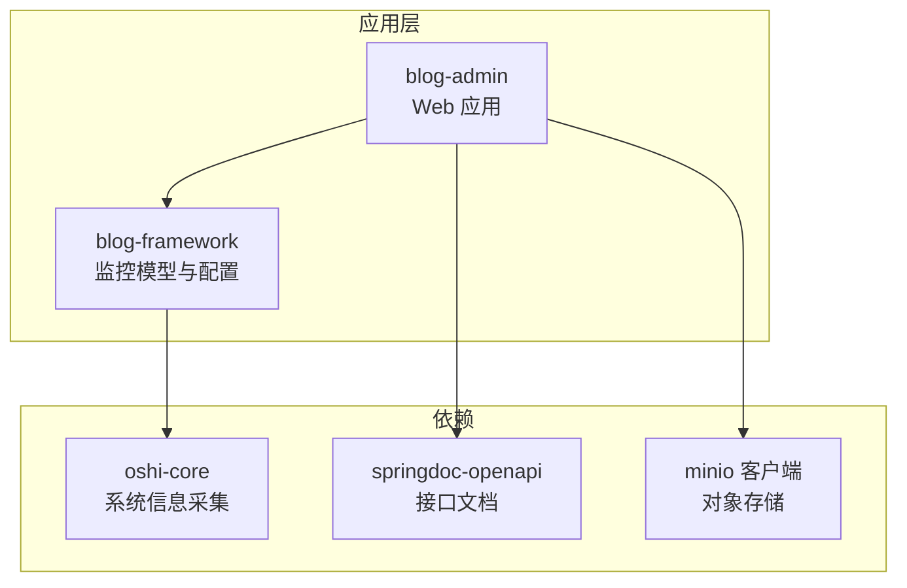
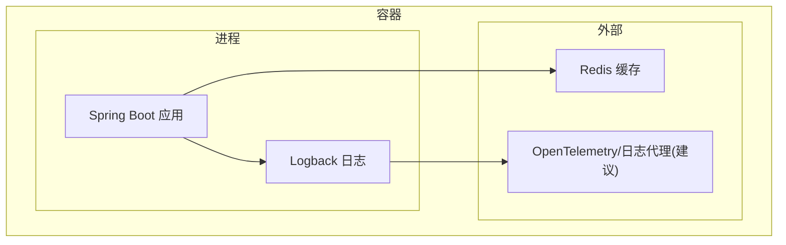
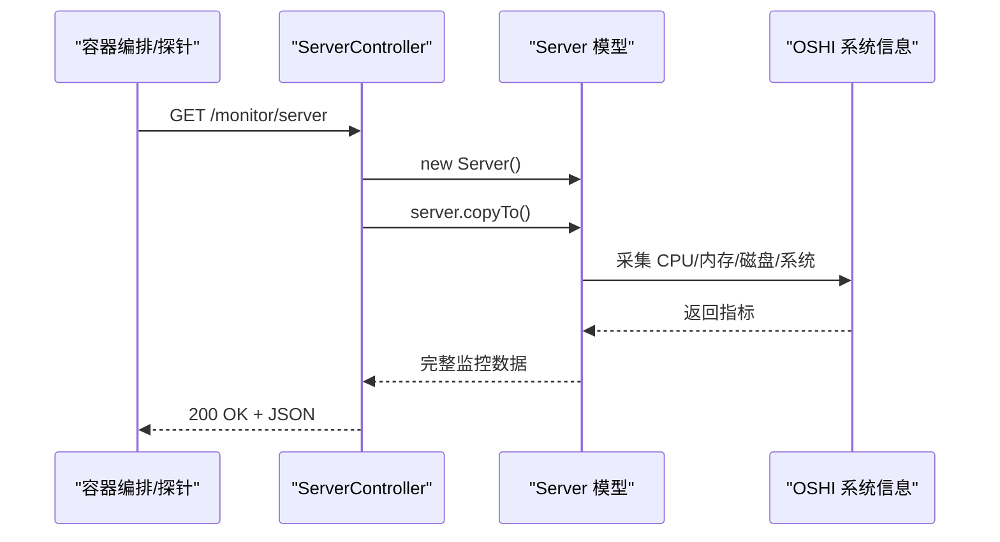
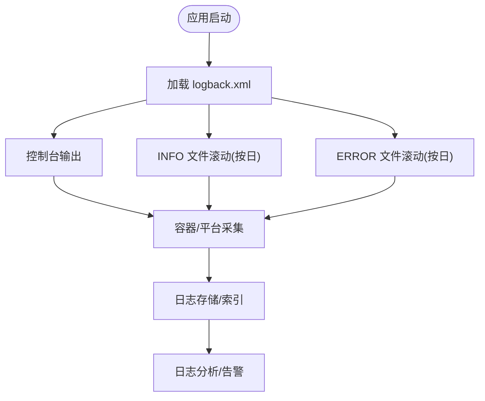
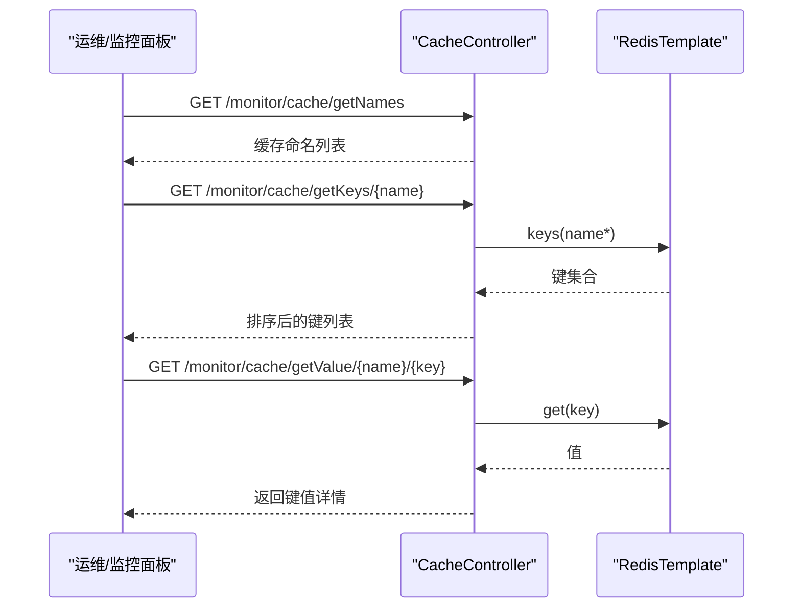
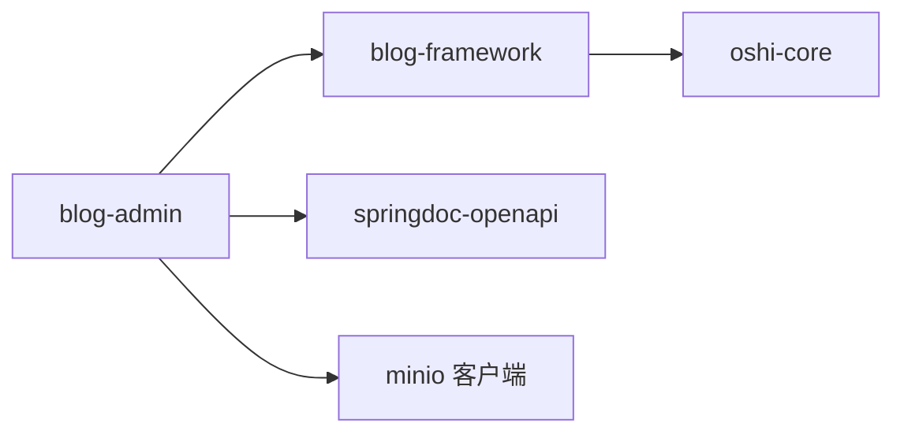
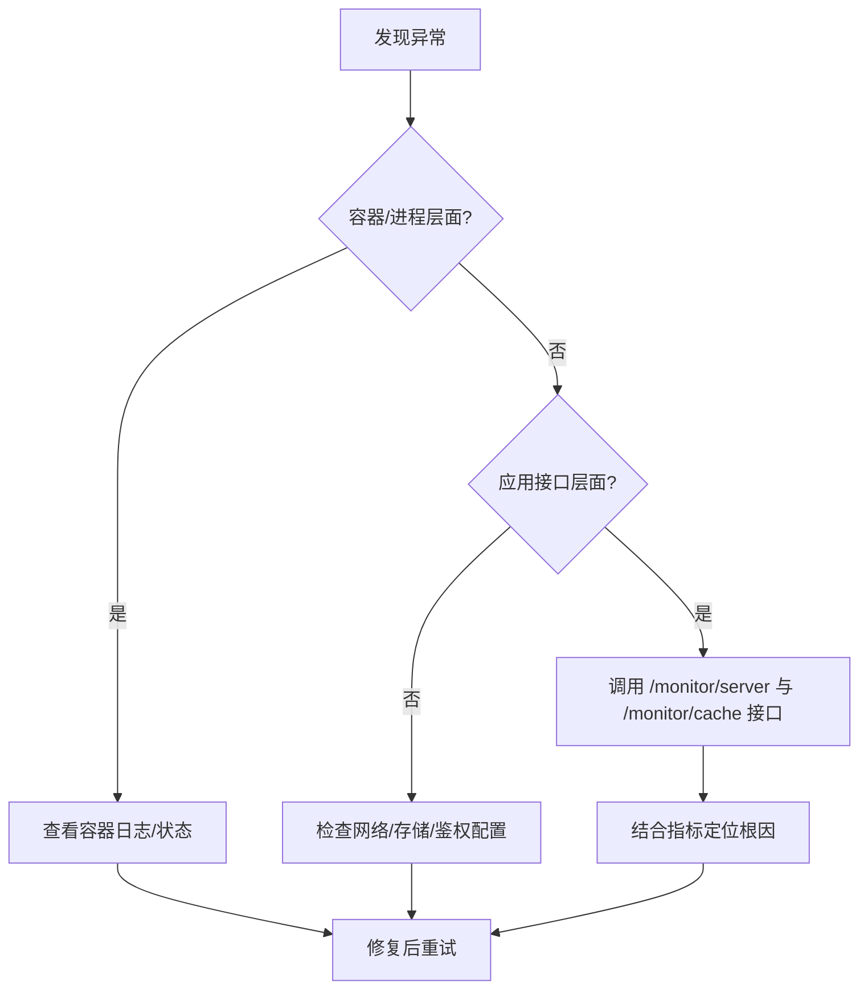

# 容器监控与维护

<cite>
**本文引用的文件**
- [Dockerfile](file://blog-admin/Dockerfile)
- [application.yml](file://blog-admin/src/main/resources/application.yml)
- [logback.xml](file://blog-admin/src/main/resources/logback.xml)
- [ServerController.java](file://blog-admin/src/main/java/blog/web/controller/monitor/ServerController.java)
- [Server.java](file://blog-framework/src/main/java/blog/framework/web/domain/Server.java)
- [Cpu.java](file://blog-framework/src/main/java/blog/framework/web/domain/server/Cpu.java)
- [Mem.java](file://blog-framework/src/main/java/blog/framework/web/domain/server/Mem.java)
- [Jvm.java](file://blog-framework/src/main/java/blog/framework/web/domain/server/Jvm.java)
- [SysFiles.java](file://blog-framework/src/main/java/blog/framework/web/domain/server/SysFiles.java)
- [CacheController.java](file://blog-admin/src/main/java/blog/web/controller/monitor/CacheController.java)
- [SecurityConfig.java](file://blog-framework/src/main/java/blog/framework/config/SecurityConfig.java)
- [pom.xml](file://pom.xml)
</cite>

## 目录
1. [简介](#简介)
2. [项目结构](#项目结构)
3. [核心组件](#核心组件)
4. [架构总览](#架构总览)
5. [组件详细分析](#组件详细分析)
6. [依赖关系分析](#依赖关系分析)
7. [性能考量](#性能考量)
8. [故障排查指南](#故障排查指南)
9. [结论](#结论)
10. [附录](#附录)

## 简介
本指南面向生产环境的容器化应用运维，围绕“容器监控与维护”主题，结合仓库中的实际代码，系统讲解容器运行状态监控、日志管理、故障排查、维护策略与安全加固，并提供可落地的最佳实践建议。内容覆盖：
- 容器健康检查与运行状态采集
- 日志输出格式、轮转与聚合思路
- 性能指标采集与分析
- 故障排查流程与定位方法
- 维护策略（镜像更新、容器重启、资源清理）
- 安全加固（镜像扫描、权限控制、网络安全）

## 项目结构
该工程采用多模块 Maven 结构，blog-admin 为 Spring Boot Web 应用，负责对外提供监控与业务接口；blog-framework 提供系统监控模型与基础设施；其他模块按领域拆分。

图表来源
- [pom.xml:225-233](file://pom.xml#L225-L233)
- [pom.xml:98-103](file://pom.xml#L98-L103)
- [pom.xml:105-110](file://pom.xml#L105-L110)
- [pom.xml:214-219](file://pom.xml#L214-L219)

章节来源
- [pom.xml:225-233](file://pom.xml#L225-L233)

## 核心组件
- 容器镜像与运行
  - 基于官方 OpenJDK 17 的精简镜像，暴露应用端口并在容器内以 JAR 方式运行。
- 监控接口与数据模型
  - 提供统一的服务器监控接口，采集 CPU、内存、JVM、系统与磁盘信息。
- 日志配置
  - 控制台与文件双通道输出，按级别与日期滚动，便于容器日志采集与分析。
- 缓存监控
  - 面向 Redis 的缓存键值查询与命令统计，辅助定位热点与异常。
- 安全配置
  - 基于 Spring Security 的无状态认证与授权，配合 JWT 过滤器链。

章节来源
- [Dockerfile:1-15](file://blog-admin/Dockerfile#L1-L15)
- [ServerController.java:18-24](file://blog-admin/src/main/java/blog/web/controller/monitor/ServerController.java#L18-L24)
- [Server.java:99-116](file://blog-framework/src/main/java/blog/framework/web/domain/Server.java#L99-L116)
- [logback.xml:1-93](file://blog-admin/src/main/resources/logback.xml#L1-L93)
- [CacheController.java:34-92](file://blog-admin/src/main/java/blog/web/controller/monitor/CacheController.java#L34-L92)
- [SecurityConfig.java:66-90](file://blog-framework/src/main/java/blog/framework/config/SecurityConfig.java#L66-L90)

## 架构总览
容器化运行时，应用通过 Dockerfile 构建镜像并运行；监控数据由 ServerController 汇总，日志由 logback 输出至容器标准输出/文件；缓存监控对接 Redis；安全通过 Spring Security 无状态过滤器链保障。

图表来源
- [Dockerfile:1-15](file://blog-admin/Dockerfile#L1-L15)
- [logback.xml:1-93](file://blog-admin/src/main/resources/logback.xml#L1-L93)
- [CacheController.java:34-92](file://blog-admin/src/main/java/blog/web/controller/monitor/CacheController.java#L34-L92)

## 组件详细分析

### 容器健康检查与运行状态监控
- 健康检查建议
  - 使用 HTTP GET 探针访问监控接口，如 /monitor/server，返回 2xx 表示就绪。
  - 可结合 /monitor/cache/getNames 或 /monitor/cache/getKeys 判断缓存可用性。
- 运行状态采集
  - CPU：逻辑核数、用户/系统/等待/空闲占比、温度。
  - 内存：总量、已用、剩余、使用率。
  - JVM：堆内存总量/最大/空闲、使用率、运行时长、启动参数。
  - 系统：主机名、IP、操作系统、架构、用户目录。
  - 磁盘：挂载点、类型、总量/剩余/使用、使用率。
- 数据来源
  - 通过 Server.copyTo() 调用 OSHI 系统信息采集，填充各子域对象。

图表来源
- [ServerController.java:18-24](file://blog-admin/src/main/java/blog/web/controller/monitor/ServerController.java#L18-L24)
- [Server.java:99-116](file://blog-framework/src/main/java/blog/framework/web/domain/Server.java#L99-L116)

章节来源
- [ServerController.java:18-24](file://blog-admin/src/main/java/blog/web/controller/monitor/ServerController.java#L18-L24)
- [Server.java:99-116](file://blog-framework/src/main/java/blog/framework/web/domain/Server.java#L99-L116)
- [Cpu.java:10-102](file://blog-framework/src/main/java/blog/framework/web/domain/server/Cpu.java#L10-L102)
- [Mem.java:10-54](file://blog-framework/src/main/java/blog/framework/web/domain/server/Mem.java#L10-L54)
- [Jvm.java:13-115](file://blog-framework/src/main/java/blog/framework/web/domain/server/Jvm.java#L13-L115)
- [SysFiles.java:8-100](file://blog-framework/src/main/java/blog/framework/web/domain/server/SysFiles.java#L8-L100)

### 日志管理方案
- 输出格式
  - 控制台与文件统一使用模式字符串，包含时间戳、线程、级别、类名方法行号、消息与换行。
- 日志轮转
  - 按日期滚动，保留 60 天；INFO 与 ERROR 分离输出，便于检索。
- 日志聚合与分析
  - 建议在容器平台启用标准输出采集；若需集中存储，可在容器侧挂载日志卷或使用 sidecar 代理转发至日志系统。
- 配置要点
  - log.path 指向容器内持久化目录或挂载卷；根据业务调整 logging.level。

图表来源
- [logback.xml:1-93](file://blog-admin/src/main/resources/logback.xml#L1-L93)

章节来源
- [logback.xml:1-93](file://blog-admin/src/main/resources/logback.xml#L1-L93)
- [application.yml:30-35](file://blog-admin/src/main/resources/application.yml#L30-L35)

### 缓存监控与维护
- 键空间与值查询
  - 支持列出缓存命名空间、按前缀查询键集合、读取具体键值，辅助定位热点与异常。
- 命令统计
  - 读取 Redis 命令统计，分析高频命令与耗时分布。
- 维护建议
  - 定期巡检键空间增长趋势；对过期键设置合理 TTL；必要时执行内存碎片整理或降级策略。

图表来源
- [CacheController.java:34-92](file://blog-admin/src/main/java/blog/web/controller/monitor/CacheController.java#L34-L92)

章节来源
- [CacheController.java:34-92](file://blog-admin/src/main/java/blog/web/controller/monitor/CacheController.java#L34-L92)

### 安全加固与网络隔离
- 认证与授权
  - 采用无状态会话策略，基于 JWT 的过滤器链完成鉴权；接口层面使用注解授权。
- 网络安全
  - 建议在容器编排中开启网络策略，仅开放必要端口；对敏感接口增加白名单与速率限制。
- 镜像与运行时
  - 使用只读根文件系统、最小权限运行；定期更新基础镜像与依赖。

章节来源
- [SecurityConfig.java:66-90](file://blog-framework/src/main/java/blog/framework/config/SecurityConfig.java#L66-L90)

## 依赖关系分析
- 模块依赖
  - blog-admin 依赖 blog-framework 提供的监控模型与配置；框架层引入 oshi-core 用于系统信息采集。
- 外部依赖
  - springdoc-openapi 提供接口文档；minio 客户端用于对象存储；druid、mybatis-plus 等用于数据访问。

图表来源
- [pom.xml:225-233](file://pom.xml#L225-L233)
- [pom.xml:98-103](file://pom.xml#L98-L103)
- [pom.xml:105-110](file://pom.xml#L105-L110)
- [pom.xml:214-219](file://pom.xml#L214-L219)

章节来源
- [pom.xml:225-233](file://pom.xml#L225-L233)
- [pom.xml:98-103](file://pom.xml#L98-L103)
- [pom.xml:105-110](file://pom.xml#L105-L110)
- [pom.xml:214-219](file://pom.xml#L214-L219)

## 性能考量
- CPU/内存/JVM/磁盘
  - 通过 Server 模型周期性采集，结合容器编排的资源限额与 HPA 自动扩缩容策略，避免资源争抢。
- 日志开销
  - INFO/ERROR 分离与按日滚动降低 IO 压力；在高吞吐场景建议异步日志或集中采集。
- 缓存命中
  - 通过 CacheController 的键空间与命令统计，识别低效访问模式并优化缓存策略。

## 故障排查指南
- 启动失败
  - 检查容器日志与容器状态；确认端口占用与配置文件加载；验证镜像与 CMD 是否一致。
- 运行时错误
  - 查看 ERROR 级日志文件与容器标准输出；结合监控接口返回的 JVM 与磁盘使用情况定位瓶颈。
- 性能问题
  - 关注 CPU 使用率、等待率与温度；检查磁盘 IO 与容量；评估 Redis 命令耗时与键空间增长。
- 缓存异常
  - 使用缓存监控接口列出键空间与读取具体键值，判断是否存在异常增长或过期策略不当。

## 结论
本指南基于现有代码实现了容器运行状态的统一采集与可视化入口，并提供了日志、缓存与安全方面的运维要点。建议在生产环境中补充容器健康检查探针、集中日志采集与分析、完善的告警机制以及持续的安全审计与镜像更新流程，以确保系统的稳定与高效。

## 附录
- 生产最佳实践清单
  - 健康检查：HTTP 探针 + 关键接口探活
  - 日志：标准输出采集 + 按日滚动 + 集中存储与检索
  - 监控：CPU/内存/JVM/磁盘/缓存指标 + 告警阈值
  - 安全：只读根文件系统 + 最小权限 + 网络策略 + 定期镜像扫描
  - 维护：灰度发布 + 自动化重启 + 清理无用镜像与日志