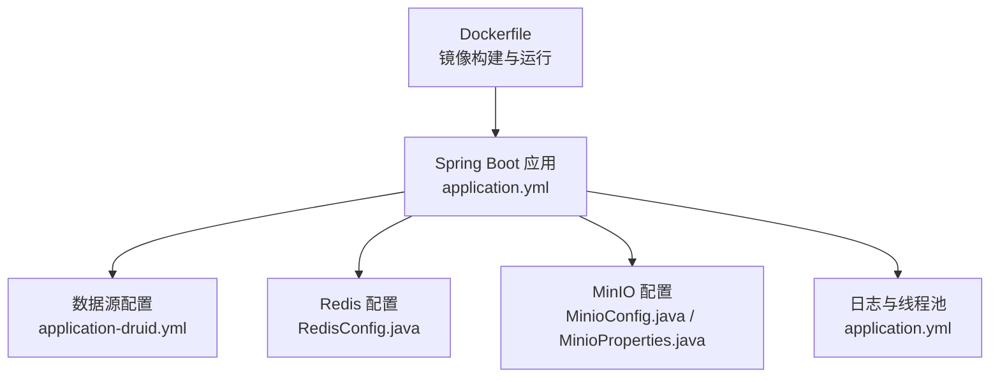
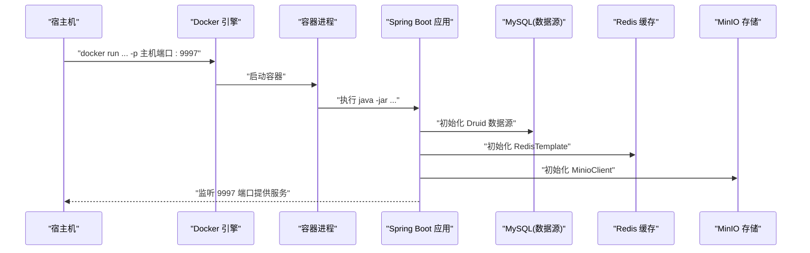
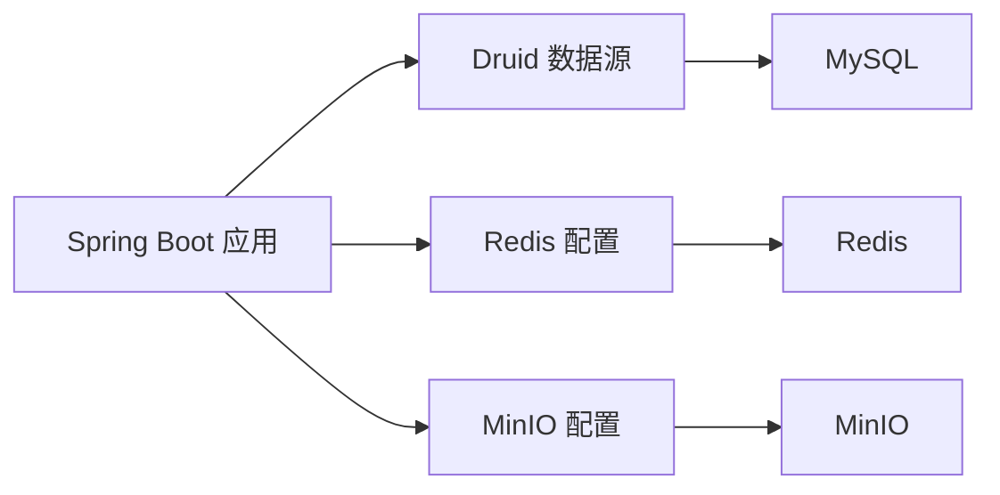

# 容器运行配置

<cite>
**本文引用的文件**
- [Dockerfile](file://blog-admin/Dockerfile)
- [application.yml](file://blog-admin/src/main/resources/application.yml)
- [application-druid.yml](file://blog-admin/src/main/resources/application-druid.yml)
- [MinioConfig.java](file://blog-common/src/main/java/blog/common/config/minio/MinioConfig.java)
- [MinioProperties.java](file://blog-common/src/main/java/blog/common/config/minio/MinioProperties.java)
- [RedisConfig.java](file://blog-framework/src/main/java/blog/framework/config/RedisConfig.java)
- [DruidConfig.java](file://blog-framework/src/main/java/blog/framework/config/DruidConfig.java)
- [pom.xml](file://blog-admin/pom.xml)
- [SpringUtils.java](file://blog-common/src/main/java/blog/common/utils/spring/SpringUtils.java)
- [BlogServerConfig.java](file://blog-common/src/main/java/blog/common/config/BlogServerConfig.java)
</cite>

## 目录
1. [简介](#简介)
2. [项目结构](#项目结构)
3. [核心组件](#核心组件)
4. [架构总览](#架构总览)
5. [详细组件分析](#详细组件分析)
6. [依赖关系分析](#依赖关系分析)
7. [性能与资源限制](#性能与资源限制)
8. [故障排查指南](#故障排查指南)
9. [结论](#结论)
10. [附录：容器运行命令与最佳实践](#附录容器运行命令与最佳实践)

## 简介
本指南面向容器化部署场景，围绕容器运行配置提供从命令编写、环境变量传递、端口映射、资源限制到健康检查与日志输出的全栈实践建议。结合仓库中的 Dockerfile、Spring Boot 配置与相关组件实现，给出可直接落地的配置清单与排障要点。

## 项目结构
- 容器镜像构建与运行由 blog-admin 模块的 Dockerfile 驱动，应用端口在配置文件中统一声明。
- Spring Boot 配置通过 application.yml 及其 profile 文件集中管理，包含数据库、Redis、MinIO、日志、Tomcat 线程池等关键参数。
- 组件层通过配置类注入与属性绑定，实现对第三方中间件的连接与校验。

图表来源
- [Dockerfile](file://blog-admin/Dockerfile)
- [application.yml](file://blog-admin/src/main/resources/application.yml)
- [application-druid.yml](file://blog-admin/src/main/resources/application-druid.yml)
- [RedisConfig.java](file://blog-framework/src/main/java/blog/framework/config/RedisConfig.java)
- [MinioConfig.java](file://blog-common/src/main/java/blog/common/config/minio/MinioConfig.java)
- [MinioProperties.java](file://blog-common/src/main/java/blog/common/config/minio/MinioProperties.java)

章节来源
- [Dockerfile](file://blog-admin/Dockerfile)
- [application.yml](file://blog-admin/src/main/resources/application.yml)

## 核心组件
- 容器镜像与运行命令
  - 基于官方 OpenJDK 基础镜像，工作目录设为 /app，拷贝打包产物，暴露端口并以 java -jar 启动。
  - CMD 中的 JAR 文件名需与构建产物一致，建议通过 Maven 插件最终名称统一管理。
- Spring Boot 运行参数与 JVM 参数
  - 通过 JVM 参数与 Spring Boot 配置共同控制内存、线程池、日志级别等。
- 环境变量与配置文件
  - Spring Profile 与属性绑定用于切换数据源、连接中间件；可通过环境变量覆盖部分属性。
- 端口与网络
  - 容器内暴露端口与应用端口一致，映射策略需避免宿主端口冲突。
- 资源与性能
  - 通过 JVM 参数与线程池配置实现内存与并发调优；容器侧可配合 CPU/内存限制与文件描述符上限进行资源约束。

章节来源
- [Dockerfile](file://blog-admin/Dockerfile)
- [application.yml](file://blog-admin/src/main/resources/application.yml)
- [application-druid.yml](file://blog-admin/src/main/resources/application-druid.yml)
- [pom.xml](file://blog-admin/pom.xml)

## 架构总览
下图展示容器运行时的关键交互：容器启动 -> Spring Boot 初始化 -> 连接数据库/Redis/MinIO -> 对外提供 HTTP 服务。

图表来源
- [Dockerfile](file://blog-admin/Dockerfile)
- [application.yml](file://blog-admin/src/main/resources/application.yml)
- [application-druid.yml](file://blog-admin/src/main/resources/application-druid.yml)
- [RedisConfig.java](file://blog-framework/src/main/java/blog/framework/config/RedisConfig.java)
- [MinioConfig.java](file://blog-common/src/main/java/blog/common/config/minio/MinioConfig.java)

## 详细组件分析

### 容器启动命令与运行参数
- 命令规范
  - 基础命令：java -jar [JAR 文件名]
  - 建议添加 JVM 参数：堆大小、元空间、GC、线程栈、JIT、安全与调试参数等
  - 建议添加 Spring Boot 参数：--spring.profiles.active=...、--server.port=...
- JAR 文件名一致性
  - Dockerfile 中的 JAR 文件名需与 Maven 打包最终名称一致，避免启动失败
- 运行时参数示例（说明性）
  - JVM：-XX:+UseG1GC、-XX:MaxRAMPercentage、-XX:+PrintGC、-XX:+HeapDumpOnOutOfMemoryError
  - Spring Boot：--spring.profiles.active=prod --server.port=9997

章节来源
- [Dockerfile](file://blog-admin/Dockerfile)
- [pom.xml](file://blog-admin/pom.xml)

### 环境变量传递与配置
- Spring Profile 切换
  - application.yml 中已激活 druid profile，可通过环境变量覆盖或外部配置文件切换
- 关键环境变量建议
  - 数据库连接：spring.datasource.druid.master.url、username、password
  - Redis 连接：spring.redis.host、port、database、password、timeout
  - MinIO 连接：minio.endpoint、access-key、secret-key、bucket-name
  - 应用端口：server.port（与容器 EXPOSE 保持一致）
- 属性绑定与读取
  - 通过 @ConfigurationProperties 与 @Value 注入，支持运行时覆盖
  - 可通过 SpringUtils 获取活动 Profile 与属性值辅助诊断

章节来源
- [application.yml](file://blog-admin/src/main/resources/application.yml)
- [application-druid.yml](file://blog-admin/src/main/resources/application-druid.yml)
- [MinioProperties.java](file://blog-common/src/main/java/blog/common/config/minio/MinioProperties.java)
- [MinioConfig.java](file://blog-common/src/main/java/blog/common/config/minio/MinioConfig.java)
- [RedisConfig.java](file://blog-framework/src/main/java/blog/framework/config/RedisConfig.java)
- [SpringUtils.java](file://blog-common/src/main/java/blog/common/utils/spring/SpringUtils.java)

### 端口映射策略
- 容器端口
  - Dockerfile 中 EXPOSE 9997，需在 docker run 或编排工具中映射到宿主机端口
- 主机端口选择
  - 建议优先使用非占用工整端口（如 9997、9998），避免与系统服务冲突
- 端口冲突解决方案
  - 更换宿主端口
  - 使用容器编排工具（如 Docker Compose）统一管理端口分配
  - 在同一宿主机上通过命名网络隔离不同实例

章节来源
- [Dockerfile](file://blog-admin/Dockerfile)
- [application.yml](file://blog-admin/src/main/resources/application.yml)

### 容器资源限制与性能调优
- JVM 与应用线程池
  - 通过 JVM 参数控制堆大小与 GC 行为
  - application.yml 中已配置 Tomcat 线程池参数，可按负载调整 max、min-spare、accept-count
- 容器侧资源限制
  - 建议设置 CPU quota 与内存限制，避免资源争抢
  - 可根据业务峰值设置文件描述符上限（ulimit）
- 数据源与缓存
  - Druid 连接池参数可按 QPS 与延迟目标优化
  - Redis 连接池大小与超时需与应用并发匹配

章节来源
- [application.yml](file://blog-admin/src/main/resources/application.yml)
- [application-druid.yml](file://blog-admin/src/main/resources/application-druid.yml)
- [DruidConfig.java](file://blog-framework/src/main/java/blog/framework/config/DruidConfig.java)
- [RedisConfig.java](file://blog-framework/src/main/java/blog/framework/config/RedisConfig.java)

### 健康检查与日志输出
- 健康检查
  - 建议在容器层面提供 HTTP 健康检查端点（如 /actuator/health），并在编排工具中启用探针
- 日志输出
  - application.yml 已配置日志级别，建议生产环境降低到 info/warn
  - 容器日志采集建议统一输出到 stdout/stderr，便于编排平台收集

章节来源
- [application.yml](file://blog-admin/src/main/resources/application.yml)

### 网络连接配置
- 应用网络
  - server.port 与容器 EXPOSE 保持一致，确保服务可达
- 中间件网络
  - 数据库、Redis、MinIO 的 host/port/endpoint 建议通过环境变量注入，便于多环境切换
- 网络隔离
  - 建议将应用与中间件置于同一 Docker 网络，减少跨网络延迟

章节来源
- [application.yml](file://blog-admin/src/main/resources/application.yml)
- [application-druid.yml](file://blog-admin/src/main/resources/application-druid.yml)
- [MinioConfig.java](file://blog-common/src/main/java/blog/common/config/minio/MinioConfig.java)

## 依赖关系分析
- 组件耦合
  - 应用通过配置类注入数据源、Redis、MinIO，彼此独立，便于替换与扩展
- 外部依赖
  - MySQL、Redis、MinIO 作为外部服务，需保证连通性与凭据正确
- 运行时契约
  - 容器必须暴露与应用一致的端口，并提供稳定的网络与资源保障

图表来源
- [application-druid.yml](file://blog-admin/src/main/resources/application-druid.yml)
- [RedisConfig.java](file://blog-framework/src/main/java/blog/framework/config/RedisConfig.java)
- [MinioConfig.java](file://blog-common/src/main/java/blog/common/config/minio/MinioConfig.java)

## 性能与资源限制
- JVM 参数建议（说明性）
  - 堆大小：-XX:MaxRAMPercentage、-XX:InitialRAMPercentage
  - GC：-XX:+UseG1GC、-XX:MaxGCPauseMillis
  - 其他：-XX:+PrintGC、-XX:+HeapDumpOnOutOfMemoryError
- 应用线程池
  - 根据 CPU 核数与请求特征调整 Tomcat 线程池参数
- 容器资源
  - CPU：--cpus/--cpu-quota
  - 内存：--memory/--memory-swap
  - FD：--ulimit nofile

[本节为通用性能建议，无需特定文件引用]

## 故障排查指南
- 启动失败
  - 检查 JAR 文件名与构建产物是否一致
  - 校验 JVM 与 Spring Boot 参数语法
- 连接异常
  - 数据库：核对 URL、用户名、密码与网络连通
  - Redis：核对 host/port/database/password/timeout
  - MinIO：核对 endpoint/access-key/secret-key/bucket-name
- 端口冲突
  - 更换宿主端口或停止占用进程
- 日志定位
  - 提升日志级别辅助排查，关注启动阶段的连接校验日志

章节来源
- [application.yml](file://blog-admin/src/main/resources/application.yml)
- [application-druid.yml](file://blog-admin/src/main/resources/application-druid.yml)
- [MinioConfig.java](file://blog-common/src/main/java/blog/common/config/minio/MinioConfig.java)
- [SpringUtils.java](file://blog-common/src/main/java/blog/common/utils/spring/SpringUtils.java)

## 结论
通过统一的容器运行参数、环境变量与配置文件，结合合理的资源限制与健康检查策略，可在多环境中稳定运行该 Spring Boot 应用。建议在生产环境进一步完善探针、日志采集与告警体系，并持续基于业务负载优化 JVM 与线程池参数。

[本节为总结性内容，无需特定文件引用]

## 附录：容器运行命令与最佳实践
- 容器运行命令（示例）
  - docker run -d --name 应用容器 -p 宿主端口:9997 -e SPRING_PROFILES_ACTIVE=prod -e SERVER_PORT=9997 镜像名
- 环境变量清单（示例）
  - 数据库：SPRING_DATASOURCE_DRUID_MASTER_URL、SPRING_DATASOURCE_DRUID_MASTER_USERNAME、SPRING_DATASOURCE_DRUID_MASTER_PASSWORD
  - Redis：SPRING_REDIS_HOST、SPRING_REDIS_PORT、SPRING_REDIS_DATABASE、SPRING_REDIS_PASSWORD、SPRING_REDIS_TIMEOUT
  - MinIO：MINIO_ENDPOINT、MINIO_ACCESS_KEY、MINIO_SECRET_KEY、MINIO_BUCKET_NAME
- 最佳实践
  - 使用编排工具统一管理端口与环境变量
  - 生产环境启用健康检查与日志采集
  - 定期评估 JVM 与线程池参数，结合监控指标迭代优化

[本节为通用实践建议，无需特定文件引用]