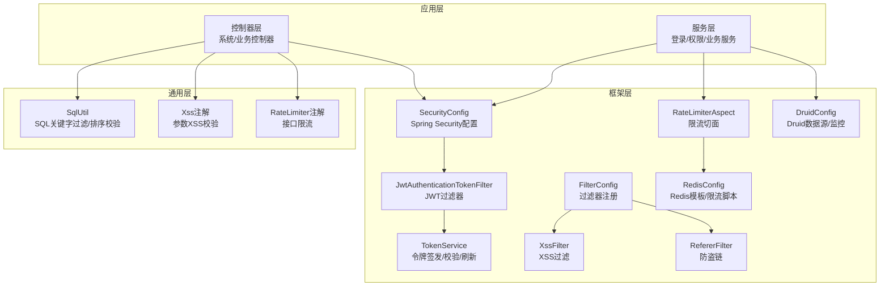
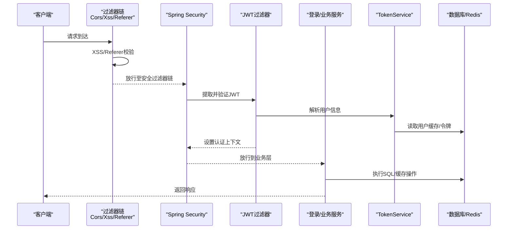
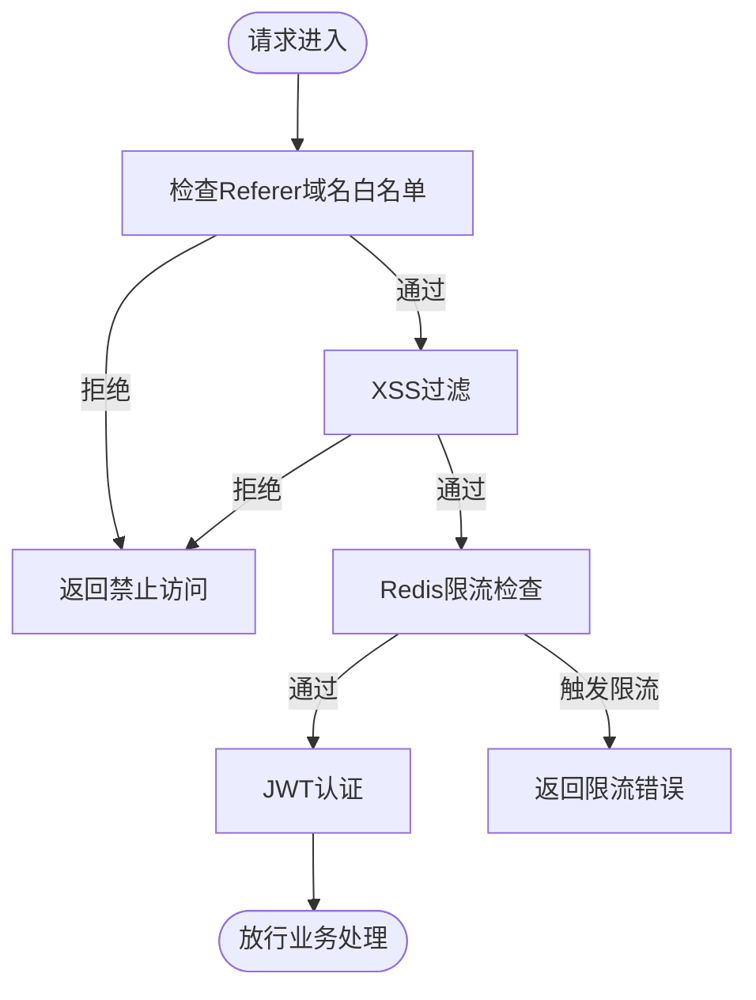
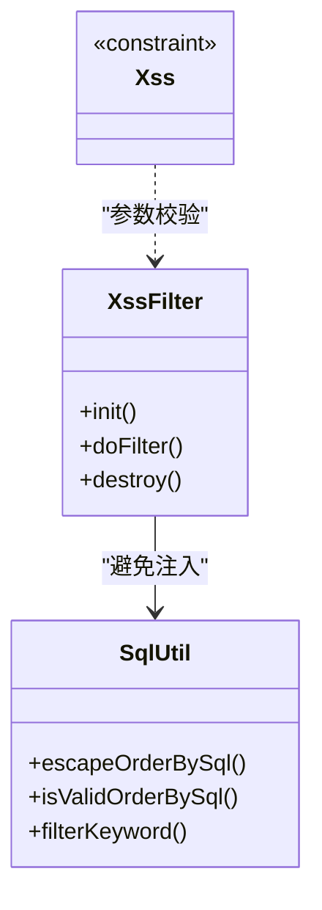
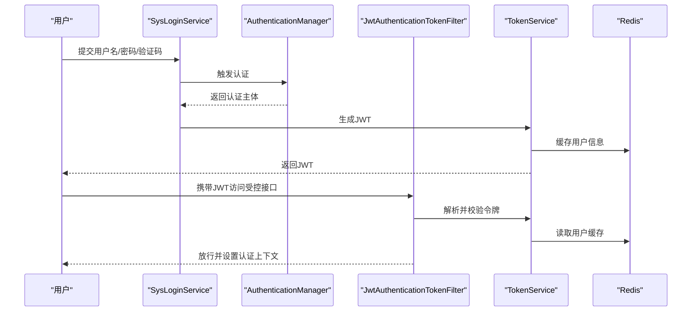
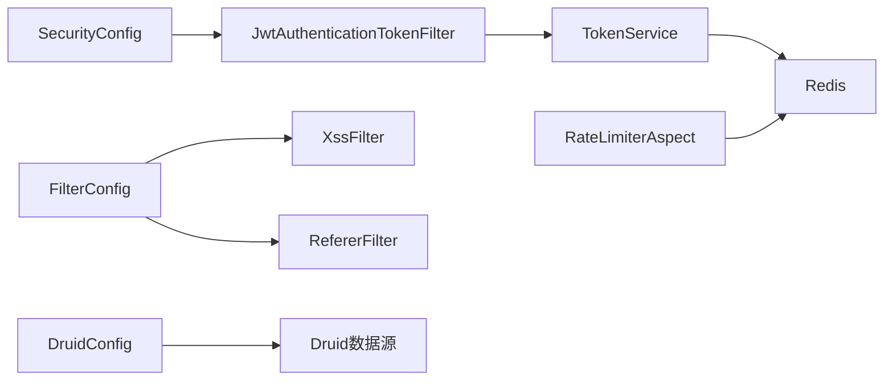

# 安全加固与防护策略

<cite>
**本文引用的文件**
- [SecurityConfig.java](file://blog-framework/src/main/java/blog/framework/config/SecurityConfig.java)
- [JwtAuthenticationTokenFilter.java](file://blog-framework/src/main/java/blog/framework/security/filter/JwtAuthenticationTokenFilter.java)
- [TokenService.java](file://blog-framework/src/main/java/blog/framework/web/service/TokenService.java)
- [SysLoginService.java](file://blog-framework/src/main/java/blog/framework/web/service/SysLoginService.java)
- [FilterConfig.java](file://blog-framework/src/main/java/blog/framework/config/FilterConfig.java)
- [XssFilter.java](file://blog-common/src/main/java/blog/common/filter/XssFilter.java)
- [RefererFilter.java](file://blog-common/src/main/java/blog/common/filter/RefererFilter.java)
- [SqlUtil.java](file://blog-common/src/main/java/blog/common/utils/sql/SqlUtil.java)
- [Xss.java](file://blog-common/src/main/java/blog/common/xss/Xss.java)
- [RateLimiterAspect.java](file://blog-framework/src/main/java/blog/framework/aspectj/RateLimiterAspect.java)
- [RateLimiter.java](file://blog-common/src/main/java/blog/common/annotation/RateLimiter.java)
- [RedisConfig.java](file://blog-framework/src/main/java/blog/framework/config/RedisConfig.java)
- [DruidConfig.java](file://blog-framework/src/main/java/blog/framework/config/DruidConfig.java)
- [application.yml](file://blog-admin/src/main/resources/application.yml)
- [application-druid.yml](file://blog-admin/src/main/resources/application-druid.yml)
- [logback.xml](file://blog-admin/src/main/resources/logback.xml)
</cite>

## 目录
1. [引言](#引言)
2. [项目结构](#项目结构)
3. [核心组件](#核心组件)
4. [架构总览](#架构总览)
5. [详细组件分析](#详细组件分析)
6. [依赖分析](#依赖分析)
7. [性能考虑](#性能考虑)
8. [故障排查指南](#故障排查指南)
9. [结论](#结论)
10. [附录](#附录)

## 引言
本指南围绕“安全加固与防护策略”目标，结合代码库中的实际实现，系统梳理网络安全、应用安全、身份认证与授权、数据安全、配置检查清单以及安全事件响应流程。文档以代码为依据，辅以可视化图示，帮助运维与开发人员快速理解并落地各项安全措施。

## 项目结构
项目采用多模块分层架构，安全相关能力主要分布在框架层与通用工具层：
- 框架层负责安全配置、过滤器链、限流、Redis脚本与Druid数据源配置
- 通用层提供XSS过滤、SQL工具、注解与校验等基础安全能力
- 控制器与服务层通过注解与拦截器实现业务级安全控制

图表来源
- [SecurityConfig.java:94-127](file://blog-framework/src/main/java/blog/framework/config/SecurityConfig.java#L94-L127)
- [JwtAuthenticationTokenFilter.java:38-50](file://blog-framework/src/main/java/blog/framework/security/filter/JwtAuthenticationTokenFilter.java#L38-L50)
- [TokenService.java:105-142](file://blog-framework/src/main/java/blog/framework/web/service/TokenService.java#L105-L142)
- [FilterConfig.java:35-77](file://blog-framework/src/main/java/blog/framework/config/FilterConfig.java#L35-L77)
- [XssFilter.java:40-50](file://blog-common/src/main/java/blog/common/filter/XssFilter.java#L40-L50)
- [RefererFilter.java:34-62](file://blog-common/src/main/java/blog/common/filter/RefererFilter.java#L34-L62)
- [RateLimiterAspect.java:47-65](file://blog-framework/src/main/java/blog/framework/aspectj/RateLimiterAspect.java#L47-L65)
- [RedisConfig.java:41-66](file://blog-framework/src/main/java/blog/framework/config/RedisConfig.java#L41-L66)
- [DruidConfig.java:34-57](file://blog-framework/src/main/java/blog/framework/config/DruidConfig.java#L34-L57)
- [SqlUtil.java:47-60](file://blog-common/src/main/java/blog/common/utils/sql/SqlUtil.java#L47-L60)
- [Xss.java:19-27](file://blog-common/src/main/java/blog/common/xss/Xss.java#L19-L27)
- [RateLimiter.java:20-40](file://blog-common/src/main/java/blog/common/annotation/RateLimiter.java#L20-L40)

章节来源
- [SecurityConfig.java:94-127](file://blog-framework/src/main/java/blog/framework/config/SecurityConfig.java#L94-L127)
- [FilterConfig.java:35-77](file://blog-framework/src/main/java/blog/framework/config/FilterConfig.java#L35-L77)

## 核心组件
- Spring Security配置与过滤器链：禁用CSRF、基于JWT无状态认证、跨域过滤器优先级设置、匿名放行路径配置
- JWT令牌服务：令牌签发、解析、刷新、用户代理与地理位置记录、Redis缓存
- XSS与防盗链过滤：统一XSS过滤器与Referer防盗链过滤器，支持URL模式与域名白名单
- SQL注入防护：关键字过滤与排序语句合法性校验
- 限流与防刷：基于Redis的Lua限流脚本与注解驱动的接口限流
- 数据源与监控：Druid多数据源与监控页面广告移除

章节来源
- [SecurityConfig.java:94-127](file://blog-framework/src/main/java/blog/framework/config/SecurityConfig.java#L94-L127)
- [TokenService.java:105-142](file://blog-framework/src/main/java/blog/framework/web/service/TokenService.java#L105-L142)
- [XssFilter.java:40-50](file://blog-common/src/main/java/blog/common/filter/XssFilter.java#L40-L50)
- [RefererFilter.java:34-62](file://blog-common/src/main/java/blog/common/filter/RefererFilter.java#L34-L62)
- [SqlUtil.java:47-60](file://blog-common/src/main/java/blog/common/utils/sql/SqlUtil.java#L47-L60)
- [RateLimiterAspect.java:47-65](file://blog-framework/src/main/java/blog/framework/aspectj/RateLimiterAspect.java#L47-L65)
- [DruidConfig.java:34-57](file://blog-framework/src/main/java/blog/framework/config/DruidConfig.java#L34-L57)

## 架构总览
下图展示从客户端到服务端的关键安全交互流程，包括登录认证、JWT校验、XSS/Referer过滤、SQL与限流防护。

图表来源
- [SecurityConfig.java:94-127](file://blog-framework/src/main/java/blog/framework/config/SecurityConfig.java#L94-L127)
- [JwtAuthenticationTokenFilter.java:38-50](file://blog-framework/src/main/java/blog/framework/security/filter/JwtAuthenticationTokenFilter.java#L38-L50)
- [TokenService.java:62-78](file://blog-framework/src/main/java/blog/framework/web/service/TokenService.java#L62-L78)
- [FilterConfig.java:35-77](file://blog-framework/src/main/java/blog/framework/config/FilterConfig.java#L35-L77)

## 详细组件分析

### 网络安全防护
- 防火墙与端口管理
  - 通过Spring Security禁用CSRF，配合JWT无状态认证，降低对会话的依赖；建议在网关/反向代理层开启WAF与端口收敛，仅开放必要端口
- IP白名单与防盗链
  - 登录前置校验包含黑名单IP检查；可扩展白名单策略；RefererFilter支持域名白名单
- DDoS与流量治理
  - 基于Redis的限流脚本与注解驱动的限流，结合Nginx/LVS层限流策略

图表来源
- [RefererFilter.java:34-62](file://blog-common/src/main/java/blog/common/filter/RefererFilter.java#L34-L62)
- [XssFilter.java:40-50](file://blog-common/src/main/java/blog/common/filter/XssFilter.java#L40-L50)
- [RateLimiterAspect.java:47-65](file://blog-framework/src/main/java/blog/framework/aspectj/RateLimiterAspect.java#L47-L65)

章节来源
- [SysLoginService.java:149-155](file://blog-framework/src/main/java/blog/framework/web/service/SysLoginService.java#L149-L155)
- [FilterConfig.java:35-77](file://blog-framework/src/main/java/blog/framework/config/FilterConfig.java#L35-L77)
- [RateLimiterAspect.java:47-65](file://blog-framework/src/main/java/blog/framework/aspectj/RateLimiterAspect.java#L47-L65)

### 应用安全加固
- 输入验证与XSS防护
  - XssFilter对POST/PUT等非GET/DELETE请求进行包装过滤；Xss注解用于参数级XSS校验
- SQL注入防护
  - SqlUtil对排序子句进行合法性校验与长度限制，并检测常见SQL关键字
- 文件上传安全
  - 可结合文件类型/大小校验与存储隔离策略（如对象存储），建议在上传接口增加文件类型白名单与病毒扫描

图表来源
- [XssFilter.java:24-66](file://blog-common/src/main/java/blog/common/filter/XssFilter.java#L24-L66)
- [Xss.java:19-27](file://blog-common/src/main/java/blog/common/xss/Xss.java#L19-L27)
- [SqlUtil.java:30-60](file://blog-common/src/main/java/blog/common/utils/sql/SqlUtil.java#L30-L60)

章节来源
- [XssFilter.java:40-50](file://blog-common/src/main/java/blog/common/filter/XssFilter.java#L40-L50)
- [SqlUtil.java:47-60](file://blog-common/src/main/java/blog/common/utils/sql/SqlUtil.java#L47-L60)

### 身份认证与授权
- JWT令牌安全
  - TokenService负责令牌签发、解析、刷新与Redis缓存；支持用户代理与登录地点记录
- 会话管理
  - 基于STATELESS策略，无服务端会话，降低会话劫持风险
- 权限控制
  - Spring Security方法级注解启用，结合业务权限服务实现细粒度授权
- 审计日志
  - 登录成功/失败异步记录，便于审计追踪

图表来源
- [SysLoginService.java:62-98](file://blog-framework/src/main/java/blog/framework/web/service/SysLoginService.java#L62-L98)
- [JwtAuthenticationTokenFilter.java:38-50](file://blog-framework/src/main/java/blog/framework/security/filter/JwtAuthenticationTokenFilter.java#L38-L50)
- [TokenService.java:105-142](file://blog-framework/src/main/java/blog/framework/web/service/TokenService.java#L105-L142)

章节来源
- [SecurityConfig.java:94-127](file://blog-framework/src/main/java/blog/framework/config/SecurityConfig.java#L94-L127)
- [TokenService.java:105-142](file://blog-framework/src/main/java/blog/framework/web/service/TokenService.java#L105-L142)
- [SysLoginService.java:62-98](file://blog-framework/src/main/java/blog/framework/web/service/SysLoginService.java#L62-L98)

### 数据安全保护
- 传输安全
  - 建议强制HTTPS，TLS版本与套件升级，Cookie Secure/SameSite属性设置
- 存储安全
  - 敏感字段加密存储（如密码使用BCrypt），数据库连接启用SSL
- 数据脱敏
  - 输出层可结合脱敏工具类对敏感字段进行脱敏展示

章节来源
- [SecurityConfig.java:132-135](file://blog-framework/src/main/java/blog/framework/config/SecurityConfig.java#L132-L135)
- [TokenService.java:164-182](file://blog-framework/src/main/java/blog/framework/web/service/TokenService.java#L164-L182)

### 安全配置检查清单
- 系统配置
  - 启用HTTPS与安全响应头；关闭不必要的管理端口；最小权限原则部署
- 应用配置
  - 开启XSS与Referer过滤；配置允许域名白名单；启用验证码开关；设置JWT密钥与过期时间
- 数据库配置
  - Druid监控页面广告移除；只读账户与最小权限；连接池参数优化；慢查询日志

章节来源
- [FilterConfig.java:35-77](file://blog-framework/src/main/java/blog/framework/config/FilterConfig.java#L35-L77)
- [DruidConfig.java:78-115](file://blog-framework/src/main/java/blog/framework/config/DruidConfig.java#L78-L115)
- [application.yml](file://blog-admin/src/main/resources/application.yml)

## 依赖分析
- 组件耦合
  - SecurityConfig与JwtAuthenticationTokenFilter强关联；TokenService依赖RedisCache；限流切面依赖RedisTemplate与脚本
- 外部依赖
  - Spring Security、Redis、Druid、JWT库、Fastjson序列化器

图表来源
- [SecurityConfig.java:94-127](file://blog-framework/src/main/java/blog/framework/config/SecurityConfig.java#L94-L127)
- [JwtAuthenticationTokenFilter.java:28-49](file://blog-framework/src/main/java/blog/framework/security/filter/JwtAuthenticationTokenFilter.java#L28-L49)
- [TokenService.java:54-55](file://blog-framework/src/main/java/blog/framework/web/service/TokenService.java#L54-L55)
- [RateLimiterAspect.java:37-44](file://blog-framework/src/main/java/blog/framework/aspectj/RateLimiterAspect.java#L37-L44)
- [FilterConfig.java:35-77](file://blog-framework/src/main/java/blog/framework/config/FilterConfig.java#L35-L77)
- [DruidConfig.java:34-57](file://blog-framework/src/main/java/blog/framework/config/DruidConfig.java#L34-L57)

## 性能考虑
- 无状态认证降低会话开销，但需关注Redis命中率与延迟
- 限流脚本使用原子Lua，减少往返；合理设置窗口与阈值
- 日志输出与异步审计避免阻塞主流程

## 故障排查指南
- 登录失败/验证码错误
  - 核对验证码开关与Redis缓存键；检查登录前置校验与黑名单规则
- JWT无效/过期
  - 检查令牌签名密钥、过期时间与Redis缓存；确认请求头格式
- XSS/Referer拦截
  - 调整过滤器URL模式与白名单参数；确认请求方法与路径
- 限流触发
  - 查看Redis限流键与脚本逻辑；调整时间窗口与阈值

章节来源
- [SysLoginService.java:108-123](file://blog-framework/src/main/java/blog/framework/web/service/SysLoginService.java#L108-L123)
- [TokenService.java:62-78](file://blog-framework/src/main/java/blog/framework/web/service/TokenService.java#L62-L78)
- [XssFilter.java:52-60](file://blog-common/src/main/java/blog/common/filter/XssFilter.java#L52-L60)
- [RefererFilter.java:39-61](file://blog-common/src/main/java/blog/common/filter/RefererFilter.java#L39-L61)
- [RateLimiterAspect.java:54-65](file://blog-framework/src/main/java/blog/framework/aspectj/RateLimiterAspect.java#L54-L65)

## 结论
本项目通过Spring Security无状态认证、JWT令牌、统一过滤器链、Redis限流与SQL/XSS防护构建了较为完整的安全体系。建议在生产环境中进一步强化传输加密、密钥管理、审计与合规要求，并结合网关/WAF实现纵深防御。

## 附录
- 安全事件响应流程建议
  - 快速隔离受影响实例；封禁可疑IP与令牌；回滚变更；复盘与修复；恢复监控告警