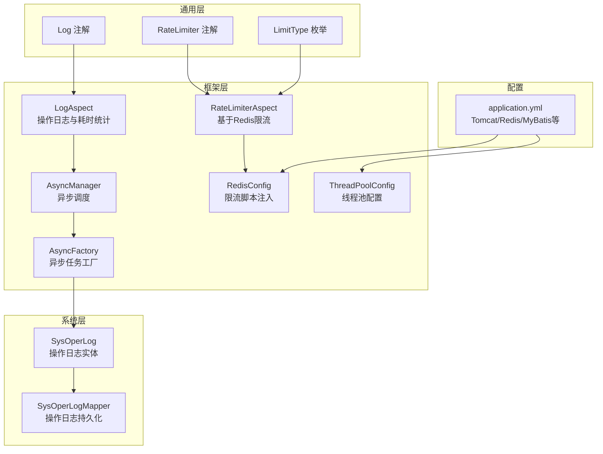
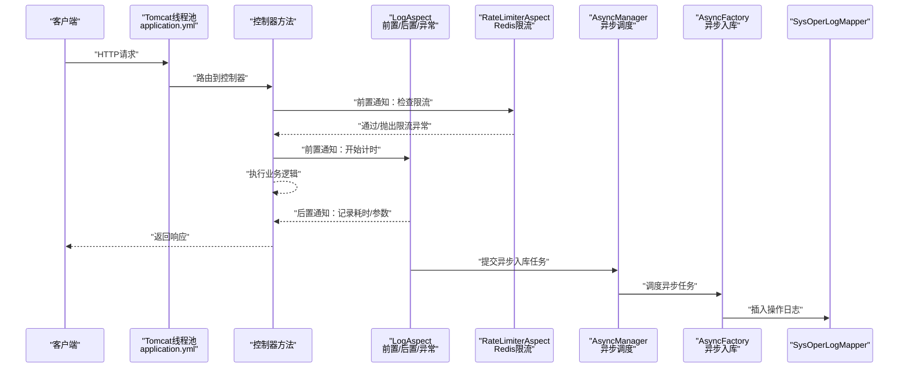
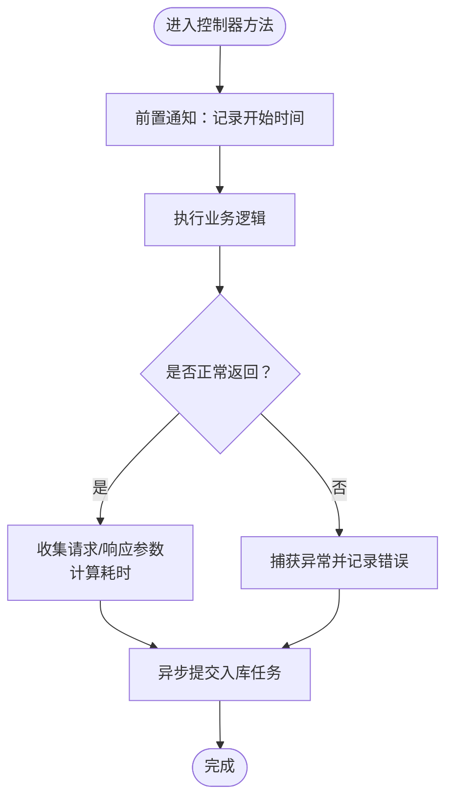
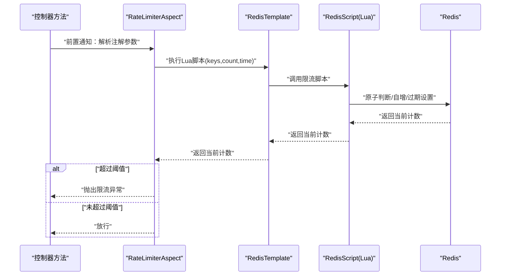
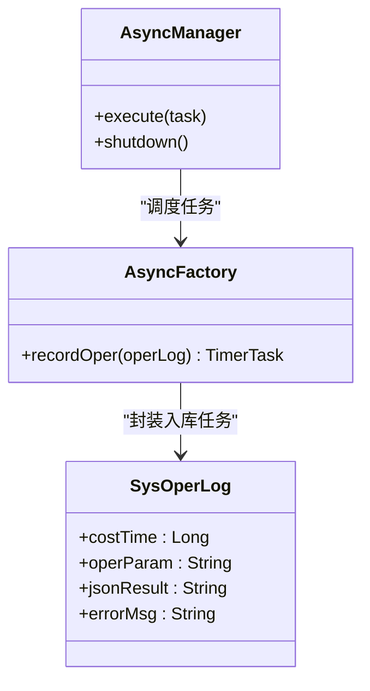
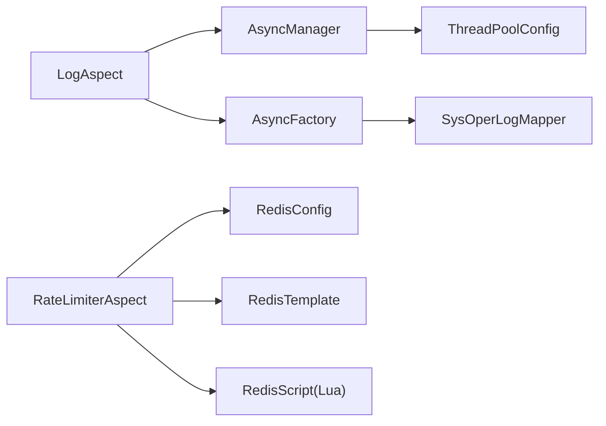

# 业务性能监控

<cite>
**本文引用的文件**
- [LogAspect.java](file://blog-framework/src/main/java/blog/framework/aspectj/LogAspect.java)
- [RateLimiterAspect.java](file://blog-framework/src/main/java/blog/framework/aspectj/RateLimiterAspect.java)
- [Log.java](file://blog-common/src/main/java/blog/common/annotation/Log.java)
- [RateLimiter.java](file://blog-common/src/main/java/blog/common/annotation/RateLimiter.java)
- [LimitType.java](file://blog-common/src/main/java/blog/common/enums/LimitType.java)
- [AsyncManager.java](file://blog-framework/src/main/java/blog/framework/manager/AsyncManager.java)
- [AsyncFactory.java](file://blog-framework/src/main/java/blog/framework/manager/factory/AsyncFactory.java)
- [SysOperLog.java](file://blog-system/src/main/java/blog/system/domain/SysOperLog.java)
- [SysOperLogMapper.java](file://blog-system/src/main/java/blog/system/mapper/SysOperLogMapper.java)
- [RedisConfig.java](file://blog-framework/src/main/java/blog/framework/config/RedisConfig.java)
- [ThreadPoolConfig.java](file://blog-framework/src/main/java/blog/framework/config/ThreadPoolConfig.java)
- [application.yml](file://blog-admin/src/main/resources/application.yml)
</cite>

## 目录
1. [简介](#简介)
2. [项目结构](#项目结构)
3. [核心组件](#核心组件)
4. [架构总览](#架构总览)
5. [详细组件分析](#详细组件分析)
6. [依赖分析](#依赖分析)
7. [性能考虑](#性能考虑)
8. [故障排查指南](#故障排查指南)
9. [结论](#结论)
10. [附录](#附录)

## 简介
本指南围绕业务性能监控展开，聚焦接口性能监控（响应时间、吞吐量、错误率、并发数）、日志监控（操作日志、业务日志、异常日志）与限流监控策略（令牌桶/漏桶思想的Redis Lua脚本实现），并结合AOP切面（LogAspect、RateLimiterAspect）在实际代码中的落地实践，帮助读者建立一套可落地、可观测、可扩展的性能监控体系。

## 项目结构
本项目采用多模块分层组织：通用模块（common）、框架模块（framework）、业务模块（biz）、系统模块（system）等。与性能监控直接相关的关键位置如下：
- 框架层切面：LogAspect（操作日志与耗时统计）、RateLimiterAspect（基于Redis的限流）
- 通用注解：Log、RateLimiter、LimitType
- 异步管理：AsyncManager、AsyncFactory（异步入库与日志落盘）
- 数据模型：SysOperLog（操作日志实体）
- 配置：RedisConfig（限流Lua脚本注入）、ThreadPoolConfig（线程池）、application.yml（运行参数）

图表来源
- [LogAspect.java:1-231](file://blog-framework/src/main/java/blog/framework/aspectj/LogAspect.java#L1-L231)
- [RateLimiterAspect.java:1-79](file://blog-framework/src/main/java/blog/framework/aspectj/RateLimiterAspect.java#L1-L79)
- [Log.java:1-51](file://blog-common/src/main/java/blog/common/annotation/Log.java#L1-L51)
- [RateLimiter.java:1-41](file://blog-common/src/main/java/blog/common/annotation/RateLimiter.java#L1-L41)
- [LimitType.java:1-20](file://blog-common/src/main/java/blog/common/enums/LimitType.java#L1-L20)
- [AsyncManager.java:1-54](file://blog-framework/src/main/java/blog/framework/manager/AsyncManager.java#L1-L54)
- [AsyncFactory.java:1-93](file://blog-framework/src/main/java/blog/framework/manager/factory/AsyncFactory.java#L1-L93)
- [SysOperLog.java:1-134](file://blog-system/src/main/java/blog/system/domain/SysOperLog.java#L1-L134)
- [SysOperLogMapper.java:1-50](file://blog-system/src/main/java/blog/system/mapper/SysOperLogMapper.java#L1-L50)
- [RedisConfig.java:1-67](file://blog-framework/src/main/java/blog/framework/config/RedisConfig.java#L1-L67)
- [ThreadPoolConfig.java:1-60](file://blog-framework/src/main/java/blog/framework/config/ThreadPoolConfig.java#L1-L60)
- [application.yml:1-161](file://blog-admin/src/main/resources/application.yml#L1-L161)

章节来源
- [LogAspect.java:1-231](file://blog-framework/src/main/java/blog/framework/aspectj/LogAspect.java#L1-L231)
- [RateLimiterAspect.java:1-79](file://blog-framework/src/main/java/blog/framework/aspectj/RateLimiterAspect.java#L1-L79)
- [Log.java:1-51](file://blog-common/src/main/java/blog/common/annotation/Log.java#L1-L51)
- [RateLimiter.java:1-41](file://blog-common/src/main/java/blog/common/annotation/RateLimiter.java#L1-L41)
- [LimitType.java:1-20](file://blog-common/src/main/java/blog/common/enums/LimitType.java#L1-L20)
- [AsyncManager.java:1-54](file://blog-framework/src/main/java/blog/framework/manager/AsyncManager.java#L1-L54)
- [AsyncFactory.java:1-93](file://blog-framework/src/main/java/blog/framework/manager/factory/AsyncFactory.java#L1-L93)
- [SysOperLog.java:1-134](file://blog-system/src/main/java/blog/system/domain/SysOperLog.java#L1-L134)
- [SysOperLogMapper.java:1-50](file://blog-system/src/main/java/blog/system/mapper/SysOperLogMapper.java#L1-L50)
- [RedisConfig.java:1-67](file://blog-framework/src/main/java/blog/framework/config/RedisConfig.java#L1-L67)
- [ThreadPoolConfig.java:1-60](file://blog-framework/src/main/java/blog/framework/config/ThreadPoolConfig.java#L1-L60)
- [application.yml:1-161](file://blog-admin/src/main/resources/application.yml#L1-L161)

## 核心组件
- 操作日志与耗时统计切面：通过AOP在方法前后织入，计算请求耗时、收集请求/响应参数、异常信息，并异步入库。
- 限流切面：基于Redis Lua脚本实现“滑动窗口计数”思想，支持按默认或IP维度限流。
- 异步管理：统一调度异步任务，降低同步IO对主线程的影响。
- 数据模型与持久化：SysOperLog记录操作日志，SysOperLogMapper提供查询与清理能力。
- 配置支撑：RedisConfig注入限流脚本；ThreadPoolConfig提供线程池；application.yml提供运行参数。

章节来源
- [LogAspect.java:55-134](file://blog-framework/src/main/java/blog/framework/aspectj/LogAspect.java#L55-L134)
- [RateLimiterAspect.java:47-77](file://blog-framework/src/main/java/blog/framework/aspectj/RateLimiterAspect.java#L47-L77)
- [AsyncManager.java:43-45](file://blog-framework/src/main/java/blog/framework/manager/AsyncManager.java#L43-L45)
- [AsyncFactory.java:82-91](file://blog-framework/src/main/java/blog/framework/manager/factory/AsyncFactory.java#L82-L91)
- [SysOperLog.java:120-131](file://blog-system/src/main/java/blog/system/domain/SysOperLog.java#L120-L131)
- [SysOperLogMapper.java:13-49](file://blog-system/src/main/java/blog/system/mapper/SysOperLogMapper.java#L13-L49)
- [RedisConfig.java:42-65](file://blog-framework/src/main/java/blog/framework/config/RedisConfig.java#L42-L65)
- [ThreadPoolConfig.java:32-58](file://blog-framework/src/main/java/blog/framework/config/ThreadPoolConfig.java#L32-L58)
- [application.yml:13-29](file://blog-admin/src/main/resources/application.yml#L13-L29)

## 架构总览
下图展示了从请求进入Web容器，到AOP切面拦截、异步落库、以及Redis限流的整体流程。

图表来源
- [application.yml:13-29](file://blog-admin/src/main/resources/application.yml#L13-L29)
- [LogAspect.java:60-134](file://blog-framework/src/main/java/blog/framework/aspectj/LogAspect.java#L60-L134)
- [RateLimiterAspect.java:47-65](file://blog-framework/src/main/java/blog/framework/aspectj/RateLimiterAspect.java#L47-L65)
- [AsyncManager.java:43-45](file://blog-framework/src/main/java/blog/framework/manager/AsyncManager.java#L43-L45)
- [AsyncFactory.java:82-91](file://blog-framework/src/main/java/blog/framework/manager/factory/AsyncFactory.java#L82-L91)
- [SysOperLogMapper.java:13-19](file://blog-system/src/main/java/blog/system/mapper/SysOperLogMapper.java#L13-L19)

## 详细组件分析

### 操作日志与耗时统计（LogAspect）
- 关键点
  - 前置通知：记录开始时间（ThreadLocal）。
  - 后置通知：计算耗时（结束时间-开始时间），收集请求/响应参数，写入操作日志。
  - 异常通知：捕获异常，标记失败并记录错误信息。
  - 异步落库：通过AsyncManager与AsyncFactory将入库任务异步执行，避免阻塞主线程。
  - 敏感字段过滤：排除密码等字段，支持自定义排除项。
- 性能影响
  - 耗时计算仅使用内存变量，开销极低。
  - 异步入库降低IO对请求时延的影响。
- 可观测性
  - 记录请求URL、方法签名、请求方式、操作人、部门、IP、耗时、错误信息等。

图表来源
- [LogAspect.java:60-134](file://blog-framework/src/main/java/blog/framework/aspectj/LogAspect.java#L60-L134)
- [AsyncManager.java:43-45](file://blog-framework/src/main/java/blog/framework/manager/AsyncManager.java#L43-L45)
- [AsyncFactory.java:82-91](file://blog-framework/src/main/java/blog/framework/manager/factory/AsyncFactory.java#L82-L91)

章节来源
- [LogAspect.java:55-134](file://blog-framework/src/main/java/blog/framework/aspectj/LogAspect.java#L55-L134)
- [Log.java:20-50](file://blog-common/src/main/java/blog/common/annotation/Log.java#L20-L50)
- [AsyncManager.java:43-45](file://blog-framework/src/main/java/blog/framework/manager/AsyncManager.java#L43-L45)
- [AsyncFactory.java:82-91](file://blog-framework/src/main/java/blog/framework/manager/factory/AsyncFactory.java#L82-L91)
- [SysOperLog.java:120-131](file://blog-system/src/main/java/blog/system/domain/SysOperLog.java#L120-L131)

### 限流监控（RateLimiterAspect + RedisConfig）
- 限流策略
  - 基于Redis Lua脚本实现“滑动窗口计数”，在Lua内原子判断与自增，保证一致性。
  - 支持两种维度：默认全局限流、按IP限流。
  - 限流阈值与时间窗口由注解参数控制。
- 监控要点
  - 记录当前请求数与阈值，便于观察触发频率。
  - 发生异常时区分业务异常与系统异常，确保不因限流异常导致系统不稳定。
- Redis脚本
  - 原子判断当前计数是否超过阈值，若首次访问设置过期时间，最终返回当前计数值。

图表来源
- [RateLimiterAspect.java:47-65](file://blog-framework/src/main/java/blog/framework/aspectj/RateLimiterAspect.java#L47-L65)
- [RedisConfig.java:42-65](file://blog-framework/src/main/java/blog/framework/config/RedisConfig.java#L42-L65)
- [RateLimiter.java:20-41](file://blog-common/src/main/java/blog/common/annotation/RateLimiter.java#L20-L41)
- [LimitType.java:9-19](file://blog-common/src/main/java/blog/common/enums/LimitType.java#L9-L19)

章节来源
- [RateLimiterAspect.java:47-77](file://blog-framework/src/main/java/blog/framework/aspectj/RateLimiterAspect.java#L47-L77)
- [RedisConfig.java:42-65](file://blog-framework/src/main/java/blog/framework/config/RedisConfig.java#L42-L65)
- [RateLimiter.java:20-41](file://blog-common/src/main/java/blog/common/annotation/RateLimiter.java#L20-L41)
- [LimitType.java:9-19](file://blog-common/src/main/java/blog/common/enums/LimitType.java#L9-L19)

### 异步日志入库（AsyncManager + AsyncFactory）
- 异步调度
  - AsyncManager以固定延迟将任务提交到Spring托管的ScheduledExecutorService，降低瞬时压力。
- 任务内容
  - AsyncFactory封装SysOperLog入库任务，异步远程解析IP归属地并持久化。
- 线程池配置
  - ThreadPoolConfig提供核心线程、最大线程、队列容量与拒绝策略，保障高并发下的稳定性。

图表来源
- [AsyncManager.java:43-45](file://blog-framework/src/main/java/blog/framework/manager/AsyncManager.java#L43-L45)
- [AsyncFactory.java:82-91](file://blog-framework/src/main/java/blog/framework/manager/factory/AsyncFactory.java#L82-L91)
- [SysOperLog.java:120-131](file://blog-system/src/main/java/blog/system/domain/SysOperLog.java#L120-L131)

章节来源
- [AsyncManager.java:15-54](file://blog-framework/src/main/java/blog/framework/manager/AsyncManager.java#L15-L54)
- [AsyncFactory.java:25-93](file://blog-framework/src/main/java/blog/framework/manager/factory/AsyncFactory.java#L25-L93)
- [ThreadPoolConfig.java:32-58](file://blog-framework/src/main/java/blog/framework/config/ThreadPoolConfig.java#L32-L58)

### 数据模型与持久化（SysOperLog + SysOperLogMapper）
- SysOperLog包含请求URL、方法、请求方式、操作人、IP、耗时、错误信息等字段，便于后续分析。
- SysOperLogMapper提供插入、列表查询、批量删除、详情查询、清空等能力，支撑运营侧审计与问题回溯。

章节来源
- [SysOperLog.java:19-134](file://blog-system/src/main/java/blog/system/domain/SysOperLog.java#L19-L134)
- [SysOperLogMapper.java:13-49](file://blog-system/src/main/java/blog/system/mapper/SysOperLogMapper.java#L13-L49)

## 依赖分析
- 组件耦合
  - LogAspect依赖SecurityUtils、ServletUtils、AsyncManager、AsyncFactory、SysOperLog等，形成完整的日志采集与落库闭环。
  - RateLimiterAspect依赖RedisTemplate与RedisScript，通过Lua脚本实现原子限流。
  - AsyncManager依赖Spring托管的ScheduledExecutorService，统一异步任务调度。
- 外部依赖
  - Redis：用于限流与分布式共享状态。
  - 数据库：MyBatis-Plus持久化操作日志。
  - 线程池：ThreadPoolConfig提供线程池与拒绝策略。

图表来源
- [LogAspect.java:33-34](file://blog-framework/src/main/java/blog/framework/aspectj/LogAspect.java#L33-L34)
- [AsyncManager.java:24-24](file://blog-framework/src/main/java/blog/framework/manager/AsyncManager.java#L24-L24)
- [AsyncFactory.java:82-91](file://blog-framework/src/main/java/blog/framework/manager/factory/AsyncFactory.java#L82-L91)
- [SysOperLogMapper.java:13-19](file://blog-system/src/main/java/blog/system/mapper/SysOperLogMapper.java#L13-L19)
- [RateLimiterAspect.java:33-45](file://blog-framework/src/main/java/blog/framework/aspectj/RateLimiterAspect.java#L33-L45)
- [RedisConfig.java:42-47](file://blog-framework/src/main/java/blog/framework/config/RedisConfig.java#L42-L47)
- [ThreadPoolConfig.java:47-58](file://blog-framework/src/main/java/blog/framework/config/ThreadPoolConfig.java#L47-L58)

章节来源
- [LogAspect.java:33-34](file://blog-framework/src/main/java/blog/framework/aspectj/LogAspect.java#L33-L34)
- [RateLimiterAspect.java:33-45](file://blog-framework/src/main/java/blog/framework/aspectj/RateLimiterAspect.java#L33-L45)
- [AsyncManager.java:24-24](file://blog-framework/src/main/java/blog/framework/manager/AsyncManager.java#L24-L24)
- [AsyncFactory.java:82-91](file://blog-framework/src/main/java/blog/framework/manager/factory/AsyncFactory.java#L82-L91)
- [SysOperLogMapper.java:13-19](file://blog-system/src/main/java/blog/system/mapper/SysOperLogMapper.java#L13-L19)
- [RedisConfig.java:42-47](file://blog-framework/src/main/java/blog/framework/config/RedisConfig.java#L42-L47)
- [ThreadPoolConfig.java:47-58](file://blog-framework/src/main/java/blog/framework/config/ThreadPoolConfig.java#L47-L58)

## 性能考虑
- 接口响应时间
  - 通过LogAspect在ThreadLocal中记录开始时间，后置通知计算耗时，可直接用于P95/P99响应时间统计。
  - SysOperLog.costTime字段可用于聚合分析。
- 吞吐量与并发数
  - application.yml中Tomcat线程池参数（max/min-spare/accept-count）直接影响并发承载能力，需结合压测结果调整。
  - ThreadPoolConfig提供线程池上限与队列容量，避免过载导致拒绝。
- 错误率
  - LogAspect在异常路径记录错误信息，SysOperLog.errorMsg可用于错误率统计与趋势分析。
- 限流策略
  - RateLimiterAspect基于Redis Lua脚本实现原子计数，具备较低延迟与较高准确性。
  - LimitType支持IP维度限流，可针对热点IP进行保护。
- 异步入库
  - AsyncManager与AsyncFactory将IO操作异步化，减少对请求时延的影响。
- 存储与查询优化
  - 建议对SysOperLog的常用查询字段（如oper_time、oper_name、oper_ip、status）建立索引。
  - 对历史数据定期归档或冷热分离，避免单表膨胀影响查询性能。

章节来源
- [LogAspect.java:123-126](file://blog-framework/src/main/java/blog/framework/aspectj/LogAspect.java#L123-L126)
- [SysOperLog.java:120-131](file://blog-system/src/main/java/blog/system/domain/SysOperLog.java#L120-L131)
- [application.yml:13-29](file://blog-admin/src/main/resources/application.yml#L13-L29)
- [ThreadPoolConfig.java:20-42](file://blog-framework/src/main/java/blog/framework/config/ThreadPoolConfig.java#L20-L42)
- [RateLimiterAspect.java:47-65](file://blog-framework/src/main/java/blog/framework/aspectj/RateLimiterAspect.java#L47-L65)
- [AsyncManager.java:43-45](file://blog-framework/src/main/java/blog/framework/manager/AsyncManager.java#L43-L45)

## 故障排查指南
- 限流频繁触发
  - 检查注解参数（time/count/key/limitType）是否合理。
  - 观察Redis中对应key的计数与过期时间，确认Lua脚本是否正确执行。
  - 若为IP限流，确认客户端是否共用出口IP。
- 日志缺失或延迟
  - 检查AsyncManager的任务调度是否正常，线程池是否饱和。
  - 确认AsyncFactory入库任务是否成功提交至SysOperLogMapper。
- 异常未被捕获
  - 确认LogAspect的异常通知是否生效，异常栈是否被正确转换为字符串。
- Redis连接问题
  - 检查application.yml中的Redis配置与网络连通性，确认RedisTemplate与RedisScript已正确注入。

章节来源
- [RateLimiterAspect.java:54-65](file://blog-framework/src/main/java/blog/framework/aspectj/RateLimiterAspect.java#L54-L65)
- [RedisConfig.java:42-47](file://blog-framework/src/main/java/blog/framework/config/RedisConfig.java#L42-L47)
- [AsyncManager.java:43-45](file://blog-framework/src/main/java/blog/framework/manager/AsyncManager.java#L43-L45)
- [AsyncFactory.java:82-91](file://blog-framework/src/main/java/blog/framework/manager/factory/AsyncFactory.java#L82-L91)
- [LogAspect.java:127-131](file://blog-framework/src/main/java/blog/framework/aspectj/LogAspect.java#L127-L131)
- [application.yml:64-89](file://blog-admin/src/main/resources/application.yml#L64-L89)

## 结论
通过LogAspect与RateLimiterAspect的协同，系统实现了对业务接口的全面性能观测与限流保护。配合异步入库与线程池配置，可在高并发场景下保持稳定的响应与可观测性。建议结合SysOperLog的字段进行多维分析，持续优化阈值与资源配置，构建完善的性能监控闭环。

## 附录
- 关键字段速览
  - SysOperLog.costTime：接口耗时（毫秒）
  - SysOperLog.operParam：请求参数（脱敏后）
  - SysOperLog.jsonResult：响应结果（脱敏后）
  - SysOperLog.errorMsg：异常信息
  - SysOperLog.operIp/operLocation：来源IP与归属地
- 建议的监控指标
  - 响应时间：P50/P90/P95/P99
  - 吞吐量：QPS（每秒请求数）
  - 错误率：失败请求占比
  - 并发数：活跃线程数、队列长度
  - 限流命中率：触发限流的请求占比