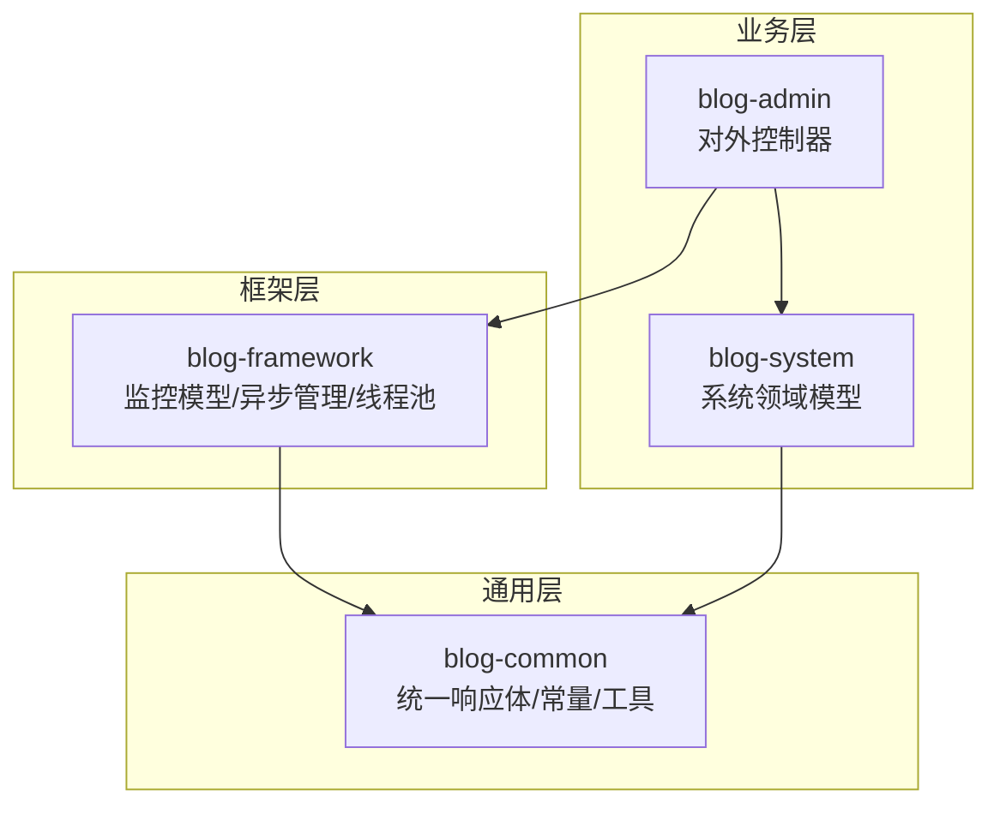
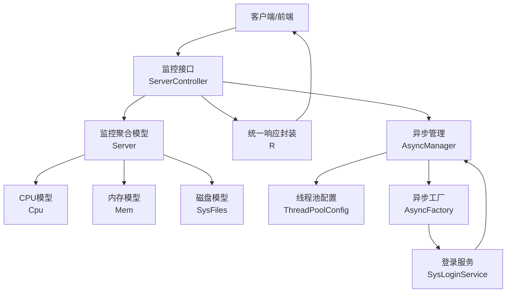
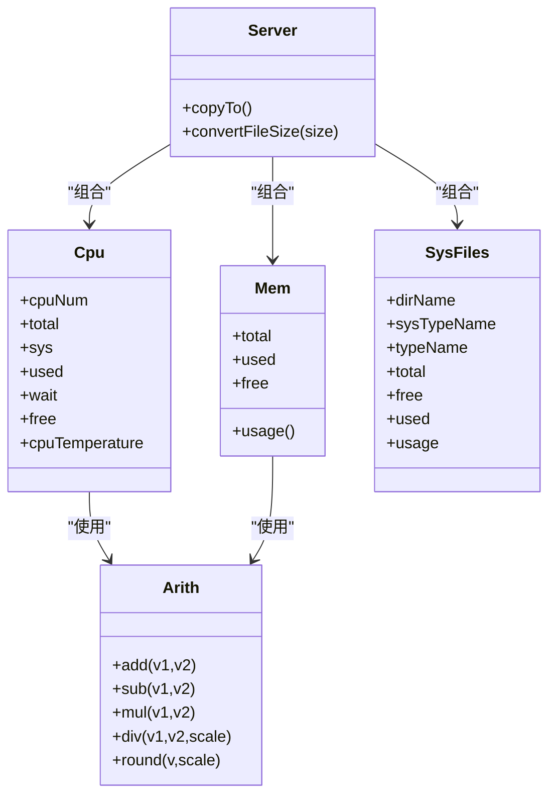
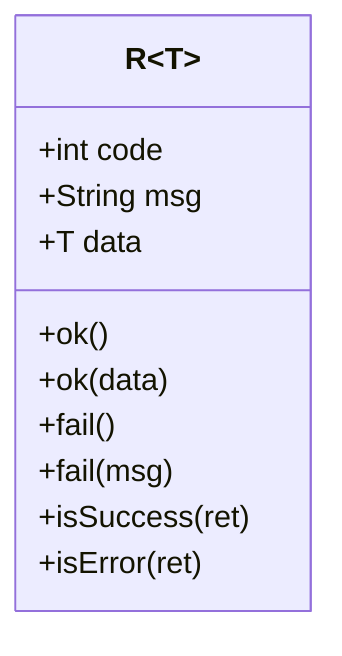
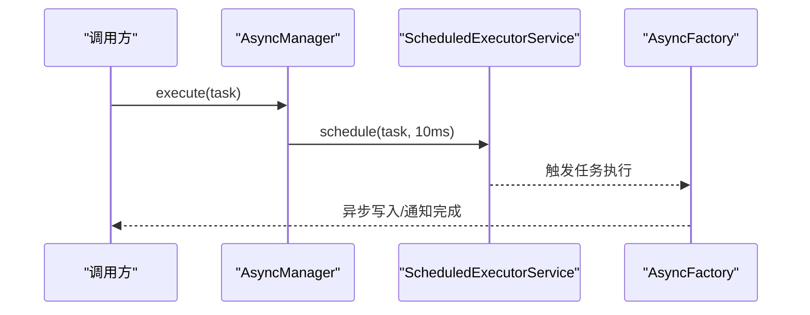
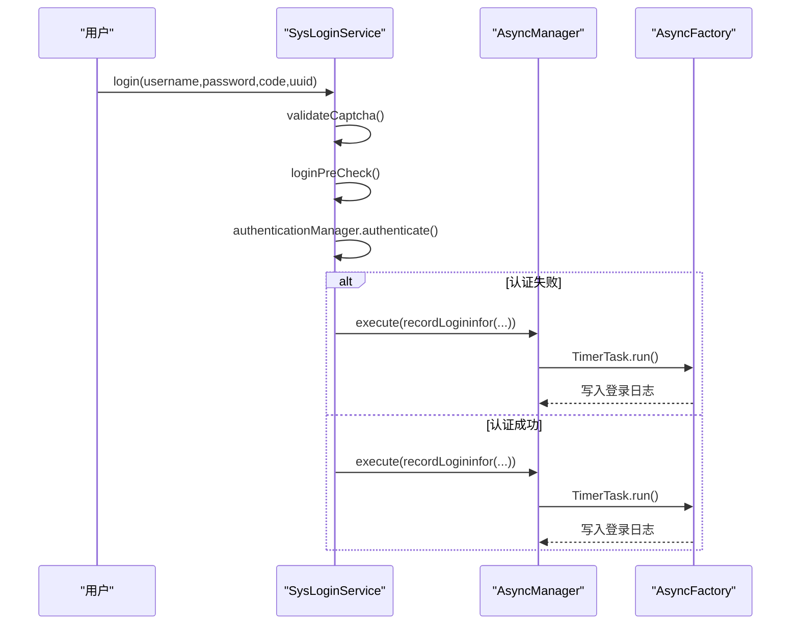
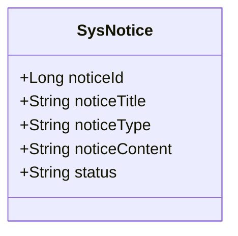
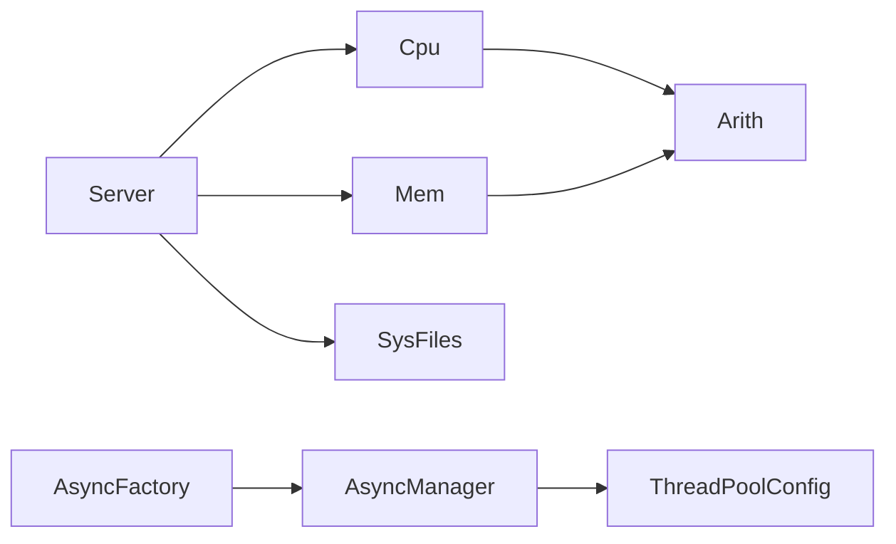

# 告警机制

<cite>
**本文引用的文件**
- [R.java](file://blog-common/src/main/java/blog/common/base/resp/R.java)
- [Constants.java](file://blog-common/src/main/java/blog/common/constant/Constants.java)
- [Arith.java](file://blog-common/src/main/java/blog/common/utils/Arith.java)
- [Server.java](file://blog-framework/src/main/java/blog/framework/web/domain/Server.java)
- [Cpu.java](file://blog-framework/src/main/java/blog/framework/web/domain/server/Cpu.java)
- [Mem.java](file://blog-framework/src/main/java/blog/framework/web/domain/server/Mem.java)
- [SysFiles.java](file://blog-framework/src/main/java/blog/framework/web/domain/server/SysFiles.java)
- [ServerController.java](file://blog-admin/src/main/java/blog/web/controller/monitor/ServerController.java)
- [SysLoginService.java](file://blog-framework/src/main/java/blog/framework/web/service/SysLoginService.java)
- [AsyncManager.java](file://blog-framework/src/main/java/blog/framework/manager/AsyncManager.java)
- [AsyncFactory.java](file://blog-framework/src/main/java/blog/framework/manager/factory/AsyncFactory.java)
- [ThreadPoolConfig.java](file://blog-framework/src/main/java/blog/framework/config/ThreadPoolConfig.java)
- [Threads.java](file://blog-common/src/main/java/blog/common/utils/Threads.java)
- [ShutdownManager.java](file://blog-framework/src/main/java/blog/framework/manager/ShutdownManager.java)
- [SysNotice.java](file://blog-system/src/main/java/blog/system/domain/SysNotice.java)
- [SysNoticeController.java](file://blog-admin/src/main/java/blog/web/controller/system/SysNoticeController.java)
</cite>

## 目录
1. [引言](#引言)
2. [项目结构](#项目结构)
3. [核心组件](#核心组件)
4. [架构总览](#架构总览)
5. [详细组件分析](#详细组件分析)
6. [依赖分析](#依赖分析)
7. [性能考虑](#性能考虑)
8. [故障排查指南](#故障排查指南)
9. [结论](#结论)
10. [附录](#附录)

## 引言
本方案围绕“告警机制”的完整设计展开，结合现有代码库中的监控采集、统一响应封装与异步日志能力，提出一套可落地的告警规则配置、通知渠道集成、告警升级策略、处理流程闭环以及数据分析与统计的方法论。目标是帮助读者快速理解如何在现有系统中扩展出一套高可用、可运维、可扩展的告警体系。

## 项目结构
本项目采用多模块分层组织，与告警机制相关的关键模块与职责如下：
- blog-common：通用常量、工具类、统一响应体封装
- blog-framework：系统监控模型、异步任务管理、线程池配置
- blog-system：系统领域模型（含通知公告）
- blog-admin：对外控制器（监控接口、通知公告接口）

**图表来源**
- [R.java](file://blog-common/src/main/java/blog/common/base/resp/R.java)
- [Server.java](file://blog-framework/src/main/java/blog/framework/web/domain/Server.java)
- [AsyncManager.java](file://blog-framework/src/main/java/blog/framework/manager/AsyncManager.java)
- [ThreadPoolConfig.java](file://blog-framework/src/main/java/blog/framework/config/ThreadPoolConfig.java)
- [SysNotice.java](file://blog-system/src/main/java/blog/system/domain/SysNotice.java)

**章节来源**
- [ServerController.java:1-25](file://blog-admin/src/main/java/blog/web/controller/monitor/ServerController.java#L1-L25)
- [Server.java:1-221](file://blog-framework/src/main/java/blog/framework/web/domain/Server.java#L1-L221)
- [R.java:1-107](file://blog-common/src/main/java/blog/common/base/resp/R.java#L1-L107)

## 核心组件
- 统一响应封装：提供统一的成功/失败响应结构，便于前端与后端一致处理告警结果与状态。
- 监控采集模型：CPU、内存、磁盘、系统信息等监控指标模型，用于构建告警规则的数据来源。
- 异步日志与线程池：通过异步任务与线程池配置，支撑告警事件的非阻塞落库与后续处理。
- 通知公告模型：系统内现有通知能力，可作为告警通知渠道之一的基础载体。

**章节来源**
- [R.java:31-73](file://blog-common/src/main/java/blog/common/base/resp/R.java#L31-L73)
- [Cpu.java:10-102](file://blog-framework/src/main/java/blog/framework/web/domain/server/Cpu.java#L10-L102)
- [Mem.java:10-54](file://blog-framework/src/main/java/blog/framework/web/domain/server/Mem.java#L10-L54)
- [SysFiles.java:8-100](file://blog-framework/src/main/java/blog/framework/web/domain/server/SysFiles.java#L8-L100)
- [AsyncManager.java:15-53](file://blog-framework/src/main/java/blog/framework/manager/AsyncManager.java#L15-L53)
- [ThreadPoolConfig.java:18-59](file://blog-framework/src/main/java/blog/framework/config/ThreadPoolConfig.java#L18-L59)
- [SysNotice.java:16-104](file://blog-system/src/main/java/blog/system/domain/SysNotice.java#L16-L104)

## 架构总览
下图展示了从监控采集到告警落库与通知的总体流程，以及与现有统一响应、异步管理的关系。

**图表来源**
- [ServerController.java:15-25](file://blog-admin/src/main/java/blog/web/controller/monitor/ServerController.java#L15-L25)
- [Server.java:31-221](file://blog-framework/src/main/java/blog/framework/web/domain/Server.java#L31-L221)
- [R.java:12-107](file://blog-common/src/main/java/blog/common/base/resp/R.java#L12-L107)
- [AsyncManager.java:15-53](file://blog-framework/src/main/java/blog/framework/manager/AsyncManager.java#L15-L53)
- [AsyncFactory.java:25-93](file://blog-framework/src/main/java/blog/framework/manager/factory/AsyncFactory.java#L25-L93)
- [ThreadPoolConfig.java:18-59](file://blog-framework/src/main/java/blog/framework/config/ThreadPoolConfig.java#L18-L59)
- [SysLoginService.java:36-166](file://blog-framework/src/main/java/blog/framework/web/service/SysLoginService.java#L36-L166)

## 详细组件分析

### 监控采集与数据模型
- Server 负责采集 CPU、内存、JVM、系统与磁盘信息，并提供 copyTo 方法一次性拉取。
- Cpu/Mem/SysFiles 提供标准化字段与计算逻辑（如百分比、温度、容量转换），便于规则判断。
- Arith 提供精确的数值计算，避免浮点误差影响阈值判定。

**图表来源**
- [Server.java:31-221](file://blog-framework/src/main/java/blog/framework/web/domain/Server.java#L31-L221)
- [Cpu.java:10-102](file://blog-framework/src/main/java/blog/framework/web/domain/server/Cpu.java#L10-L102)
- [Mem.java:10-54](file://blog-framework/src/main/java/blog/framework/web/domain/server/Mem.java#L10-L54)
- [SysFiles.java:8-100](file://blog-framework/src/main/java/blog/framework/web/domain/server/SysFiles.java#L8-L100)
- [Arith.java:11-113](file://blog-common/src/main/java/blog/common/utils/Arith.java#L11-L113)

**章节来源**
- [Server.java:99-221](file://blog-framework/src/main/java/blog/framework/web/domain/Server.java#L99-L221)
- [Cpu.java:54-100](file://blog-framework/src/main/java/blog/framework/web/domain/server/Cpu.java#L54-L100)
- [Mem.java:26-52](file://blog-framework/src/main/java/blog/framework/web/domain/server/Mem.java#L26-L52)
- [Arith.java:31-111](file://blog-common/src/main/java/blog/common/utils/Arith.java#L31-L111)

### 统一响应封装与接口返回
- R 提供 ok()/fail() 等静态方法，统一前后端交互格式，便于告警接口返回标准化结果。
- 在告警规则校验、触发、落库、通知等环节，均建议使用 R 返回，确保一致性。

**图表来源**
- [R.java:12-107](file://blog-common/src/main/java/blog/common/base/resp/R.java#L12-L107)

**章节来源**
- [R.java:31-73](file://blog-common/src/main/java/blog/common/base/resp/R.java#L31-L73)

### 异步任务与线程池
- AsyncManager 提供统一的异步任务调度入口，延迟 10ms 后执行，降低同步阻塞风险。
- ThreadPoolConfig 定义了线程池大小、队列容量与拒绝策略，保障高并发下的稳定性。
- AsyncFactory 用于构造具体异步任务（如登录日志、操作日志），可复用到告警落库与通知发送场景。

**图表来源**
- [AsyncManager.java:43-45](file://blog-framework/src/main/java/blog/framework/manager/AsyncManager.java#L43-L45)
- [ThreadPoolConfig.java:47-58](file://blog-framework/src/main/java/blog/framework/config/ThreadPoolConfig.java#L47-L58)
- [AsyncFactory.java:37-74](file://blog-framework/src/main/java/blog/framework/manager/factory/AsyncFactory.java#L37-L74)

**章节来源**
- [AsyncManager.java:15-53](file://blog-framework/src/main/java/blog/framework/manager/AsyncManager.java#L15-L53)
- [ThreadPoolConfig.java:18-59](file://blog-framework/src/main/java/blog/framework/config/ThreadPoolConfig.java#L18-L59)
- [AsyncFactory.java:25-93](file://blog-framework/src/main/java/blog/framework/manager/factory/AsyncFactory.java#L25-L93)

### 登录流程与异步日志联动
- SysLoginService 的 login 流程中，认证失败与成功均通过 AsyncManager 异步记录登录日志，体现异步落库的实践范式，可借鉴到告警事件落库与通知发送。

**图表来源**
- [SysLoginService.java:62-98](file://blog-framework/src/main/java/blog/framework/web/service/SysLoginService.java#L62-L98)
- [AsyncManager.java:43-45](file://blog-framework/src/main/java/blog/framework/manager/AsyncManager.java#L43-L45)
- [AsyncFactory.java:37-74](file://blog-framework/src/main/java/blog/framework/manager/factory/AsyncFactory.java#L37-L74)

**章节来源**
- [SysLoginService.java:62-98](file://blog-framework/src/main/java/blog/framework/web/service/SysLoginService.java#L62-L98)

### 通知公告模型与通知渠道基础
- SysNotice 提供通知公告的字段与校验，可用于承载告警通知内容。
- SysNoticeController 提供通知公告的增删改查接口，可作为告警通知下发的通道之一。

**图表来源**
- [SysNotice.java:16-104](file://blog-system/src/main/java/blog/system/domain/SysNotice.java#L16-L104)

**章节来源**
- [SysNotice.java:16-104](file://blog-system/src/main/java/blog/system/domain/SysNotice.java#L16-L104)
- [SysNoticeController.java:34-77](file://blog-admin/src/main/java/blog/web/controller/system/SysNoticeController.java#L34-L77)

## 依赖分析
- 组件耦合与内聚
  - Server 对 Cpu/Mem/SysFiles 的组合体现了良好的内聚；Arith 作为纯工具类被多个模型复用，降低重复计算误差。
  - AsyncManager 与 ThreadPoolConfig 解耦，便于替换线程池实现；AsyncFactory 与具体业务解耦，便于扩展更多异步任务。
- 外部依赖与集成点
  - 监控采集依赖 OSHI 库；通知渠道可对接邮件、短信、微信、钉钉等外部系统（需新增适配器）。
- 循环依赖
  - 当前模块间无明显循环依赖，结构清晰。

**图表来源**
- [Server.java:31-221](file://blog-framework/src/main/java/blog/framework/web/domain/Server.java#L31-L221)
- [Cpu.java:10-102](file://blog-framework/src/main/java/blog/framework/web/domain/server/Cpu.java#L10-L102)
- [Mem.java:10-54](file://blog-framework/src/main/java/blog/framework/web/domain/server/Mem.java#L10-L54)
- [Arith.java:11-113](file://blog-common/src/main/java/blog/common/utils/Arith.java#L11-L113)
- [AsyncManager.java:24-24](file://blog-framework/src/main/java/blog/framework/manager/AsyncManager.java#L24-L24)
- [ThreadPoolConfig.java:47-47](file://blog-framework/src/main/java/blog/framework/config/ThreadPoolConfig.java#L47-L47)
- [AsyncFactory.java:37-74](file://blog-framework/src/main/java/blog/framework/manager/factory/AsyncFactory.java#L37-L74)

**章节来源**
- [Server.java:31-221](file://blog-framework/src/main/java/blog/framework/web/domain/Server.java#L31-L221)
- [AsyncManager.java:15-53](file://blog-framework/src/main/java/blog/framework/manager/AsyncManager.java#L15-L53)
- [ThreadPoolConfig.java:18-59](file://blog-framework/src/main/java/blog/framework/config/ThreadPoolConfig.java#L18-L59)

## 性能考虑
- 监控采集
  - Server.copyTo 中对 CPU 使用两次采样以计算负载，注意采样间隔与系统开销平衡。
  - 磁盘扫描遍历文件系统，建议按需限制扫描范围或缓存结果。
- 数值计算
  - 使用 Arith 进行百分比与四舍五入，避免浮点误差导致阈值抖动。
- 异步与线程池
  - AsyncManager 延迟 10ms 执行，降低瞬时峰值；ThreadPoolConfig 的队列与拒绝策略需根据业务吞吐调整。
  - ShutdownManager 在销毁阶段优雅关闭线程池，避免资源泄漏。

**章节来源**
- [Server.java:99-196](file://blog-framework/src/main/java/blog/framework/web/domain/Server.java#L99-L196)
- [Arith.java:84-111](file://blog-common/src/main/java/blog/common/utils/Arith.java#L84-L111)
- [AsyncManager.java:19-45](file://blog-framework/src/main/java/blog/framework/manager/AsyncManager.java#L19-L45)
- [ThreadPoolConfig.java:21-58](file://blog-framework/src/main/java/blog/framework/config/ThreadPoolConfig.java#L21-L58)
- [Threads.java:37-75](file://blog-common/src/main/java/blog/common/utils/Threads.java#L37-L75)
- [ShutdownManager.java:17-32](file://blog-framework/src/main/java/blog/framework/manager/ShutdownManager.java#L17-L32)

## 故障排查指南
- 监控采集异常
  - 若 CPU/内存/磁盘数据异常，检查 OSHI 依赖与权限；确认 Server.copyTo 是否抛出异常。
- 响应格式不一致
  - 确认接口返回是否使用 R 封装；核对 code/msg/data 字段是否正确。
- 异步任务未执行
  - 检查 AsyncManager.execute 是否被调用；确认线程池是否被提前关闭；查看 Threads.printException 输出。
- 通知下发失败
  - 若基于 SysNotice 下发通知，检查 SysNoticeController 权限与参数校验；若接入第三方通知渠道，需新增适配器并纳入异步任务。

**章节来源**
- [Server.java:99-116](file://blog-framework/src/main/java/blog/framework/web/domain/Server.java#L99-L116)
- [R.java:67-73](file://blog-common/src/main/java/blog/common/base/resp/R.java#L67-L73)
- [AsyncManager.java:43-45](file://blog-framework/src/main/java/blog/framework/manager/AsyncManager.java#L43-L45)
- [Threads.java:57-74](file://blog-common/src/main/java/blog/common/utils/Threads.java#L57-L74)
- [SysNoticeController.java:34-77](file://blog-admin/src/main/java/blog/web/controller/system/SysNoticeController.java#L34-L77)

## 结论
本方案基于现有监控模型、统一响应封装与异步线程池能力，提出了告警机制的设计蓝图：以监控数据为输入，以阈值规则为核心，以异步落库与通知为输出，辅以分级升级与闭环处理流程。通过 Arith 精确计算与 ThreadPoolConfig 合理配置，可在保证性能的同时提升告警系统的稳定性与可扩展性。

## 附录

### 告警规则配置方法（设计要点）
- 阈值设定
  - CPU 使用率、内存使用率、磁盘使用率、温度等指标分别设置阈值；使用 Arith 进行百分比与四舍五入，避免抖动。
- 告警条件
  - 支持单一指标阈值、多指标组合、滑动窗口统计等条件；建议引入规则引擎或配置中心动态管理。
- 触发频率
  - 引入去重窗口与抑制策略，避免同一条告警短时间内重复触发；结合异步任务进行批量落库与通知。

**章节来源**
- [Cpu.java:54-100](file://blog-framework/src/main/java/blog/framework/web/domain/server/Cpu.java#L54-L100)
- [Mem.java:26-52](file://blog-framework/src/main/java/blog/framework/web/domain/server/Mem.java#L26-L52)
- [Arith.java:84-111](file://blog-common/src/main/java/blog/common/utils/Arith.java#L84-L111)

### 告警通知渠道设计（集成思路）
- 邮件通知
  - 新增邮件适配器，封装模板与变量；通过 AsyncFactory 异步发送。
- 短信告警
  - 新增短信适配器，对接短信网关；支持签名与模板管理。
- 微信推送
  - 新增企业微信/公众号适配器，支持应用号与模板消息。
- 钉钉机器人
  - 新增钉钉适配器，支持群机器人 Webhook；支持 Markdown/Text 格式。
- 系统通知（SysNotice）
  - 复用现有通知模型与接口，作为内部通知渠道。

**章节来源**
- [SysNotice.java:16-104](file://blog-system/src/main/java/blog/system/domain/SysNotice.java#L16-L104)
- [SysNoticeController.java:34-77](file://blog-admin/src/main/java/blog/web/controller/system/SysNoticeController.java#L34-L77)

### 告警升级策略（分级处理）
- 一级告警：低优先级，静默或邮件通知，进入观察期。
- 二级告警：中优先级，短信+邮件通知，要求值班人员确认。
- 三级告警：高优先级，短信+微信+钉钉+邮件全渠道通知，立即升级至技术负责人。
- 升级流程
  - 设定升级时间窗与升级条件（如未处理自动升级）；记录升级轨迹，确保可追溯。

[本节为概念性设计，无需代码来源]

### 告警处理流程设计（闭环）
- 告警确认：收到告警后，系统自动标记“已确认”，并记录确认人与时间。
- 处理指派：将告警指派给责任人或团队，支持转交与延期。
- 进度跟踪：支持评论、附件、工单关联等，实时更新处理进展。
- 结果反馈：处理完成后，填写处理结论与根因分析，归档并统计。

[本节为概念性设计，无需代码来源]

### 告警数据分析与统计
- 告警趋势分析：按小时/天/周统计告警数量与类型分布，识别波动与周期性。
- 告警热点识别：定位高频触发的指标与节点，优先优化。
- 告警有效性评估：计算平均修复时间（MTTR）、首次响应时间（MTTF）、误报率等指标。

[本节为概念性设计，无需代码来源]

### 技术实现架构与扩展性设计
- 架构要点
  - 数据采集层：Server + 指标模型
  - 规则引擎层：阈值/组合/窗口规则
  - 处理执行层：异步落库 + 通知适配器
  - 展示与统计层：统一响应 + 控制器 + 报表
- 扩展性
  - 通过 AsyncFactory 扩展更多异步任务；通过适配器模式扩展通知渠道；通过配置中心动态管理规则。

**章节来源**
- [Server.java:31-221](file://blog-framework/src/main/java/blog/framework/web/domain/Server.java#L31-L221)
- [AsyncFactory.java:25-93](file://blog-framework/src/main/java/blog/framework/manager/factory/AsyncFactory.java#L25-L93)
- [R.java:12-107](file://blog-common/src/main/java/blog/common/base/resp/R.java#L12-L107)