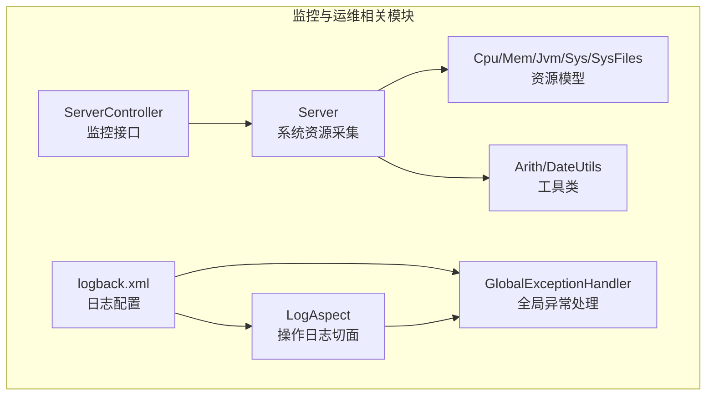
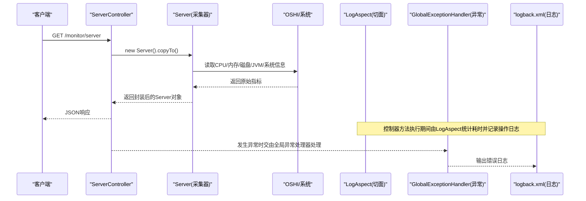
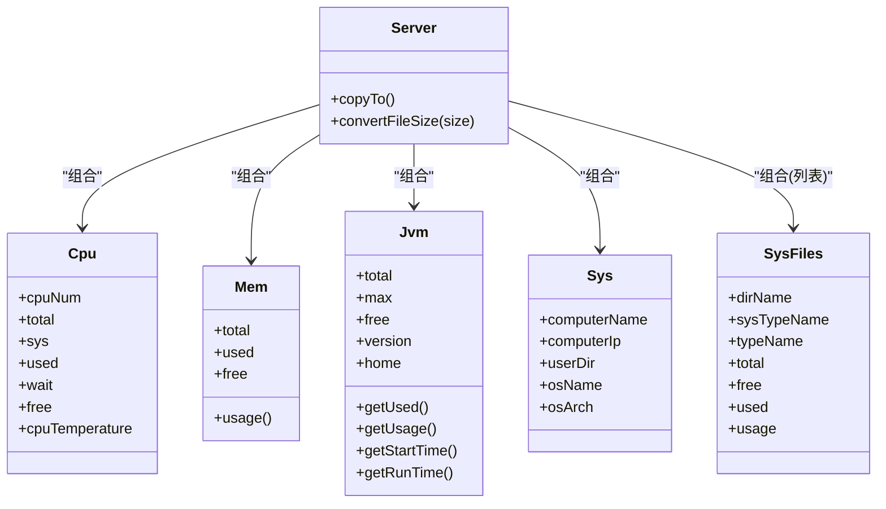
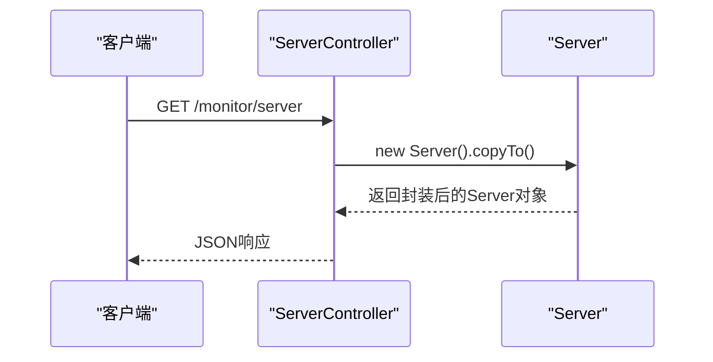
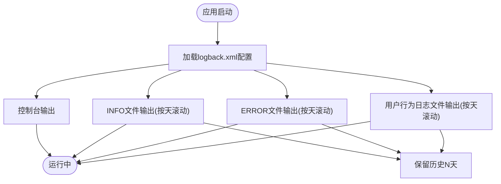
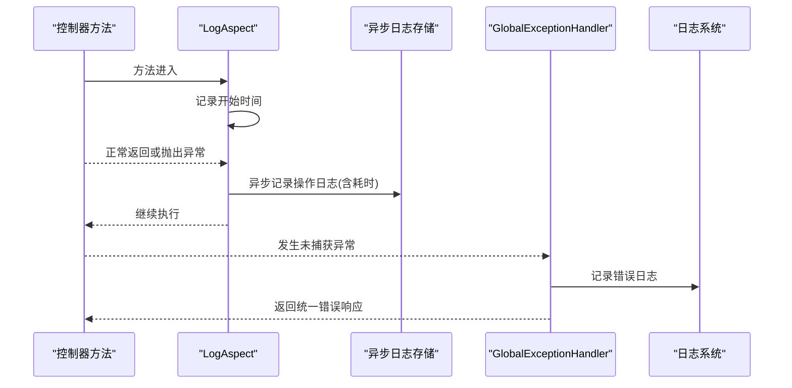
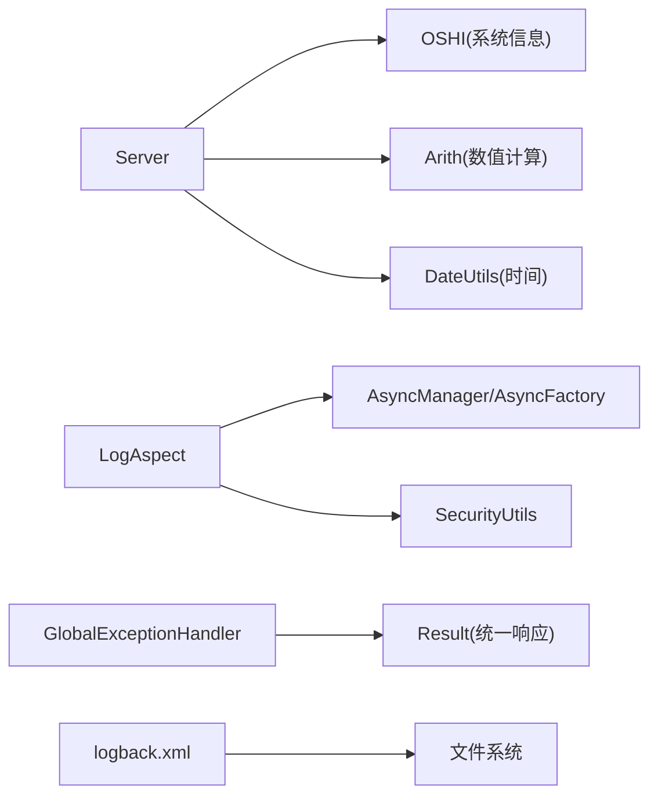

# 性能监控与运维管理

<cite>
**本文引用的文件**
- [logback.xml](file://blog-admin/src/main/resources/logback.xml)
- [application.yml](file://blog-admin/src/main/resources/application.yml)
- [Cpu.java](file://blog-framework/src/main/java/blog/framework/web/domain/server/Cpu.java)
- [Mem.java](file://blog-framework/src/main/java/blog/framework/web/domain/server/Mem.java)
- [Jvm.java](file://blog-framework/src/main/java/blog/framework/web/domain/server/Jvm.java)
- [Sys.java](file://blog-framework/src/main/java/blog/framework/web/domain/server/Sys.java)
- [SysFiles.java](file://blog-framework/src/main/java/blog/framework/web/domain/server/SysFiles.java)
- [Server.java](file://blog-framework/src/main/java/blog/framework/web/domain/Server.java)
- [ServerController.java](file://blog-admin/src/main/java/blog/web/controller/monitor/ServerController.java)
- [LogAspect.java](file://blog-framework/src/main/java/blog/framework/aspectj/LogAspect.java)
- [GlobalExceptionHandler.java](file://blog-framework/src/main/java/blog/framework/web/exception/GlobalExceptionHandler.java)
- [Arith.java](file://blog-common/src/main/java/blog/common/utils/Arith.java)
- [DateUtils.java](file://blog-common/src/main/java/blog/common/utils/DateUtils.java)
</cite>

## 目录
1. [简介](#简介)
2. [项目结构](#项目结构)
3. [核心组件](#核心组件)
4. [架构总览](#架构总览)
5. [详细组件分析](#详细组件分析)
6. [依赖分析](#依赖分析)
7. [性能考虑](#性能考虑)
8. [故障排查指南](#故障排查指南)
9. [结论](#结论)
10. [附录](#附录)

## 简介
本指南围绕“性能监控与运维管理”主题，结合代码库中的系统资源监控、业务性能监控、日志管理与告警机制现状，提供可落地的运维实践建议与优化思路。内容涵盖：
- 系统资源监控：CPU、内存、磁盘、JVM、操作系统信息的采集与展示
- 业务性能监控：接口耗时、异常统计、错误率等关键指标的采集与呈现
- 日志管理：日志级别、滚动策略、聚合与分析流程
- 告警机制：规则配置、通知渠道、升级策略与处理流程
- 故障排查与应急处理：常见问题定位、快速恢复步骤
- 性能优化与最佳实践：面向稳定性的持续改进建议

## 项目结构
该代码库采用多模块分层组织，与监控与运维相关的模块与文件主要分布在以下位置：
- 系统资源监控模型与采集：framework 模块中的 server 域对象与 Server 采集器
- 监控接口：admin 模块中的 ServerController 提供统一监控数据查询入口
- 日志配置：admin 模块中的 logback.xml 定义日志输出与滚动策略
- 全局异常处理：framework 模块中的 GlobalExceptionHandler 统一异常拦截与日志记录
- 操作日志切面：framework 模块中的 LogAspect 统计接口耗时与记录操作日志
- 工具类：common 模块中的 Arith、DateUtils 提供数值计算与时间处理能力

图表来源
- [ServerController.java:1-26](file://blog-admin/src/main/java/blog/web/controller/monitor/ServerController.java#L1-L26)
- [Server.java:1-221](file://blog-framework/src/main/java/blog/framework/web/domain/Server.java#L1-L221)
- [Cpu.java:1-102](file://blog-framework/src/main/java/blog/framework/web/domain/server/Cpu.java#L1-L102)
- [Mem.java:1-54](file://blog-framework/src/main/java/blog/framework/web/domain/server/Mem.java#L1-L54)
- [Jvm.java:1-115](file://blog-framework/src/main/java/blog/framework/web/domain/server/Jvm.java#L1-L115)
- [Sys.java:1-74](file://blog-framework/src/main/java/blog/framework/web/domain/server/Sys.java#L1-L74)
- [SysFiles.java:1-100](file://blog-framework/src/main/java/blog/framework/web/domain/server/SysFiles.java#L1-L100)
- [LogAspect.java:1-231](file://blog-framework/src/main/java/blog/framework/aspectj/LogAspect.java#L1-L231)
- [GlobalExceptionHandler.java:1-134](file://blog-framework/src/main/java/blog/framework/web/exception/GlobalExceptionHandler.java#L1-L134)
- [logback.xml:1-93](file://blog-admin/src/main/resources/logback.xml#L1-L93)
- [Arith.java:1-113](file://blog-common/src/main/java/blog/common/utils/Arith.java#L1-L113)
- [DateUtils.java:1-170](file://blog-common/src/main/java/blog/common/utils/DateUtils.java#L1-L170)

章节来源
- [ServerController.java:1-26](file://blog-admin/src/main/java/blog/web/controller/monitor/ServerController.java#L1-L26)
- [Server.java:1-221](file://blog-framework/src/main/java/blog/framework/web/domain/Server.java#L1-L221)
- [logback.xml:1-93](file://blog-admin/src/main/resources/logback.xml#L1-L93)

## 核心组件
- 系统资源模型与采集
  - Cpu：CPU核心数、总使用率、系统/用户/等待/空闲使用率、温度
  - Mem：内存总量、已用、剩余、使用率
  - Jvm：JVM总/最大/空闲内存、使用率、版本、运行时间等
  - Sys：主机名、IP、操作系统、架构、项目路径
  - SysFiles：磁盘挂载点、类型、总量/已用/剩余、使用率
  - Server：通过 OSHI 采集 CPU、内存、磁盘、JVM、系统信息，并提供单位换算与格式化
- 监控接口
  - ServerController：对外提供统一的系统监控数据查询接口
- 日志与异常
  - LogAspect：基于注解的控制器方法耗时统计与操作日志落库
  - GlobalExceptionHandler：统一异常拦截与错误响应
  - logback.xml：控制台与文件输出、按天滚动、INFO/ERROR 分离、用户行为日志

章节来源
- [Cpu.java:1-102](file://blog-framework/src/main/java/blog/framework/web/domain/server/Cpu.java#L1-L102)
- [Mem.java:1-54](file://blog-framework/src/main/java/blog/framework/web/domain/server/Mem.java#L1-L54)
- [Jvm.java:1-115](file://blog-framework/src/main/java/blog/framework/web/domain/server/Jvm.java#L1-L115)
- [Sys.java:1-74](file://blog-framework/src/main/java/blog/framework/web/domain/server/Sys.java#L1-L74)
- [SysFiles.java:1-100](file://blog-framework/src/main/java/blog/framework/web/domain/server/SysFiles.java#L1-L100)
- [Server.java:1-221](file://blog-framework/src/main/java/blog/framework/web/domain/Server.java#L1-L221)
- [ServerController.java:1-26](file://blog-admin/src/main/java/blog/web/controller/monitor/ServerController.java#L1-L26)
- [LogAspect.java:1-231](file://blog-framework/src/main/java/blog/framework/aspectj/LogAspect.java#L1-L231)
- [GlobalExceptionHandler.java:1-134](file://blog-framework/src/main/java/blog/framework/web/exception/GlobalExceptionHandler.java#L1-L134)
- [logback.xml:1-93](file://blog-admin/src/main/resources/logback.xml#L1-L93)

## 架构总览
下图展示了从接口调用到系统资源采集与日志记录的整体流程。

图表来源
- [ServerController.java:1-26](file://blog-admin/src/main/java/blog/web/controller/monitor/ServerController.java#L1-L26)
- [Server.java:1-221](file://blog-framework/src/main/java/blog/framework/web/domain/Server.java#L1-L221)
- [LogAspect.java:1-231](file://blog-framework/src/main/java/blog/framework/aspectj/LogAspect.java#L1-L231)
- [GlobalExceptionHandler.java:1-134](file://blog-framework/src/main/java/blog/framework/web/exception/GlobalExceptionHandler.java#L1-L134)
- [logback.xml:1-93](file://blog-admin/src/main/resources/logback.xml#L1-L93)

## 详细组件分析

### 系统资源监控模型与采集
- 数据模型职责清晰，分别覆盖 CPU、内存、JVM、系统与磁盘信息，便于前端展示与后续扩展
- Server 通过 OSHI 采集真实系统指标，并在采集前后进行采样以计算 CPU 使用率
- 单位换算与格式化由 Arith、DateUtils 提供，确保数值精度与显示一致性

图表来源
- [Server.java:1-221](file://blog-framework/src/main/java/blog/framework/web/domain/Server.java#L1-L221)
- [Cpu.java:1-102](file://blog-framework/src/main/java/blog/framework/web/domain/server/Cpu.java#L1-L102)
- [Mem.java:1-54](file://blog-framework/src/main/java/blog/framework/web/domain/server/Mem.java#L1-L54)
- [Jvm.java:1-115](file://blog-framework/src/main/java/blog/framework/web/domain/server/Jvm.java#L1-L115)
- [Sys.java:1-74](file://blog-framework/src/main/java/blog/framework/web/domain/server/Sys.java#L1-L74)
- [SysFiles.java:1-100](file://blog-framework/src/main/java/blog/framework/web/domain/server/SysFiles.java#L1-L100)

章节来源
- [Server.java:1-221](file://blog-framework/src/main/java/blog/framework/web/domain/Server.java#L1-L221)
- [Arith.java:1-113](file://blog-common/src/main/java/blog/common/utils/Arith.java#L1-L113)
- [DateUtils.java:1-170](file://blog-common/src/main/java/blog/common/utils/DateUtils.java#L1-L170)

### 监控接口与数据展示
- ServerController 提供统一的监控数据查询入口，权限控制基于注解
- 接口返回 Server 对象，内部包含 CPU、内存、JVM、系统与磁盘等完整指标

图表来源
- [ServerController.java:1-26](file://blog-admin/src/main/java/blog/web/controller/monitor/ServerController.java#L1-L26)
- [Server.java:1-221](file://blog-framework/src/main/java/blog/framework/web/domain/Server.java#L1-L221)

章节来源
- [ServerController.java:1-26](file://blog-admin/src/main/java/blog/web/controller/monitor/ServerController.java#L1-L26)

### 日志管理策略
- 日志输出
  - 控制台输出：便于开发调试
  - 文件输出：INFO/ERROR 分别写入不同文件，按天滚动，保留历史天数
  - 用户行为日志：独立 appender，便于审计与追踪
- 日志级别
  - 应用包与 Spring 日志级别在配置文件中集中管理
- 日志聚合与分析
  - 可通过集中式日志平台对接文件输出，实现统一检索与可视化

图表来源
- [logback.xml:1-93](file://blog-admin/src/main/resources/logback.xml#L1-L93)

章节来源
- [logback.xml:1-93](file://blog-admin/src/main/resources/logback.xml#L1-L93)
- [application.yml:30-35](file://blog-admin/src/main/resources/application.yml#L30-L35)

### 业务性能监控与异常处理
- 接口耗时统计
  - LogAspect 在控制器方法执行前后记录时间，计算耗时并写入操作日志
- 异常统一处理
  - GlobalExceptionHandler 捕获各类异常，统一输出错误响应并记录日志
- 错误率与吞吐量
  - 可基于操作日志表与异常日志进行统计分析，形成错误率与吞吐量指标

图表来源
- [LogAspect.java:1-231](file://blog-framework/src/main/java/blog/framework/aspectj/LogAspect.java#L1-L231)
- [GlobalExceptionHandler.java:1-134](file://blog-framework/src/main/java/blog/framework/web/exception/GlobalExceptionHandler.java#L1-L134)

章节来源
- [LogAspect.java:1-231](file://blog-framework/src/main/java/blog/framework/aspectj/LogAspect.java#L1-L231)
- [GlobalExceptionHandler.java:1-134](file://blog-framework/src/main/java/blog/framework/web/exception/GlobalExceptionHandler.java#L1-L134)

### 告警机制设计（基于现有能力的扩展建议）
当前代码库具备如下基础能力：
- 日志分级与滚动：logback.xml 支持 INFO/ERROR 分离与按天滚动
- 统一日志输出：GlobalExceptionHandler 统一记录异常
- 操作日志切面：LogAspect 记录接口耗时与请求参数/响应摘要

在此基础上，建议引入以下告警机制：
- 告警规则配置
  - CPU/内存/JVM使用率阈值
  - 磁盘使用率阈值
  - 接口错误率阈值、平均响应时间阈值
  - 异常数量阈值
- 告警通知渠道
  - 邮件、企业微信、钉钉机器人等
- 告警升级策略
  - 多级阈值触发不同级别告警，超时未处理自动升级
- 告警处理流程
  - 告警接收 → 自动派单/升级 → 处理人确认 → 处置与闭环 → 复盘归档

说明：以上为基于现有日志与异常处理能力的扩展建议，非当前代码实现。

## 依赖分析
- Server 依赖 OSHI 采集系统指标，依赖 Arith 进行数值计算，依赖 DateUtils 获取运行时间
- LogAspect 依赖 AsyncManager/AsyncFactory 异步落库，依赖安全工具获取登录用户信息
- GlobalExceptionHandler 依赖 Result 统一响应包装
- logback.xml 依赖 Spring Boot 日志配置与文件系统

图表来源
- [Server.java:1-221](file://blog-framework/src/main/java/blog/framework/web/domain/Server.java#L1-L221)
- [Arith.java:1-113](file://blog-common/src/main/java/blog/common/utils/Arith.java#L1-L113)
- [DateUtils.java:1-170](file://blog-common/src/main/java/blog/common/utils/DateUtils.java#L1-L170)
- [LogAspect.java:1-231](file://blog-framework/src/main/java/blog/framework/aspectj/LogAspect.java#L1-L231)
- [GlobalExceptionHandler.java:1-134](file://blog-framework/src/main/java/blog/framework/web/exception/GlobalExceptionHandler.java#L1-L134)
- [logback.xml:1-93](file://blog-admin/src/main/resources/logback.xml#L1-L93)

章节来源
- [Server.java:1-221](file://blog-framework/src/main/java/blog/framework/web/domain/Server.java#L1-L221)
- [LogAspect.java:1-231](file://blog-framework/src/main/java/blog/framework/aspectj/LogAspect.java#L1-L231)
- [GlobalExceptionHandler.java:1-134](file://blog-framework/src/main/java/blog/framework/web/exception/GlobalExceptionHandler.java#L1-L134)
- [logback.xml:1-93](file://blog-admin/src/main/resources/logback.xml#L1-L93)

## 性能考虑
- 系统资源采集
  - Server 在采集 CPU 使用率时进行两次采样并间隔固定时间，避免瞬时波动影响准确性
  - 内存与磁盘使用量采用系统 API 直接获取，保证实时性
- 数值计算与格式化
  - 使用 Arith 进行高精度计算与四舍五入，避免浮点误差累积
  - 时间差计算与格式化由 DateUtils 提供，减少重复逻辑
- 日志性能
  - INFO/ERROR 分离与按天滚动降低单文件体积，提升检索效率
  - 控制台输出仅在开发环境启用，生产环境建议关闭或降级

章节来源
- [Server.java:1-221](file://blog-framework/src/main/java/blog/framework/web/domain/Server.java#L1-L221)
- [Arith.java:1-113](file://blog-common/src/main/java/blog/common/utils/Arith.java#L1-L113)
- [DateUtils.java:1-170](file://blog-common/src/main/java/blog/common/utils/DateUtils.java#L1-L170)
- [logback.xml:1-93](file://blog-admin/src/main/resources/logback.xml#L1-L93)

## 故障排查指南
- 常见问题识别
  - CPU 使用率持续偏高：检查是否存在热点接口或长时间任务
  - 内存泄漏/碎片：关注 JVM 使用率与 GC 行为，结合操作日志定位异常请求
  - 磁盘空间不足：监控磁盘使用率阈值，及时清理或扩容
  - 接口频繁报错：查看 GlobalExceptionHandler 输出的错误日志与堆栈
- 快速定位技巧
  - 结合 LogAspect 记录的耗时与请求参数，快速定位慢接口与异常请求
  - 通过用户行为日志与操作日志交叉比对，还原用户操作路径
- 应急响应流程
  - 观测：采集系统资源与业务指标，确认异常范围
  - 降载：临时限流/熔断，保护核心链路
  - 处置：根据日志与指标定位根因，修复或回滚
  - 复盘：沉淀告警规则与应急预案，持续改进

章节来源
- [LogAspect.java:1-231](file://blog-framework/src/main/java/blog/framework/aspectj/LogAspect.java#L1-L231)
- [GlobalExceptionHandler.java:1-134](file://blog-framework/src/main/java/blog/framework/web/exception/GlobalExceptionHandler.java#L1-L134)
- [logback.xml:1-93](file://blog-admin/src/main/resources/logback.xml#L1-L93)

## 结论
本代码库在系统资源监控、业务性能观测与日志管理方面已具备良好基础：
- Server 与 server 域模型提供了全面的系统指标采集与封装
- ServerController 提供了统一的监控数据查询接口
- LogAspect 与 GlobalExceptionHandler 构建了完善的日志与异常处理体系
在此基础上，建议进一步完善告警机制与日志分析能力，以实现从“可观测”到“可预警、可处置”的闭环运维体系。

## 附录
- 配置参考
  - 日志路径与级别：logback.xml
  - 应用端口与线程池：application.yml
- 关键类一览
  - ServerController：监控接口
  - Server：系统资源采集器
  - LogAspect：操作日志切面
  - GlobalExceptionHandler：全局异常处理
  - Cpu/Mem/Jvm/Sys/SysFiles：系统资源模型