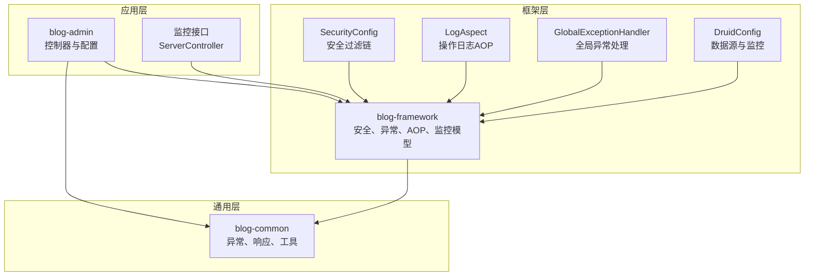
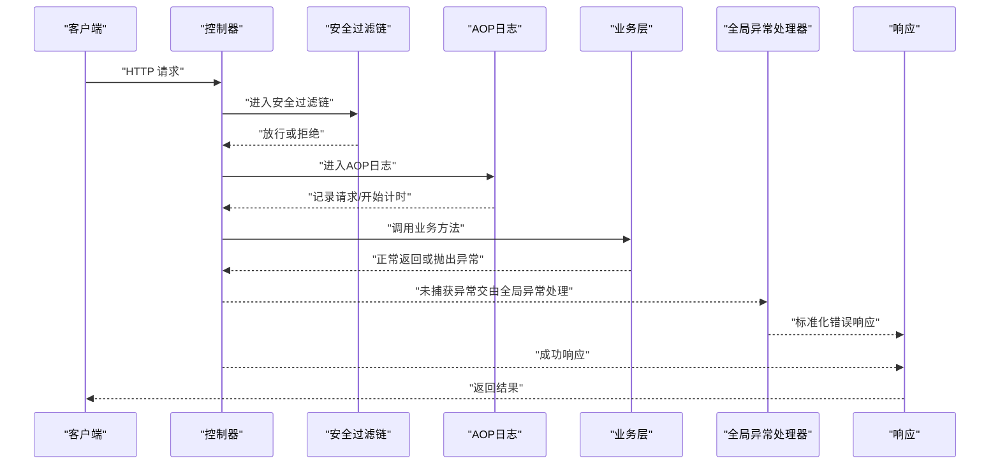
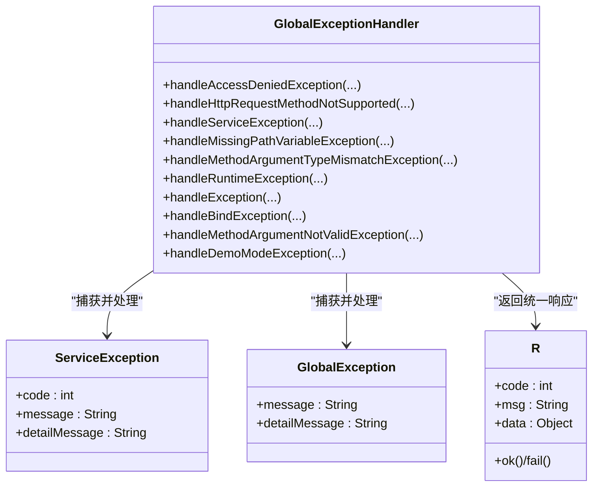
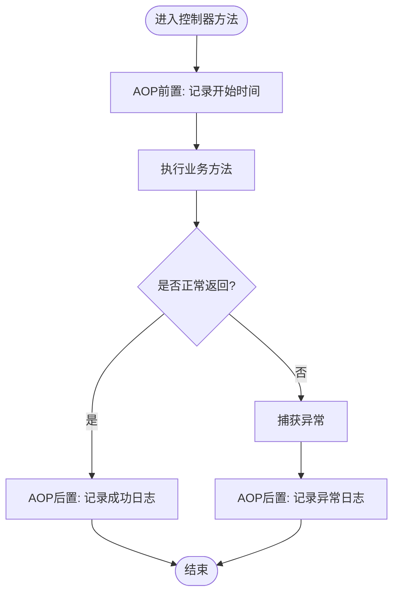
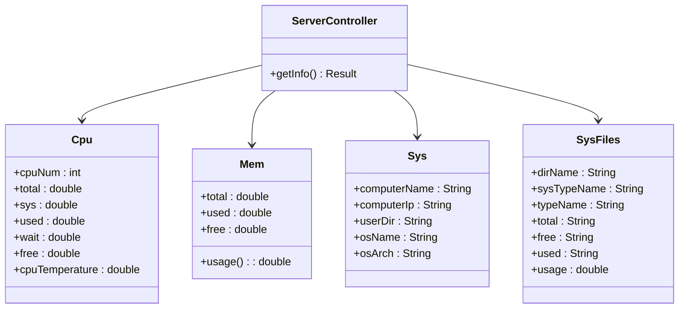
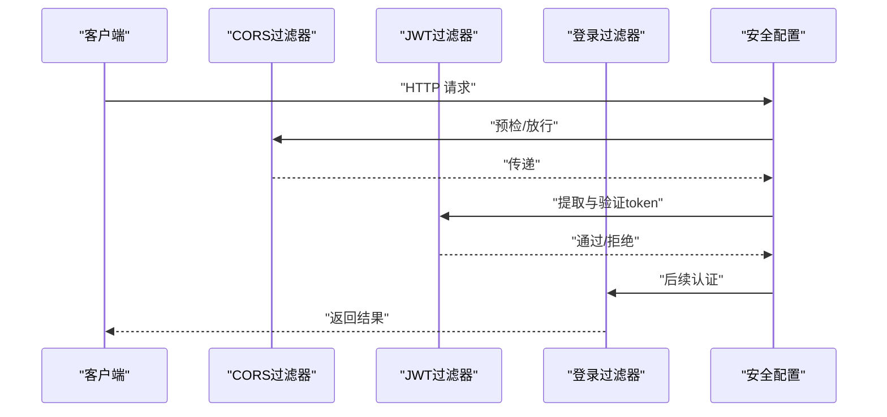
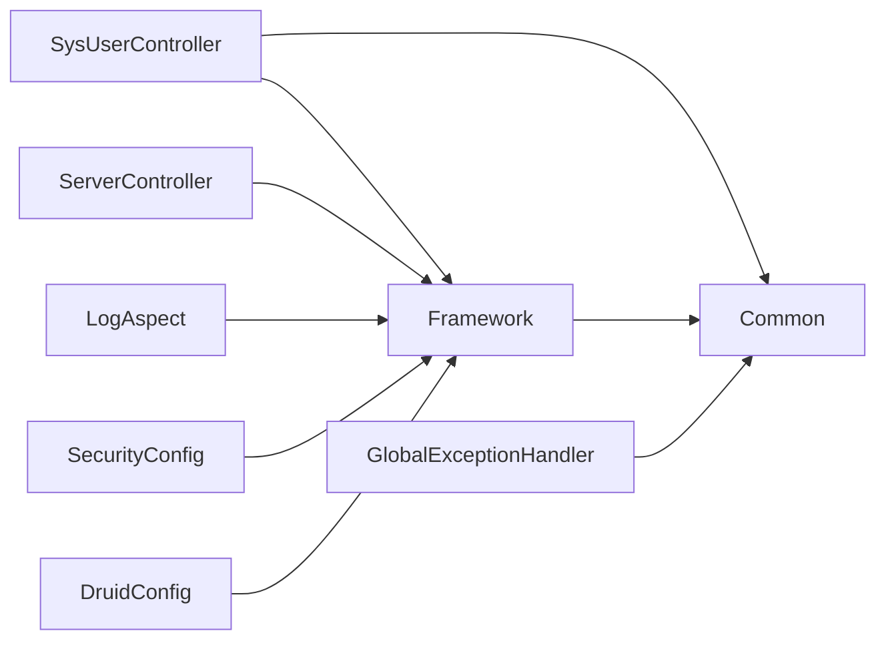

# 故障排查与应急响应

<cite>
**本文引用的文件**
- [GlobalExceptionHandler.java](file://blog-framework/src/main/java/blog/framework/web/exception/GlobalExceptionHandler.java)
- [GlobalException.java](file://blog-common/src/main/java/blog/common/exception/GlobalException.java)
- [ServiceException.java](file://blog-common/src/main/java/blog/common/exception/ServiceException.java)
- [R.java](file://blog-common/src/main/java/blog/common/base/resp/R.java)
- [application.yml](file://blog-admin/src/main/resources/application.yml)
- [logback.xml](file://blog-admin/src/main/resources/logback.xml)
- [LogAspect.java](file://blog-framework/src/main/java/blog/framework/aspectj/LogAspect.java)
- [SysUserController.java](file://blog-admin/src/main/java/blog/web/controller/system/SysUserController.java)
- [ServerController.java](file://blog-admin/src/main/java/blog/web/controller/monitor/ServerController.java)
- [Cpu.java](file://blog-framework/src/main/java/blog/framework/web/domain/server/Cpu.java)
- [Mem.java](file://blog-framework/src/main/java/blog/framework/web/domain/server/Mem.java)
- [Sys.java](file://blog-framework/src/main/java/blog/framework/web/domain/server/Sys.java)
- [SysFiles.java](file://blog-framework/src/main/java/blog/framework/web/domain/server/SysFiles.java)
- [SecurityConfig.java](file://blog-framework/src/main/java/blog/framework/config/SecurityConfig.java)
- [ServletUtils.java](file://blog-common/src/main/java/blog/common/utils/ServletUtils.java)
- [ExceptionUtil.java](file://blog-common/src/main/java/blog/common/utils/ExceptionUtil.java)
- [DruidConfig.java](file://blog-framework/src/main/java/blog/framework/config/DruidConfig.java)
</cite>

## 目录
1. [简介](#简介)
2. [项目结构](#项目结构)
3. [核心组件](#核心组件)
4. [架构总览](#架构总览)
5. [详细组件分析](#详细组件分析)
6. [依赖分析](#依赖分析)
7. [性能考量](#性能考量)
8. [故障排查指南](#故障排查指南)
9. [应急响应流程](#应急响应流程)
10. [工具与命令清单](#工具与命令清单)
11. [预防措施](#预防措施)
12. [结论](#结论)

## 简介
本手册面向运维与开发团队，提供针对本项目的“故障排查与应急响应”标准操作流程。内容覆盖常见故障类型识别、快速定位技巧、应急响应流程、实用工具清单以及预防性运维建议，并结合系统内置的异常处理与监控能力，说明自动检测与快速恢复机制。

## 项目结构
本项目采用多模块分层架构，关键模块如下：
- blog-admin：Web 控制器与应用配置
- blog-framework：框架层（安全、监控、异常、AOP 日志、数据源）
- blog-common：通用工具、异常体系、响应封装、常量与实体基类
- blog-biz、blog-system、blog-generator、blog-quartz：业务与扩展模块

图表来源
- [ServerController.java:15-25](file://blog-admin/src/main/java/blog/web/controller/monitor/ServerController.java#L15-L25)
- [SecurityConfig.java:94-126](file://blog-framework/src/main/java/blog/framework/config/SecurityConfig.java#L94-L126)
- [LogAspect.java:42-134](file://blog-framework/src/main/java/blog/framework/aspectj/LogAspect.java#L42-L134)
- [GlobalExceptionHandler.java:27-133](file://blog-framework/src/main/java/blog/framework/web/exception/GlobalExceptionHandler.java#L27-L133)
- [DruidConfig.java:33-72](file://blog-framework/src/main/java/blog/framework/config/DruidConfig.java#L33-L72)

章节来源
- [application.yml:12-161](file://blog-admin/src/main/resources/application.yml#L12-L161)
- [logback.xml:1-93](file://blog-admin/src/main/resources/logback.xml#L1-L93)

## 核心组件
- 全局异常处理：统一捕获各类异常，标准化返回格式，记录错误日志，便于快速定位。
- 操作日志AOP：拦截控制器方法，记录请求、响应、耗时、异常等信息，支撑审计与排障。
- 监控模型：CPU、内存、系统、磁盘等指标模型，配合监控接口对外暴露。
- 安全配置：基于 JWT 的无状态认证与鉴权，减少会话层面的故障面。
- 数据源与监控：Druid 多数据源与监控页面，辅助数据库层面的故障排查。

章节来源
- [GlobalExceptionHandler.java:27-133](file://blog-framework/src/main/java/blog/framework/web/exception/GlobalExceptionHandler.java#L27-L133)
- [LogAspect.java:42-134](file://blog-framework/src/main/java/blog/framework/aspectj/LogAspect.java#L42-L134)
- [Cpu.java:10-101](file://blog-framework/src/main/java/blog/framework/web/domain/server/Cpu.java#L10-L101)
- [Mem.java:10-53](file://blog-framework/src/main/java/blog/framework/web/domain/server/Mem.java#L10-L53)
- [Sys.java:8-73](file://blog-framework/src/main/java/blog/framework/web/domain/server/Sys.java#L8-L73)
- [SysFiles.java:8-99](file://blog-framework/src/main/java/blog/framework/web/domain/server/SysFiles.java#L8-L99)
- [SecurityConfig.java:94-126](file://blog-framework/src/main/java/blog/framework/config/SecurityConfig.java#L94-L126)
- [DruidConfig.java:33-72](file://blog-framework/src/main/java/blog/framework/config/DruidConfig.java#L33-L72)

## 架构总览
系统通过控制器接收请求，经过安全过滤链与AOP日志切面，进入业务层，异常由全局异常处理器统一捕获并返回。监控接口聚合系统与数据库指标，供运维查看。

图表来源
- [ServerController.java:18-24](file://blog-admin/src/main/java/blog/web/controller/monitor/ServerController.java#L18-L24)
- [SecurityConfig.java:94-126](file://blog-framework/src/main/java/blog/framework/config/SecurityConfig.java#L94-L126)
- [LogAspect.java:60-134](file://blog-framework/src/main/java/blog/framework/aspectj/LogAspect.java#L60-L134)
- [GlobalExceptionHandler.java:89-104](file://blog-framework/src/main/java/blog/framework/web/exception/GlobalExceptionHandler.java#L89-L104)

## 详细组件分析

### 全局异常处理机制
- 覆盖范围：权限不足、请求方式不支持、业务异常、参数绑定/校验异常、缺失路径变量、参数类型不匹配、运行时异常、系统异常、演示模式异常等。
- 返回规范：统一使用响应封装对象，包含状态码、消息与数据，便于前端与监控系统解析。
- 日志记录：对异常进行错误级别日志记录，包含请求URI、参数与堆栈摘要，支撑快速定位。

图表来源
- [GlobalExceptionHandler.java:27-133](file://blog-framework/src/main/java/blog/framework/web/exception/GlobalExceptionHandler.java#L27-L133)
- [ServiceException.java:8-65](file://blog-common/src/main/java/blog/common/exception/ServiceException.java#L8-L65)
- [GlobalException.java:8-51](file://blog-common/src/main/java/blog/common/exception/GlobalException.java#L8-L51)
- [R.java:12-106](file://blog-common/src/main/java/blog/common/base/resp/R.java#L12-L106)

章节来源
- [GlobalExceptionHandler.java:34-132](file://blog-framework/src/main/java/blog/framework/web/exception/GlobalExceptionHandler.java#L34-L132)
- [ServiceException.java:34-65](file://blog-common/src/main/java/blog/common/exception/ServiceException.java#L34-L65)
- [R.java:31-73](file://blog-common/src/main/java/blog/common/base/resp/R.java#L31-L73)

### 操作日志AOP
- 切入点：标注了操作日志注解的控制器方法。
- 记录内容：用户、IP、URL、方法、请求方式、请求参数、响应结果、耗时、异常信息。
- 异步落库：通过异步任务将操作日志写入数据库，降低对主流程影响。

图表来源
- [LogAspect.java:60-134](file://blog-framework/src/main/java/blog/framework/aspectj/LogAspect.java#L60-L134)

章节来源
- [LogAspect.java:86-134](file://blog-framework/src/main/java/blog/framework/aspectj/LogAspect.java#L86-L134)

### 监控与系统指标
- 指标模型：CPU 使用率、内存使用率、系统信息、磁盘使用情况等。
- 暴露接口：监控控制器提供统一查询入口，便于集成监控面板或脚本采集。

图表来源
- [ServerController.java:18-24](file://blog-admin/src/main/java/blog/web/controller/monitor/ServerController.java#L18-L24)
- [Cpu.java:10-101](file://blog-framework/src/main/java/blog/framework/web/domain/server/Cpu.java#L10-L101)
- [Mem.java:10-53](file://blog-framework/src/main/java/blog/framework/web/domain/server/Mem.java#L10-L53)
- [Sys.java:8-73](file://blog-framework/src/main/java/blog/framework/web/domain/server/Sys.java#L8-L73)
- [SysFiles.java:8-99](file://blog-framework/src/main/java/blog/framework/web/domain/server/SysFiles.java#L8-L99)

章节来源
- [ServerController.java:18-24](file://blog-admin/src/main/java/blog/web/controller/monitor/ServerController.java#L18-L24)

### 安全过滤链
- 无状态认证：基于 JWT 的无 Session 设计，降低会话故障风险。
- 路由规则：允许匿名访问的地址白名单、静态资源放行、其余请求需鉴权。
- 过滤器顺序：CORS → JWT → 登录过滤器等，确保跨域与认证正确生效。

图表来源
- [SecurityConfig.java:94-126](file://blog-framework/src/main/java/blog/framework/config/SecurityConfig.java#L94-L126)

章节来源
- [SecurityConfig.java:94-126](file://blog-framework/src/main/java/blog/framework/config/SecurityConfig.java#L94-L126)

### 数据源与数据库监控
- 多数据源：主从切换、动态数据源装配。
- Druid 监控：移除监控页广告、统计视图启用等。

章节来源
- [DruidConfig.java:33-115](file://blog-framework/src/main/java/blog/framework/config/DruidConfig.java#L33-L115)

## 依赖分析
- 控制器依赖框架层的安全、AOP与异常处理；依赖通用层的响应封装与工具。
- 异常处理依赖通用层的异常类型与响应封装。
- 监控接口依赖框架层的系统指标模型。
- 安全配置贯穿请求生命周期，影响异常处理与日志记录的上下文。

图表来源
- [SysUserController.java:42-232](file://blog-admin/src/main/java/blog/web/controller/system/SysUserController.java#L42-L232)
- [ServerController.java:15-25](file://blog-admin/src/main/java/blog/web/controller/monitor/ServerController.java#L15-L25)
- [GlobalExceptionHandler.java:27-133](file://blog-framework/src/main/java/blog/framework/web/exception/GlobalExceptionHandler.java#L27-L133)
- [LogAspect.java:42-134](file://blog-framework/src/main/java/blog/framework/aspectj/LogAspect.java#L42-L134)
- [SecurityConfig.java:31-136](file://blog-framework/src/main/java/blog/framework/config/SecurityConfig.java#L31-L136)
- [DruidConfig.java:33-115](file://blog-framework/src/main/java/blog/framework/config/DruidConfig.java#L33-L115)

## 性能考量
- 线程池与Tomcat参数：可通过配置调整最大线程、最小空闲线程、接受队列长度等，以应对突发流量。
- 日志级别：生产环境建议降低DEBUG级别，避免IO瓶颈。
- 异步日志：利用AOP异步记录操作日志，避免阻塞请求。
- 数据库连接池：合理配置Druid连接池参数，避免连接泄漏与超时。

章节来源
- [application.yml:13-29](file://blog-admin/src/main/resources/application.yml#L13-L29)
- [logback.xml:74-87](file://blog-admin/src/main/resources/logback.xml#L74-L87)
- [LogAspect.java:124-126](file://blog-framework/src/main/java/blog/framework/aspectj/LogAspect.java#L124-L126)

## 故障排查指南

### 常见故障类型与特征
- 系统崩溃/不可用
  - 特征：大量5xx错误、接口超时、监控面板无数据。
  - 诊断要点：检查进程存活、端口监听、日志ERROR级别、Tomcat线程池饱和。
- 性能下降
  - 特征：接口RT上升、CPU/内存占用高、数据库慢查询增多。
  - 诊断要点：采集CPU/内存/IO、数据库连接数、慢日志、GC日志。
- 数据异常
  - 特征：数据不一致、导入失败、业务逻辑错误。
  - 诊断要点：核对事务边界、幂等性、唯一键冲突、业务校验。
- 网络中断
  - 特征：跨域失败、鉴权失败、外部服务不可达。
  - 诊断要点：检查CORS配置、防火墙、DNS、代理与证书。

章节来源
- [SecurityConfig.java:108-126](file://blog-framework/src/main/java/blog/framework/config/SecurityConfig.java#L108-L126)
- [application.yml:13-29](file://blog-admin/src/main/resources/application.yml#L13-L29)

### 快速定位技巧
- 日志分析法
  - 关注ERROR级别日志与异常堆栈，结合请求URI与参数定位。
  - 使用AOP日志记录的耗时与异常信息，快速缩小范围。
- 性能分析法
  - 采集系统指标（CPU/内存/IO），观察峰值与持续时间。
  - 结合数据库慢查询与连接池状态，定位瓶颈。
- 网络诊断法
  - 使用浏览器开发者工具与抓包工具，确认CORS、鉴权头、状态码。
  - 检查安全配置中的匿名放行与静态资源路径。
- 数据库检查法
  - 查看Druid监控页、慢SQL、连接池告警。
  - 核对主从同步、事务隔离与锁等待。

章节来源
- [logback.xml:38-58](file://blog-admin/src/main/resources/logback.xml#L38-L58)
- [LogAspect.java:86-134](file://blog-framework/src/main/java/blog/framework/aspectj/LogAspect.java#L86-L134)
- [DruidConfig.java:78-115](file://blog-framework/src/main/java/blog/framework/config/DruidConfig.java#L78-L115)
- [SecurityConfig.java:108-126](file://blog-framework/src/main/java/blog/framework/config/SecurityConfig.java#L108-L126)

### 故障处理工具与命令
- 系统监控命令
  - Linux：top、htop、iostat、pidstat、netstat、ss、lsof
  - JVM：jstack、jstat、jmap、jcmd（GC、线程、堆分析）
- 网络诊断工具
  - curl、wget、tcpdump、Wireshark、nslookup/dig
- 数据库检查
  - MySQL：SHOW PROCESSLIST、SHOW ENGINE INNODB STATUS、慢查询日志
  - Druid：访问监控页，查看SQL统计与连接池状态
- 日志分析
  - grep/awk/sed 过滤ERROR与异常堆栈
  - ELK/Kibana（如接入）集中检索

章节来源
- [DruidConfig.java:78-115](file://blog-framework/src/main/java/blog/framework/config/DruidConfig.java#L78-L115)
- [logback.xml:38-58](file://blog-admin/src/main/resources/logback.xml#L38-L58)

## 应急响应流程

### 流程说明
- 故障发现：监控告警、用户反馈、日志ERROR、接口RT异常。
- 影响评估：确定影响范围（用户数、业务模块、数据一致性）、SLA影响。
- 应急启动：成立应急小组、冻结变更、开启紧急通道。
- 处理执行：隔离问题、回滚变更、扩容资源、修复缺陷。
- 恢复验证：功能回归、性能回归、数据一致性校验。
- 总结改进：根因分析、补丁发布、预案修订、演练测试。

章节来源
- [GlobalExceptionHandler.java:89-104](file://blog-framework/src/main/java/blog/framework/web/exception/GlobalExceptionHandler.java#L89-L104)
- [LogAspect.java:111-114](file://blog-framework/src/main/java/blog/framework/aspectj/LogAspect.java#L111-L114)

### 关键节点与职责
- 运维：监控告警、日志巡检、资源扩容、数据库与中间件维护。
- 开发：根因定位、缺陷修复、回滚方案、补丁发布。
- 安全：鉴权与访问控制核查、CORS与跨域策略审查。
- 测试：回归验证、压测与演练。

## 工具与命令清单

### 系统与容器
- top/htop：查看CPU与进程
- iostat/pidstat：查看IO与线程
- ss/netstat：查看端口与连接
- lsof：查看文件与套接字
- jstack/jstat：JVM线程与GC分析

### 网络
- curl/wget：验证接口可用性
- tcpdump/Wireshark：抓包分析
- nslookup/dig：DNS解析验证

### 数据库
- MySQL：SHOW PROCESSLIST、慢查询日志、Innodb状态
- Druid：监控页SQL统计、连接池状态

### 日志
- grep/awk/sed：快速过滤ERROR与异常堆栈
- 日志轮转与保留策略：按天滚动、最大历史天数

章节来源
- [logback.xml:16-58](file://blog-admin/src/main/resources/logback.xml#L16-L58)
- [DruidConfig.java:78-115](file://blog-framework/src/main/java/blog/framework/config/DruidConfig.java#L78-L115)

## 预防措施
- 容量规划
  - 基于历史峰值与增长趋势，预留CPU/内存/IO/带宽与连接池空间。
- 冗余设计
  - 多实例部署、负载均衡、数据库主从与读写分离。
- 备份策略
  - 数据库与配置文件定期备份、可验证恢复。
- 演练测试
  - 定期进行故障演练（混沌工程、压测、灾备切换）。
- 变更治理
  - 变更评审、灰度发布、回滚预案、自动化测试。

## 结论
本项目通过全局异常处理、AOP日志、安全过滤链与监控模型，构建了可观测、可恢复的基础能力。结合本文提供的排查方法、应急流程与工具清单，可有效缩短故障定位与恢复时间，提升系统稳定性与可靠性。