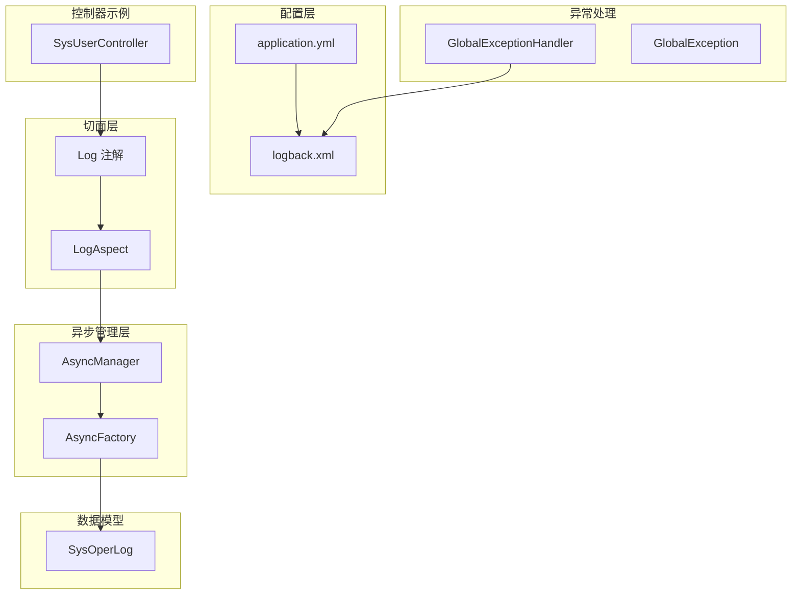
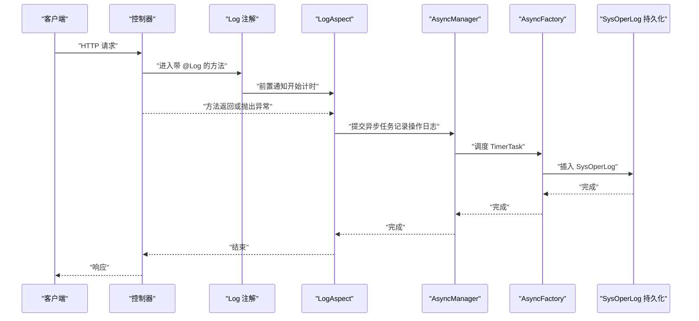
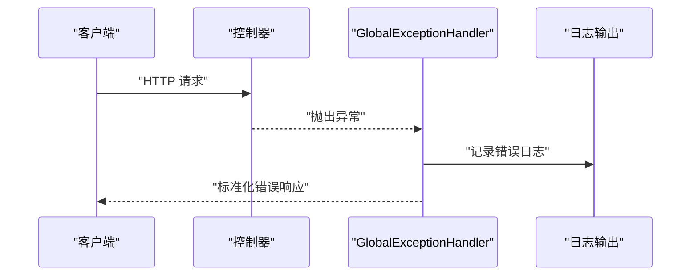
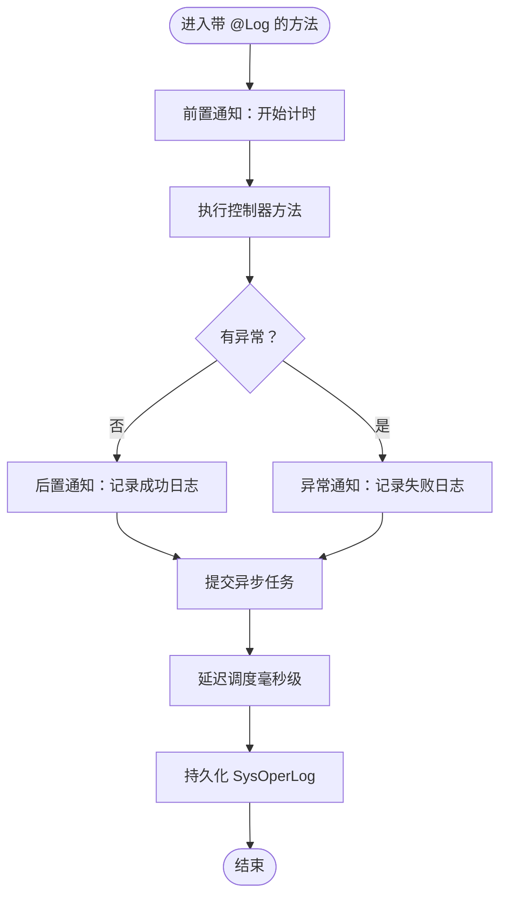
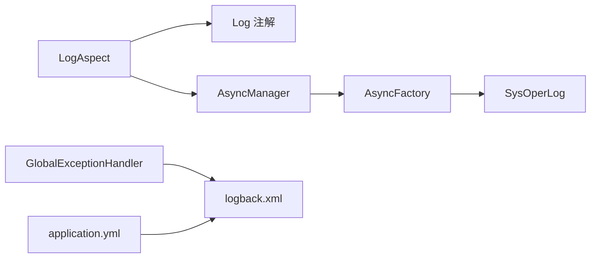

# 日志管理

<cite>
**本文引用的文件**
- [logback.xml](file://blog-admin/src/main/resources/logback.xml)
- [application.yml](file://blog-admin/src/main/resources/application.yml)
- [GlobalExceptionHandler.java](file://blog-framework/src/main/java/blog/framework/web/exception/GlobalExceptionHandler.java)
- [GlobalException.java](file://blog-common/src/main/java/blog/common/exception/GlobalException.java)
- [LogAspect.java](file://blog-framework/src/main/java/blog/framework/aspectj/LogAspect.java)
- [AsyncManager.java](file://blog-framework/src/main/java/blog/framework/manager/AsyncManager.java)
- [AsyncFactory.java](file://blog-framework/src/main/java/blog/framework/manager/factory/AsyncFactory.java)
- [SysOperLog.java](file://blog-system/src/main/java/blog/system/domain/SysOperLog.java)
- [Log.java](file://blog-common/src/main/java/blog/common/annotation/Log.java)
- [BusinessType.java](file://blog-common/src/main/java/blog/common/enums/BusinessType.java)
- [OperatorType.java](file://blog-common/src/main/java/blog/common/enums/OperatorType.java)
- [LogUtils.java](file://blog-common/src/main/java/blog/common/utils/LogUtils.java)
- [SysUserController.java](file://blog-admin/src/main/java/blog/web/controller/system/SysUserController.java)
</cite>

## 目录
1. [简介](#简介)
2. [项目结构](#项目结构)
3. [核心组件](#核心组件)
4. [架构总览](#架构总览)
5. [详细组件分析](#详细组件分析)
6. [依赖关系分析](#依赖关系分析)
7. [性能考虑](#性能考虑)
8. [故障排查指南](#故障排查指南)
9. [结论](#结论)
10. [附录](#附录)

## 简介
本文件面向日志管理系统，围绕以下目标展开：日志级别配置策略（DEBUG/INFO/WARN/ERROR）、日志轮转机制（按时间轮转与保留策略）、日志聚合与集中化（可扩展至ELK/Fluentd/Logstash）、日志分析与检索（关键词/正则/统计）、全局异常处理（含统一异常最佳实践与错误码设计）、以及日志性能优化（异步日志、批量写入、缓冲管理）。文档以仓库现有实现为基础，结合架构图与流程图进行说明。

## 项目结构
日志相关能力由“配置层（Logback/YAML）+ 切面层（操作日志切面）+ 异步管理层 + 全局异常处理 + 数据模型”构成，分别位于如下模块：
- 配置层：日志格式、输出位置、按级别/按时间轮转、根日志器与模块日志器级别
- 切面层：通过注解拦截控制器方法，采集请求/响应、参数、耗时、异常等信息
- 异步管理层：将日志落库任务异步化，降低请求路径阻塞
- 全局异常处理：统一捕获各类异常，标准化返回与日志记录
- 数据模型：操作日志实体，持久化存储

图表来源
- [logback.xml:1-93](file://blog-admin/src/main/resources/logback.xml#L1-L93)
- [application.yml:30-35](file://blog-admin/src/main/resources/application.yml#L30-L35)
- [LogAspect.java:1-231](file://blog-framework/src/main/java/blog/framework/aspectj/LogAspect.java#L1-L231)
- [AsyncManager.java:1-54](file://blog-framework/src/main/java/blog/framework/manager/AsyncManager.java#L1-L54)
- [AsyncFactory.java:1-93](file://blog-framework/src/main/java/blog/framework/manager/factory/AsyncFactory.java#L1-L93)
- [SysOperLog.java:1-134](file://blog-system/src/main/java/blog/system/domain/SysOperLog.java#L1-L134)
- [GlobalExceptionHandler.java:1-134](file://blog-framework/src/main/java/blog/framework/web/exception/GlobalExceptionHandler.java#L1-L134)
- [GlobalException.java:1-51](file://blog-common/src/main/java/blog/common/exception/GlobalException.java#L1-L51)
- [SysUserController.java:1-200](file://blog-admin/src/main/java/blog/web/controller/system/SysUserController.java#L1-L200)

章节来源
- [logback.xml:1-93](file://blog-admin/src/main/resources/logback.xml#L1-L93)
- [application.yml:30-35](file://blog-admin/src/main/resources/application.yml#L30-L35)

## 核心组件
- 日志配置与轮转
  - 使用 Logback 的 RollingFileAppender 与 TimeBasedRollingPolicy，按天滚动，保留历史天数
  - 通过 LevelFilter 仅记录指定级别（如 INFO/ERROR），减少冗余
  - 控制台输出与文件输出分离，便于开发与生产差异化配置
- 操作日志切面
  - 通过注解拦截控制器方法，自动采集用户、IP、URL、方法、请求/响应参数、耗时、异常等
  - 敏感字段过滤，避免日志泄露
  - 异步落库，降低接口延迟
- 全局异常处理
  - 统一捕获常见异常，记录日志并返回标准化结果
  - 支持业务异常码透传，便于前端识别
- 异步日志与异步任务
  - AsyncManager 提供定时调度，延迟执行（毫秒级）
  - AsyncFactory 将登录日志与操作日志封装为任务，交由线程池异步执行
- 数据模型
  - SysOperLog 定义操作日志字段，支持查询、统计与报表

章节来源
- [logback.xml:15-92](file://blog-admin/src/main/resources/logback.xml#L15-L92)
- [LogAspect.java:42-134](file://blog-framework/src/main/java/blog/framework/aspectj/LogAspect.java#L42-L134)
- [AsyncManager.java:15-53](file://blog-framework/src/main/java/blog/framework/manager/AsyncManager.java#L15-L53)
- [AsyncFactory.java:25-91](file://blog-framework/src/main/java/blog/framework/manager/factory/AsyncFactory.java#L25-L91)
- [SysOperLog.java:22-133](file://blog-system/src/main/java/blog/system/domain/SysOperLog.java#L22-L133)
- [GlobalExceptionHandler.java:27-133](file://blog-framework/src/main/java/blog/framework/web/exception/GlobalExceptionHandler.java#L27-L133)

## 架构总览
下图展示从请求到日志落库的关键路径，包括切面采集、异步调度与持久化。

图表来源
- [LogAspect.java:60-134](file://blog-framework/src/main/java/blog/framework/aspectj/LogAspect.java#L60-L134)
- [AsyncManager.java:43-45](file://blog-framework/src/main/java/blog/framework/manager/AsyncManager.java#L43-L45)
- [AsyncFactory.java:82-91](file://blog-framework/src/main/java/blog/framework/manager/factory/AsyncFactory.java#L82-L91)
- [SysOperLog.java:22-133](file://blog-system/src/main/java/blog/system/domain/SysOperLog.java#L22-L133)

## 详细组件分析

### 日志级别配置策略
- 模块级别
  - 应用包名前缀（如 blog）在 YAML 中设置为 debug，便于开发阶段定位问题
  - Spring 框架日志在 YAML 中设置为 warn，避免框架噪声干扰
- 根日志器与输出
  - 根日志器在 XML 中设置为 info，并绑定控制台输出
  - 系统操作日志根日志器在 XML 中设置为 info，并绑定文件输出（INFO/ERROR 分离）
- 级别过滤
  - INFO/ERROR 文件 Appender 使用 LevelFilter，仅记录对应级别，避免混杂

应用建议
- 开发环境：将模块级别设为 debug，快速定位问题
- 生产环境：模块级别 info/warn，结合按天轮转与保留策略，平衡可观测性与磁盘占用

章节来源
- [application.yml:32-34](file://blog-admin/src/main/resources/application.yml#L32-L34)
- [logback.xml:74-87](file://blog-admin/src/main/resources/logback.xml#L74-L87)

### 日志轮转机制
- 轮转策略
  - TimeBasedRollingPolicy：按日期滚动，文件名包含日期后缀
  - 保留策略：maxHistory=60，最多保留60天日志
- 输出目标
  - sys-info.log：仅记录 INFO 级别
  - sys-error.log：仅记录 ERROR 级别
  - sys-user.log：用户访问日志，按天滚动
- 建议
  - 如需按大小轮转，可在 RollingPolicy 中引入 SizeBasedTriggeringPolicy 与 CleanUpPolicy
  - 可增加压缩策略（如 gzip）以节省空间

章节来源
- [logback.xml:16-72](file://blog-admin/src/main/resources/logback.xml#L16-L72)

### 日志聚合与集中化管理
- 当前实现
  - 本地文件输出，日志分散在各节点
- 集成建议
  - ELK Stack：在各节点安装 Filebeat，采集本地日志并发送至 Logstash/ES
  - Fluentd/Fluent Bit：轻量采集器，支持多协议与插件扩展
  - 日志标签：为不同模块（业务、系统、用户）打上标签，便于检索与可视化
  - 结构化日志：建议输出 JSON，便于解析与字段化

[本节为概念性说明，不直接分析具体文件]

### 日志分析与检索
- 关键词搜索：基于文本检索，适用于临时排查
- 正则表达式：用于提取特定字段（如用户ID、请求路径、异常堆栈）
- 统计分析：按模块、用户、接口、状态码、耗时等维度统计
- 建议
  - 在切面中保留必要上下文字段（用户、租户、TraceId），便于跨服务关联
  - 对高频异常建立告警规则

[本节为概念性说明，不直接分析具体文件]

### 全局异常处理机制
- 统一捕获
  - 捕获权限不足、请求方法不支持、参数绑定/类型不匹配、业务异常、运行时异常、通用异常等
  - 对每类异常记录日志并返回标准化结果
- 错误码设计
  - 使用统一的状态码常量（如 SUCCESS/ERROR/4xx/5xx），便于前端识别
  - 业务异常可携带自定义 code，便于业务侧区分
- 最佳实践
  - 对外仅暴露必要信息，避免泄露内部细节
  - 记录异常堆栈与上下文（请求URI、参数摘要等）

图表来源
- [GlobalExceptionHandler.java:34-104](file://blog-framework/src/main/java/blog/framework/web/exception/GlobalExceptionHandler.java#L34-L104)
- [application.yml:8-93](file://blog-admin/src/main/resources/application.yml#L8-L93)

章节来源
- [GlobalExceptionHandler.java:27-133](file://blog-framework/src/main/java/blog/framework/web/exception/GlobalExceptionHandler.java#L27-L133)
- [GlobalException.java:8-50](file://blog-common/src/main/java/blog/common/exception/GlobalException.java#L8-L50)
- [application.yml:8-93](file://blog-admin/src/main/resources/application.yml#L8-L93)

### 操作日志采集与异步落库
- 注解驱动
  - 在控制器方法上使用 @Log，声明模块、业务类型、是否保存请求/响应参数等
- 切面采集
  - 前置通知开始计时，后置通知或异常通知均会触发日志记录
  - 自动填充用户、IP、URL、方法、请求/响应参数、耗时、异常信息
  - 敏感字段过滤（如密码），避免泄露
- 异步落库
  - 通过 AsyncManager 延迟（毫秒级）调度，交由 AsyncFactory 封装为任务
  - 任务最终调用服务层插入 SysOperLog

图表来源
- [LogAspect.java:60-134](file://blog-framework/src/main/java/blog/framework/aspectj/LogAspect.java#L60-L134)
- [AsyncManager.java:43-45](file://blog-framework/src/main/java/blog/framework/manager/AsyncManager.java#L43-L45)
- [AsyncFactory.java:82-91](file://blog-framework/src/main/java/blog/framework/manager/factory/AsyncFactory.java#L82-L91)
- [SysOperLog.java:22-133](file://blog-system/src/main/java/blog/system/domain/SysOperLog.java#L22-L133)

章节来源
- [Log.java:20-50](file://blog-common/src/main/java/blog/common/annotation/Log.java#L20-L50)
- [BusinessType.java:8-58](file://blog-common/src/main/java/blog/common/enums/BusinessType.java#L8-L58)
- [OperatorType.java:8-23](file://blog-common/src/main/java/blog/common/enums/OperatorType.java#L8-L23)
- [LogAspect.java:143-229](file://blog-framework/src/main/java/blog/framework/aspectj/LogAspect.java#L143-L229)
- [AsyncManager.java:15-53](file://blog-framework/src/main/java/blog/framework/manager/AsyncManager.java#L15-L53)
- [AsyncFactory.java:25-91](file://blog-framework/src/main/java/blog/framework/manager/factory/AsyncFactory.java#L25-L91)
- [SysOperLog.java:22-133](file://blog-system/src/main/java/blog/system/domain/SysOperLog.java#L22-L133)
- [SysUserController.java:68-86](file://blog-admin/src/main/java/blog/web/controller/system/SysUserController.java#L68-L86)

### 日志性能优化
- 异步日志
  - AsyncManager 使用 ScheduledExecutorService 延迟调度，降低同步阻塞
- 批量写入
  - 可在 AsyncFactory 中引入批处理队列，合并写入数据库
- 缓冲区管理
  - Logback 默认缓冲区策略可满足大多数场景；高吞吐时可调整 encoder/bufferedIO 等参数
- 敏感信息过滤
  - 切面中对敏感字段进行排除，减少无效日志与序列化开销
- 建议
  - 控制日志量级（如仅在异常时记录完整参数）
  - 使用结构化日志（JSON）提升解析效率

章节来源
- [AsyncManager.java:24-45](file://blog-framework/src/main/java/blog/framework/manager/AsyncManager.java#L24-L45)
- [LogAspect.java:200-229](file://blog-framework/src/main/java/blog/framework/aspectj/LogAspect.java#L200-L229)
- [logback.xml:25-27](file://blog-admin/src/main/resources/logback.xml#L25-L27)

## 依赖关系分析
- 切面依赖
  - LogAspect 依赖注解（Log）、安全工具、IP 工具、异步管理器、操作日志实体
- 异步依赖
  - AsyncManager 依赖 Spring 线程池 Bean；AsyncFactory 依赖服务层接口与日志记录器
- 配置依赖
  - application.yml 控制模块日志级别；logback.xml 控制输出位置、轮转与级别过滤

图表来源
- [LogAspect.java:1-35](file://blog-framework/src/main/java/blog/framework/aspectj/LogAspect.java#L1-L35)
- [AsyncManager.java:24-31](file://blog-framework/src/main/java/blog/framework/manager/AsyncManager.java#L24-L31)
- [AsyncFactory.java:16-18](file://blog-framework/src/main/java/blog/framework/manager/factory/AsyncFactory.java#L16-L18)
- [SysOperLog.java:1-13](file://blog-system/src/main/java/blog/system/domain/SysOperLog.java#L1-L13)
- [GlobalExceptionHandler.java:27-28](file://blog-framework/src/main/java/blog/framework/web/exception/GlobalExceptionHandler.java#L27-L28)
- [logback.xml:1-13](file://blog-admin/src/main/resources/logback.xml#L1-L13)
- [application.yml:30-35](file://blog-admin/src/main/resources/application.yml#L30-L35)

章节来源
- [LogAspect.java:1-35](file://blog-framework/src/main/java/blog/framework/aspectj/LogAspect.java#L1-L35)
- [AsyncManager.java:24-31](file://blog-framework/src/main/java/blog/framework/manager/AsyncManager.java#L24-L31)
- [AsyncFactory.java:16-18](file://blog-framework/src/main/java/blog/framework/manager/factory/AsyncFactory.java#L16-L18)
- [SysOperLog.java:1-13](file://blog-system/src/main/java/blog/system/domain/SysOperLog.java#L1-L13)
- [GlobalExceptionHandler.java:27-28](file://blog-framework/src/main/java/blog/framework/web/exception/GlobalExceptionHandler.java#L27-L28)
- [logback.xml:1-13](file://blog-admin/src/main/resources/logback.xml#L1-L13)
- [application.yml:30-35](file://blog-admin/src/main/resources/application.yml#L30-L35)

## 性能考虑
- I/O 吞吐
  - 使用异步落库与延迟调度，避免阻塞主线程
- 日志量控制
  - 通过级别过滤与敏感字段过滤，减少无效日志
- 存储成本
  - 合理设置 maxHistory 与轮转策略，避免磁盘压力
- 解析效率
  - 建议采用结构化日志（JSON），便于下游解析与检索

[本节为通用指导，不直接分析具体文件]

## 故障排查指南
- 日志不输出
  - 检查 application.yml 中模块日志级别是否过高（如 debug），或 logback.xml 中根日志器级别是否为 info
- 日志级别不生效
  - 确认模块日志器（如 blog）与 Spring 日志器（org.springframework）级别配置
- 操作日志未入库
  - 确认控制器方法是否添加 @Log 注解
  - 检查 AsyncManager 线程池是否可用，AsyncFactory 任务是否提交
- 异常未统一处理
  - 检查 GlobalExceptionHandler 是否被 Spring 扫描，异常类型是否覆盖

章节来源
- [application.yml:32-34](file://blog-admin/src/main/resources/application.yml#L32-L34)
- [logback.xml:74-87](file://blog-admin/src/main/resources/logback.xml#L74-L87)
- [LogAspect.java:126-134](file://blog-framework/src/main/java/blog/framework/aspectj/LogAspect.java#L126-L134)
- [AsyncManager.java:24-31](file://blog-framework/src/main/java/blog/framework/manager/AsyncManager.java#L24-L31)
- [GlobalExceptionHandler.java:34-104](file://blog-framework/src/main/java/blog/framework/web/exception/GlobalExceptionHandler.java#L34-L104)

## 结论
本系统通过 Logback 的按天轮转与级别过滤、注解驱动的操作日志采集、异步落库与全局异常处理，构建了清晰、可控且可扩展的日志体系。建议在生产环境中进一步引入集中化日志平台与结构化日志，配合合理的保留策略与告警规则，持续提升可观测性与运维效率。

[本节为总结性内容，不直接分析具体文件]

## 附录
- 日志输出位置与格式
  - 输出位置：由 log.path 属性控制
  - 输出格式：包含时间、线程、级别、Logger、方法行号、消息
- 常用日志文件
  - sys-info.log：INFO 级别系统日志
  - sys-error.log：ERROR 级别系统日志
  - sys-user.log：用户访问日志

章节来源
- [logback.xml:4-6](file://blog-admin/src/main/resources/logback.xml#L4-L6)
- [logback.xml:16-72](file://blog-admin/src/main/resources/logback.xml#L16-L72)