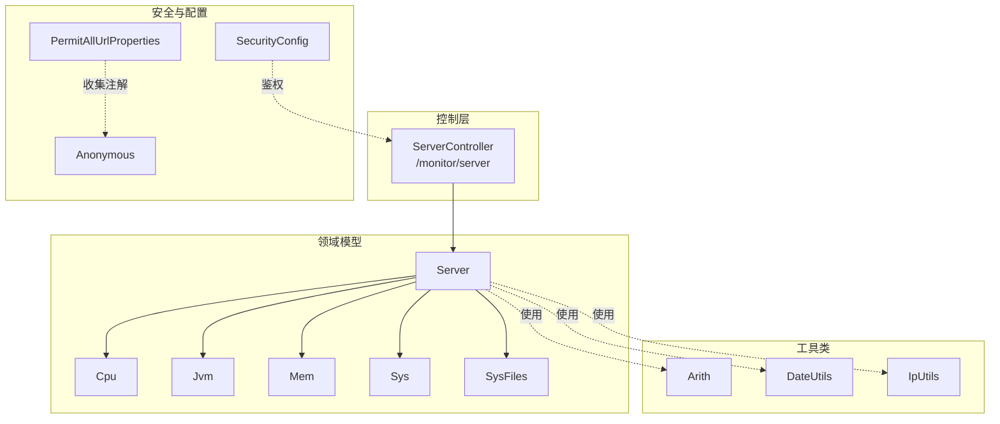
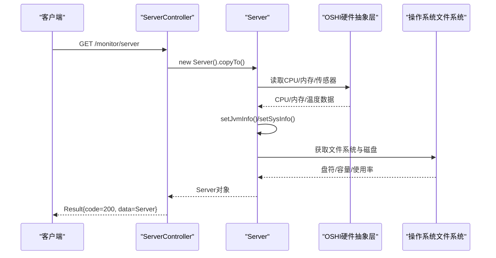
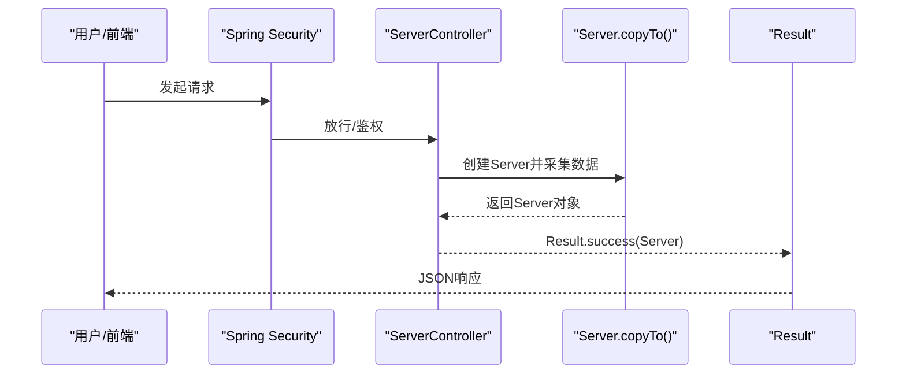
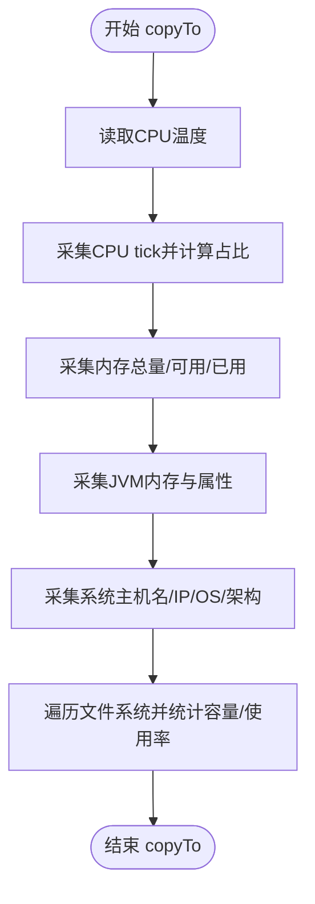
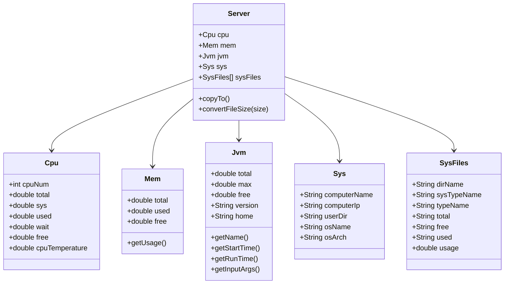
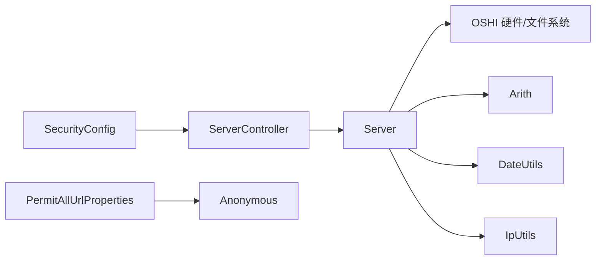

# 系统资源监控

<cite>
**本文引用的文件**
- [ServerController.java](file://blog-admin/src/main/java/blog/web/controller/monitor/ServerController.java)
- [Server.java](file://blog-framework/src/main/java/blog/framework/web/domain/Server.java)
- [Cpu.java](file://blog-framework/src/main/java/blog/framework/web/domain/server/Cpu.java)
- [Jvm.java](file://blog-framework/src/main/java/blog/framework/web/domain/server/Jvm.java)
- [Mem.java](file://blog-framework/src/main/java/blog/framework/web/domain/server/Mem.java)
- [Sys.java](file://blog-framework/src/main/java/blog/framework/web/domain/server/Sys.java)
- [SysFiles.java](file://blog-framework/src/main/java/blog/framework/web/domain/server/SysFiles.java)
- [Arith.java](file://blog-common/src/main/java/blog/common/utils/Arith.java)
- [DateUtils.java](file://blog-common/src/main/java/blog/common/utils/DateUtils.java)
- [IpUtils.java](file://blog-common/src/main/java/blog/common/utils/ip/IpUtils.java)
- [application.yml](file://blog-admin/src/main/resources/application.yml)
- [SecurityConfig.java](file://blog-framework/src/main/java/blog/framework/config/SecurityConfig.java)
- [PermitAllUrlProperties.java](file://blog-framework/src/main/java/blog/framework/config/properties/PermitAllUrlProperties.java)
- [Anonymous.java](file://blog-common/src/main/java/blog/common/annotation/Anonymous.java)
</cite>

## 目录
1. [简介](#简介)
2. [项目结构](#项目结构)
3. [核心组件](#核心组件)
4. [架构总览](#架构总览)
5. [详细组件分析](#详细组件分析)
6. [依赖分析](#依赖分析)
7. [性能考量](#性能考量)
8. [故障排查指南](#故障排查指南)
9. [结论](#结论)
10. [附录](#附录)

## 简介
本文件围绕系统资源监控能力进行深入说明，涵盖服务器硬件资源（CPU、内存、磁盘、温度）、JVM运行时指标（堆内存、GC状态、线程与运行参数）、以及系统文件监控（磁盘IO与存储空间）。同时，结合ServerController的REST接口设计与调用方式，给出监控数据采集、展示与策略建议（阈值、异常检测、基线建立），并提供可视化与历史趋势分析的实现思路。

## 项目结构
监控相关代码主要分布在以下模块与包中：
- 控制层：blog-admin 模块的 monitor 包，提供REST接口
- 领域模型：blog-framework 模块的 framework.web.domain 及子包 server，封装各类监控指标
- 工具类：blog-common 模块的 utils 与 ip 子包，提供数值计算、时间与IP解析等支撑
- 安全与配置：blog-framework 的 security 与 config 包，控制接口鉴权与放行策略

**图示来源**
- [ServerController.java:1-26](file://blog-admin/src/main/java/blog/web/controller/monitor/ServerController.java#L1-L26)
- [Server.java:1-221](file://blog-framework/src/main/java/blog/framework/web/domain/Server.java#L1-L221)
- [Cpu.java:1-102](file://blog-framework/src/main/java/blog/framework/web/domain/server/Cpu.java#L1-L102)
- [Jvm.java:1-115](file://blog-framework/src/main/java/blog/framework/web/domain/server/Jvm.java#L1-L115)
- [Mem.java:1-54](file://blog-framework/src/main/java/blog/framework/web/domain/server/Mem.java#L1-L54)
- [Sys.java:1-74](file://blog-framework/src/main/java/blog/framework/web/domain/server/Sys.java#L1-L74)
- [SysFiles.java:1-100](file://blog-framework/src/main/java/blog/framework/web/domain/server/SysFiles.java#L1-L100)
- [Arith.java:1-113](file://blog-common/src/main/java/blog/common/utils/Arith.java#L1-L113)
- [DateUtils.java:1-170](file://blog-common/src/main/java/blog/common/utils/DateUtils.java#L1-L170)
- [IpUtils.java:1-324](file://blog-common/src/main/java/blog/common/utils/ip/IpUtils.java#L1-L324)
- [SecurityConfig.java:1-137](file://blog-framework/src/main/java/blog/framework/config/SecurityConfig.java#L1-L137)
- [PermitAllUrlProperties.java:1-77](file://blog-framework/src/main/java/blog/framework/config/properties/PermitAllUrlProperties.java#L1-L77)
- [Anonymous.java:1-19](file://blog-common/src/main/java/blog/common/annotation/Anonymous.java#L1-L19)

**章节来源**
- [ServerController.java:1-26](file://blog-admin/src/main/java/blog/web/controller/monitor/ServerController.java#L1-L26)
- [Server.java:1-221](file://blog-framework/src/main/java/blog/framework/web/domain/Server.java#L1-L221)
- [application.yml:1-161](file://blog-admin/src/main/resources/application.yml#L1-L161)

## 核心组件
- Server：聚合所有监控指标，负责采集与格式化（CPU、内存、JVM、系统信息、磁盘文件）
- Cpu：CPU核心数、使用率、系统/用户/等待/空闲占比、温度
- Jvm：JVM内存总量/最大/空闲/已用、版本/路径、启动时间/运行时长、输入参数
- Mem：系统内存总量/已用/空闲、使用率
- Sys：服务器主机名/IP、操作系统/架构、项目路径
- SysFiles：磁盘挂载点、类型、总/剩余/已用容量、使用率
- Arith：统一的高精度数值计算（加减乘除、四舍五入）
- DateUtils：时间格式化、服务器启动时间、运行时长计算
- IpUtils：主机名与IP解析

**章节来源**
- [Server.java:31-221](file://blog-framework/src/main/java/blog/framework/web/domain/Server.java#L31-L221)
- [Cpu.java:10-102](file://blog-framework/src/main/java/blog/framework/web/domain/server/Cpu.java#L10-L102)
- [Jvm.java:13-115](file://blog-framework/src/main/java/blog/framework/web/domain/server/Jvm.java#L13-L115)
- [Mem.java:10-54](file://blog-framework/src/main/java/blog/framework/web/domain/server/Mem.java#L10-L54)
- [Sys.java:8-74](file://blog-framework/src/main/java/blog/framework/web/domain/server/Sys.java#L8-L74)
- [SysFiles.java:8-100](file://blog-framework/src/main/java/blog/framework/web/domain/server/SysFiles.java#L8-L100)
- [Arith.java:11-113](file://blog-common/src/main/java/blog/common/utils/Arith.java#L11-L113)
- [DateUtils.java:21-170](file://blog-common/src/main/java/blog/common/utils/DateUtils.java#L21-L170)
- [IpUtils.java:15-324](file://blog-common/src/main/java/blog/common/utils/ip/IpUtils.java#L15-L324)

## 架构总览
监控数据采集采用“控制器-领域模型-系统库”的分层设计：
- 控制器层：ServerController 提供REST接口，返回Server聚合对象
- 领域模型层：Server 调用 OSHI/HardwareAbstractionLayer 等系统库采集硬件与文件系统信息，并填充各子模型
- 工具类层：Arith/DateUtils/IpUtils 提供数值、时间与IP解析支撑
- 安全层：SecurityConfig 与 PermitAllUrlProperties 配合 @Anonymous 控制匿名访问策略

**图示来源**
- [ServerController.java:18-24](file://blog-admin/src/main/java/blog/web/controller/monitor/ServerController.java#L18-L24)
- [Server.java:99-116](file://blog-framework/src/main/java/blog/framework/web/domain/Server.java#L99-L116)
- [application.yml:125-137](file://blog-admin/src/main/resources/application.yml#L125-L137)

## 详细组件分析

### ServerController 接口设计与调用
- 接口路径：/monitor/server
- 方法：GET
- 权限：基于方法级注解的授权检查
- 返回：Result.success(Server)，其中Server包含CPU、内存、JVM、系统与磁盘信息

**图示来源**
- [ServerController.java:18-24](file://blog-admin/src/main/java/blog/web/controller/monitor/ServerController.java#L18-L24)
- [SecurityConfig.java:94-127](file://blog-framework/src/main/java/blog/framework/config/SecurityConfig.java#L94-L127)
- [PermitAllUrlProperties.java:37-62](file://blog-framework/src/main/java/blog/framework/config/properties/PermitAllUrlProperties.java#L37-L62)
- [Anonymous.java:14-18](file://blog-common/src/main/java/blog/common/annotation/Anonymous.java#L14-L18)

**章节来源**
- [ServerController.java:1-26](file://blog-admin/src/main/java/blog/web/controller/monitor/ServerController.java#L1-L26)
- [SecurityConfig.java:1-137](file://blog-framework/src/main/java/blog/framework/config/SecurityConfig.java#L1-L137)
- [PermitAllUrlProperties.java:1-77](file://blog-framework/src/main/java/blog/framework/config/properties/PermitAllUrlProperties.java#L1-L77)
- [Anonymous.java:1-19](file://blog-common/src/main/java/blog/common/annotation/Anonymous.java#L1-L19)

### Server 采集流程与数据模型
- 采集入口：copyTo() 统一调度各子模块采集
- CPU：两次tick采样求差，计算总/系统/用户/等待/空闲占比与温度
- 内存：总/可用/已用，计算使用率
- JVM：运行时内存总量/最大/空闲，系统属性（版本/路径）
- 系统：主机名/IP/OS/架构/用户目录
- 磁盘：遍历文件系统，计算容量与使用率

**图示来源**
- [Server.java:99-116](file://blog-framework/src/main/java/blog/framework/web/domain/Server.java#L99-L116)
- [Server.java:121-141](file://blog-framework/src/main/java/blog/framework/web/domain/Server.java#L121-L141)
- [Server.java:146-150](file://blog-framework/src/main/java/blog/framework/web/domain/Server.java#L146-L150)
- [Server.java:167-174](file://blog-framework/src/main/java/blog/framework/web/domain/Server.java#L167-L174)
- [Server.java:179-196](file://blog-framework/src/main/java/blog/framework/web/domain/Server.java#L179-L196)

**章节来源**
- [Server.java:99-221](file://blog-framework/src/main/java/blog/framework/web/domain/Server.java#L99-L221)

### 数据模型类关系

**图示来源**
- [Server.java:31-97](file://blog-framework/src/main/java/blog/framework/web/domain/Server.java#L31-L97)
- [Cpu.java:10-102](file://blog-framework/src/main/java/blog/framework/web/domain/server/Cpu.java#L10-L102)
- [Jvm.java:13-115](file://blog-framework/src/main/java/blog/framework/web/domain/server/Jvm.java#L13-L115)
- [Mem.java:10-54](file://blog-framework/src/main/java/blog/framework/web/domain/server/Mem.java#L10-L54)
- [Sys.java:8-74](file://blog-framework/src/main/java/blog/framework/web/domain/server/Sys.java#L8-L74)
- [SysFiles.java:8-100](file://blog-framework/src/main/java/blog/framework/web/domain/server/SysFiles.java#L8-L100)

**章节来源**
- [Server.java:1-221](file://blog-framework/src/main/java/blog/framework/web/domain/Server.java#L1-L221)
- [Cpu.java:1-102](file://blog-framework/src/main/java/blog/framework/web/domain/server/Cpu.java#L1-L102)
- [Jvm.java:1-115](file://blog-framework/src/main/java/blog/framework/web/domain/server/Jvm.java#L1-L115)
- [Mem.java:1-54](file://blog-framework/src/main/java/blog/framework/web/domain/server/Mem.java#L1-L54)
- [Sys.java:1-74](file://blog-framework/src/main/java/blog/framework/web/domain/server/Sys.java#L1-L74)
- [SysFiles.java:1-100](file://blog-framework/src/main/java/blog/framework/web/domain/server/SysFiles.java#L1-L100)

### JVM监控要点
- 堆内存：total/max/free/used/usage，便于识别内存压力与泄漏风险
- 运行参数：输入参数可用于核对JVM启动配置（GC策略、堆大小等）
- 启动/运行时间：辅助定位长时间运行导致的内存碎片与性能退化

**章节来源**
- [Jvm.java:13-115](file://blog-framework/src/main/java/blog/framework/web/domain/server/Jvm.java#L13-L115)
- [DateUtils.java:113-151](file://blog-common/src/main/java/blog/common/utils/DateUtils.java#L113-L151)

### 系统文件监控策略
- 磁盘使用率：按分区统计使用率，结合阈值触发告警
- 容量单位转换：统一以GB/MB/KB/B显示，便于阅读
- 存储空间预警：建议阈值（例如>80%）触发告警，结合清理策略与扩容计划

**章节来源**
- [Server.java:179-219](file://blog-framework/src/main/java/blog/framework/web/domain/Server.java#L179-L219)
- [SysFiles.java:8-100](file://blog-framework/src/main/java/blog/framework/web/domain/server/SysFiles.java#L8-L100)

## 依赖分析
- 控制器依赖：ServerController 依赖 Server 与 Result 响应包装
- Server 依赖：OSHI 硬件抽象层、Arith/DateUtils/IpUtils 工具类
- 安全依赖：SecurityConfig 与 PermitAllUrlProperties 动态发现匿名接口，配合 Anonymous 注解

**图示来源**
- [ServerController.java:1-26](file://blog-admin/src/main/java/blog/web/controller/monitor/ServerController.java#L1-L26)
- [Server.java:1-25](file://blog-framework/src/main/java/blog/framework/web/domain/Server.java#L1-L25)
- [Arith.java:1-113](file://blog-common/src/main/java/blog/common/utils/Arith.java#L1-L113)
- [DateUtils.java:1-170](file://blog-common/src/main/java/blog/common/utils/DateUtils.java#L1-L170)
- [IpUtils.java:1-324](file://blog-common/src/main/java/blog/common/utils/ip/IpUtils.java#L1-L324)
- [SecurityConfig.java:1-137](file://blog-framework/src/main/java/blog/framework/config/SecurityConfig.java#L1-L137)
- [PermitAllUrlProperties.java:1-77](file://blog-framework/src/main/java/blog/framework/config/properties/PermitAllUrlProperties.java#L1-L77)
- [Anonymous.java:1-19](file://blog-common/src/main/java/blog/common/annotation/Anonymous.java#L1-L19)

**章节来源**
- [ServerController.java:1-26](file://blog-admin/src/main/java/blog/web/controller/monitor/ServerController.java#L1-L26)
- [Server.java:1-221](file://blog-framework/src/main/java/blog/framework/web/domain/Server.java#L1-L221)
- [SecurityConfig.java:1-137](file://blog-framework/src/main/java/blog/framework/config/SecurityConfig.java#L1-L137)

## 性能考量
- 采集频率：CPU两次tick采样需考虑采样间隔与系统负载平衡
- I/O开销：磁盘文件系统遍历可能较重，建议按需刷新或异步采集
- 数值精度：Arith 提供高精度计算，避免浮点误差累积
- 时间计算：DateUtils 统一时间格式与距离计算，减少重复逻辑
- 安全过滤：SecurityConfig 与匿名URL发现机制降低鉴权成本

[本节为通用指导，无需具体文件引用]

## 故障排查指南
- 接口鉴权问题：确认 SecurityConfig 中的放行规则与 PermitAllUrlProperties 是否正确发现匿名接口
- 接口权限不足：检查方法级授权注解与用户权限配置
- 采集异常：若 copyTo 抛出异常，需关注 OSHI 环境兼容性与权限（如容器/云环境）
- 数据为空：确认 Arith/DateUtils/IpUtils 使用正常，必要时增加日志定位

**章节来源**
- [SecurityConfig.java:94-127](file://blog-framework/src/main/java/blog/framework/config/SecurityConfig.java#L94-L127)
- [PermitAllUrlProperties.java:37-62](file://blog-framework/src/main/java/blog/framework/config/properties/PermitAllUrlProperties.java#L37-L62)
- [Server.java:99-116](file://blog-framework/src/main/java/blog/framework/web/domain/Server.java#L99-L116)

## 结论
该监控体系以Server为核心，统一采集CPU、内存、JVM、系统与磁盘指标，并通过REST接口对外提供。结合Arith/DateUtils/IpUtils等工具类，确保数值与时间处理的一致性与准确性。通过合理的阈值与异常检测策略，可实现对系统健康状况的持续观测与预警。

[本节为总结，无需具体文件引用]

## 附录

### 监控指标与采集要点
- CPU
  - 核心数、总使用率、系统/用户/等待/空闲占比、温度
  - 采集方式：两次tick采样求差，计算占比
- 内存
  - 总量/已用/空闲、使用率
  - 采集方式：系统内存总量与可用内存
- JVM
  - 堆内存总量/最大/空闲/已用、使用率、版本/路径、启动时间/运行时长、输入参数
- 系统
  - 主机名/IP、操作系统/架构、项目路径
- 磁盘
  - 分区挂载点/类型、总/剩余/已用容量、使用率

**章节来源**
- [Cpu.java:10-102](file://blog-framework/src/main/java/blog/framework/web/domain/server/Cpu.java#L10-L102)
- [Mem.java:10-54](file://blog-framework/src/main/java/blog/framework/web/domain/server/Mem.java#L10-L54)
- [Jvm.java:13-115](file://blog-framework/src/main/java/blog/framework/web/domain/server/Jvm.java#L13-L115)
- [Sys.java:8-74](file://blog-framework/src/main/java/blog/framework/web/domain/server/Sys.java#L8-L74)
- [SysFiles.java:8-100](file://blog-framework/src/main/java/blog/framework/web/domain/server/SysFiles.java#L8-L100)
- [Server.java:121-196](file://blog-framework/src/main/java/blog/framework/web/domain/Server.java#L121-L196)

### 可视化与历史趋势建议
- 图表绘制：折线图（CPU/内存/JVM使用率）、饼图（磁盘使用率）、仪表盘（温度/关键阈值）
- 实时更新：WebSocket 或轮询拉取 /monitor/server 接口
- 历史趋势：定时采集并入库，支持按天/周/月趋势对比
- 阈值与告警：针对CPU/内存/JVM使用率与磁盘使用率设置阈值，触发通知

[本节为概念性建议，无需具体文件引用]

### 监控策略设计
- 阈值设置：CPU/内存/JVM使用率>80%，磁盘使用率>85%，温度>80°C
- 异常检测：滑动窗口统计异常比例，结合趋势变化识别突增
- 性能基线：在稳定期采集平均值与标准差，作为基线参考

[本节为通用指导，无需具体文件引用]