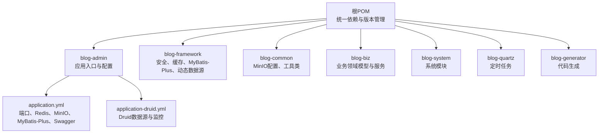
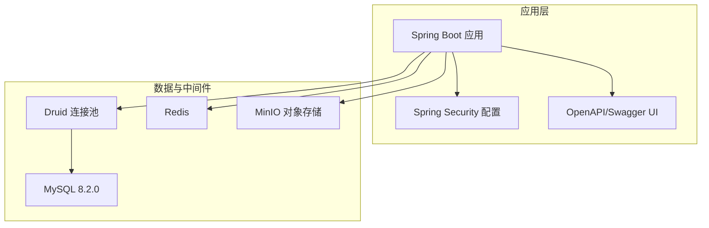
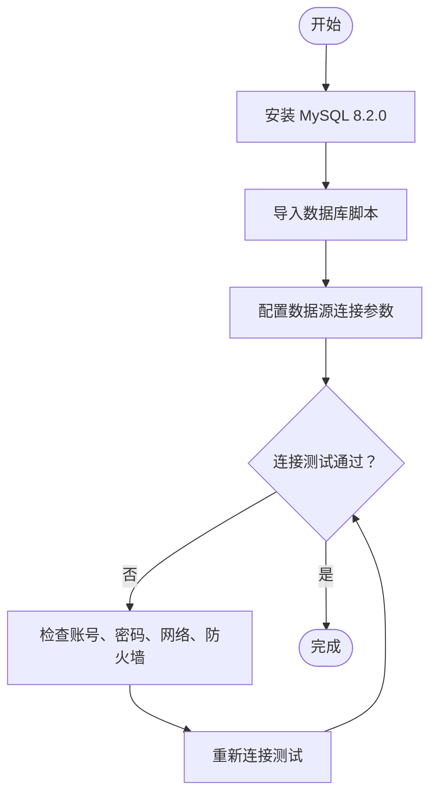
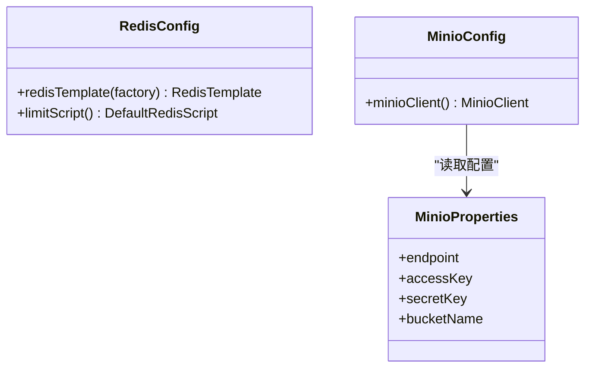
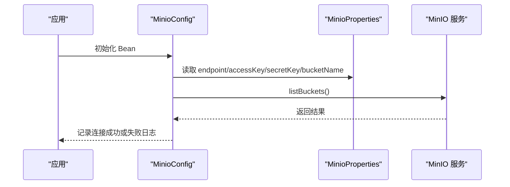
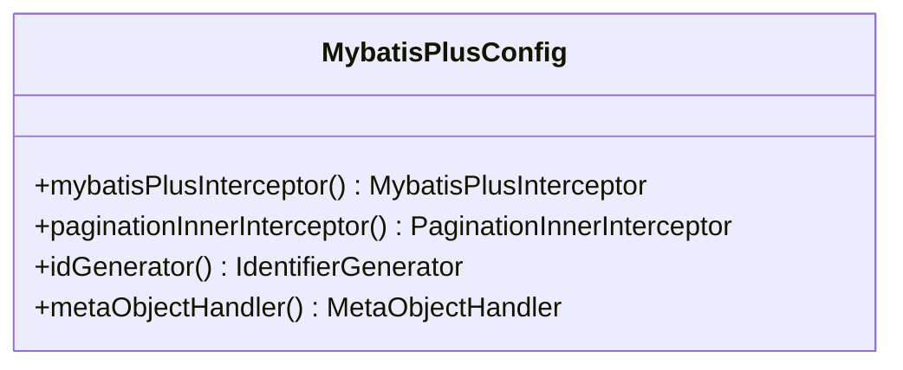
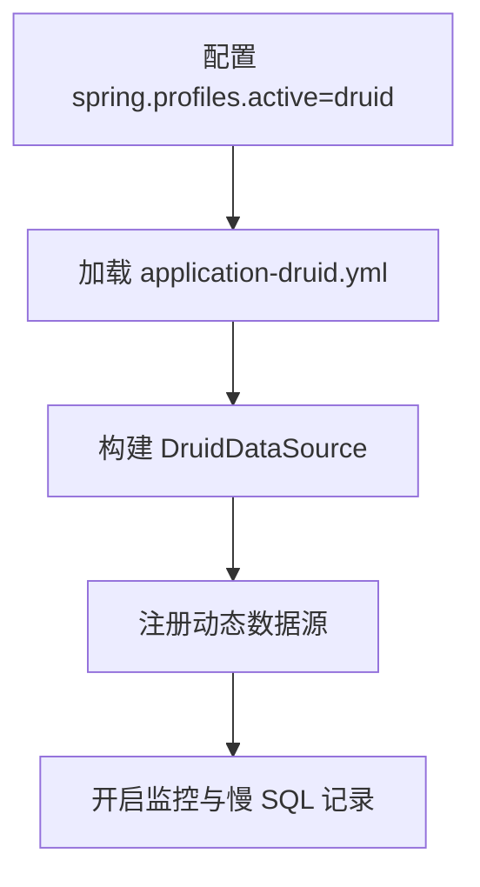
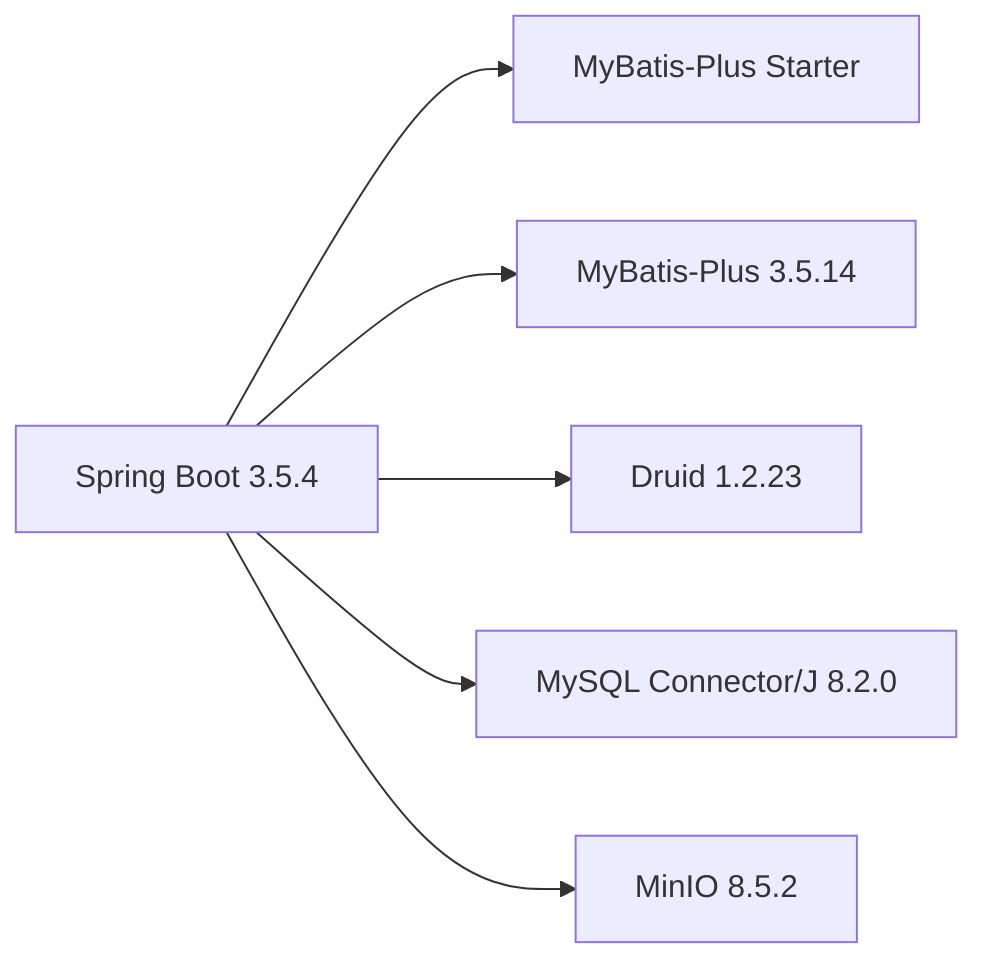

# 环境准备与依赖安装

<cite>
**本文引用的文件**
- [pom.xml](file://pom.xml)
- [application.yml](file://blog-admin/src/main/resources/application.yml)
- [application-druid.yml](file://blog-admin/src/main/resources/application-druid.yml)
- [MinioConfig.java](file://blog-common/src/main/java/blog/common/config/minio/MinioConfig.java)
- [MinioProperties.java](file://blog-common/src/main/java/blog/common/config/minio/MinioProperties.java)
- [RedisConfig.java](file://blog-framework/src/main/java/blog/framework/config/RedisConfig.java)
- [MybatisPlusConfig.java](file://blog-framework/src/main/java/blog/framework/config/MybatisPlusConfig.java)
- [DruidConfig.java](file://blog-framework/src/main/java/blog/framework/config/DruidConfig.java)
- [ry-vue-owner.sql](file://ry-vue-owner.sql)
</cite>

## 目录
1. [简介](#简介)
2. [项目结构](#项目结构)
3. [核心组件](#核心组件)
4. [架构总览](#架构总览)
5. [详细组件分析](#详细组件分析)
6. [依赖关系分析](#依赖关系分析)
7. [性能考虑](#性能考虑)
8. [故障排查指南](#故障排查指南)
9. [结论](#结论)
10. [附录](#附录)

## 简介
本指南面向生产环境部署，围绕本项目的环境准备与依赖安装提供完整说明，包括：
- 生产环境硬件与操作系统建议
- JDK 17 安装与配置
- MySQL 8.2.0 数据库安装与初始化
- Redis 缓存服务安装与配置
- MinIO 对象存储服务安装与配置
- 环境变量与系统配置（端口、防火墙）
- 版本兼容性与依赖约束
- 环境验证测试步骤
- 常见问题排查与解决方案

## 项目结构
本项目为 Maven 多模块工程，核心模块与依赖集中在根 POM 中统一管理，应用配置位于 admin 模块的资源目录中，通用配置与组件位于 common、framework 等模块。

图示来源
- [pom.xml:14-38](file://pom.xml#L14-L38)
- [application.yml:12-161](file://blog-admin/src/main/resources/application.yml#L12-L161)
- [application-druid.yml:1-61](file://blog-admin/src/main/resources/application-druid.yml#L1-61)

章节来源
- [pom.xml:14-38](file://pom.xml#L14-L38)
- [application.yml:12-161](file://blog-admin/src/main/resources/application.yml#L12-L161)
- [application-druid.yml:1-61](file://blog-admin/src/main/resources/application-druid.yml#L1-61)

## 核心组件
- Spring Boot 3.5.4：统一的 Spring 生态版本，提供自动装配与启动能力。
- MyBatis-Plus 3.5.14：增强的 ORM 框架，内置分页、逻辑删除、元对象填充等能力。
- Druid 1.2.23：高性能数据库连接池，提供监控与慢 SQL 记录。
- MinIO 8.5.2：对象存储兼容 S3 的实现，用于文件上传与存储。
- Redis：缓存与会话、限流等场景使用。
- MySQL 8.2.0：主数据库，配合 Quartz 任务调度表结构。

章节来源
- [pom.xml:44-51](file://pom.xml#L44-L51)
- [pom.xml:195-219](file://pom.xml#L195-L219)
- [application.yml:65-89](file://blog-admin/src/main/resources/application.yml#L65-L89)
- [application.yml:155-161](file://blog-admin/src/main/resources/application.yml#L155-L161)
- [application.yml:108-124](file://blog-admin/src/main/resources/application.yml#L108-L124)

## 架构总览
应用通过 Spring Boot 启动，加载配置与自动装配，连接数据库、Redis 与 MinIO，提供 REST API 并集成安全与监控能力。

图示来源
- [application.yml:12-161](file://blog-admin/src/main/resources/application.yml#L12-L161)
- [application-druid.yml:1-61](file://blog-admin/src/main/resources/application-druid.yml#L1-61)
- [RedisConfig.java:17-39](file://blog-framework/src/main/java/blog/framework/config/RedisConfig.java#L17-L39)
- [MinioConfig.java:17-31](file://blog-common/src/main/java/blog/common/config/minio/MinioConfig.java#L17-L31)

## 详细组件分析

### JDK 17 安装与配置
- 版本要求：Java 17（源码与目标版本均设为 17）。
- 建议：使用官方 LTS 发行版；设置 JAVA_HOME 与 PATH；验证 java -version。
- 注意：项目使用 Jakarta Servlet API 6.0.0，需与 JDK 17 兼容。

章节来源
- [pom.xml:18](file://pom.xml#L18)
- [pom.xml:93-96](file://pom.xml#L93-L96)

### MySQL 8.2.0 安装与初始化
- 版本要求：MySQL 8.2.0（与 Connector/J 8.2.0 对应）。
- 初始化：导入数据库脚本以创建 Quartz 调度表与业务表结构。
- 连接配置：在数据源配置中设置主机、端口、数据库名、账号与密码。
- 字符集与时区：确保数据库字符集与时区配置符合应用期望。

图示来源
- [ry-vue-owner.sql:1-200](file://ry-vue-owner.sql#L1-L200)
- [application-druid.yml:8-11](file://blog-admin/src/main/resources/application-druid.yml#L8-L11)

章节来源
- [pom.xml:81-84](file://pom.xml#L81-L84)
- [ry-vue-owner.sql:1-200](file://ry-vue-owner.sql#L1-L200)
- [application-druid.yml:8-11](file://blog-admin/src/main/resources/application-druid.yml#L8-L11)

### Redis 缓存服务安装与配置
- 默认连接：localhost:6379，数据库索引 1，带密码。
- 序列化：使用 JSON 序列化策略，键采用字符串序列化。
- 限流脚本：内置基于 Redis 的滑动窗口限流脚本。
- 建议：生产环境启用密码、网络隔离与备份策略。

图示来源
- [RedisConfig.java:17-39](file://blog-framework/src/main/java/blog/framework/config/RedisConfig.java#L17-L39)
- [MinioProperties.java:11-21](file://blog-common/src/main/java/blog/common/config/minio/MinioProperties.java#L11-L21)
- [MinioConfig.java:17-31](file://blog-common/src/main/java/blog/common/config/minio/MinioConfig.java#L17-L31)

章节来源
- [application.yml:65-89](file://blog-admin/src/main/resources/application.yml#L65-L89)
- [RedisConfig.java:17-39](file://blog-framework/src/main/java/blog/framework/config/RedisConfig.java#L17-L39)

### MinIO 对象存储服务安装与配置
- 默认端点：http://localhost:9000。
- 凭据：访问密钥与私有密钥。
- 存储桶：默认使用 blog-bucket。
- 连接验证：应用启动时调用列出存储桶接口进行连通性校验。

图示来源
- [MinioConfig.java:17-31](file://blog-common/src/main/java/blog/common/config/minio/MinioConfig.java#L17-L31)
- [MinioProperties.java:11-21](file://blog-common/src/main/java/blog/common/config/minio/MinioProperties.java#L11-L21)
- [application.yml:155-161](file://blog-admin/src/main/resources/application.yml#L155-L161)

章节来源
- [application.yml:155-161](file://blog-admin/src/main/resources/application.yml#L155-L161)
- [MinioConfig.java:17-31](file://blog-common/src/main/java/blog/common/config/minio/MinioConfig.java#L17-L31)

### MyBatis-Plus 与分页、逻辑删除
- 分页：自动识别数据库类型，支持溢出分页。
- 逻辑删除：统一字段与值约定。
- 元对象填充：自动填充创建/更新时间与操作人。
- ID 生成：基于网卡信息绑定雪花算法，避免集群重复。

图示来源
- [MybatisPlusConfig.java:19-52](file://blog-framework/src/main/java/blog/framework/config/MybatisPlusConfig.java#L19-L52)

章节来源
- [application.yml:108-124](file://blog-admin/src/main/resources/application.yml#L108-L124)
- [MybatisPlusConfig.java:19-52](file://blog-framework/src/main/java/blog/framework/config/MybatisPlusConfig.java#L19-L52)

### Druid 数据源与监控
- 主从数据源：支持主库与可选从库配置。
- 监控页面：可开启控制台与慢 SQL 记录。
- 广告移除：对监控页面底部广告进行清理。

图示来源
- [application.yml:50-51](file://blog-admin/src/main/resources/application.yml#L50-L51)
- [application-druid.yml:1-61](file://blog-admin/src/main/resources/application-druid.yml#L1-61)
- [DruidConfig.java:35-72](file://blog-framework/src/main/java/blog/framework/config/DruidConfig.java#L35-L72)

章节来源
- [application.yml:50-51](file://blog-admin/src/main/resources/application.yml#L50-L51)
- [application-druid.yml:1-61](file://blog-admin/src/main/resources/application-druid.yml#L1-61)
- [DruidConfig.java:35-72](file://blog-framework/src/main/java/blog/framework/config/DruidConfig.java#L35-L72)

## 依赖关系分析
- Spring Boot 版本由 Spring Boot Dependencies 统一管理，确保与各子依赖兼容。
- MyBatis-Plus Starter 与 MyBatis Starter 共存，分别负责增强 ORM 与基础映射。
- Druid Starter 提供连接池与监控自动装配。
- MinIO 客户端用于对象存储交互。

图示来源
- [pom.xml:44-51](file://pom.xml#L44-L51)
- [pom.xml:195-219](file://pom.xml#L195-L219)

章节来源
- [pom.xml:44-51](file://pom.xml#L44-L51)
- [pom.xml:195-219](file://pom.xml#L195-L219)

## 性能考虑
- 连接池参数：根据并发与数据库承载能力调整初始连接、最小空闲、最大活跃与等待超时。
- 分页策略：避免一次性查询大量数据，结合业务使用合理分页。
- 缓存命中：热点数据放入 Redis，注意过期策略与淘汰机制。
- 对象存储：批量上传时使用分片与并发策略，控制单次请求大小。
- 监控与慢 SQL：开启慢 SQL 记录，定期分析并优化。

## 故障排查指南
- 数据库连接失败
  - 检查主机、端口、账号、密码与网络连通性。
  - 确认数据库字符集与时区配置。
  - 参考：[application-druid.yml:8-11](file://blog-admin/src/main/resources/application-druid.yml#L8-L11)
- Redis 连接失败
  - 检查 host、port、password、数据库索引。
  - 确认网络与防火墙放行。
  - 参考：[application.yml:65-89](file://blog-admin/src/main/resources/application.yml#L65-L89)
- MinIO 连接失败
  - 检查 endpoint、accessKey、secretKey、bucketName。
  - 应用启动日志中查看连接验证结果。
  - 参考：[MinioConfig.java:23-30](file://blog-common/src/main/java/blog/common/config/minio/MinioConfig.java#L23-L30)
- Druid 监控页面无法访问
  - 确认已激活 druid 配置文件与监控开关。
  - 参考：[application.yml:50-51](file://blog-admin/src/main/resources/application.yml#L50-L51)、[application-druid.yml:44-51](file://blog-admin/src/main/resources/application-druid.yml#L44-L51)
- 端口冲突
  - 默认端口 9997，如冲突请修改 server.port。
  - 参考：[application.yml:14-15](file://blog-admin/src/main/resources/application.yml#L14-L15)

章节来源
- [application-druid.yml:8-11](file://blog-admin/src/main/resources/application-druid.yml#L8-L11)
- [application.yml:65-89](file://blog-admin/src/main/resources/application.yml#L65-L89)
- [MinioConfig.java:23-30](file://blog-common/src/main/java/blog/common/config/minio/MinioConfig.java#L23-L30)
- [application.yml:50-51](file://blog-admin/src/main/resources/application.yml#L50-L51)
- [application.yml:14-15](file://blog-admin/src/main/resources/application.yml#L14-L15)

## 结论
按照本指南完成 JDK 17、MySQL 8.2.0、Redis 与 MinIO 的安装与配置，并严格遵循版本兼容性与系统配置要求，即可顺利部署本项目。建议在生产环境中启用更强的安全策略（密码、网络隔离、备份与监控），并结合性能调优参数持续优化。

## 附录

### 环境验证测试清单
- JDK：java -version 显示 Java 17。
- MySQL：连接数据库并确认表结构存在（参考数据库脚本）。
- Redis：连接并执行 ping，确认密码与数据库索引。
- MinIO：连接并列出存储桶，确认凭据与桶名。
- 应用：启动后访问 /druid、/v3/api-docs、/swagger-ui.html 等端点验证功能。

章节来源
- [ry-vue-owner.sql:1-200](file://ry-vue-owner.sql#L1-L200)
- [application.yml:114-131](file://blog-admin/src/main/resources/application.yml#L114-L131)