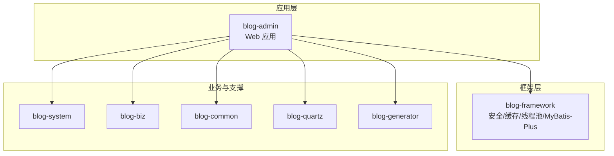
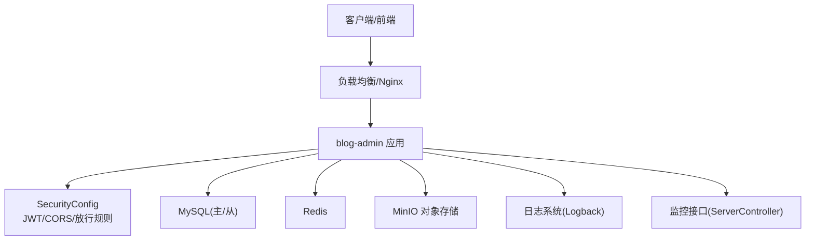
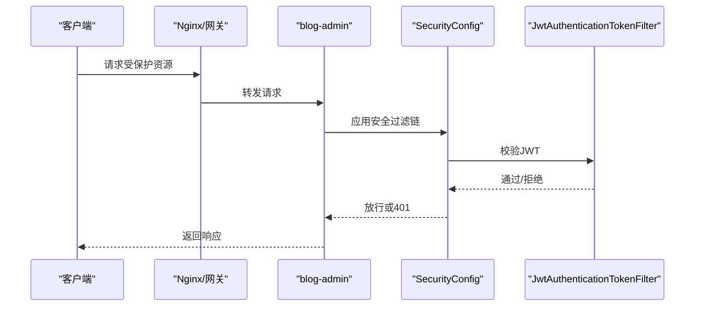
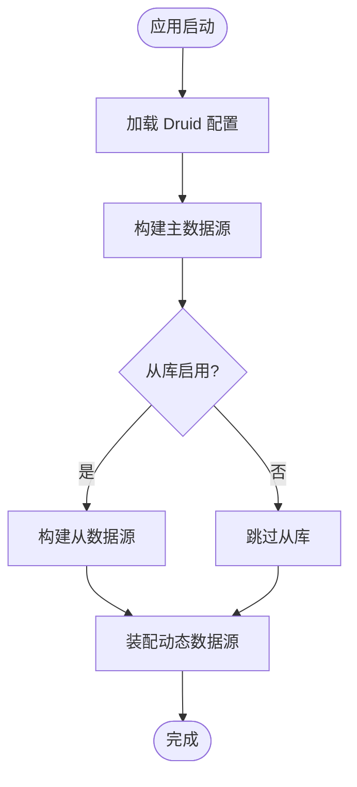
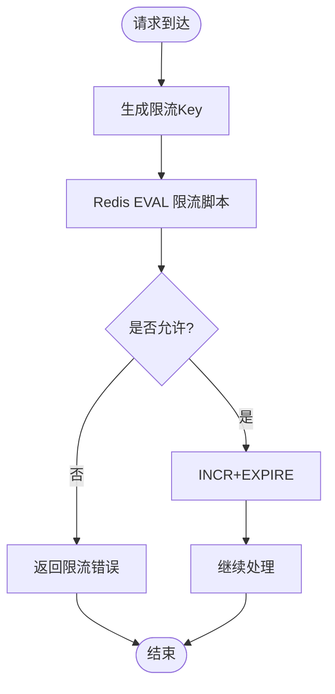
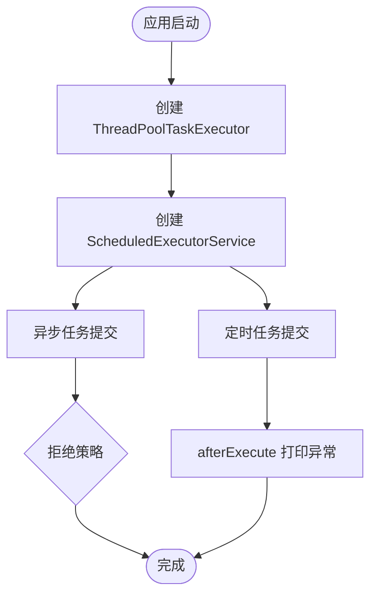
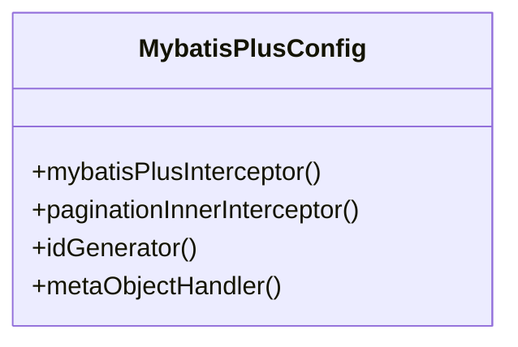
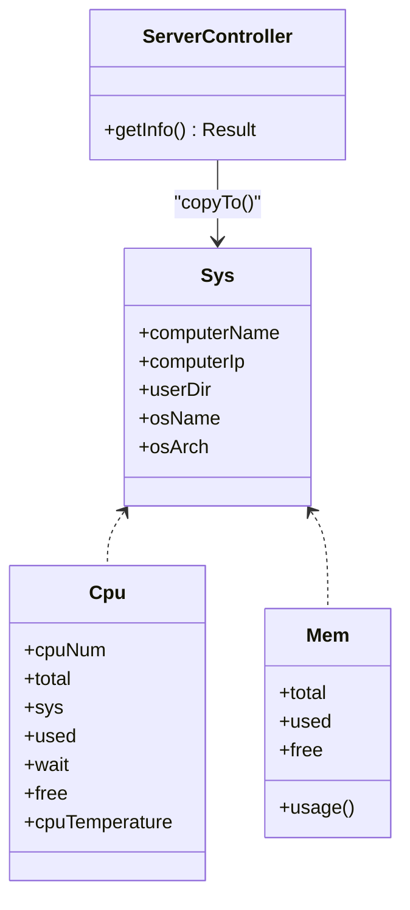
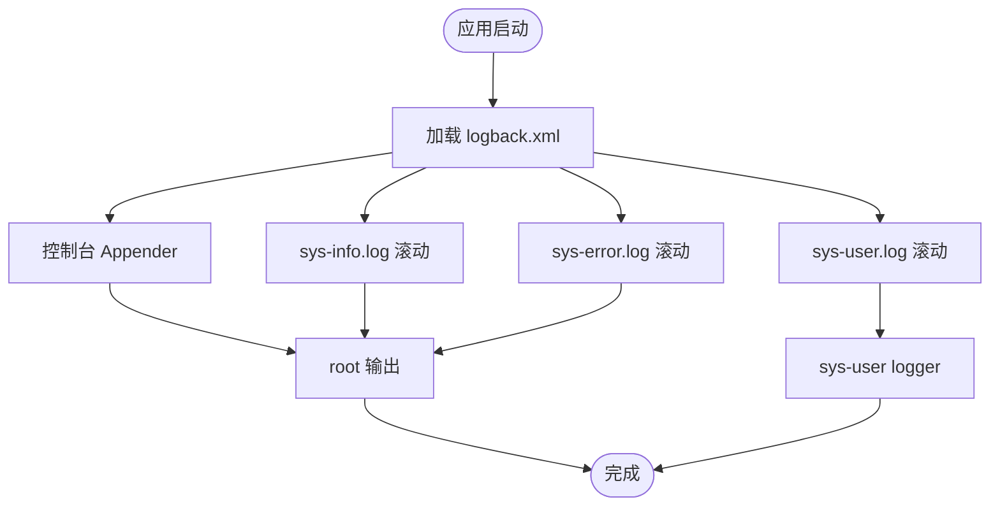
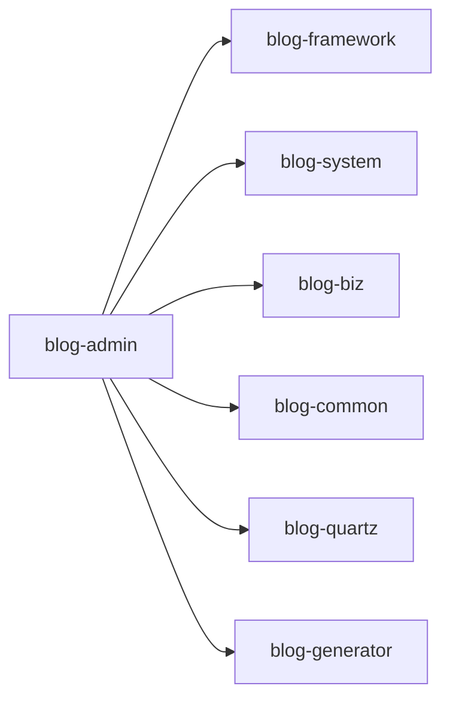

# 部署与运维

<cite>
**本文引用的文件**
- [Dockerfile](file://blog-admin/Dockerfile)
- [application.yml](file://blog-admin/src/main/resources/application.yml)
- [application-druid.yml](file://blog-admin/src/main/resources/application-druid.yml)
- [SecurityConfig.java](file://blog-framework/src/main/java/blog/framework/config/SecurityConfig.java)
- [DruidConfig.java](file://blog-framework/src/main/java/blog/framework/config/DruidConfig.java)
- [RedisConfig.java](file://blog-framework/src/main/java/blog/framework/config/RedisConfig.java)
- [ThreadPoolConfig.java](file://blog-framework/src/main/java/blog/framework/config/ThreadPoolConfig.java)
- [MybatisPlusConfig.java](file://blog-framework/src/main/java/blog/framework/config/MybatisPlusConfig.java)
- [ServerController.java](file://blog-admin/src/main/java/blog/web/controller/monitor/ServerController.java)
- [Sys.java](file://blog-framework/src/main/java/blog/framework/web/domain/server/Sys.java)
- [Cpu.java](file://blog-framework/src/main/java/blog/framework/web/domain/server/Cpu.java)
- [Mem.java](file://blog-framework/src/main/java/blog/framework/web/domain/server/Mem.java)
- [logback.xml](file://blog-admin/src/main/resources/logback.xml)
- [pom.xml](file://pom.xml)
- [ry-vue-owner.sql](file://ry-vue-owner.sql)
</cite>

## 目录
1. [简介](#简介)
2. [项目结构](#项目结构)
3. [核心组件](#核心组件)
4. [架构总览](#架构总览)
5. [详细组件分析](#详细组件分析)
6. [依赖分析](#依赖分析)
7. [性能考虑](#性能考虑)
8. [故障排查指南](#故障排查指南)
9. [结论](#结论)
10. [附录](#附录)

## 简介
本指南面向生产环境部署与运维，覆盖服务器环境准备、依赖组件安装、应用打包与部署、Docker容器化、配置管理、性能监控与运维保障、高可用与安全加固、故障排查与应急处理以及运维自动化建议。文档以仓库现有配置与代码为依据，结合最佳实践给出可落地的实施步骤。

## 项目结构
该工程为多模块 Maven 项目，核心模块包括：
- blog-admin：Spring Boot Web 应用入口，包含控制器、Swagger 文档、日志配置与 Dockerfile。
- blog-framework：框架层，包含安全配置、数据库连接池、缓存、线程池、MyBatis-Plus 插件等。
- blog-system、blog-biz、blog-common、blog-quartz、blog-generator：业务与支撑模块。

**图表来源**
- [pom.xml:225-233](file://pom.xml#L225-L233)

**章节来源**
- [pom.xml:225-233](file://pom.xml#L225-L233)

## 核心组件
- 安全与认证：基于 JWT 的无状态认证，跨域与静态资源放行策略明确。
- 数据库连接池：Druid 多数据源配置，支持主从切换与慢 SQL 监控。
- 缓存：Redis 集成与限流 Lua 脚本。
- 线程池：定时任务与异步线程池配置，拒绝策略与异常打印。
- ORM：MyBatis-Plus 分页与租户隔离、元对象填充。
- 监控：系统资源采集模型与监控接口。
- 日志：Logback 多 Appender 滚动日志与级别控制。
- 配置：多环境配置文件与属性分离。

**章节来源**
- [SecurityConfig.java:94-127](file://blog-framework/src/main/java/blog/framework/config/SecurityConfig.java#L94-L127)
- [DruidConfig.java:33-57](file://blog-framework/src/main/java/blog/framework/config/DruidConfig.java#L33-L57)
- [RedisConfig.java:21-47](file://blog-framework/src/main/java/blog/framework/config/RedisConfig.java#L21-L47)
- [ThreadPoolConfig.java:32-58](file://blog-framework/src/main/java/blog/framework/config/ThreadPoolConfig.java#L32-L58)
- [MybatisPlusConfig.java:19-52](file://blog-framework/src/main/java/blog/framework/config/MybatisPlusConfig.java#L19-L52)
- [ServerController.java:18-24](file://blog-admin/src/main/java/blog/web/controller/monitor/ServerController.java#L18-L24)
- [logback.xml:1-93](file://blog-admin/src/main/resources/logback.xml#L1-L93)

## 架构总览
应用采用前后端分离模式，后端为 Spring Boot 微服务风格的单体应用，通过 Nginx 或反向代理对外提供服务；数据库与缓存作为外部依赖，定时任务由 Quartz 管理。

**图表来源**
- [SecurityConfig.java:94-127](file://blog-framework/src/main/java/blog/framework/config/SecurityConfig.java#L94-L127)
- [application.yml:65-88](file://blog-admin/src/main/resources/application.yml#L65-L88)
- [application.yml:155-161](file://blog-admin/src/main/resources/application.yml#L155-L161)
- [ServerController.java:18-24](file://blog-admin/src/main/java/blog/web/controller/monitor/ServerController.java#L18-L24)
- [logback.xml:1-93](file://blog-admin/src/main/resources/logback.xml#L1-L93)

## 详细组件分析

### 安全与认证（JWT）
- 无状态会话：禁用 CSRF，开启无状态 Session。
- 放行规则：静态资源、Swagger、Druid、登录注册、验证码等匿名访问。
- 过滤器链：CorsFilter → JwtAuthenticationTokenFilter → UsernamePasswordAuthenticationFilter。
- 密码加密：BCrypt。

**图表来源**
- [SecurityConfig.java:94-127](file://blog-framework/src/main/java/blog/framework/config/SecurityConfig.java#L94-L127)

**章节来源**
- [SecurityConfig.java:94-127](file://blog-framework/src/main/java/blog/framework/config/SecurityConfig.java#L94-L127)

### 数据库连接池（Druid）
- 多数据源：主库与可选从库，动态切换。
- 监控：控制台白名单、慢 SQL 记录、SQL 合并。
- 广告去除：移除监控页底部广告。

**图表来源**
- [DruidConfig.java:33-72](file://blog-framework/src/main/java/blog/framework/config/DruidConfig.java#L33-L72)
- [application-druid.yml:1-61](file://blog-admin/src/main/resources/application-druid.yml#L1-L61)

**章节来源**
- [DruidConfig.java:33-72](file://blog-framework/src/main/java/blog/framework/config/DruidConfig.java#L33-L72)
- [application-druid.yml:1-61](file://blog-admin/src/main/resources/application-druid.yml#L1-L61)

### 缓存与限流（Redis）
- RedisTemplate：统一序列化策略。
- 限流脚本：基于 Lua 的滑动窗口限流。

**图表来源**
- [RedisConfig.java:42-65](file://blog-framework/src/main/java/blog/framework/config/RedisConfig.java#L42-L65)

**章节来源**
- [RedisConfig.java:21-47](file://blog-framework/src/main/java/blog/framework/config/RedisConfig.java#L21-L47)
- [RedisConfig.java:42-65](file://blog-framework/src/main/java/blog/framework/config/RedisConfig.java#L42-L65)

### 线程池与定时任务
- 异步线程池：核心/最大/队列/存活时间与 CallerRunsPolicy。
- 定时任务线程池：守护线程命名与异常打印。

**图表来源**
- [ThreadPoolConfig.java:32-58](file://blog-framework/src/main/java/blog/framework/config/ThreadPoolConfig.java#L32-L58)

**章节来源**
- [ThreadPoolConfig.java:32-58](file://blog-framework/src/main/java/blog/framework/config/ThreadPoolConfig.java#L32-L58)

### ORM 与分页（MyBatis-Plus）
- 分页插件：自动识别数据库类型，溢出保护。
- 标识生成：基于网卡信息的雪花 ID 生成器。
- 元对象填充：自动填充创建/更新信息。

**图表来源**
- [MybatisPlusConfig.java:19-52](file://blog-framework/src/main/java/blog/framework/config/MybatisPlusConfig.java#L19-L52)

**章节来源**
- [MybatisPlusConfig.java:19-52](file://blog-framework/src/main/java/blog/framework/config/MybatisPlusConfig.java#L19-L52)

### 监控与系统资源
- 监控接口：/monitor/server 获取服务器信息。
- 资源模型：CPU、内存、系统信息实体。

**图表来源**
- [ServerController.java:18-24](file://blog-admin/src/main/java/blog/web/controller/monitor/ServerController.java#L18-L24)
- [Sys.java:8-74](file://blog-framework/src/main/java/blog/framework/web/domain/server/Sys.java#L8-L74)
- [Cpu.java:10-102](file://blog-framework/src/main/java/blog/framework/web/domain/server/Cpu.java#L10-L102)
- [Mem.java:10-54](file://blog-framework/src/main/java/blog/framework/web/domain/server/Mem.java#L10-L54)

**章节来源**
- [ServerController.java:18-24](file://blog-admin/src/main/java/blog/web/controller/monitor/ServerController.java#L18-L24)
- [Sys.java:8-74](file://blog-framework/src/main/java/blog/framework/web/domain/server/Sys.java#L8-L74)
- [Cpu.java:10-102](file://blog-framework/src/main/java/blog/framework/web/domain/server/Cpu.java#L10-L102)
- [Mem.java:10-54](file://blog-framework/src/main/java/blog/framework/web/domain/server/Mem.java#L10-L54)

### 日志与审计
- 日志路径与滚动策略：按天滚动、保留 60 天。
- 多 Appender：控制台、INFO/ERROR 文件、用户行为日志。
- 级别控制：系统模块与 Spring 日志级别。

**图表来源**
- [logback.xml:1-93](file://blog-admin/src/main/resources/logback.xml#L1-L93)

**章节来源**
- [logback.xml:1-93](file://blog-admin/src/main/resources/logback.xml#L1-L93)

## 依赖分析
- 外部依赖：MySQL、Redis、MinIO、Nginx/反向代理、对象存储。
- 内部模块：admin 依赖 framework/system/biz/common/quartz/generator。
- 版本与插件：Maven 管理依赖版本，Spring Boot Maven 插件负责打包。

**图表来源**
- [pom.xml:225-233](file://pom.xml#L225-L233)

**章节来源**
- [pom.xml:225-233](file://pom.xml#L225-L233)

## 性能考虑
- 线程池：根据业务并发量调整核心/最大线程与队列容量，避免拒绝策略导致的同步阻塞。
- 数据库：启用从库与读写分离，合理设置连接池参数与慢 SQL 监控。
- 缓存：热点数据缓存，结合限流脚本防止突发流量击穿。
- 分页：MyBatis-Plus 分页插件开启溢出保护，避免大偏移量查询。
- JVM：根据容器资源限制设置堆大小与 GC 参数，结合容器编排实现弹性扩缩容。

[本节为通用指导，无需“章节来源”]

## 故障排查指南
- 认证失败/401：
  - 检查 JWT 过滤器链顺序与放行规则。
  - 核对登录接口与 CORS 配置。
- 数据库连接问题：
  - 检查主从库配置与连接池参数。
  - 查看慢 SQL 与 Druid 控制台。
- 缓存异常：
  - 校验 Redis 连接参数与序列化配置。
  - 观察限流脚本返回值与 Key 过期时间。
- 线程池拒绝：
  - 调整拒绝策略或扩容线程池。
  - 关注 afterExecute 中的异常打印。
- 监控接口异常：
  - 检查权限注解与放行路径。
  - 确认系统资源采集逻辑。
- 日志未落盘：
  - 校验日志路径权限与滚动策略。
  - 检查 logger 级别与 appender 绑定。

**章节来源**
- [SecurityConfig.java:94-127](file://blog-framework/src/main/java/blog/framework/config/SecurityConfig.java#L94-L127)
- [DruidConfig.java:78-115](file://blog-framework/src/main/java/blog/framework/config/DruidConfig.java#L78-L115)
- [RedisConfig.java:21-47](file://blog-framework/src/main/java/blog/framework/config/RedisConfig.java#L21-L47)
- [ThreadPoolConfig.java:32-58](file://blog-framework/src/main/java/blog/framework/config/ThreadPoolConfig.java#L32-L58)
- [ServerController.java:18-24](file://blog-admin/src/main/java/blog/web/controller/monitor/ServerController.java#L18-L24)
- [logback.xml:1-93](file://blog-admin/src/main/resources/logback.xml#L1-L93)

## 结论
本指南基于仓库现有配置与代码，给出了生产部署与运维的关键路径：容器化打包、配置分离与敏感信息保护、安全加固、性能优化、监控与日志、高可用与备份、故障排查与自动化建议。建议在实际环境中结合业务规模与合规要求进一步细化与落地。

[本节为总结，无需“章节来源”]

## 附录

### 生产部署流程（基于现有配置）
- 服务器环境准备
  - 操作系统：Linux（推荐 CentOS/Ubuntu）。
  - JDK：Java 17（与项目属性一致）。
  - 数据库：MySQL 8.x，初始化 ry-vue-owner.sql。
  - 缓存：Redis，配置连接参数。
  - 对象存储：MinIO，创建桶并配置访问凭据。
  - 反向代理：Nginx，配置静态资源与上游转发。
- 依赖组件安装
  - 安装并启动 MySQL、Redis、MinIO。
  - 准备对象存储文件上传目录（profile 路径）。
- 应用打包与部署
  - 使用 Maven 打包 admin 模块，生成 JAR。
  - 将 JAR 复制至目标服务器，准备 application.yml 与 application-druid.yml。
  - 修改敏感信息为环境变量或密文（见“配置管理”）。
- Docker 容器化部署
  - 使用 blog-admin/Dockerfile 构建镜像。
  - 暴露端口 9997，挂载日志目录与配置目录。
  - 通过 docker-compose 或编排平台管理多副本与健康检查。
- 配置管理策略
  - 环境分离：dev/test/prod 三套配置文件，通过 spring.profiles.active 切换。
  - 敏感信息：数据库密码、Redis 密码、MinIO 凭据放入密钥管理或环境变量。
  - 动态配置：结合 Spring Cloud Config 或本地配置热刷新。
- 性能监控与运维
  - 应用监控：/monitor/server 接口采集系统资源。
  - 日志收集：集中式日志（如 ELK），按天滚动与保留策略。
  - 告警设置：CPU/内存/磁盘/连接池/慢 SQL/接口错误率阈值。
  - 性能调优：线程池、连接池、分页参数、缓存命中率。
- 高可用部署方案
  - 负载均衡：Nginx/HAProxy/云负载均衡。
  - 集群部署：多实例部署，共享 Redis/数据库。
  - 故障转移：健康检查失败自动摘除与重启。
  - 数据备份：数据库定时备份与 Binlog 恢复。
- 安全加固
  - 网络安全：仅开放必要端口，内网访问数据库与缓存。
  - 访问控制：JWT 严格校验，静态资源与匿名接口最小化。
  - 数据加密：传输层 TLS，敏感字段加密存储。
  - 漏洞防护：定期升级依赖，启用 WAF，限制请求大小与频率。
- 故障排查与应急处理
  - 快速定位：查看日志、慢 SQL、线程池拒绝、缓存命中率。
  - 应急处理：临时降级、限流、回滚版本、扩容实例。
- 运维自动化
  - CI/CD：Maven 构建、Docker 镜像推送、编排部署。
  - 健康检查：容器探针与应用自检接口。
  - 自动化巡检：资源使用率、连接池占用、日志异常告警。

**章节来源**
- [Dockerfile:1-15](file://blog-admin/Dockerfile#L1-L15)
- [application.yml:12-161](file://blog-admin/src/main/resources/application.yml#L12-L161)
- [application-druid.yml:1-61](file://blog-admin/src/main/resources/application-druid.yml#L1-L61)
- [ry-vue-owner.sql:1-200](file://ry-vue-owner.sql#L1-L200)