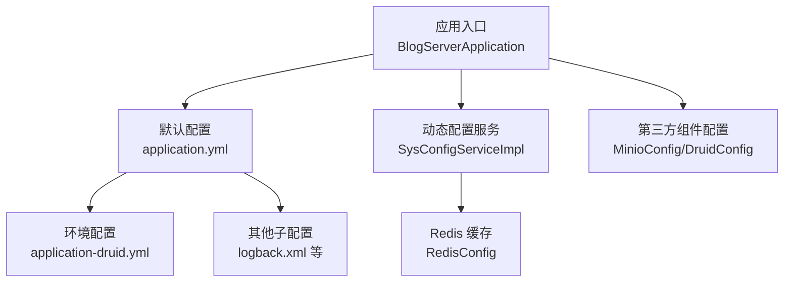
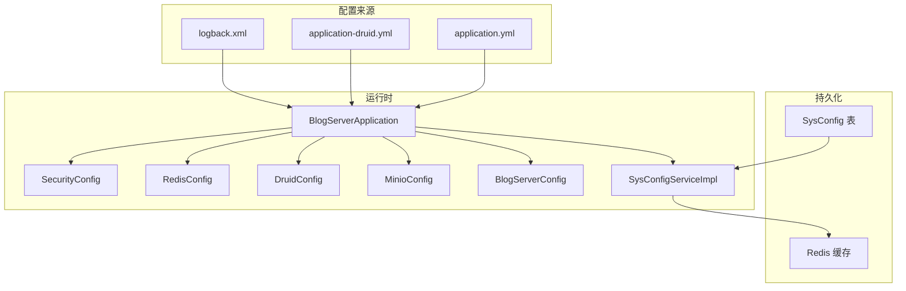
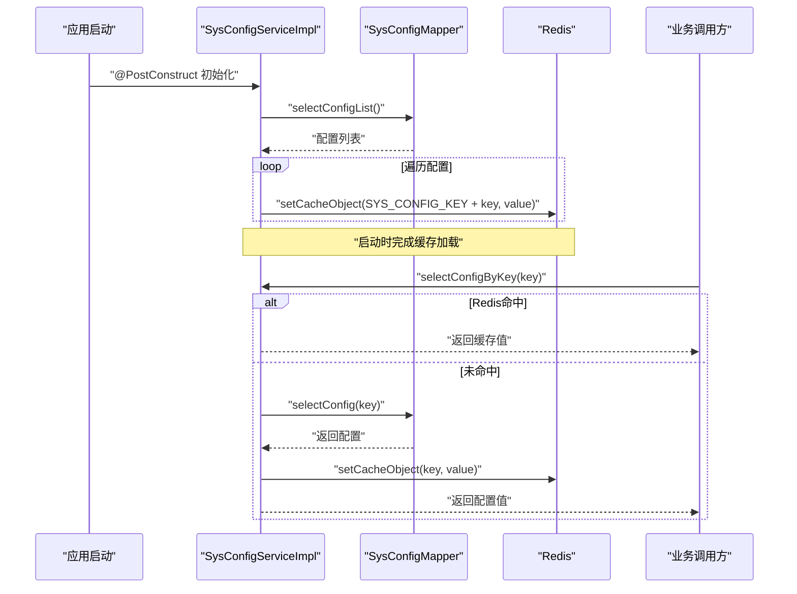
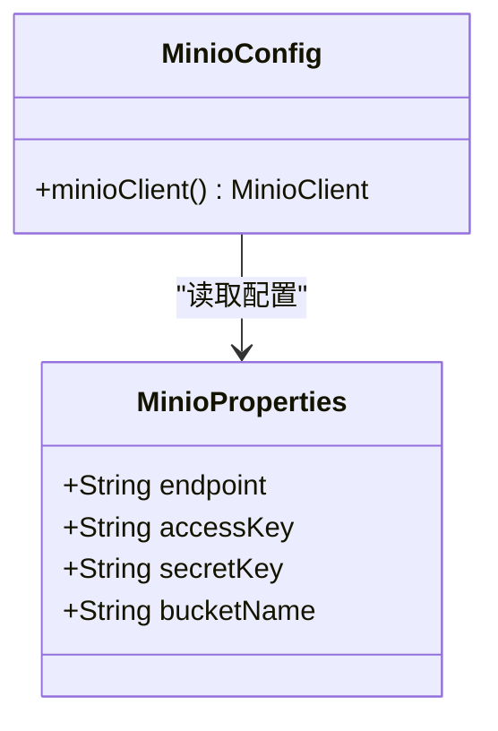
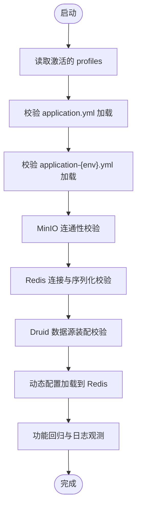
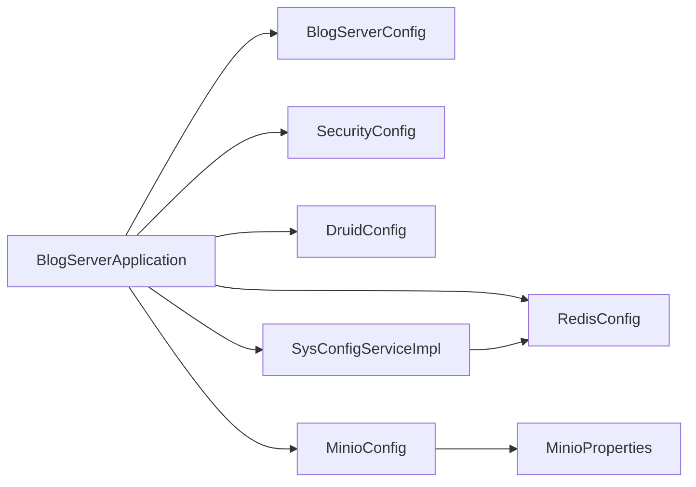

# 配置管理与环境分离

<cite>
**本文引用的文件**
- [application.yml](file://blog-admin/src/main/resources/application.yml)
- [application-druid.yml](file://blog-admin/src/main/resources/application-druid.yml)
- [BlogServerApplication.java](file://blog-admin/src/main/java/blog/BlogServerApplication.java)
- [BlogServerConfig.java](file://blog-common/src/main/java/blog/common/config/BlogServerConfig.java)
- [MinioProperties.java](file://blog-common/src/main/java/blog/common/config/minio/MinioProperties.java)
- [MinioConfig.java](file://blog-common/src/main/java/blog/common/config/minio/MinioConfig.java)
- [RedisConfig.java](file://blog-framework/src/main/java/blog/framework/config/RedisConfig.java)
- [DruidConfig.java](file://blog-framework/src/main/java/blog/framework/config/DruidConfig.java)
- [SysConfig.java](file://blog-system/src/main/java/blog/system/domain/SysConfig.java)
- [SysConfigServiceImpl.java](file://blog-system/src/main/java/blog/system/service/impl/SysConfigServiceImpl.java)
- [SpringUtils.java](file://blog-common/src/main/java/blog/common/utils/spring/SpringUtils.java)
- [SecurityConfig.java](file://blog-framework/src/main/java/blog/framework/config/SecurityConfig.java)
- [logback.xml](file://blog-admin/src/main/resources/logback.xml)
- [session-ses_2bcc.md](file://session-ses_2bcc.md)
</cite>

## 目录
1. [简介](#简介)
2. [项目结构](#项目结构)
3. [核心组件](#核心组件)
4. [架构总览](#架构总览)
5. [详细组件分析](#详细组件分析)
6. [依赖分析](#依赖分析)
7. [性能考虑](#性能考虑)
8. [故障排查指南](#故障排查指南)
9. [结论](#结论)
10. [附录](#附录)

## 简介
本指南围绕“配置管理与环境分离”主题，结合仓库现有配置体系，系统阐述多环境配置策略、层次结构与优先级、敏感信息安全管理、动态配置更新机制、配置模板与最佳实践，以及配置验证与测试策略。目标是帮助团队建立标准化、可追溯、可演进的配置管理流程。

## 项目结构
本项目采用多模块结构，配置主要集中在 admin 模块的资源目录下，并通过 Spring Boot 的配置优先级机制实现环境隔离与覆盖。关键位置如下：
- 默认配置：application.yml
- 环境特定配置：application-{profile}.yml（如 application-druid.yml）
- 动态配置持久化：SysConfig 表 + Redis 缓存
- 安全与敏感配置：MinioProperties、BlogServerConfig 等
- 日志与运行时行为：logback.xml、SecurityConfig、RedisConfig、DruidConfig

图表来源
- [BlogServerApplication.java:12-18](file://blog-admin/src/main/java/blog/BlogServerApplication.java#L12-L18)
- [application.yml:50-51](file://blog-admin/src/main/resources/application.yml#L50-L51)
- [application-druid.yml:1-61](file://blog-admin/src/main/resources/application-druid.yml#L1-L61)
- [logback.xml:1-93](file://blog-admin/src/main/resources/logback.xml#L1-L93)

章节来源
- [BlogServerApplication.java:12-18](file://blog-admin/src/main/java/blog/BlogServerApplication.java#L12-L18)
- [application.yml:50-51](file://blog-admin/src/main/resources/application.yml#L50-L51)
- [application-druid.yml:1-61](file://blog-admin/src/main/resources/application-druid.yml#L1-L61)
- [logback.xml:1-93](file://blog-admin/src/main/resources/logback.xml#L1-L93)

## 核心组件
- 环境激活与优先级
  - 通过 application.yml 中的 profiles.active 激活环境配置；application-druid.yml 属于环境特定配置文件，会被 Spring Boot 自动加载。
  - Spring Boot 配置优先级（来自官方机制）：命令行参数 > 环境变量 > 应用内 application-{profile}.yml > application.yml。
- 动态配置中心
  - SysConfig 表用于持久化配置项，SysConfigServiceImpl 在启动时加载至 Redis 缓存，提供运行时读取与更新能力。
- 敏感信息管理
  - MinioProperties 读取 minio.* 配置，MinioConfig 构建客户端并进行连通性校验。
  - BlogServerConfig 读取 blog.* 配置，用于业务路径与行为控制。
- 安全与运行时行为
  - SecurityConfig 定义无状态会话与过滤器链。
  - RedisConfig 定义 RedisTemplate 序列化策略与脚本。
  - DruidConfig 定义数据源与动态数据源装配。

章节来源
- [application.yml:50-51](file://blog-admin/src/main/resources/application.yml#L50-L51)
- [application-druid.yml:1-61](file://blog-admin/src/main/resources/application-druid.yml#L1-L61)
- [SysConfigServiceImpl.java:38-41](file://blog-system/src/main/java/blog/system/service/impl/SysConfigServiceImpl.java#L38-L41)
- [MinioProperties.java:11-22](file://blog-common/src/main/java/blog/common/config/minio/MinioProperties.java#L11-L22)
- [MinioConfig.java:17-31](file://blog-common/src/main/java/blog/common/config/minio/MinioConfig.java#L17-L31)
- [BlogServerConfig.java:11-12](file://blog-common/src/main/java/blog/common/config/BlogServerConfig.java#L11-L12)
- [SecurityConfig.java:94-127](file://blog-framework/src/main/java/blog/framework/config/SecurityConfig.java#L94-L127)
- [RedisConfig.java:21-39](file://blog-framework/src/main/java/blog/framework/config/RedisConfig.java#L21-L39)
- [DruidConfig.java:34-57](file://blog-framework/src/main/java/blog/framework/config/DruidConfig.java#L34-L57)

## 架构总览
下图展示配置在系统中的流向与交互：应用启动加载默认与环境配置，动态配置从数据库加载到 Redis，运行时通过服务读取；敏感配置由独立属性类读取并注入。

图表来源
- [application.yml:50-51](file://blog-admin/src/main/resources/application.yml#L50-L51)
- [application-druid.yml:1-61](file://blog-admin/src/main/resources/application-druid.yml#L1-L61)
- [logback.xml:1-93](file://blog-admin/src/main/resources/logback.xml#L1-L93)
- [BlogServerApplication.java:12-18](file://blog-admin/src/main/java/blog/BlogServerApplication.java#L12-L18)
- [SecurityConfig.java:94-127](file://blog-framework/src/main/java/blog/framework/config/SecurityConfig.java#L94-L127)
- [RedisConfig.java:21-39](file://blog-framework/src/main/java/blog/framework/config/RedisConfig.java#L21-L39)
- [DruidConfig.java:34-57](file://blog-framework/src/main/java/blog/framework/config/DruidConfig.java#L34-L57)
- [MinioConfig.java:17-31](file://blog-common/src/main/java/blog/common/config/minio/MinioConfig.java#L17-L31)
- [BlogServerConfig.java:11-12](file://blog-common/src/main/java/blog/common/config/BlogServerConfig.java#L11-L12)
- [SysConfigServiceImpl.java:38-41](file://blog-system/src/main/java/blog/system/service/impl/SysConfigServiceImpl.java#L38-L41)

## 详细组件分析

### 多环境配置策略与优先级
- 环境激活
  - 通过 application.yml 的 profiles.active 指定当前激活的 profile（例如 druid），对应 application-druid.yml 的配置生效。
- 优先级规则（Spring Boot）
  - 命令行参数 > 环境变量 > application-{profile}.yml > application.yml
  - 本项目通过 application-druid.yml 对 application.yml 进行覆盖，实现环境隔离。
- 建议的环境命名
  - 开发：dev
  - 测试：test
  - 预发布：pre
  - 生产：prod
  - 对应文件：application-dev.yml、application-test.yml、application-pre.yml、application-prod.yml

章节来源
- [application.yml:50-51](file://blog-admin/src/main/resources/application.yml#L50-L51)
- [application-druid.yml:1-61](file://blog-admin/src/main/resources/application-druid.yml#L1-L61)

### 动态配置更新机制（SysConfig）
- 启动加载
  - 项目启动时，SysConfigServiceImpl 在 @PostConstruct 中调用 loadingConfigCache()，将数据库配置写入 Redis 缓存。
- 运行时读取
  - selectConfigByKey() 优先从 Redis 读取，不存在则查询数据库并回填缓存。
- 更新与回滚
  - updateConfig() 更新数据库后，刷新 Redis 缓存；deleteConfigByIds() 删除内置参数时抛出异常，避免破坏性操作。
- 缓存键规范
  - 使用统一前缀拼接 key，便于批量清理与重载。

图表来源
- [SysConfigServiceImpl.java:38-41](file://blog-system/src/main/java/blog/system/service/impl/SysConfigServiceImpl.java#L38-L41)
- [SysConfigServiceImpl.java:64-77](file://blog-system/src/main/java/blog/system/service/impl/SysConfigServiceImpl.java#L64-L77)
- [SysConfigServiceImpl.java:126-137](file://blog-system/src/main/java/blog/system/service/impl/SysConfigServiceImpl.java#L126-L137)
- [SysConfigServiceImpl.java:160-165](file://blog-system/src/main/java/blog/system/service/impl/SysConfigServiceImpl.java#L160-L165)

章节来源
- [SysConfigServiceImpl.java:38-41](file://blog-system/src/main/java/blog/system/service/impl/SysConfigServiceImpl.java#L38-L41)
- [SysConfigServiceImpl.java:64-77](file://blog-system/src/main/java/blog/system/service/impl/SysConfigServiceImpl.java#L64-L77)
- [SysConfigServiceImpl.java:126-137](file://blog-system/src/main/java/blog/system/service/impl/SysConfigServiceImpl.java#L126-L137)
- [SysConfigServiceImpl.java:160-165](file://blog-system/src/main/java/blog/system/service/impl/SysConfigServiceImpl.java#L160-L165)
- [SysConfig.java:17-95](file://blog-system/src/main/java/blog/system/domain/SysConfig.java#L17-L95)

### 敏感信息安全管理
- MinIO 凭据
  - MinioProperties 读取 minio.endpoint、minio.access-key、minio.secret-key、minio.bucket-name。
  - MinioConfig 构建 MinioClient 并调用 listBuckets() 进行连通性与认证校验，日志记录结果。
- Redis 凭据
  - application.yml 中 spring.data.redis.password 用于连接密码；建议在环境变量或外部配置中注入，避免硬编码。
- Token 密钥
  - application.yml 中 token.secret 用于 JWT 签名；建议使用强随机密钥并通过环境变量注入。
- 最佳实践
  - 使用环境变量或密钥管理服务（如 KMS）注入敏感值，不在版本库中保存明文。
  - 对外暴露的配置文件仅保留非敏感字段，敏感字段通过外部化配置注入。

图表来源
- [MinioProperties.java:11-22](file://blog-common/src/main/java/blog/common/config/minio/MinioProperties.java#L11-L22)
- [MinioConfig.java:17-31](file://blog-common/src/main/java/blog/common/config/minio/MinioConfig.java#L17-L31)

章节来源
- [MinioProperties.java:11-22](file://blog-common/src/main/java/blog/common/config/minio/MinioProperties.java#L11-L22)
- [MinioConfig.java:17-31](file://blog-common/src/main/java/blog/common/config/minio/MinioConfig.java#L17-L31)
- [application.yml:68-88](file://blog-admin/src/main/resources/application.yml#L68-L88)
- [application.yml:95-97](file://blog-admin/src/main/resources/application.yml#L95-L97)

### 配置模板与最佳实践
- 模板结构建议
  - application.yml：默认配置与通用设置
  - application-{env}.yml：各环境差异化配置（如数据库、缓存、第三方服务）
  - 外部化配置：通过环境变量或密钥管理服务注入敏感值
- 命名规范
  - 环境命名：dev/test/pre/prod
  - 配置键：按模块分组（如 blog、minio、redis、token、spring、logging 等）
- 变更流程
  - 开发：本地 application-dev.yml + 环境变量
  - 测试：application-test.yml + CI 注入密钥
  - 预发布：application-pre.yml + 预发布密钥
  - 生产：application-prod.yml + 生产密钥管理服务
- 验证清单
  - 启动日志检查：确认激活的 profile 与关键配置加载成功
  - 连通性测试：MinIO、Redis、数据库
  - 功能回归：登录、权限、文件上传等

章节来源
- [application.yml:50-51](file://blog-admin/src/main/resources/application.yml#L50-L51)
- [application.yml:155-161](file://blog-admin/src/main/resources/application.yml#L155-L161)
- [application.yml:68-88](file://blog-admin/src/main/resources/application.yml#L68-L88)
- [application.yml:95-97](file://blog-admin/src/main/resources/application.yml#L95-L97)

### 配置验证与测试策略
- 启动验证
  - 通过 SpringUtils 获取激活的 profiles，确认与预期一致。
  - 检查关键配置项是否正确加载（如 Redis、MinIO、Token 等）。
- 连通性测试
  - MinioConfig 中的客户端连通性校验日志。
  - RedisConfig 中的序列化策略与脚本可用性。
  - DruidConfig 中的数据源装配与动态数据源切换。
- 运行时验证
  - 动态配置：通过 SysConfigServiceImpl 读取常用配置键，验证缓存与回源逻辑。
- 日志与可观测性
  - logback.xml 定义了系统日志、错误日志与用户行为日志的滚动策略与级别。

图表来源
- [SpringUtils.java:123-135](file://blog-common/src/main/java/blog/common/utils/spring/SpringUtils.java#L123-L135)
- [MinioConfig.java:24-30](file://blog-common/src/main/java/blog/common/config/minio/MinioConfig.java#L24-L30)
- [RedisConfig.java:21-39](file://blog-framework/src/main/java/blog/framework/config/RedisConfig.java#L21-L39)
- [DruidConfig.java:34-57](file://blog-framework/src/main/java/blog/framework/config/DruidConfig.java#L34-L57)
- [SysConfigServiceImpl.java:160-165](file://blog-system/src/main/java/blog/system/service/impl/SysConfigServiceImpl.java#L160-L165)
- [logback.xml:1-93](file://blog-admin/src/main/resources/logback.xml#L1-93)

章节来源
- [SpringUtils.java:123-135](file://blog-common/src/main/java/blog/common/utils/spring/SpringUtils.java#L123-L135)
- [MinioConfig.java:24-30](file://blog-common/src/main/java/blog/common/config/minio/MinioConfig.java#L24-L30)
- [RedisConfig.java:21-39](file://blog-framework/src/main/java/blog/framework/config/RedisConfig.java#L21-L39)
- [DruidConfig.java:34-57](file://blog-framework/src/main/java/blog/framework/config/DruidConfig.java#L34-L57)
- [SysConfigServiceImpl.java:160-165](file://blog-system/src/main/java/blog/system/service/impl/SysConfigServiceImpl.java#L160-L165)
- [logback.xml:1-93](file://blog-admin/src/main/resources/logback.xml#L1-93)

## 依赖分析
- 组件耦合
  - SysConfigServiceImpl 依赖 RedisCache 与 SysConfigMapper，形成“数据库-缓存-服务”的清晰分层。
  - MinioConfig 依赖 MinioProperties，职责单一，便于替换实现。
  - BlogServerApplication 通过排除 DataSourceAutoConfiguration，避免默认数据源干扰动态数据源装配。
- 外部依赖
  - Spring Security、Redis、Druid、MinIO 客户端等均通过配置文件注入，降低硬编码耦合度。

图表来源
- [BlogServerApplication.java:12-18](file://blog-admin/src/main/java/blog/BlogServerApplication.java#L12-L18)
- [BlogServerConfig.java:11-12](file://blog-common/src/main/java/blog/common/config/BlogServerConfig.java#L11-L12)
- [SecurityConfig.java:94-127](file://blog-framework/src/main/java/blog/framework/config/SecurityConfig.java#L94-L127)
- [RedisConfig.java:21-39](file://blog-framework/src/main/java/blog/framework/config/RedisConfig.java#L21-L39)
- [DruidConfig.java:34-57](file://blog-framework/src/main/java/blog/framework/config/DruidConfig.java#L34-L57)
- [MinioConfig.java:17-31](file://blog-common/src/main/java/blog/common/config/minio/MinioConfig.java#L17-L31)
- [MinioProperties.java:11-22](file://blog-common/src/main/java/blog/common/config/minio/MinioProperties.java#L11-L22)
- [SysConfigServiceImpl.java:38-41](file://blog-system/src/main/java/blog/system/service/impl/SysConfigServiceImpl.java#L38-L41)

章节来源
- [BlogServerApplication.java:12-18](file://blog-admin/src/main/java/blog/BlogServerApplication.java#L12-L18)
- [SysConfigServiceImpl.java:38-41](file://blog-system/src/main/java/blog/system/service/impl/SysConfigServiceImpl.java#L38-L41)

## 性能考虑
- 动态配置缓存
  - Redis 缓存显著降低数据库压力，建议对高频读取的配置键进行缓存预热。
- 序列化与脚本
  - RedisConfig 使用 JSON 序列化与 Lua 脚本实现限流等功能，注意序列化开销与脚本维护成本。
- 数据库连接池
  - DruidConfig 提供丰富的连接池参数，建议根据 QPS 与事务特性调整初始/最大连接数与超时参数。
- 日志滚动
  - logback.xml 的滚动策略与过滤器有助于控制磁盘占用与 IO 峰值。

## 故障排查指南
- 启动失败或配置未生效
  - 检查 profiles.active 是否正确，确认 application-{env}.yml 是否位于 classpath 下。
  - 使用 SpringUtils.getActiveProfile() 校验当前激活的 profile。
- MinIO 连接失败
  - 查看 MinioConfig 的日志输出，核对 endpoint、access-key、secret-key 与 bucket-name。
- Redis 连接异常
  - 检查 RedisConfig 的序列化策略与连接参数，确认 Redis 服务可达。
- 动态配置不更新
  - 确认 SysConfigServiceImpl 的 updateConfig() 已刷新缓存；必要时执行 resetConfigCache() 或重启以强制重载。
- 日志问题
  - 检查 logback.xml 的输出路径与级别，确认滚动策略与过滤器配置。

章节来源
- [SpringUtils.java:123-135](file://blog-common/src/main/java/blog/common/utils/spring/SpringUtils.java#L123-L135)
- [MinioConfig.java:24-30](file://blog-common/src/main/java/blog/common/config/minio/MinioConfig.java#L24-L30)
- [RedisConfig.java:21-39](file://blog-framework/src/main/java/blog/framework/config/RedisConfig.java#L21-L39)
- [SysConfigServiceImpl.java:126-137](file://blog-system/src/main/java/blog/system/service/impl/SysConfigServiceImpl.java#L126-L137)
- [logback.xml:1-93](file://blog-admin/src/main/resources/logback.xml#L1-93)

## 结论
本项目已具备完善的多环境配置基础与动态配置能力。建议进一步完善以下方面：
- 明确各环境的 application-{env}.yml 内容与覆盖范围，补充生产密钥管理流程。
- 对敏感配置引入外部化配置与密钥轮换机制。
- 增强动态配置的灰度发布与回滚策略，保障变更可控。
- 建立配置变更评审与自动化验证流水线，确保变更质量。

## 附录
- 关键配置键参考
  - blog.*：项目名称、上传路径、验证码类型等
  - minio.*：endpoint、access-key、secret-key、bucket-name
  - redis.*：host、port、password、database、pool 等
  - token.*：header、secret、expireTime
  - spring.profiles.active：当前激活的环境
- 参考文档
  - 登录与安全流程（含 Token、Redis、JWT 等配置要点）

章节来源
- [application.yml:2-161](file://blog-admin/src/main/resources/application.yml#L2-L161)
- [session-ses_2bcc.md:388-409](file://session-ses_2bcc.md#L388-L409)