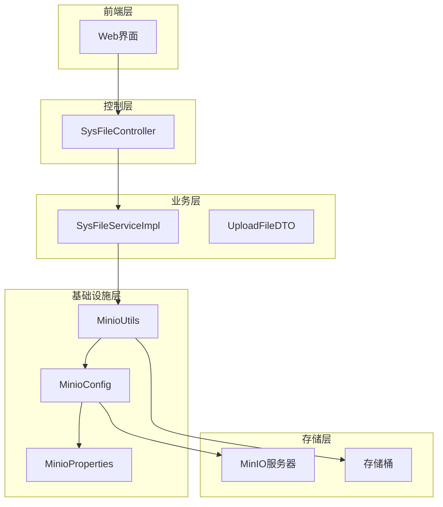
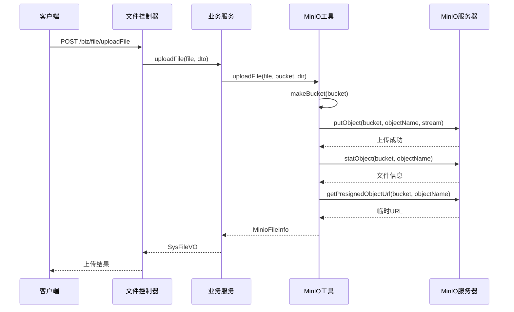
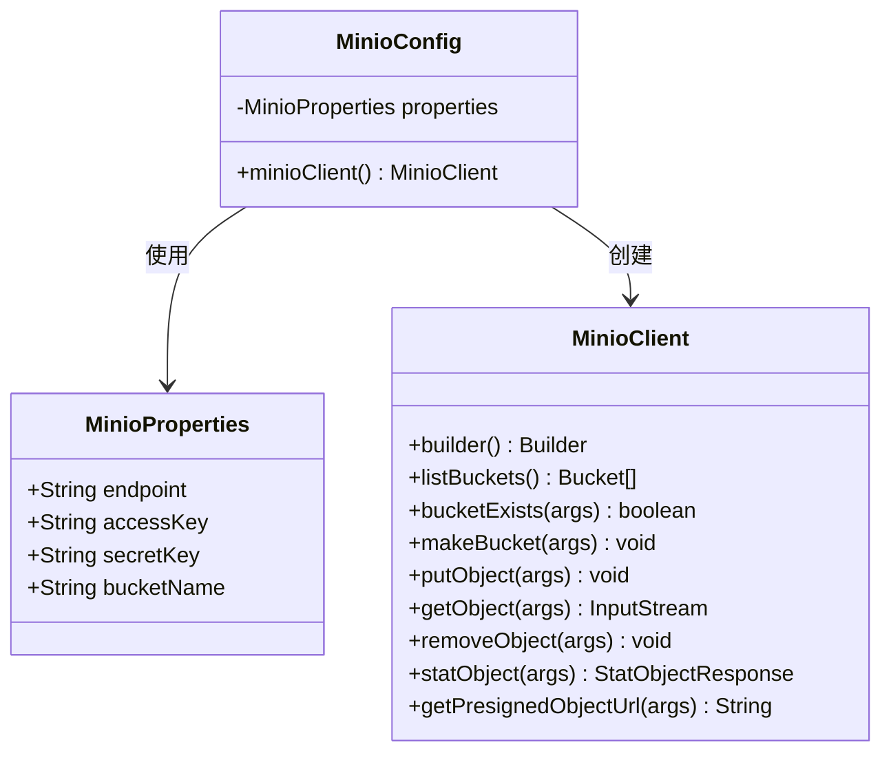
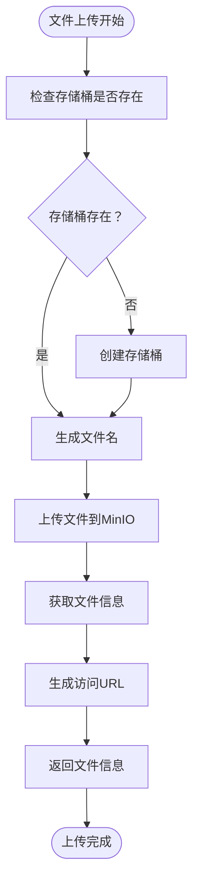
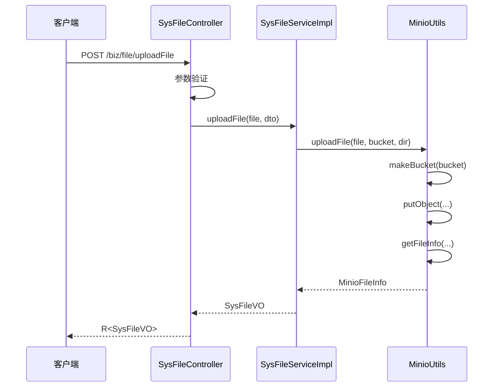
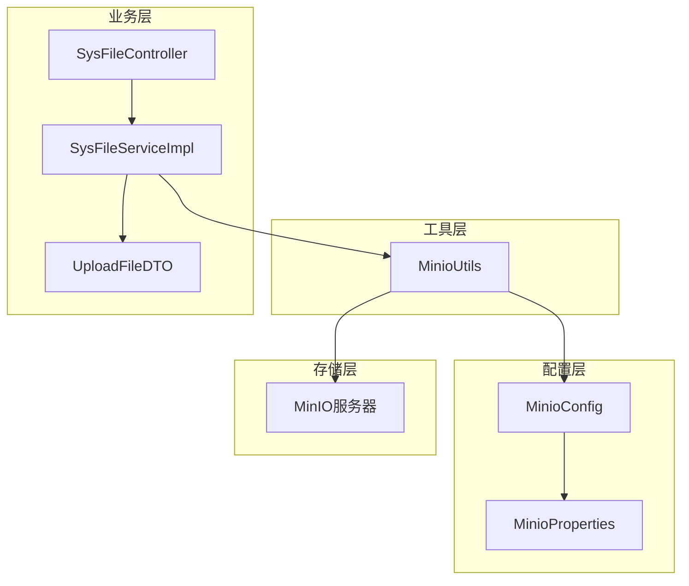

# 分布式存储配置

<cite>
**本文档引用的文件**
- [MinioConfig.java](file://blog-common/src/main/java/blog/common/config/minio/MinioConfig.java)
- [MinioProperties.java](file://blog-common/src/main/java/blog/common/config/minio/MinioProperties.java)
- [MinioUtils.java](file://blog-common/src/main/java/blog/common/utils/minio/MinioUtils.java)
- [application.yml](file://blog-admin/src/main/resources/application.yml)
- [SysFileController.java](file://blog-admin/src/main/java/blog/web/controller/common/SysFileController.java)
- [SysFileServiceImpl.java](file://blog-biz/src/main/java/blog/biz/service/impl/SysFileServiceImpl.java)
- [UploadFileDTO.java](file://blog-biz/src/main/java/blog/biz/domain/dto/UploadFileDTO.java)
- [SysFileVO.java](file://blog-biz/src/main/java/blog/biz/domain/vo/SysFileVO.java)
</cite>

## 目录
1. [简介](#简介)
2. [项目结构](#项目结构)
3. [核心组件](#核心组件)
4. [架构概览](#架构概览)
5. [详细组件分析](#详细组件分析)
6. [依赖关系分析](#依赖关系分析)
7. [性能考虑](#性能考虑)
8. [故障排除指南](#故障排除指南)
9. [结论](#结论)
10. [附录](#附录)

## 简介
本文件提供了基于Spring Boot项目的分布式存储配置实施方案，重点围绕MinIO客户端配置、连接参数设置、认证配置、SSL/TLS配置以及存储桶管理策略。通过对现有代码库的深入分析，展示了如何在实际应用中实现可靠的分布式存储解决方案，并提供生产环境配置建议、性能调优参数和安全配置最佳实践。

## 项目结构
该项目采用典型的三层架构设计，包含以下与分布式存储相关的关键模块：



**图表来源**
- [MinioConfig.java:1-34](file://blog-common/src/main/java/blog/common/config/minio/MinioConfig.java#L1-L34)
- [MinioProperties.java:1-23](file://blog-common/src/main/java/blog/common/config/minio/MinioProperties.java#L1-L23)
- [MinioUtils.java:1-325](file://blog-common/src/main/java/blog/common/utils/minio/MinioUtils.java#L1-L325)

**章节来源**
- [application.yml:155-161](file://blog-admin/src/main/resources/application.yml#L155-L161)
- [SysFileController.java:1-123](file://blog-admin/src/main/java/blog/web/controller/common/SysFileController.java#L1-L123)

## 核心组件
本项目实现了完整的MinIO分布式存储配置体系，包含以下核心组件：

### MinIO客户端配置
系统通过`MinioConfig`类提供完整的客户端配置支持：
- **连接参数设置**：支持自定义端点、访问密钥和秘密密钥
- **认证配置**：基于AWS签名版本4的认证机制
- **连接验证**：启动时自动验证连接和认证的有效性

### 存储桶管理
`MinioUtils`工具类提供了全面的存储桶操作功能：
- **桶存在性检查**：验证存储桶是否已创建
- **桶创建**：自动创建缺失的存储桶
- **文件上传**：支持多种文件上传方式
- **文件管理**：提供完整的文件生命周期管理

### 文件上传流程
系统实现了从文件上传到存储管理的完整流程：
- **业务类型分类**：按业务类型和业务ID组织文件存储
- **文件命名策略**：使用UUID确保文件名唯一性
- **URL生成**：支持临时访问URL和永久访问URL

**章节来源**
- [MinioConfig.java:17-31](file://blog-common/src/main/java/blog/common/config/minio/MinioConfig.java#L17-L31)
- [MinioUtils.java:54-147](file://blog-common/src/main/java/blog/common/utils/minio/MinioUtils.java#L54-L147)
- [SysFileController.java:111-121](file://blog-admin/src/main/java/blog/web/controller/common/SysFileController.java#L111-L121)

## 架构概览
系统采用分层架构设计，确保分布式存储配置的可维护性和扩展性：



**图表来源**
- [SysFileController.java:111-121](file://blog-admin/src/main/java/blog/web/controller/common/SysFileController.java#L111-L121)
- [SysFileServiceImpl.java:151-167](file://blog-biz/src/main/java/blog/biz/service/impl/SysFileServiceImpl.java#L151-L167)
- [MinioUtils.java:85-111](file://blog-common/src/main/java/blog/common/utils/minio/MinioUtils.java#L85-L111)

## 详细组件分析

### MinIO配置类分析
`MinioConfig`类实现了Spring Boot的自动配置机制，提供完整的MinIO客户端实例：



**图表来源**
- [MinioConfig.java:12-31](file://blog-common/src/main/java/blog/common/config/minio/MinioConfig.java#L12-L31)
- [MinioProperties.java:12-22](file://blog-common/src/main/java/blog/common/config/minio/MinioProperties.java#L12-L22)

该配置类的核心特性包括：
- **自动装配**：通过`@Autowired`注入配置属性
- **Bean定义**：使用`@Bean`注解创建MinioClient实例
- **连接验证**：启动时执行`listBuckets()`验证连接
- **日志记录**：提供连接状态的日志输出

**章节来源**
- [MinioConfig.java:14-31](file://blog-common/src/main/java/blog/common/config/minio/MinioConfig.java#L14-L31)

### MinIO工具类分析
`MinioUtils`类提供了企业级的文件操作封装，支持多种存储场景：



**图表来源**
- [MinioUtils.java:85-111](file://blog-common/src/main/java/blog/common/utils/minio/MinioUtils.java#L85-L111)

工具类的主要功能模块：
- **存储桶操作**：存在性检查和创建
- **文件上传**：支持MultipartFile和本地文件
- **文件信息**：统计文件元数据和生成URL
- **文件管理**：删除和列表操作

**章节来源**
- [MinioUtils.java:54-321](file://blog-common/src/main/java/blog/common/utils/minio/MinioUtils.java#L54-L321)

### 文件上传控制器分析
`SysFileController`提供了RESTful接口用于文件上传操作：



**图表来源**
- [SysFileController.java:111-121](file://blog-admin/src/main/java/blog/web/controller/common/SysFileController.java#L111-L121)
- [SysFileServiceImpl.java:151-167](file://blog-biz/src/main/java/blog/biz/service/impl/SysFileServiceImpl.java#L151-L167)

**章节来源**
- [SysFileController.java:111-121](file://blog-admin/src/main/java/blog/web/controller/common/SysFileController.java#L111-L121)
- [SysFileServiceImpl.java:151-167](file://blog-biz/src/main/java/blog/biz/service/impl/SysFileServiceImpl.java#L151-L167)

## 依赖关系分析
系统各组件之间的依赖关系清晰明确，遵循依赖倒置原则：



**图表来源**
- [MinioConfig.java:14-15](file://blog-common/src/main/java/blog/common/config/minio/MinioConfig.java#L14-L15)
- [SysFileServiceImpl.java:40-41](file://blog-biz/src/main/java/blog/biz/service/impl/SysFileServiceImpl.java#L40-L41)

**章节来源**
- [MinioConfig.java:14-15](file://blog-common/src/main/java/blog/common/config/minio/MinioConfig.java#L14-L15)
- [SysFileServiceImpl.java:40-41](file://blog-biz/src/main/java/blog/biz/service/impl/SysFileServiceImpl.java#L40-L41)

## 性能考虑
基于现有实现，以下是关键的性能优化建议：

### 连接池配置
- **客户端复用**：MinioClient实例在整个应用生命周期内复用
- **连接超时**：建议配置合理的连接超时和读取超时
- **重试机制**：实现指数退避的重试策略

### 文件上传优化
- **分块上传**：对于大文件考虑使用分块上传机制
- **并发处理**：支持多文件并发上传
- **内存管理**：避免大文件的内存拷贝

### 缓存策略
- **元数据缓存**：缓存常用的文件元数据
- **URL缓存**：短期缓存临时访问URL
- **桶信息缓存**：缓存桶的存在性检查结果

## 故障排除指南
针对分布式存储配置可能遇到的问题提供解决方案：

### 连接问题诊断
1. **网络连接失败**
   - 检查MinIO服务器地址和端口配置
   - 验证防火墙和网络安全组设置
   - 确认DNS解析正常

2. **认证失败**
   - 验证Access Key和Secret Key的正确性
   - 检查IAM用户权限配置
   - 确认时间同步（NTP）

3. **SSL/TLS问题**
   - 验证证书链完整性
   - 检查证书有效期
   - 确认客户端支持的TLS版本

### 存储桶问题
1. **桶不存在**
   - 系统会自动创建缺失的存储桶
   - 检查桶命名规则和权限
   - 验证存储配额限制

2. **文件上传失败**
   - 检查文件大小限制
   - 验证存储空间充足
   - 确认文件类型允许

**章节来源**
- [MinioConfig.java:24-29](file://blog-common/src/main/java/blog/common/config/minio/MinioConfig.java#L24-L29)
- [MinioUtils.java:124-127](file://blog-common/src/main/java/blog/common/utils/minio/MinioUtils.java#L124-L127)

## 结论
本项目提供了完整的分布式存储配置实施方案，通过Spring Boot自动配置机制实现了MinIO客户端的无缝集成。系统具备以下优势：

- **配置简洁**：通过application.yml即可完成基本配置
- **功能完整**：涵盖存储桶管理、文件上传下载、URL生成等核心功能
- **扩展性强**：模块化设计便于功能扩展和定制
- **安全性高**：支持认证和授权机制

建议在生产环境中进一步完善监控、日志和备份策略，以确保系统的稳定运行。

## 附录

### 配置文件模板
基于现有实现，提供完整的配置模板：

```yaml
# MinIO存储配置
minio:
  endpoint: http://localhost:9000
  access-key: YOUR_ACCESS_KEY
  secret-key: YOUR_SECRET_KEY
  bucket-name: blog-bucket

# 文件上传配置
spring:
  servlet:
    multipart:
      max-file-size: 10MB
      max-request-size: 20MB
```

### 最佳实践建议
1. **生产环境配置**
   - 使用HTTPS端点
   - 配置专用的IAM用户
   - 启用访问日志和审计

2. **性能调优**
   - 调整连接池大小
   - 优化文件分块大小
   - 配置合适的超时参数

3. **安全配置**
   - 定期轮换访问密钥
   - 实施最小权限原则
   - 启用服务器端加密

**章节来源**
- [application.yml:155-161](file://blog-admin/src/main/resources/application.yml#L155-L161)
- [MinioProperties.java:14-20](file://blog-common/src/main/java/blog/common/config/minio/MinioProperties.java#L14-L20)