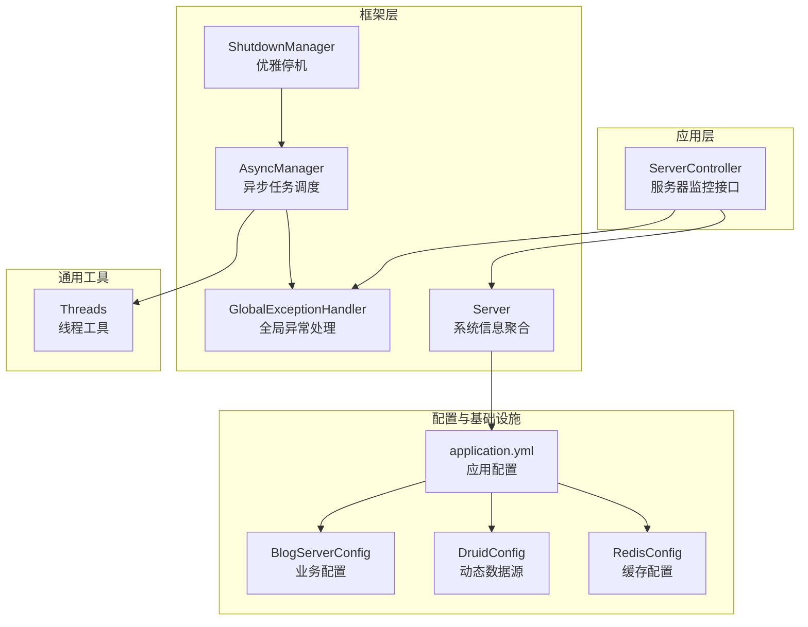
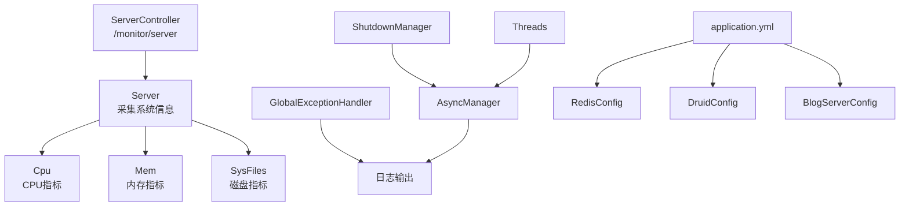
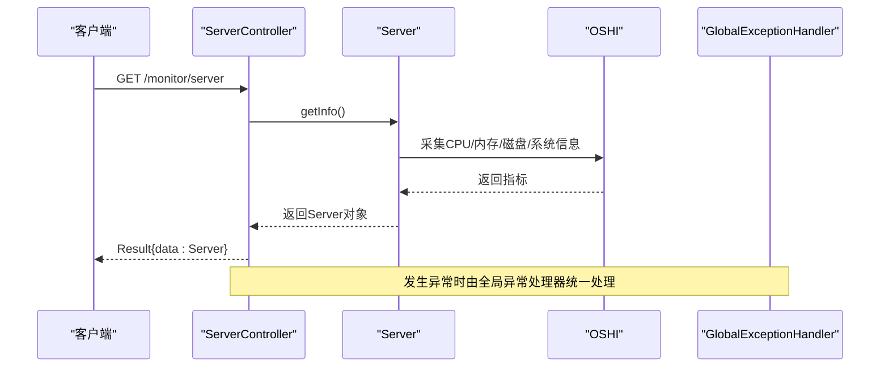
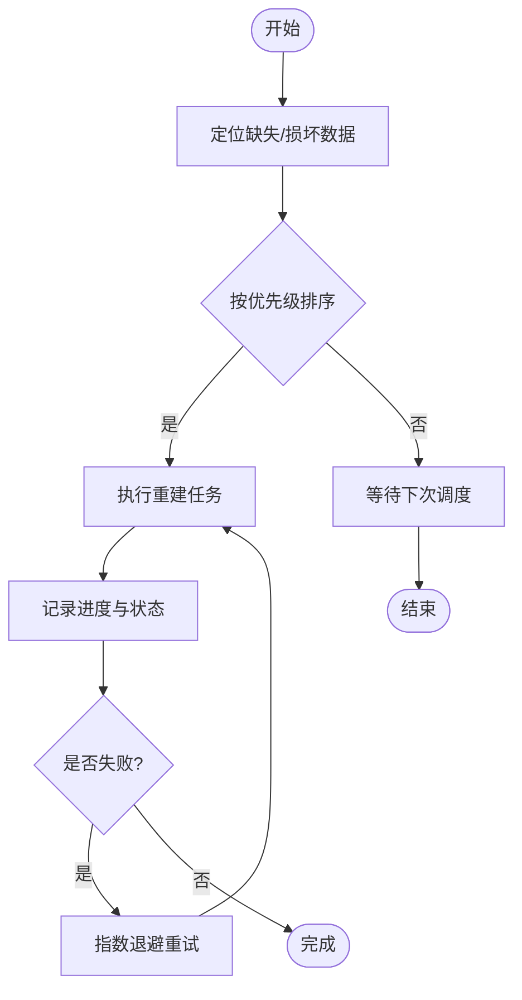
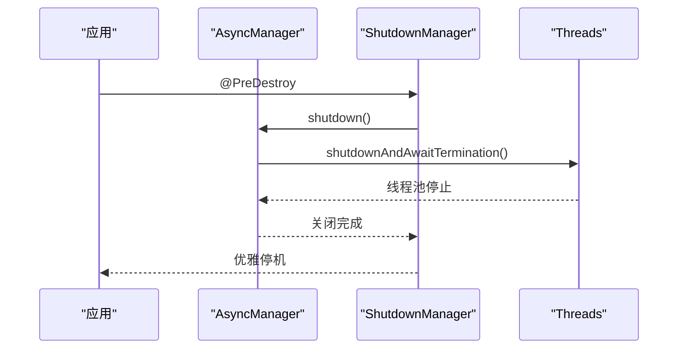
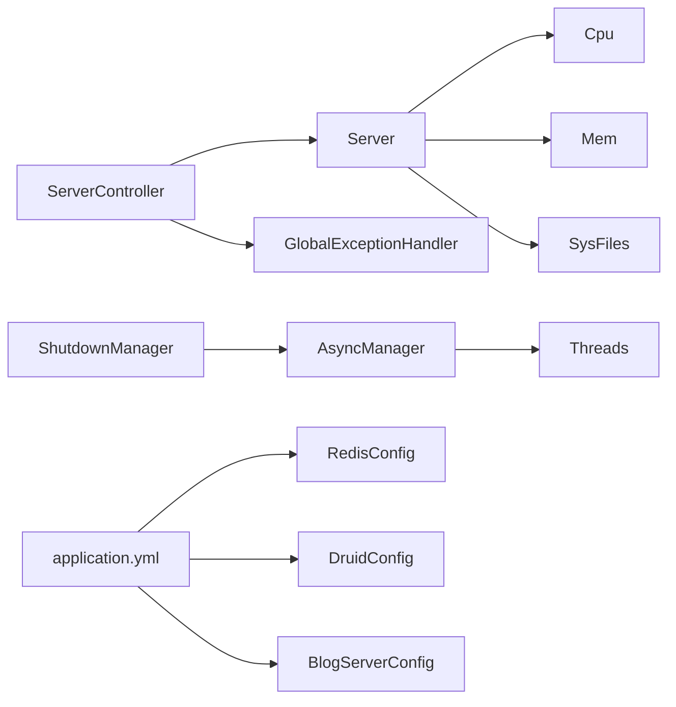

# 存储故障恢复

<cite>
**本文引用的文件**
- [ServerController.java](file://blog-admin/src/main/java/blog/web/controller/monitor/ServerController.java)
- [Server.java](file://blog-framework/src/main/java/blog/framework/web/domain/Server.java)
- [Cpu.java](file://blog-framework/src/main/java/blog/framework/web/domain/server/Cpu.java)
- [Mem.java](file://blog-framework/src/main/java/blog/framework/web/domain/server/Mem.java)
- [SysFiles.java](file://blog-framework/src/main/java/blog/framework/web/domain/server/SysFiles.java)
- [application.yml](file://blog-admin/src/main/resources/application.yml)
- [BlogServerConfig.java](file://blog-common/src/main/java/blog/common/config/BlogServerConfig.java)
- [RedisConfig.java](file://blog-framework/src/main/java/blog/framework/config/RedisConfig.java)
- [DruidConfig.java](file://blog-framework/src/main/java/blog/framework/config/DruidConfig.java)
- [GlobalExceptionHandler.java](file://blog-framework/src/main/java/blog/framework/web/exception/GlobalExceptionHandler.java)
- [AsyncManager.java](file://blog-framework/src/main/java/blog/framework/manager/AsyncManager.java)
- [ShutdownManager.java](file://blog-framework/src/main/java/blog/framework/manager/ShutdownManager.java)
- [Threads.java](file://blog-common/src/main/java/blog/common/utils/Threads.java)
- [SysLoginService.java](file://blog-framework/src/main/java/blog/framework/web/service/SysLoginService.java)
</cite>

## 目录
1. [简介](#简介)
2. [项目结构](#项目结构)
3. [核心组件](#核心组件)
4. [架构总览](#架构总览)
5. [详细组件分析](#详细组件分析)
6. [依赖分析](#依赖分析)
7. [性能考虑](#性能考虑)
8. [故障排查指南](#故障排查指南)
9. [结论](#结论)
10. [附录](#附录)

## 简介
本方案围绕“存储故障恢复”目标，结合代码库现有能力，构建可落地的故障检测、数据重建、服务自动恢复、故障预防与演练预案。当前代码库提供了基础的服务器资源监控、全局异常处理、异步任务管理、动态数据源与缓存配置等能力，这些能力可作为存储故障恢复体系的基础设施。本文将从节点故障检测、数据重建策略、服务自动恢复、故障预防与演练五个方面给出实施方案。

## 项目结构
后端采用多模块分层组织，核心模块如下：
- blog-admin：Web 控制器与应用入口
- blog-framework：框架层（安全、监控、异常、异步、配置）
- blog-biz：业务域（领域模型、Mapper、Service）
- blog-common：通用工具与配置
- blog-system、blog-quartz、blog-generator：系统管理、定时任务、代码生成等扩展模块

**图表来源**
- [ServerController.java:1-26](file://blog-admin/src/main/java/blog/web/controller/monitor/ServerController.java#L1-L26)
- [Server.java:1-137](file://blog-framework/src/main/java/blog/framework/web/domain/Server.java#L1-L137)
- [GlobalExceptionHandler.java:1-134](file://blog-framework/src/main/java/blog/framework/web/exception/GlobalExceptionHandler.java#L1-L134)
- [AsyncManager.java:1-54](file://blog-framework/src/main/java/blog/framework/manager/AsyncManager.java#L1-L54)
- [ShutdownManager.java:1-34](file://blog-framework/src/main/java/blog/framework/manager/ShutdownManager.java#L1-L34)
- [application.yml:1-161](file://blog-admin/src/main/resources/application.yml#L1-L161)
- [RedisConfig.java:1-67](file://blog-framework/src/main/java/blog/framework/config/RedisConfig.java#L1-L67)
- [DruidConfig.java:1-117](file://blog-framework/src/main/java/blog/framework/config/DruidConfig.java#L1-L117)
- [BlogServerConfig.java:1-120](file://blog-common/src/main/java/blog/common/config/BlogServerConfig.java#L1-L120)
- [Threads.java:1-76](file://blog-common/src/main/java/blog/common/utils/Threads.java#L1-L76)

**章节来源**
- [ServerController.java:1-26](file://blog-admin/src/main/java/blog/web/controller/monitor/ServerController.java#L1-L26)
- [application.yml:1-161](file://blog-admin/src/main/resources/application.yml#L1-L161)

## 核心组件
- 服务器监控与资源采集：通过 Server 聚合 CPU、内存、磁盘、系统信息，并由 ServerController 暴露接口供前端展示。
- 全局异常处理：统一捕获各类异常，输出标准响应，便于故障定位与告警联动。
- 异步任务管理：提供异步记录登录日志、操作日志等，降低主流程阻塞风险。
- 动态数据源与缓存：支持主从切换与缓存序列化配置，为存储高可用提供基础。
- 优雅停机：应用销毁前主动停止异步任务，避免资源泄漏。

**章节来源**
- [Server.java:1-137](file://blog-framework/src/main/java/blog/framework/web/domain/Server.java#L1-L137)
- [Cpu.java:1-102](file://blog-framework/src/main/java/blog/framework/web/domain/server/Cpu.java#L1-L102)
- [Mem.java:1-54](file://blog-framework/src/main/java/blog/framework/web/domain/server/Mem.java#L1-L54)
- [SysFiles.java:1-100](file://blog-framework/src/main/java/blog/framework/web/domain/server/SysFiles.java#L1-L100)
- [GlobalExceptionHandler.java:1-134](file://blog-framework/src/main/java/blog/framework/web/exception/GlobalExceptionHandler.java#L1-L134)
- [AsyncManager.java:1-54](file://blog-framework/src/main/java/blog/framework/manager/AsyncManager.java#L1-L54)
- [ShutdownManager.java:1-34](file://blog-framework/src/main/java/blog/framework/manager/ShutdownManager.java#L1-L34)
- [DruidConfig.java:1-117](file://blog-framework/src/main/java/blog/framework/config/DruidConfig.java#L1-L117)
- [RedisConfig.java:1-67](file://blog-framework/src/main/java/blog/framework/config/RedisConfig.java#L1-L67)

## 架构总览
下图展示了存储故障恢复相关的关键交互：监控采集、异常处理、异步记录、动态数据源与缓存配置之间的关系。

**图表来源**
- [ServerController.java:1-26](file://blog-admin/src/main/java/blog/web/controller/monitor/ServerController.java#L1-L26)
- [Server.java:1-137](file://blog-framework/src/main/java/blog/framework/web/domain/Server.java#L1-L137)
- [Cpu.java:1-102](file://blog-framework/src/main/java/blog/framework/web/domain/server/Cpu.java#L1-L102)
- [Mem.java:1-54](file://blog-framework/src/main/java/blog/framework/web/domain/server/Mem.java#L1-L54)
- [SysFiles.java:1-100](file://blog-framework/src/main/java/blog/framework/web/domain/server/SysFiles.java#L1-L100)
- [GlobalExceptionHandler.java:1-134](file://blog-framework/src/main/java/blog/framework/web/exception/GlobalExceptionHandler.java#L1-L134)
- [AsyncManager.java:1-54](file://blog-framework/src/main/java/blog/framework/manager/AsyncManager.java#L1-L54)
- [ShutdownManager.java:1-34](file://blog-framework/src/main/java/blog/framework/manager/ShutdownManager.java#L1-L34)
- [application.yml:1-161](file://blog-admin/src/main/resources/application.yml#L1-L161)
- [RedisConfig.java:1-67](file://blog-framework/src/main/java/blog/framework/config/RedisConfig.java#L1-L67)
- [DruidConfig.java:1-117](file://blog-framework/src/main/java/blog/framework/config/DruidConfig.java#L1-L117)
- [BlogServerConfig.java:1-120](file://blog-common/src/main/java/blog/common/config/BlogServerConfig.java#L1-L120)
- [Threads.java:1-76](file://blog-common/src/main/java/blog/common/utils/Threads.java#L1-L76)

## 详细组件分析

### 节点故障检测机制
- 心跳监测
  - 服务器资源监控：通过 ServerController 暴露的监控接口，定期拉取 CPU、内存、磁盘使用率与温度等指标，作为节点健康度的参考。
  - 指标采集：Server 在 copyTo 中调用 OSHI 采集 CPU 温度、系统信息、文件系统等，Cpu/Mem/SysFiles 提供标准化字段。
- 超时判断
  - Web 层超时：application.yml 中配置了 Tomcat 最大线程、最小空闲线程、接受队列长度等，可作为请求堆积与超时的边界参考。
  - 缓存/数据库超时：RedisConfig 与 DruidConfig 提供连接超时、池大小等参数，可用于判定外部依赖超时。
- 故障上报
  - 全局异常处理：GlobalExceptionHandler 统一捕获异常并输出标准响应，便于上层监控系统采集与告警。
  - 异步记录：AsyncManager 将登录日志等异步写入，避免主流程阻塞，同时可扩展为故障事件上报通道。

**图表来源**
- [ServerController.java:18-24](file://blog-admin/src/main/java/blog/web/controller/monitor/ServerController.java#L18-L24)
- [Server.java:99-116](file://blog-framework/src/main/java/blog/framework/web/domain/Server.java#L99-L116)
- [GlobalExceptionHandler.java:34-104](file://blog-framework/src/main/java/blog/framework/web/exception/GlobalExceptionHandler.java#L34-L104)

**章节来源**
- [ServerController.java:18-24](file://blog-admin/src/main/java/blog/web/controller/monitor/ServerController.java#L18-L24)
- [Server.java:99-116](file://blog-framework/src/main/java/blog/framework/web/domain/Server.java#L99-L116)
- [Cpu.java:94-100](file://blog-framework/src/main/java/blog/framework/web/domain/server/Cpu.java#L94-L100)
- [Mem.java:26-52](file://blog-framework/src/main/java/blog/framework/web/domain/server/Mem.java#L26-L52)
- [SysFiles.java:68-98](file://blog-framework/src/main/java/blog/framework/web/domain/server/SysFiles.java#L68-L98)
- [application.yml:13-29](file://blog-admin/src/main/resources/application.yml#L13-L29)
- [GlobalExceptionHandler.java:34-104](file://blog-framework/src/main/java/blog/framework/web/exception/GlobalExceptionHandler.java#L34-L104)
- [AsyncManager.java:43-45](file://blog-framework/src/main/java/blog/framework/manager/AsyncManager.java#L43-L45)

### 数据重建流程
说明：当前代码库未直接实现分布式存储的“数据重建”逻辑。可基于现有组件设计“重建策略”的抽象与落地：
- 数据定位
  - 通过业务层 Mapper/Service 定义数据范围与一致性检查点。
  - 结合缓存键空间与数据库表结构，定位缺失/损坏的数据块。
- 重建优先级
  - 优先级策略：热点数据 > 最近变更数据 > 其他数据。
  - 依据缓存命中率与业务 SLA 设定重建权重。
- 重建进度跟踪
  - 使用异步任务（AsyncManager）调度重建任务，记录开始/结束时间与失败原因。
  - 通过日志与指标（如 Redis 计数器）跟踪进度，必要时回滚或重试。

[本图为概念流程图，无需图表来源]

### 服务自动恢复
- 故障转移
  - 动态数据源：DruidConfig 支持主从数据源配置，可在主库不可用时切换从库，保障读流量。
  - 缓存降级：RedisConfig 提供序列化与连接池配置，可配合熔断与降级策略减少缓存抖动。
- 负载重分配
  - 通过配置调整 Tomcat 线程池与队列长度（application.yml），缓解突发流量。
- 服务重启
  - ShutdownManager 在应用销毁前主动停止异步任务，避免资源泄漏；Threads 提供优雅停机工具。

**图表来源**
- [ShutdownManager.java:17-32](file://blog-framework/src/main/java/blog/framework/manager/ShutdownManager.java#L17-L32)
- [AsyncManager.java:50-52](file://blog-framework/src/main/java/blog/framework/manager/AsyncManager.java#L50-L52)
- [Threads.java:37-52](file://blog-common/src/main/java/blog/common/utils/Threads.java#L37-L52)

**章节来源**
- [DruidConfig.java:34-72](file://blog-framework/src/main/java/blog/framework/config/DruidConfig.java#L34-L72)
- [RedisConfig.java:21-39](file://blog-framework/src/main/java/blog/framework/config/RedisConfig.java#L21-L39)
- [application.yml:13-29](file://blog-admin/src/main/resources/application.yml#L13-L29)
- [ShutdownManager.java:17-32](file://blog-framework/src/main/java/blog/framework/manager/ShutdownManager.java#L17-L32)
- [AsyncManager.java:50-52](file://blog-framework/src/main/java/blog/framework/manager/AsyncManager.java#L50-L52)
- [Threads.java:37-52](file://blog-common/src/main/java/blog/common/utils/Threads.java#L37-L52)

### 故障预防措施
- 定期维护
  - 监控指标基线：利用 ServerController 接口定期采集 CPU/内存/磁盘/温度，建立基线阈值。
  - 配置巡检：application.yml 中的线程池、Tomcat 参数、Redis/数据库连接参数需定期复核。
- 容量监控
  - 磁盘使用率：SysFiles 提供磁盘总量/已用/剩余与使用率，建议设置阈值告警。
  - 内存使用率：Mem 提供使用率与容量换算，结合 JVM 指标综合评估。
- 性能预警
  - 全局异常处理：GlobalExceptionHandler 输出统一错误信息，可接入告警平台触发预警。
  - 异步日志：AsyncManager 记录登录/操作日志，辅助定位性能瓶颈。

**章节来源**
- [SysFiles.java:68-98](file://blog-framework/src/main/java/blog/framework/web/domain/server/SysFiles.java#L68-L98)
- [Mem.java:26-52](file://blog-framework/src/main/java/blog/framework/web/domain/server/Mem.java#L26-L52)
- [GlobalExceptionHandler.java:34-104](file://blog-framework/src/main/java/blog/framework/web/exception/GlobalExceptionHandler.java#L34-L104)
- [AsyncManager.java:43-45](file://blog-framework/src/main/java/blog/framework/manager/AsyncManager.java#L43-L45)

### 故障恢复演练指南与应急预案
- 演练步骤
  - 准备阶段：确定演练目标（如主库故障、缓存不可用、磁盘满）、参与角色与工具清单。
  - 执行阶段：模拟故障（如关闭主库/缓存/磁盘空间），观察监控与告警，验证自动恢复（主从切换、降级策略）。
  - 评估阶段：统计恢复时间、数据一致性、用户体验影响，形成改进建议。
- 应急预案
  - 主库故障：启用从库读写，隔离写入，修复后回切并校验数据一致性。
  - 缓存故障：开启降级与本地缓存，逐步恢复并监控命中率。
  - 磁盘满：清理临时文件与日志，扩容或迁移数据，恢复监控阈值。
  - 服务不可用：触发优雅停机与重启，确保异步任务正确回收。

[本节为流程性内容，无需章节来源]

## 依赖分析
- 组件耦合
  - ServerController 依赖 Server；Server 依赖各硬件/系统组件；全局异常处理贯穿各控制器。
  - AsyncManager 依赖 ScheduledExecutorService 与 Spring 上下文；ShutdownManager 依赖 AsyncManager。
  - application.yml 为全局配置中心，驱动 RedisConfig、DruidConfig、BlogServerConfig 等。
- 外部依赖
  - OSHI 用于系统信息采集；Spring Security 与 Spring Data Redis/MyBatis Plus 作为集成组件。

**图表来源**
- [ServerController.java:18-24](file://blog-admin/src/main/java/blog/web/controller/monitor/ServerController.java#L18-L24)
- [Server.java:99-116](file://blog-framework/src/main/java/blog/framework/web/domain/Server.java#L99-L116)
- [GlobalExceptionHandler.java:34-104](file://blog-framework/src/main/java/blog/framework/web/exception/GlobalExceptionHandler.java#L34-L104)
- [AsyncManager.java:24](file://blog-framework/src/main/java/blog/framework/manager/AsyncManager.java#L24)
- [ShutdownManager.java:17-32](file://blog-framework/src/main/java/blog/framework/manager/ShutdownManager.java#L17-L32)
- [application.yml:1-161](file://blog-admin/src/main/resources/application.yml#L1-161)
- [RedisConfig.java:21-39](file://blog-framework/src/main/java/blog/framework/config/RedisConfig.java#L21-L39)
- [DruidConfig.java:50-57](file://blog-framework/src/main/java/blog/framework/config/DruidConfig.java#L50-L57)
- [BlogServerConfig.java:68-118](file://blog-common/src/main/java/blog/common/config/BlogServerConfig.java#L68-L118)
- [Threads.java:37-52](file://blog-common/src/main/java/blog/common/utils/Threads.java#L37-L52)

**章节来源**
- [application.yml:1-161](file://blog-admin/src/main/resources/application.yml#L1-161)
- [DruidConfig.java:34-72](file://blog-framework/src/main/java/blog/framework/config/DruidConfig.java#L34-L72)
- [RedisConfig.java:21-39](file://blog-framework/src/main/java/blog/framework/config/RedisConfig.java#L21-L39)
- [BlogServerConfig.java:68-118](file://blog-common/src/main/java/blog/common/config/BlogServerConfig.java#L68-L118)
- [AsyncManager.java:24](file://blog-framework/src/main/java/blog/framework/manager/AsyncManager.java#L24)

## 性能考虑
- 异步化：将非关键路径（如日志、通知）放入 AsyncManager，降低同步阻塞。
- 资源池：合理配置 Tomcat 线程池与 Redis/数据库连接池，避免过载。
- 监控开销：Server 采集涉及系统调用，应控制采集频率与并发，避免额外压力。
- 优雅停机：使用 Threads 与 ShutdownManager 确保应用退出时资源释放。

[本节为通用指导，无需章节来源]

## 故障排查指南
- 常见问题定位
  - 服务器监控无数据：检查 ServerController 权限注解与 Server.copyTo 是否正常调用。
  - 异常未被捕获：确认 GlobalExceptionHandler 是否生效，以及具体异常类型分支。
  - 异步任务未执行：检查 AsyncManager 的调度与线程池配置，以及 ShutdownManager 是否提前关闭。
- 快速处置
  - 启用更详细的日志级别（application.yml logging.level），复现问题并收集上下文。
  - 对照异常处理器输出，快速定位异常来源与参数校验失败点。
  - 若涉及缓存/数据库，检查对应配置与连接状态。

**章节来源**
- [ServerController.java:18-24](file://blog-admin/src/main/java/blog/web/controller/monitor/ServerController.java#L18-L24)
- [GlobalExceptionHandler.java:34-104](file://blog-framework/src/main/java/blog/framework/web/exception/GlobalExceptionHandler.java#L34-L104)
- [AsyncManager.java:43-45](file://blog-framework/src/main/java/blog/framework/manager/AsyncManager.java#L43-L45)
- [ShutdownManager.java:25-32](file://blog-framework/src/main/java/blog/framework/manager/ShutdownManager.java#L25-L32)
- [application.yml:31-34](file://blog-admin/src/main/resources/application.yml#L31-L34)

## 结论
本方案基于现有代码库的监控、异常、异步与配置能力，构建了存储故障恢复的实施框架：以服务器监控为基础，以全局异常处理与异步记录为手段，以动态数据源与缓存配置为支撑，辅以优雅停机与性能优化，形成可执行的故障检测、数据重建策略、服务自动恢复与预防性管理方案。建议在生产环境中补充分布式存储层面的重建与一致性校验逻辑，并完善演练与应急预案。

## 附录
- 相关配置项参考
  - 服务器端口与 Tomcat 线程池：[application.yml:13-29](file://blog-admin/src/main/resources/application.yml#L13-L29)
  - Redis 连接与池参数：[application.yml:65-89](file://blog-admin/src/main/resources/application.yml#L65-L89)
  - MyBatis-Plus 与分页插件：[application.yml:108-124](file://blog-admin/src/main/resources/application.yml#L108-L124)
  - MinIO 存储桶配置：[application.yml:155-161](file://blog-admin/src/main/resources/application.yml#L155-L161)