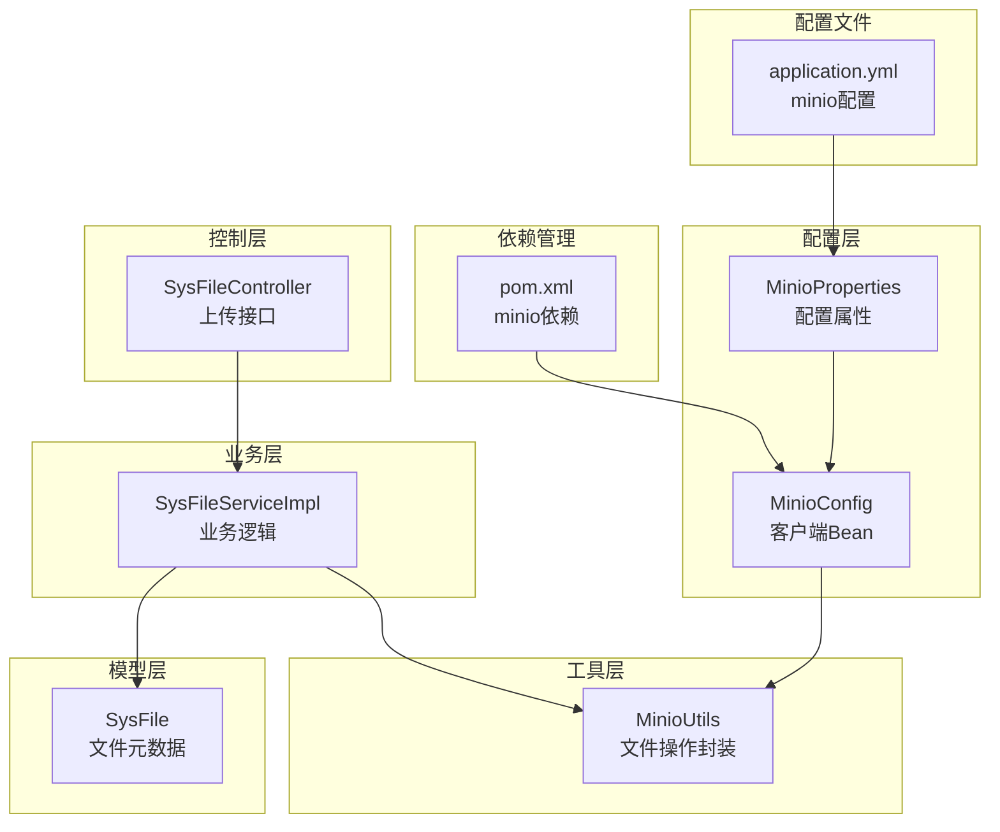
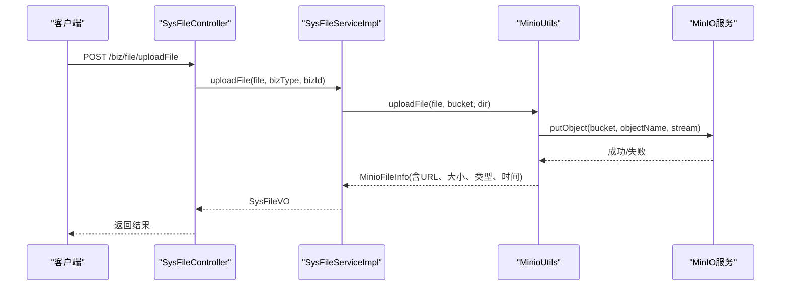
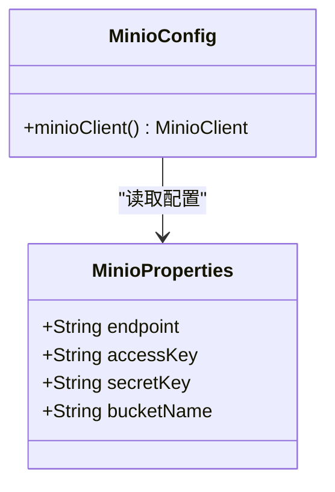
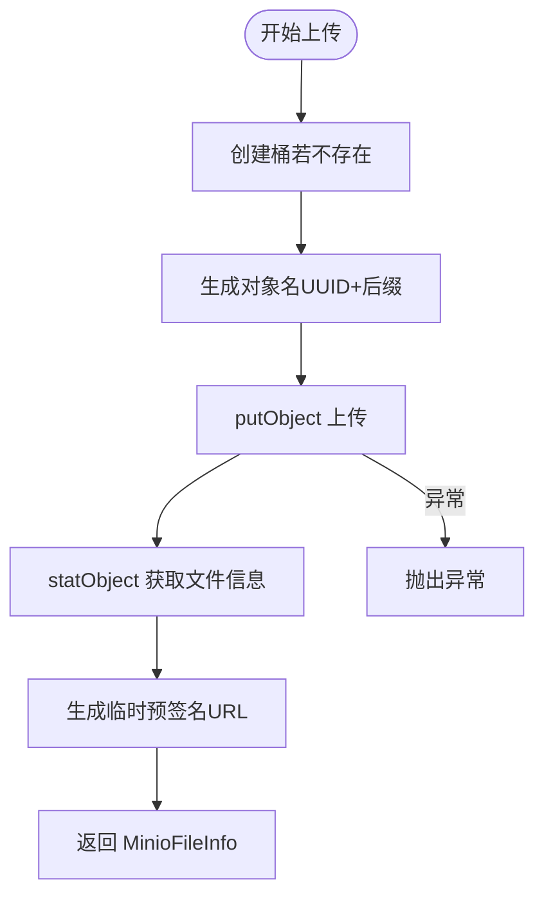
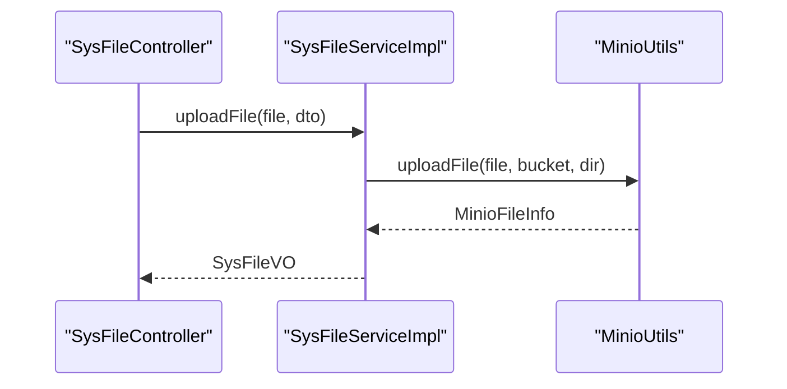
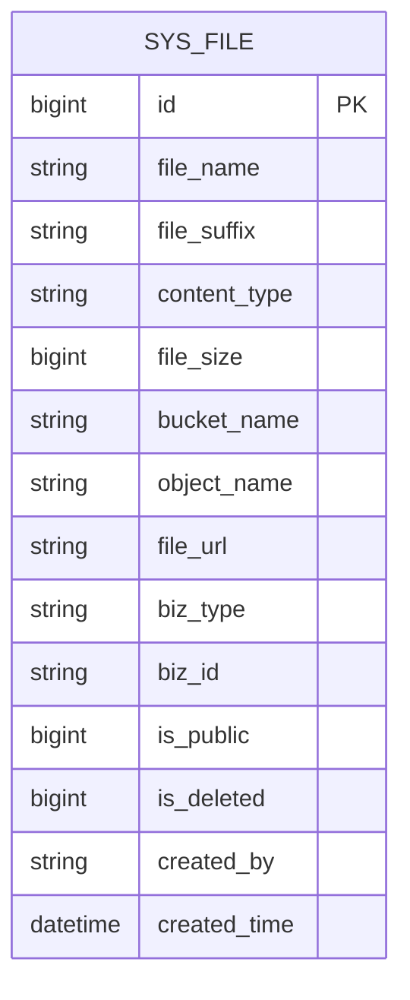
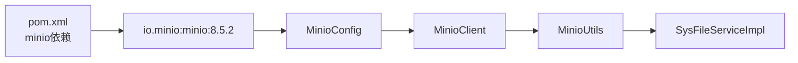

# 存储高可用

<cite>
**本文引用的文件**
- [MinioConfig.java](file://blog-common/src/main/java/blog/common/config/minio/MinioConfig.java)
- [MinioProperties.java](file://blog-common/src/main/java/blog/common/config/minio/MinioProperties.java)
- [MinioUtils.java](file://blog-common/src/main/java/blog/common/utils/minio/MinioUtils.java)
- [application.yml](file://blog-admin/src/main/resources/application.yml)
- [SysFileController.java](file://blog-admin/src/main/java/blog/web/controller/common/SysFileController.java)
- [SysFileServiceImpl.java](file://blog-biz/src/main/java/blog/biz/service/impl/SysFileServiceImpl.java)
- [SysFile.java](file://blog-biz/src/main/java/blog/biz/domain/SysFile.java)
- [pom.xml](file://pom.xml)
- [BlogServerConfig.java](file://blog-common/src/main/java/blog/common/config/BlogServerConfig.java)
- [FileUploadUtils.java](file://blog-common/src/main/java/blog/common/utils/file/FileUploadUtils.java)
</cite>

## 目录
1. [简介](#简介)
2. [项目结构](#项目结构)
3. [核心组件](#核心组件)
4. [架构总览](#架构总览)
5. [详细组件分析](#详细组件分析)
6. [依赖分析](#依赖分析)
7. [性能考虑](#性能考虑)
8. [故障排查指南](#故障排查指南)
9. [结论](#结论)
10. [附录](#附录)

## 简介
本方案围绕现有代码库中基于 MinIO 的文件存储能力，提出一套面向高可用的实施方案。当前系统通过 Spring Boot 自动装配加载 MinIO 客户端，并提供统一的文件上传、下载、删除、列举与预签名 URL 生成能力。本文将在此基础上扩展到分布式存储配置、纠删码策略、跨节点同步、故障恢复、性能优化与高并发稳定性保障，帮助在生产环境中实现稳定可靠的文件存储。

## 项目结构
系统采用多模块 Maven 结构，文件存储相关的核心位于 blog-common 与 blog-biz 模块：
- 配置层：MinioConfig、MinioProperties 提供 MinIO 客户端与配置注入
- 工具层：MinioUtils 封装常用文件操作
- 控制层：SysFileController 提供上传接口
- 业务层：SysFileServiceImpl 调用 MinioUtils 完成上传与元数据落库
- 模型层：SysFile 记录文件元数据
- 配置文件：application.yml 中包含 minio 配置项
- 依赖管理：pom.xml 中引入 io.minio:minio

图表来源
- [MinioConfig.java:1-34](file://blog-common/src/main/java/blog/common/config/minio/MinioConfig.java#L1-L34)
- [MinioProperties.java:1-23](file://blog-common/src/main/java/blog/common/config/minio/MinioProperties.java#L1-L23)
- [MinioUtils.java:1-325](file://blog-common/src/main/java/blog/common/utils/minio/MinioUtils.java#L1-L325)
- [SysFileController.java:1-123](file://blog-admin/src/main/java/blog/web/controller/common/SysFileController.java#L1-L123)
- [SysFileServiceImpl.java:1-169](file://blog-biz/src/main/java/blog/biz/service/impl/SysFileServiceImpl.java#L1-L169)
- [SysFile.java:1-95](file://blog-biz/src/main/java/blog/biz/domain/SysFile.java#L1-L95)
- [application.yml:155-161](file://blog-admin/src/main/resources/application.yml#L155-L161)
- [pom.xml:214-219](file://pom.xml#L214-L219)

章节来源
- [MinioConfig.java:1-34](file://blog-common/src/main/java/blog/common/config/minio/MinioConfig.java#L1-L34)
- [MinioProperties.java:1-23](file://blog-common/src/main/java/blog/common/config/minio/MinioProperties.java#L1-L23)
- [MinioUtils.java:1-325](file://blog-common/src/main/java/blog/common/utils/minio/MinioUtils.java#L1-L325)
- [SysFileController.java:1-123](file://blog-admin/src/main/java/blog/web/controller/common/SysFileController.java#L1-L123)
- [SysFileServiceImpl.java:1-169](file://blog-biz/src/main/java/blog/biz/service/impl/SysFileServiceImpl.java#L1-L169)
- [SysFile.java:1-95](file://blog-biz/src/main/java/blog/biz/domain/SysFile.java#L1-L95)
- [application.yml:155-161](file://blog-admin/src/main/resources/application.yml#L155-L161)
- [pom.xml:214-219](file://pom.xml#L214-L219)

## 核心组件
- MinioProperties：从 application.yml 读取 endpoint、accessKey、secretKey、bucketName 等配置
- MinioConfig：构建 MinioClient 并进行连通性验证
- MinioUtils：封装 Bucket 操作、文件上传、下载、删除、列举、统计、预签名 URL 生成等
- SysFileController：对外提供上传接口，接收 MultipartFile
- SysFileServiceImpl：调用 MinioUtils 完成上传，组装返回 VO
- SysFile：记录文件元数据（桶名、对象名、URL、业务类型、业务ID、是否公开、是否删除等）

章节来源
- [MinioProperties.java:1-23](file://blog-common/src/main/java/blog/common/config/minio/MinioProperties.java#L1-L23)
- [MinioConfig.java:1-34](file://blog-common/src/main/java/blog/common/config/minio/MinioConfig.java#L1-L34)
- [MinioUtils.java:1-325](file://blog-common/src/main/java/blog/common/utils/minio/MinioUtils.java#L1-L325)
- [SysFileController.java:111-121](file://blog-admin/src/main/java/blog/web/controller/common/SysFileController.java#L111-L121)
- [SysFileServiceImpl.java:151-167](file://blog-biz/src/main/java/blog/biz/service/impl/SysFileServiceImpl.java#L151-L167)
- [SysFile.java:20-95](file://blog-biz/src/main/java/blog/biz/domain/SysFile.java#L20-L95)

## 架构总览
当前系统采用“应用服务 + MinIO 对象存储”的架构。应用服务负责业务编排与鉴权，MinIO 负责对象存储与访问控制。文件上传流程如下：

图表来源
- [SysFileController.java:111-121](file://blog-admin/src/main/java/blog/web/controller/common/SysFileController.java#L111-L121)
- [SysFileServiceImpl.java:151-167](file://blog-biz/src/main/java/blog/biz/service/impl/SysFileServiceImpl.java#L151-L167)
- [MinioUtils.java:85-111](file://blog-common/src/main/java/blog/common/utils/minio/MinioUtils.java#L85-L111)

## 详细组件分析

### MinIO 客户端与配置
- 配置项：endpoint、accessKey、secretKey、bucketName
- 客户端构建：使用 builder 模式设置 endpoint 与凭证
- 连通性验证：首次构建后调用 listBuckets 进行连接与认证验证

图表来源
- [MinioProperties.java:14-20](file://blog-common/src/main/java/blog/common/config/minio/MinioProperties.java#L14-L20)
- [MinioConfig.java:18-31](file://blog-common/src/main/java/blog/common/config/minio/MinioConfig.java#L18-L31)

章节来源
- [MinioProperties.java:1-23](file://blog-common/src/main/java/blog/common/config/minio/MinioProperties.java#L1-L23)
- [MinioConfig.java:1-34](file://blog-common/src/main/java/blog/common/config/minio/MinioConfig.java#L1-L34)
- [application.yml:155-161](file://blog-admin/src/main/resources/application.yml#L155-L161)

### MinioUtils 文件操作
- Bucket 操作：存在性检查、创建（若不存在）
- 文件上传：支持 MultipartFile 与本地文件路径两种方式；生成随机对象名并设置内容类型
- 文件信息：statObject 获取大小、类型、最后修改时间；生成临时预签名 URL
- 下载：返回 InputStream 用于后端实时下载
- 删除：单个与批量删除；批量删除会收集失败项
- 列举：按前缀列出对象，支持递归
- URL 生成：临时 URL 与永久 URL（需桶公共可读）

图表来源
- [MinioUtils.java:85-111](file://blog-common/src/main/java/blog/common/utils/minio/MinioUtils.java#L85-L111)
- [MinioUtils.java:159-182](file://blog-common/src/main/java/blog/common/utils/minio/MinioUtils.java#L159-L182)

章节来源
- [MinioUtils.java:1-325](file://blog-common/src/main/java/blog/common/utils/minio/MinioUtils.java#L1-L325)

### 控制层与业务层
- 控制层：SysFileController 提供 /biz/file/uploadFile 接口，接收 MultipartFile 并转发给业务层
- 业务层：SysFileServiceImpl 调用 MinioUtils 完成上传，组装 SysFileVO 返回给控制器

图表来源
- [SysFileController.java:111-121](file://blog-admin/src/main/java/blog/web/controller/common/SysFileController.java#L111-L121)
- [SysFileServiceImpl.java:151-167](file://blog-biz/src/main/java/blog/biz/service/impl/SysFileServiceImpl.java#L151-L167)

章节来源
- [SysFileController.java:1-123](file://blog-admin/src/main/java/blog/web/controller/common/SysFileController.java#L1-L123)
- [SysFileServiceImpl.java:1-169](file://blog-biz/src/main/java/blog/biz/service/impl/SysFileServiceImpl.java#L1-L169)

### 数据模型
SysFile 记录文件元数据，便于业务侧关联与检索。

图表来源
- [SysFile.java:20-95](file://blog-biz/src/main/java/blog/biz/domain/SysFile.java#L20-L95)

章节来源
- [SysFile.java:1-95](file://blog-biz/src/main/java/blog/biz/domain/SysFile.java#L1-L95)

## 依赖分析
- MinIO 客户端版本由 pom.xml 统一管理，当前使用 8.5.2
- 应用通过 Spring Boot 自动装配加载 MinioConfig，从而注入 MinioClient
- SysFileServiceImpl 注入 MinioUtils，MinioUtils 注入 MinioClient

图表来源
- [pom.xml:214-219](file://pom.xml#L214-L219)
- [MinioConfig.java:18-31](file://blog-common/src/main/java/blog/common/config/minio/MinioConfig.java#L18-L31)
- [MinioUtils.java:33-35](file://blog-common/src/main/java/blog/common/utils/minio/MinioUtils.java#L33-L35)
- [SysFileServiceImpl.java:40-41](file://blog-biz/src/main/java/blog/biz/service/impl/SysFileServiceImpl.java#L40-L41)

章节来源
- [pom.xml:214-219](file://pom.xml#L214-L219)
- [MinioConfig.java:1-34](file://blog-common/src/main/java/blog/common/config/minio/MinioConfig.java#L1-L34)
- [MinioUtils.java:1-325](file://blog-common/src/main/java/blog/common/utils/minio/MinioUtils.java#L1-L325)
- [SysFileServiceImpl.java:1-169](file://blog-biz/src/main/java/blog/biz/service/impl/SysFileServiceImpl.java#L1-L169)

## 性能考虑
当前代码库未直接体现高可用与性能优化配置。以下建议基于现有 MinIO 客户端能力与系统架构进行扩展：
- 并发控制
  - 应用层线程池与连接数：参考 application.yml 中 Tomcat 线程池配置，合理设置最大线程与最小空闲线程，避免高并发下的连接拥塞
  - MinIO 客户端并发：MinIO SDK 内部使用 HTTP 客户端，可通过 JVM 参数与网络栈优化提升吞吐
- 带宽管理
  - 上传限速：可在应用层对 MultipartFile 流进行限速包装（示例思路），避免瞬时高峰导致网络抖动
  - 下载限速：对 getObject 返回的 InputStream 进行限速包装
- 缓存策略
  - 预签名 URL：MinioUtils 已提供临时预签名 URL，适合热点文件的短时缓存
  - 元数据缓存：SysFile 元数据可结合 Redis 缓存热点文件信息
- 断点续传与分片上传
  - 当前 MinioUtils 使用 putObject 一次性上传，建议在业务层引入分片上传与断点续传能力，提升大文件上传稳定性
- 压缩与传输优化
  - 对图片等静态资源启用压缩传输（需在网关或反向代理层配置）
- 负载均衡与高可用
  - MinIO 集群：通过 MinIO Gateway 或纠删码集群实现多节点高可用
  - 应用层：多实例部署 + 负载均衡，结合预签名 URL 降低单点压力

[本节为通用性能指导，不直接分析具体文件，故无章节来源]

## 故障排查指南
- MinIO 连接失败
  - 现象：MinioConfig 构建后尝试 listBuckets 抛出异常
  - 排查：检查 endpoint、accessKey、secretKey、bucketName 是否正确；确认 MinIO 服务可达
- 上传失败
  - 现象：MinioUtils 上传抛出异常
  - 排查：检查桶是否存在（自动创建）、对象名是否合法、MultipartFile 是否有效
- 下载失败
  - 现象：getObject 返回 InputStream 异常
  - 排查：确认对象存在、权限设置、预签名 URL 有效期
- 删除失败
  - 现象：批量删除返回 DeleteError
  - 排查：逐条核对对象名、权限与桶策略

章节来源
- [MinioConfig.java:24-29](file://blog-common/src/main/java/blog/common/config/minio/MinioConfig.java#L24-L29)
- [MinioUtils.java:85-111](file://blog-common/src/main/java/blog/common/utils/minio/MinioUtils.java#L85-L111)
- [MinioUtils.java:243-255](file://blog-common/src/main/java/blog/common/utils/minio/MinioUtils.java#L243-L255)

## 结论
当前系统已具备基于 MinIO 的基础文件存储能力，通过统一的 MinioUtils 封装实现了上传、下载、删除、列举与 URL 生成等核心功能。为满足高可用与高并发需求，建议在应用层完善并发与带宽控制，在存储层采用 MinIO 集群与纠删码策略，并结合预签名 URL 与缓存策略提升性能与稳定性。同时，针对大文件场景引入分片上传与断点续传能力，进一步增强可靠性。

[本节为总结性内容，不直接分析具体文件，故无章节来源]

## 附录

### 存储高可用实施方案要点
- 分布式存储配置
  - MinIO 集群：至少 4 节点（2x2），启用纠删码（EC）策略，建议 2 数据片 + 2 奇偶校验片
  - 跨机架部署：确保节点分布在不同物理机架，提高故障隔离能力
  - 网络与磁盘：千兆以上网络，SSD 磁盘，开启 RAID 或 LVM
- 数据冗余策略
  - 多副本：在对象级别启用多副本（MinIO 支持桶级复制）
  - 跨区域备份：至少一个异地副本，定期校验数据一致性
  - 校验机制：启用校验和（MD5/SHA256），定期全量校验
- 节点故障处理
  - 自动检测：监控节点健康状态，自动剔除不可用节点
  - 数据重建：纠删码自动重建丢失数据，优先从健康节点拉取
  - 服务恢复：节点恢复后自动加入集群，重新平衡数据
- 数据分布策略
  - 哈希分片：按对象名哈希分布到不同节点
  - 均衡策略：定期触发再均衡，避免热点节点
- 跨节点同步机制
  - 复制协议：基于纠删码的分布式一致性协议
  - 冲突解决：写入时序号仲裁，最终一致性
  - 一致性模型：强一致写入，读取可选强一致或最终一致
- 存储故障恢复方案
  - 故障检测：心跳与健康检查
  - 数据重建：自动拉取与校验
  - 服务自动恢复：节点重启后自动恢复与数据同步
- 性能优化配置
  - 并发控制：应用线程池与 MinIO 客户端连接池
  - 带宽管理：上传/下载限速与队列控制
  - 缓存策略：热点文件预签名 URL 与元数据缓存
  - 分片上传：大文件分片与断点续传
- 高并发稳定性保障
  - 负载均衡：多实例 + 反向代理
  - 限流与熔断：防止雪崩效应
  - 监控与告警：节点、磁盘、网络、对象数量与延迟指标

[本节为概念性内容，不直接分析具体文件，故无章节来源]