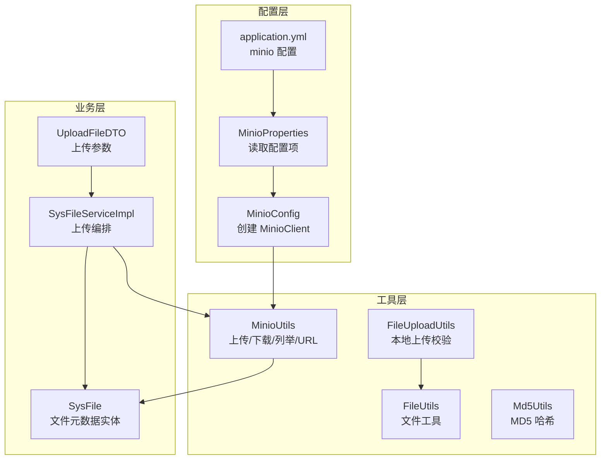
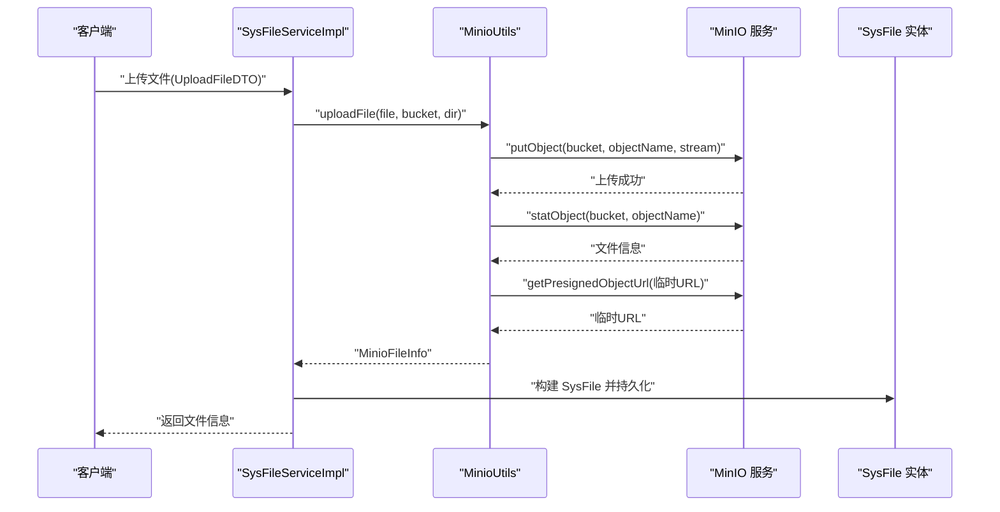
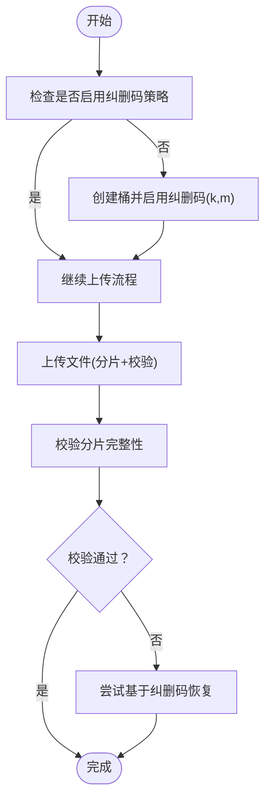
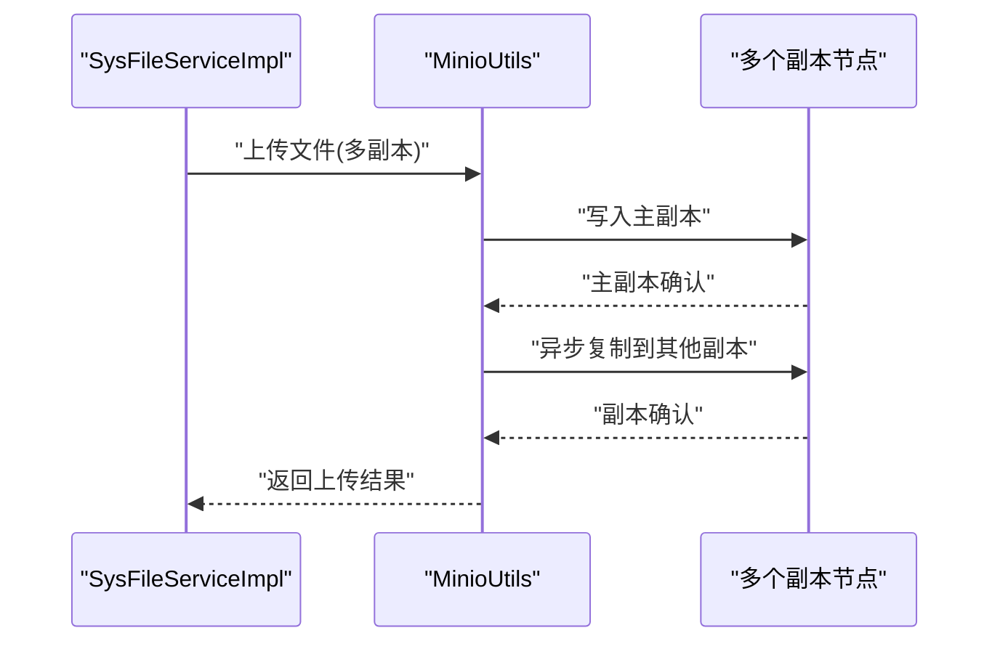
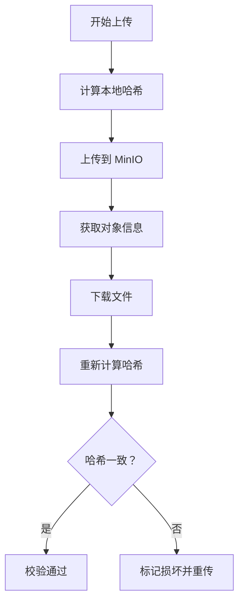
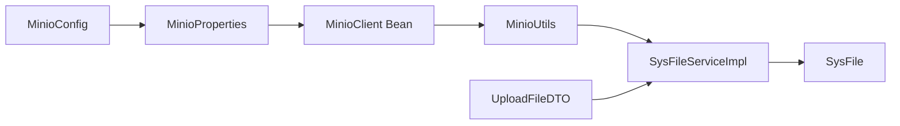

# 数据冗余策略

<cite>
**本文引用的文件**
- [MinioConfig.java](file://blog-common/src/main/java/blog/common/config/minio/MinioConfig.java)
- [MinioProperties.java](file://blog-common/src/main/java/blog/common/config/minio/MinioProperties.java)
- [MinioUtils.java](file://blog-common/src/main/java/blog/common/utils/minio/MinioUtils.java)
- [SysFileServiceImpl.java](file://blog-biz/src/main/java/blog/biz/service/impl/SysFileServiceImpl.java)
- [SysFile.java](file://blog-biz/src/main/java/blog/biz/domain/SysFile.java)
- [UploadFileDTO.java](file://blog-biz/src/main/java/blog/biz/domain/dto/UploadFileDTO.java)
- [application.yml](file://blog-admin/src/main/resources/application.yml)
- [Md5Utils.java](file://blog-common/src/main/java/blog/common/utils/sign/Md5Utils.java)
- [FileUploadUtils.java](file://blog-common/src/main/java/blog/common/utils/file/FileUploadUtils.java)
- [FileUtils.java](file://blog-common/src/main/java/blog/common/utils/file/FileUtils.java)
</cite>

## 目录
1. [简介](#简介)
2. [项目结构](#项目结构)
3. [核心组件](#核心组件)
4. [架构总览](#架构总览)
5. [详细组件分析](#详细组件分析)
6. [依赖分析](#依赖分析)
7. [性能考量](#性能考量)
8. [故障排查指南](#故障排查指南)
9. [结论](#结论)
10. [附录](#附录)

## 简介
本文件面向“数据冗余策略”的实施方案，结合当前代码库中已实现的文件存储与访问能力，系统性地阐述：
- 纠删码配置：编码参数、数据分片、校验码计算等核心算法实现思路
- 多副本机制：副本数量、副本分布、副本同步机制
- 数据完整性校验：哈希算法选择、校验流程设计、损坏数据检测
- 冗余策略选择指南：成本效益、性能影响、可靠性对比

说明：当前仓库未直接实现纠删码与多副本的底层算法，但通过 MinIO 的对象存储能力与现有工具类，可为后续扩展纠删码或多副本提供清晰的接口与数据模型支撑。

## 项目结构
围绕文件上传、存储与访问的关键模块如下：
- 配置层：MinIO 客户端与属性配置
- 工具层：文件上传、下载、校验与 URL 生成
- 业务层：文件信息持久化与上传流程编排
- 配置文件：Spring Boot 应用配置与 MinIO 参数

图表来源
- [MinioConfig.java:1-34](file://blog-common/src/main/java/blog/common/config/minio/MinioConfig.java#L1-L34)
- [MinioProperties.java:1-23](file://blog-common/src/main/java/blog/common/config/minio/MinioProperties.java#L1-L23)
- [application.yml:155-161](file://blog-admin/src/main/resources/application.yml#L155-L161)
- [MinioUtils.java:1-325](file://blog-common/src/main/java/blog/common/utils/minio/MinioUtils.java#L1-L325)
- [FileUploadUtils.java:1-225](file://blog-common/src/main/java/blog/common/utils/file/FileUploadUtils.java#L1-L225)
- [FileUtils.java:1-258](file://blog-common/src/main/java/blog/common/utils/file/FileUtils.java#L1-L258)
- [Md5Utils.java:1-56](file://blog-common/src/main/java/blog/common/utils/sign/Md5Utils.java#L1-L56)
- [SysFileServiceImpl.java:1-169](file://blog-biz/src/main/java/blog/biz/service/impl/SysFileServiceImpl.java#L1-L169)
- [SysFile.java:1-95](file://blog-biz/src/main/java/blog/biz/domain/SysFile.java#L1-L95)
- [UploadFileDTO.java:1-36](file://blog-biz/src/main/java/blog/biz/domain/dto/UploadFileDTO.java#L1-L36)

章节来源
- [MinioConfig.java:1-34](file://blog-common/src/main/java/blog/common/config/minio/MinioConfig.java#L1-L34)
- [MinioProperties.java:1-23](file://blog-common/src/main/java/blog/common/config/minio/MinioProperties.java#L1-L23)
- [application.yml:155-161](file://blog-admin/src/main/resources/application.yml#L155-L161)
- [MinioUtils.java:1-325](file://blog-common/src/main/java/blog/common/utils/minio/MinioUtils.java#L1-L325)
- [SysFileServiceImpl.java:151-167](file://blog-biz/src/main/java/blog/biz/service/impl/SysFileServiceImpl.java#L151-L167)
- [SysFile.java:20-95](file://blog-biz/src/main/java/blog/biz/domain/SysFile.java#L20-L95)
- [UploadFileDTO.java:32-34](file://blog-biz/src/main/java/blog/biz/domain/dto/UploadFileDTO.java#L32-L34)

## 核心组件
- MinIO 客户端与配置
  - 通过配置类与属性类读取 endpoint、accessKey、secretKey、bucket-name，并在启动时验证连接
  - 提供 MinioClient Bean，供工具层调用
- MinioUtils 工具类
  - 封装 Bucket 操作、文件上传、下载、删除、列举、URL 生成等
  - 支持临时 URL 与永久 URL 两种访问方式
- 文件上传与校验
  - FileUploadUtils：本地上传校验（大小、扩展名、MIME 类型）
  - FileUtils：文件工具（下载头、路径处理、扩展名识别）
  - Md5Utils：MD5 哈希工具（用于完整性校验）
- 业务层编排
  - SysFileServiceImpl：接收 UploadFileDTO，调用 MinioUtils 完成上传，返回文件信息并持久化
  - SysFile：文件元数据实体，包含桶名、对象名、URL、业务类型、业务 ID 等
  - UploadFileDTO：上传参数，生成目录结构（bizType/bizId）

章节来源
- [MinioConfig.java:17-31](file://blog-common/src/main/java/blog/common/config/minio/MinioConfig.java#L17-L31)
- [MinioProperties.java:11-22](file://blog-common/src/main/java/blog/common/config/minio/MinioProperties.java#L11-L22)
- [MinioUtils.java:54-182](file://blog-common/src/main/java/blog/common/utils/minio/MinioUtils.java#L54-L182)
- [FileUploadUtils.java:92-126](file://blog-common/src/main/java/blog/common/utils/file/FileUploadUtils.java#L92-L126)
- [FileUtils.java:130-173](file://blog-common/src/main/java/blog/common/utils/file/FileUtils.java#L130-L173)
- [Md5Utils.java:14-55](file://blog-common/src/main/java/blog/common/utils/sign/Md5Utils.java#L14-L55)
- [SysFileServiceImpl.java:151-167](file://blog-biz/src/main/java/blog/biz/service/impl/SysFileServiceImpl.java#L151-L167)
- [SysFile.java:20-95](file://blog-biz/src/main/java/blog/biz/domain/SysFile.java#L20-L95)
- [UploadFileDTO.java:32-34](file://blog-biz/src/main/java/blog/biz/domain/dto/UploadFileDTO.java#L32-L34)

## 架构总览
从上传到存储再到访问的整体流程如下：

图表来源
- [SysFileServiceImpl.java:151-167](file://blog-biz/src/main/java/blog/biz/service/impl/SysFileServiceImpl.java#L151-L167)
- [MinioUtils.java:85-111](file://blog-common/src/main/java/blog/common/utils/minio/MinioUtils.java#L85-L111)
- [MinioUtils.java:159-182](file://blog-common/src/main/java/blog/common/utils/minio/MinioUtils.java#L159-L182)

## 详细组件分析

### 组件一：纠删码配置与实现要点
- 当前实现现状
  - 代码库未直接实现纠删码算法或 MinIO Erasure Coding 的配置入口
  - MinIO 官方支持纠删码（基于 Reed-Solomon），需在桶层面启用
- 建议的实现路径
  - 在配置层增加纠删码参数（如数据分片数、校验分片数）与启用开关
  - 在工具层提供“按桶启用纠删码”的管理接口（如创建桶时设置策略）
  - 在业务层提供“按业务类型选择纠删码策略”的配置入口
- 关键参数建议
  - 数据分片数 k：建议 4~8
  - 校验分片数 m：建议 2~4
  - 总分片数 n = k + m：建议 6~12
  - 最小可用节点数：建议 ≥ k + 1
- 校验码计算与恢复
  - 使用标准的 Reed-Solomon 码
  - 恢复流程：当丢失 ≤ m 个分片时，可完整重建原始数据
- 与现有组件的对接
  - 通过 MinioUtils 的 Bucket 操作接口完成策略设置
  - 通过 SysFile 实体记录“存储策略”字段，便于审计与回溯

图表来源
- [MinioUtils.java:69-73](file://blog-common/src/main/java/blog/common/utils/minio/MinioUtils.java#L69-L73)
- [SysFileServiceImpl.java:151-167](file://blog-biz/src/main/java/blog/biz/service/impl/SysFileServiceImpl.java#L151-L167)

章节来源
- [MinioUtils.java:69-73](file://blog-common/src/main/java/blog/common/utils/minio/MinioUtils.java#L69-L73)
- [SysFileServiceImpl.java:151-167](file://blog-biz/src/main/java/blog/biz/service/impl/SysFileServiceImpl.java#L151-L167)

### 组件二：多副本机制
- 当前实现现状
  - 代码库未直接实现多副本写入逻辑
- 建议的实现路径
  - 在配置层增加副本数量与副本分布策略（如跨机架、跨区域）
  - 在工具层提供“多副本写入”接口，确保至少满足副本数要求
  - 在业务层提供“按业务类型选择副本策略”的配置入口
- 副本同步机制
  - 异步复制：写入主副本后异步复制到其他副本
  - 同步复制：写入主副本并等待至少 N-1 个副本确认
- 与现有组件的对接
  - 通过 MinioUtils 的上传接口实现多副本写入
  - 通过 SysFile 实体记录“副本分布信息”，便于运维监控

图表来源
- [SysFileServiceImpl.java:151-167](file://blog-biz/src/main/java/blog/biz/service/impl/SysFileServiceImpl.java#L151-L167)
- [MinioUtils.java:85-111](file://blog-common/src/main/java/blog/common/utils/minio/MinioUtils.java#L85-L111)

章节来源
- [SysFileServiceImpl.java:151-167](file://blog-biz/src/main/java/blog/biz/service/impl/SysFileServiceImpl.java#L151-L167)
- [MinioUtils.java:85-111](file://blog-common/src/main/java/blog/common/utils/minio/MinioUtils.java#L85-L111)

### 组件三：数据完整性校验
- 哈希算法选择
  - MD5：快速、广泛支持，适合一般完整性校验
  - SHA-256：更强安全性，适合高安全场景
  - 建议：默认使用 MD5，高安全场景使用 SHA-256
- 校验流程设计
  - 上传前：计算本地文件哈希
  - 上传后：从 MinIO 获取对象元数据（含内容长度、最后修改时间等）
  - 下载后：重新计算哈希并与上传时记录的哈希比对
- 损坏数据检测
  - 哈希不一致：标记为损坏并触发重传
  - 元数据不一致：检查网络传输或存储节点问题
- 与现有组件的对接
  - 使用 Md5Utils 计算哈希
  - 使用 MinioUtils.getFileInfo 获取对象信息
  - 在 SysFile 实体中记录哈希值与校验状态

图表来源
- [Md5Utils.java:47-54](file://blog-common/src/main/java/blog/common/utils/sign/Md5Utils.java#L47-L54)
- [MinioUtils.java:159-182](file://blog-common/src/main/java/blog/common/utils/minio/MinioUtils.java#L159-L182)
- [SysFileServiceImpl.java:151-167](file://blog-biz/src/main/java/blog/biz/service/impl/SysFileServiceImpl.java#L151-L167)

章节来源
- [Md5Utils.java:14-55](file://blog-common/src/main/java/blog/common/utils/sign/Md5Utils.java#L14-L55)
- [MinioUtils.java:159-182](file://blog-common/src/main/java/blog/common/utils/minio/MinioUtils.java#L159-L182)
- [SysFileServiceImpl.java:151-167](file://blog-biz/src/main/java/blog/biz/service/impl/SysFileServiceImpl.java#L151-L167)

### 组件四：冗余策略选择指南
- 成本效益分析
  - 多副本：成本较高，可靠性高；适合高可用场景
  - 纠删码：成本适中，空间利用率高；适合大容量低成本存储
- 性能影响评估
  - 多副本：写放大明显，读性能提升；适合读多写少
  - 纠删码：写放大较小，恢复时有 CPU 开销；适合写多读中等
- 可靠性对比
  - 多副本：丢失任意副本不影响可用性，恢复快
  - 纠删码：可容忍丢失 ≤ m 个分片，恢复过程较慢
- 决策参考
  - 业务类型：图片/视频优先纠删码；日志/备份优先多副本
  - 数据价值：高价值数据优先多副本；低价值数据优先纠删码
  - 存储规模：大规模低成本存储优先纠删码；小规模高可靠优先多副本

## 依赖分析
- 组件耦合与内聚
  - MinioConfig 与 MinioProperties 高内聚，负责 MinIO 客户端装配
  - MinioUtils 与 MinIO SDK 强耦合，提供统一的文件操作接口
  - SysFileServiceImpl 与 MinioUtils 松耦合，通过接口解耦
- 外部依赖与集成点
  - MinIO 服务：作为对象存储后端
  - Spring Boot：配置加载与 Bean 生命周期管理
- 潜在循环依赖
  - 当前未发现循环依赖；若后续引入纠删码策略配置，需避免配置类与工具类互相依赖

图表来源
- [MinioConfig.java:17-31](file://blog-common/src/main/java/blog/common/config/minio/MinioConfig.java#L17-L31)
- [MinioProperties.java:11-22](file://blog-common/src/main/java/blog/common/config/minio/MinioProperties.java#L11-L22)
- [MinioUtils.java:28-35](file://blog-common/src/main/java/blog/common/utils/minio/MinioUtils.java#L28-L35)
- [SysFileServiceImpl.java:40-41](file://blog-biz/src/main/java/blog/biz/service/impl/SysFileServiceImpl.java#L40-L41)
- [SysFile.java:20-95](file://blog-biz/src/main/java/blog/biz/domain/SysFile.java#L20-L95)
- [UploadFileDTO.java:32-34](file://blog-biz/src/main/java/blog/biz/domain/dto/UploadFileDTO.java#L32-L34)

章节来源
- [MinioConfig.java:17-31](file://blog-common/src/main/java/blog/common/config/minio/MinioConfig.java#L17-L31)
- [MinioProperties.java:11-22](file://blog-common/src/main/java/blog/common/config/minio/MinioProperties.java#L11-L22)
- [MinioUtils.java:28-35](file://blog-common/src/main/java/blog/common/utils/minio/MinioUtils.java#L28-L35)
- [SysFileServiceImpl.java:40-41](file://blog-biz/src/main/java/blog/biz/service/impl/SysFileServiceImpl.java#L40-L41)
- [SysFile.java:20-95](file://blog-biz/src/main/java/blog/biz/domain/SysFile.java#L20-L95)
- [UploadFileDTO.java:32-34](file://blog-biz/src/main/java/blog/biz/domain/dto/UploadFileDTO.java#L32-L34)

## 性能考量
- 上传性能
  - 多副本写入会增加写放大，建议在低峰期执行大批量写入
  - 纠删码写入开销较低，但恢复时 CPU 占用较高
- 下载性能
  - 多副本可提升并发读取能力，建议就近访问副本
  - 纠删码在恢复时可能影响下载延迟
- 存储成本
  - 多副本：存储成本约为副本数倍
  - 纠删码：存储成本约为 (k+m)/k 倍
- 建议
  - 根据业务负载特征选择策略
  - 结合缓存与 CDN 优化热点数据访问

## 故障排查指南
- MinIO 连接失败
  - 检查 endpoint、accessKey、secretKey 是否正确
  - 查看 MinioConfig 启动日志输出
- 上传失败
  - 检查桶是否存在，必要时自动创建
  - 检查文件大小与扩展名限制
- 完整性校验失败
  - 重新计算哈希并与记录值比对
  - 检查网络传输与存储节点状态
- 下载异常
  - 检查临时 URL 是否过期
  - 检查桶权限与对象 ACL

章节来源
- [MinioConfig.java:24-29](file://blog-common/src/main/java/blog/common/config/minio/MinioConfig.java#L24-L29)
- [MinioUtils.java:69-73](file://blog-common/src/main/java/blog/common/utils/minio/MinioUtils.java#L69-L73)
- [FileUploadUtils.java:167-193](file://blog-common/src/main/java/blog/common/utils/file/FileUploadUtils.java#L167-L193)
- [Md5Utils.java:17-29](file://blog-common/src/main/java/blog/common/utils/sign/Md5Utils.java#L17-L29)

## 结论
- 当前代码库提供了完整的文件上传、存储与访问能力，为后续扩展纠删码与多副本策略奠定了良好基础
- 建议在配置层引入纠删码与多副本策略参数，在工具层提供对应的管理接口，并在业务层按业务类型灵活选择
- 数据完整性校验可通过 MD5/SHA-256 与 MinIO 元数据配合实现，保障数据一致性
- 在成本、性能与可靠性之间权衡，选择最适合的冗余策略组合

## 附录
- 配置示例（application.yml 中的 minio 配置）
  - endpoint：MinIO 服务地址
  - access-key：访问密钥
  - secret-key：密钥
  - bucket-name：默认桶名

章节来源
- [application.yml:155-161](file://blog-admin/src/main/resources/application.yml#L155-L161)