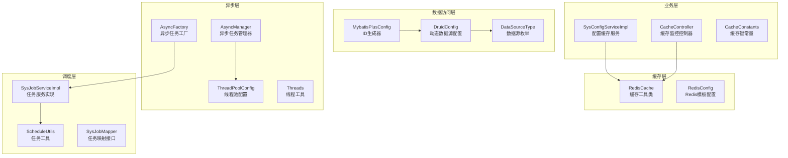
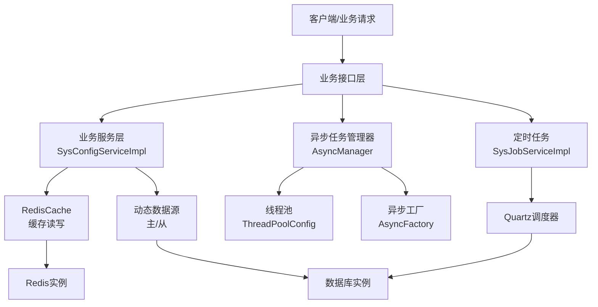
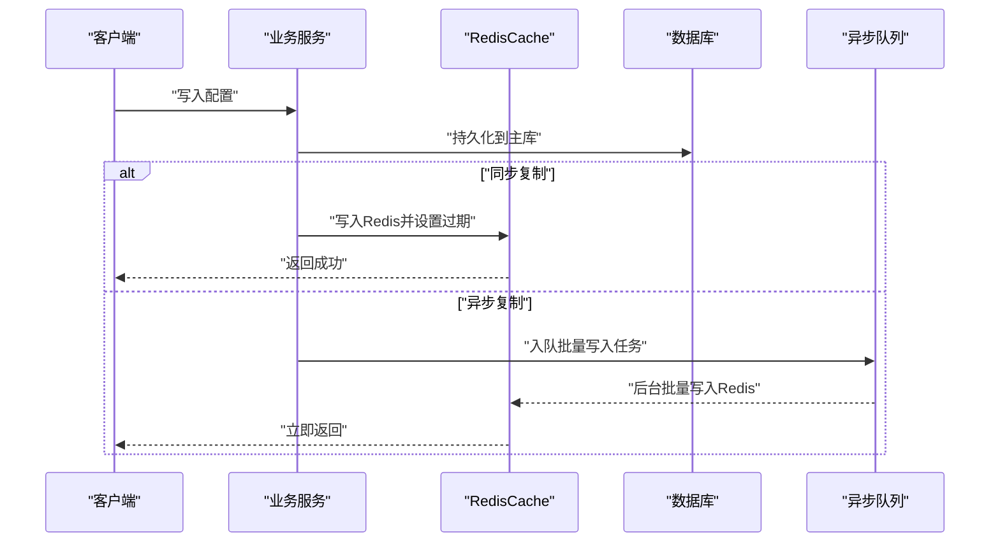
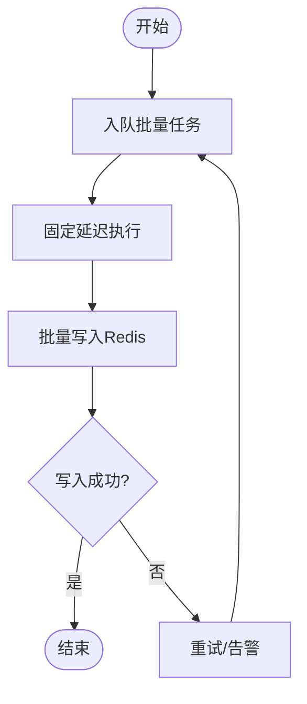
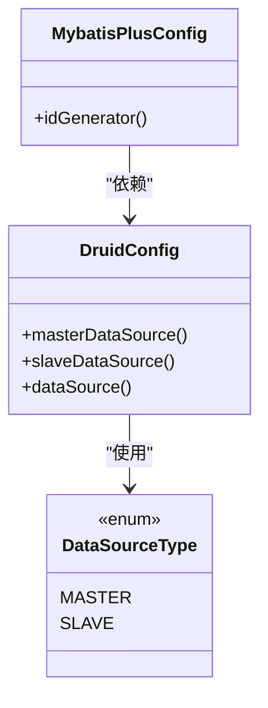
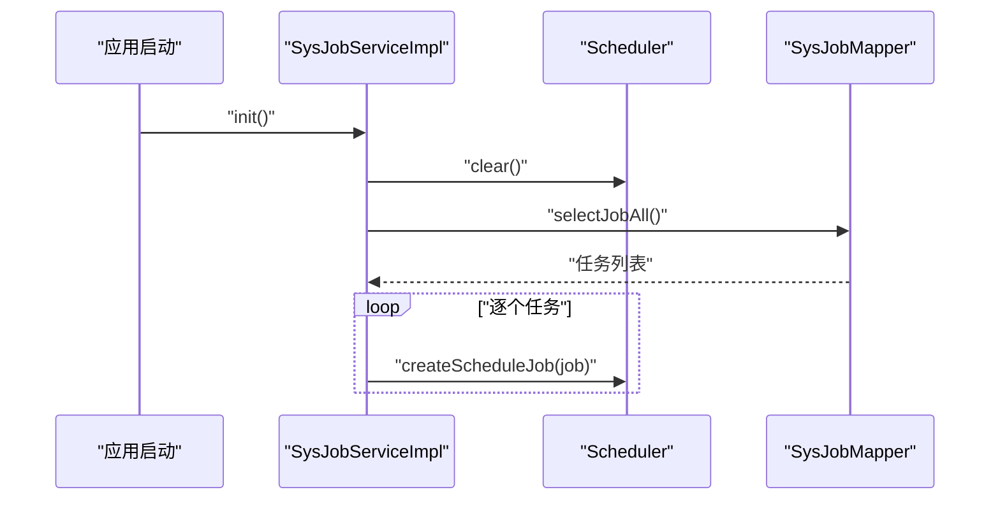
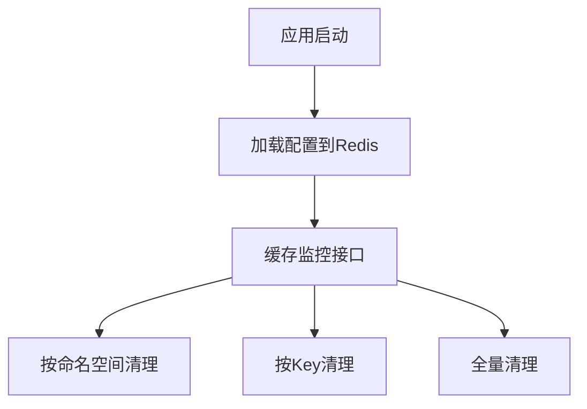
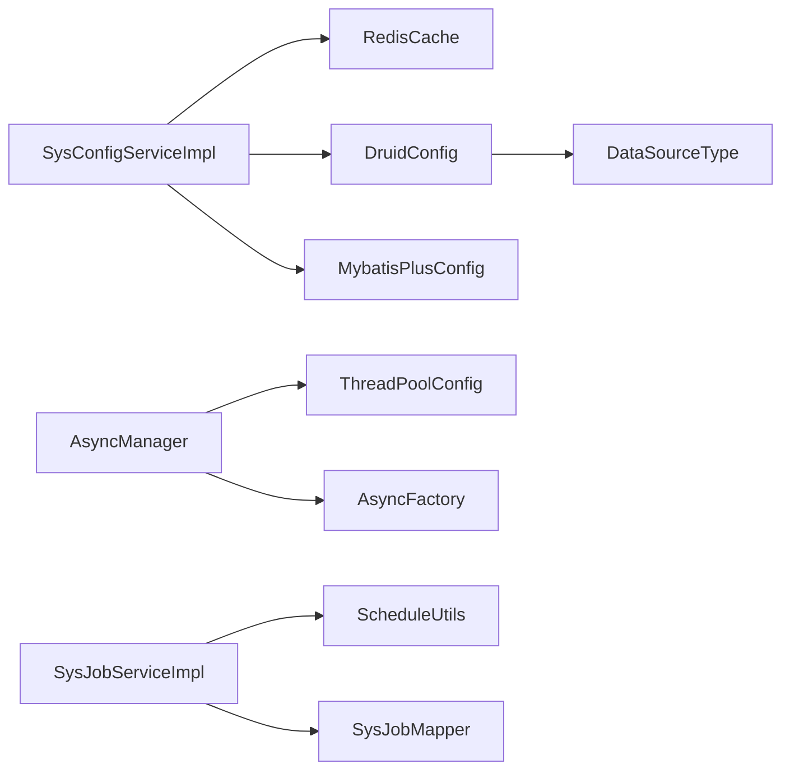

# 跨节点同步机制

<cite>
**本文引用的文件**
- [RedisConfig.java](file://blog-framework/src/main/java/blog/framework/config/RedisConfig.java)
- [RedisCache.java](file://blog-common/src/main/java/blog/common/core/redis/RedisCache.java)
- [ThreadPoolConfig.java](file://blog-framework/src/main/java/blog/framework/config/ThreadPoolConfig.java)
- [AsyncManager.java](file://blog-framework/src/main/java/blog/framework/manager/AsyncManager.java)
- [AsyncFactory.java](file://blog-framework/src/main/java/blog/framework/manager/factory/AsyncFactory.java)
- [Threads.java](file://blog-common/src/main/java/blog/common/utils/Threads.java)
- [SysConfigServiceImpl.java](file://blog-system/src/main/java/blog/system/service/impl/SysConfigServiceImpl.java)
- [CacheController.java](file://blog-admin/src/main/java/blog/web/controller/monitor/CacheController.java)
- [CacheConstants.java](file://blog-common/src/main/java/blog/common/constant/CacheConstants.java)
- [ScheduleUtils.java](file://blog-quartz/src/main/java/blog/quartz/util/ScheduleUtils.java)
- [SysJobServiceImpl.java](file://blog-quartz/src/main/java/blog/quartz/service/impl/SysJobServiceImpl.java)
- [SysJobMapper.java](file://blog-quartz/src/main/java/blog/quartz/mapper/SysJobMapper.java)
- [ry-vue-owner.sql](file://ry-vue-owner.sql)
- [DataSourceType.java](file://blog-common/src/main/java/blog/common/enums/DataSourceType.java)
- [DruidConfig.java](file://blog-framework/src/main/java/blog/framework/config/DruidConfig.java)
- [MybatisPlusConfig.java](file://blog-framework/src/main/java/blog/framework/config/MybatisPlusConfig.java)
- [UUID.java](file://blog-common/src/main/java/blog/common/utils/uuid/UUID.java)
- [Seq.java](file://blog-common/src/main/java/blog/common/utils/uuid/Seq.java)
- [StreamUtils.java](file://blog-common/src/main/java/blog/common/utils/StreamUtils.java)
</cite>

## 目录
1. [引言](#引言)
2. [项目结构](#项目结构)
3. [核心组件](#核心组件)
4. [架构总览](#架构总览)
5. [详细组件分析](#详细组件分析)
6. [依赖分析](#依赖分析)
7. [性能考虑](#性能考虑)
8. [故障排查指南](#故障排查指南)
9. [结论](#结论)
10. [附录](#附录)

## 引言
本文件围绕“跨节点同步机制”的实施方案进行系统化设计与落地说明，结合现有代码库中的缓存、异步任务、动态数据源与定时调度能力，提出可扩展的同步策略与一致性保障方案。重点覆盖以下方面：
- 数据复制策略：同步复制与异步复制的权衡、复制延迟控制、复制带宽管理
- 冲突解决机制：版本控制、时间戳比较、合并策略
- 一致性协议实现：CAP理论应用、最终一致性保证、分布式事务处理
- 性能优化：批量同步、增量同步、并行处理

## 项目结构
本项目采用多模块分层架构，围绕“缓存 + 异步 + 动态数据源 + 定时调度”构建跨节点同步基础能力：
- 缓存层：基于Redis的统一缓存抽象与工具类
- 异步层：线程池与异步任务管理器，支持延迟与并发控制
- 数据访问层：动态数据源（主/从）与ID生成器
- 调度层：Quartz定时任务，支持任务初始化与并发控制
- 业务层：系统配置参数缓存加载与清理，配合缓存监控

**图表来源**
- [RedisConfig.java:17-39](file://blog-framework/src/main/java/blog/framework/config/RedisConfig.java#L17-L39)
- [RedisCache.java:24-247](file://blog-common/src/main/java/blog/common/core/redis/RedisCache.java#L24-L247)
- [ThreadPoolConfig.java:18-58](file://blog-framework/src/main/java/blog/framework/config/ThreadPoolConfig.java#L18-L58)
- [AsyncManager.java:15-53](file://blog-framework/src/main/java/blog/framework/manager/AsyncManager.java#L15-L53)
- [AsyncFactory.java:25-92](file://blog-framework/src/main/java/blog/framework/manager/factory/AsyncFactory.java#L25-L92)
- [Threads.java:17-75](file://blog-common/src/main/java/blog/common/utils/Threads.java#L17-L75)
- [DruidConfig.java:34-57](file://blog-framework/src/main/java/blog/framework/config/DruidConfig.java#L34-L57)
- [DataSourceType.java:8-18](file://blog-common/src/main/java/blog/common/enums/DataSourceType.java#L8-L18)
- [MybatisPlusConfig.java:31-44](file://blog-framework/src/main/java/blog/framework/config/MybatisPlusConfig.java#L31-L44)
- [ScheduleUtils.java:27-49](file://blog-quartz/src/main/java/blog/quartz/util/ScheduleUtils.java#L27-L49)
- [SysJobServiceImpl.java:25-94](file://blog-quartz/src/main/java/blog/quartz/service/impl/SysJobServiceImpl.java#L25-L94)
- [SysJobMapper.java:11-67](file://blog-quartz/src/main/java/blog/quartz/mapper/SysJobMapper.java#L11-L67)
- [SysConfigServiceImpl.java:27-210](file://blog-system/src/main/java/blog/system/service/impl/SysConfigServiceImpl.java#L27-L210)
- [CacheController.java:31-116](file://blog-admin/src/main/java/blog/web/controller/monitor/CacheController.java#L31-L116)
- [CacheConstants.java:8-43](file://blog-common/src/main/java/blog/common/constant/CacheConstants.java#L8-L43)

**章节来源**
- [RedisConfig.java:17-67](file://blog-framework/src/main/java/blog/framework/config/RedisConfig.java#L17-L67)
- [ThreadPoolConfig.java:18-60](file://blog-framework/src/main/java/blog/framework/config/ThreadPoolConfig.java#L18-L60)
- [DruidConfig.java:34-57](file://blog-framework/src/main/java/blog/framework/config/DruidConfig.java#L34-L57)
- [MybatisPlusConfig.java:31-44](file://blog-framework/src/main/java/blog/framework/config/MybatisPlusConfig.java#L31-L44)
- [SysConfigServiceImpl.java:27-210](file://blog-system/src/main/java/blog/system/service/impl/SysConfigServiceImpl.java#L27-L210)
- [CacheController.java:31-116](file://blog-admin/src/main/java/blog/web/controller/monitor/CacheController.java#L31-L116)
- [CacheConstants.java:8-43](file://blog-common/src/main/java/blog/common/constant/CacheConstants.java#L8-L43)
- [ScheduleUtils.java:27-49](file://blog-quartz/src/main/java/blog/quartz/util/ScheduleUtils.java#L27-L49)
- [SysJobServiceImpl.java:25-94](file://blog-quartz/src/main/java/blog/quartz/service/impl/SysJobServiceImpl.java#L25-L94)
- [SysJobMapper.java:11-67](file://blog-quartz/src/main/java/blog/quartz/mapper/SysJobMapper.java#L11-L67)

## 核心组件
- 缓存与复制基础
  - RedisTemplate统一配置与序列化策略，支持多种数据结构（String、Hash、List、Set），为跨节点数据复制提供存储载体
  - RedisCache封装常用缓存操作，支持过期时间、批量读写、Hash多值读取等，便于实现复制与回填
- 异步与延迟
  - 线程池配置与异步任务管理器，支持任务延迟执行与并发控制，适配异步复制与批量处理
  - 异步工厂封装业务日志与登录信息落库，体现异步写入的典型场景
- 动态数据源与ID生成
  - 动态数据源支持主/从切换，为读写分离与复制回放提供基础
  - MyBatis-Plus ID生成器结合网卡信息，避免集群环境下ID冲突
- 定时调度与初始化
  - Quartz任务初始化与并发控制，确保跨节点任务一致性与可恢复性

**章节来源**
- [RedisCache.java:24-247](file://blog-common/src/main/java/blog/common/core/redis/RedisCache.java#L24-L247)
- [ThreadPoolConfig.java:18-58](file://blog-framework/src/main/java/blog/framework/config/ThreadPoolConfig.java#L18-L58)
- [AsyncManager.java:15-53](file://blog-framework/src/main/java/blog/framework/manager/AsyncManager.java#L15-L53)
- [AsyncFactory.java:25-92](file://blog-framework/src/main/java/blog/framework/manager/factory/AsyncFactory.java#L25-L92)
- [DruidConfig.java:34-57](file://blog-framework/src/main/java/blog/framework/config/DruidConfig.java#L34-L57)
- [MybatisPlusConfig.java:31-44](file://blog-framework/src/main/java/blog/framework/config/MybatisPlusConfig.java#L31-L44)
- [SysJobServiceImpl.java:34-46](file://blog-quartz/src/main/java/blog/quartz/service/impl/SysJobServiceImpl.java#L34-L46)

## 架构总览
下图展示跨节点同步的关键交互路径：配置参数通过缓存层进行读写，异步任务负责批量与延迟处理，动态数据源支撑读写分离，定时任务保障初始化与一致性。

**图表来源**
- [SysConfigServiceImpl.java:27-210](file://blog-system/src/main/java/blog/system/service/impl/SysConfigServiceImpl.java#L27-L210)
- [RedisCache.java:24-247](file://blog-common/src/main/java/blog/common/core/redis/RedisCache.java#L24-L247)
- [AsyncManager.java:15-53](file://blog-framework/src/main/java/blog/framework/manager/AsyncManager.java#L15-L53)
- [ThreadPoolConfig.java:18-58](file://blog-framework/src/main/java/blog/framework/config/ThreadPoolConfig.java#L18-L58)
- [AsyncFactory.java:25-92](file://blog-framework/src/main/java/blog/framework/manager/factory/AsyncFactory.java#L25-L92)
- [SysJobServiceImpl.java:25-94](file://blog-quartz/src/main/java/blog/quartz/service/impl/SysJobServiceImpl.java#L25-L94)

## 详细组件分析

### 缓存与复制（Redis）
- 设计要点
  - 统一的RedisTemplate配置，确保键值序列化一致，避免跨节点解析差异
  - 多数据结构支持：String用于配置项，Hash用于批量键值，List/Set用于队列/集合场景
  - 过期时间与批量操作，满足复制延迟与带宽控制需求
- 复制策略建议
  - 同步复制：写入主库后，立即写入Redis并设置短过期时间，降低一致性窗口
  - 异步复制：写入主库后，异步写入Redis，通过队列或批处理控制频率
  - 延迟控制：利用过期时间与批量窗口，平滑突发写入
  - 带宽管理：限制批量大小与频率，避免瞬时高负载

**图表来源**
- [SysConfigServiceImpl.java:110-137](file://blog-system/src/main/java/blog/system/service/impl/SysConfigServiceImpl.java#L110-L137)
- [RedisCache.java:34-48](file://blog-common/src/main/java/blog/common/core/redis/RedisCache.java#L34-L48)
- [ThreadPoolConfig.java:32-42](file://blog-framework/src/main/java/blog/framework/config/ThreadPoolConfig.java#L32-L42)

**章节来源**
- [RedisConfig.java:21-39](file://blog-framework/src/main/java/blog/framework/config/RedisConfig.java#L21-L39)
- [RedisCache.java:24-247](file://blog-common/src/main/java/blog/common/core/redis/RedisCache.java#L24-L247)
- [SysConfigServiceImpl.java:110-137](file://blog-system/src/main/java/blog/system/service/impl/SysConfigServiceImpl.java#L110-L137)

### 异步与延迟（线程池与异步任务）
- 设计要点
  - 线程池参数：核心线程、最大线程、队列容量、存活时间，满足不同负载场景
  - 异步任务管理器：固定延迟执行，避免高频抖动
  - 异步工厂：封装业务落库逻辑，统一异常处理
- 复制与回放
  - 异步复制：写入主库后，异步入队批量写入Redis
  - 回放与重试：结合队列与重试策略，保证最终一致性

**图表来源**
- [AsyncManager.java:43-45](file://blog-framework/src/main/java/blog/framework/manager/AsyncManager.java#L43-L45)
- [ThreadPoolConfig.java:32-42](file://blog-framework/src/main/java/blog/framework/config/ThreadPoolConfig.java#L32-L42)
- [AsyncFactory.java:37-73](file://blog-framework/src/main/java/blog/framework/manager/factory/AsyncFactory.java#L37-L73)

**章节来源**
- [ThreadPoolConfig.java:18-58](file://blog-framework/src/main/java/blog/framework/config/ThreadPoolConfig.java#L18-L58)
- [AsyncManager.java:15-53](file://blog-framework/src/main/java/blog/framework/manager/AsyncManager.java#L15-L53)
- [AsyncFactory.java:25-92](file://blog-framework/src/main/java/blog/framework/manager/factory/AsyncFactory.java#L25-L92)
- [Threads.java:37-74](file://blog-common/src/main/java/blog/common/utils/Threads.java#L37-L74)

### 动态数据源与ID生成（主/从与去重）
- 设计要点
  - 动态数据源：支持主库写入与从库读取，为复制回放提供基础
  - ID生成：基于网卡信息的雪花算法变体，避免集群ID冲突
- 复制回放
  - 通过主/从切换与ID去重，确保回放过程不破坏现有数据

**图表来源**
- [DruidConfig.java:34-57](file://blog-framework/src/main/java/blog/framework/config/DruidConfig.java#L34-L57)
- [DataSourceType.java:8-18](file://blog-common/src/main/java/blog/common/enums/DataSourceType.java#L8-L18)
- [MybatisPlusConfig.java:31-44](file://blog-framework/src/main/java/blog/framework/config/MybatisPlusConfig.java#L31-L44)

**章节来源**
- [DruidConfig.java:34-57](file://blog-framework/src/main/java/blog/framework/config/DruidConfig.java#L34-L57)
- [DataSourceType.java:8-18](file://blog-common/src/main/java/blog/common/enums/DataSourceType.java#L8-L18)
- [MybatisPlusConfig.java:31-44](file://blog-framework/src/main/java/blog/framework/config/MybatisPlusConfig.java#L31-L44)
- [UUID.java:220-252](file://blog-common/src/main/java/blog/common/utils/uuid/UUID.java#L220-L252)
- [Seq.java:50-80](file://blog-common/src/main/java/blog/common/utils/uuid/Seq.java#L50-L80)

### 定时调度与初始化（Quartz）
- 设计要点
  - 任务初始化：项目启动时清空并重建所有任务，确保与数据库状态一致
  - 并发控制：禁止并发执行的任务类型，避免重复与竞态
- 跨节点一致性
  - 通过调度器与数据库状态同步，保障跨节点任务的一致性与可恢复性

**图表来源**
- [SysJobServiceImpl.java:34-46](file://blog-quartz/src/main/java/blog/quartz/service/impl/SysJobServiceImpl.java#L34-L46)
- [SysJobMapper.java:26-26](file://blog-quartz/src/main/java/blog/quartz/mapper/SysJobMapper.java#L26-L26)
- [ScheduleUtils.java:44-49](file://blog-quartz/src/main/java/blog/quartz/util/ScheduleUtils.java#L44-L49)

**章节来源**
- [SysJobServiceImpl.java:25-94](file://blog-quartz/src/main/java/blog/quartz/service/impl/SysJobServiceImpl.java#L25-L94)
- [SysJobMapper.java:11-67](file://blog-quartz/src/main/java/blog/quartz/mapper/SysJobMapper.java#L11-L67)
- [ScheduleUtils.java:27-49](file://blog-quartz/src/main/java/blog/quartz/util/ScheduleUtils.java#L27-L49)

### 缓存监控与清理（配置参数）
- 设计要点
  - 启动时加载配置到Redis缓存，减少数据库压力
  - 提供按命名空间清理与全量清理，便于运维与测试
  - 缓存键命名规范，便于定位与治理

**图表来源**
- [SysConfigServiceImpl.java:38-41](file://blog-system/src/main/java/blog/system/service/impl/SysConfigServiceImpl.java#L38-L41)
- [SysConfigServiceImpl.java:160-183](file://blog-system/src/main/java/blog/system/service/impl/SysConfigServiceImpl.java#L160-L183)
- [CacheController.java:95-115](file://blog-admin/src/main/java/blog/web/controller/monitor/CacheController.java#L95-L115)
- [CacheConstants.java:19-22](file://blog-common/src/main/java/blog/common/constant/CacheConstants.java#L19-L22)

**章节来源**
- [SysConfigServiceImpl.java:27-210](file://blog-system/src/main/java/blog/system/service/impl/SysConfigServiceImpl.java#L27-L210)
- [CacheController.java:31-116](file://blog-admin/src/main/java/blog/web/controller/monitor/CacheController.java#L31-L116)
- [CacheConstants.java:8-43](file://blog-common/src/main/java/blog/common/constant/CacheConstants.java#L8-L43)

## 依赖分析
- 组件耦合
  - 业务服务依赖缓存工具与动态数据源，形成清晰的职责边界
  - 异步层与调度层相互独立，分别承担“延迟/批量”与“周期性/可恢复”的职责
- 外部依赖
  - Redis作为共享状态存储，Quartz作为任务编排引擎
- 潜在风险
  - 缓存与数据库双写一致性窗口
  - 异步队列积压与重试风暴
  - 定时任务并发与持久化一致性

**图表来源**
- [SysConfigServiceImpl.java:27-210](file://blog-system/src/main/java/blog/system/service/impl/SysConfigServiceImpl.java#L27-L210)
- [RedisCache.java:24-247](file://blog-common/src/main/java/blog/common/core/redis/RedisCache.java#L24-L247)
- [DruidConfig.java:34-57](file://blog-framework/src/main/java/blog/framework/config/DruidConfig.java#L34-L57)
- [DataSourceType.java:8-18](file://blog-common/src/main/java/blog/common/enums/DataSourceType.java#L8-L18)
- [MybatisPlusConfig.java:31-44](file://blog-framework/src/main/java/blog/framework/config/MybatisPlusConfig.java#L31-L44)
- [AsyncManager.java:15-53](file://blog-framework/src/main/java/blog/framework/manager/AsyncManager.java#L15-L53)
- [ThreadPoolConfig.java:18-58](file://blog-framework/src/main/java/blog/framework/config/ThreadPoolConfig.java#L18-L58)
- [AsyncFactory.java:25-92](file://blog-framework/src/main/java/blog/framework/manager/factory/AsyncFactory.java#L25-L92)
- [SysJobServiceImpl.java:25-94](file://blog-quartz/src/main/java/blog/quartz/service/impl/SysJobServiceImpl.java#L25-L94)
- [ScheduleUtils.java:27-49](file://blog-quartz/src/main/java/blog/quartz/util/ScheduleUtils.java#L27-L49)
- [SysJobMapper.java:11-67](file://blog-quartz/src/main/java/blog/quartz/mapper/SysJobMapper.java#L11-L67)

**章节来源**
- [SysConfigServiceImpl.java:27-210](file://blog-system/src/main/java/blog/system/service/impl/SysConfigServiceImpl.java#L27-L210)
- [SysJobServiceImpl.java:25-94](file://blog-quartz/src/main/java/blog/quartz/service/impl/SysJobServiceImpl.java#L25-L94)

## 性能考虑
- 批量同步
  - Redis批量写入与Hash多值读取，减少网络往返
  - 异步批量队列，平滑峰值写入
- 增量同步
  - 基于过期时间与键空间清理，按需回放
  - 动态数据源读写分离，降低主库压力
- 并行处理
  - 线程池参数调优，避免拒绝策略触发
  - Quartz并发控制，避免重复执行

[本节为通用性能指导，无需特定文件引用]

## 故障排查指南
- 缓存异常
  - 检查Redis连接与序列化配置，确认键值格式一致
  - 使用缓存监控接口查看DB大小与命令统计
- 异步任务堆积
  - 查看线程池拒绝策略与异常打印，调整队列与线程上限
  - 检查异步任务工厂的异常处理日志
- 定时任务异常
  - 核对任务初始化流程与并发控制策略
  - 关注调度器与数据库状态一致性

**章节来源**
- [CacheController.java:52-59](file://blog-admin/src/main/java/blog/web/controller/monitor/CacheController.java#L52-L59)
- [Threads.java:57-74](file://blog-common/src/main/java/blog/common/utils/Threads.java#L57-L74)
- [SysJobServiceImpl.java:34-46](file://blog-quartz/src/main/java/blog/quartz/service/impl/SysJobServiceImpl.java#L34-L46)

## 结论
本方案以缓存、异步、动态数据源与定时调度为核心，构建了可扩展的跨节点同步框架。通过同步/异步复制策略、延迟与带宽控制、冲突解决与一致性保障，以及性能优化手段，能够满足高可用与高性能的跨节点同步需求。后续可在以下方向深化：
- 引入消息中间件实现强一致复制
- 增加冲突检测与自动合并规则
- 完善监控与可观测性体系

[本节为总结性内容，无需特定文件引用]

## 附录
- 行锁表结构参考（用于同步机制的行锁表）
  - 表名：QRTZ_SIMPROP_TRIGGERS
  - 字段：sched_name、trigger_name、trigger_group、job_name、job_group、description
  - 约束：外键约束指向QRTZ_TRIGGERS
  - 用途：行级锁与同步控制

**章节来源**
- [ry-vue-owner.sql:199-217](file://ry-vue-owner.sql#L199-L217)