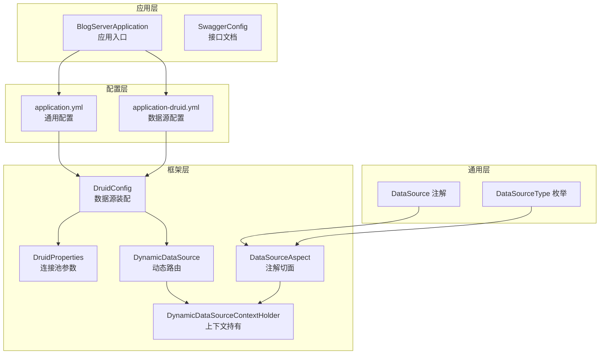
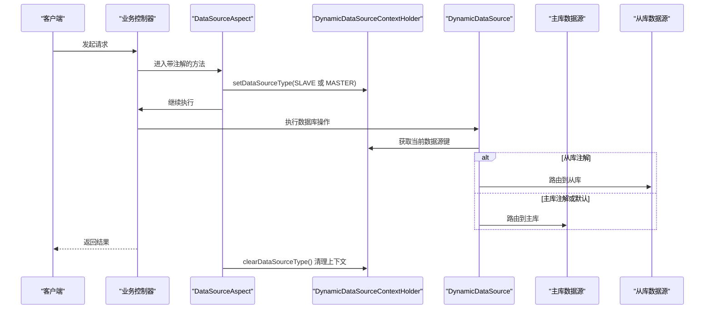
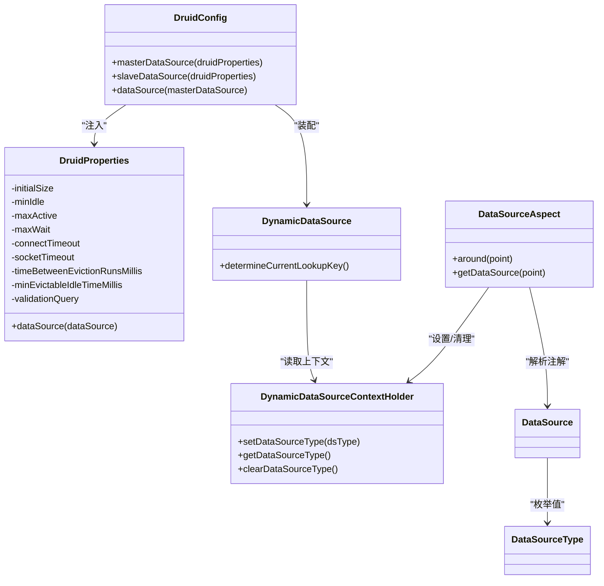
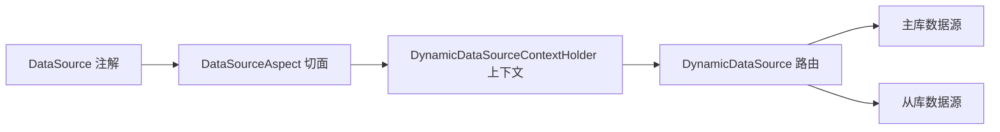

# 主从复制配置

<cite>
**本文引用的文件**
- [application.yml](file://blog-admin/src/main/resources/application.yml)
- [application-druid.yml](file://blog-admin/src/main/resources/application-druid.yml)
- [DruidConfig.java](file://blog-framework/src/main/java/blog/framework/config/DruidConfig.java)
- [DruidProperties.java](file://blog-framework/src/main/java/blog/framework/config/properties/DruidProperties.java)
- [DynamicDataSource.java](file://blog-framework/src/main/java/blog/framework/datasource/DynamicDataSource.java)
- [DynamicDataSourceContextHolder.java](file://blog-framework/src/main/java/blog/framework/datasource/DynamicDataSourceContextHolder.java)
- [DataSourceAspect.java](file://blog-framework/src/main/java/blog/framework/aspectj/DataSourceAspect.java)
- [DataSource.java](file://blog-common/src/main/java/blog/common/annotation/DataSource.java)
- [DataSourceType.java](file://blog-common/src/main/java/blog/common/enums/DataSourceType.java)
- [ry-vue-owner.sql](file://ry-vue-owner.sql)
</cite>

## 目录
1. [简介](#简介)
2. [项目结构](#项目结构)
3. [核心组件](#核心组件)
4. [架构总览](#架构总览)
5. [详细组件分析](#详细组件分析)
6. [依赖分析](#依赖分析)
7. [性能考虑](#性能考虑)
8. [故障排查指南](#故障排查指南)
9. [结论](#结论)
10. [附录](#附录)

## 简介
本指南围绕基于 MySQL 的主从复制配置展开，结合代码库中现有的动态数据源与连接池配置能力，系统阐述主库与从库的配置参数、复制通道与权限设置、复制延迟监控策略、以及主从切换的关键技术要点。文档同时提供可落地的配置示例与故障排查方法，帮助读者在现有工程基础上稳定运行主从复制。

## 项目结构
本项目采用 Spring Boot + MyBatis-Plus 架构，数据库连接通过 Druid 连接池管理，并通过动态数据源实现主从库路由。核心配置位于应用配置文件与框架配置类中，动态数据源由切面与上下文协作完成。

图表来源
- [application.yml:1-161](file://blog-admin/src/main/resources/application.yml#L1-L161)
- [application-druid.yml:1-61](file://blog-admin/src/main/resources/application-druid.yml#L1-L61)
- [DruidConfig.java:1-93](file://blog-framework/src/main/java/blog/framework/config/DruidConfig.java#L1-L93)
- [DruidProperties.java:42-72](file://blog-framework/src/main/java/blog/framework/config/properties/DruidProperties.java#L42-L72)
- [DynamicDataSource.java:1-24](file://blog-framework/src/main/java/blog/framework/datasource/DynamicDataSource.java#L1-L24)
- [DynamicDataSourceContextHolder.java:1-42](file://blog-framework/src/main/java/blog/framework/datasource/DynamicDataSourceContextHolder.java#L1-L42)
- [DataSourceAspect.java:1-65](file://blog-framework/src/main/java/blog/framework/aspectj/DataSourceAspect.java#L1-L65)
- [DataSource.java:1-29](file://blog-common/src/main/java/blog/common/annotation/DataSource.java#L1-L29)
- [DataSourceType.java:1-19](file://blog-common/src/main/java/blog/common/enums/DataSourceType.java#L1-L19)

章节来源
- [application.yml:1-161](file://blog-admin/src/main/resources/application.yml#L1-L161)
- [application-druid.yml:1-61](file://blog-admin/src/main/resources/application-druid.yml#L1-L61)

## 核心组件
- 数据源配置与连接池参数
  - 主库与从库数据源均通过 Druid 配置，主库默认启用，从库默认禁用，可通过开关控制启用。
  - 关键参数包括：初始连接数、最小/最大空闲连接、最大活跃连接、获取连接最大等待时间、连接超时、socket 超时、空闲连接驱逐周期、有效性检测查询等。
- 动态数据源与路由
  - 通过注解标注方法或类，决定使用主库还是从库；切面在方法执行前后设置与清理数据源上下文；路由根据上下文选择目标数据源。
- 复制通道与权限
  - 代码库未直接提供 MySQL 复制配置片段，但具备从库启用条件（从库开关与连接参数），可据此在数据库侧完成复制通道与权限配置。

章节来源
- [application-druid.yml:1-61](file://blog-admin/src/main/resources/application-druid.yml#L1-L61)
- [DruidConfig.java:34-72](file://blog-framework/src/main/java/blog/framework/config/DruidConfig.java#L34-L72)
- [DruidProperties.java:42-72](file://blog-framework/src/main/java/blog/framework/config/properties/DruidProperties.java#L42-L72)
- [DataSourceAspect.java:36-50](file://blog-framework/src/main/java/blog/framework/aspectj/DataSourceAspect.java#L36-L50)
- [DynamicDataSource.java:13-24](file://blog-framework/src/main/java/blog/framework/datasource/DynamicDataSource.java#L13-L24)
- [DynamicDataSourceContextHolder.java:23-40](file://blog-framework/src/main/java/blog/framework/datasource/DynamicDataSourceContextHolder.java#L23-L40)
- [DataSource.java:23-28](file://blog-common/src/main/java/blog/common/annotation/DataSource.java#L23-L28)
- [DataSourceType.java:8-18](file://blog-common/src/main/java/blog/common/enums/DataSourceType.java#L8-L18)

## 架构总览
下图展示应用如何通过注解驱动动态数据源路由，从而实现对主库写入与从库读取的统一管理。

图表来源
- [DataSourceAspect.java:36-50](file://blog-framework/src/main/java/blog/framework/aspectj/DataSourceAspect.java#L36-L50)
- [DynamicDataSource.java:20-23](file://blog-framework/src/main/java/blog/framework/datasource/DynamicDataSource.java#L20-L23)
- [DynamicDataSourceContextHolder.java:23-40](file://blog-framework/src/main/java/blog/framework/datasource/DynamicDataSourceContextHolder.java#L23-L40)
- [DataSource.java:23-28](file://blog-common/src/main/java/blog/common/annotation/DataSource.java#L23-L28)
- [DataSourceType.java:8-18](file://blog-common/src/main/java/blog/common/enums/DataSourceType.java#L8-L18)

## 详细组件分析

### 数据源配置与连接池参数
- 主库数据源
  - JDBC URL、用户名、密码、驱动类名等在配置文件中集中管理。
  - 连接池参数通过 DruidProperties 应用到 DruidDataSource，包括初始大小、最小/最大空闲、最大活跃、等待超时、连接与 socket 超时、驱逐周期、空闲存活时间、有效性检测等。
- 从库数据源
  - 默认关闭，需显式开启并填写 URL、用户名、密码后方可启用。
  - 启用条件由 DruidConfig 中的条件注解控制，仅当从库 enabled 为真时才装配从库数据源。

图表来源
- [DruidConfig.java:34-72](file://blog-framework/src/main/java/blog/framework/config/DruidConfig.java#L34-L72)
- [DruidProperties.java:42-72](file://blog-framework/src/main/java/blog/framework/config/properties/DruidProperties.java#L42-L72)
- [DynamicDataSource.java:13-24](file://blog-framework/src/main/java/blog/framework/datasource/DynamicDataSource.java#L13-L24)
- [DynamicDataSourceContextHolder.java:11-41](file://blog-framework/src/main/java/blog/framework/datasource/DynamicDataSourceContextHolder.java#L11-L41)
- [DataSourceAspect.java:27-65](file://blog-framework/src/main/java/blog/framework/aspectj/DataSourceAspect.java#L27-L65)
- [DataSource.java:19-28](file://blog-common/src/main/java/blog/common/annotation/DataSource.java#L19-L28)
- [DataSourceType.java:8-18](file://blog-common/src/main/java/blog/common/enums/DataSourceType.java#L8-L18)

章节来源
- [application-druid.yml:1-61](file://blog-admin/src/main/resources/application-druid.yml#L1-L61)
- [DruidConfig.java:34-72](file://blog-framework/src/main/java/blog/framework/config/DruidConfig.java#L34-L72)
- [DruidProperties.java:42-72](file://blog-framework/src/main/java/blog/framework/config/properties/DruidProperties.java#L42-L72)

### 复制通道与权限设置（数据库侧）
- 复制通道
  - 在从库上配置复制通道，指向主库的 binlog 位置与文件名，确保从库持续拉取主库的二进制日志。
- 复制用户权限
  - 在主库创建复制用户，授予 REPLICATION SLAVE 权限，用于从库连接主库进行增量同步。
- 复制参数
  - 主库：开启二进制日志，设置 server-id，合理配置 binlog 格式与保留策略。
  - 从库：设置 server-id，配置 relay log，启用自动重连与重放延迟监控。

说明：以上为通用 MySQL 主从复制配置要点，具体参数需结合数据库版本与业务需求调整。

### 复制延迟监控机制
- 复制状态检查
  - 通过 SHOW SLAVE STATUS 查看 Seconds_Behind_Master、Read_Master_Log_Pos、Exec_Master_Log_Pos 等指标，评估延迟。
- 延迟阈值与告警
  - 建议设定阈值（如超过 N 秒）触发告警；结合运维平台或脚本定期巡检。
- 只读与流量切换
  - 在从库设置只读，避免误写；在延迟过大时，将读流量切换至主库或修复从库后再切回。

说明：本节为通用监控策略，具体实现需结合数据库与运维体系。

### 主从切换配置要点
- 自动切换参数
  - 结合数据库高可用方案（如 MHA、ProxySQL、Orchestrator 等）实现自动故障检测与切换。
- 故障检测
  - 定期探测主库连通性与从库复制状态；异常时触发切换流程。
- 数据一致性保证
  - 切换前确认从库延迟归零；必要时进行数据校验与回放，确保新主库包含最新事务。

说明：本节为通用切换策略，具体实现需结合数据库与中间件能力。

## 依赖分析
动态数据源依赖于注解切面与上下文持有者，形成“注解声明 -> 切面设置 -> 路由选择”的闭环。

图表来源
- [DataSource.java:19-28](file://blog-common/src/main/java/blog/common/annotation/DataSource.java#L19-L28)
- [DataSourceAspect.java:36-50](file://blog-framework/src/main/java/blog/framework/aspectj/DataSourceAspect.java#L36-L50)
- [DynamicDataSourceContextHolder.java:23-40](file://blog-framework/src/main/java/blog/framework/datasource/DynamicDataSourceContextHolder.java#L23-L40)
- [DynamicDataSource.java:20-23](file://blog-framework/src/main/java/blog/framework/datasource/DynamicDataSource.java#L20-L23)

章节来源
- [DataSourceAspect.java:36-50](file://blog-framework/src/main/java/blog/framework/aspectj/DataSourceAspect.java#L36-L50)
- [DynamicDataSource.java:13-24](file://blog-framework/src/main/java/blog/framework/datasource/DynamicDataSource.java#L13-L24)
- [DynamicDataSourceContextHolder.java:11-41](file://blog-framework/src/main/java/blog/framework/datasource/DynamicDataSourceContextHolder.java#L11-L41)
- [DataSource.java:19-28](file://blog-common/src/main/java/blog/common/annotation/DataSource.java#L19-L28)
- [DataSourceType.java:8-18](file://blog-common/src/main/java/blog/common/enums/DataSourceType.java#L8-L18)

## 性能考虑
- 连接池参数调优
  - 根据业务 QPS 与 RT 要求，合理设置初始连接、最小/最大空闲、最大活跃与等待超时，避免连接争用与抖动。
  - 合理配置驱逐周期与空闲存活时间，减少无效连接占用。
- 读写分离策略
  - 将只读查询路由至从库，写操作固定走主库；避免跨库事务与长事务，降低锁竞争。
- 复制性能
  - 主库 binlog 并行重放（MySQL 8.0+）与从库 relay log 并行应用可提升复制吞吐。
  - 控制批量写入节奏，避免主库压力尖峰导致从库追赶困难。

## 故障排查指南
- 从库无法连接主库
  - 检查复制用户权限与网络连通性；核对主库 binlog 是否开启、server-id 是否唯一。
- 复制延迟过大
  - 检查从库资源（CPU/IO/内存）与只读模式；优化慢查询与大事务；必要时扩容从库或拆分读流量。
- 读写冲突
  - 确认业务是否正确使用注解标记读写路径；检查切面是否生效与上下文是否被正确清理。
- 连接池异常
  - 观察连接池参数是否合理；关注最大等待时间与最大活跃连接是否触发瓶颈；查看慢 SQL 记录定位问题。

章节来源
- [application-druid.yml:1-61](file://blog-admin/src/main/resources/application-druid.yml#L1-L61)
- [DruidConfig.java:34-72](file://blog-framework/src/main/java/blog/framework/config/DruidConfig.java#L34-L72)
- [DruidProperties.java:42-72](file://blog-framework/src/main/java/blog/framework/config/properties/DruidProperties.java#L42-L72)
- [DataSourceAspect.java:36-50](file://blog-framework/src/main/java/blog/framework/aspectj/DataSourceAspect.java#L36-L50)

## 结论
本项目提供了完善的动态数据源与连接池配置基础，能够满足主从复制场景下的读写分离需求。结合数据库侧的复制通道与权限配置、复制延迟监控与主从切换策略，可在生产环境中实现稳定可靠的主从复制架构。建议在部署前完成数据库复制参数与运维监控体系的配套建设，并在上线后持续优化连接池与复制性能参数。

## 附录

### 配置示例（步骤说明）
- 主库配置
  - 在数据库侧开启二进制日志，设置唯一的 server-id，合理配置 binlog 格式与保留策略。
  - 在主库创建复制用户并授权 REPLICATION SLAVE 权限。
- 从库配置
  - 在从库上配置复制通道，指向主库的 binlog 文件与位置。
  - 启用从库只读，确保只读流量路由至从库。
- 应用侧配置
  - 在配置文件中启用从库数据源（设置 enabled 为 true，并填写 URL、用户名、密码）。
  - 对只读查询方法添加读库注解，写操作保持默认主库注解。

章节来源
- [application-druid.yml:12-18](file://blog-admin/src/main/resources/application-druid.yml#L12-L18)
- [DruidConfig.java:42-48](file://blog-framework/src/main/java/blog/framework/config/DruidConfig.java#L42-L48)
- [DataSource.java:23-28](file://blog-common/src/main/java/blog/common/annotation/DataSource.java#L23-L28)