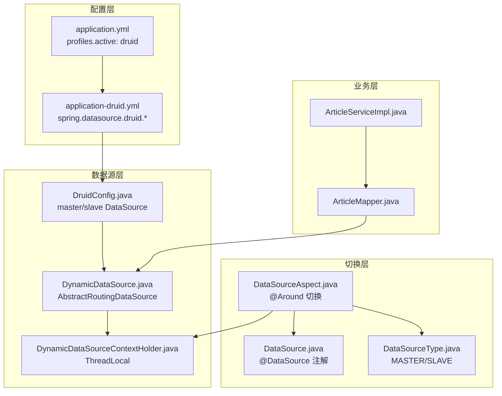
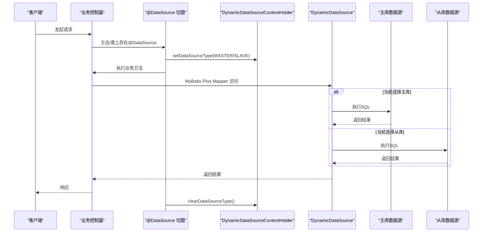
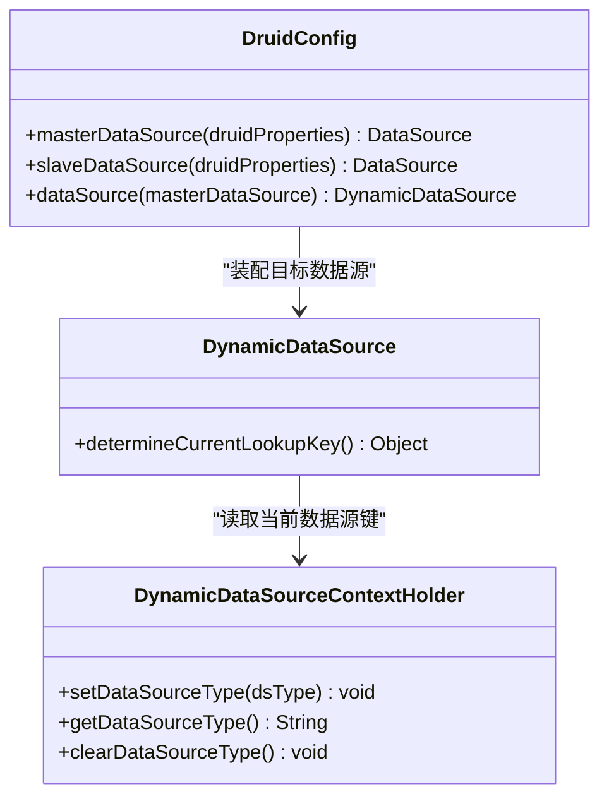
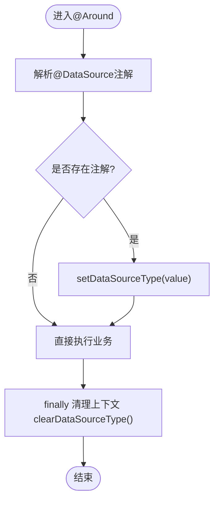
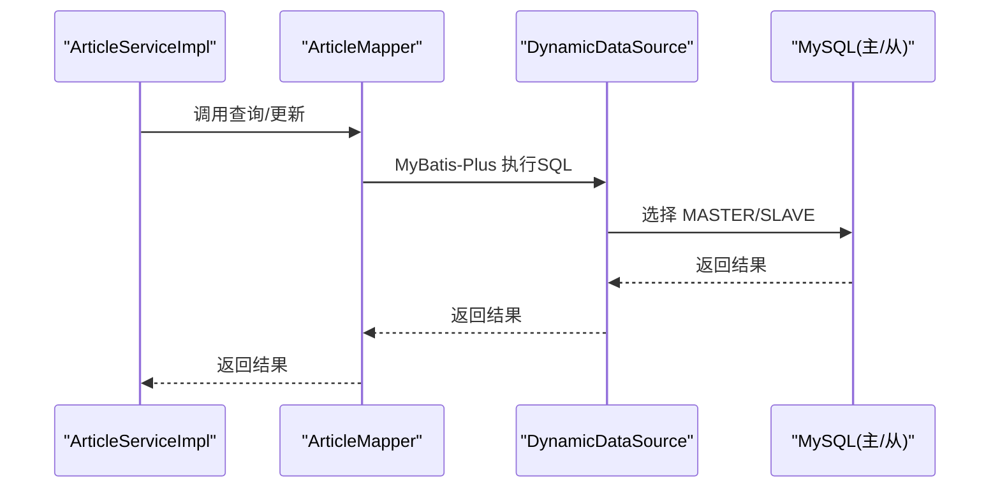
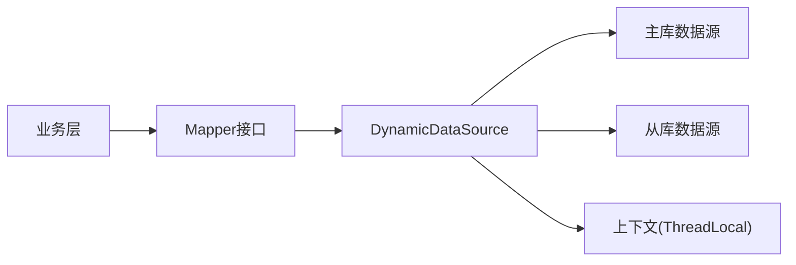

# 故障自动切换

<cite>
**本文引用的文件**
- [application.yml](file://blog-admin/src/main/resources/application.yml)
- [application-druid.yml](file://blog-admin/src/main/resources/application-druid.yml)
- [DruidConfig.java](file://blog-framework/src/main/java/blog/framework/config/DruidConfig.java)
- [DynamicDataSource.java](file://blog-framework/src/main/java/blog/framework/datasource/DynamicDataSource.java)
- [DynamicDataSourceContextHolder.java](file://blog-framework/src/main/java/blog/framework/datasource/DynamicDataSourceContextHolder.java)
- [DataSourceAspect.java](file://blog-framework/src/main/java/blog/framework/aspectj/DataSourceAspect.java)
- [DataSource.java](file://blog-common/src/main/java/blog/common/annotation/DataSource.java)
- [DataSourceType.java](file://blog-common/src/main/java/blog/common/enums/DataSourceType.java)
- [GlobalExceptionHandler.java](file://blog-framework/src/main/java/blog/framework/web/exception/GlobalExceptionHandler.java)
- [ArticleServiceImpl.java](file://blog-biz/src/main/java/blog/biz/service/impl/ArticleServiceImpl.java)
- [ArticleMapper.java](file://blog-biz/src/main/java/blog/biz/mapper/ArticleMapper.java)
- [ry-vue-owner.sql](file://ry-vue-owner.sql)
</cite>

## 目录
1. [简介](#简介)
2. [项目结构](#项目结构)
3. [核心组件](#核心组件)
4. [架构总览](#架构总览)
5. [详细组件分析](#详细组件分析)
6. [依赖分析](#依赖分析)
7. [性能考虑](#性能考虑)
8. [故障排查指南](#故障排查指南)
9. [结论](#结论)
10. [附录](#附录)

## 简介
本方案围绕数据库故障自动切换展开，目标是在主库不可用时，通过从库接管读写或只读流量，保障业务连续性，并在切换过程中尽可能保证数据一致性与可恢复性。当前代码库已具备动态数据源与读写分离的基础能力，但未内置主节点故障检测与自动切换逻辑。因此，本方案在现有基础上提出“检测—决策—切换—恢复”的闭环实施方案，涵盖心跳检测、连接状态监控、延迟检测、从节点选举、主节点提升、客户端重连、一致性保护、恢复验证与回滚策略、监控告警与演练方法。

## 项目结构
- 配置层：Spring Profile 选择 druid 数据源配置，启用 Druid 连接池与监控。
- 数据源层：通过 DruidConfig 构建主库与可选从库数据源，DynamicDataSource 作为路由入口，结合 ThreadLocal 的 DynamicDataSourceContextHolder 实现请求级数据源切换。
- 切换层：通过 DataSourceAspect 切面拦截标注了 @DataSource 的方法或类，按注解值切换数据源。
- 业务层：MyBatis-Plus Mapper/Service 访问数据源，异常由全局异常处理器统一处理。

**图表来源**
- [application.yml:45-51](file://blog-admin/src/main/resources/application.yml#L45-L51)
- [application-druid.yml:1-61](file://blog-admin/src/main/resources/application-druid.yml#L1-L61)
- [DruidConfig.java:33-57](file://blog-framework/src/main/java/blog/framework/config/DruidConfig.java#L33-L57)
- [DynamicDataSource.java:13-24](file://blog-framework/src/main/java/blog/framework/datasource/DynamicDataSource.java#L13-L24)
- [DynamicDataSourceContextHolder.java:11-42](file://blog-framework/src/main/java/blog/framework/datasource/DynamicDataSourceContextHolder.java#L11-L42)
- [DataSourceAspect.java:24-50](file://blog-framework/src/main/java/blog/framework/aspectj/DataSourceAspect.java#L24-L50)
- [DataSource.java:19-28](file://blog-common/src/main/java/blog/common/annotation/DataSource.java#L19-L28)
- [DataSourceType.java:8-18](file://blog-common/src/main/java/blog/common/enums/DataSourceType.java#L8-L18)
- [ArticleServiceImpl.java:21-95](file://blog-biz/src/main/java/blog/biz/service/impl/ArticleServiceImpl.java#L21-L95)
- [ArticleMapper.java:17-66](file://blog-biz/src/main/java/blog/biz/mapper/ArticleMapper.java#L17-L66)

**章节来源**
- [application.yml:45-51](file://blog-admin/src/main/resources/application.yml#L45-L51)
- [application-druid.yml:1-61](file://blog-admin/src/main/resources/application-druid.yml#L1-L61)
- [DruidConfig.java:33-57](file://blog-framework/src/main/java/blog/framework/config/DruidConfig.java#L33-L57)
- [DynamicDataSource.java:13-24](file://blog-framework/src/main/java/blog/framework/datasource/DynamicDataSource.java#L13-L24)
- [DynamicDataSourceContextHolder.java:11-42](file://blog-framework/src/main/java/blog/framework/datasource/DynamicDataSourceContextHolder.java#L11-L42)
- [DataSourceAspect.java:24-50](file://blog-framework/src/main/java/blog/framework/aspectj/DataSourceAspect.java#L24-L50)
- [DataSource.java:19-28](file://blog-common/src/main/java/blog/common/annotation/DataSource.java#L19-L28)
- [DataSourceType.java:8-18](file://blog-common/src/main/java/blog/common/enums/DataSourceType.java#L8-L18)
- [ArticleServiceImpl.java:21-95](file://blog-biz/src/main/java/blog/biz/service/impl/ArticleServiceImpl.java#L21-L95)
- [ArticleMapper.java:17-66](file://blog-biz/src/main/java/blog/biz/mapper/ArticleMapper.java#L17-L66)

## 核心组件
- 动态数据源路由：DynamicDataSource 通过 determineCurrentLookupKey 从上下文获取当前数据源键，实现 MASTER/SLAVE 切换。
- 数据源上下文：DynamicDataSourceContextHolder 使用 ThreadLocal 维护线程内的数据源类型，确保一次请求内数据源一致。
- 注解驱动切换：@DataSource 注解与 DataSourceAspect 切面配合，在方法或类级别声明数据源类型，切面在调用前后设置/清理上下文。
- Druid 多数据源：DruidConfig 构建主库数据源，从库数据源按开关条件创建，最终注入 DynamicDataSource 作为路由容器。
- 全局异常处理：统一捕获运行时异常，输出标准响应，便于故障定位与可观测性。

**章节来源**
- [DynamicDataSource.java:13-24](file://blog-framework/src/main/java/blog/framework/datasource/DynamicDataSource.java#L13-L24)
- [DynamicDataSourceContextHolder.java:11-42](file://blog-framework/src/main/java/blog/framework/datasource/DynamicDataSourceContextHolder.java#L11-L42)
- [DataSourceAspect.java:24-50](file://blog-framework/src/main/java/blog/framework/aspectj/DataSourceAspect.java#L24-L50)
- [DataSource.java:19-28](file://blog-common/src/main/java/blog/common/annotation/DataSource.java#L19-L28)
- [DruidConfig.java:33-57](file://blog-framework/src/main/java/blog/framework/config/DruidConfig.java#L33-L57)
- [GlobalExceptionHandler.java:27-134](file://blog-framework/src/main/java/blog/framework/web/exception/GlobalExceptionHandler.java#L27-L134)

## 架构总览
下图展示从请求进入至数据库访问的整体流程，以及在切换场景下的关键节点。

**图表来源**
- [DataSourceAspect.java:36-49](file://blog-framework/src/main/java/blog/framework/aspectj/DataSourceAspect.java#L36-L49)
- [DynamicDataSource.java:20-23](file://blog-framework/src/main/java/blog/framework/datasource/DynamicDataSource.java#L20-L23)
- [DynamicDataSourceContextHolder.java:23-40](file://blog-framework/src/main/java/blog/framework/datasource/DynamicDataSourceContextHolder.java#L23-L40)
- [ArticleMapper.java:17-66](file://blog-biz/src/main/java/blog/biz/mapper/ArticleMapper.java#L17-L66)

## 详细组件分析

### 动态数据源与上下文
- DynamicDataSource：继承 AbstractRoutingDataSource，重写 determineCurrentLookupKey，从上下文获取数据源键，决定使用哪个目标数据源。
- DynamicDataSourceContextHolder：线程本地存储，提供 set/get/clear，确保一次请求内的数据源类型一致，避免并发污染。
- DruidConfig：构建 master/slave 数据源，若从库开启则加入目标数据源集合，最终注入 DynamicDataSource 作为路由中心。

**图表来源**
- [DynamicDataSource.java:13-24](file://blog-framework/src/main/java/blog/framework/datasource/DynamicDataSource.java#L13-L24)
- [DynamicDataSourceContextHolder.java:11-42](file://blog-framework/src/main/java/blog/framework/datasource/DynamicDataSourceContextHolder.java#L11-L42)
- [DruidConfig.java:35-57](file://blog-framework/src/main/java/blog/framework/config/DruidConfig.java#L35-L57)

**章节来源**
- [DynamicDataSource.java:13-24](file://blog-framework/src/main/java/blog/framework/datasource/DynamicDataSource.java#L13-L24)
- [DynamicDataSourceContextHolder.java:11-42](file://blog-framework/src/main/java/blog/framework/datasource/DynamicDataSourceContextHolder.java#L11-L42)
- [DruidConfig.java:35-57](file://blog-framework/src/main/java/blog/framework/config/DruidConfig.java#L35-L57)

### 注解驱动的数据源切换
- @DataSource：方法/类级别注解，声明使用 MASTER 或 SLAVE。
- DataSourceAspect：环绕通知，优先取方法注解，其次取类注解；执行前后设置/清理上下文，确保线程安全。

**图表来源**
- [DataSourceAspect.java:36-49](file://blog-framework/src/main/java/blog/framework/aspectj/DataSourceAspect.java#L36-L49)
- [DataSource.java:19-28](file://blog-common/src/main/java/blog/common/annotation/DataSource.java#L19-L28)

**章节来源**
- [DataSourceAspect.java:24-65](file://blog-framework/src/main/java/blog/framework/aspectj/DataSourceAspect.java#L24-L65)
- [DataSource.java:19-28](file://blog-common/src/main/java/blog/common/annotation/DataSource.java#L19-L28)

### 业务访问路径
- ArticleServiceImpl/ArticleMapper：MyBatis-Plus 访问数据库，底层通过 DynamicDataSource 选择具体数据源。
- 全局异常处理：统一捕获异常并返回标准响应，便于监控与告警。

**图表来源**
- [ArticleServiceImpl.java:21-95](file://blog-biz/src/main/java/blog/biz/service/impl/ArticleServiceImpl.java#L21-L95)
- [ArticleMapper.java:17-66](file://blog-biz/src/main/java/blog/biz/mapper/ArticleMapper.java#L17-L66)
- [DynamicDataSource.java:20-23](file://blog-framework/src/main/java/blog/framework/datasource/DynamicDataSource.java#L20-L23)

**章节来源**
- [ArticleServiceImpl.java:21-95](file://blog-biz/src/main/java/blog/biz/service/impl/ArticleServiceImpl.java#L21-L95)
- [ArticleMapper.java:17-66](file://blog-biz/src/main/java/blog/biz/mapper/ArticleMapper.java#L17-L66)
- [GlobalExceptionHandler.java:27-134](file://blog-framework/src/main/java/blog/framework/web/exception/GlobalExceptionHandler.java#L27-L134)

## 依赖分析
- 组件耦合：业务层仅依赖 Mapper 接口，Mapper 通过 MyBatis-Plus 访问数据源；数据源路由与上下文解耦于业务层，降低侵入性。
- 外部依赖：Druid 连接池、MySQL、MyBatis-Plus；异常处理依赖 Spring Web。
- 可能的循环依赖：当前结构为单向依赖（业务 -> Mapper -> 数据源），未见循环依赖迹象。

**图表来源**
- [ArticleMapper.java:17-66](file://blog-biz/src/main/java/blog/biz/mapper/ArticleMapper.java#L17-L66)
- [DynamicDataSource.java:13-24](file://blog-framework/src/main/java/blog/framework/datasource/DynamicDataSource.java#L13-L24)
- [DynamicDataSourceContextHolder.java:11-42](file://blog-framework/src/main/java/blog/framework/datasource/DynamicDataSourceContextHolder.java#L11-L42)

**章节来源**
- [ArticleMapper.java:17-66](file://blog-biz/src/main/java/blog/biz/mapper/ArticleMapper.java#L17-L66)
- [DynamicDataSource.java:13-24](file://blog-framework/src/main/java/blog/framework/datasource/DynamicDataSource.java#L13-L24)
- [DynamicDataSourceContextHolder.java:11-42](file://blog-framework/src/main/java/blog/framework/datasource/DynamicDataSourceContextHolder.java#L11-L42)

## 性能考虑
- 连接池参数：初始连接、最小空闲、最大活跃、获取连接最大等待、连接/网络超时等参数已在配置中设定，建议结合压测结果优化。
- 池回收：空闲连接检测周期与最小/最大存活时间需平衡资源占用与连接抖动。
- 读写分离：读流量走从库，写流量走主库，减少主库压力；切换期间建议将写操作降级或阻断，避免写放大。
- 并发一致性：ThreadLocal 保证单请求内数据源一致，避免跨请求污染；注意长事务与连接复用导致的上下文残留。

[本节为通用指导，无需列出具体文件来源]

## 故障排查指南
- 异常统一处理：全局异常处理器对常见异常进行分类处理与日志记录，便于快速定位问题根因。
- 数据源切换验证：通过 @DataSource 注解显式切换，结合日志确认当前线程使用的数据源键。
- 连接池健康：利用 Druid 监控控制台查看连接数、慢SQL、活动/空闲连接状态，辅助判断主从库可用性。
- 数据一致性：在切换窗口内阻断写操作，待从库追平主库后再开放写入；必要时进行数据校验与回放。

**章节来源**
- [GlobalExceptionHandler.java:27-134](file://blog-framework/src/main/java/blog/framework/web/exception/GlobalExceptionHandler.java#L27-L134)
- [application-druid.yml:42-61](file://blog-admin/src/main/resources/application-druid.yml#L42-L61)

## 结论
当前代码库已具备动态数据源与读写分离的基础能力，但缺少主节点故障检测与自动切换机制。本方案在现有基础上补充了“检测—决策—切换—恢复”的闭环流程，强调在切换窗口内的数据一致性保护与恢复验证，同时提供监控告警与演练方法，以实现高可用目标。

[本节为总结性内容，无需列出具体文件来源]

## 附录

### 故障检测机制（建议实现）
- 心跳检测：定时任务探测主库连通性与响应时间，失败阈值触发切换。
- 连接状态监控：监控连接池活跃/空闲数、等待队列长度、超时次数。
- 延迟检测：对比主从复制延迟（如 Seconds_Behind_Master），延迟过大则降级写入。
- 读写分离策略：读流量默认走从库，写流量强制走主库；检测到主库异常时，将读流量切换至从库并阻断写入。

[本节为概念性内容，无需列出具体文件来源]

### 自动切换流程（建议实现）
- 从节点选举：优先选择延迟低、负载轻、可达性高的从库作为候选。
- 主节点提升：在具备高可用架构（如主从复制、集群）的前提下，将从库提升为主库。
- 客户端重连：通过配置中心或注册中心下发新的数据源地址，客户端按需重连。
- 写入降级：切换期间阻断写操作，待从库追平主库后再恢复写入。

[本节为概念性内容，无需列出具体文件来源]

### 数据一致性保证（建议实现）
- 事务中断处理：检测到主库不可用时，中断当前事务并回滚，避免半完成状态。
- 数据同步检查：切换完成后，校验关键表的记录数、主键范围、时间戳等指标。
- 脏读防护：在切换窗口内禁止读取从库，或采用快照读隔离级别，确保一致性。

[本节为概念性内容，无需列出具体文件来源]

### 故障恢复策略（建议实现）
- 手动干预：提供运维接口或命令，允许人工确认后执行回滚或恢复。
- 恢复验证：恢复后进行全量/抽样校验，确保数据正确性与完整性。
- 回滚方案：记录切换前状态（如主库地址、复制位置），必要时回滚至主库。

[本节为概念性内容，无需列出具体文件来源]

### 监控告警与演练
- 监控项：主库连通性、连接池指标、复制延迟、慢SQL、错误率。
- 告警规则：心跳失败、连接池耗尽、复制延迟超阈、慢SQL占比异常。
- 故障演练：定期进行主库停机演练，验证切换与恢复流程的有效性。

[本节为概念性内容，无需列出具体文件来源]