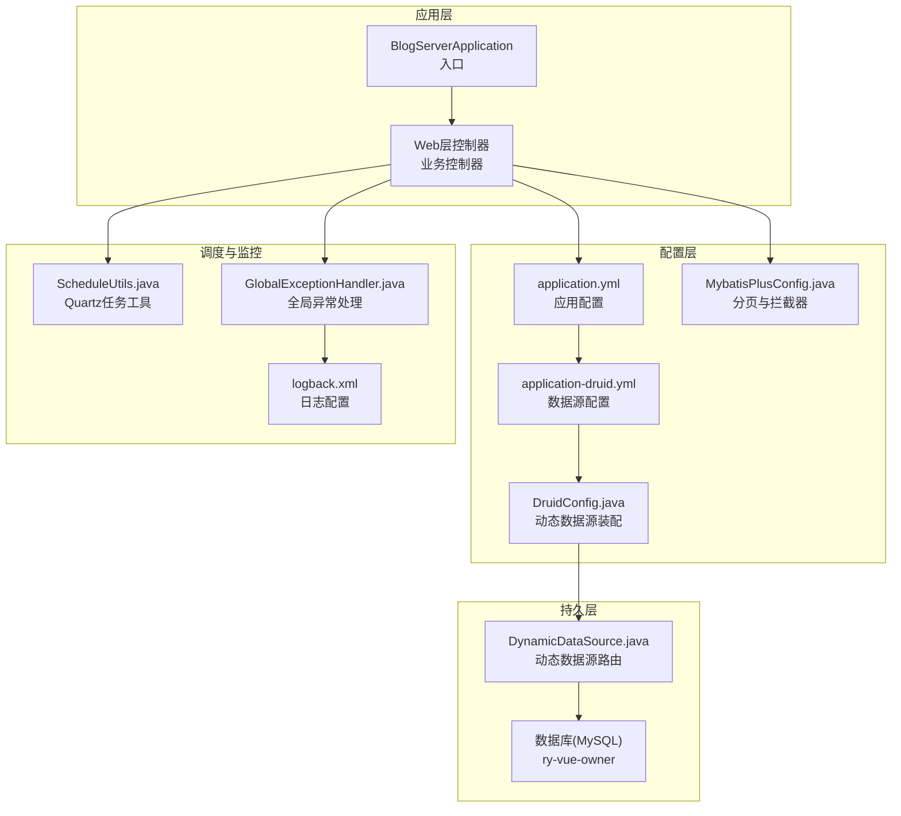
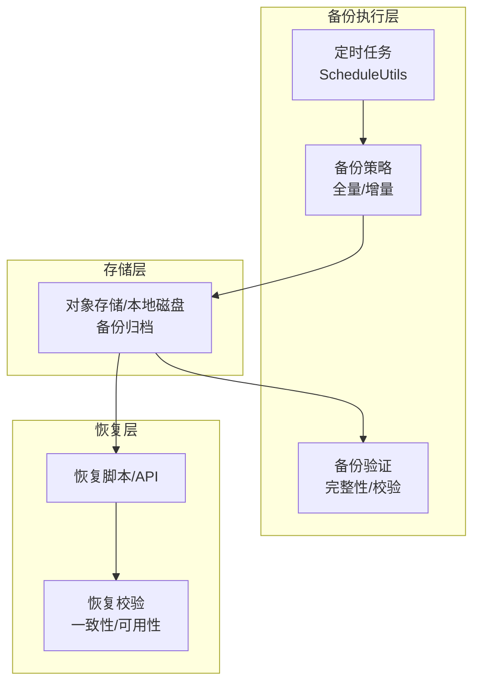
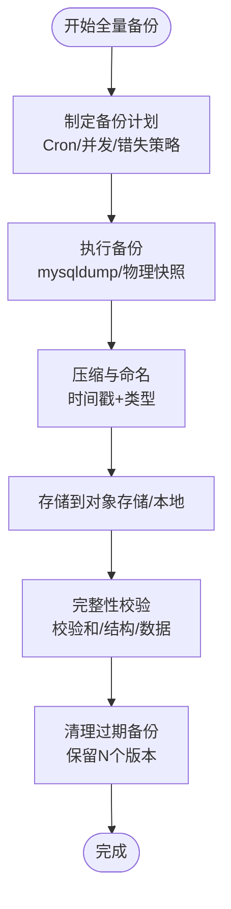
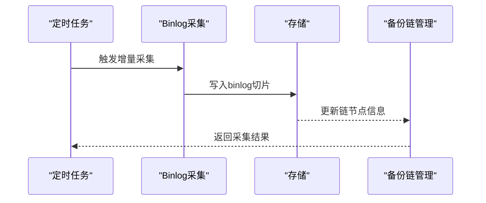
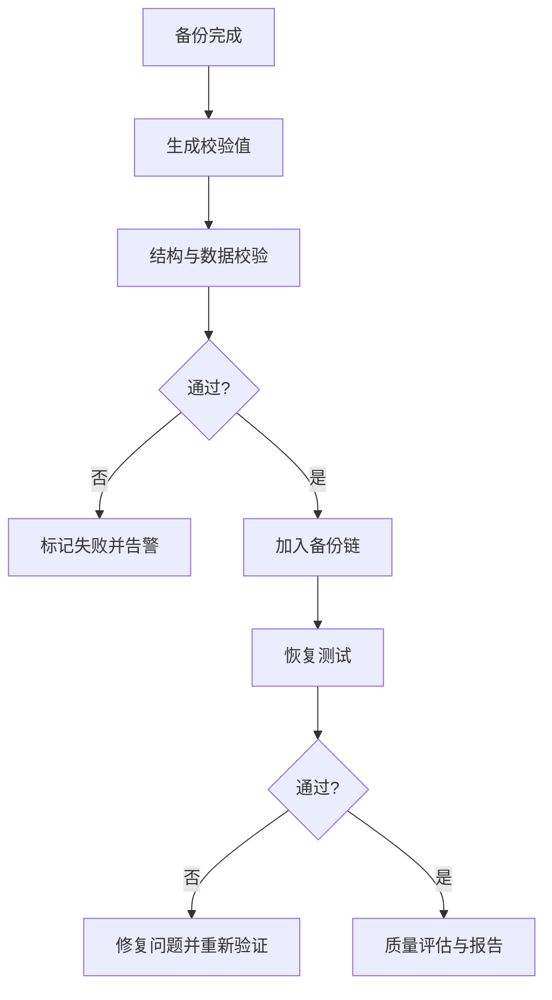
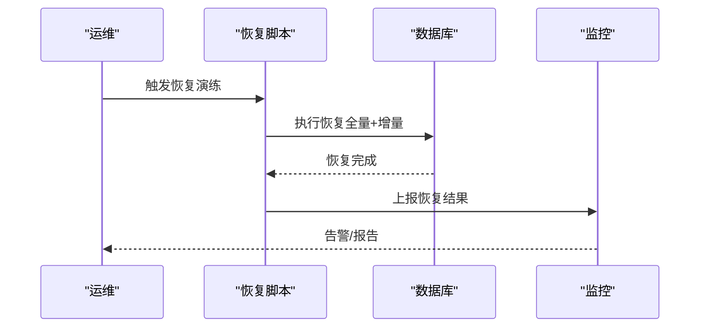
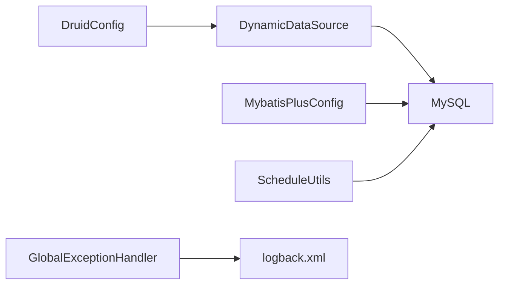

# 数据备份恢复

<cite>
**本文引用的文件**
- [application.yml](file://blog-admin/src/main/resources/application.yml)
- [application-druid.yml](file://blog-admin/src/main/resources/application-druid.yml)
- [DruidConfig.java](file://blog-framework/src/main/java/blog/framework/config/DruidConfig.java)
- [MybatisPlusConfig.java](file://blog-framework/src/main/java/blog/framework/config/MybatisPlusConfig.java)
- [DynamicDataSource.java](file://blog-framework/src/main/java/blog/framework/datasource/DynamicDataSource.java)
- [ry-vue-owner.sql](file://ry-vue-owner.sql)
- [ScheduleUtils.java](file://blog-quartz/src/main/java/blog/quartz/util/ScheduleUtils.java)
- [GlobalExceptionHandler.java](file://blog-framework/src/main/java/blog/framework/web/exception/GlobalExceptionHandler.java)
- [logback.xml](file://blog-admin/src/main/resources/logback.xml)
</cite>

## 目录
1. [简介](#简介)
2. [项目结构](#项目结构)
3. [核心组件](#核心组件)
4. [架构总览](#架构总览)
5. [详细组件分析](#详细组件分析)
6. [依赖分析](#依赖分析)
7. [性能考虑](#性能考虑)
8. [故障排查指南](#故障排查指南)
9. [结论](#结论)
10. [附录](#附录)

## 简介
本方案围绕数据库备份与恢复的综合策略展开，结合项目现有数据库配置与定时任务能力，提供可落地的全量备份、增量备份（binlog）、备份验证与恢复演练、自动化脚本与监控告警建议，确保数据安全与业务连续性。

## 项目结构
项目采用多模块结构，数据库连接通过Druid连接池配置，MyBatis-Plus负责ORM与分页，Quartz用于定时任务调度，日志通过Logback输出。数据库结构由提供的SQL脚本定义，包含业务表与Quartz调度相关表。

图表来源
- [application.yml:1-161](file://blog-admin/src/main/resources/application.yml#L1-L161)
- [application-druid.yml:1-61](file://blog-admin/src/main/resources/application-druid.yml#L1-L61)
- [DruidConfig.java:1-117](file://blog-framework/src/main/java/blog/framework/config/DruidConfig.java#L1-L117)
- [MybatisPlusConfig.java:1-56](file://blog-framework/src/main/java/blog/framework/config/MybatisPlusConfig.java#L1-L56)
- [DynamicDataSource.java:1-24](file://blog-framework/src/main/java/blog/framework/datasource/DynamicDataSource.java#L1-L24)
- [ScheduleUtils.java:1-142](file://blog-quartz/src/main/java/blog/quartz/util/ScheduleUtils.java#L1-L142)
- [GlobalExceptionHandler.java:1-134](file://blog-framework/src/main/java/blog/framework/web/exception/GlobalExceptionHandler.java#L1-L134)
- [logback.xml:33-93](file://blog-admin/src/main/resources/logback.xml#L33-L93)

章节来源
- [application.yml:1-161](file://blog-admin/src/main/resources/application.yml#L1-L161)
- [application-druid.yml:1-61](file://blog-admin/src/main/resources/application-druid.yml#L1-L61)
- [DruidConfig.java:1-117](file://blog-framework/src/main/java/blog/framework/config/DruidConfig.java#L1-L117)
- [MybatisPlusConfig.java:1-56](file://blog-framework/src/main/java/blog/framework/config/MybatisPlusConfig.java#L1-L56)
- [DynamicDataSource.java:1-24](file://blog-framework/src/main/java/blog/framework/datasource/DynamicDataSource.java#L1-L24)
- [ScheduleUtils.java:1-142](file://blog-quartz/src/main/java/blog/quartz/util/ScheduleUtils.java#L1-L142)
- [GlobalExceptionHandler.java:1-134](file://blog-framework/src/main/java/blog/framework/web/exception/GlobalExceptionHandler.java#L1-L134)
- [logback.xml:33-93](file://blog-admin/src/main/resources/logback.xml#L33-L93)

## 核心组件
- 数据源与连接池：通过Druid配置主从数据源、连接池参数、慢SQL记录与控制台管理。
- ORM与分页：MyBatis-Plus配置分页插件、雪花ID生成器、元对象填充。
- 动态数据源：根据上下文切换主从库，支持读写分离。
- 定时任务：Quartz调度器，支持Cron表达式、错失策略、并发控制。
- 日志与异常：统一异常处理与日志落盘，便于审计与问题定位。

章节来源
- [application-druid.yml:1-61](file://blog-admin/src/main/resources/application-druid.yml#L1-L61)
- [DruidConfig.java:1-117](file://blog-framework/src/main/java/blog/framework/config/DruidConfig.java#L1-L117)
- [MybatisPlusConfig.java:1-56](file://blog-framework/src/main/java/blog/framework/config/MybatisPlusConfig.java#L1-L56)
- [DynamicDataSource.java:1-24](file://blog-framework/src/main/java/blog/framework/datasource/DynamicDataSource.java#L1-L24)
- [ScheduleUtils.java:1-142](file://blog-quartz/src/main/java/blog/quartz/util/ScheduleUtils.java#L1-L142)
- [GlobalExceptionHandler.java:1-134](file://blog-framework/src/main/java/blog/framework/web/exception/GlobalExceptionHandler.java#L1-L134)
- [logback.xml:33-93](file://blog-admin/src/main/resources/logback.xml#L33-L93)

## 架构总览
备份恢复体系应与现有应用架构协同：
- 备份任务由定时任务触发，按策略执行全量/增量备份。
- 备份产物存储于对象存储或本地磁盘，带版本与校验信息。
- 恢复流程通过脚本或API触发，结合校验与验证步骤。
- 监控与告警覆盖备份成功率、耗时、完整性与恢复演练结果。

图表来源
- [ScheduleUtils.java:1-142](file://blog-quartz/src/main/java/blog/quartz/util/ScheduleUtils.java#L1-L142)
- [ry-vue-owner.sql:1-1349](file://ry-vue-owner.sql#L1-L1349)

## 详细组件分析

### 全量备份策略
- 备份计划制定
  - 基于Quartz调度器，使用Cron表达式设定全量备份周期（如每日凌晨2点）。
  - 任务并发策略：禁止并发，避免重复占用资源。
  - 错失策略：忽略错失或立即执行，确保在系统空闲时段执行。
- 备份存储管理
  - 存储位置：本地磁盘或对象存储（MinIO配置已存在，可用于备份归档）。
  - 命名规范：包含时间戳、数据库名、备份类型，便于检索与清理。
  - 清理策略：保留最近N个版本，定期清理过期备份。
- 备份压缩优化
  - 使用压缩算法（如gzip/snappy）降低存储成本。
  - 并行压缩：多文件并行处理，提升吞吐。
  - 增量合并：将多个小备份合并为大备份，减少碎片。
- 备份完整性检查
  - 校验和：生成SHA256/MD5校验值，随备份文件一同存储。
  - 结构校验：验证DDL一致性，确保表结构完整。
  - 数据校验：抽样比对关键表记录数与关键字段。

图表来源
- [ScheduleUtils.java:1-142](file://blog-quartz/src/main/java/blog/quartz/util/ScheduleUtils.java#L1-L142)
- [application.yml:155-161](file://blog-admin/src/main/resources/application.yml#L155-L161)
- [ry-vue-owner.sql:1-1349](file://ry-vue-owner.sql#L1-L1349)

章节来源
- [ScheduleUtils.java:1-142](file://blog-quartz/src/main/java/blog/quartz/util/ScheduleUtils.java#L1-L142)
- [application.yml:155-161](file://blog-admin/src/main/resources/application.yml#L155-L161)
- [ry-vue-owner.sql:1-1349](file://ry-vue-owner.sql#L1-L1349)

### 增量备份实现（binlog）
- binlog备份
  - 启用binlog：配置binlog格式（ROW/STATEMENT/MIXED），设置binlog保留周期。
  - 备份策略：定期抽取binlog文件，按时间段切片，配合全量备份形成备份链。
- 增量数据捕获
  - 基于binlog位点（Position/GTID）进行增量捕获，支持断点续传。
  - 事件解析：解析INSERT/UPDATE/DELETE事件，生成增量SQL或二进制日志。
- 备份链管理
  - 备份链：全量备份+连续binlog组成可恢复链。
  - 链完整性：校验binlog连续性与起止位点，防止中间断链。
  - 恢复点选择：基于RPO目标选择最近可恢复位点。

图表来源
- [ScheduleUtils.java:1-142](file://blog-quartz/src/main/java/blog/quartz/util/ScheduleUtils.java#L1-L142)
- [ry-vue-owner.sql:1-1349](file://ry-vue-owner.sql#L1-L1349)

章节来源
- [ry-vue-owner.sql:1-1349](file://ry-vue-owner.sql#L1-L1349)

### 备份验证机制
- 备份完整性检查
  - 校验和：对备份文件生成并存储校验值。
  - 结构一致性：对比DDL与表结构定义。
  - 数据一致性：抽样比对关键表记录数与关键字段。
- 恢复测试
  - 测试环境恢复：在隔离环境中执行恢复，验证业务可用性。
  - 性能回归：评估恢复时间与系统负载。
- 备份质量评估
  - 成功率：统计备份任务成功/失败率。
  - 耗时：记录全量/增量备份耗时，识别瓶颈。
  - 存储效率：压缩比、去重率、重复数据占比。

图表来源
- [ry-vue-owner.sql:1-1349](file://ry-vue-owner.sql#L1-L1349)

章节来源
- [ry-vue-owner.sql:1-1349](file://ry-vue-owner.sql#L1-L1349)

### 恢复演练方案
- 恢复流程测试
  - 全量+增量恢复：验证从全量备份到最新binlog的恢复链。
  - 时间点恢复：基于位点选择精确恢复到某时刻。
  - 多版本回滚：支持快速回滚到历史版本。
- RTO/RPO指标设定
  - RPO：以binlog粒度控制，目标RPO=5分钟。
  - RTO：以恢复脚本与自动化流程为目标，目标RTO=30分钟。
- 灾难恢复预案
  - 多地容灾：异地对象存储或云存储复制。
  - 快速切换：自动化切换脚本，减少人工干预。
  - 业务验证：恢复后自动执行关键业务查询，确认数据正确性。

图表来源
- [ScheduleUtils.java:1-142](file://blog-quartz/src/main/java/blog/quartz/util/ScheduleUtils.java#L1-L142)
- [application.yml:155-161](file://blog-admin/src/main/resources/application.yml#L155-L161)

章节来源
- [ScheduleUtils.java:1-142](file://blog-quartz/src/main/java/blog/quartz/util/ScheduleUtils.java#L1-L142)
- [application.yml:155-161](file://blog-admin/src/main/resources/application.yml#L155-L161)

### 自动化脚本与监控告警
- 自动化脚本
  - 备份脚本：封装mysqldump/物理快照、压缩、校验、上传与清理。
  - 恢复脚本：封装恢复流程，支持时间点与全量恢复。
  - 验证脚本：自动执行完整性与数据校验。
- 监控告警
  - 备份任务监控：状态、耗时、失败次数。
  - 存储监控：容量、IO、上传/下载速率。
  - 恢复演练监控：成功率、RTO/RPO达成情况。
  - 告警渠道：邮件/IM/电话，分级告警。

章节来源
- [application.yml:155-161](file://blog-admin/src/main/resources/application.yml#L155-L161)
- [logback.xml:33-93](file://blog-admin/src/main/resources/logback.xml#L33-L93)
- [GlobalExceptionHandler.java:1-134](file://blog-framework/src/main/java/blog/framework/web/exception/GlobalExceptionHandler.java#L1-L134)

## 依赖分析
- 数据源依赖
  - DruidConfig装配主从数据源，DynamicDataSource根据上下文路由。
- ORM与分页依赖
  - MyBatis-Plus配置分页与雪花ID生成，影响备份/恢复过程中的数据读取与写入。
- 定时任务依赖
  - Quartz调度器与Cron表达式，决定备份/恢复任务的触发时机。
- 日志与异常依赖
  - 全局异常处理与日志配置，保障备份/恢复过程可观测性。

图表来源
- [DruidConfig.java:1-117](file://blog-framework/src/main/java/blog/framework/config/DruidConfig.java#L1-L117)
- [DynamicDataSource.java:1-24](file://blog-framework/src/main/java/blog/framework/datasource/DynamicDataSource.java#L1-L24)
- [MybatisPlusConfig.java:1-56](file://blog-framework/src/main/java/blog/framework/config/MybatisPlusConfig.java#L1-L56)
- [ScheduleUtils.java:1-142](file://blog-quartz/src/main/java/blog/quartz/util/ScheduleUtils.java#L1-L142)
- [GlobalExceptionHandler.java:1-134](file://blog-framework/src/main/java/blog/framework/web/exception/GlobalExceptionHandler.java#L1-L134)
- [logback.xml:33-93](file://blog-admin/src/main/resources/logback.xml#L33-L93)

章节来源
- [DruidConfig.java:1-117](file://blog-framework/src/main/java/blog/framework/config/DruidConfig.java#L1-L117)
- [DynamicDataSource.java:1-24](file://blog-framework/src/main/java/blog/framework/datasource/DynamicDataSource.java#L1-L24)
- [MybatisPlusConfig.java:1-56](file://blog-framework/src/main/java/blog/framework/config/MybatisPlusConfig.java#L1-L56)
- [ScheduleUtils.java:1-142](file://blog-quartz/src/main/java/blog/quartz/util/ScheduleUtils.java#L1-L142)
- [GlobalExceptionHandler.java:1-134](file://blog-framework/src/main/java/blog/framework/web/exception/GlobalExceptionHandler.java#L1-L134)
- [logback.xml:33-93](file://blog-admin/src/main/resources/logback.xml#L33-L93)

## 性能考虑
- 备份窗口：避开业务高峰期，利用慢SQL监控与连接池参数优化。
- 并行与压缩：并行备份与压缩提升吞吐，注意CPU与IO平衡。
- 存储IO：对象存储与本地磁盘的吞吐差异，选择合适的存储介质。
- 恢复加速：预热、并行恢复、索引重建策略优化。

## 故障排查指南
- 备份失败
  - 检查日志：定位异常原因，查看全局异常处理与日志落盘。
  - 校验失败：核对校验和与存储完整性。
- 恢复异常
  - 检查备份链完整性，确认binlog连续性与位点正确性。
  - 验证关键表数据一致性，必要时回滚到上一个稳定版本。
- 监控告警
  - 关注备份任务状态、存储容量与恢复演练结果，及时处置。

章节来源
- [GlobalExceptionHandler.java:1-134](file://blog-framework/src/main/java/blog/framework/web/exception/GlobalExceptionHandler.java#L1-L134)
- [logback.xml:33-93](file://blog-admin/src/main/resources/logback.xml#L33-L93)

## 结论
通过将现有定时任务、日志与异常处理能力与备份恢复策略相结合，可建立一套完整的全量+增量备份、验证与恢复演练体系。建议尽快落地自动化脚本与监控告警，持续优化RTO/RPO指标，确保业务连续性与数据安全。

## 附录
- 数据库结构参考：ry-vue-owner.sql
- MinIO配置参考：application.yml中的minio配置
- 备份产物命名与存储：建议遵循“数据库名_类型_时间戳_校验值”的命名规范，并将校验值与元数据一同存储。

章节来源
- [ry-vue-owner.sql:1-1349](file://ry-vue-owner.sql#L1-L1349)
- [application.yml:155-161](file://blog-admin/src/main/resources/application.yml#L155-L161)