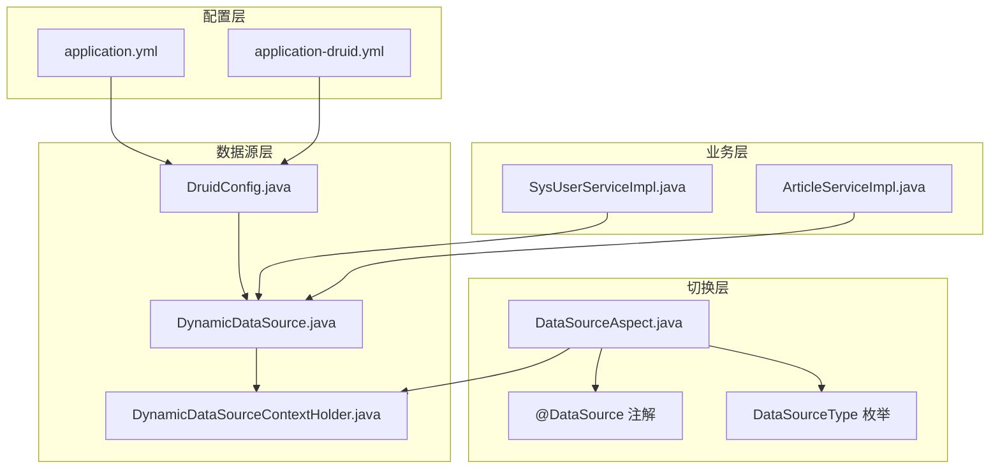
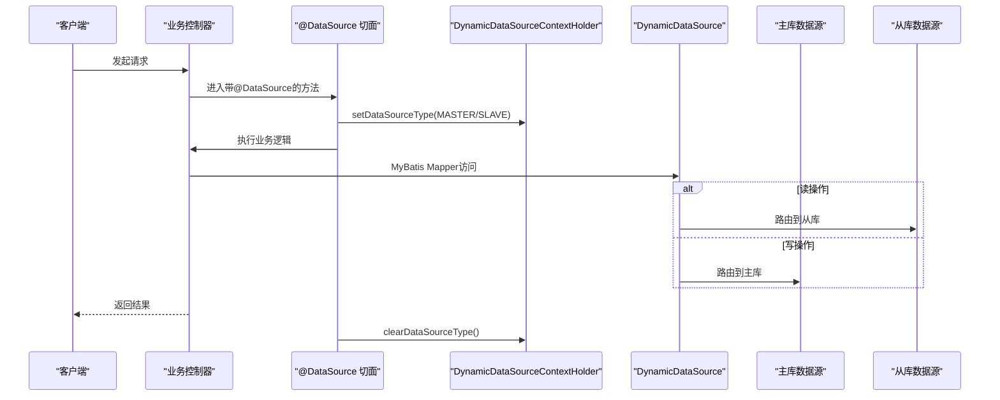
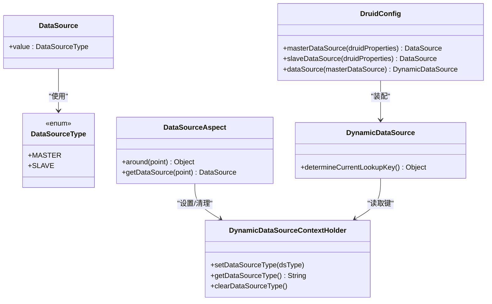
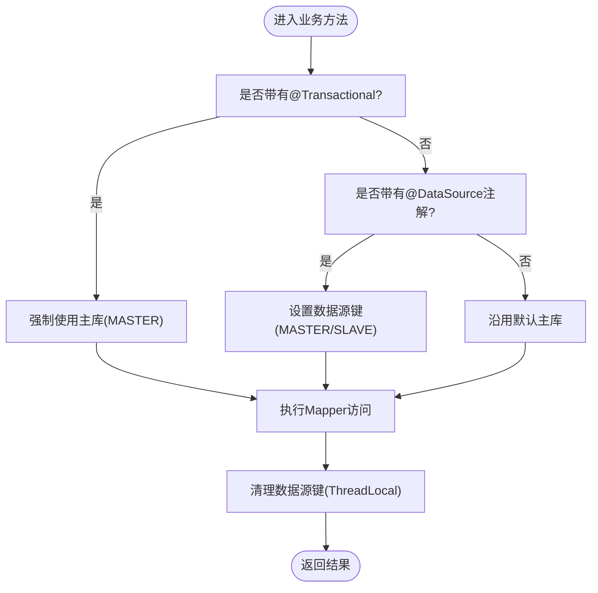
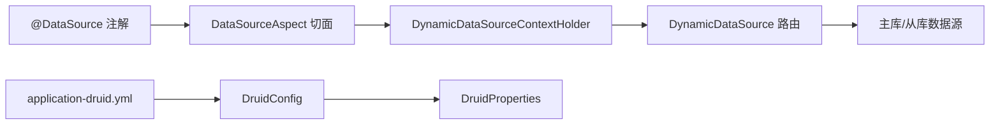

# 数据库高可用

<cite>
**本文引用的文件**
- [application.yml](file://blog-admin/src/main/resources/application.yml)
- [application-druid.yml](file://blog-admin/src/main/resources/application-druid.yml)
- [DruidConfig.java](file://blog-framework/src/main/java/blog/framework/config/DruidConfig.java)
- [DynamicDataSource.java](file://blog-framework/src/main/java/blog/framework/datasource/DynamicDataSource.java)
- [DynamicDataSourceContextHolder.java](file://blog-framework/src/main/java/blog/framework/datasource/DynamicDataSourceContextHolder.java)
- [DataSourceAspect.java](file://blog-framework/src/main/java/blog/framework/aspectj/DataSourceAspect.java)
- [DataSource.java](file://blog-common/src/main/java/blog/common/annotation/DataSource.java)
- [DataSourceType.java](file://blog-common/src/main/java/blog/common/enums/DataSourceType.java)
- [DruidProperties.java](file://blog-framework/src/main/java/blog/framework/config/properties/DruidProperties.java)
- [SysUserServiceImpl.java](file://blog-system/src/main/java/blog/system/service/impl/SysUserServiceImpl.java)
- [ArticleServiceImpl.java](file://blog-biz/src/main/java/blog/biz/service/impl/ArticleServiceImpl.java)
- [logback.xml](file://blog-admin/src/main/resources/logback.xml)
</cite>

## 目录
1. [简介](#简介)
2. [项目结构](#项目结构)
3. [核心组件](#核心组件)
4. [架构总览](#架构总览)
5. [详细组件分析](#详细组件分析)
6. [依赖分析](#依赖分析)
7. [性能考虑](#性能考虑)
8. [故障排查指南](#故障排查指南)
9. [结论](#结论)
10. [附录](#附录)

## 简介
本方案围绕数据库高可用展开，结合当前代码库中已实现的动态数据源与读写分离能力，给出可落地的主从复制、读写分离、故障自动切换、备份恢复与连接池优化的实施路径。由于当前仓库未内置 MySQL 主从复制与自动故障切换的具体实现，本方案在现有基础之上提供“可扩展”的工程化落地步骤与最佳实践，帮助在不破坏现有架构的前提下实现高可用目标。

## 项目结构
- 配置层：Spring Boot 配置文件集中于 blog-admin 模块，包含应用、MyBatis Plus、分页插件、Druid 连接池等配置。
- 数据源层：通过 DruidConfig 统一装配主库与可选从库，DynamicDataSource 作为路由中心，结合 ThreadLocal 的 DynamicDataSourceContextHolder 实现请求级数据源切换。
- 切换层：通过 DataSourceAspect 切面拦截标注了 @DataSource 的方法或类，设置数据源键并在方法执行后清理上下文。
- 业务层：服务实现类中使用 MyBatis Plus Mapper 访问数据库；事务注解用于写操作一致性保障。

图表来源
- [application.yml:45-161](file://blog-admin/src/main/resources/application.yml#L45-L161)
- [application-druid.yml:1-61](file://blog-admin/src/main/resources/application-druid.yml#L1-L61)
- [DruidConfig.java:33-72](file://blog-framework/src/main/java/blog/framework/config/DruidConfig.java#L33-L72)
- [DynamicDataSource.java:13-24](file://blog-framework/src/main/java/blog/framework/datasource/DynamicDataSource.java#L13-L24)
- [DynamicDataSourceContextHolder.java:11-41](file://blog-framework/src/main/java/blog/framework/datasource/DynamicDataSourceContextHolder.java#L11-L41)
- [DataSourceAspect.java:24-64](file://blog-framework/src/main/java/blog/framework/aspectj/DataSourceAspect.java#L24-L64)
- [DataSource.java:19-28](file://blog-common/src/main/java/blog/common/annotation/DataSource.java#L19-L28)
- [DataSourceType.java:8-18](file://blog-common/src/main/java/blog/common/enums/DataSourceType.java#L8-L18)
- [SysUserServiceImpl.java:42-70](file://blog-system/src/main/java/blog/system/service/impl/SysUserServiceImpl.java#L42-L70)
- [ArticleServiceImpl.java:21-47](file://blog-biz/src/main/java/blog/biz/service/impl/ArticleServiceImpl.java#L21-L47)

章节来源
- [application.yml:45-161](file://blog-admin/src/main/resources/application.yml#L45-L161)
- [application-druid.yml:1-61](file://blog-admin/src/main/resources/application-druid.yml#L1-L61)
- [DruidConfig.java:33-72](file://blog-framework/src/main/java/blog/framework/config/DruidConfig.java#L33-L72)
- [DynamicDataSource.java:13-24](file://blog-framework/src/main/java/blog/framework/datasource/DynamicDataSource.java#L13-L24)
- [DynamicDataSourceContextHolder.java:11-41](file://blog-framework/src/main/java/blog/framework/datasource/DynamicDataSourceContextHolder.java#L11-L41)
- [DataSourceAspect.java:24-64](file://blog-framework/src/main/java/blog/framework/aspectj/DataSourceAspect.java#L24-L64)
- [DataSource.java:19-28](file://blog-common/src/main/java/blog/common/annotation/DataSource.java#L19-L28)
- [DataSourceType.java:8-18](file://blog-common/src/main/java/blog/common/enums/DataSourceType.java#L8-L18)
- [SysUserServiceImpl.java:42-70](file://blog-system/src/main/java/blog/system/service/impl/SysUserServiceImpl.java#L42-L70)
- [ArticleServiceImpl.java:21-47](file://blog-biz/src/main/java/blog/biz/service/impl/ArticleServiceImpl.java#L21-L47)

## 核心组件
- 动态数据源路由：DynamicDataSource 通过 determineCurrentLookupKey 从 ThreadLocal 中读取当前数据源键，实现 MASTER/SLAVE 的请求级切换。
- 数据源上下文：DynamicDataSourceContextHolder 使用 ThreadLocal 存储与清理数据源键，避免并发污染。
- 切面切换：DataSourceAspect 基于 @DataSource 注解解析目标数据源，环绕增强方法执行前后设置/清理上下文。
- 配置装配：DruidConfig 从 application-druid.yml 读取主库与可选从库配置，构建 DataSource 并注册为动态数据源。
- 连接池参数：DruidProperties 将配置文件中的连接池参数注入 DruidDataSource，统一管理连接生命周期与校验。

章节来源
- [DynamicDataSource.java:13-24](file://blog-framework/src/main/java/blog/framework/datasource/DynamicDataSource.java#L13-L24)
- [DynamicDataSourceContextHolder.java:11-41](file://blog-framework/src/main/java/blog/framework/datasource/DynamicDataSourceContextHolder.java#L11-L41)
- [DataSourceAspect.java:24-64](file://blog-framework/src/main/java/blog/framework/aspectj/DataSourceAspect.java#L24-L64)
- [DruidConfig.java:33-72](file://blog-framework/src/main/java/blog/framework/config/DruidConfig.java#L33-L72)
- [DruidProperties.java:53-86](file://blog-framework/src/main/java/blog/framework/config/properties/DruidProperties.java#L53-L86)

## 架构总览
下图展示从请求进入至数据库访问的高可用架构要点：配置加载、动态数据源路由、注解驱动的读写分离、以及事务边界内的写操作一致性。

图表来源
- [DataSourceAspect.java:36-50](file://blog-framework/src/main/java/blog/framework/aspectj/DataSourceAspect.java#L36-L50)
- [DynamicDataSourceContextHolder.java:23-40](file://blog-framework/src/main/java/blog/framework/datasource/DynamicDataSourceContextHolder.java#L23-L40)
- [DynamicDataSource.java:20-23](file://blog-framework/src/main/java/blog/framework/datasource/DynamicDataSource.java#L20-L23)
- [DataSource.java:23-28](file://blog-common/src/main/java/blog/common/annotation/DataSource.java#L23-L28)
- [DataSourceType.java:8-18](file://blog-common/src/main/java/blog/common/enums/DataSourceType.java#L8-L18)

## 详细组件分析

### 动态数据源与读写分离
- 数据源枚举：MASTER/SLAVE 明确区分读写路径。
- 注解驱动：@DataSource(value = DataSourceType.SLAVE) 可在方法或类上标注，切面在执行前设置上下文，执行后清理。
- 路由实现：DynamicDataSource 依据 ThreadLocal 键选择目标数据源，实现请求级隔离。
- 事务边界：写操作应始终在 MASTER 上执行，避免读写不一致；读操作可在 SLAVE 上执行，提升吞吐。

图表来源
- [DataSource.java:19-28](file://blog-common/src/main/java/blog/common/annotation/DataSource.java#L19-L28)
- [DataSourceType.java:8-18](file://blog-common/src/main/java/blog/common/enums/DataSourceType.java#L8-L18)
- [DynamicDataSourceContextHolder.java:11-41](file://blog-framework/src/main/java/blog/framework/datasource/DynamicDataSourceContextHolder.java#L11-L41)
- [DynamicDataSource.java:13-24](file://blog-framework/src/main/java/blog/framework/datasource/DynamicDataSource.java#L13-L24)
- [DataSourceAspect.java:24-64](file://blog-framework/src/main/java/blog/framework/aspectj/DataSourceAspect.java#L24-L64)
- [DruidConfig.java:33-72](file://blog-framework/src/main/java/blog/framework/config/DruidConfig.java#L33-L72)

章节来源
- [DataSource.java:19-28](file://blog-common/src/main/java/blog/common/annotation/DataSource.java#L19-L28)
- [DataSourceType.java:8-18](file://blog-common/src/main/java/blog/common/enums/DataSourceType.java#L8-L18)
- [DynamicDataSourceContextHolder.java:11-41](file://blog-framework/src/main/java/blog/framework/datasource/DynamicDataSourceContextHolder.java#L11-L41)
- [DynamicDataSource.java:13-24](file://blog-framework/src/main/java/blog/framework/datasource/DynamicDataSource.java#L13-L24)
- [DataSourceAspect.java:24-64](file://blog-framework/src/main/java/blog/framework/aspectj/DataSourceAspect.java#L24-L64)
- [DruidConfig.java:33-72](file://blog-framework/src/main/java/blog/framework/config/DruidConfig.java#L33-L72)

### 读写分离注解与事务处理
- 读写分离：在查询类方法上标注 @DataSource(DataSourceType.SLAVE)，确保只读请求落到从库。
- 事务一致性：写操作（新增/修改/删除）使用 @Transactional，天然绑定 MASTER 数据源，避免跨库事务复杂度。
- 业务示例：SysUserServiceImpl、ArticleServiceImpl 等服务类直接通过 Mapper 访问数据库，无需感知数据源切换细节。

图表来源
- [DataSourceAspect.java:36-50](file://blog-framework/src/main/java/blog/framework/aspectj/DataSourceAspect.java#L36-L50)
- [SysUserServiceImpl.java:242-251](file://blog-system/src/main/java/blog/system/service/impl/SysUserServiceImpl.java#L242-L251)
- [ArticleServiceImpl.java:55-59](file://blog-biz/src/main/java/blog/biz/service/impl/ArticleServiceImpl.java#L55-L59)

章节来源
- [DataSourceAspect.java:36-50](file://blog-framework/src/main/java/blog/framework/aspectj/DataSourceAspect.java#L36-L50)
- [SysUserServiceImpl.java:242-251](file://blog-system/src/main/java/blog/system/service/impl/SysUserServiceImpl.java#L242-L251)
- [ArticleServiceImpl.java:55-59](file://blog-biz/src/main/java/blog/biz/service/impl/ArticleServiceImpl.java#L55-L59)

### 连接池优化与监控
- 参数注入：DruidProperties 将配置文件中的连接池参数注入 DruidDataSource，包括初始连接数、最小/最大空闲、最大活跃、等待超时、连接/网络超时、空闲检测周期、有效性校验等。
- 监控与统计：DruidConfig 提供 StatViewServlet 与 Stat 过滤器配置，支持慢 SQL 记录与合并统计；同时提供移除监控页广告的过滤器注册。
- 配置位置：application-druid.yml 中集中管理主库与从库（可选）连接串、凭据与连接池参数。

章节来源
- [DruidProperties.java:53-86](file://blog-framework/src/main/java/blog/framework/config/properties/DruidProperties.java#L53-L86)
- [DruidConfig.java:33-72](file://blog-framework/src/main/java/blog/framework/config/DruidConfig.java#L33-L72)
- [application-druid.yml:1-61](file://blog-admin/src/main/resources/application-druid.yml#L1-L61)

## 依赖分析
- 组件耦合：DataSourceAspect 依赖 @DataSource 注解与 DynamicDataSourceContextHolder；DynamicDataSource 依赖 ThreadLocal 上下文；DruidConfig 依赖配置文件与 DruidProperties。
- 外部依赖：Druid 连接池、Spring AOP、MyBatis Plus Mapper。
- 潜在风险：若从库未启用（slave.enabled=false），DynamicDataSource 仅保留主库；需确保业务层正确标注读写分离注解，避免误用 SLAVE 导致脏读。

图表来源
- [DataSource.java:19-28](file://blog-common/src/main/java/blog/common/annotation/DataSource.java#L19-L28)
- [DataSourceAspect.java:24-64](file://blog-framework/src/main/java/blog/framework/aspectj/DataSourceAspect.java#L24-L64)
- [DynamicDataSourceContextHolder.java:11-41](file://blog-framework/src/main/java/blog/framework/datasource/DynamicDataSourceContextHolder.java#L11-L41)
- [DynamicDataSource.java:13-24](file://blog-framework/src/main/java/blog/framework/datasource/DynamicDataSource.java#L13-L24)
- [application-druid.yml:1-61](file://blog-admin/src/main/resources/application-druid.yml#L1-L61)
- [DruidConfig.java:33-72](file://blog-framework/src/main/java/blog/framework/config/DruidConfig.java#L33-L72)
- [DruidProperties.java:53-86](file://blog-framework/src/main/java/blog/framework/config/properties/DruidProperties.java#L53-L86)

章节来源
- [DataSource.java:19-28](file://blog-common/src/main/java/blog/common/annotation/DataSource.java#L19-L28)
- [DataSourceAspect.java:24-64](file://blog-framework/src/main/java/blog/framework/aspectj/DataSourceAspect.java#L24-L64)
- [DynamicDataSourceContextHolder.java:11-41](file://blog-framework/src/main/java/blog/framework/datasource/DynamicDataSourceContextHolder.java#L11-L41)
- [DynamicDataSource.java:13-24](file://blog-framework/src/main/java/blog/framework/datasource/DynamicDataSource.java#L13-L24)
- [application-druid.yml:1-61](file://blog-admin/src/main/resources/application-druid.yml#L1-L61)
- [DruidConfig.java:33-72](file://blog-framework/src/main/java/blog/framework/config/DruidConfig.java#L33-L72)
- [DruidProperties.java:53-86](file://blog-framework/src/main/java/blog/framework/config/properties/DruidProperties.java#L53-L86)

## 性能考虑
- 连接池参数调优：根据 QPS 与并发度调整初始连接、最小/最大空闲、最大活跃与等待超时；开启空闲检测与有效性校验，减少无效连接。
- 读写分离收益：将只读查询分流至从库，显著降低主库压力；注意复制延迟导致的读到旧数据风险，必要时在强一致场景禁用从库读。
- 慢 SQL 监控：利用 Druid Stat 过滤器记录慢查询，定期分析并优化 SQL 与索引。
- 日志与可观测性：通过 logback 配置输出系统运行日志，结合 Druid 监控页面定位性能瓶颈。

章节来源
- [DruidProperties.java:53-86](file://blog-framework/src/main/java/blog/framework/config/properties/DruidProperties.java#L53-L86)
- [DruidConfig.java:77-115](file://blog-framework/src/main/java/blog/framework/config/DruidConfig.java#L77-L115)
- [logback.xml:33-93](file://blog-admin/src/main/resources/logback.xml#L33-L93)

## 故障排查指南
- 从库未启用：检查 application-druid.yml 中 slave.enabled 是否为 true；若为 false，DynamicDataSource 仅使用主库。
- 读写分离误用：确认查询方法是否标注 @DataSource(DataSourceType.SLAVE)，避免在强一致场景读取从库。
- 事务异常：检查写操作是否带有 @Transactional，确保事务边界内使用主库；跨库事务需另行设计。
- 连接池问题：关注 Druid 监控页面的连接数、等待队列与慢 SQL；结合日志定位异常。
- 日志定位：通过 logback 配置的日志级别与滚动策略，快速定位错误堆栈与性能瓶颈。

章节来源
- [application-druid.yml:13-18](file://blog-admin/src/main/resources/application-druid.yml#L13-L18)
- [DruidConfig.java:42-48](file://blog-framework/src/main/java/blog/framework/config/DruidConfig.java#L42-L48)
- [DataSourceAspect.java:36-50](file://blog-framework/src/main/java/blog/framework/aspectj/DataSourceAspect.java#L36-L50)
- [SysUserServiceImpl.java:242-251](file://blog-system/src/main/java/blog/system/service/impl/SysUserServiceImpl.java#L242-L251)
- [logback.xml:33-93](file://blog-admin/src/main/resources/logback.xml#L33-L93)

## 结论
当前代码库已具备完善的动态数据源与读写分离基础设施：注解驱动的切换、请求级上下文隔离、以及可扩展的从库接入点。在此基础上，结合 MySQL 主从复制、复制延迟监控、自动故障切换与备份恢复策略，即可形成完整的数据库高可用体系。建议优先完善从库启用与监控告警，再逐步引入自动故障切换与备份演练流程，确保业务连续性与数据安全。

## 附录

### MySQL 主从复制与复制延迟监控（实施方案要点）
- 主库配置
  - 开启二进制日志 binlog，设置 server-id，合理设置 binlog 格式与大小上限。
  - 配置只读账户与复制专用账户，限制权限。
- 从库配置
  - 初始化从库快照（物理拷贝或逻辑导出），配置 relay log 与复制用户。
  - 使用 CHANGE MASTER TO 指定主库地址、端口、复制用户与 binlog 位置。
- 复制延迟监控
  - 关注 Seconds_Behind_Master 指标，设定阈值告警。
  - 通过 SHOW SLAVE STATUS 与外部监控系统联动，异常时触发降级或切换。
- 读写分离策略
  - 对强一致读写场景禁用从库读；对最终一致的只读场景启用从库读。

### 故障自动切换（主节点故障检测与自动提升）
- 故障检测
  - 心跳探测：定时查询主库健康状态，失败阈值触发告警。
  - 业务探活：通过慢查询与错误率评估主库可用性。
- 自动提升
  - 从库提升为主库：停止从库复制，提升为新主库，变更 DNS/负载均衡权重。
  - 客户端重连：通过配置中心或注册中心下发新的主库地址，客户端自动刷新连接池。
- 回切策略
  - 原主库修复后，将其作为从库重新加入集群，保持数据同步。

### 备份恢复策略
- 全量备份
  - 使用逻辑导出（如 mysqldump）或物理备份工具（如 Percona XtraBackup）定期执行。
- 增量备份
  - 基于 binlog 增量备份，结合时间点恢复（PITR）能力。
- 备份验证与恢复演练
  - 定期验证备份文件完整性与可恢复性，按季度进行恢复演练，缩短 RTO/RPO。

### 数据库连接池优化配置清单
- 连接池参数
  - 初始连接数、最小/最大空闲、最大活跃、最大等待时间、连接超时、网络超时。
- 连接泄漏检测
  - 开启空闲检测与有效性校验，结合慢 SQL 监控识别异常连接。
- 性能监控
  - 启用 Druid StatView 与 Stat 过滤器，记录慢 SQL 与合并统计，配合日志分析。