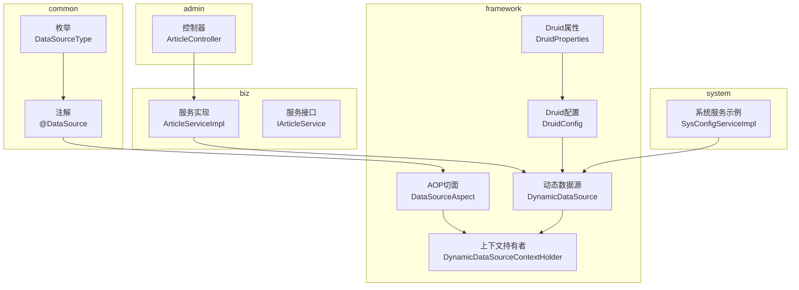
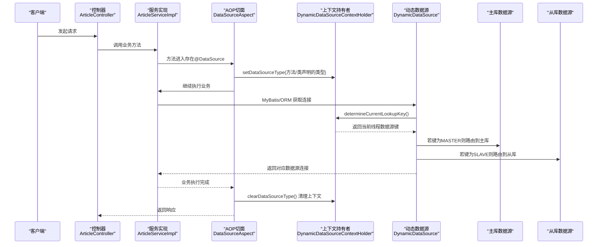
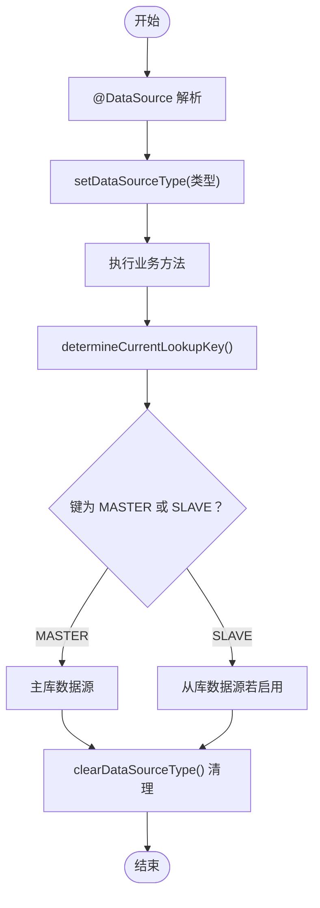
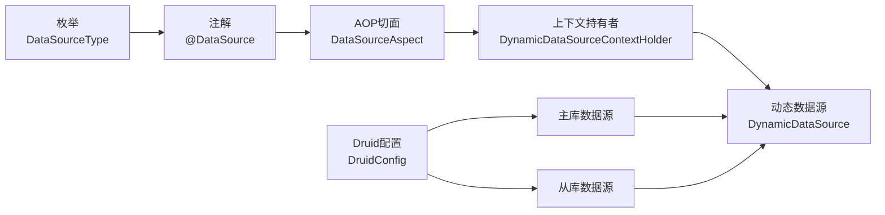

# 读写分离实现

<cite>
**本文引用的文件**
- [DataSource.java](file://blog-common/src/main/java/blog/common/annotation/DataSource.java)
- [DataSourceType.java](file://blog-common/src/main/java/blog/common/enums/DataSourceType.java)
- [DynamicDataSource.java](file://blog-framework/src/main/java/blog/framework/datasource/DynamicDataSource.java)
- [DynamicDataSourceContextHolder.java](file://blog-framework/src/main/java/blog/framework/datasource/DynamicDataSourceContextHolder.java)
- [DataSourceAspect.java](file://blog-framework/src/main/java/blog/framework/aspectj/DataSourceAspect.java)
- [DruidConfig.java](file://blog-framework/src/main/java/blog/framework/config/DruidConfig.java)
- [DruidProperties.java](file://blog-framework/src/main/java/blog/framework/config/properties/DruidProperties.java)
- [application-druid.yml](file://blog-admin/src/main/resources/application-druid.yml)
- [SysConfigServiceImpl.java](file://blog-system/src/main/java/blog/system/service/impl/SysConfigServiceImpl.java)
- [ArticleController.java](file://blog-admin/src/main/java/blog/web/controller/business/ArticleController.java)
- [ArticleServiceImpl.java](file://blog-biz/src/main/java/blog/biz/service/impl/ArticleServiceImpl.java)
- [IArticleService.java](file://blog-biz/src/main/java/blog/biz/service/IArticleService.java)
</cite>

## 目录
1. [简介](#简介)
2. [项目结构](#项目结构)
3. [核心组件](#核心组件)
4. [架构总览](#架构总览)
5. [组件详解](#组件详解)
6. [依赖关系分析](#依赖关系分析)
7. [性能与优化](#性能与优化)
8. [故障排查指南](#故障排查指南)
9. [结论](#结论)
10. [附录](#附录)

## 简介
本技术方案围绕“读写分离”目标，基于 Spring JDBC 动态数据源与 AOP 注解机制，实现请求级的数据源路由与连接池管理。核心能力包括：
- 动态数据源切换：通过 ThreadLocal 维护当前线程的数据源键，路由至主库或从库。
- 注解驱动的数据源选择：@DataSource 支持方法级与类级声明，方法优先于类。
- 连接池管理：基于 Druid 的主从数据源配置与参数调优。
- 事务边界内的数据源固定：AOP 在方法执行前后设置/清理上下文，确保事务内数据源一致。

## 项目结构
本项目采用多模块结构，读写分离相关的核心代码分布在以下模块：
- common：注解与枚举（@DataSource、DataSourceType）
- framework：动态数据源、AOP 切面、Druid 配置
- biz：业务服务与 Mapper 层
- admin：Web 控制器层
- system：系统服务示例（演示注解使用）

图表来源
- [DataSource.java:12-28](file://blog-common/src/main/java/blog/common/annotation/DataSource.java#L12-L28)
- [DataSourceType.java:8-18](file://blog-common/src/main/java/blog/common/enums/DataSourceType.java#L8-L18)
- [DynamicDataSource.java:13-24](file://blog-framework/src/main/java/blog/framework/datasource/DynamicDataSource.java#L13-L24)
- [DynamicDataSourceContextHolder.java:11-41](file://blog-framework/src/main/java/blog/framework/datasource/DynamicDataSourceContextHolder.java#L11-L41)
- [DataSourceAspect.java:24-64](file://blog-framework/src/main/java/blog/framework/aspectj/DataSourceAspect.java#L24-L64)
- [DruidConfig.java:33-72](file://blog-framework/src/main/java/blog/framework/config/DruidConfig.java#L33-L72)
- [DruidProperties.java:12-87](file://blog-framework/src/main/java/blog/framework/config/properties/DruidProperties.java#L12-L87)
- [ArticleController.java:36-101](file://blog-admin/src/main/java/blog/web/controller/business/ArticleController.java#L36-L101)
- [ArticleServiceImpl.java:21-94](file://blog-biz/src/main/java/blog/biz/service/impl/ArticleServiceImpl.java#L21-L94)
- [SysConfigServiceImpl.java:1-120](file://blog-system/src/main/java/blog/system/service/impl/SysConfigServiceImpl.java#L1-L120)

章节来源
- [DataSource.java:12-28](file://blog-common/src/main/java/blog/common/annotation/DataSource.java#L12-L28)
- [DataSourceType.java:8-18](file://blog-common/src/main/java/blog/common/enums/DataSourceType.java#L8-L18)
- [DynamicDataSource.java:13-24](file://blog-framework/src/main/java/blog/framework/datasource/DynamicDataSource.java#L13-L24)
- [DynamicDataSourceContextHolder.java:11-41](file://blog-framework/src/main/java/blog/framework/datasource/DynamicDataSourceContextHolder.java#L11-L41)
- [DataSourceAspect.java:24-64](file://blog-framework/src/main/java/blog/framework/aspectj/DataSourceAspect.java#L24-L64)
- [DruidConfig.java:33-72](file://blog-framework/src/main/java/blog/framework/config/DruidConfig.java#L33-L72)
- [DruidProperties.java:12-87](file://blog-framework/src/main/java/blog/framework/config/properties/DruidProperties.java#L12-L87)
- [application-druid.yml:1-61](file://blog-admin/src/main/resources/application-druid.yml#L1-L61)
- [ArticleController.java:36-101](file://blog-admin/src/main/java/blog/web/controller/business/ArticleController.java#L36-L101)
- [ArticleServiceImpl.java:21-94](file://blog-biz/src/main/java/blog/biz/service/impl/ArticleServiceImpl.java#L21-L94)
- [IArticleService.java:14-63](file://blog-biz/src/main/java/blog/biz/service/IArticleService.java#L14-L63)
- [SysConfigServiceImpl.java:1-120](file://blog-system/src/main/java/blog/system/service/impl/SysConfigServiceImpl.java#L1-L120)

## 核心组件
- 注解与枚举
  - @DataSource：用于声明方法或类使用的数据源类型（MASTER/SLAVE），支持方法优先于类的优先级规则。
  - DataSourceType：枚举定义主库与从库两种类型。
- 动态数据源与上下文
  - DynamicDataSource：继承 Spring 的 AbstractRoutingDataSource，按当前线程上下文键路由到具体数据源。
  - DynamicDataSourceContextHolder：基于 ThreadLocal 的数据源键存储与清理。
- AOP 切面
  - DataSourceAspect：拦截带 @DataSource 的方法或类，执行前设置上下文，执行后清理，确保事务内数据源一致。
- Druid 连接池配置
  - DruidConfig：构建主库与可选从库数据源，装配到 DynamicDataSource；提供移除监控页广告等增强。
  - DruidProperties：集中配置连接池参数（初始大小、最大活跃、等待超时、验证查询等）。

章节来源
- [DataSource.java:12-28](file://blog-common/src/main/java/blog/common/annotation/DataSource.java#L12-L28)
- [DataSourceType.java:8-18](file://blog-common/src/main/java/blog/common/enums/DataSourceType.java#L8-L18)
- [DynamicDataSource.java:13-24](file://blog-framework/src/main/java/blog/framework/datasource/DynamicDataSource.java#L13-L24)
- [DynamicDataSourceContextHolder.java:11-41](file://blog-framework/src/main/java/blog/framework/datasource/DynamicDataSourceContextHolder.java#L11-L41)
- [DataSourceAspect.java:24-64](file://blog-framework/src/main/java/blog/framework/aspectj/DataSourceAspect.java#L24-L64)
- [DruidConfig.java:33-72](file://blog-framework/src/main/java/blog/framework/config/DruidConfig.java#L33-L72)
- [DruidProperties.java:12-87](file://blog-framework/src/main/java/blog/framework/config/properties/DruidProperties.java#L12-L87)

## 架构总览
下图展示从 Web 请求到数据库访问的读写分离流程，包括注解解析、上下文设置、动态路由与连接池使用。

图表来源
- [DataSourceAspect.java:36-49](file://blog-framework/src/main/java/blog/framework/aspectj/DataSourceAspect.java#L36-L49)
- [DynamicDataSourceContextHolder.java:23-39](file://blog-framework/src/main/java/blog/framework/datasource/DynamicDataSourceContextHolder.java#L23-L39)
- [DynamicDataSource.java:20-23](file://blog-framework/src/main/java/blog/framework/datasource/DynamicDataSource.java#L20-L23)
- [DruidConfig.java:50-57](file://blog-framework/src/main/java/blog/framework/config/DruidConfig.java#L50-L57)
- [ArticleController.java:46-69](file://blog-admin/src/main/java/blog/web/controller/business/ArticleController.java#L46-L69)
- [ArticleServiceImpl.java:32-35](file://blog-biz/src/main/java/blog/biz/service/impl/ArticleServiceImpl.java#L32-L35)

## 组件详解

### 动态数据源切换机制
- 切换原理
  - AOP 在方法执行前解析 @DataSource，将数据源类型写入 ThreadLocal。
  - DynamicDataSource 重写 determineCurrentLookupKey，读取当前线程键，决定使用哪个目标数据源。
  - 方法执行完成后，AOP 清理 ThreadLocal，避免泄漏。
- 关键点
  - 线程隔离：ThreadLocal 确保不同请求间互不干扰。
  - 事务内固定：由于 AOP 在方法级别生效，事务边界内数据源键保持不变，避免跨库事务问题。
  - 可选从库：当从库未启用时，DynamicDataSource 仍可路由到主库，保证可用性。

图表来源
- [DataSourceAspect.java:36-49](file://blog-framework/src/main/java/blog/framework/aspectj/DataSourceAspect.java#L36-L49)
- [DynamicDataSource.java:20-23](file://blog-framework/src/main/java/blog/framework/datasource/DynamicDataSource.java#L20-L23)
- [DynamicDataSourceContextHolder.java:23-39](file://blog-framework/src/main/java/blog/framework/datasource/DynamicDataSourceContextHolder.java#L23-L39)

章节来源
- [DataSourceAspect.java:36-49](file://blog-framework/src/main/java/blog/framework/aspectj/DataSourceAspect.java#L36-L49)
- [DynamicDataSource.java:13-24](file://blog-framework/src/main/java/blog/framework/datasource/DynamicDataSource.java#L13-L24)
- [DynamicDataSourceContextHolder.java:11-41](file://blog-framework/src/main/java/blog/framework/datasource/DynamicDataSourceContextHolder.java#L11-L41)

### 读写分离注解机制
- @DataSource 定义与优先级
  - 支持在方法与类上声明，默认 MASTER。
  - 优先级：方法声明覆盖类声明。
- 使用场景
  - 查询类接口：标注 @DataSource(DataSourceType.SLAVE)，将查询路由到从库。
  - 写入类接口：标注 @DataSource(DataSourceType.MASTER)，确保写入主库。
  - 类级统一：对整个服务类标注，再在个别方法覆盖。
- 示例参考
  - 系统服务示例中对特定方法标注主库（演示注解使用方式）。

章节来源
- [DataSource.java:12-28](file://blog-common/src/main/java/blog/common/annotation/DataSource.java#L12-L28)
- [DataSourceType.java:8-18](file://blog-common/src/main/java/blog/common/enums/DataSourceType.java#L8-L18)
- [SysConfigServiceImpl.java:1-120](file://blog-system/src/main/java/blog/system/service/impl/SysConfigServiceImpl.java#L1-L120)

### 事务处理中的数据源选择
- 事务边界内的固定
  - AOP 在方法执行前后设置/清理上下文，确保整个事务（同一方法）内使用同一数据源。
- 分布式事务
  - 当前实现基于本地事务与单数据源路由，不涉及 XA/Seata 等分布式事务框架。
  - 如需跨库分布式事务，应在应用层引入分布式事务组件并在方法入口显式设置数据源。
- 事务回滚
  - 回滚时同样清理上下文，避免后续请求复用已失败的上下文键。

章节来源
- [DataSourceAspect.java:36-49](file://blog-framework/src/main/java/blog/framework/aspectj/DataSourceAspect.java#L36-L49)

### 连接池管理
- Druid 主从配置
  - 主库：通过 application-druid.yml 中 spring.datasource.druid.master.* 配置。
  - 从库：spring.datasource.druid.slave.enabled 控制开关，开启后装配到 DynamicDataSource。
- 连接池参数
  - 初始大小、最小空闲、最大活跃、最大等待、连接超时、socket 超时、空闲回收周期、验证查询等。
- 监控与增强
  - 移除监控页底部广告、统计慢 SQL、白名单控制等。

章节来源
- [DruidConfig.java:33-72](file://blog-framework/src/main/java/blog/framework/config/DruidConfig.java#L33-L72)
- [DruidProperties.java:12-87](file://blog-framework/src/main/java/blog/framework/config/properties/DruidProperties.java#L12-L87)
- [application-druid.yml:1-61](file://blog-admin/src/main/resources/application-druid.yml#L1-L61)

### 控制器与服务层使用示例
- 控制器层
  - ArticleController 提供查询与写入接口，业务逻辑委托给服务层。
- 服务层
  - ArticleServiceImpl 调用 Mapper 执行数据库操作；如需读写分离，可在服务接口或实现类上标注 @DataSource。
- 读写分离建议
  - 查询接口标注 @DataSource(DataSourceType.SLAVE)。
  - 写入接口标注 @DataSource(DataSourceType.MASTER)。

章节来源
- [ArticleController.java:36-101](file://blog-admin/src/main/java/blog/web/controller/business/ArticleController.java#L36-L101)
- [ArticleServiceImpl.java:21-94](file://blog-biz/src/main/java/blog/biz/service/impl/ArticleServiceImpl.java#L21-L94)
- [IArticleService.java:14-63](file://blog-biz/src/main/java/blog/biz/service/IArticleService.java#L14-L63)

## 依赖关系分析
- 组件耦合
  - DataSourceAspect 依赖 @DataSource 与 DataSourceType，负责设置/清理上下文。
  - DynamicDataSource 依赖 DynamicDataSourceContextHolder 提供的键。
  - DruidConfig 将主/从数据源注册到 DynamicDataSource。
- 外部依赖
  - Spring JDBC 动态数据源、MyBatis Plus、Druid。
- 潜在风险
  - 从库未启用时仍可工作（仅主库），但应确保写操作只走主库。
  - 线程上下文未清理可能导致脏数据源键，需确保 AOP 正常生效。

图表来源
- [DataSource.java:12-28](file://blog-common/src/main/java/blog/common/annotation/DataSource.java#L12-L28)
- [DataSourceType.java:8-18](file://blog-common/src/main/java/blog/common/enums/DataSourceType.java#L8-L18)
- [DataSourceAspect.java:24-64](file://blog-framework/src/main/java/blog/framework/aspectj/DataSourceAspect.java#L24-L64)
- [DynamicDataSourceContextHolder.java:11-41](file://blog-framework/src/main/java/blog/framework/datasource/DynamicDataSourceContextHolder.java#L11-L41)
- [DynamicDataSource.java:13-24](file://blog-framework/src/main/java/blog/framework/datasource/DynamicDataSource.java#L13-L24)
- [DruidConfig.java:33-72](file://blog-framework/src/main/java/blog/framework/config/DruidConfig.java#L33-L72)

章节来源
- [DataSourceAspect.java:24-64](file://blog-framework/src/main/java/blog/framework/aspectj/DataSourceAspect.java#L24-L64)
- [DynamicDataSource.java:13-24](file://blog-framework/src/main/java/blog/framework/datasource/DynamicDataSource.java#L13-L24)
- [DruidConfig.java:33-72](file://blog-framework/src/main/java/blog/framework/config/DruidConfig.java#L33-L72)

## 性能与优化
- 读库负载均衡
  - 当前实现为单一从库；可通过在 DruidConfig 中注册多个从库数据源并结合路由策略实现多从库轮询（需扩展 DynamicDataSource）。
- 写库冲突避免
  - 写操作强制走主库，避免从库延迟导致的读写冲突。
- 连接池优化
  - 合理设置初始大小、最大活跃、等待超时与验证查询，减少连接争用与无效连接。
  - 开启慢 SQL 记录与统计，定位热点查询。
- 事务与锁
  - 事务内固定数据源键，避免跨库事务；对热点写操作考虑分片或削峰。

[本节为通用性能建议，无需特定文件引用]

## 故障排查指南
- 症状：查询走到了从库，但数据未及时更新
  - 检查从库延迟与同步策略；必要时在关键查询上强制主库。
- 症状：写入后立即读取不一致
  - 确认写入接口标注 @DataSource(DataSourceType.MASTER)。
- 症状：从库未启用但报错
  - 确认 application-druid.yml 中 spring.datasource.druid.slave.enabled=false 时，系统仅使用主库。
- 症状：AOP 未生效导致数据源未切换
  - 检查 @DataSource 是否正确标注，以及切面是否被加载。

章节来源
- [application-druid.yml:14-18](file://blog-admin/src/main/resources/application-druid.yml#L14-L18)
- [DataSourceAspect.java:36-49](file://blog-framework/src/main/java/blog/framework/aspectj/DataSourceAspect.java#L36-L49)

## 结论
本方案通过注解+AOP+动态数据源的组合，实现了请求级的读写分离与连接池管理。其优点在于实现简洁、线程安全、易于扩展；在生产环境中建议结合多从库、慢 SQL 监控与合理的连接池参数进一步优化整体吞吐与稳定性。

[本节为总结性内容，无需特定文件引用]

## 附录

### 代码示例路径参考
- 注解与枚举
  - [DataSource.java:12-28](file://blog-common/src/main/java/blog/common/annotation/DataSource.java#L12-L28)
  - [DataSourceType.java:8-18](file://blog-common/src/main/java/blog/common/enums/DataSourceType.java#L8-L18)
- 动态数据源与上下文
  - [DynamicDataSource.java:13-24](file://blog-framework/src/main/java/blog/framework/datasource/DynamicDataSource.java#L13-L24)
  - [DynamicDataSourceContextHolder.java:11-41](file://blog-framework/src/main/java/blog/framework/datasource/DynamicDataSourceContextHolder.java#L11-L41)
- AOP 切面
  - [DataSourceAspect.java:24-64](file://blog-framework/src/main/java/blog/framework/aspectj/DataSourceAspect.java#L24-L64)
- Druid 配置与属性
  - [DruidConfig.java:33-72](file://blog-framework/src/main/java/blog/framework/config/DruidConfig.java#L33-L72)
  - [DruidProperties.java:12-87](file://blog-framework/src/main/java/blog/framework/config/properties/DruidProperties.java#L12-L87)
  - [application-druid.yml:1-61](file://blog-admin/src/main/resources/application-druid.yml#L1-L61)
- 控制器与服务层
  - [ArticleController.java:36-101](file://blog-admin/src/main/java/blog/web/controller/business/ArticleController.java#L36-L101)
  - [ArticleServiceImpl.java:21-94](file://blog-biz/src/main/java/blog/biz/service/impl/ArticleServiceImpl.java#L21-L94)
  - [IArticleService.java:14-63](file://blog-biz/src/main/java/blog/biz/service/IArticleService.java#L14-L63)
  - [SysConfigServiceImpl.java:1-120](file://blog-system/src/main/java/blog/system/service/impl/SysConfigServiceImpl.java#L1-L120)

### 性能测试建议
- 基准指标
  - QPS、P99 延迟、连接池命中率、从库延迟。
- 测试场景
  - 读多写少、写多读少、混合负载。
- 工具与方法
  - 使用压测工具模拟并发请求，结合 Druid 监控面板观察连接池状态与慢 SQL。

[本节为通用测试建议，无需特定文件引用]