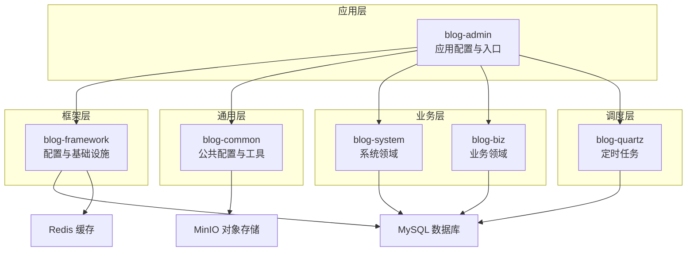
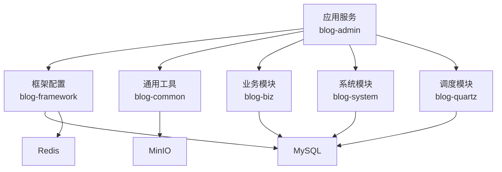
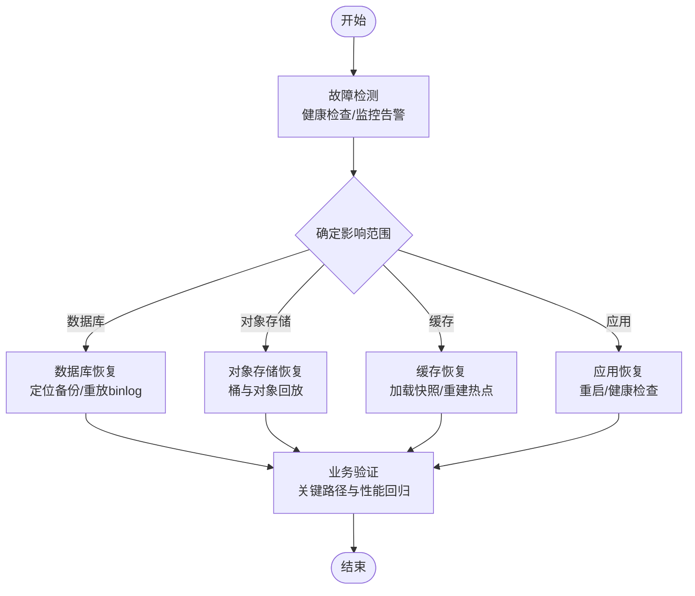
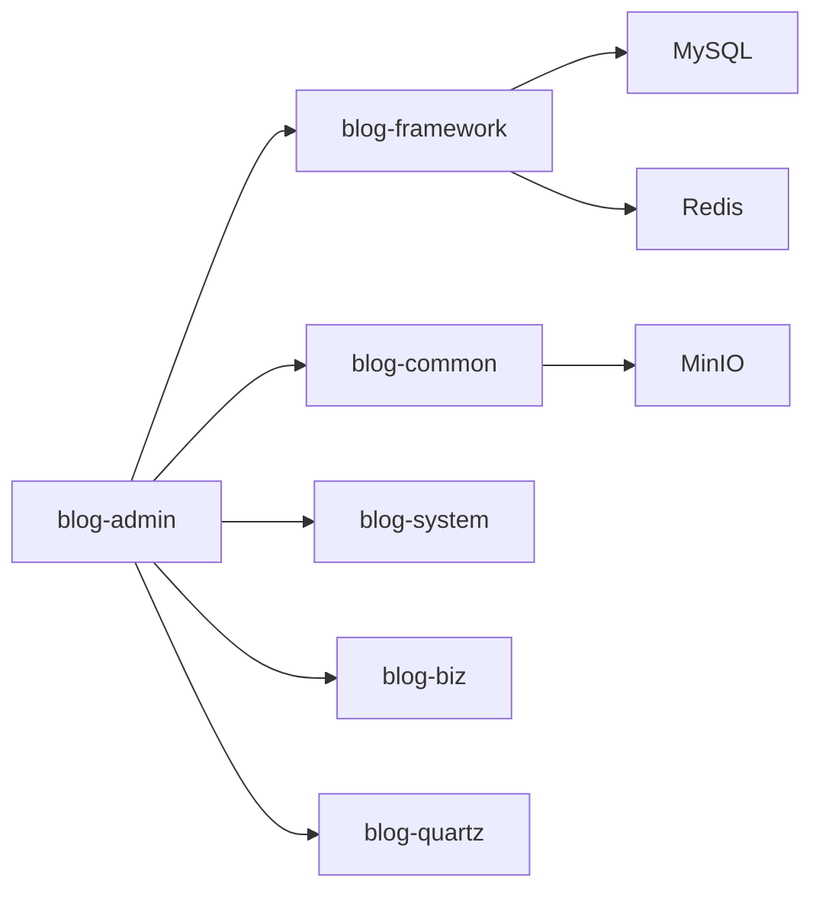

# 灾难恢复与备份

<cite>
**本文引用的文件**   
- [application.yml](file://blog-admin/src/main/resources/application.yml)
- [application-druid.yml](file://blog-admin/src/main/resources/application-druid.yml)
- [BlogServerConfig.java](file://blog-common/src/main/java/blog/common/config/BlogServerConfig.java)
- [MinioProperties.java](file://blog-common/src/main/java/blog/common/config/minio/MinioProperties.java)
- [MinioUtils.java](file://blog-common/src/main/java/blog/common/utils/minio/MinioUtils.java)
- [DruidConfig.java](file://blog-framework/src/main/java/blog/framework/config/DruidConfig.java)
- [RedisConfig.java](file://blog-framework/src/main/java/blog/framework/config/RedisConfig.java)
- [MybatisPlusConfig.java](file://blog-framework/src/main/java/blog/framework/config/MybatisPlusConfig.java)
- [ThreadPoolConfig.java](file://blog-framework/src/main/java/blog/framework/config/ThreadPoolConfig.java)
- [SecurityConfig.java](file://blog-framework/src/main/java/blog/framework/config/SecurityConfig.java)
- [ArticleServiceImpl.java](file://blog-biz/src/main/java/blog/biz/service/impl/ArticleServiceImpl.java)
- [SysUserServiceImpl.java](file://blog-system/src/main/java/blog/system/service/impl/SysUserServiceImpl.java)
- [SysJobServiceImpl.java](file://blog-quartz/src/main/java/blog/quartz/service/impl/SysJobServiceImpl.java)
- [pom.xml](file://pom.xml)
- [ry-vue-owner.sql](file://ry-vue-owner.sql)
</cite>

## 目录
1. [简介](#简介)
2. [项目结构](#项目结构)
3. [核心组件](#核心组件)
4. [架构总览](#架构总览)
5. [详细组件分析](#详细组件分析)
6. [依赖分析](#依赖分析)
7. [性能考虑](#性能考虑)
8. [故障排查指南](#故障排查指南)
9. [结论](#结论)
10. [附录](#附录)

## 简介
本方案面向博客系统的灾难恢复与备份，围绕“数据备份策略（全量/增量/差异/调度）”、“备份验证机制（完整性/恢复测试/日志监控）”、“灾难恢复流程（故障检测/应急预案/恢复步骤/业务验证）”、“业务连续性保障（RTO/RPO/备用站点/数据同步/服务切换）”以及“自动化恢复工具（备份/恢复/监控告警）”展开，结合代码库现有配置与组件，给出可落地的实施建议与流程图示。

## 项目结构
系统采用多模块 Maven 架构，核心模块包括：
- blog-admin：应用入口与配置
- blog-framework：框架配置（数据库、缓存、安全、线程池、MyBatis Plus）
- blog-common：公共配置与工具（MinIO、文件路径等）
- blog-system：系统领域（用户、角色、菜单等）
- blog-biz：业务领域（文章、分类、文件等）
- blog-quartz：定时任务调度
- ry-vue-owner.sql：数据库初始化脚本

图表来源
- [pom.xml:225-233](file://pom.xml#L225-L233)
- [application.yml:44-161](file://blog-admin/src/main/resources/application.yml#L44-L161)
- [application-druid.yml:1-61](file://blog-admin/src/main/resources/application-druid.yml#L1-L61)
- [MinioProperties.java:1-23](file://blog-common/src/main/java/blog/common/config/minio/MinioProperties.java#L1-L23)

章节来源
- [pom.xml:225-233](file://pom.xml#L225-L233)
- [application.yml:12-161](file://blog-admin/src/main/resources/application.yml#L12-L161)
- [application-druid.yml:1-61](file://blog-admin/src/main/resources/application-druid.yml#L1-L61)

## 核心组件
- 数据库与连接池：基于 Druid 的主从配置与动态数据源，支持监控与慢 SQL 记录。
- 缓存：Redis 配置与序列化策略，提供分布式缓存能力。
- 对象存储：MinIO 工具类封装了桶管理、文件上传/下载/删除、列表与预签名 URL。
- 文件路径：统一的上传/下载/头像/导入路径由配置类提供。
- 线程池与定时任务：线程池配置与 Quartz 调度器，支持任务暂停/恢复/立即执行。
- 安全与鉴权：基于 JWT 的无状态认证链路，支持 CORS 与匿名放行配置。

章节来源
- [DruidConfig.java:34-72](file://blog-framework/src/main/java/blog/framework/config/DruidConfig.java#L34-L72)
- [RedisConfig.java:21-47](file://blog-framework/src/main/java/blog/framework/config/RedisConfig.java#L21-L47)
- [MinioUtils.java:26-321](file://blog-common/src/main/java/blog/common/utils/minio/MinioUtils.java#L26-L321)
- [BlogServerConfig.java:13-119](file://blog-common/src/main/java/blog/common/config/BlogServerConfig.java#L13-L119)
- [ThreadPoolConfig.java:19-58](file://blog-framework/src/main/java/blog/framework/config/ThreadPoolConfig.java#L19-L58)
- [SysJobServiceImpl.java:26-261](file://blog-quartz/src/main/java/blog/quartz/service/impl/SysJobServiceImpl.java#L26-L261)
- [SecurityConfig.java:94-126](file://blog-framework/src/main/java/blog/framework/config/SecurityConfig.java#L94-L126)

## 架构总览
系统以 Spring Boot 为基础，通过多模块解耦，结合 MySQL、Redis、MinIO 三大外部依赖，形成“应用-框架-通用-业务-调度”的层次化架构。备份与恢复关注点主要落在数据库、缓存与对象存储三类数据资产上。

图表来源
- [pom.xml:225-233](file://pom.xml#L225-L233)
- [application.yml:44-161](file://blog-admin/src/main/resources/application.yml#L44-L161)

## 详细组件分析

### 数据备份策略
- 全量备份
  - 数据库：使用数据库导出工具生成完整 SQL 或二进制快照，结合初始化脚本进行恢复验证。
  - 对象存储：对 MinIO 桶进行整体备份，保留目录结构与元数据。
  - 缓存：导出 Redis 快照（RDB/AOF），或记录关键键空间用于恢复。
- 增量备份
  - 数据库：启用二进制日志（binlog），按时间点增量备份；结合全量+增量实现快速恢复。
  - 对象存储：基于对象版本控制或定期比对差异，仅备份变更对象。
  - 缓存：通过定期快照与日志合并，实现增量恢复。
- 差异备份
  - 数据库：比较上次全量后的变更，生成差异集；适合频繁全量场景下的增量优化。
  - 对象存储：对比上次备份时间点后的新增/修改对象，减少传输与存储成本。
- 备份调度
  - 使用系统计划任务（如 Linux crontab 或 Quartz）定时触发备份作业，设置优先级与失败重试。
  - 将备份产物分层存储（本地热备、异地冷备），并校验备份文件完整性。

章节来源
- [application-druid.yml:6-41](file://blog-admin/src/main/resources/application-druid.yml#L6-L41)
- [MinioUtils.java:54-73](file://blog-common/src/main/java/blog/common/utils/minio/MinioUtils.java#L54-L73)
- [MinioUtils.java:113-147](file://blog-common/src/main/java/blog/common/utils/minio/MinioUtils.java#L113-L147)
- [SysJobServiceImpl.java:37-46](file://blog-quartz/src/main/java/blog/quartz/service/impl/SysJobServiceImpl.java#L37-L46)

### 备份验证机制
- 备份完整性检查
  - 数据库：执行一致性校验（如校验行数、关键表 checksum）、验证导出文件可读性。
  - 对象存储：校验对象数量、总大小与桶清单一致性；验证预签名 URL 可访问性。
  - 缓存：加载快照后执行键空间扫描与典型键读写测试。
- 备份恢复测试
  - 定期在隔离环境执行恢复演练，覆盖数据库、对象存储与缓存的回放。
  - 验证业务接口可用性与关键功能（如文章查询、用户登录、文件上传下载）。
- 备份日志监控
  - 记录备份开始/结束时间、耗时、成功率、失败原因；对接告警系统（邮件/IM/短信）。
  - 对象存储与数据库备份日志应包含校验摘要（如 SHA256）。

章节来源
- [MinioUtils.java:159-182](file://blog-common/src/main/java/blog/common/utils/minio/MinioUtils.java#L159-L182)
- [MinioUtils.java:290-320](file://blog-common/src/main/java/blog/common/utils/minio/MinioUtils.java#L290-L320)
- [application.yml:30-35](file://blog-admin/src/main/resources/application.yml#L30-L35)

### 灾难恢复流程
- 故障检测
  - 健康检查：数据库连通性、Redis 可用性、MinIO 服务状态、关键接口可用性。
  - 监控告警：阈值触发（CPU/内存/磁盘/连接数/队列积压/慢查询）。
- 应急预案
  - 明确恢复优先级（核心数据优先、业务影响最小化）。
  - 准备恢复脚本与回滚方案，确保可逆操作。
- 恢复步骤
  - 数据库：定位最近可用备份，执行恢复并重放 binlog 至目标时间点。
  - 对象存储：恢复桶与对象，校验预签名 URL 与访问权限。
  - 缓存：加载快照，重建热点键；必要时进行数据补偿。
  - 应用：重启服务，执行健康检查与功能回归测试。
- 业务验证
  - 关键路径验证：登录、文章浏览/发布、文件上传/下载、用户管理。
  - 性能回归：基准测试对比，确认延迟与吞吐满足 RPO/RTO 要求。

图表来源
- [application-druid.yml:6-41](file://blog-admin/src/main/resources/application-druid.yml#L6-L41)
- [MinioUtils.java:54-73](file://blog-common/src/main/java/blog/common/utils/minio/MinioUtils.java#L54-L73)
- [MinioUtils.java:113-147](file://blog-common/src/main/java/blog/common/utils/minio/MinioUtils.java#L113-L147)

章节来源
- [application.yml:30-35](file://blog-admin/src/main/resources/application.yml#L30-L35)
- [SysJobServiceImpl.java:175-193](file://blog-quartz/src/main/java/blog/quartz/service/impl/SysJobServiceImpl.java#L175-L193)

### 业务连续性保障
- RTO/RPO 指标
  - RTO：应用恢复时间目标（如 15 分钟内），需结合备份频率与恢复脚本效率。
  - RPO：数据恢复点目标（如 5 分钟），需结合 binlog/增量备份策略。
- 备用站点建设
  - 异地部署数据库、缓存与对象存储副本，实现跨机房容灾。
  - 通过 DNS/负载均衡切换流量至备用站点。
- 数据同步
  - 数据库：主从复制（异步/半同步）+ binlog 增量。
  - 对象存储：跨区域复制（CRR）或定期同步。
  - 缓存：共享缓存或多活缓存集群。
- 服务切换
  - 自动化切换：监控触发、自动切流与回切。
  - 人工接管：在自动化失败时的人工干预流程与权限控制。

章节来源
- [application.yml:64-89](file://blog-admin/src/main/resources/application.yml#L64-L89)
- [application.yml:155-161](file://blog-admin/src/main/resources/application.yml#L155-L161)
- [application-druid.yml:12-18](file://blog-admin/src/main/resources/application-druid.yml#L12-L18)

### 自动化恢复工具
- 备份脚本
  - 数据库：mysqldump 或物理备份工具，输出带时间戳的压缩文件，校验完整性。
  - 对象存储：使用 MinIO 客户端或 SDK 批量同步/版本化备份。
  - 缓存：导出 Redis 快照，或记录关键键空间。
- 恢复脚本
  - 数据库：停止服务→恢复数据→重放日志→启动服务→健康检查。
  - 对象存储：恢复桶与对象→校验 URL→调整权限。
  - 缓存：加载快照→重建热点→验证读写。
- 监控告警
  - 集成 Prometheus/Grafana/告警规则，覆盖数据库、缓存、对象存储与应用健康。
  - 与运维平台联动，实现自动派单与回滚。

章节来源
- [MinioUtils.java:214-223](file://blog-common/src/main/java/blog/common/utils/minio/MinioUtils.java#L214-L223)
- [MinioUtils.java:237-255](file://blog-common/src/main/java/blog/common/utils/minio/MinioUtils.java#L237-L255)
- [ThreadPoolConfig.java:32-42](file://blog-framework/src/main/java/blog/framework/config/ThreadPoolConfig.java#L32-L42)
- [SysJobServiceImpl.java:200-229](file://blog-quartz/src/main/java/blog/quartz/service/impl/SysJobServiceImpl.java#L200-L229)

## 依赖分析
- 组件耦合
  - blog-admin 依赖 blog-framework、blog-common、blog-system、blog-biz、blog-quartz。
  - blog-framework 依赖数据库与缓存配置，为其他模块提供基础设施。
  - blog-common 为 MinIO 工具与路径配置提供支撑。
- 外部依赖
  - MySQL（Druid 连接池）、Redis（缓存）、MinIO（对象存储）、Quartz（调度）。

图表来源
- [pom.xml:225-233](file://pom.xml#L225-L233)
- [application.yml:44-161](file://blog-admin/src/main/resources/application.yml#L44-L161)

章节来源
- [pom.xml:225-233](file://pom.xml#L225-L233)
- [application.yml:44-161](file://blog-admin/src/main/resources/application.yml#L44-L161)

## 性能考虑
- 数据库性能
  - 合理设置连接池参数（初始大小、最大活跃数、最大等待时间），避免高并发下的连接争用。
  - 启用慢 SQL 监控与日志，定期优化热点查询。
- 缓存性能
  - 选择合适的序列化策略与过期策略，避免内存碎片与 GC 压力。
  - 对热点键进行预热与多级缓存设计。
- 对象存储性能
  - 使用分片上传与断点续传，提升大文件上传稳定性。
  - 合理设置桶策略与访问权限，降低鉴权开销。
- 线程池与调度
  - 线程池容量与队列长度需结合业务峰值与 IO 特性调优。
  - Quartz 任务粒度与并发策略需与数据库连接池协同。

章节来源
- [application-druid.yml:19-41](file://blog-admin/src/main/resources/application-druid.yml#L19-L41)
- [RedisConfig.java:21-39](file://blog-framework/src/main/java/blog/framework/config/RedisConfig.java#L21-L39)
- [ThreadPoolConfig.java:19-58](file://blog-framework/src/main/java/blog/framework/config/ThreadPoolConfig.java#L19-L58)
- [MinioUtils.java:77-147](file://blog-common/src/main/java/blog/common/utils/minio/MinioUtils.java#L77-L147)

## 故障排查指南
- 数据库连接问题
  - 检查连接池配置与数据库连通性，查看 Druid 监控页面与慢 SQL 日志。
- 缓存不可用
  - 校验 Redis 连接参数与网络策略，确认序列化配置一致。
- 对象存储异常
  - 校验桶是否存在、对象是否可访问、预签名 URL 是否过期。
- 定时任务异常
  - 查看任务状态与调度器日志，必要时手动触发与恢复。

章节来源
- [application-druid.yml:44-61](file://blog-admin/src/main/resources/application-druid.yml#L44-L61)
- [RedisConfig.java:21-39](file://blog-framework/src/main/java/blog/framework/config/RedisConfig.java#L21-L39)
- [MinioUtils.java:184-210](file://blog-common/src/main/java/blog/common/utils/minio/MinioUtils.java#L184-L210)
- [SysJobServiceImpl.java:77-110](file://blog-quartz/src/main/java/blog/quartz/service/impl/SysJobServiceImpl.java#L77-L110)

## 结论
本方案基于现有代码库配置与组件，构建了覆盖“备份策略—验证机制—恢复流程—业务连续性—自动化工具”的完整体系。通过数据库、缓存与对象存储的分层备份与恢复，结合监控告警与自动化脚本，可在极端情况下快速恢复系统与保障业务连续性。

## 附录
- 数据库初始化脚本：ry-vue-owner.sql
- 关键配置参考：
  - 应用配置：[application.yml:12-161](file://blog-admin/src/main/resources/application.yml#L12-L161)
  - 数据源配置：[application-druid.yml:1-61](file://blog-admin/src/main/resources/application-druid.yml#L1-L61)
  - MinIO 配置：[MinioProperties.java:1-23](file://blog-common/src/main/java/blog/common/config/minio/MinioProperties.java#L1-L23)
  - MinIO 工具：[MinioUtils.java:26-321](file://blog-common/src/main/java/blog/common/utils/minio/MinioUtils.java#L26-L321)
  - 框架配置：[DruidConfig.java:34-72](file://blog-framework/src/main/java/blog/framework/config/DruidConfig.java#L34-L72), [RedisConfig.java:21-47](file://blog-framework/src/main/java/blog/framework/config/RedisConfig.java#L21-L47), [MybatisPlusConfig.java:19-52](file://blog-framework/src/main/java/blog/framework/config/MybatisPlusConfig.java#L19-L52), [ThreadPoolConfig.java:19-58](file://blog-framework/src/main/java/blog/framework/config/ThreadPoolConfig.java#L19-L58), [SecurityConfig.java:94-126](file://blog-framework/src/main/java/blog/framework/config/SecurityConfig.java#L94-L126)
  - 业务服务：[ArticleServiceImpl.java:21-95](file://blog-biz/src/main/java/blog/biz/service/impl/ArticleServiceImpl.java#L21-L95), [SysUserServiceImpl.java:42-513](file://blog-system/src/main/java/blog/system/service/impl/SysUserServiceImpl.java#L42-L513)
  - 调度服务：[SysJobServiceImpl.java:26-261](file://blog-quartz/src/main/java/blog/quartz/service/impl/SysJobServiceImpl.java#L26-L261)