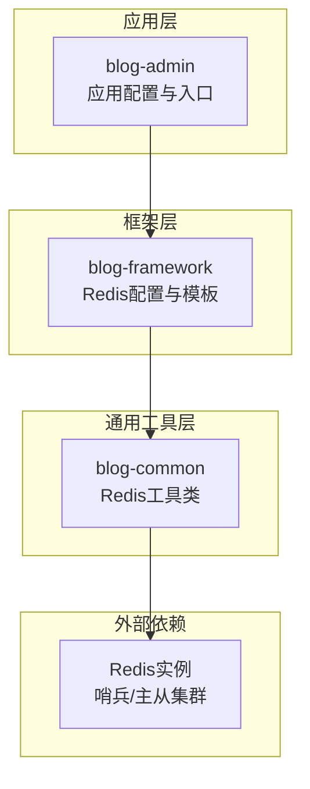
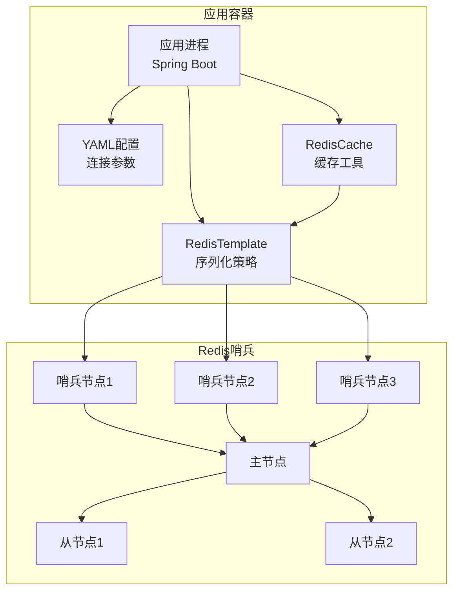
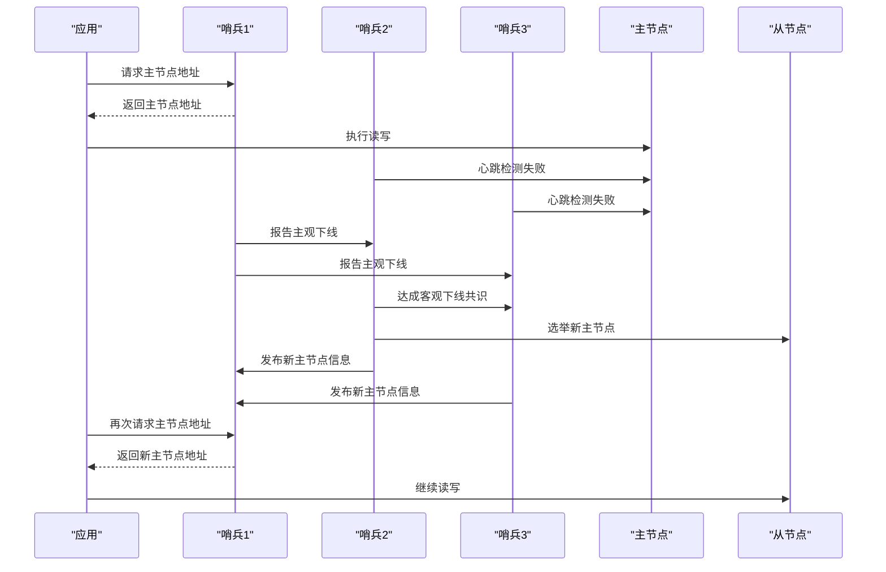
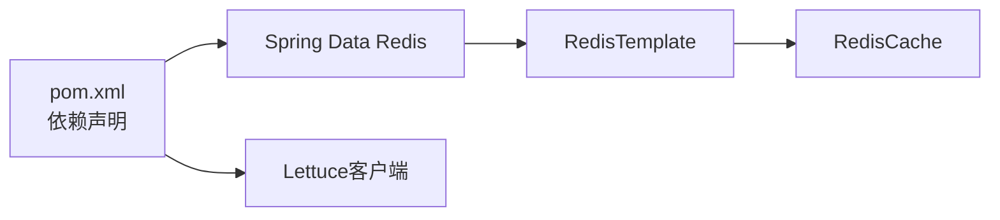

# Redis哨兵配置

<cite>
**本文引用的文件**
- [application.yml](file://blog-admin/src/main/resources/application.yml)
- [RedisConfig.java](file://blog-framework/src/main/java/blog/framework/config/RedisConfig.java)
- [RedisCache.java](file://blog-common/src/main/java/blog/common/core/redis/RedisCache.java)
- [pom.xml](file://pom.xml)
</cite>

## 目录
1. [简介](#简介)
2. [项目结构](#项目结构)
3. [核心组件](#核心组件)
4. [架构总览](#架构总览)
5. [详细组件分析](#详细组件分析)
6. [依赖关系分析](#依赖关系分析)
7. [性能考量](#性能考量)
8. [故障排查指南](#故障排查指南)
9. [结论](#结论)
10. [附录](#附录)

## 简介
本文件面向在生产环境中部署与运维基于Redis的高可用系统，聚焦于Redis哨兵模式的配置与实践。当前代码库展示了Spring Boot应用对Redis的集成方式：通过YAML配置文件定义Redis连接参数，并在框架层提供RedisTemplate与RedisCache工具类。尽管仓库未直接包含Redis哨兵配置文件，但本文将结合现有配置与通用Redis哨兵知识，给出完整的部署、配置与客户端接入指南，帮助读者在生产环境中实现稳定的主从复制、客观/主观下线判定、新主节点选举与故障转移。

## 项目结构
本项目采用多模块Maven结构，Redis相关能力主要由以下模块提供：
- blog-admin：应用入口与配置，包含Redis连接参数的YAML配置。
- blog-framework：Spring配置与RedisTemplate装配，提供序列化策略与脚本支持。
- blog-common：Redis工具类封装，提供统一的缓存操作接口。

图表来源
- [application.yml:65-88](file://blog-admin/src/main/resources/application.yml#L65-L88)
- [RedisConfig.java:21-39](file://blog-framework/src/main/java/blog/framework/config/RedisConfig.java#L21-L39)
- [RedisCache.java:24-26](file://blog-common/src/main/java/blog/common/core/redis/RedisCache.java#L24-L26)

章节来源
- [application.yml:65-88](file://blog-admin/src/main/resources/application.yml#L65-L88)
- [pom.xml:1-282](file://pom.xml#L1-L282)

## 核心组件
- Redis连接配置：在YAML中定义host、port、database、password、timeout及Lettuce连接池参数，用于建立与Redis的连接。
- RedisTemplate配置：在框架层定义模板序列化策略（字符串Key、JSON Value），并提供默认脚本支持。
- RedisCache工具类：在通用层封装常用缓存操作（对象、List、Set、Hash），简化业务侧调用。

章节来源
- [application.yml:65-88](file://blog-admin/src/main/resources/application.yml#L65-L88)
- [RedisConfig.java:21-39](file://blog-framework/src/main/java/blog/framework/config/RedisConfig.java#L21-L39)
- [RedisCache.java:24-247](file://blog-common/src/main/java/blog/common/core/redis/RedisCache.java#L24-L247)

## 架构总览
下图展示应用与Redis之间的交互关系，以及在引入哨兵后的典型拓扑。应用通过Spring配置连接到哨兵，哨兵负责监控主从节点并执行故障转移。

图表来源
- [application.yml:65-88](file://blog-admin/src/main/resources/application.yml#L65-L88)
- [RedisConfig.java:21-39](file://blog-framework/src/main/java/blog/framework/config/RedisConfig.java#L21-L39)
- [RedisCache.java:24-247](file://blog-common/src/main/java/blog/common/core/redis/RedisCache.java#L24-L247)

## 详细组件分析

### 组件一：Redis连接与配置
- 关键点
  - host/port/database/password/timeout等基础连接参数。
  - Lettuce连接池参数（min-idle/max-idle/max-active/max-wait）。
  - 在YAML中可直接覆盖默认值，便于不同环境切换。
- 配置要点
  - 生产建议使用哨兵模式，将host指向哨兵地址，避免硬编码主节点IP。
  - 合理设置timeout与连接池上限，避免在高并发场景下出现连接饥饿。
  - 如需启用认证，应在相应字段填写密码。

章节来源
- [application.yml:65-88](file://blog-admin/src/main/resources/application.yml#L65-L88)

### 组件二：RedisTemplate与序列化
- 关键点
  - Key采用String序列化，Value采用JSON序列化，兼顾可读性与跨语言兼容。
  - 提供默认脚本注册，便于后续扩展限流等Lua脚本能力。
- 设计原则
  - 明确区分Key与HashKey的序列化策略，保证Hash操作一致性。
  - afterPropertiesSet后初始化，确保模板在容器启动时即可用。

章节来源
- [RedisConfig.java:21-39](file://blog-framework/src/main/java/blog/framework/config/RedisConfig.java#L21-L39)

### 组件三：RedisCache工具类
- 关键点
  - 封装对象、List、Set、Hash等常见数据结构的增删改查。
  - 提供过期时间设置、键存在性判断、批量删除等实用方法。
- 使用建议
  - 优先使用带过期时间的写入方法，避免缓存无限增长。
  - 对热点Key设置合理的TTL，结合业务生命周期管理。

章节来源
- [RedisCache.java:24-247](file://blog-common/src/main/java/blog/common/core/redis/RedisCache.java#L24-L247)

### 组件四：哨兵模式工作原理与配置要点
- 主从复制监控
  - 哨兵持续向主从节点发送INFO命令，确认复制状态与延迟。
  - 当从节点落后过多或网络异常，哨兵会将其标记为不可用。
- 主观下线判定
  - 基于哨兵内部定时器与PING/PONG心跳，当超过down-after-milliseconds未收到响应，判定为主观下线。
- 客观下线判定
  - 当达到配置的quorum数量的哨兵同时报告同一实例主观下线，则进入客观下线。
- 新主节点选举
  - 从剩余从节点中按权重选择（如优先级、偏移量、运行ID等）。
  - 选举完成后，向其余节点发布新的主节点信息，并将旧主节点降级为从节点。
- 哨兵关键参数（概念性说明）
  - sentinel monitor：添加被监控的主节点及其别名。
  - sentinel down-after-milliseconds：主观下线阈值（毫秒）。
  - sentinel failover-timeout：故障转移超时时间（毫秒）。
  - sentinel parallel-syncs：故障转移后同步从节点的数量。
  - sentinel auth-pass/sentinel auth-usernam：认证凭据（如需）。
- 最佳实践
  - 哨兵节点数量建议奇数（至少3个），避免脑裂。
  - down-after与failover-timeout应结合网络与硬件性能合理设置。
  - 为每个主节点配置独立的哨兵配置文件，避免混用。

（本节为概念性说明，不直接分析具体文件）

### 组件五：部署架构与拓扑设计
- 节点数量
  - 至少3个哨兵节点，推荐5个以提升容错能力。
- 网络拓扑
  - 哨兵与Redis节点分布在不同物理机或容器中，避免单点故障。
  - 应用与哨兵之间保持低延迟与高可用网络。
- 故障转移流程（概念性序列图）

（本图为概念性流程，不直接映射具体源码文件）

### 组件六：客户端接入与故障转移后的重连
- 连接哨兵
  - 应用启动时连接哨兵列表，获取主从节点信息。
- 获取主从地址
  - 通过哨兵查询当前主节点与从节点列表。
- 故障转移后的重连
  - 定期轮询哨兵更新主节点地址。
  - 在连接失败时主动从哨兵刷新地址并重试。
- 代码层面的注意事项
  - 使用连接池与超时控制，避免阻塞。
  - 对异常进行分类处理（网络异常、认证失败、主从切换）。

（本节为概念性说明，不直接分析具体文件）

### 组件七：监控脚本与故障演练
- 监控脚本建议
  - 定时检查哨兵健康状态与主从复制延迟。
  - 记录down-after与failover-timeout指标，评估配置合理性。
- 故障演练
  - 模拟主节点宕机，观察哨兵客观下线与选举过程。
  - 模拟网络分区，验证哨兵共识与脑裂防护。
  - 模拟从节点落后，验证自动降级与恢复机制。

（本节为概念性说明，不直接分析具体文件）

## 依赖关系分析
- 应用依赖Redis客户端（Lettuce）与Spring Data Redis，通过YAML配置注入连接参数。
- RedisTemplate与RedisCache在框架与通用层分别承担“基础设施”和“业务工具”的职责。
- 项目POM中未显式声明Redis哨兵客户端依赖，实际运行需根据部署模式选择合适的客户端。

图表来源
- [pom.xml:1-282](file://pom.xml#L1-L282)
- [RedisConfig.java:21-39](file://blog-framework/src/main/java/blog/framework/config/RedisConfig.java#L21-L39)
- [RedisCache.java:24-247](file://blog-common/src/main/java/blog/common/core/redis/RedisCache.java#L24-L247)

章节来源
- [pom.xml:1-282](file://pom.xml#L1-L282)

## 性能考量
- 连接池参数
  - 合理设置max-active与max-wait，避免在突发流量下出现连接阻塞。
  - min-idle与max-idle应结合业务峰值与平均并发调整。
- 序列化开销
  - JSON序列化带来CPU与带宽成本，建议对大对象进行压缩或分片。
- 哨兵与主从复制
  - down-after与failover-timeout过小可能导致频繁误判，过大则影响恢复速度。
  - 并行同步数量parallel-syncs应与从节点数量匹配，避免拖慢恢复。

（本节为通用性能建议，不直接分析具体文件）

## 故障排查指南
- 连接失败
  - 检查host/port与网络连通性，确认防火墙与安全组放行。
  - 校验密码与认证配置，确保与Redis服务端一致。
- 缓存异常
  - 使用RedisCache提供的keys与info接口定位问题，检查键空间与内存占用。
  - 关注过期策略与TTL设置，避免缓存雪崩。
- 哨兵相关
  - 查看哨兵日志，确认主观/客观下线判定是否符合预期。
  - 验证quorum与parallel-syncs配置，确保选举与同步正常。

章节来源
- [RedisCache.java:24-247](file://blog-common/src/main/java/blog/common/core/redis/RedisCache.java#L24-L247)

## 结论
本项目已具备与Redis集成的基础能力：清晰的连接配置、完善的模板与工具类。结合本文提供的Redis哨兵模式工作原理、部署建议与客户端接入方案，可在生产环境中构建稳定、可扩展的高可用缓存体系。建议在上线前完成哨兵部署、参数校准与故障演练，确保系统在真实压力下的可靠性。

## 附录
- 配置参考路径
  - Redis连接参数：[application.yml:65-88](file://blog-admin/src/main/resources/application.yml#L65-L88)
  - RedisTemplate配置：[RedisConfig.java:21-39](file://blog-framework/src/main/java/blog/framework/config/RedisConfig.java#L21-L39)
  - RedisCache工具类：[RedisCache.java:24-247](file://blog-common/src/main/java/blog/common/core/redis/RedisCache.java#L24-L247)
- 依赖声明参考：[pom.xml:1-282](file://pom.xml#L1-L282)