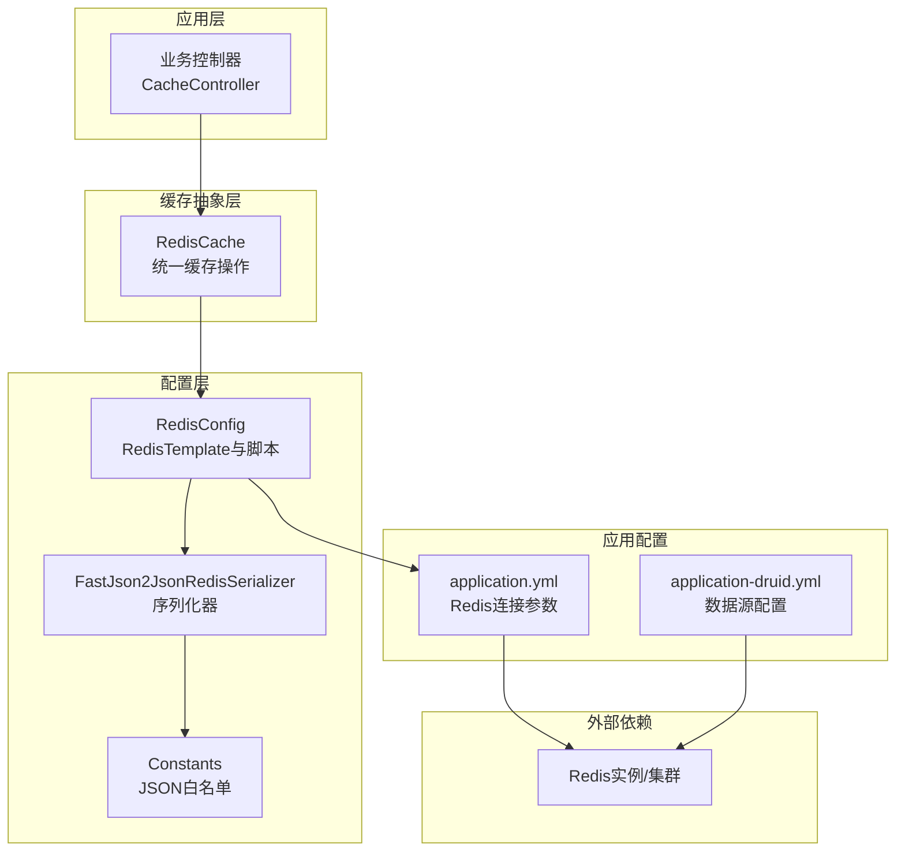
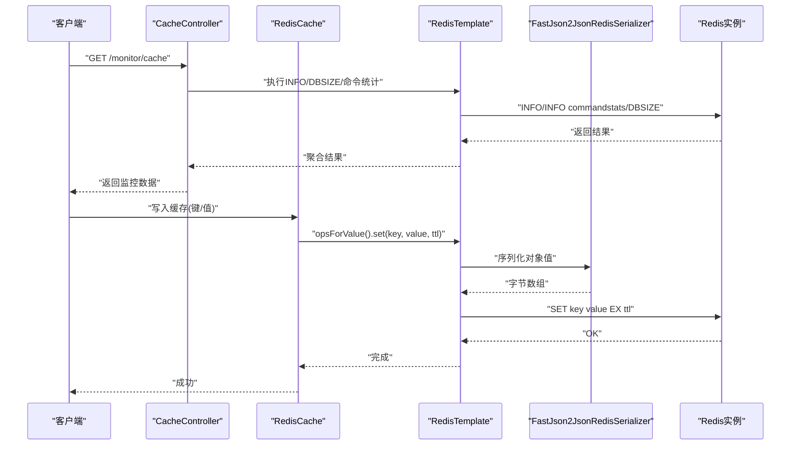
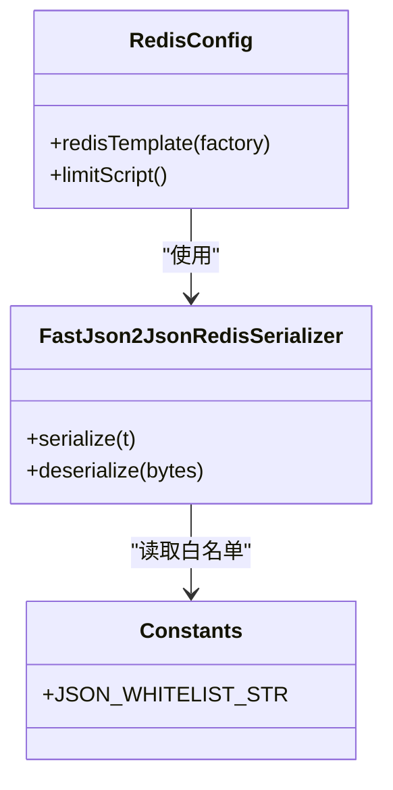
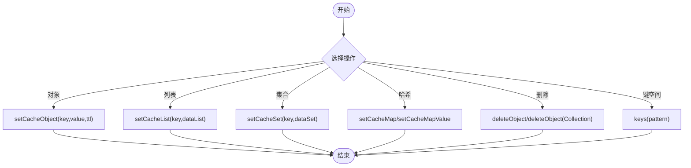
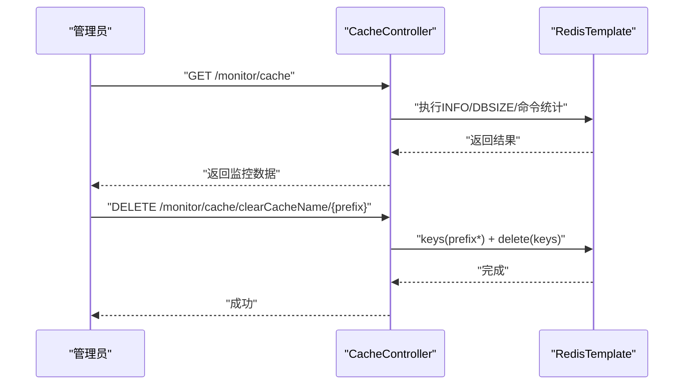
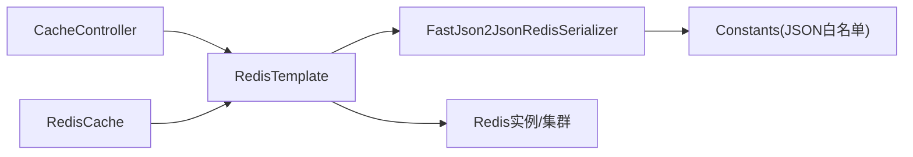

# Redis集群部署

<cite>
**本文引用的文件**
- [RedisConfig.java](file://blog-framework/src/main/java/blog/framework/config/RedisConfig.java)
- [RedisCache.java](file://blog-common/src/main/java/blog/common/core/redis/RedisCache.java)
- [application.yml](file://blog-admin/src/main/resources/application.yml)
- [application-druid.yml](file://blog-admin/src/main/resources/application-druid.yml)
- [CacheController.java](file://blog-admin/src/main/java/blog/web/controller/monitor/CacheController.java)
- [CacheConstants.java](file://blog-common/src/main/java/blog/common/constant/CacheConstants.java)
- [FastJson2JsonRedisSerializer.java](file://blog-framework/src/main/java/blog/framework/config/FastJson2JsonRedisSerializer.java)
- [Constants.java](file://blog-common/src/main/java/blog/common/constant/Constants.java)
</cite>

## 目录
1. [简介](#简介)
2. [项目结构](#项目结构)
3. [核心组件](#核心组件)
4. [架构总览](#架构总览)
5. [详细组件分析](#详细组件分析)
6. [依赖关系分析](#依赖关系分析)
7. [性能考量](#性能考量)
8. [故障排查指南](#故障排查指南)
9. [结论](#结论)
10. [附录](#附录)

## 简介
本指南面向生产环境，系统性阐述如何在现有Spring Boot应用中完成Redis集群部署与运维。项目当前使用单机Redis连接配置，但通过统一的Redis模板与序列化策略，可平滑迁移到Redis集群模式。文档将从架构原理、配置参数、运维流程到监控实践给出完整方案，并提供可落地的部署与配置参考。

## 项目结构
围绕Redis的关键模块与文件如下：
- 配置层：Redis连接与序列化配置
- 缓存封装层：对RedisTemplate的常用操作封装
- 应用配置层：Spring Boot的Redis连接参数
- 监控层：基于Redis命令的缓存监控接口
- 常量层：缓存键命名规范

图表来源
- [RedisConfig.java:17-39](file://blog-framework/src/main/java/blog/framework/config/RedisConfig.java#L17-L39)
- [RedisCache.java:24-38](file://blog-common/src/main/java/blog/common/core/redis/RedisCache.java#L24-L38)
- [application.yml:64-88](file://blog-admin/src/main/resources/application.yml#L64-L88)
- [FastJson2JsonRedisSerializer.java:19-47](file://blog-framework/src/main/java/blog/framework/config/FastJson2JsonRedisSerializer.java#L19-L47)
- [Constants.java:160-161](file://blog-common/src/main/java/blog/common/constant/Constants.java#L160-L161)
- [CacheController.java:31-62](file://blog-admin/src/main/java/blog/web/controller/monitor/CacheController.java#L31-L62)

章节来源
- [RedisConfig.java:17-39](file://blog-framework/src/main/java/blog/framework/config/RedisConfig.java#L17-L39)
- [RedisCache.java:24-38](file://blog-common/src/main/java/blog/common/core/redis/RedisCache.java#L24-L38)
- [application.yml:64-88](file://blog-admin/src/main/resources/application.yml#L64-L88)

## 核心组件
- RedisTemplate与序列化
  - 统一使用字符串Key序列化与对象值序列化，保证跨语言与跨组件兼容性。
  - 使用FastJSON2进行对象序列化，支持写入类型信息以提升反序列化安全性。
- RedisCache工具类
  - 提供对象、列表、集合、哈希等常用数据结构的读写与过期控制。
  - 封装批量删除、键匹配查询等运维常用能力。
- 应用配置
  - 通过application.yml集中配置Redis主机、端口、数据库索引、认证、超时与连接池参数。
- 监控接口
  - 提供Redis信息查询、命令统计与DB大小统计，便于快速评估健康状况。

章节来源
- [RedisConfig.java:21-39](file://blog-framework/src/main/java/blog/framework/config/RedisConfig.java#L21-L39)
- [RedisCache.java:34-246](file://blog-common/src/main/java/blog/common/core/redis/RedisCache.java#L34-L246)
- [application.yml:64-88](file://blog-admin/src/main/resources/application.yml#L64-L88)
- [CacheController.java:50-115](file://blog-admin/src/main/java/blog/web/controller/monitor/CacheController.java#L50-L115)

## 架构总览
下图展示从应用到Redis的调用链路与关键组件交互：

图表来源
- [CacheController.java:50-115](file://blog-admin/src/main/java/blog/web/controller/monitor/CacheController.java#L50-L115)
- [RedisCache.java:34-48](file://blog-common/src/main/java/blog/common/core/redis/RedisCache.java#L34-L48)
- [RedisConfig.java:21-39](file://blog-framework/src/main/java/blog/framework/config/RedisConfig.java#L21-L39)
- [FastJson2JsonRedisSerializer.java:31-47](file://blog-framework/src/main/java/blog/framework/config/FastJson2JsonRedisSerializer.java#L31-L47)

## 详细组件分析

### Redis配置与序列化
- 关键点
  - Key使用字符串序列化，Value使用FastJSON2序列化，兼顾可读性与跨语言兼容。
  - 通过常量白名单过滤，降低反序列化风险。
- 影响
  - 为后续迁移到集群模式提供一致的序列化契约，避免键空间冲突与类型丢失。

图表来源
- [RedisConfig.java:21-47](file://blog-framework/src/main/java/blog/framework/config/RedisConfig.java#L21-L47)
- [FastJson2JsonRedisSerializer.java:19-47](file://blog-framework/src/main/java/blog/framework/config/FastJson2JsonRedisSerializer.java#L19-L47)
- [Constants.java:160-161](file://blog-common/src/main/java/blog/common/constant/Constants.java#L160-L161)

章节来源
- [RedisConfig.java:21-47](file://blog-framework/src/main/java/blog/framework/config/RedisConfig.java#L21-L47)
- [FastJson2JsonRedisSerializer.java:19-47](file://blog-framework/src/main/java/blog/framework/config/FastJson2JsonRedisSerializer.java#L19-L47)
- [Constants.java:160-161](file://blog-common/src/main/java/blog/common/constant/Constants.java#L160-L161)

### RedisCache工具类
- 功能概览
  - 对象缓存：设置/获取/过期/删除
  - 列表/集合/哈希：批量写入、读取与部分操作
  - 键空间管理：按前缀匹配删除、全量清理
- 复杂度与性能
  - 单键操作为O(1)，批量写入为O(n)；注意大键与热点键的内存与CPU开销。

图表来源
- [RedisCache.java:34-246](file://blog-common/src/main/java/blog/common/core/redis/RedisCache.java#L34-L246)

章节来源
- [RedisCache.java:34-246](file://blog-common/src/main/java/blog/common/core/redis/RedisCache.java#L34-L246)

### 应用配置与连接参数
- 关键参数
  - host/port/database：连接目标与逻辑库
  - password/timeout：认证与超时
  - lettuce.pool.*：连接池容量与等待策略
- 生产建议
  - 连接池max-active与max-wait需结合峰值QPS与延迟目标调优
  - 超时应覆盖网络抖动与慢查询场景

章节来源
- [application.yml:64-88](file://blog-admin/src/main/resources/application.yml#L64-L88)

### 监控与运维接口
- 能力
  - 查询Redis基础信息、命令统计、DB大小
  - 清理指定前缀或单个键，支持全量清空
- 使用场景
  - 健康巡检、容量评估、问题定位与临时清理

图表来源
- [CacheController.java:50-115](file://blog-admin/src/main/java/blog/web/controller/monitor/CacheController.java#L50-L115)

章节来源
- [CacheController.java:50-115](file://blog-admin/src/main/java/blog/web/controller/monitor/CacheController.java#L50-L115)

## 依赖关系分析
- 组件耦合
  - CacheController依赖RedisTemplate执行底层命令
  - RedisCache封装RedisTemplate的高频操作，降低重复代码
  - RedisConfig提供统一的序列化策略，被RedisCache间接依赖
- 外部依赖
  - Redis实例/集群作为最终存储
  - 连接池与网络稳定性直接影响可用性与性能

图表来源
- [CacheController.java:34-35](file://blog-admin/src/main/java/blog/web/controller/monitor/CacheController.java#L34-L35)
- [RedisCache.java:25-26](file://blog-common/src/main/java/blog/common/core/redis/RedisCache.java#L25-L26)
- [RedisConfig.java:23-38](file://blog-framework/src/main/java/blog/framework/config/RedisConfig.java#L23-L38)
- [FastJson2JsonRedisSerializer.java:19-47](file://blog-framework/src/main/java/blog/framework/config/FastJson2JsonRedisSerializer.java#L19-L47)
- [Constants.java:160-161](file://blog-common/src/main/java/blog/common/constant/Constants.java#L160-L161)

章节来源
- [CacheController.java:34-35](file://blog-admin/src/main/java/blog/web/controller/monitor/CacheController.java#L34-L35)
- [RedisCache.java:25-26](file://blog-common/src/main/java/blog/common/core/redis/RedisCache.java#L25-L26)
- [RedisConfig.java:23-38](file://blog-framework/src/main/java/blog/framework/config/RedisConfig.java#L23-L38)
- [FastJson2JsonRedisSerializer.java:19-47](file://blog-framework/src/main/java/blog/framework/config/FastJson2JsonRedisSerializer.java#L19-L47)
- [Constants.java:160-161](file://blog-common/src/main/java/blog/common/constant/Constants.java#L160-L161)

## 性能考量
- 连接池与超时
  - 合理设置最大连接数与等待时间，避免突发流量导致排队与超时
  - 超时应覆盖网络RTT与慢查询容忍度
- 序列化成本
  - 大对象序列化/反序列化会增加CPU与带宽开销，建议压缩或拆分
- 命令选择
  - 批量操作优于多次单键操作；慎用KEYS全量扫描
- 内存与持久化
  - 结合INFO与DBSIZE定期评估容量与碎片率，必要时触发BGREWRITEAOF/AOF重写

## 故障排查指南
- 健康检查
  - 通过监控接口获取INFO与DBSIZE，观察连接数、内存、命中率与慢查询
- 常见问题
  - 连接池耗尽：检查max-active与max-wait，优化慢查询与批处理
  - 超时异常：增大timeout或优化网络与Redis性能
  - 序列化异常：确认白名单与类型一致性
- 运维操作
  - 清理缓存：按前缀清理或全量清理，注意业务影响面

章节来源
- [CacheController.java:50-115](file://blog-admin/src/main/java/blog/web/controller/monitor/CacheController.java#L50-L115)
- [application.yml:77-88](file://blog-admin/src/main/resources/application.yml#L77-L88)
- [FastJson2JsonRedisSerializer.java:31-47](file://blog-framework/src/main/java/blog/framework/config/FastJson2JsonRedisSerializer.java#L31-L47)

## 结论
本项目已具备良好的Redis集成基础：统一的序列化策略、完善的缓存封装与监控接口。迁移到Redis集群的关键在于：
- 在配置层保持序列化一致性
- 在应用层通过RedisCache屏蔽集群细节
- 以监控接口与运维脚本保障可观测性与可维护性

## 附录

### Redis集群拓扑与架构要点
- 节点角色
  - 主节点：负责槽位数据与写入
  - 从节点：复制主节点数据，参与故障转移投票
- 槽位分布
  - 16384个槽位，按CRC16(key) mod 16384分配至主节点
- 通信协议
  - 节点间通过Gossip协议交换状态，客户端通过重定向处理MOVED/ASK错误
- 可用性保障
  - 至少3主3从形成高可用；主从切换由集群自动完成

### 关键配置参数与调优
- cluster-node-timeout
  - 作用：节点失联判定与故障检测窗口
  - 调优：结合网络RTT与业务容忍度设置，避免误判
- cluster-require-full-coverage
  - 作用：是否要求所有槽位可用才对外提供服务
  - 调优：生产建议开启，确保数据完整性
- cluster-config-file
  - 作用：持久化节点配置，重启后恢复
  - 调优：与持久化目录配合，确保配置落盘

### 添加/移除节点与重新分片
- 手动添加节点
  - 新节点加入集群并迁移槽位，期间通过在线重分片减少停机
- 自动故障检测
  - 主观下线与客观下线机制，从节点晋升为主节点
- 重新分片
  - 在线迁移槽位与键，期间保持服务可用

### 监控与健康检查
- 集群状态查询
  - 使用INFO、CLUSTER NODES、CLUSTER SLOTS等命令
- 节点健康度评估
  - 关注延迟、断线、复制偏移与故障事件
- 性能指标监控
  - QPS、延迟、内存、连接数、慢查询与碎片率

### 部署脚本与配置示例（思路）
- 集群部署步骤
  - 准备节点：安装Redis、配置端口与持久化
  - 初始化：创建cluster.conf并启动节点
  - 聚合：执行meet命令形成集群
  - 分槽：分配槽位并迁移数据
  - 校验：验证数据一致性与可用性
- 配置要点
  - cluster-enabled、cluster-config-file、cluster-node-timeout
  - bind与防火墙开放cluster bus端口
  - 与应用配置解耦，通过服务发现或环境变量注入