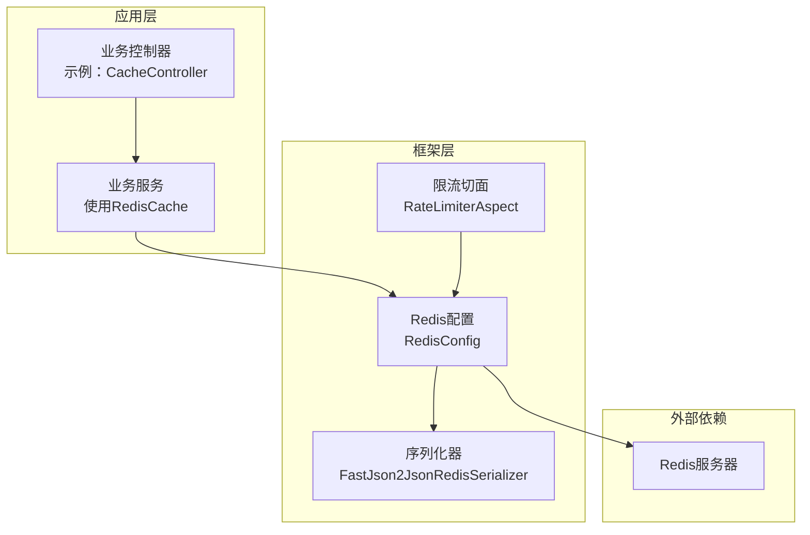
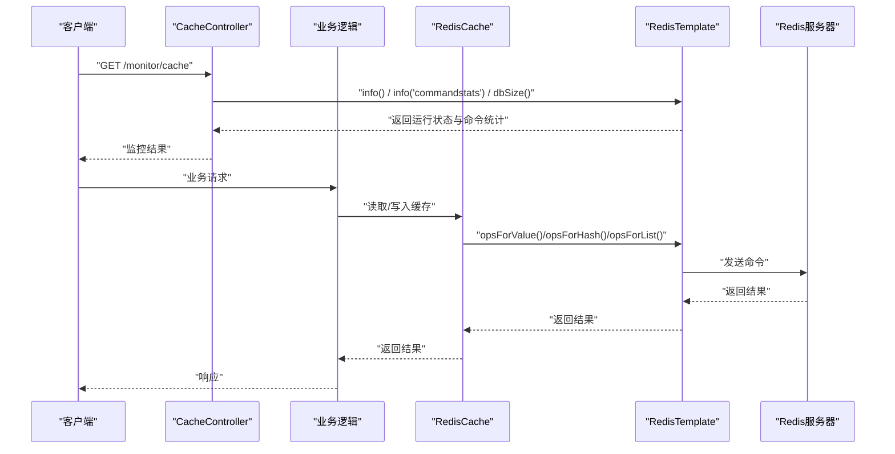
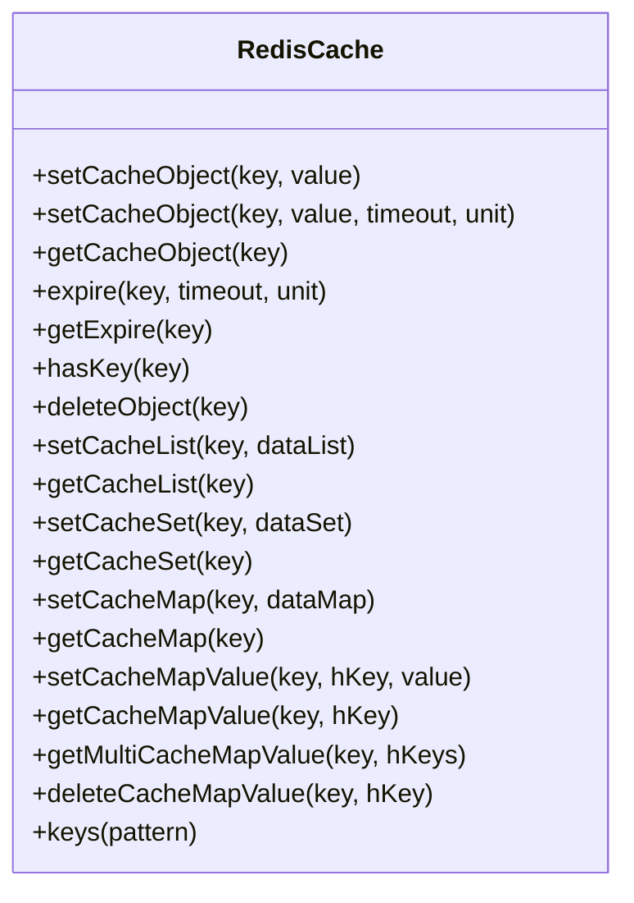
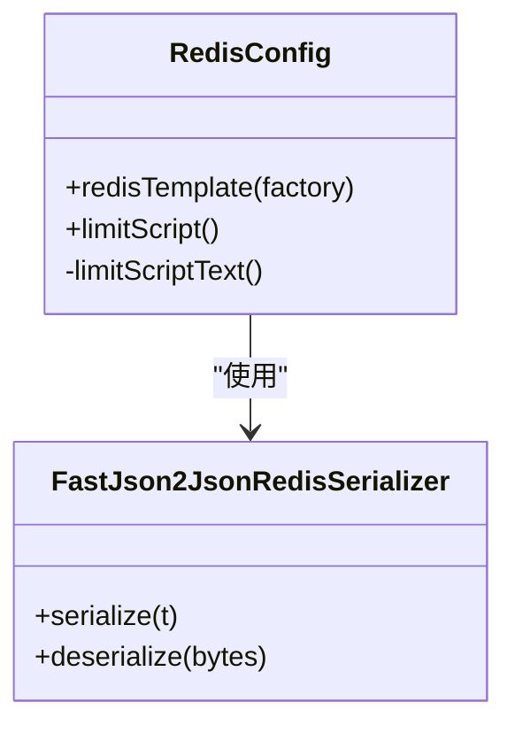
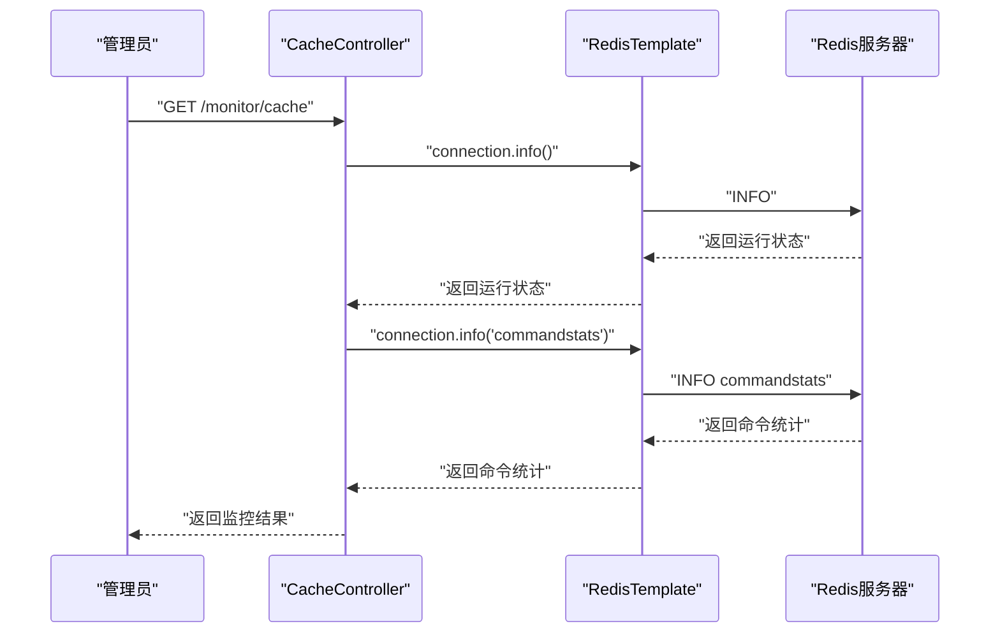
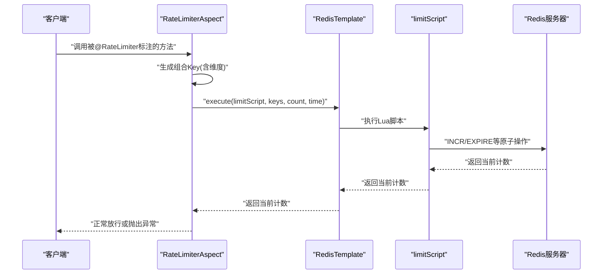
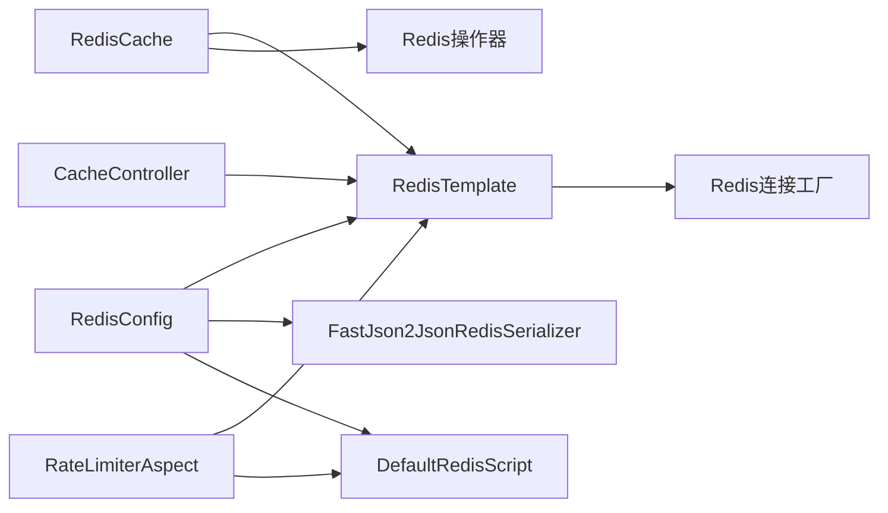

# 性能优化调优

<cite>
**本文引用的文件**
- [RedisCache.java](file://blog-common/src/main/java/blog/common/core/redis/RedisCache.java)
- [RedisConfig.java](file://blog-framework/src/main/java/blog/framework/config/RedisConfig.java)
- [CacheController.java](file://blog-admin/src/main/java/blog/web/controller/monitor/CacheController.java)
- [CacheConstants.java](file://blog-common/src/main/java/blog/common/constant/CacheConstants.java)
- [application.yml](file://blog-admin/src/main/resources/application.yml)
- [FastJson2JsonRedisSerializer.java](file://blog-framework/src/main/java/blog/framework/config/FastJson2JsonRedisSerializer.java)
- [RateLimiterAspect.java](file://blog-framework/src/main/java/blog/framework/aspectj/RateLimiterAspect.java)
- [RateLimiter.java](file://blog-common/src/main/java/blog/common/annotation/RateLimiter.java)
- [LimitType.java](file://blog-common/src/main/java/blog/common/enums/LimitType.java)
- [Constants.java](file://blog-common/src/main/java/blog/common/constant/Constants.java)
</cite>

## 目录
1. [简介](#简介)
2. [项目结构](#项目结构)
3. [核心组件](#核心组件)
4. [架构总览](#架构总览)
5. [详细组件分析](#详细组件分析)
6. [依赖关系分析](#依赖关系分析)
7. [性能考虑](#性能考虑)
8. [故障排查指南](#故障排查指南)
9. [结论](#结论)
10. [附录](#附录)

## 简介
本指南围绕Redis在本项目的实际使用场景，提供一套可落地的性能优化与调优实践，涵盖内存优化策略（数据类型选择、编码优化、内存碎片整理、内存淘汰策略）、网络优化方案（连接池、批量处理、延迟与带宽）、命令优化技巧（O(1)优先、避免大Key、Lua脚本批处理）、配置参数调优建议（maxmemory、hash-max-ziplist-entries、list-max-ziplist-size等）以及性能监控与诊断方法（INFO命令分析、慢查询日志、内存使用分析、网络延迟测量）。同时给出容量规划与扩容策略，确保系统在高并发场景下的稳定性能表现。

## 项目结构
本项目采用Spring Boot + Spring Data Redis + Lettuce客户端的典型后端架构，Redis主要用于：
- 缓存登录令牌、验证码、系统配置、字典、防重复提交、限流计数等
- 提供分布式限流能力（基于Lua脚本原子计数）
- 通过监控接口输出Redis运行状态与命令统计

图表来源
- [CacheController.java:31-117](file://blog-admin/src/main/java/blog/web/controller/monitor/CacheController.java#L31-L117)
- [RedisCache.java:24-247](file://blog-common/src/main/java/blog/common/core/redis/RedisCache.java#L24-L247)
- [RedisConfig.java:20-66](file://blog-framework/src/main/java/blog/framework/config/RedisConfig.java#L20-L66)
- [FastJson2JsonRedisSerializer.java:19-48](file://blog-framework/src/main/java/blog/framework/config/FastJson2JsonRedisSerializer.java#L19-L48)
- [RateLimiterAspect.java:30-78](file://blog-framework/src/main/java/blog/framework/aspectj/RateLimiterAspect.java#L30-L78)

章节来源
- [application.yml:65-89](file://blog-admin/src/main/resources/application.yml#L65-L89)
- [RedisConfig.java:20-66](file://blog-framework/src/main/java/blog/framework/config/RedisConfig.java#L20-L66)

## 核心组件
- RedisCache：封装常用Redis操作（字符串、List、Set、Hash），统一过期时间设置与批量写入，便于业务侧按需选择合适的数据结构与编码。
- RedisConfig：配置RedisTemplate序列化策略（key/value及hash key/value分别使用String与FastJSON），并注册限流Lua脚本。
- CacheController：提供Redis监控接口，支持INFO、DBSIZE、命令统计等，便于性能诊断。
- RateLimiterAspect + RateLimiter注解：基于Lua脚本的原子限流，结合IP或全局维度控制访问频率。
- CacheConstants：集中管理各类缓存Key前缀，便于统一清理与容量规划。

章节来源
- [RedisCache.java:24-247](file://blog-common/src/main/java/blog/common/core/redis/RedisCache.java#L24-L247)
- [RedisConfig.java:20-66](file://blog-framework/src/main/java/blog/framework/config/RedisConfig.java#L20-L66)
- [CacheController.java:31-117](file://blog-admin/src/main/java/blog/web/controller/monitor/CacheController.java#L31-L117)
- [RateLimiterAspect.java:30-78](file://blog-framework/src/main/java/blog/framework/aspectj/RateLimiterAspect.java#L30-L78)
- [CacheConstants.java:8-43](file://blog-common/src/main/java/blog/common/constant/CacheConstants.java#L8-L43)

## 架构总览
下图展示从控制器到Redis的调用链路，以及限流切面如何在方法执行前进行原子计数与限流判断。

图表来源
- [CacheController.java:50-71](file://blog-admin/src/main/java/blog/web/controller/monitor/CacheController.java#L50-L71)
- [RedisCache.java:99-102](file://blog-common/src/main/java/blog/common/core/redis/RedisCache.java#L99-L102)
- [RedisConfig.java:20-39](file://blog-framework/src/main/java/blog/framework/config/RedisConfig.java#L20-L39)

## 详细组件分析

### RedisCache 组件分析
- 设计要点
  - 面向业务的统一缓存入口，提供字符串、List、Set、Hash等常用操作，并支持设置过期时间。
  - 通过BoundSetOperations与批量写入减少网络往返，提高吞吐。
  - 支持按前缀keys扫描，便于运维与容量管理。
- 性能影响
  - 合理选择数据结构与编码（如哈希用于字段级更新，列表用于队列/分页）可显著降低内存占用与CPU开销。
  - 批量写入（如rightPushAll）可减少RTT，但需注意单次批量大小，避免阻塞。
- 优化建议
  - 对热点对象使用短过期时间，避免长期占用内存。
  - 对大对象拆分存储或采用压缩策略（需结合序列化器特性）。
  - 使用多字段哈希存储结构化数据，避免整体序列化带来的体积膨胀。

图表来源
- [RedisCache.java:24-247](file://blog-common/src/main/java/blog/common/core/redis/RedisCache.java#L24-L247)

章节来源
- [RedisCache.java:24-247](file://blog-common/src/main/java/blog/common/core/redis/RedisCache.java#L24-L247)

### RedisConfig 组件分析
- 设计要点
  - 使用StringRedisSerializer作为key序列化器，保证key可读性与一致性。
  - 使用FastJson2JsonRedisSerializer作为value序列化器，兼顾性能与安全性（白名单过滤）。
  - 注册DefaultRedisScript用于限流脚本，确保原子性。
- 性能影响
  - 序列化器直接影响网络传输大小与CPU消耗，FastJSON序列化通常优于默认JDK序列化。
  - Hash的key/value分别序列化，有利于复杂对象的字段级访问与更新。
- 优化建议
  - 在保证安全的前提下，尽量使用更紧凑的序列化格式（如二进制）以进一步降低带宽。
  - 对于高频写入的字段，优先使用Hash而非整体对象序列化，减少序列化成本。

图表来源
- [RedisConfig.java:20-66](file://blog-framework/src/main/java/blog/framework/config/RedisConfig.java#L20-L66)
- [FastJson2JsonRedisSerializer.java:19-48](file://blog-framework/src/main/java/blog/framework/config/FastJson2JsonRedisSerializer.java#L19-L48)

章节来源
- [RedisConfig.java:20-66](file://blog-framework/src/main/java/blog/framework/config/RedisConfig.java#L20-L66)
- [FastJson2JsonRedisSerializer.java:19-48](file://blog-framework/src/main/java/blog/framework/config/FastJson2JsonRedisSerializer.java#L19-L48)
- [Constants.java:158-166](file://blog-common/src/main/java/blog/common/constant/Constants.java#L158-L166)

### CacheController 组件分析
- 设计要点
  - 提供INFO、DBSIZE、命令统计等监控接口，便于快速定位热点命令与内存使用情况。
  - 提供缓存Key前缀管理与批量清理能力，支持按前缀清空缓存。
- 性能影响
  - INFO命令会带来额外的系统开销，应按需调用或定期采集。
  - keys模式匹配可能阻塞Redis，建议仅在运维场景使用，生产环境优先使用SCAN族命令。
- 优化建议
  - 将INFO与命令统计改为定时任务采集，避免每次请求都触发。
  - 对批量清理操作增加白名单与权限控制，防止误删。

图表来源
- [CacheController.java:50-71](file://blog-admin/src/main/java/blog/web/controller/monitor/CacheController.java#L50-L71)

章节来源
- [CacheController.java:31-117](file://blog-admin/src/main/java/blog/web/controller/monitor/CacheController.java#L31-L117)

### 限流组件分析（RateLimiterAspect + RateLimiter注解）
- 设计要点
  - 基于Lua脚本实现原子计数与过期控制，避免竞态条件。
  - 支持全局限流与按IP限流两种维度，结合Key前缀实现灵活策略。
- 性能影响
  - Lua脚本在Redis内部执行，避免多次往返，具备较高吞吐。
  - 计数key的过期时间应与窗口时间一致，避免内存泄漏。
- 优化建议
  - 对不同业务场景设置差异化窗口与阈值，避免过度限流。
  - 结合业务峰值流量进行压测，确定合理的count与time参数。

图表来源
- [RateLimiterAspect.java:47-65](file://blog-framework/src/main/java/blog/framework/aspectj/RateLimiterAspect.java#L47-L65)
- [RedisConfig.java:41-66](file://blog-framework/src/main/java/blog/framework/config/RedisConfig.java#L41-L66)
- [RateLimiter.java:20-40](file://blog-common/src/main/java/blog/common/annotation/RateLimiter.java#L20-L40)
- [LimitType.java:9-19](file://blog-common/src/main/java/blog/common/enums/LimitType.java#L9-L19)

章节来源
- [RateLimiterAspect.java:30-78](file://blog-framework/src/main/java/blog/framework/aspectj/RateLimiterAspect.java#L30-L78)
- [RateLimiter.java:20-40](file://blog-common/src/main/java/blog/common/annotation/RateLimiter.java#L20-L40)
- [LimitType.java:9-19](file://blog-common/src/main/java/blog/common/enums/LimitType.java#L9-L19)

### 缓存Key管理与容量规划
- CacheConstants集中定义了各类缓存Key前缀，便于统一管理与清理。
- 建议配合监控接口定期盘点Key分布，识别异常增长的前缀并制定清理策略。

章节来源
- [CacheConstants.java:8-43](file://blog-common/src/main/java/blog/common/constant/CacheConstants.java#L8-L43)
- [CacheController.java:74-84](file://blog-admin/src/main/java/blog/web/controller/monitor/CacheController.java#L74-L84)

## 依赖关系分析
- RedisCache依赖RedisTemplate提供的各种操作器（ValueOperations、HashOperations、ListOperations、SetOperations）。
- RedisConfig负责装配RedisTemplate与序列化器，并注册限流脚本。
- CacheController通过RedisTemplate直接调用底层连接执行INFO、DBSIZE等命令。
- RateLimiterAspect通过RedisTemplate执行Lua脚本，实现限流。

图表来源
- [RedisCache.java:24-247](file://blog-common/src/main/java/blog/common/core/redis/RedisCache.java#L24-L247)
- [RedisConfig.java:20-66](file://blog-framework/src/main/java/blog/framework/config/RedisConfig.java#L20-L66)
- [CacheController.java:34-35](file://blog-admin/src/main/java/blog/web/controller/monitor/CacheController.java#L34-L35)
- [RateLimiterAspect.java:33-45](file://blog-framework/src/main/java/blog/framework/aspectj/RateLimiterAspect.java#L33-L45)

章节来源
- [RedisCache.java:24-247](file://blog-common/src/main/java/blog/common/core/redis/RedisCache.java#L24-L247)
- [RedisConfig.java:20-66](file://blog-framework/src/main/java/blog/framework/config/RedisConfig.java#L20-L66)
- [CacheController.java:34-35](file://blog-admin/src/main/java/blog/web/controller/monitor/CacheController.java#L34-L35)
- [RateLimiterAspect.java:33-45](file://blog-framework/src/main/java/blog/framework/aspectj/RateLimiterAspect.java#L33-L45)

## 性能考虑

### 内存优化策略
- 数据类型选择
  - 热点字符串：使用字符串类型，避免不必要的序列化开销。
  - 结构化数据：使用哈希（Hash）存储字段，支持字段级更新与删除，减少整体序列化成本。
  - 列表/队列：使用列表（List）或有序集合（ZSet）实现队列与去重，避免频繁序列化。
  - 集合去重：使用集合（Set）实现唯一集合，避免重复存储。
- 编码优化
  - 利用Redis内部编码（如ziplist、intset等）在键值较小时自动压缩，减少内存占用。
  - 对于大对象，建议拆分存储或采用压缩策略（需结合序列化器特性）。
- 内存碎片整理
  - 定期执行BGREWRITEAOF或后台重写，减少碎片。
  - 对于热点Key，合理设置过期时间，避免长期占用内存。
- 内存淘汰策略
  - 根据业务特征选择合适的淘汰策略（如allkeys-lru），确保热点数据优先保留。
  - 对于只读场景，可考虑maxmemory-policy为volatile-ttl以优先淘汰即将过期的数据。

### 网络优化方案
- TCP连接优化
  - 使用连接池（Lettuce）复用连接，减少连接建立与销毁开销。
  - 合理设置连接池大小（max-active、max-idle、max-wait），避免阻塞与资源浪费。
- pipeline批量处理
  - 对于批量写入场景，使用pipeline减少RTT，提升吞吐。
  - 注意批量大小，避免单批次过大导致阻塞。
- 网络延迟与带宽
  - 将Redis部署在低延迟网络区域，减少跨机房/跨地域访问。
  - 使用更高效的序列化器（如FastJSON）降低网络传输大小。

### 命令优化技巧
- 优先使用O(1)命令：如GET/SET/HGET/HSET/MGET/MSET等，避免O(N)命令在大数据集上造成阻塞。
- 避免大Key操作：拆分大对象或采用分片存储，减少单次读写压力。
- 合理使用Lua脚本：将多步操作合并为原子脚本，减少网络往返与竞态风险。
- 批处理命令：使用MGET/MSET/DEL等批量命令，减少RTT。

### 配置参数调优建议
- maxmemory：根据业务峰值内存需求设置上限，预留一定余量。
- hash-max-ziplist-entries：对于Hash字段较少且值较小的场景，可适当增大以利用ziplist编码。
- list-max-ziplist-size：对于列表元素较少的场景，可增大以利用ziplist编码。
- 其他关键参数：hash-max-ziplist-value、list-max-ziplist-size、set-max-intset-entries等，均需结合业务数据规模与访问模式进行压测与调整。

### 性能监控与诊断
- INFO命令分析：通过监控接口定期采集INFO与commandstats，识别热点命令与内存使用趋势。
- 慢查询日志：结合业务场景开启慢查询日志，定位耗时命令并优化。
- 内存使用分析：关注used_memory、used_memory_rss、mem_fragmentation_ratio等指标，及时发现内存问题。
- 网络延迟测量：通过ping/latency测试与业务埋点，评估网络质量与Redis响应延迟。

### 容量规划与扩容策略
- 容量规划
  - 基于历史访问量与峰值流量估算内存与带宽需求，预留20%-30%冗余。
  - 对热点Key进行归档与降级，避免单点过载。
- 扩容策略
  - 垂直扩容：提升实例规格，增加CPU与内存。
  - 水平扩容：采用分片（如Redis Cluster）分散压力。
  - 缓存分层：引入本地缓存（如Caffeine）与远程Redis双层缓存，降低远端压力。

## 故障排查指南
- 监控接口
  - 通过监控接口获取INFO与DBSIZE，核对内存使用与连接数。
  - 分析命令统计，识别异常命令（如keys、flush等）。
- 限流异常
  - 当限流触发时，检查count与time参数是否合理，确认维度（全局/IP）是否符合预期。
  - 关注限流Key的过期时间，避免计数未过期导致误判。
- 序列化问题
  - 若出现反序列化异常，检查FastJSON白名单配置与对象版本兼容性。
- 连接池问题
  - 当出现连接池耗尽时，检查max-active与max-wait配置，必要时扩大池大小或优化业务逻辑。

章节来源
- [CacheController.java:50-71](file://blog-admin/src/main/java/blog/web/controller/monitor/CacheController.java#L50-L71)
- [RateLimiterAspect.java:47-65](file://blog-framework/src/main/java/blog/framework/aspectj/RateLimiterAspect.java#L47-L65)
- [FastJson2JsonRedisSerializer.java:31-47](file://blog-framework/src/main/java/blog/framework/config/FastJson2JsonRedisSerializer.java#L31-L47)
- [application.yml:79-88](file://blog-admin/src/main/resources/application.yml#L79-L88)

## 结论
通过合理的数据结构选择、编码优化、连接池配置与Lua脚本限流，结合持续的监控与容量规划，可以在高并发场景下显著提升Redis的稳定性与性能。建议在生产环境中以压测为依据，逐步微调各项参数，形成适合自身业务的最优配置组合。

## 附录
- Redis配置参考（基于项目中的连接池配置）
  - 连接池参数：min-idle、max-idle、max-active、max-wait
  - 超时设置：timeout
  - 数据库索引：database
  - 密码与主机：host、port、password

章节来源
- [application.yml:65-89](file://blog-admin/src/main/resources/application.yml#L65-L89)