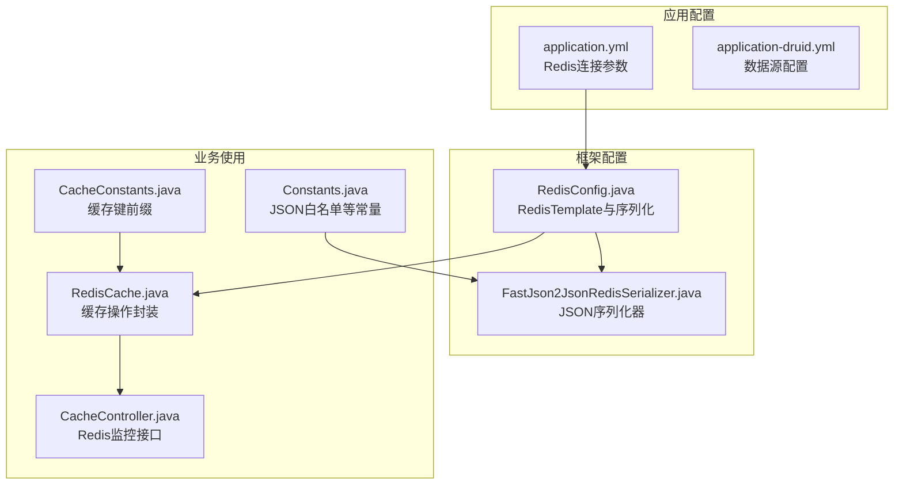
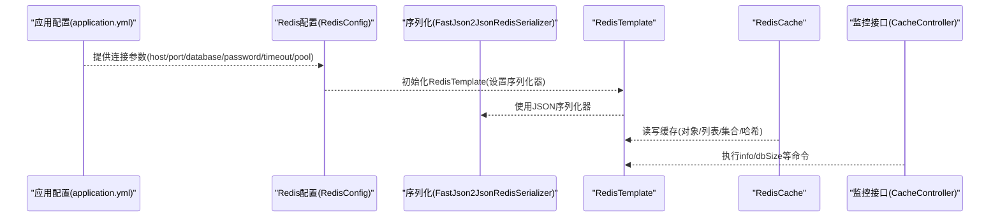
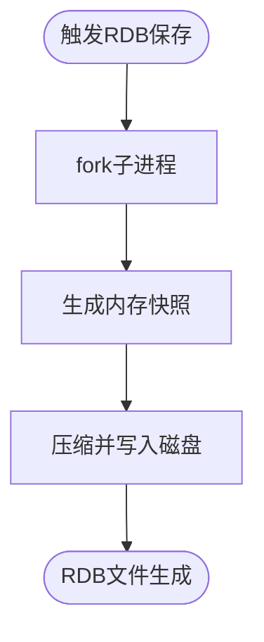
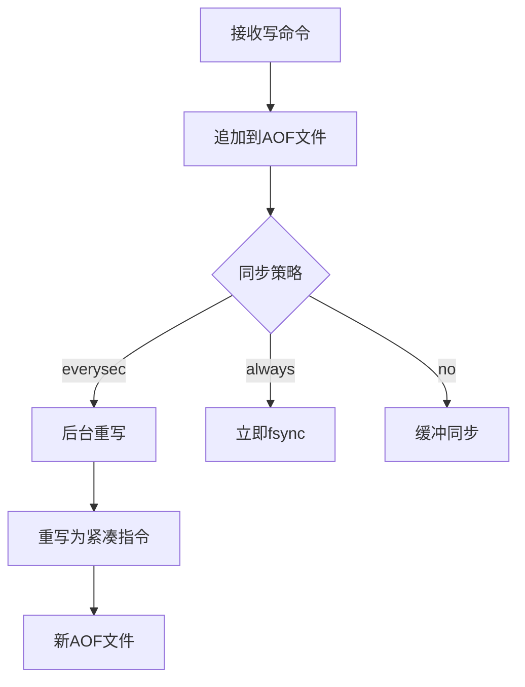
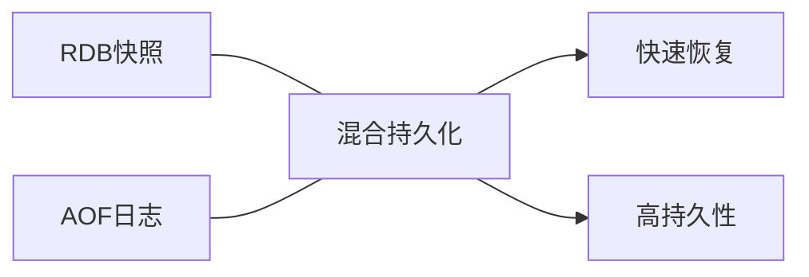
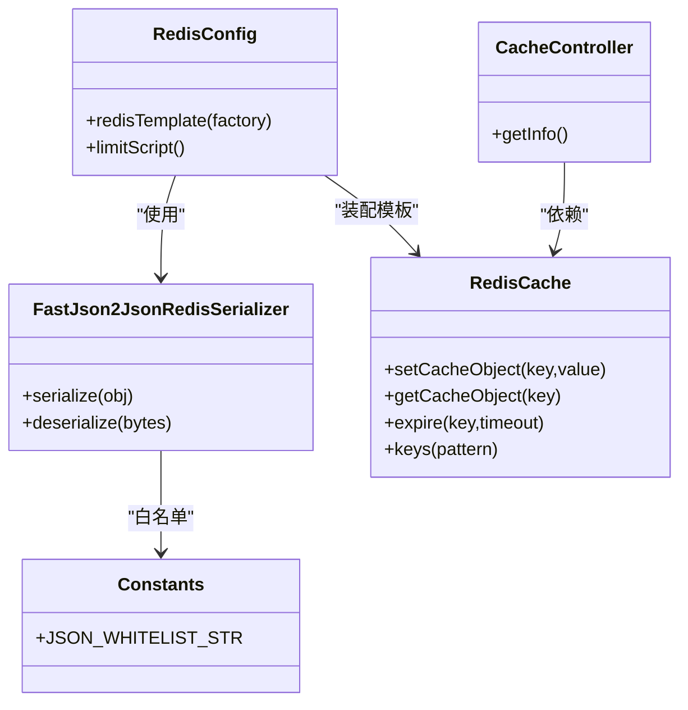

# 数据持久化策略

<cite>
**本文引用的文件**
- [application.yml](file://blog-admin/src/main/resources/application.yml)
- [application-druid.yml](file://blog-admin/src/main/resources/application-druid.yml)
- [RedisConfig.java](file://blog-framework/src/main/java/blog/framework/config/RedisConfig.java)
- [FastJson2JsonRedisSerializer.java](file://blog-framework/src/main/java/blog/framework/config/FastJson2JsonRedisSerializer.java)
- [RedisCache.java](file://blog-common/src/main/java/blog/common/core/redis/RedisCache.java)
- [CacheController.java](file://blog-admin/src/main/java/blog/web/controller/monitor/CacheController.java)
- [CacheConstants.java](file://blog-common/src/main/java/blog/common/constant/CacheConstants.java)
- [Constants.java](file://blog-common/src/main/java/blog/common/constant/Constants.java)
</cite>

## 目录
1. [简介](#简介)
2. [项目结构](#项目结构)
3. [核心组件](#核心组件)
4. [架构概览](#架构概览)
5. [详细组件分析](#详细组件分析)
6. [依赖关系分析](#依赖关系分析)
7. [性能考量](#性能考量)
8. [故障排查指南](#故障排查指南)
9. [结论](#结论)
10. [附录](#附录)

## 简介
本指南围绕Redis数据持久化策略展开，结合代码库中现有的Redis配置与使用现状，系统梳理RDB快照与AOF日志两种持久化机制的原理、实现要点与优化建议，并给出混合持久化的适用场景与实践建议。同时，基于项目中已有的Redis连接、序列化与监控能力，提供可落地的配置优化思路与运维保障方案。

## 项目结构
本项目通过Spring Boot整合Redis，关键位置如下：
- Redis连接与序列化配置：位于框架层的RedisConfig与FastJson2JsonRedisSerializer
- Redis工具封装：位于公共模块的RedisCache
- Redis监控接口：位于管理端的CacheController
- Redis连接参数：位于应用配置文件application.yml
- 缓存键命名规范：位于CacheConstants
- JSON白名单与常量：位于Constants

图表来源
- [application.yml:65-89](file://blog-admin/src/main/resources/application.yml#L65-L89)
- [RedisConfig.java:21-39](file://blog-framework/src/main/java/blog/framework/config/RedisConfig.java#L21-L39)
- [FastJson2JsonRedisSerializer.java:19-48](file://blog-framework/src/main/java/blog/framework/config/FastJson2JsonRedisSerializer.java#L19-L48)
- [RedisCache.java:24-26](file://blog-common/src/main/java/blog/common/core/redis/RedisCache.java#L24-L26)
- [CacheController.java:52-55](file://blog-admin/src/main/java/blog/web/controller/monitor/CacheController.java#L52-L55)
- [CacheConstants.java:8-43](file://blog-common/src/main/java/blog/common/constant/CacheConstants.java#L8-L43)
- [Constants.java:159-161](file://blog-common/src/main/java/blog/common/constant/Constants.java#L159-L161)

章节来源
- [application.yml:65-89](file://blog-admin/src/main/resources/application.yml#L65-L89)
- [RedisConfig.java:21-39](file://blog-framework/src/main/java/blog/framework/config/RedisConfig.java#L21-L39)
- [RedisCache.java:24-26](file://blog-common/src/main/java/blog/common/core/redis/RedisCache.java#L24-L26)
- [CacheController.java:52-55](file://blog-admin/src/main/java/blog/web/controller/monitor/CacheController.java#L52-L55)
- [CacheConstants.java:8-43](file://blog-common/src/main/java/blog/common/constant/CacheConstants.java#L8-L43)
- [Constants.java:159-161](file://blog-common/src/main/java/blog/common/constant/Constants.java#L159-L161)

## 核心组件
- Redis连接与序列化配置
  - RedisConfig负责装配RedisTemplate，设置Key/HashKey的字符串序列化与Value/HashValue的JSON序列化，便于跨语言与跨系统读取。
  - FastJson2JsonRedisSerializer通过白名单过滤提升反序列化安全性。
- Redis工具封装
  - RedisCache提供常用缓存操作（对象、列表、集合、哈希、过期控制等），统一键空间管理。
- Redis监控接口
  - CacheController通过Redis回调执行info/dbSize等命令，用于监控Redis状态与容量。
- 缓存键命名规范
  - CacheConstants集中定义了登录、验证码、配置、字典、防重提交、限流、密码错误计数等键前缀，便于运维检索与清理。
- 应用配置
  - application.yml中定义了Redis主机、端口、数据库、密码、连接超时与连接池参数，为持久化策略提供运行环境基础。

章节来源
- [RedisConfig.java:21-39](file://blog-framework/src/main/java/blog/framework/config/RedisConfig.java#L21-L39)
- [FastJson2JsonRedisSerializer.java:19-48](file://blog-framework/src/main/java/blog/framework/config/FastJson2JsonRedisSerializer.java#L19-L48)
- [RedisCache.java:24-247](file://blog-common/src/main/java/blog/common/core/redis/RedisCache.java#L24-L247)
- [CacheController.java:52-112](file://blog-admin/src/main/java/blog/web/controller/monitor/CacheController.java#L52-L112)
- [CacheConstants.java:8-43](file://blog-common/src/main/java/blog/common/constant/CacheConstants.java#L8-L43)
- [application.yml:65-89](file://blog-admin/src/main/resources/application.yml#L65-L89)

## 架构概览
下图展示Redis在本项目中的整体使用路径：应用配置驱动连接建立，框架层完成序列化策略，业务层通过RedisCache进行数据读写，监控层通过CacheController获取Redis状态。

图表来源
- [application.yml:65-89](file://blog-admin/src/main/resources/application.yml#L65-L89)
- [RedisConfig.java:21-39](file://blog-framework/src/main/java/blog/framework/config/RedisConfig.java#L21-L39)
- [FastJson2JsonRedisSerializer.java:19-48](file://blog-framework/src/main/java/blog/framework/config/FastJson2JsonRedisSerializer.java#L19-L48)
- [RedisCache.java:24-247](file://blog-common/src/main/java/blog/common/core/redis/RedisCache.java#L24-L247)
- [CacheController.java:52-55](file://blog-admin/src/main/java/blog/web/controller/monitor/CacheController.java#L52-L55)

## 详细组件分析

### RDB快照持久化机制分析
- fork子进程与内存快照
  - RDB通过fork子进程进行快照生成，避免主线程阻塞。项目未直接暴露RDB配置项，需在Redis服务端进行配置（例如save策略）。
  - 代码层面可通过监控接口获取info输出，观察lastsave、rdb_*相关指标，间接评估RDB快照状态。
- 文件压缩与加载速度
  - RDB文件采用压缩存储，加载时由Redis主进程反序列化恢复。项目中JSON序列化器保证跨语言兼容，但RDB文件本身由Redis内部处理。
- 与项目集成点
  - 可通过CacheController的info命令输出，结合外部监控系统对RDB快照时间、文件大小、加载耗时等指标进行观测。

图表来源
- [CacheController.java:52-55](file://blog-admin/src/main/java/blog/web/controller/monitor/CacheController.java#L52-L55)

章节来源
- [CacheController.java:52-55](file://blog-admin/src/main/java/blog/web/controller/monitor/CacheController.java#L52-L55)

### AOF日志持久化原理
- 命令写入与同步策略
  - AOF将写命令追加到文件末尾，支持always/everysec/no三种同步策略。项目未直接暴露AOF配置项，需在Redis服务端配置。
- 重写机制
  - AOF重写通过读取当前内存数据集，重写为更紧凑的指令序列，减少文件体积。项目中未涉及AOF重写触发参数配置。
- 文件恢复
  - 启动时按顺序执行AOF文件中的命令进行数据恢复。项目中JSON序列化器确保对象数据可被正确序列化与反序列化。

图表来源
- [RedisCache.java:24-247](file://blog-common/src/main/java/blog/common/core/redis/RedisCache.java#L24-L247)

章节来源
- [RedisCache.java:24-247](file://blog-common/src/main/java/blog/common/core/redis/RedisCache.java#L24-L247)

### 混合持久化方案（RDB+AOF）
- 优势
  - 结合RDB的快速恢复与AOF的高持久性，兼顾恢复效率与数据安全。
  - 在项目中，可通过RDB快速恢复业务数据，配合AOF的细粒度日志实现更短RPO。
- 适用场景
  - 对数据一致性要求较高且能接受一定I/O开销的业务；或需要快速冷启动恢复的场景。
- 与项目集成点
  - 项目中RedisCache与监控接口可用于观测RDB/AOF状态，辅助运维决策。

图表来源
- [CacheController.java:52-55](file://blog-admin/src/main/java/blog/web/controller/monitor/CacheController.java#L52-L55)
- [RedisCache.java:24-247](file://blog-common/src/main/java/blog/common/core/redis/RedisCache.java#L24-L247)

### 持久化配置优化建议
- RDB save策略
  - 在Redis服务端配置合适的save策略，平衡快照频率与磁盘I/O。项目中可通过监控接口观察lastsave与rdb_changes_since_last_save等指标。
- AOF重写参数
  - auto-aof-rewrite-percentage与aof-rewrite-min-size用于触发AOF重写，降低文件膨胀。项目中未直接暴露这些参数，需在Redis服务端配置。
- 序列化与键空间
  - 项目已采用JSON序列化器并设置白名单，有助于安全与兼容性。建议结合CacheConstants的键前缀规范，定期清理过期键，降低AOF体积。

章节来源
- [CacheController.java:52-55](file://blog-admin/src/main/java/blog/web/controller/monitor/CacheController.java#L52-L55)
- [FastJson2JsonRedisSerializer.java:19-48](file://blog-framework/src/main/java/blog/framework/config/FastJson2JsonRedisSerializer.java#L19-L48)
- [CacheConstants.java:8-43](file://blog-common/src/main/java/blog/common/constant/CacheConstants.java#L8-L43)

### 性能影响与权衡
- 磁盘I/O开销
  - RDB快照期间fork与写盘可能产生短暂I/O峰值；AOF每秒同步策略在一致性和I/O之间折中。
- 内存占用
  - AOF文件随写入增长，需结合重写策略控制体积；RDB快照会复制内存镜像，注意峰值内存。
- 恢复时间
  - RDB恢复通常更快；AOF恢复取决于日志长度，但可实现更精细的恢复点。

章节来源
- [application.yml:65-89](file://blog-admin/src/main/resources/application.yml#L65-L89)
- [CacheController.java:52-55](file://blog-admin/src/main/java/blog/web/controller/monitor/CacheController.java#L52-L55)

### 备份与灾难恢复
- 备份策略
  - 定期导出RDB快照并异地存储；监控AOF文件变化，必要时进行归档。
- 灾难恢复
  - 使用最近RDB进行快速恢复，再回放AOF增量；通过CacheController确认dbSize与info指标，验证数据完整性。
- 运维保障
  - 结合CacheConstants的键前缀，制定清理与巡检计划；利用RedisConfig的序列化配置，确保不同版本升级时的数据兼容性。

章节来源
- [CacheController.java:52-112](file://blog-admin/src/main/java/blog/web/controller/monitor/CacheController.java#L52-L112)
- [CacheConstants.java:8-43](file://blog-common/src/main/java/blog/common/constant/CacheConstants.java#L8-L43)
- [RedisConfig.java:21-39](file://blog-framework/src/main/java/blog/framework/config/RedisConfig.java#L21-L39)

## 依赖关系分析
- 组件耦合
  - RedisConfig与FastJson2JsonRedisSerializer共同决定序列化策略；RedisCache依赖RedisTemplate提供统一缓存操作；CacheController依赖RedisTemplate进行监控。
- 外部依赖
  - Redis服务端负责实际的持久化实现（RDB/AOF），应用侧通过配置与监控进行协同。

图表来源
- [RedisConfig.java:21-39](file://blog-framework/src/main/java/blog/framework/config/RedisConfig.java#L21-L39)
- [FastJson2JsonRedisSerializer.java:19-48](file://blog-framework/src/main/java/blog/framework/config/FastJson2JsonRedisSerializer.java#L19-L48)
- [RedisCache.java:24-247](file://blog-common/src/main/java/blog/common/core/redis/RedisCache.java#L24-L247)
- [CacheController.java:52-55](file://blog-admin/src/main/java/blog/web/controller/monitor/CacheController.java#L52-L55)
- [Constants.java:159-161](file://blog-common/src/main/java/blog/common/constant/Constants.java#L159-L161)

章节来源
- [RedisConfig.java:21-39](file://blog-framework/src/main/java/blog/framework/config/RedisConfig.java#L21-L39)
- [FastJson2JsonRedisSerializer.java:19-48](file://blog-framework/src/main/java/blog/framework/config/FastJson2JsonRedisSerializer.java#L19-L48)
- [RedisCache.java:24-247](file://blog-common/src/main/java/blog/common/core/redis/RedisCache.java#L24-L247)
- [CacheController.java:52-55](file://blog-admin/src/main/java/blog/web/controller/monitor/CacheController.java#L52-L55)
- [Constants.java:159-161](file://blog-common/src/main/java/blog/common/constant/Constants.java#L159-L161)

## 性能考量
- I/O与CPU权衡
  - RDB快照在fork阶段可能短暂阻塞；AOF每秒同步在一致性和性能间取得平衡。项目中可通过监控接口观察负载变化。
- 内存与磁盘
  - AOF文件膨胀需定期重写；RDB快照会复制内存，注意峰值内存占用。
- 恢复效率
  - RDB恢复更快，适合快速上线；AOF恢复更精确，适合高一致性场景。

章节来源
- [application.yml:65-89](file://blog-admin/src/main/resources/application.yml#L65-L89)
- [CacheController.java:52-55](file://blog-admin/src/main/java/blog/web/controller/monitor/CacheController.java#L52-L55)

## 故障排查指南
- 快照异常
  - 通过CacheController的info命令检查lastsave、rdb_changes_since_last_save等指标，定位快照是否正常。
- AOF问题
  - 观察AOF文件大小与重写状态；结合auto-aof-rewrite-percentage与aof-rewrite-min-size的配置进行调整。
- 序列化异常
  - 检查FastJson2JsonRedisSerializer的白名单配置与对象类型，确保JSON序列化与反序列化一致。
- 键空间清理
  - 使用CacheConstants的键前缀，结合RedisCache的keys与删除接口，定期清理过期键，降低AOF体积。

章节来源
- [CacheController.java:52-112](file://blog-admin/src/main/java/blog/web/controller/monitor/CacheController.java#L52-L112)
- [FastJson2JsonRedisSerializer.java:19-48](file://blog-framework/src/main/java/blog/framework/config/FastJson2JsonRedisSerializer.java#L19-L48)
- [CacheConstants.java:8-43](file://blog-common/src/main/java/blog/common/constant/CacheConstants.java#L8-L43)
- [RedisCache.java:244-247](file://blog-common/src/main/java/blog/common/core/redis/RedisCache.java#L244-L247)

## 结论
本项目通过RedisConfig与FastJson2JsonRedisSerializer构建了清晰的序列化策略，借助RedisCache与CacheController实现了对Redis状态与数据的统一管理与监控。针对持久化策略，建议在Redis服务端完善RDB/AOF配置与重写策略，结合项目中的监控与键空间管理，实现高效、安全、可恢复的数据持久化体系。

## 附录
- Redis连接参数参考
  - 主机、端口、数据库、密码、连接超时与连接池参数均在application.yml中配置，为持久化策略提供运行环境基础。
- JSON白名单
  - Constants中定义了JSON自动类型白名单，确保反序列化安全。

章节来源
- [application.yml:65-89](file://blog-admin/src/main/resources/application.yml#L65-L89)
- [Constants.java:159-161](file://blog-common/src/main/java/blog/common/constant/Constants.java#L159-L161)