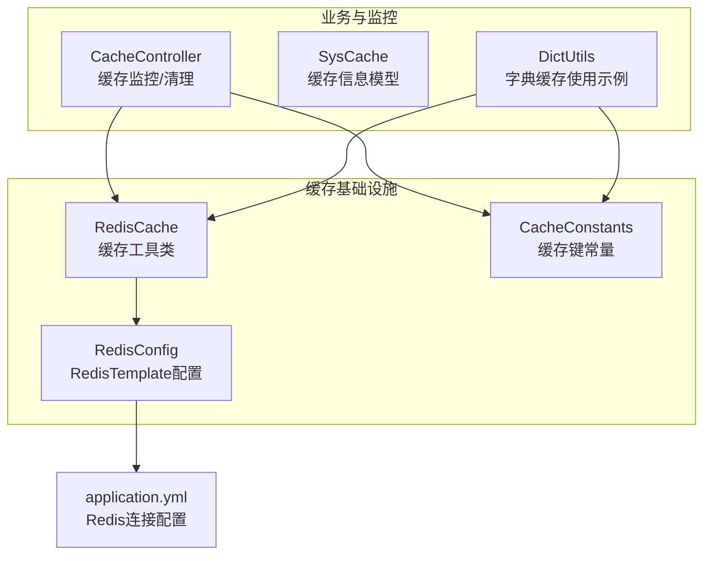
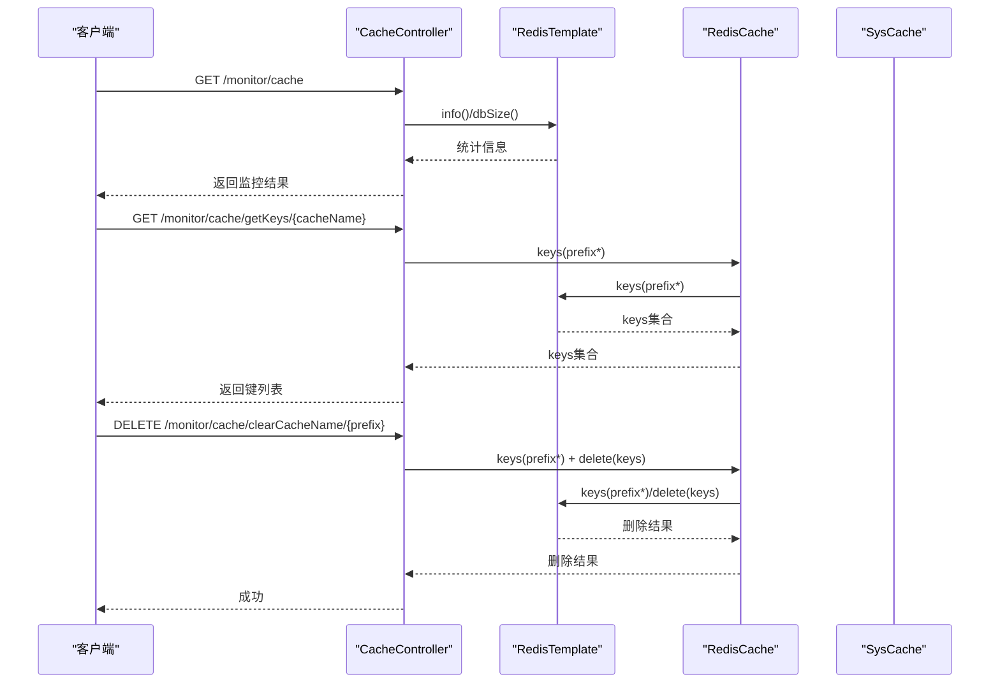
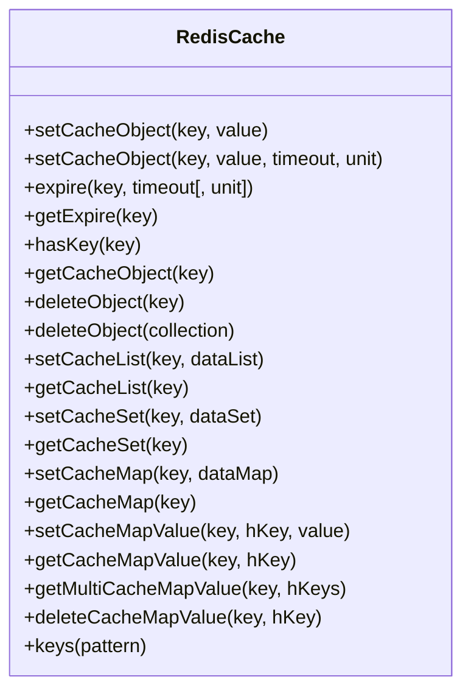
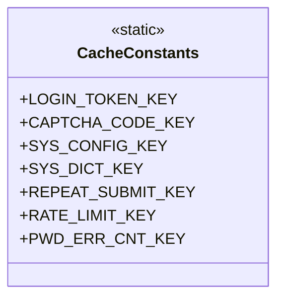
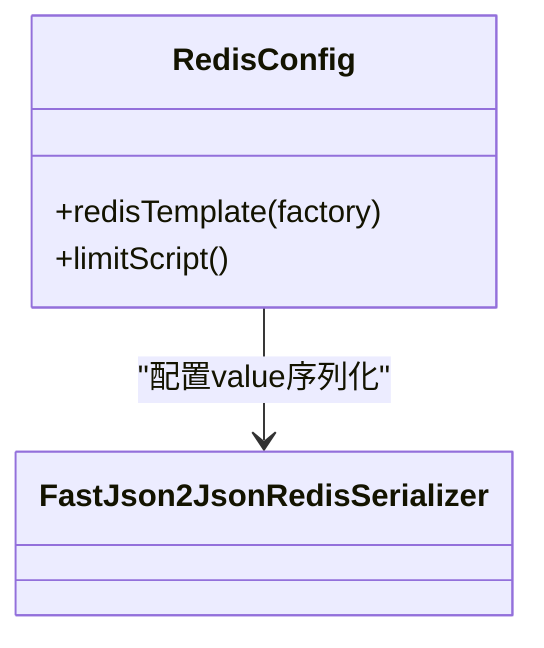
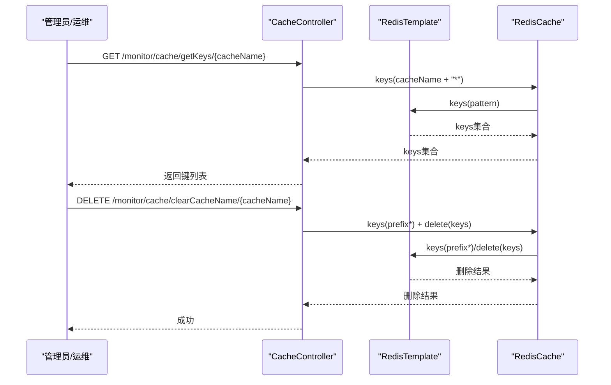
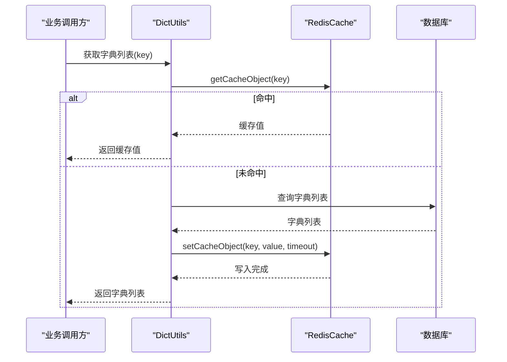
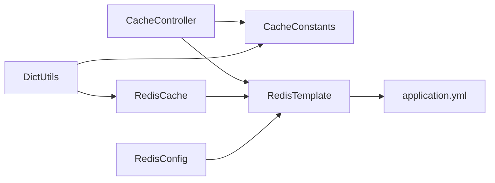

# 缓存一致性保障

<cite>
**本文引用的文件**
- [RedisCache.java](file://blog-common/src/main/java/blog/common/core/redis/RedisCache.java)
- [CacheConstants.java](file://blog-common/src/main/java/blog/common/constant/CacheConstants.java)
- [RedisConfig.java](file://blog-framework/src/main/java/blog/framework/config/RedisConfig.java)
- [CacheController.java](file://blog-admin/src/main/java/blog/web/controller/monitor/CacheController.java)
- [SysCache.java](file://blog-system/src/main/java/blog/system/domain/SysCache.java)
- [application.yml](file://blog-admin/src/main/resources/application.yml)
- [application-druid.yml](file://blog-admin/src/main/resources/application-druid.yml)
- [DictUtils.java](file://blog-common/src/main/java/blog/common/utils/DictUtils.java)
</cite>

## 目录
1. [简介](#简介)
2. [项目结构](#项目结构)
3. [核心组件](#核心组件)
4. [架构总览](#架构总览)
5. [详细组件分析](#详细组件分析)
6. [依赖分析](#依赖分析)
7. [性能考量](#性能考量)
8. [故障排查指南](#故障排查指南)
9. [结论](#结论)
10. [附录](#附录)

## 简介
本文件围绕“缓存一致性保障”目标，结合代码库现有缓存实现与监控能力，系统化梳理缓存更新策略、失效策略、穿透防护、雪崩预防、预热与批量更新、一致性测试与监控指标等关键技术方案。当前代码库已具备基于 Redis 的基础缓存工具类、统一的缓存键常量、Redis 序列化配置以及缓存监控与清理能力，可在此基础上扩展实现更完善的强一致或最终一致策略。

## 项目结构
- 缓存基础设施：RedisTemplate、序列化配置、工具类
- 缓存键规范：统一的缓存 key 前缀常量
- 缓存监控：缓存信息采集、按命名/键清理
- 业务使用示例：字典缓存读写与批量清理

图表来源
- [RedisCache.java:1-248](file://blog-common/src/main/java/blog/common/core/redis/RedisCache.java#L1-L248)
- [RedisConfig.java:1-67](file://blog-framework/src/main/java/blog/framework/config/RedisConfig.java#L1-L67)
- [CacheConstants.java:1-44](file://blog-common/src/main/java/blog/common/constant/CacheConstants.java#L1-L44)
- [CacheController.java:1-116](file://blog-admin/src/main/java/blog/web/controller/monitor/CacheController.java#L1-L116)
- [SysCache.java:1-77](file://blog-system/src/main/java/blog/system/domain/SysCache.java#L1-L77)
- [application.yml:64-89](file://blog-admin/src/main/resources/application.yml#L64-L89)

章节来源
- [RedisCache.java:1-248](file://blog-common/src/main/java/blog/common/core/redis/RedisCache.java#L1-L248)
- [RedisConfig.java:1-67](file://blog-framework/src/main/java/blog/framework/config/RedisConfig.java#L1-L67)
- [CacheConstants.java:1-44](file://blog-common/src/main/java/blog/common/constant/CacheConstants.java#L1-L44)
- [CacheController.java:1-116](file://blog-admin/src/main/java/blog/web/controller/monitor/CacheController.java#L1-L116)
- [SysCache.java:1-77](file://blog-system/src/main/java/blog/system/domain/SysCache.java#L1-L77)
- [application.yml:64-89](file://blog-admin/src/main/resources/application.yml#L64-L89)

## 核心组件
- RedisCache：封装常用缓存操作（对象、List、Set、Hash），支持设置过期时间、批量删除、键匹配等。
- CacheConstants：集中定义各类缓存键前缀，便于统一管理与清理。
- RedisConfig：配置 RedisTemplate 的序列化策略（key/value 及 hash key/value），启用 Spring Cache。
- CacheController：提供缓存监控与清理接口，支持按命名前缀、具体键、全量清理。
- SysCache：缓存信息展示模型，用于前端展示与调试。
- DictUtils：业务侧使用 RedisCache 的示例，体现缓存读写与批量清理。

章节来源
- [RedisCache.java:24-247](file://blog-common/src/main/java/blog/common/core/redis/RedisCache.java#L24-L247)
- [CacheConstants.java:8-43](file://blog-common/src/main/java/blog/common/constant/CacheConstants.java#L8-L43)
- [RedisConfig.java:20-39](file://blog-framework/src/main/java/blog/framework/config/RedisConfig.java#L20-L39)
- [CacheController.java:34-116](file://blog-admin/src/main/java/blog/web/controller/monitor/CacheController.java#L34-L116)
- [SysCache.java:10-77](file://blog-system/src/main/java/blog/system/domain/SysCache.java#L10-L77)
- [DictUtils.java:29](file://blog-common/src/main/java/blog/common/utils/DictUtils.java#L29)

## 架构总览
下图展示缓存读写与监控的关键交互路径，体现“工具类-配置-控制器-模型”的协作关系。

图表来源
- [CacheController.java:50-116](file://blog-admin/src/main/java/blog/web/controller/monitor/CacheController.java#L50-L116)
- [RedisCache.java:244-246](file://blog-common/src/main/java/blog/common/core/redis/RedisCache.java#L244-L246)

## 详细组件分析

### 缓存工具类 RedisCache
- 功能要点
  - 基础对象缓存：支持带过期时间与不带过期时间两种写入方式。
  - 过期时间设置与查询：提供 expire/getExpire。
  - 键存在性判断：hasKey。
  - 删除：单键删除与批量删除。
  - 容器类缓存：List/Set/Hash 的读写与批量读取。
  - 键匹配：keys(pattern)。
- 一致性策略映射
  - 直写式更新：写入新值后立即设置过期时间，保证缓存与数据库的写入顺序。
  - 回写式更新：通过延迟过期或异步刷新策略，适合热点数据的后台刷新。
  - 失效式更新：删除对应键，读请求未命中时回源数据库并写入新值。
- 适用场景
  - 直写式：对一致性要求高且写入频率适中的场景。
  - 回写式：对读性能敏感、可容忍短暂不一致的场景。
  - 失效式：批量更新或广播式变更，避免逐条更新带来的开销。

图表来源
- [RedisCache.java:24-247](file://blog-common/src/main/java/blog/common/core/redis/RedisCache.java#L24-L247)

章节来源
- [RedisCache.java:28-121](file://blog-common/src/main/java/blog/common/core/redis/RedisCache.java#L28-L121)
- [RedisCache.java:130-143](file://blog-common/src/main/java/blog/common/core/redis/RedisCache.java#L130-L143)
- [RedisCache.java:152-169](file://blog-common/src/main/java/blog/common/core/redis/RedisCache.java#L152-L169)
- [RedisCache.java:177-236](file://blog-common/src/main/java/blog/common/core/redis/RedisCache.java#L177-L236)
- [RedisCache.java:244-246](file://blog-common/src/main/java/blog/common/core/redis/RedisCache.java#L244-L246)

### 缓存键常量 CacheConstants
- 作用：集中管理各类缓存键前缀，便于统一命名、清理与监控。
- 关键点：登录令牌、验证码、系统配置、字典、防重提交、限流、密码错误次数等。
- 一致性策略映射
  - 命名前缀统一：便于按业务域进行失效式批量清理。
  - 前缀+业务主键：减少键冲突，提升定位与清理效率。

图表来源
- [CacheConstants.java:8-43](file://blog-common/src/main/java/blog/common/constant/CacheConstants.java#L8-L43)

章节来源
- [CacheConstants.java:12-42](file://blog-common/src/main/java/blog/common/constant/CacheConstants.java#L12-L42)

### Redis 配置 RedisConfig
- 作用：配置 RedisTemplate 的序列化策略，启用 Spring Cache 注解。
- 关键点：key/value 使用 StringRedisSerializer，hash key/value 使用自定义 JSON 序列化。
- 一致性策略映射
  - 序列化一致性：确保跨组件读写一致，避免因序列化差异导致的解析异常。
  - 脚本支持：提供限流脚本，可用于实现原子性的限流与缓存控制。

图表来源
- [RedisConfig.java:20-39](file://blog-framework/src/main/java/blog/framework/config/RedisConfig.java#L20-L39)
- [RedisConfig.java:42-65](file://blog-framework/src/main/java/blog/framework/config/RedisConfig.java#L42-L65)

章节来源
- [RedisConfig.java:21-39](file://blog-framework/src/main/java/blog/framework/config/RedisConfig.java#L21-L39)
- [RedisConfig.java:42-65](file://blog-framework/src/main/java/blog/framework/config/RedisConfig.java#L42-L65)

### 缓存监控与清理 CacheController
- 功能：获取 Redis 信息、统计命令执行情况、列出缓存键、按前缀/键清理。
- 一致性策略映射
  - 主动失效：提供按前缀批量清理接口，快速恢复一致性。
  - 被动失效：结合业务写入时删除对应键，读未命中再回源写入。
  - 超时失效：配合 Redis 过期时间策略，避免陈旧数据长期驻留。

图表来源
- [CacheController.java:74-116](file://blog-admin/src/main/java/blog/web/controller/monitor/CacheController.java#L74-L116)
- [RedisCache.java:244-246](file://blog-common/src/main/java/blog/common/core/redis/RedisCache.java#L244-L246)

章节来源
- [CacheController.java:50-116](file://blog-admin/src/main/java/blog/web/controller/monitor/CacheController.java#L50-L116)
- [SysCache.java:40-44](file://blog-system/src/main/java/blog/system/domain/SysCache.java#L40-L44)

### 业务侧使用示例：字典缓存 DictUtils
- 读写流程：先查缓存，未命中则回源数据库，再写入缓存并设置过期时间。
- 批量清理：按前缀批量删除，确保字典变更后的一致性。
- 一致性策略映射
  - 直写式更新：写入新值并设置过期时间。
  - 失效式更新：删除旧键，读未命中时回源并写入。

图表来源
- [DictUtils.java:29](file://blog-common/src/main/java/blog/common/utils/DictUtils.java#L29)
- [DictUtils.java:39](file://blog-common/src/main/java/blog/common/utils/DictUtils.java#L39)
- [DictUtils.java:182](file://blog-common/src/main/java/blog/common/utils/DictUtils.java#L182)
- [DictUtils.java:189](file://blog-common/src/main/java/blog/common/utils/DictUtils.java#L189)
- [DictUtils.java:190](file://blog-common/src/main/java/blog/common/utils/DictUtils.java#L190)

章节来源
- [DictUtils.java:29](file://blog-common/src/main/java/blog/common/utils/DictUtils.java#L29)
- [DictUtils.java:39](file://blog-common/src/main/java/blog/common/utils/DictUtils.java#L39)
- [DictUtils.java:182](file://blog-common/src/main/java/blog/common/utils/DictUtils.java#L182)
- [DictUtils.java:189](file://blog-common/src/main/java/blog/common/utils/DictUtils.java#L189)
- [DictUtils.java:190](file://blog-common/src/main/java/blog/common/utils/DictUtils.java#L190)

## 依赖分析
- 组件耦合
  - CacheController 依赖 RedisTemplate 与 CacheConstants。
  - RedisCache 依赖 RedisTemplate。
  - DictUtils 依赖 RedisCache 与 CacheConstants。
- 外部依赖
  - Redis 连接配置来自 application.yml。
  - RedisTemplate 序列化配置来自 RedisConfig。

图表来源
- [CacheController.java:34-47](file://blog-admin/src/main/java/blog/web/controller/monitor/CacheController.java#L34-L47)
- [RedisCache.java:25-26](file://blog-common/src/main/java/blog/common/core/redis/RedisCache.java#L25-L26)
- [DictUtils.java:29](file://blog-common/src/main/java/blog/common/utils/DictUtils.java#L29)
- [RedisConfig.java:23-39](file://blog-framework/src/main/java/blog/framework/config/RedisConfig.java#L23-L39)
- [application.yml:64-89](file://blog-admin/src/main/resources/application.yml#L64-L89)

章节来源
- [CacheController.java:34-47](file://blog-admin/src/main/java/blog/web/controller/monitor/CacheController.java#L34-L47)
- [RedisCache.java:25-26](file://blog-common/src/main/java/blog/common/core/redis/RedisCache.java#L25-L26)
- [DictUtils.java:29](file://blog-common/src/main/java/blog/common/utils/DictUtils.java#L29)
- [RedisConfig.java:23-39](file://blog-framework/src/main/java/blog/framework/config/RedisConfig.java#L23-L39)
- [application.yml:64-89](file://blog-admin/src/main/resources/application.yml#L64-L89)

## 性能考量
- 序列化与内存
  - 使用 StringRedisSerializer 作为 key/value 序列化，降低内存占用与序列化开销。
  - Hash 的 value 使用 JSON 序列化，注意对象大小与层级，避免过大对象导致内存压力。
- 过期时间设计
  - 为不同业务设置合理的 TTL，避免过短导致频繁回源，过长导致陈旧数据滞留。
- 批量操作
  - 使用 keys(pattern) 与批量删除时注意性能影响，建议在低峰期执行或分批处理。
- 连接池配置
  - application.yml 中配置了 lettuce 连接池参数，需结合实际并发与延迟需求调整。

章节来源
- [RedisConfig.java:27-35](file://blog-framework/src/main/java/blog/framework/config/RedisConfig.java#L27-L35)
- [application.yml:78-88](file://blog-admin/src/main/resources/application.yml#L78-L88)

## 故障排查指南
- 常见问题
  - 缓存未命中：检查键前缀是否正确、TTL 是否过期、序列化是否一致。
  - 清理无效：确认前缀是否匹配、是否有权限删除对应键。
  - 过期时间异常：核对 expire/setCacheObject 的时间单位与数值。
- 排查步骤
  - 使用监控接口查看 Redis 命令统计与数据库大小。
  - 使用 getKeys 列出前缀匹配的键，确认是否存在。
  - 使用 getValue 获取具体键值，辅助定位。
  - 使用 clearCacheName/clearCacheKey/clearCacheAll 执行清理，观察效果。
- 相关接口
  - GET /monitor/cache
  - GET /monitor/cache/getKeys/{cacheName}
  - GET /monitor/cache/getValue/{cacheName}/{cacheKey}
  - DELETE /monitor/cache/clearCacheName/{cacheName}
  - DELETE /monitor/cache/clearCacheKey/{cacheKey}
  - DELETE /monitor/cache/clearCacheAll

章节来源
- [CacheController.java:50-116](file://blog-admin/src/main/java/blog/web/controller/monitor/CacheController.java#L50-L116)
- [SysCache.java:40-44](file://blog-system/src/main/java/blog/system/domain/SysCache.java#L40-L44)

## 结论
当前代码库提供了完善的 Redis 基础设施与缓存监控能力，能够支撑多种一致性策略的落地实施。建议在现有基础上补充：
- 分布式锁与事务性更新：用于强一致场景下的双写一致性保障。
- 版本控制与 CAS：在热点数据更新中避免覆盖写。
- 缓存穿透防护：布隆过滤器、空值缓存、接口校验。
- 缓存雪崩预防：过期时间随机化、降级策略、熔断机制。
- 缓存预热与批量更新：系统启动与大规模变更时的稳定性保障。
- 一致性测试与监控指标：埋点与告警，持续优化缓存策略。

## 附录

### 缓存更新策略与实现映射
- 直写式更新
  - 实现：写入新值并设置过期时间。
  - 适用：对一致性要求高、写入频率适中。
  - 参考：RedisCache 的对象写入与过期设置。
- 回写式更新
  - 实现：延迟过期或异步刷新，后台任务定期更新。
  - 适用：读多写少、可容忍短暂不一致。
  - 参考：RedisCache 的 keys 批量清理与 expire。
- 失效式更新
  - 实现：删除对应键，读未命中时回源并写入。
  - 适用：批量更新或广播式变更。
  - 参考：CacheController 的按前缀清理与 DictUtils 的批量删除。

章节来源
- [RedisCache.java:34-48](file://blog-common/src/main/java/blog/common/core/redis/RedisCache.java#L34-L48)
- [RedisCache.java:57-71](file://blog-common/src/main/java/blog/common/core/redis/RedisCache.java#L57-L71)
- [CacheController.java:95-115](file://blog-admin/src/main/java/blog/web/controller/monitor/CacheController.java#L95-L115)
- [DictUtils.java:189](file://blog-common/src/main/java/blog/common/utils/DictUtils.java#L189)
- [DictUtils.java:190](file://blog-common/src/main/java/blog/common/utils/DictUtils.java#L190)

### 缓存失效策略设计与配置
- 主动失效
  - 设计：提供按前缀批量清理接口，支持定时任务触发。
  - 配置：CacheController 的清理接口与 CacheConstants 的前缀。
- 被动失效
  - 设计：业务写入时删除对应键，读未命中回源并写入。
  - 配置：RedisCache 的 deleteObject 与 keys。
- 超时失效
  - 设计：为不同业务设置合理 TTL，避免陈旧数据滞留。
  - 配置：RedisConfig 的序列化与 application.yml 的连接参数。

章节来源
- [CacheController.java:95-115](file://blog-admin/src/main/java/blog/web/controller/monitor/CacheController.java#L95-L115)
- [RedisCache.java:109-121](file://blog-common/src/main/java/blog/common/core/redis/RedisCache.java#L109-L121)
- [RedisCache.java:244-246](file://blog-common/src/main/java/blog/common/core/redis/RedisCache.java#L244-L246)
- [application.yml:78-88](file://blog-admin/src/main/resources/application.yml#L78-L88)

### 双写一致性保障方案
- 分布式锁实现
  - 方案：使用 Redis SET key value NX EX ttl 原子操作实现互斥写。
  - 适用：同一业务主键的并发写入保护。
- 事务性更新
  - 方案：Redis MULTI/EXEC 或 Lua 脚本保证多命令原子性。
  - 适用：缓存与数据库的联动更新。
- 版本控制
  - 方案：在缓存值中携带版本号，写入时比较版本，避免覆盖写。
  - 适用：热点数据的并发更新。

章节来源
- [RedisConfig.java:42-65](file://blog-framework/src/main/java/blog/framework/config/RedisConfig.java#L42-L65)

### 缓存穿透防护机制
- 布隆过滤器
  - 方案：在写入数据库的同时写入布隆过滤器，查询前先判断是否存在。
  - 适用：高并发读取不存在键的场景。
- 空值缓存
  - 方案：对空结果也进行缓存，并设置较短 TTL。
  - 适用：避免对不存在键的重复回源。
- 接口校验
  - 方案：对输入参数进行合法性校验，拒绝明显异常请求。
  - 适用：防止恶意或异常请求打穿缓存。

章节来源
- [CacheConstants.java:12-42](file://blog-common/src/main/java/blog/common/constant/CacheConstants.java#L12-L42)

### 缓存雪崩预防方案
- 过期时间随机化
  - 方案：在统一 TTL 基础上增加随机抖动，避免同时过期。
  - 适用：大量热点键的集中过期场景。
- 降级策略
  - 方案：在缓存不可用时返回兜底数据或提示。
  - 适用：缓存服务异常时的应急处理。
- 熔断机制
  - 方案：对缓存访问失败率进行监控，超过阈值时熔断一段时间。
  - 适用：缓存依赖不稳定时的自我保护。

章节来源
- [application.yml:78-88](file://blog-admin/src/main/resources/application.yml#L78-L88)

### 缓存预热与批量更新
- 缓存预热
  - 方案：系统启动时加载热点数据到缓存，设置较长 TTL。
  - 适用：启动阶段的性能稳定。
- 批量更新
  - 方案：使用 keys(pattern) + 批量删除 + 重建缓存。
  - 适用：大规模数据变更后的快速恢复。

章节来源
- [CacheController.java:95-115](file://blog-admin/src/main/java/blog/web/controller/monitor/CacheController.java#L95-L115)
- [DictUtils.java:189](file://blog-common/src/main/java/blog/common/utils/DictUtils.java#L189)
- [DictUtils.java:190](file://blog-common/src/main/java/blog/common/utils/DictUtils.java#L190)

### 一致性测试方法与监控指标
- 一致性测试
  - 方法：并发写入 + 读取验证、TTL 验证、批量清理验证。
  - 工具：压测工具 + 监控接口。
- 监控指标
  - 指标：命中率、过期率、内存使用、命令耗时、连接池状态。
  - 来源：CacheController 的 info/dbSize/commandStats。

章节来源
- [CacheController.java:50-71](file://blog-admin/src/main/java/blog/web/controller/monitor/CacheController.java#L50-L71)