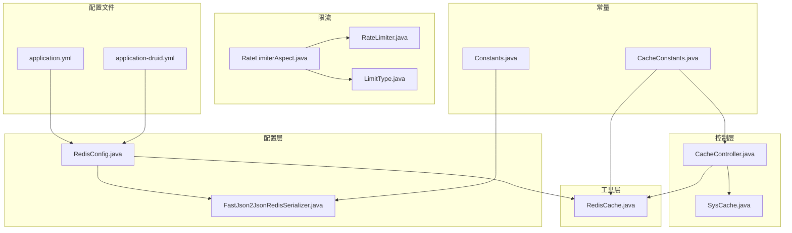
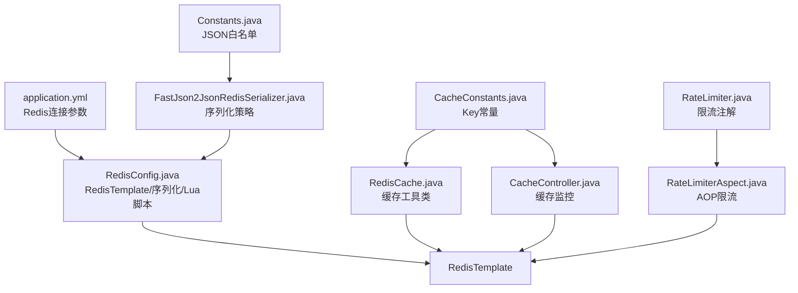
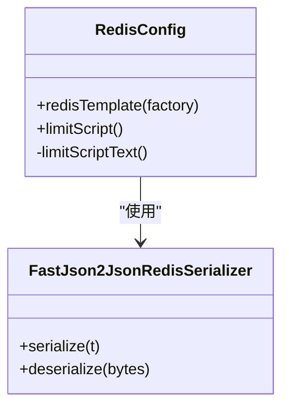
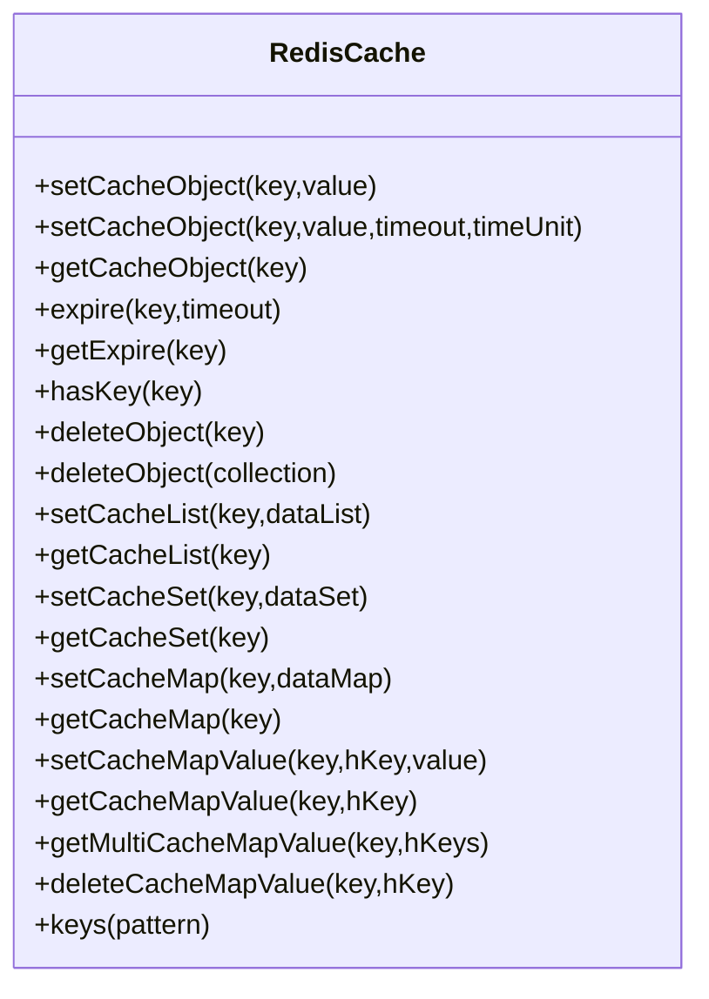
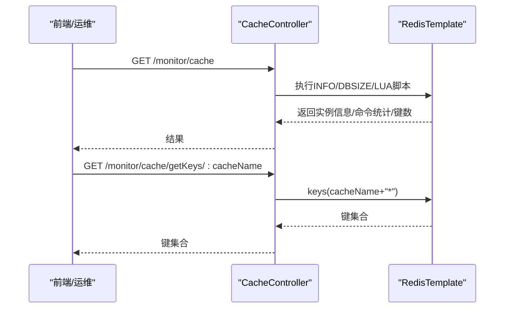
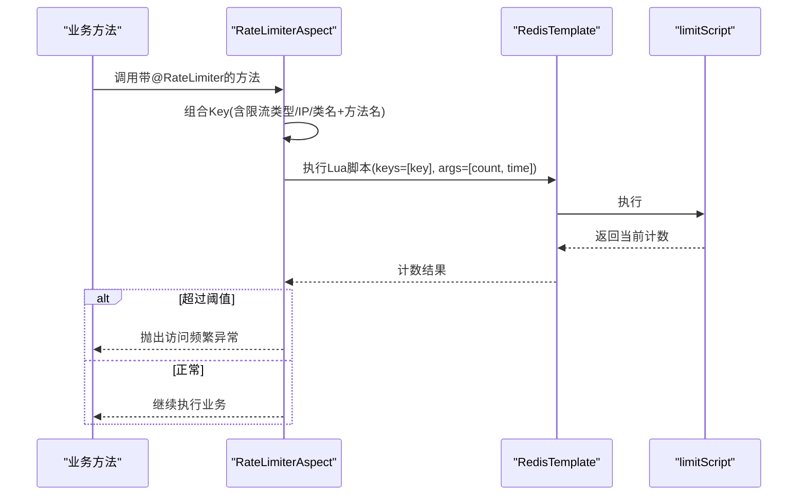
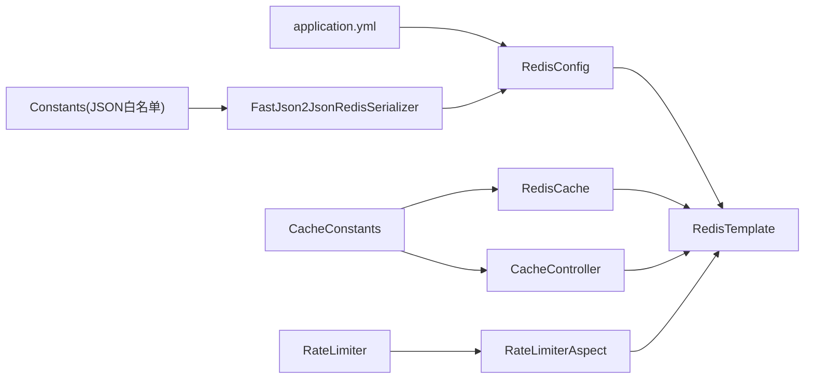
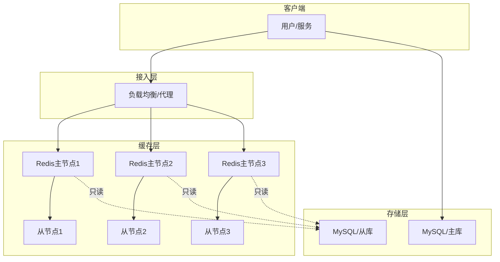
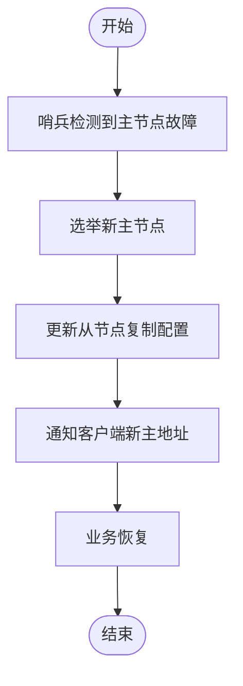

# 缓存高可用

<cite>
**本文引用的文件**
- [application.yml](file://blog-admin/src/main/resources/application.yml)
- [application-druid.yml](file://blog-admin/src/main/resources/application-druid.yml)
- [RedisConfig.java](file://blog-framework/src/main/java/blog/framework/config/RedisConfig.java)
- [FastJson2JsonRedisSerializer.java](file://blog-framework/src/main/java/blog/framework/config/FastJson2JsonRedisSerializer.java)
- [RedisCache.java](file://blog-common/src/main/java/blog/common/core/redis/RedisCache.java)
- [CacheConstants.java](file://blog-common/src/main/java/blog/common/constant/CacheConstants.java)
- [CacheController.java](file://blog-admin/src/main/java/blog/web/controller/monitor/CacheController.java)
- [SysCache.java](file://blog-system/src/main/java/blog/system/domain/SysCache.java)
- [RateLimiterAspect.java](file://blog-framework/src/main/java/blog/framework/aspectj/RateLimiterAspect.java)
- [RateLimiter.java](file://blog-common/src/main/java/blog/common/annotation/RateLimiter.java)
- [LimitType.java](file://blog-common/src/main/java/blog/common/enums/LimitType.java)
- [Constants.java](file://blog-common/src/main/java/blog/common/constant/Constants.java)
</cite>

## 目录
1. [简介](#简介)
2. [项目结构](#项目结构)
3. [核心组件](#核心组件)
4. [架构总览](#架构总览)
5. [详细组件分析](#详细组件分析)
6. [依赖分析](#依赖分析)
7. [性能考虑](#性能考虑)
8. [故障排查指南](#故障排查指南)
9. [结论](#结论)
10. [附录](#附录)

## 简介
本指南围绕“缓存高可用”主题，结合代码库现状，系统梳理Redis在本项目中的配置与使用方式，并给出面向高并发、高可用的部署与运维建议。当前代码库已具备以下能力：
- Redis连接与模板配置
- Redis序列化策略（FastJSON2）
- 缓存工具类封装
- 缓存监控接口
- 基于Lua脚本的限流切面
- 限流注解与限流类型枚举

针对“Redis集群部署、哨兵模式、持久化策略、一致性保障、性能优化、高可用架构与故障恢复”等主题，本指南将区分“代码现状”与“可扩展建议”，帮助读者在现有基础上进一步完善高可用方案。

## 项目结构
本项目的缓存相关能力主要分布在如下模块与文件：
- 配置层：Redis连接、序列化器、限流脚本
- 工具层：RedisTemplate封装的缓存操作
- 控制层：缓存监控接口
- 注解与切面：限流注解与AOP切面
- 常量层：缓存Key命名规范

**图表来源**
- [RedisConfig.java:17-66](file://blog-framework/src/main/java/blog/framework/config/RedisConfig.java#L17-L66)
- [FastJson2JsonRedisSerializer.java:14-48](file://blog-framework/src/main/java/blog/framework/config/FastJson2JsonRedisSerializer.java#L14-L48)
- [RedisCache.java:17-247](file://blog-common/src/main/java/blog/common/core/redis/RedisCache.java#L17-L247)
- [CacheController.java:26-116](file://blog-admin/src/main/java/blog/web/controller/monitor/CacheController.java#L26-L116)
- [SysCache.java:5-77](file://blog-system/src/main/java/blog/system/domain/SysCache.java#L5-L77)
- [RateLimiterAspect.java:23-78](file://blog-framework/src/main/java/blog/framework/aspectj/RateLimiterAspect.java#L23-L78)
- [RateLimiter.java:12-40](file://blog-common/src/main/java/blog/common/annotation/RateLimiter.java#L12-L40)
- [LimitType.java:9-19](file://blog-common/src/main/java/blog/common/enums/LimitType.java#L9-L19)
- [CacheConstants.java:8-43](file://blog-common/src/main/java/blog/common/constant/CacheConstants.java#L8-L43)
- [Constants.java:159-161](file://blog-common/src/main/java/blog/common/constant/Constants.java#L159-L161)
- [application.yml:64-89](file://blog-admin/src/main/resources/application.yml#L64-L89)
- [application-druid.yml:1-61](file://blog-admin/src/main/resources/application-druid.yml#L1-L61)

**章节来源**
- [application.yml:64-89](file://blog-admin/src/main/resources/application.yml#L64-L89)
- [application-druid.yml:1-61](file://blog-admin/src/main/resources/application-druid.yml#L1-L61)
- [RedisConfig.java:17-66](file://blog-framework/src/main/java/blog/framework/config/RedisConfig.java#L17-L66)
- [FastJson2JsonRedisSerializer.java:14-48](file://blog-framework/src/main/java/blog/framework/config/FastJson2JsonRedisSerializer.java#L14-L48)
- [RedisCache.java:17-247](file://blog-common/src/main/java/blog/common/core/redis/RedisCache.java#L17-L247)
- [CacheController.java:26-116](file://blog-admin/src/main/java/blog/web/controller/monitor/CacheController.java#L26-L116)
- [SysCache.java:5-77](file://blog-system/src/main/java/blog/system/domain/SysCache.java#L5-L77)
- [RateLimiterAspect.java:23-78](file://blog-framework/src/main/java/blog/framework/aspectj/RateLimiterAspect.java#L23-L78)
- [RateLimiter.java:12-40](file://blog-common/src/main/java/blog/common/annotation/RateLimiter.java#L12-L40)
- [LimitType.java:9-19](file://blog-common/src/main/java/blog/common/enums/LimitType.java#L9-L19)
- [CacheConstants.java:8-43](file://blog-common/src/main/java/blog/common/constant/CacheConstants.java#L8-L43)
- [Constants.java:159-161](file://blog-common/src/main/java/blog/common/constant/Constants.java#L159-L161)

## 核心组件
- Redis连接与模板配置：负责连接工厂、序列化策略、限流脚本注册。
- Redis序列化器：基于FastJSON2，启用类名写入与白名单过滤，提升安全性与兼容性。
- Redis工具类：对RedisTemplate进行封装，提供对象、List、Set、Hash等常用操作及过期时间管理。
- 缓存监控接口：提供Redis实例信息、命令统计、键空间查询与清理等运维能力。
- 限流注解与切面：通过Lua脚本实现原子计数与过期控制，支持全局与按IP限流。
- 缓存Key常量：统一管理各类业务缓存Key前缀，便于运维与清理。

**章节来源**
- [RedisConfig.java:17-66](file://blog-framework/src/main/java/blog/framework/config/RedisConfig.java#L17-L66)
- [FastJson2JsonRedisSerializer.java:14-48](file://blog-framework/src/main/java/blog/framework/config/FastJson2JsonRedisSerializer.java#L14-L48)
- [RedisCache.java:24-247](file://blog-common/src/main/java/blog/common/core/redis/RedisCache.java#L24-L247)
- [CacheController.java:31-116](file://blog-admin/src/main/java/blog/web/controller/monitor/CacheController.java#L31-L116)
- [RateLimiterAspect.java:23-78](file://blog-framework/src/main/java/blog/framework/aspectj/RateLimiterAspect.java#L23-L78)
- [RateLimiter.java:12-40](file://blog-common/src/main/java/blog/common/annotation/RateLimiter.java#L12-L40)
- [CacheConstants.java:8-43](file://blog-common/src/main/java/blog/common/constant/CacheConstants.java#L8-L43)

## 架构总览
下图展示缓存子系统的组成与交互关系，以及与配置文件的关系映射。

**图表来源**
- [application.yml:64-89](file://blog-admin/src/main/resources/application.yml#L64-L89)
- [RedisConfig.java:17-66](file://blog-framework/src/main/java/blog/framework/config/RedisConfig.java#L17-L66)
- [FastJson2JsonRedisSerializer.java:14-48](file://blog-framework/src/main/java/blog/framework/config/FastJson2JsonRedisSerializer.java#L14-L48)
- [RedisCache.java:24-247](file://blog-common/src/main/java/blog/common/core/redis/RedisCache.java#L24-L247)
- [CacheController.java:31-116](file://blog-admin/src/main/java/blog/web/controller/monitor/CacheController.java#L31-L116)
- [RateLimiterAspect.java:23-78](file://blog-framework/src/main/java/blog/framework/aspectj/RateLimiterAspect.java#L23-L78)
- [RateLimiter.java:12-40](file://blog-common/src/main/java/blog/common/annotation/RateLimiter.java#L12-L40)
- [CacheConstants.java:8-43](file://blog-common/src/main/java/blog/common/constant/CacheConstants.java#L8-L43)
- [Constants.java:159-161](file://blog-common/src/main/java/blog/common/constant/Constants.java#L159-L161)

## 详细组件分析

### Redis连接与模板配置
- 连接参数来源于配置文件，包括主机、端口、数据库、密码、超时与连接池参数。
- RedisTemplate采用StringRedisSerializer作为key序列化器，值序列化器为FastJSON2，Hash结构同样应用相应序列化策略。
- 注册默认Lua脚本用于限流，脚本实现原子计数与过期控制。

**图表来源**
- [RedisConfig.java:17-66](file://blog-framework/src/main/java/blog/framework/config/RedisConfig.java#L17-L66)
- [FastJson2JsonRedisSerializer.java:14-48](file://blog-framework/src/main/java/blog/framework/config/FastJson2JsonRedisSerializer.java#L14-L48)

**章节来源**
- [application.yml:64-89](file://blog-admin/src/main/resources/application.yml#L64-L89)
- [RedisConfig.java:17-66](file://blog-framework/src/main/java/blog/framework/config/RedisConfig.java#L17-L66)
- [FastJson2JsonRedisSerializer.java:14-48](file://blog-framework/src/main/java/blog/framework/config/FastJson2JsonRedisSerializer.java#L14-L48)
- [Constants.java:159-161](file://blog-common/src/main/java/blog/common/constant/Constants.java#L159-L161)

### Redis工具类封装
- 提供对象、List、Set、Hash等多类型缓存操作。
- 支持设置过期时间、查询剩余时间、判断Key存在性、批量删除等。
- 统一通过RedisTemplate执行，避免直接操作底层连接。

**图表来源**
- [RedisCache.java:24-247](file://blog-common/src/main/java/blog/common/core/redis/RedisCache.java#L24-L247)

**章节来源**
- [RedisCache.java:24-247](file://blog-common/src/main/java/blog/common/core/redis/RedisCache.java#L24-L247)
- [CacheConstants.java:8-43](file://blog-common/src/main/java/blog/common/constant/CacheConstants.java#L8-L43)

### 缓存监控接口
- 提供Redis实例信息、命令统计、数据库大小查询。
- 支持按缓存名称前缀查询键集合、读取键值、按名称或键清理缓存。

**图表来源**
- [CacheController.java:31-116](file://blog-admin/src/main/java/blog/web/controller/monitor/CacheController.java#L31-L116)
- [RedisCache.java:24-247](file://blog-common/src/main/java/blog/common/core/redis/RedisCache.java#L24-L247)

**章节来源**
- [CacheController.java:31-116](file://blog-admin/src/main/java/blog/web/controller/monitor/CacheController.java#L31-L116)
- [SysCache.java:5-77](file://blog-system/src/main/java/blog/system/domain/SysCache.java#L5-L77)
- [CacheConstants.java:8-43](file://blog-common/src/main/java/blog/common/constant/CacheConstants.java#L8-L43)

### 限流注解与AOP切面
- 限流注解支持指定时间窗口、最大次数与限流类型（全局/按IP）。
- AOP切面在目标方法执行前计算组合Key，调用Lua脚本进行原子计数与过期控制，超过阈值抛出业务异常。

**图表来源**
- [RateLimiterAspect.java:23-78](file://blog-framework/src/main/java/blog/framework/aspectj/RateLimiterAspect.java#L23-L78)
- [RateLimiter.java:12-40](file://blog-common/src/main/java/blog/common/annotation/RateLimiter.java#L12-L40)
- [LimitType.java:9-19](file://blog-common/src/main/java/blog/common/enums/LimitType.java#L9-L19)
- [RedisConfig.java:41-66](file://blog-framework/src/main/java/blog/framework/config/RedisConfig.java#L41-L66)

**章节来源**
- [RateLimiterAspect.java:23-78](file://blog-framework/src/main/java/blog/framework/aspectj/RateLimiterAspect.java#L23-L78)
- [RateLimiter.java:12-40](file://blog-common/src/main/java/blog/common/annotation/RateLimiter.java#L12-L40)
- [LimitType.java:9-19](file://blog-common/src/main/java/blog/common/enums/LimitType.java#L9-L19)
- [RedisConfig.java:41-66](file://blog-framework/src/main/java/blog/framework/config/RedisConfig.java#L41-L66)

### 缓存Key常量与命名规范
- 统一的Key前缀便于运维检索与清理，涵盖登录令牌、验证码、系统配置、字典、防重提交、限流、密码错误次数等。
- 建议在新增业务时遵循前缀命名，避免冲突与误删。

**章节来源**
- [CacheConstants.java:8-43](file://blog-common/src/main/java/blog/common/constant/CacheConstants.java#L8-L43)

## 依赖分析
- RedisConfig依赖FastJson2序列化器与配置文件中的连接参数。
- RedisCache依赖RedisTemplate，提供高层缓存操作。
- CacheController依赖RedisTemplate与缓存常量，提供运维接口。
- RateLimiterAspect依赖RedisTemplate与Lua脚本，配合注解完成限流。
- FastJson2序列化器依赖Constants中的JSON白名单，增强安全性。

**图表来源**
- [application.yml:64-89](file://blog-admin/src/main/resources/application.yml#L64-L89)
- [RedisConfig.java:17-66](file://blog-framework/src/main/java/blog/framework/config/RedisConfig.java#L17-L66)
- [FastJson2JsonRedisSerializer.java:14-48](file://blog-framework/src/main/java/blog/framework/config/FastJson2JsonRedisSerializer.java#L14-L48)
- [RedisCache.java:24-247](file://blog-common/src/main/java/blog/common/core/redis/RedisCache.java#L24-L247)
- [CacheController.java:31-116](file://blog-admin/src/main/java/blog/web/controller/monitor/CacheController.java#L31-L116)
- [RateLimiterAspect.java:23-78](file://blog-framework/src/main/java/blog/framework/aspectj/RateLimiterAspect.java#L23-L78)
- [RateLimiter.java:12-40](file://blog-common/src/main/java/blog/common/annotation/RateLimiter.java#L12-L40)
- [Constants.java:159-161](file://blog-common/src/main/java/blog/common/constant/Constants.java#L159-L161)
- [CacheConstants.java:8-43](file://blog-common/src/main/java/blog/common/constant/CacheConstants.java#L8-L43)

**章节来源**
- [application.yml:64-89](file://blog-admin/src/main/resources/application.yml#L64-L89)
- [RedisConfig.java:17-66](file://blog-framework/src/main/java/blog/framework/config/RedisConfig.java#L17-L66)
- [FastJson2JsonRedisSerializer.java:14-48](file://blog-framework/src/main/java/blog/framework/config/FastJson2JsonRedisSerializer.java#L14-L48)
- [RedisCache.java:24-247](file://blog-common/src/main/java/blog/common/core/redis/RedisCache.java#L24-L247)
- [CacheController.java:31-116](file://blog-admin/src/main/java/blog/web/controller/monitor/CacheController.java#L31-L116)
- [RateLimiterAspect.java:23-78](file://blog-framework/src/main/java/blog/framework/aspectj/RateLimiterAspect.java#L23-L78)
- [RateLimiter.java:12-40](file://blog-common/src/main/java/blog/common/annotation/RateLimiter.java#L12-L40)
- [Constants.java:159-161](file://blog-common/src/main/java/blog/common/constant/Constants.java#L159-L161)
- [CacheConstants.java:8-43](file://blog-common/src/main/java/blog/common/constant/CacheConstants.java#L8-L43)

## 性能考虑
- 连接池参数：当前配置中连接池最大活跃数与最大空闲数较小，建议在高并发场景下适当增大，同时合理设置最大等待时间，避免阻塞。
- 序列化开销：FastJSON2序列化具备较好性能，但需关注对象复杂度与白名单带来的解析成本。
- 命令统计：通过监控接口查看命令统计，识别热点命令，优化键设计与过期策略。
- 限流策略：Lua脚本限流具备原子性，建议结合业务场景调整时间窗口与阈值，避免误伤正常流量。

**章节来源**
- [application.yml:79-89](file://blog-admin/src/main/resources/application.yml#L79-L89)
- [CacheController.java:50-71](file://blog-admin/src/main/java/blog/web/controller/monitor/CacheController.java#L50-L71)
- [RateLimiterAspect.java:47-65](file://blog-framework/src/main/java/blog/framework/aspectj/RateLimiterAspect.java#L47-L65)

## 故障排查指南
- 连接失败：检查配置文件中的主机、端口、密码与超时设置，确认网络连通性。
- 序列化异常：核对FastJSON2白名单与对象类型，确保序列化/反序列化兼容。
- 限流误判：检查限流注解参数与组合Key生成逻辑，确认是否包含IP或业务维度。
- 缓存清理：通过监控接口按前缀清理或全量清理，注意生产环境谨慎操作。
- 过期策略：结合业务特性设置合理的TTL，避免缓存雪崩与穿透。

**章节来源**
- [application.yml:64-89](file://blog-admin/src/main/resources/application.yml#L64-L89)
- [FastJson2JsonRedisSerializer.java:14-48](file://blog-framework/src/main/java/blog/framework/config/FastJson2JsonRedisSerializer.java#L14-L48)
- [RateLimiterAspect.java:47-65](file://blog-framework/src/main/java/blog/framework/aspectj/RateLimiterAspect.java#L47-L65)
- [CacheController.java:95-116](file://blog-admin/src/main/java/blog/web/controller/monitor/CacheController.java#L95-L116)
- [RedisCache.java:57-81](file://blog-common/src/main/java/blog/common/core/redis/RedisCache.java#L57-L81)

## 结论
本项目已具备较为完善的Redis基础配置与缓存工具能力，能够满足日常的缓存读写、监控与限流需求。若需进一步实现高可用，建议在现有基础上扩展：
- 集群/哨兵部署：在配置文件中替换为集群或哨兵拓扑，确保主从切换与故障隔离。
- 持久化策略：结合业务对数据安全性的要求，选择RDB/AOF或混合持久化。
- 一致性保障：在写路径采用先写DB再写缓存或带版本号的双写策略，结合失效策略降低不一致窗口。
- 性能优化：扩大连接池、优化序列化、精简键空间、引入热点数据预热与异步淘汰。

以上建议基于代码现状与通用实践总结，具体落地需结合实际业务与容量规划。

## 附录

### Redis集群部署方案（概念性说明）
- 节点配置：建议至少3主3从，开启AOF与RDB混合持久化，合理设置repl-backlog-size与repl-timeout。
- 槽位分配：使用16384个槽位，按节点均匀分配，确保数据分布均衡。
- 节点发现：通过cluster-announce-ip/cluster-announce-port或代理层实现自动发现。
- 集群通信：启用TLS加密与认证，限制最大连接数与慢查询日志。

### Redis哨兵模式配置（概念性说明）
- 主从监控：配置主节点与多个从节点，哨兵定期PING/PONG检测。
- 故障检测：基于多数派投票确定主观下线与客观下线。
- 自动故障转移：选举新主，更新从节点复制偏移量，客户端重定向。
- 客户端通知：通过发布订阅或配置中心推送新的主节点地址。

### 数据持久化策略（概念性说明）
- RDB快照：周期性生成二进制快照，适合冷备与快速恢复。
- AOF日志：追加式写入，可配置fsync策略平衡安全与性能。
- 混合持久化：RDB头部+AOF增量，兼顾恢复速度与数据安全。

### 缓存数据一致性（概念性说明）
- 更新策略：写路径采用“先写DB，后删缓存/更新缓存”，读路径缺失时回源并写回。
- 失效策略：TTL+LRU/LFU，热点数据可设置永不过期并定期刷新。
- 双写一致性：引入版本号或时间戳，读到旧值时触发回源更新。

### 缓存性能优化（概念性说明）
- 内存优化：合理设置maxmemory与淘汰策略，开启压缩与共享字串。
- 网络优化：使用pipeline批量命令，减少RTT；启用TCP_NODELAY。
- 命令优化：避免大Key与大集合，拆分热点Key；使用SCAN替代KEYS。

### 高可用架构与故障恢复（概念性说明）
- 架构图（概念示意）

- 故障恢复流程（概念示意）
