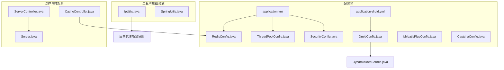
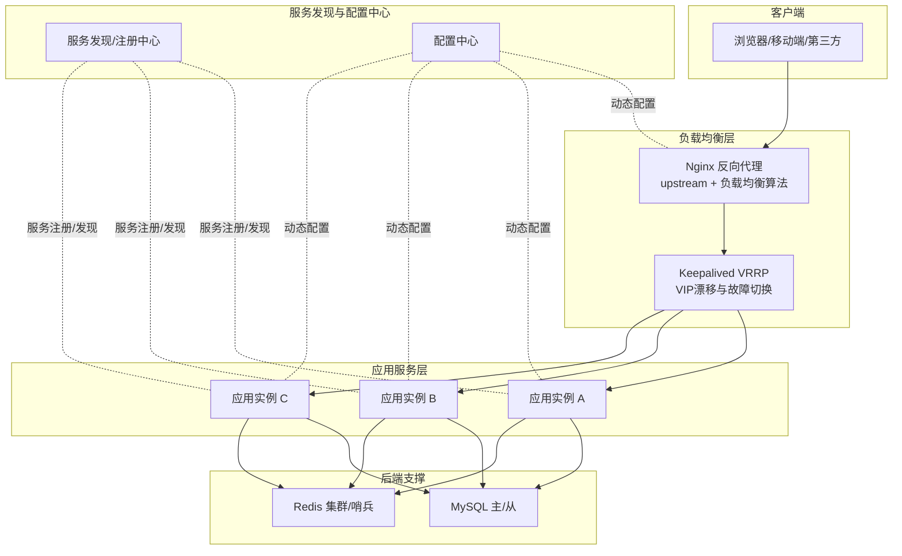
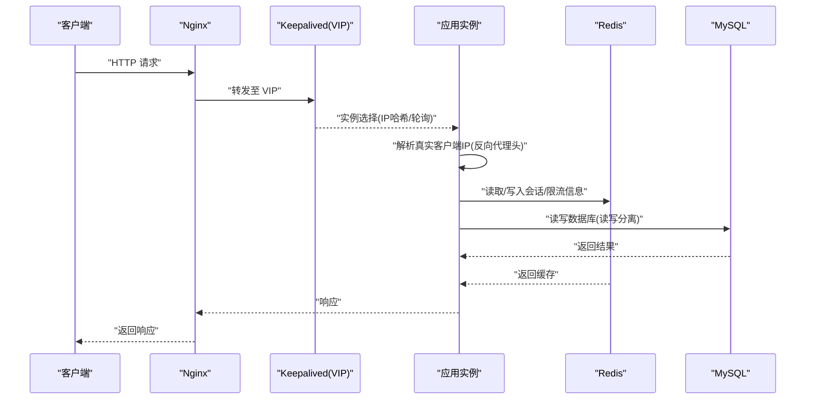
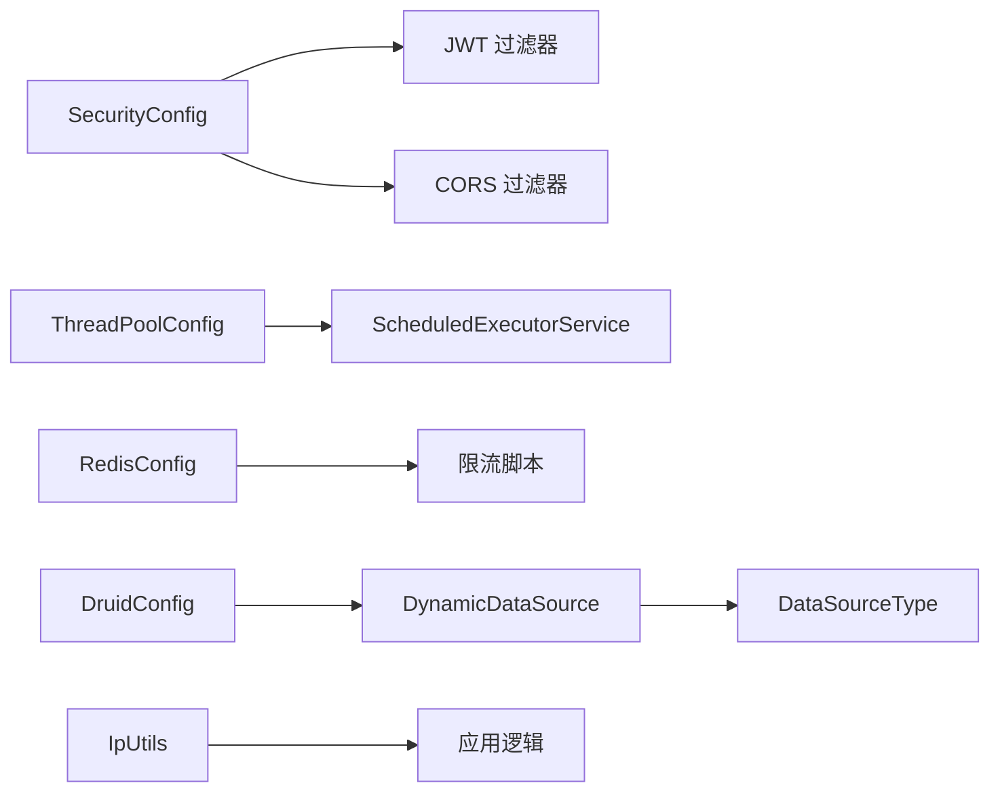

# 负载均衡配置

<cite>
**本文引用的文件**
- [application.yml](file://blog-admin/src/main/resources/application.yml)
- [application-druid.yml](file://blog-admin/src/main/resources/application-druid.yml)
- [DruidConfig.java](file://blog-framework/src/main/java/blog/framework/config/DruidConfig.java)
- [SecurityConfig.java](file://blog-framework/src/main/java/blog/framework/config/SecurityConfig.java)
- [ThreadPoolConfig.java](file://blog-framework/src/main/java/blog/framework/config/ThreadPoolConfig.java)
- [RedisConfig.java](file://blog-framework/src/main/java/blog/framework/config/RedisConfig.java)
- [MybatisPlusConfig.java](file://blog-framework/src/main/java/blog/framework/config/MybatisPlusConfig.java)
- [CaptchaConfig.java](file://blog-framework/src/main/java/blog/framework/config/CaptchaConfig.java)
- [IpUtils.java](file://blog-common/src/main/java/blog/common/utils/ip/IpUtils.java)
- [DynamicDataSource.java](file://blog-framework/src/main/java/blog/framework/datasource/DynamicDataSource.java)
- [DataSourceType.java](file://blog-common/src/main/java/blog/common/enums/DataSourceType.java)
- [SpringUtils.java](file://blog-common/src/main/java/blog/common/utils/spring/SpringUtils.java)
- [ServerController.java](file://blog-admin/src/main/java/blog/web/controller/monitor/ServerController.java)
- [Server.java](file://blog-framework/src/main/java/blog/framework/web/domain/Server.java)
- [CacheController.java](file://blog-admin/src/main/java/blog/web/controller/monitor/CacheController.java)
</cite>

## 目录
1. [简介](#简介)
2. [项目结构](#项目结构)
3. [核心组件](#核心组件)
4. [架构总览](#架构总览)
5. [详细组件分析](#详细组件分析)
6. [依赖分析](#依赖分析)
7. [性能考虑](#性能考虑)
8. [故障排查指南](#故障排查指南)
9. [结论](#结论)
10. [附录](#附录)

## 简介
本指南围绕“负载均衡配置”主题，结合代码库现有能力，系统梳理反向代理、高可用、服务发现、会话保持、性能优化与架构图示，帮助在高并发场景下实现稳定、可扩展的负载分担。需要特别说明的是：该代码库未包含 Nginx 反向代理与 Keepalived 高可用的直接配置文件；因此本指南将以“基于现有组件的工程化落地建议”形式给出实施步骤与最佳实践，而非直接复用仓库内的具体配置。

## 项目结构
该工程采用多模块结构，与负载均衡相关的关键模块与文件如下：
- 配置层：application.yml、application-druid.yml、各配置类（DruidConfig、SecurityConfig、ThreadPoolConfig、RedisConfig、MybatisPlusConfig、CaptchaConfig）
- 工具与基础设施：IpUtils（反向代理IP解析）、SpringUtils（Spring上下文工具）
- 监控与可观测：ServerController、Server（系统信息采集）、CacheController（Redis缓存监控）

图表来源
- [application.yml:1-161](file://blog-admin/src/main/resources/application.yml#L1-L161)
- [application-druid.yml:1-61](file://blog-admin/src/main/resources/application-druid.yml#L1-L61)
- [DruidConfig.java:1-117](file://blog-framework/src/main/java/blog/framework/config/DruidConfig.java#L1-L117)
- [SecurityConfig.java:1-137](file://blog-framework/src/main/java/blog/framework/config/SecurityConfig.java#L1-L137)
- [ThreadPoolConfig.java:1-60](file://blog-framework/src/main/java/blog/framework/config/ThreadPoolConfig.java#L1-L60)
- [RedisConfig.java:1-67](file://blog-framework/src/main/java/blog/framework/config/RedisConfig.java#L1-L67)
- [MybatisPlusConfig.java:1-56](file://blog-framework/src/main/java/blog/framework/config/MybatisPlusConfig.java#L1-L56)
- [CaptchaConfig.java:1-83](file://blog-framework/src/main/java/blog/framework/config/CaptchaConfig.java#L1-L83)
- [IpUtils.java:42-236](file://blog-common/src/main/java/blog/common/utils/ip/IpUtils.java#L42-L236)
- [DynamicDataSource.java:1-24](file://blog-framework/src/main/java/blog/framework/datasource/DynamicDataSource.java#L1-L24)
- [ServerController.java:1-25](file://blog-admin/src/main/java/blog/web/controller/monitor/ServerController.java#L1-L25)
- [Server.java:1-56](file://blog-framework/src/main/java/blog/framework/web/domain/Server.java#L1-L56)
- [CacheController.java:1-93](file://blog-admin/src/main/java/blog/web/controller/monitor/CacheController.java#L1-L93)

章节来源
- [application.yml:1-161](file://blog-admin/src/main/resources/application.yml#L1-L161)
- [application-druid.yml:1-61](file://blog-admin/src/main/resources/application-druid.yml#L1-L61)
- [DruidConfig.java:1-117](file://blog-framework/src/main/java/blog/framework/config/DruidConfig.java#L1-L117)
- [SecurityConfig.java:1-137](file://blog-framework/src/main/java/blog/framework/config/SecurityConfig.java#L1-L137)
- [ThreadPoolConfig.java:1-60](file://blog-framework/src/main/java/blog/framework/config/ThreadPoolConfig.java#L1-L60)
- [RedisConfig.java:1-67](file://blog-framework/src/main/java/blog/framework/config/RedisConfig.java#L1-L67)
- [MybatisPlusConfig.java:1-56](file://blog-framework/src/main/java/blog/framework/config/MybatisPlusConfig.java#L1-L56)
- [CaptchaConfig.java:1-83](file://blog-framework/src/main/java/blog/framework/config/CaptchaConfig.java#L1-L83)
- [IpUtils.java:42-236](file://blog-common/src/main/java/blog/common/utils/ip/IpUtils.java#L42-L236)
- [DynamicDataSource.java:1-24](file://blog-framework/src/main/java/blog/framework/datasource/DynamicDataSource.java#L1-L24)
- [ServerController.java:1-25](file://blog-admin/src/main/java/blog/web/controller/monitor/ServerController.java#L1-L25)
- [Server.java:1-56](file://blog-framework/src/main/java/blog/framework/web/domain/Server.java#L1-L56)
- [CacheController.java:1-93](file://blog-admin/src/main/java/blog/web/controller/monitor/CacheController.java#L1-L93)

## 核心组件
- 反向代理与客户端IP解析：通过 IpUtils 统一解析 x-forwarded-for、Proxy-Client-IP、X-Forwarded-For、WL-Proxy-Client-IP、X-Real-IP、remoteAddr 等头部，支持多级代理场景。
- 安全与会话：SecurityConfig 启用无状态 JWT 认证，禁用 CSRF 与 Session，适合分布式与负载均衡场景。
- 线程池与并发：ThreadPoolConfig 提供较大的核心线程、最大线程与队列容量，适配高并发请求。
- 缓存与限流：RedisConfig 提供 RedisTemplate 与限流脚本，可用于分布式限流与会话存储。
- 数据源与读写分离：DruidConfig 与 DynamicDataSource 支持主从数据源动态切换，配合 DataSourceType 枚举。
- 监控与可观测：ServerController/Server 提供系统信息采集；CacheController 提供 Redis 键空间与命令统计查询。

章节来源
- [IpUtils.java:42-236](file://blog-common/src/main/java/blog/common/utils/ip/IpUtils.java#L42-L236)
- [SecurityConfig.java:94-127](file://blog-framework/src/main/java/blog/framework/config/SecurityConfig.java#L94-L127)
- [ThreadPoolConfig.java:20-42](file://blog-framework/src/main/java/blog/framework/config/ThreadPoolConfig.java#L20-L42)
- [RedisConfig.java:21-47](file://blog-framework/src/main/java/blog/framework/config/RedisConfig.java#L21-L47)
- [DruidConfig.java:34-72](file://blog-framework/src/main/java/blog/framework/config/DruidConfig.java#L34-L72)
- [DynamicDataSource.java:13-24](file://blog-framework/src/main/java/blog/framework/datasource/DynamicDataSource.java#L13-L24)
- [DataSourceType.java:8-18](file://blog-common/src/main/java/blog/common/enums/DataSourceType.java#L8-L18)
- [ServerController.java:18-24](file://blog-admin/src/main/java/blog/web/controller/monitor/ServerController.java#L18-L24)
- [Server.java:31-56](file://blog-framework/src/main/java/blog/framework/web/domain/Server.java#L31-L56)
- [CacheController.java:34-93](file://blog-admin/src/main/java/blog/web/controller/monitor/CacheController.java#L34-L93)

## 架构总览
下图展示“应用服务 + 负载均衡层 + 服务发现与高可用”的整体思路。注意：该图为概念性架构示意，用于指导如何在现有工程基础上落地负载均衡与高可用。

说明
- Nginx upstream 支持轮询、权重、IP哈希、健康检查等策略，结合 Keepalived 实现 VIP 自动漂移与高可用。
- 应用侧通过 SecurityConfig 的无状态 JWT、ThreadPoolConfig 的线程池、RedisConfig 的缓存与限流脚本，支撑高并发与会话管理。
- 服务发现可采用 Consul/Eureka 等，结合 Nginx/upstream 动态更新或通过外部控制器下发配置。

## 详细组件分析

### 反向代理与上游配置（Nginx）
- upstream 配置要点
  - 节点健康检查：使用 proxy_pass 的健康检查指令或外部探针，结合 fail_timeout 与 max_fails 控制失败节点摘除与恢复。
  - 负载均衡算法：轮询、权重、IP 哈希、最少连接等；IP 哈希适合会话保持场景。
  - 会话保持：IP 哈希或 Cookie 粘性；Cookie 粘性需配合后端无状态设计。
  - 超时与连接：proxy_connect_timeout、proxy_send_timeout、proxy_read_timeout、client_body_timeout；启用 keepalive 减少连接开销。
  - 日志与指标：access_log、status 指标上报，便于定位瓶颈。
- 与应用集成
  - 应用通过 IpUtils 解析真实客户端 IP，避免因代理导致的来源地址错误。
  - 应用侧禁用 Session、启用 JWT，降低跨实例会话同步成本。

章节来源
- [IpUtils.java:42-236](file://blog-common/src/main/java/blog/common/utils/ip/IpUtils.java#L42-L236)
- [SecurityConfig.java:94-127](file://blog-framework/src/main/java/blog/framework/config/SecurityConfig.java#L94-L127)

### 高可用与 VIP 漂移（Keepalived）
- VRRP 协议：通过主备心跳检测，主节点故障时由备节点接管 VIP，实现业务连续性。
- 故障检测：结合 Nginx/应用健康检查，触发 VRRP 状态切换。
- 自动切换：配置优先级、抢占模式、通知脚本，确保切换过程对业务透明。
- 与 Nginx 协同：Keepalived 管理 VIP，Nginx 管理上游实例与负载均衡策略。

章节来源
- [application.yml:13-28](file://blog-admin/src/main/resources/application.yml#L13-L28)

### 服务发现机制
- DNS 服务发现：通过 DNS 记录轮换或 SRV 记录，实现服务实例的动态解析。
- Consul 服务发现：注册服务元数据，利用健康检查与服务目录实现动态路由。
- Eureka 服务发现：注册中心提供服务清单，客户端拉取并结合负载均衡策略选择实例。
- 与 Nginx 协同：通过外部控制器或 Consul Template/Nginx Plus 动态生成 upstream 配置，实现服务变更的零停机。

章节来源
- [application.yml:66-88](file://blog-admin/src/main/resources/application.yml#L66-L88)

### 会话保持策略
- IP 哈希：Nginx upstream 中使用 ip_hash，将同一客户端 IP 的请求固定到同一后端实例。
- Cookie 粘性：设置 sticky cookie，后端实例负责会话存储（Redis）。
- 会话复制：传统应用使用 Session 复制，但不利于水平扩展；推荐无状态 + 外部存储（Redis）。
- 应用侧无状态：SecurityConfig 使用 STATELESS，避免 Session；结合 Redis 存储用户态信息或限流令牌。

章节来源
- [SecurityConfig.java:104-106](file://blog-framework/src/main/java/blog/framework/config/SecurityConfig.java#L104-L106)
- [RedisConfig.java:21-39](file://blog-framework/src/main/java/blog/framework/config/RedisConfig.java#L21-L39)

### 性能优化与调优
- 连接池与线程池
  - Tomcat 线程池：acceptCount、max、minSpare 等参数根据并发峰值调整。
  - 应用线程池：ThreadPoolConfig 提供较大核心线程与队列容量，避免拒绝。
- 超时与并发控制
  - Nginx 层设置合理的 proxy 超时与 keepalive。
  - 应用层通过 Redis 限流脚本控制突发流量。
- 缓存与热点
  - Redis 集群/哨兵提升可用性与吞吐；热点键使用本地缓存与异步更新。
- 数据库与读写分离
  - DruidConfig 与 DynamicDataSource 支持主从切换，降低读压力。

章节来源
- [application.yml:19-28](file://blog-admin/src/main/resources/application.yml#L19-L28)
- [ThreadPoolConfig.java:20-42](file://blog-framework/src/main/java/blog/framework/config/ThreadPoolConfig.java#L20-L42)
- [RedisConfig.java:42-65](file://blog-framework/src/main/java/blog/framework/config/RedisConfig.java#L42-L65)
- [application-druid.yml:19-36](file://blog-admin/src/main/resources/application-druid.yml#L19-L36)
- [DruidConfig.java:34-72](file://blog-framework/src/main/java/blog/framework/config/DruidConfig.java#L34-L72)
- [DynamicDataSource.java:13-24](file://blog-framework/src/main/java/blog/framework/datasource/DynamicDataSource.java#L13-L24)

### 流量转发流程（Nginx + 应用）

图表来源
- [IpUtils.java:42-236](file://blog-common/src/main/java/blog/common/utils/ip/IpUtils.java#L42-L236)
- [SecurityConfig.java:94-127](file://blog-framework/src/main/java/blog/framework/config/SecurityConfig.java#L94-L127)
- [RedisConfig.java:21-39](file://blog-framework/src/main/java/blog/framework/config/RedisConfig.java#L21-L39)
- [application.yml:13-28](file://blog-admin/src/main/resources/application.yml#L13-L28)

## 依赖分析
- 组件内聚与耦合
  - SecurityConfig 与 JwtAuthenticationTokenFilter、CorsFilter 的组合，形成无状态认证链路，适合分布式部署。
  - ThreadPoolConfig 与 ScheduledExecutorService 提升异步任务处理能力。
  - RedisConfig 与限流脚本为分布式限流与会话存储提供基础。
  - DruidConfig 与 DynamicDataSource 为读写分离与动态数据源切换提供支撑。
- 外部依赖
  - Nginx/Keepalived：作为外部负载均衡与高可用组件。
  - Consul/Eureka：作为服务发现与配置中心。
  - MySQL/Redis：作为后端存储。

图表来源
- [SecurityConfig.java:94-127](file://blog-framework/src/main/java/blog/framework/config/SecurityConfig.java#L94-L127)
- [ThreadPoolConfig.java:47-58](file://blog-framework/src/main/java/blog/framework/config/ThreadPoolConfig.java#L47-L58)
- [RedisConfig.java:42-65](file://blog-framework/src/main/java/blog/framework/config/RedisConfig.java#L42-L65)
- [DruidConfig.java:50-57](file://blog-framework/src/main/java/blog/framework/config/DruidConfig.java#L50-L57)
- [DynamicDataSource.java:13-24](file://blog-framework/src/main/java/blog/framework/datasource/DynamicDataSource.java#L13-L24)
- [DataSourceType.java:8-18](file://blog-common/src/main/java/blog/common/enums/DataSourceType.java#L8-L18)
- [IpUtils.java:42-236](file://blog-common/src/main/java/blog/common/utils/ip/IpUtils.java#L42-L236)

章节来源
- [SecurityConfig.java:94-127](file://blog-framework/src/main/java/blog/framework/config/SecurityConfig.java#L94-L127)
- [ThreadPoolConfig.java:47-58](file://blog-framework/src/main/java/blog/framework/config/ThreadPoolConfig.java#L47-L58)
- [RedisConfig.java:42-65](file://blog-framework/src/main/java/blog/framework/config/RedisConfig.java#L42-L65)
- [DruidConfig.java:50-57](file://blog-framework/src/main/java/blog/framework/config/DruidConfig.java#L50-L57)
- [DynamicDataSource.java:13-24](file://blog-framework/src/main/java/blog/framework/datasource/DynamicDataSource.java#L13-L24)
- [DataSourceType.java:8-18](file://blog-common/src/main/java/blog/common/enums/DataSourceType.java#L8-L18)
- [IpUtils.java:42-236](file://blog-common/src/main/java/blog/common/utils/ip/IpUtils.java#L42-L236)

## 性能考虑
- Nginx 层
  - 启用 gzip/ssl 缓存、静态资源压缩与缓存头设置。
  - 合理设置 worker_connections、worker_processes，压测评估并发。
  - 使用健康检查与 fail_timeout，避免故障节点拖累整体。
- 应用层
  - 线程池参数按 QPS 与 RT 调整；队列过长会导致延迟抖动。
  - Redis 使用连接池与合适的超时，避免阻塞。
  - 数据库连接池参数与 SQL 优化，避免慢查询放大。
- 监控与告警
  - 通过 ServerController/Server 与 CacheController 提供的指标，建立 P99、错误率、Redis 命令分布等监控。

章节来源
- [application.yml:19-28](file://blog-admin/src/main/resources/application.yml#L19-L28)
- [ThreadPoolConfig.java:20-42](file://blog-framework/src/main/java/blog/framework/config/ThreadPoolConfig.java#L20-L42)
- [RedisConfig.java:21-39](file://blog-framework/src/main/java/blog/framework/config/RedisConfig.java#L21-L39)
- [ServerController.java:18-24](file://blog-admin/src/main/java/blog/web/controller/monitor/ServerController.java#L18-L24)
- [CacheController.java:60-71](file://blog-admin/src/main/java/blog/web/controller/monitor/CacheController.java#L60-L71)

## 故障排查指南
- 客户端显示为代理地址
  - 检查 Nginx 是否正确透传 x-forwarded-for 等头部；应用侧使用 IpUtils 解析真实来源。
- 会话异常或登录失效
  - 确认应用为无状态（STATELESS），避免 Session；若使用 Cookie 粘性，需确保 Redis 会话可用。
- 响应缓慢或超时
  - 检查 Nginx 超时参数与后端实例健康；压测定位瓶颈（CPU/IO/网络/数据库）。
- Redis 连接池耗尽
  - 调整 max-active/max-wait，观察慢查询与热点键。
- 数据库连接池问题
  - 检查 maxActive、maxWait、validationQuery 等参数，确认主从切换逻辑正常。

章节来源
- [IpUtils.java:42-236](file://blog-common/src/main/java/blog/common/utils/ip/IpUtils.java#L42-L236)
- [SecurityConfig.java:104-106](file://blog-framework/src/main/java/blog/framework/config/SecurityConfig.java#L104-L106)
- [application.yml:78-88](file://blog-admin/src/main/resources/application.yml#L78-L88)
- [application-druid.yml:19-36](file://blog-admin/src/main/resources/application-druid.yml#L19-L36)

## 结论
本指南基于现有工程能力，给出了在高并发场景下实施负载均衡与高可用的系统化建议：以 Nginx 作为入口与负载均衡核心，结合 Keepalived 实现 VIP 高可用；应用侧通过无状态认证、线程池与缓存优化支撑高并发；服务发现与配置中心保障动态与弹性；通过监控与限流实现可观测与稳定性。由于仓库未包含 Nginx/Keepalived 的具体配置文件，建议依据本指南在生产环境按需落地并持续优化。

## 附录
- 关键配置参考路径
  - 服务器与线程池：[application.yml:13-28](file://blog-admin/src/main/resources/application.yml#L13-L28)
  - Redis 连接与池化：[application.yml:66-88](file://blog-admin/src/main/resources/application.yml#L66-L88)
  - 数据源与连接池：[application-druid.yml:19-36](file://blog-admin/src/main/resources/application-druid.yml#L19-L36)
  - 无状态安全策略：[SecurityConfig.java:94-127](file://blog-framework/src/main/java/blog/framework/config/SecurityConfig.java#L94-L127)
  - 线程池与调度：[ThreadPoolConfig.java:20-42](file://blog-framework/src/main/java/blog/framework/config/ThreadPoolConfig.java#L20-L42)
  - Redis 与限流脚本：[RedisConfig.java:21-47](file://blog-framework/src/main/java/blog/framework/config/RedisConfig.java#L21-L47)
  - 动态数据源与枚举：[DruidConfig.java:50-57](file://blog-framework/src/main/java/blog/framework/config/DruidConfig.java#L50-L57)、[DynamicDataSource.java:13-24](file://blog-framework/src/main/java/blog/framework/datasource/DynamicDataSource.java#L13-L24)、[DataSourceType.java:8-18](file://blog-common/src/main/java/blog/common/enums/DataSourceType.java#L8-L18)
  - 反向代理 IP 解析：[IpUtils.java:42-236](file://blog-common/src/main/java/blog/common/utils/ip/IpUtils.java#L42-L236)
  - 系统与缓存监控：[ServerController.java:18-24](file://blog-admin/src/main/java/blog/web/controller/monitor/ServerController.java#L18-L24)、[CacheController.java:60-71](file://blog-admin/src/main/java/blog/web/controller/monitor/CacheController.java#L60-L71)