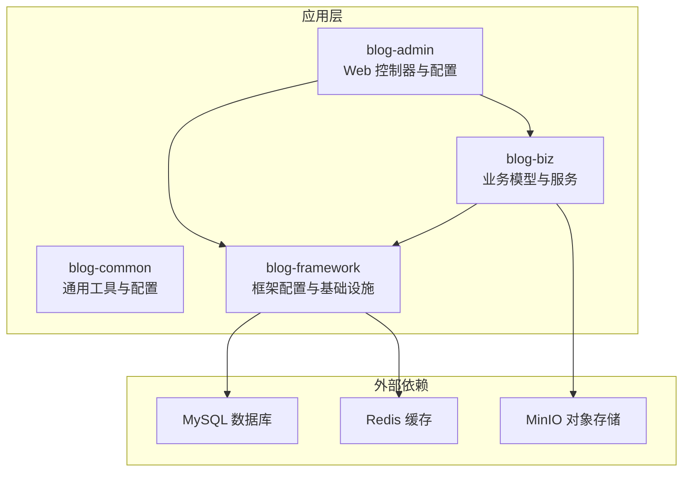
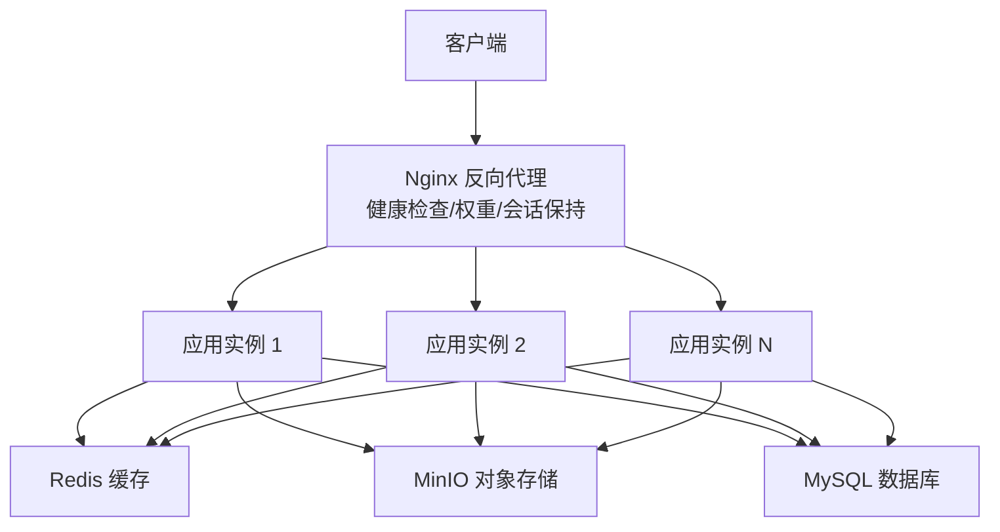
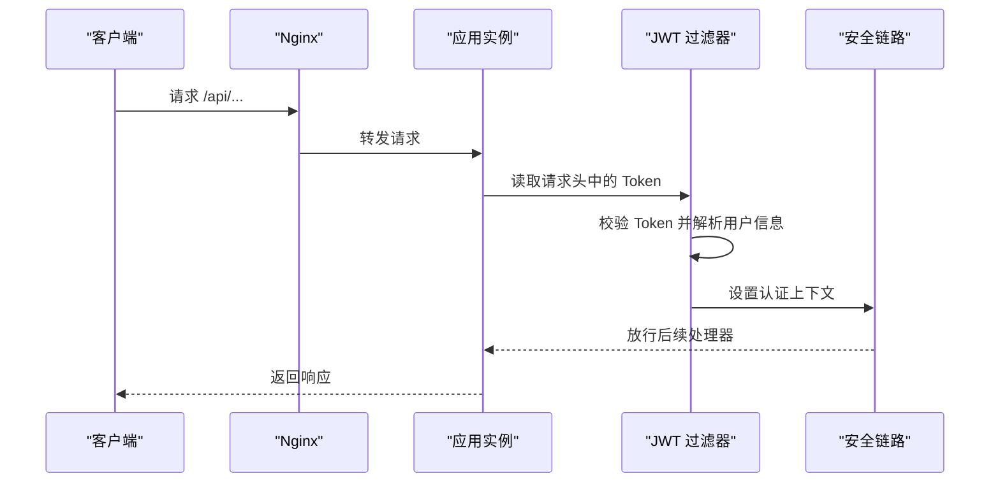
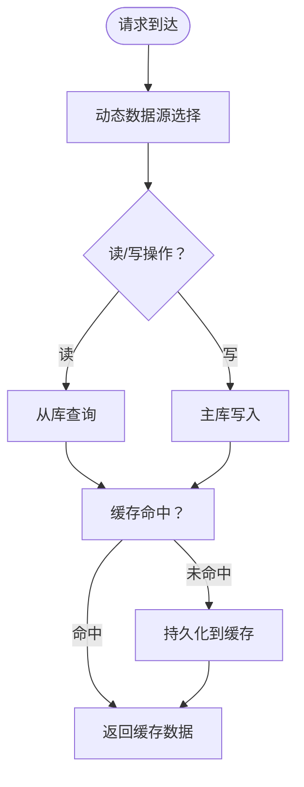
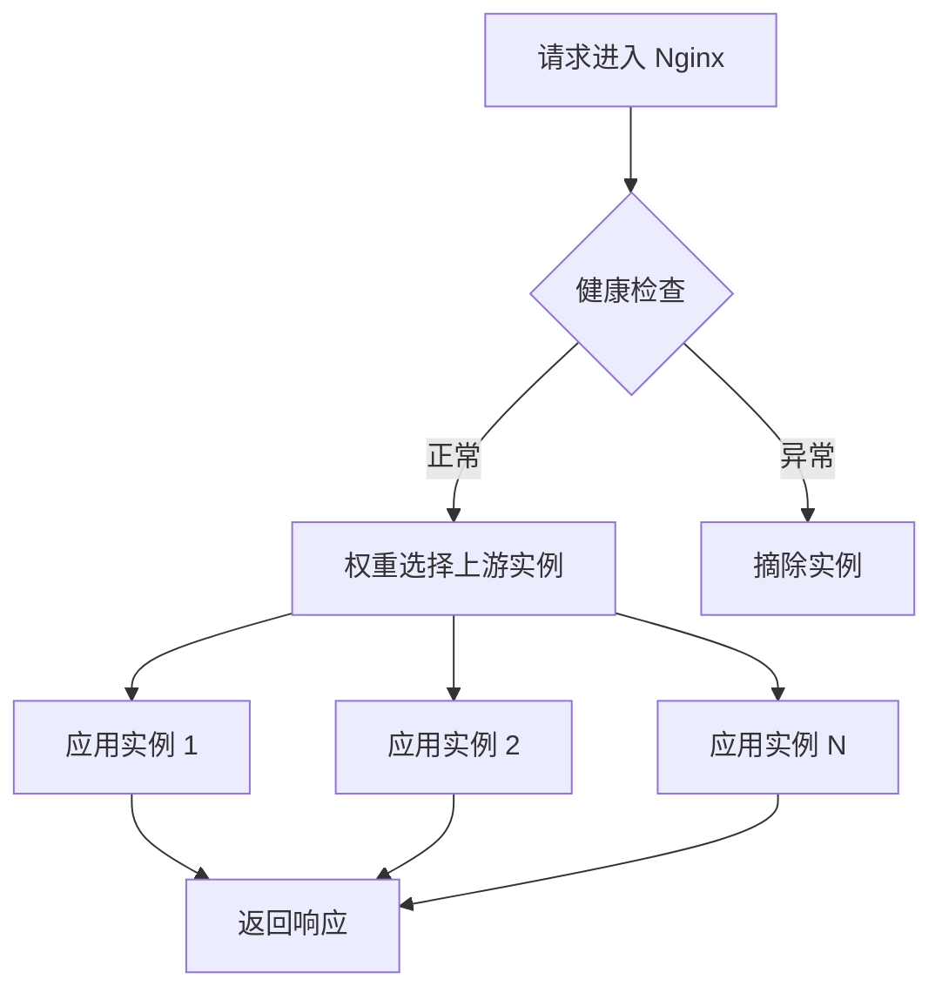
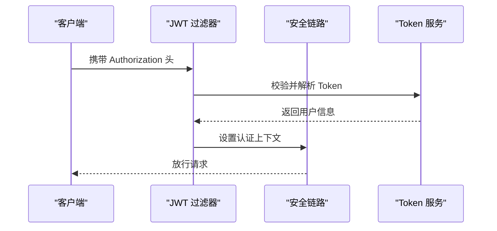
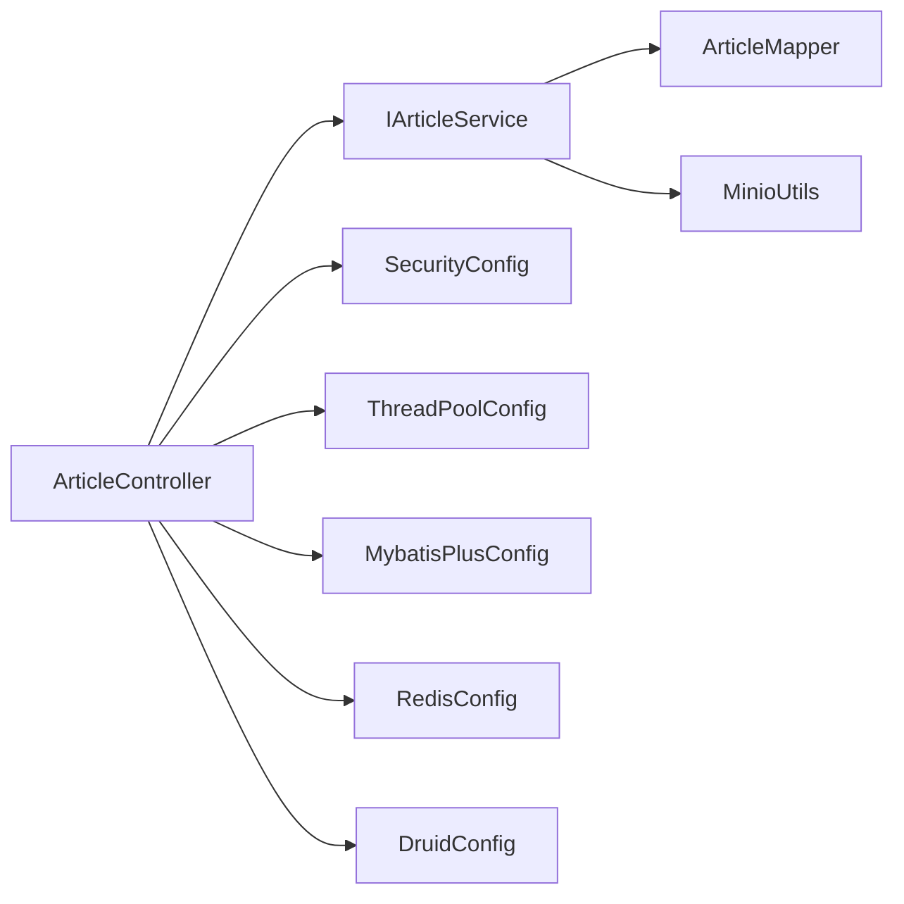

# 高可用架构设计

<cite>
**本文引用的文件**
- [application.yml](file://blog-admin/src/main/resources/application.yml)
- [application-druid.yml](file://blog-admin/src/main/resources/application-druid.yml)
- [BlogServerConfig.java](file://blog-common/src/main/java/blog/common/config/BlogServerConfig.java)
- [RedisConfig.java](file://blog-framework/src/main/java/blog/framework/config/RedisConfig.java)
- [DruidConfig.java](file://blog-framework/src/main/java/blog/framework/config/DruidConfig.java)
- [SecurityConfig.java](file://blog-framework/src/main/java/blog/framework/config/SecurityConfig.java)
- [ThreadPoolConfig.java](file://blog-framework/src/main/java/blog/framework/config/ThreadPoolConfig.java)
- [MybatisPlusConfig.java](file://blog-framework/src/main/java/blog/framework/config/MybatisPlusConfig.java)
- [RedisCache.java](file://blog-common/src/main/java/blog/common/core/redis/RedisCache.java)
- [CacheConstants.java](file://blog-common/src/main/java/blog/common/constant/CacheConstants.java)
- [JwtAuthenticationTokenFilter.java](file://blog-framework/src/main/java/blog/framework/security/filter/JwtAuthenticationTokenFilter.java)
- [DynamicDataSource.java](file://blog-framework/src/main/java/blog/framework/datasource/DynamicDataSource.java)
- [MinioUtils.java](file://blog-common/src/main/java/blog/common/utils/minio/MinioUtils.java)
- [ArticleController.java](file://blog-admin/src/main/java/blog/web/controller/business/ArticleController.java)
</cite>

## 目录
1. [简介](#简介)
2. [项目结构](#项目结构)
3. [核心组件](#核心组件)
4. [架构总览](#架构总览)
5. [详细组件分析](#详细组件分析)
6. [依赖分析](#依赖分析)
7. [性能考虑](#性能考虑)
8. [故障排查指南](#故障排查指南)
9. [结论](#结论)
10. [附录](#附录)

## 简介
本文件面向高可用架构设计，围绕“无状态服务设计”“有状态数据分离”“负载均衡策略”“服务发现与健康检查”“架构拓扑与组件交互”等方面，结合代码库中的配置与实现，给出可落地的设计建议与最佳实践。重点强调：
- 服务实例的可替换性与会话状态分离
- 数据库、缓存、文件存储的分离与一致性保障
- 负载均衡与健康检查的实现要点
- 安全与线程池、ORM、动态数据源等基础设施的协同

## 项目结构
该代码库采用多模块分层组织，主要模块与职责如下：
- blog-admin：Web 层入口，提供 REST API 控制器与应用配置
- blog-biz：业务领域模型、Mapper、Service 实现
- blog-common：通用工具、常量、配置读取、Redis 封装、MinIO 工具等
- blog-framework：框架配置（安全、缓存、数据源、线程池、MyBatis Plus 插件）
- blog-system、blog-quartz、blog-generator：系统功能与扩展模块（本设计文档聚焦于高可用相关配置与实现）

**图表来源**
- [application.yml:12-161](file://blog-admin/src/main/resources/application.yml#L12-L161)
- [application-druid.yml:1-61](file://blog-admin/src/main/resources/application-druid.yml#L1-L61)
- [RedisConfig.java:17-67](file://blog-framework/src/main/java/blog/framework/config/RedisConfig.java#L17-L67)
- [DruidConfig.java:33-117](file://blog-framework/src/main/java/blog/framework/config/DruidConfig.java#L33-L117)
- [MinioUtils.java:25-325](file://blog-common/src/main/java/blog/common/utils/minio/MinioUtils.java#L25-L325)

**章节来源**
- [application.yml:12-161](file://blog-admin/src/main/resources/application.yml#L12-L161)
- [application-druid.yml:1-61](file://blog-admin/src/main/resources/application-druid.yml#L1-L61)

## 核心组件
- 无状态服务设计
  - 会话状态分离：基于 JWT 的无状态认证，避免使用 Session
  - 配置集中管理：通过 Spring Profile 与 YAML 配置集中化
- 有状态数据分离
  - 数据库：Druid 连接池与动态数据源（主从/扩展）
  - 缓存：RedisTemplate 与脚本限流
  - 文件存储：MinIO 对象存储
- 负载均衡与健康检查
  - 通过 Nginx 反向代理与健康检查脚本实现高可用
- 安全与线程池
  - Spring Security 无状态策略
  - 自定义线程池与 MyBatis Plus 插件

**章节来源**
- [SecurityConfig.java:94-127](file://blog-framework/src/main/java/blog/framework/config/SecurityConfig.java#L94-L127)
- [ThreadPoolConfig.java:18-60](file://blog-framework/src/main/java/blog/framework/config/ThreadPoolConfig.java#L18-L60)
- [MybatisPlusConfig.java:16-56](file://blog-framework/src/main/java/blog/framework/config/MybatisPlusConfig.java#L16-L56)
- [RedisConfig.java:17-67](file://blog-framework/src/main/java/blog/framework/config/RedisConfig.java#L17-L67)
- [DruidConfig.java:33-117](file://blog-framework/src/main/java/blog/framework/config/DruidConfig.java#L33-L117)
- [MinioUtils.java:25-325](file://blog-common/src/main/java/blog/common/utils/minio/MinioUtils.java#L25-L325)

## 架构总览
下图展示高可用架构的关键交互：客户端经 Nginx 负载均衡访问多个应用实例；应用通过 Redis 缓存与 MinIO 对象存储提升性能与可靠性；数据库采用 Druid 连接池与动态数据源。

**图表来源**
- [application.yml:13-29](file://blog-admin/src/main/resources/application.yml#L13-L29)
- [application.yml:65-89](file://blog-admin/src/main/resources/application.yml#L65-L89)
- [application.yml:155-161](file://blog-admin/src/main/resources/application.yml#L155-L161)
- [application-druid.yml:2-61](file://blog-admin/src/main/resources/application-druid.yml#L2-L61)
- [RedisConfig.java:21-39](file://blog-framework/src/main/java/blog/framework/config/RedisConfig.java#L21-L39)
- [MinioUtils.java:30-35](file://blog-common/src/main/java/blog/common/utils/minio/MinioUtils.java#L30-L35)

## 详细组件分析

### 无状态服务设计
- 会话状态分离
  - 基于 JWT 的无状态认证，禁用 Session，统一由过滤器解析与校验 Token
  - 安全链路中先 CORS，再 JWT 过滤器，最后表单登录过滤器
- 配置集中管理
  - 通过 Spring Profile 切换数据源与日志级别
  - 项目级配置通过 @ConfigurationProperties 绑定到强类型对象

**图表来源**
- [SecurityConfig.java:94-127](file://blog-framework/src/main/java/blog/framework/config/SecurityConfig.java#L94-L127)
- [JwtAuthenticationTokenFilter.java:27-51](file://blog-framework/src/main/java/blog/framework/security/filter/JwtAuthenticationTokenFilter.java#L27-L51)

**章节来源**
- [SecurityConfig.java:94-127](file://blog-framework/src/main/java/blog/framework/config/SecurityConfig.java#L94-L127)
- [JwtAuthenticationTokenFilter.java:27-51](file://blog-framework/src/main/java/blog/framework/security/filter/JwtAuthenticationTokenFilter.java#L27-L51)
- [application.yml:50-51](file://blog-admin/src/main/resources/application.yml#L50-L51)
- [BlogServerConfig.java:11-119](file://blog-common/src/main/java/blog/common/config/BlogServerConfig.java#L11-L119)

### 有状态数据分离策略
- 数据库
  - Druid 连接池与动态数据源：支持主从切换与扩展
  - 启用慢 SQL 记录与控制台白名单，便于运维与诊断
- 缓存
  - RedisTemplate 统一封装，支持多种数据结构
  - 内置 Lua 限流脚本，用于高并发限流
- 文件存储
  - MinIO 工具类封装上传、下载、列举、签名 URL 等能力
  - 默认桶名与临时访问 URL 机制，便于安全分发

**图表来源**
- [DruidConfig.java:50-72](file://blog-framework/src/main/java/blog/framework/config/DruidConfig.java#L50-L72)
- [DynamicDataSource.java:13-24](file://blog-framework/src/main/java/blog/framework/datasource/DynamicDataSource.java#L13-L24)
- [RedisCache.java:24-248](file://blog-common/src/main/java/blog/common/core/redis/RedisCache.java#L24-L248)
- [RedisConfig.java:42-66](file://blog-framework/src/main/java/blog/framework/config/RedisConfig.java#L42-L66)
- [MinioUtils.java:85-111](file://blog-common/src/main/java/blog/common/utils/minio/MinioUtils.java#L85-L111)

**章节来源**
- [application-druid.yml:2-61](file://blog-admin/src/main/resources/application-druid.yml#L2-L61)
- [DruidConfig.java:33-117](file://blog-framework/src/main/java/blog/framework/config/DruidConfig.java#L33-L117)
- [RedisConfig.java:17-67](file://blog-framework/src/main/java/blog/framework/config/RedisConfig.java#L17-L67)
- [RedisCache.java:24-248](file://blog-common/src/main/java/blog/common/core/redis/RedisCache.java#L24-L248)
- [CacheConstants.java:8-44](file://blog-common/src/main/java/blog/common/constant/CacheConstants.java#L8-L44)
- [MinioUtils.java:25-325](file://blog-common/src/main/java/blog/common/utils/minio/MinioUtils.java#L25-L325)

### 负载均衡策略
- Nginx 反向代理
  - 轮询算法与权重分配：根据实例能力设置权重
  - 会话保持：基于 Cookie 或 IP 哈希，确保用户与实例绑定
  - 健康检查：定期探测应用健康端点，自动摘除故障节点
- 应用侧优化
  - Tomcat 线程池参数调优：最大线程、最小空闲线程、排队数
  - 线程池：核心线程、最大线程、队列容量与拒绝策略

**图表来源**
- [application.yml:13-29](file://blog-admin/src/main/resources/application.yml#L13-L29)
- [ThreadPoolConfig.java:18-60](file://blog-framework/src/main/java/blog/framework/config/ThreadPoolConfig.java#L18-L60)

**章节来源**
- [application.yml:13-29](file://blog-admin/src/main/resources/application.yml#L13-L29)
- [ThreadPoolConfig.java:18-60](file://blog-framework/src/main/java/blog/framework/config/ThreadPoolConfig.java#L18-L60)

### 服务发现与健康检查
- 服务发现
  - 静态配置：Nginx upstream 中固定列出实例地址
  - 动态注册：结合注册中心（如 Consul/Nacos）实现实例动态注册与注销
  - 故障剔除：健康检查失败自动摘除，恢复后重新加入
- 健康检查
  - TCP 检查：探测端口连通性
  - HTTP 检查：访问健康端点（如 /actuator/health），解析返回码与响应体
  - 自定义脚本：结合探针脚本，执行业务级检查（如数据库连通、缓存可用）

[本节为概念性说明，不直接分析具体文件，故无“章节来源”]

### 安全与认证流程
- 无状态认证
  - 禁用 CSRF 与 Session，使用 JWT 令牌
  - 允许匿名访问的路径通过配置集中管理
- 过滤器链
  - CORS → JWT → 表单登录 → 其他

**图表来源**
- [SecurityConfig.java:94-127](file://blog-framework/src/main/java/blog/framework/config/SecurityConfig.java#L94-L127)
- [JwtAuthenticationTokenFilter.java:38-50](file://blog-framework/src/main/java/blog/framework/security/filter/JwtAuthenticationTokenFilter.java#L38-L50)

**章节来源**
- [SecurityConfig.java:94-127](file://blog-framework/src/main/java/blog/framework/config/SecurityConfig.java#L94-L127)
- [JwtAuthenticationTokenFilter.java:27-51](file://blog-framework/src/main/java/blog/framework/security/filter/JwtAuthenticationTokenFilter.java#L27-L51)

### 数据一致性保障
- 事务与连接池
  - Druid 连接池参数（初始连接、最大活跃、超时、检测间隔）保障连接稳定性
- 缓存一致性
  - 缓存键命名规范（CacheConstants）与过期策略
  - 写操作先更新数据库，再更新/失效缓存
- 文件一致性
  - MinIO 上传后生成临时/永久 URL，结合业务幂等与回滚策略

**章节来源**
- [application-druid.yml:19-41](file://blog-admin/src/main/resources/application-druid.yml#L19-L41)
- [CacheConstants.java:8-44](file://blog-common/src/main/java/blog/common/constant/CacheConstants.java#L8-L44)
- [MinioUtils.java:85-111](file://blog-common/src/main/java/blog/common/utils/minio/MinioUtils.java#L85-L111)

### API 与控制器示例
- 文章管理控制器演示了权限注解、分页查询、导出与 CRUD 接口
- 结合无状态认证与权限控制，确保接口安全与可扩展

**章节来源**
- [ArticleController.java:36-102](file://blog-admin/src/main/java/blog/web/controller/business/ArticleController.java#L36-L102)

## 依赖分析
- 组件耦合
  - 控制器依赖 Service，Service 依赖 Mapper 与工具类
  - 框架配置为各模块提供统一能力（安全、缓存、数据源、线程池）
- 外部依赖
  - MySQL、Redis、MinIO 作为外部有状态组件，通过配置文件集中管理

**图表来源**
- [ArticleController.java:36-102](file://blog-admin/src/main/java/blog/web/controller/business/ArticleController.java#L36-L102)
- [MinioUtils.java:25-325](file://blog-common/src/main/java/blog/common/utils/minio/MinioUtils.java#L25-L325)
- [SecurityConfig.java:31-137](file://blog-framework/src/main/java/blog/framework/config/SecurityConfig.java#L31-L137)
- [ThreadPoolConfig.java:18-60](file://blog-framework/src/main/java/blog/framework/config/ThreadPoolConfig.java#L18-L60)
- [MybatisPlusConfig.java:16-56](file://blog-framework/src/main/java/blog/framework/config/MybatisPlusConfig.java#L16-L56)
- [RedisConfig.java:17-67](file://blog-framework/src/main/java/blog/framework/config/RedisConfig.java#L17-L67)
- [DruidConfig.java:33-117](file://blog-framework/src/main/java/blog/framework/config/DruidConfig.java#L33-L117)

**章节来源**
- [ArticleController.java:36-102](file://blog-admin/src/main/java/blog/web/controller/business/ArticleController.java#L36-L102)

## 性能考虑
- 线程池与连接池
  - 应用线程池：核心线程、最大线程、队列容量与拒绝策略
  - Tomcat 线程池：最大线程、最小空闲线程、接受队列
  - Druid 连接池：初始连接、最大活跃、检测与超时
- 缓存策略
  - 合理设置键空间与过期时间，避免缓存雪崩
  - 使用限流脚本保护后端
- 文件分发
  - MinIO 临时 URL 降低直传压力，结合 CDN 提升访问速度

[本节提供通用指导，不直接分析具体文件，故无“章节来源”]

## 故障排查指南
- 健康检查失败
  - 检查 Nginx 健康检查端点与返回码
  - 查看应用日志与 Druid 控制台
- 连接池耗尽
  - 检查 Druid 连接池参数与慢 SQL
  - 观察数据库负载与锁等待
- 缓存异常
  - 校验 Redis 连接与序列化配置
  - 检查限流脚本与键空间
- 文件上传失败
  - 检查 MinIO 桶权限与网络连通性
  - 校验上传大小与类型限制

**章节来源**
- [application.yml:30-35](file://blog-admin/src/main/resources/application.yml#L30-L35)
- [application-druid.yml:42-61](file://blog-admin/src/main/resources/application-druid.yml#L42-L61)
- [RedisConfig.java:21-39](file://blog-framework/src/main/java/blog/framework/config/RedisConfig.java#L21-L39)
- [MinioUtils.java:85-111](file://blog-common/src/main/java/blog/common/utils/minio/MinioUtils.java#L85-L111)

## 结论
通过无状态服务设计、有状态数据分离与完善的基础设施配置，系统可在高并发场景下保持稳定与可扩展。建议在生产环境中配合 Nginx 负载均衡与健康检查、注册中心实现动态服务治理，并持续优化线程池、连接池与缓存策略以应对流量峰值。

## 附录
- 关键配置要点
  - 服务器端口与 Tomcat 线程池参数
  - Redis 连接与序列化配置
  - Druid 连接池与慢 SQL 记录
  - MinIO 端点、密钥与桶名
- 建议的运维清单
  - 健康检查脚本与告警阈值
  - 连接池与线程池监控指标
  - 缓存命中率与过期策略审计

**章节来源**
- [application.yml:13-161](file://blog-admin/src/main/resources/application.yml#L13-L161)
- [application-druid.yml:2-61](file://blog-admin/src/main/resources/application-druid.yml#L2-L61)
- [RedisConfig.java:17-67](file://blog-framework/src/main/java/blog/framework/config/RedisConfig.java#L17-L67)
- [MinioUtils.java:155-161](file://blog-common/src/main/java/blog/common/utils/minio/MinioUtils.java#L155-L161)